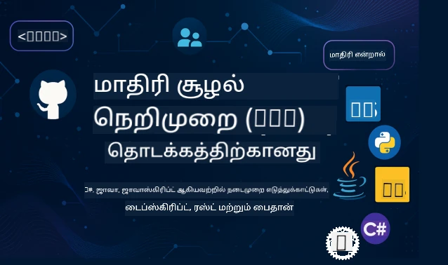

 

[](https://GitHub.com/microsoft/mcp-for-beginners/graphs/contributors)
[](https://GitHub.com/microsoft/mcp-for-beginners/issues)
[](https://GitHub.com/microsoft/mcp-for-beginners/pulls)
[](http://makeapullrequest.com)

[](https://GitHub.com/microsoft/mcp-for-beginners/watchers)
[](https://GitHub.com/microsoft/mcp-for-beginners/fork)
[](https://GitHub.com/microsoft/mcp-for-beginners/stargazers)


[](https://discord.gg/nTYy5BXMWG)

Follow these steps to get started using these resources:
1. **களஞ்சியத்தை பிளவு செய்க**: Click [](https://GitHub.com/microsoft/mcp-for-beginners/fork)
2. **களஞ்சியத்தை நகல் எடுக்கவும்**:   `git clone https://github.com/microsoft/mcp-for-beginners.git`
3. **சேரவும்** [](https://discord.gg/nTYy5BXMWG)


### 🌐 பன்மொழி ஆதரவு

#### GitHub செயல்பாட்டின் மூலம் ஆதரிக்கப்படுகிறது (தானியங்கி மற்றும் எப்போதும் புதுப்பிக்கப்பட்டது)

<!-- CO-OP TRANSLATOR LANGUAGES TABLE START -->
[Arabic](../ar/README.md) | [Bengali](../bn/README.md) | [Bulgarian](../bg/README.md) | [Burmese (Myanmar)](../my/README.md) | [Chinese (Simplified)](../zh-CN/README.md) | [Chinese (Traditional, Hong Kong)](../zh-HK/README.md) | [Chinese (Traditional, Macau)](../zh-MO/README.md) | [Chinese (Traditional, Taiwan)](../zh-TW/README.md) | [Croatian](../hr/README.md) | [Czech](../cs/README.md) | [Danish](../da/README.md) | [Dutch](../nl/README.md) | [Estonian](../et/README.md) | [Finnish](../fi/README.md) | [French](../fr/README.md) | [German](../de/README.md) | [Greek](../el/README.md) | [Hebrew](../he/README.md) | [Hindi](../hi/README.md) | [Hungarian](../hu/README.md) | [Indonesian](../id/README.md) | [Italian](../it/README.md) | [Japanese](../ja/README.md) | [Kannada](../kn/README.md) | [Khmer](../km/README.md) | [Korean](../ko/README.md) | [Lithuanian](../lt/README.md) | [Malay](../ms/README.md) | [Malayalam](../ml/README.md) | [Marathi](../mr/README.md) | [Nepali](../ne/README.md) | [Nigerian Pidgin](../pcm/README.md) | [Norwegian](../no/README.md) | [Persian (Farsi)](../fa/README.md) | [Polish](../pl/README.md) | [Portuguese (Brazil)](../pt-BR/README.md) | [Portuguese (Portugal)](../pt-PT/README.md) | [Punjabi (Gurmukhi)](../pa/README.md) | [Romanian](../ro/README.md) | [Russian](../ru/README.md) | [Serbian (Cyrillic)](../sr/README.md) | [Slovak](../sk/README.md) | [Slovenian](../sl/README.md) | [Spanish](../es/README.md) | [Swahili](../sw/README.md) | [Swedish](../sv/README.md) | [Tagalog (Filipino)](../tl/README.md) | [Tamil](./README.md) | [Telugu](../te/README.md) | [Thai](../th/README.md) | [Turkish](../tr/README.md) | [Ukrainian](../uk/README.md) | [Urdu](../ur/README.md) | [Vietnamese](../vi/README.md)

> **உள்ளூரில் நகல் எடுக்க விரும்புகிறீர்களா?**
>
> இந்தக் களஞ்சியத்தில் 50+ மொழி மொழிபெயர்ப்புகள் உள்ளன, இது பதிவிறக்க அளவை முக்கியமாக அதிகரிக்கிறது. மொழிபெயர்ப்புகள் இல்லாமல் நகல் எடுக்க, sparse checkout பயன்படுத்தவும்:
>
> **Bash / macOS / Linux:**
> ```bash
> git clone --filter=blob:none --sparse https://github.com/microsoft/mcp-for-beginners.git
> cd mcp-for-beginners
> git sparse-checkout set --no-cone '/*' '!translations' '!translated_images'
> ```
>
> **CMD (Windows):**
> ```cmd
> git clone --filter=blob:none --sparse https://github.com/microsoft/mcp-for-beginners.git
> cd mcp-for-beginners
> git sparse-checkout set --no-cone "/*" "!translations" "!translated_images"
> ```
>
> இது விரைவான பதிவிறக்கத்துடன் பாடநெறியை முடிக்க தேவையான அனைத்தையும் தருகிறது.
<!-- CO-OP TRANSLATOR LANGUAGES TABLE END -->

# 🚀 ஆரம்பதர மாணவர்களுக்கு மாதிரி சூழல் நடைமுறை (MCP) பாடத்திட்டம்

## **C#, Java, JavaScript, Rust, Python மற்றும் TypeScript மூலம் MCP-ஐ கைகோர்ந்த குறியீட்டு உதாரணங்களுடன் கற்றுக்கொள்ளுங்கள்**

## 🧠 மாதிரி சூழல் நடைமுறை பாடத்திட்டத்தின் மேற்பார்வை
மாதிரி சூழல் நடைமுறை (Model Context Protocol) பயணத்திற்கு உங்கள் வரவேற்பு! AI பயன்பாடுகள் வெவ்வேறு கருவிகள் மற்றும் சேவைகளுடன் எவ்வாறு தொடர்பு கொள்கின்றன என்று நீங்கள் எப்போதாவது ஆர்வமாயிருக்கின்றீர்களானால், அதன் நடிகைப் புரிதலை மாற்றி அமைக்கும் சோமார்த்தமான தீர்வை தற்போது கண்டுபிடிக்கப் போகிறீர்கள்.

MCP-ஐ AI பயன்பாடுகளுக்கான ஒரு உலகளாவிய மொழிபெயர்ப்பாளராக நினைக்கவும் — USB போர்ட்டுகள் எந்த சாதனத்தையும் உங்கள் கணினியில் இணைக்க உதவுவது போல, MCP AI மாதிரிகளுக்கு எந்த கருவி அல்லது சேவைக்கும் ஒரே விதமான முறையில் இணைக்க உதவுகிறது. நீங்கள் உங்கள் முதல் chatbot-ஐ உருவாக்குகிறீர்களா அல்லது சிக்கலான AI வேலைப்பாடுகளில் ஈடுபடுகிறீர்களா, MCP-ஐப் புரிந்துகொள்ளுதல் முழுமையான மற்றும் விரிவான பயன்பாடுகளை உருவாக்கும் சக்தியைக் கொடுக்கும்.

இந்த பாடத்திட்டம் உங்கள் கற்றல் பயணத்திற்கு பொறுமையும் கவனத்துடனும் வடிவமைக்கப்பட்டது. நீங்கள் முன்பே புரிந்து கொண்ட எளிய கருத்துக்களிலிருந்து ஆரம்பித்து, உங்கள் விருப்பமான நிரலாக்க மொழியில் கைகோர்ந்த பயிற்சியின் மூலம் உங்கள் திறமையை படிப்படியாக உருவாக்குவோம். ஒவ்வொரு படியும் தெளிவான விளக்கங்கள், நடைமுறை உதாரணங்கள் மற்றும் அதிக ஊக்கத்துடன் இருக்கும்.

இந்தப் பயணத்தை முடித்தபோது, நீங்கள் உங்கள் சொந்த MCP சேவையகங்களை உருவாக்குவதற்கும், பிரபலமான AI தளங்களுடன் இணைக்குவதற்கும், இந்த தொழில்நுட்பம் AI மேம்பாட்டின் எதிர்காலத்தை எப்படி மாற்றுகிறது என்பதைப் புரிந்துகொள்ள மிகவும் நம்பிக்கை கொண்டிருப்பீர்கள். இந்த அதிசயமான பயணத்தை ஒன்றாகத் துவங்குவோம்!

### அதிகாரப்பூர்வ ஆவணங்கள் மற்றும் தொழிற்பட்டிகள்

இந்த பாடத்திட்டம் **MCP தொழிற்பட்டி 2025-11-25** (சமீபத்திய நிலையான வெளியீடு) உடன் இணக்கமாக உள்ளது. MCP தொழிற்பட்டி தேதிப்பா் பதிப்பீடு (YYYY-MM-DD வடிவில்) பயன்படுத்தி தெளிவான நடைமுறை பதிப்பு கண்காணிப்பை உறுதிசெய்கிறது.

> **எதிர்கால நோக்கு:** அடுத்த தொழிற்பட்டி பதிப்பு **2026-07-28**-க்கான வெளியீட்டு வேட்பாளரை, ஜூலை 28, 2026 அன்று வெளியிட திட்டமிடப்பட்டுள்ளது. இது பரிமாற்ற அடுக்கில் நிலைத்தன்மையில்லாததாக(protocol stateless) அமைக்கிறது, விரிவாக்கங்கள்(Extensions) கட்டமைப்பை( MCT Apps, பணிகள்) அதிகாரமாக்குகிறது, அங்கீகாரத்தை உறுதி செய்கிறது மற்றும் ரூட்ஸ், சாம்பிளிங் மற்றும் பதிவு செய்வதை(Logging) சுருக்குகிறது. முழுமையான உடைப்புக்காக [MCP-இல் மாற்றங்கள்: 2026-07-28 வெளியீட்டு வேட்பாளர்](./01-CoreConcepts/mcp-2026-07-28-release-candidate.md) பக்கத்தைப் பார்க்கவும்.

இந்த வளங்கள் உங்கள் புரிதல் வளரும்போதே அதிக மதிப்புடனாக மாறும், ஆனால் உடனடி படிப்பதற்குப் பதற வேண்டாம். முதலில் உங்களுக்கு அதிக ஆர்வமான பகுதிகளிலிருந்து தொடங்குங்கள்!
- 📘 [MCP ஆவணங்கள்](https://modelcontextprotocol.io/) – படிப்பதற்கான படிகள் மற்றும் பயனர் வழிகாட்டிகள் கொண்ட உங்கள் முதன்மை வளமாக இது உள்ளது. ஆவணங்கள் துவக்கத்தரங்கள் கவனத்தில் கொண்டு எழுதப்பட்டு, தெளிவான உதாரணங்களுடன் உங்களை வழிநடத்தும்.
- 📜 [MCP தொழிற்பட்டி](https://modelcontextprotocol.io/specification/2025-11-25) – இதனை உங்கள் விரிவான குறிப்பு மய்யமாக எண்ணிக்கொள்ளலாம். பாடத்திட்டத்தில் வேலை செய்யும் போது, நீங்கள் குறிப்பிட்ட விவரங்களைப் பார்க்கவும், மேம்பட்ட சிறப்பம்சங்களை ஆராயவும் இங்கே திரும்பி வருவீர்கள்.
- 📜 [MCP தொழிற்பட்டி பதிப்பு](https://modelcontextprotocol.io/specification/versioning) – இதில் நடைமுறை பதிப்பு வரலாறு மற்றும் எவ்வாறு MCP தேதிப்பா் பதிப்பீட்டை பயன்படுத்துகிறதனின் தகவல்கள் உள்ளன (YYYY-MM-DD வடிவம்).
- 🧑‍💻 [MCP GitHub களஞ்சியம்](https://github.com/modelcontextprotocol) – இங்கு பல நிரலாக்க மொழிகளில் SDKகள், கருவிகள் மற்றும் குறியீடு மாதிரிகள் உள்ளன. நடைமுறை உதாரணங்களும் ஆன்லைனும் பயன்படுத்தக்கூடிய கூறுகளும் கொண்ட ஒரு பொக்கிஷக் கொள்அஞ்சியமாக இது உள்ளது.
- 🌐 [MCP சமுதாயம்](https://github.com/orgs/modelcontextprotocol/discussions) – MCP பற்றி விவாதங்களுக்காக மற்ற கற்றவர்களும் அனுபவமீனரும் சேர்ந்திருக்கும் இடம். கேள்விகள் வரவேற்கப்படுகின்றன மற்றும் அறிவியல் சுதந்திரமாக பகிரப்படுகிறது.

## கற்றல் நோக்கங்கள்

இந்த பாடத்திட்டத்தை முடிப்பதற்குப் பின்னர், நீங்கள் புதிய திறமைகளால் நம்பிக்கை மற்றும் உற்சாகம் கொண்டிருப்பீர்கள். நீங்கள் பெறப்போகும் திறன்கள்:

• **MCP அடிப்படைகளை புரிந்து கொள்**: மாதிரி சூழல் நடைமுறை என்ன மற்றும் அது AI பயன்பாடுகள் எப்படி இணைந்து செயல்படுவதை மாற்றுகிறது என்பதை விளக்கங்களும் வழக்குகளும் கொண்டு புரிந்து கொள்வீர்கள்.

• **உங்கள் முதல் MCP சர்வரை கட்டமைக்கு**: உங்கள் விருப்ப நிரலாக்க மொழியில் ஒரு வேலை செய்யும் MCP சர்வரை உருவாக்க, எளிய உதாரணங்களுடன் தொடங்கி படி படியாக உங்கள் திறனை மேம்படுத்துவீர்கள்.

• **AI மாதிரிகளை உண்மையான கருவிகளுக்கு இணைப்பு**: AI மாதிரிகளுக்கும் உண்மையான சேவைகளுக்கும் இடையே பாலம் அமைப்பது எப்படி என்பதை கற்றுக் கொண்டு, உங்கள் பயன்பாடுகளுக்கு பல்துறை திறன்களை கொடுப்பீர்கள்.

• **பாதுகாப்பு சிறந்த நடைமுறைகளை செயல்படுத்தவும்**: உங்கள் MCP செயலாக்கங்களை எப்படி பாதுகாப்பாக வைக்க வேண்டும் என்பதை புரிந்து கொண்டு, உங்கள் பயன்பாடுகளையும் பயனர்களையும் பாதுகாப்பீர்கள்.

• **நம்பிக்கையுடன் வெளியிடவும்**: வளர்ச்சி நிலை முதல் உற்பத்தி நிலை வரை உங்கள் MCP திட்டங்களை எவ்வாறு தள்ளுவதற்கு நடைமுறை ரீதியான திட்டங்களை சூழ்ச்சி செய்து செயல்படுத்துவது கற்றுக்கொள்வீர்கள்.

• **MCP சமுதாயத்தில் சேர்ந்துகொள்ளவும்**: AI பயன்பாடுகளை உருவாக்கும் எதிர்காலத்தை வடிவமைக்கும் வளர்ந்துவரும் உருவாக்குநர்களின் சமூகத்தின் ஒரு பகுதியாக மாறுவீர்கள்.

## அடிப்படைக் பின்னணி

MCP-க்கு நுழையாமல் முன் சில அடிப்படைக் கருத்துக்களை மீறல் செய்யலாம். இந்த விடயங்களில் நீங்கள் நிபுணர் இல்லாவிட்டாலும் கவலைப்பட வேண்டாம் - நாம் தேவையான எல்லாவற்றையும் உங்களுக்கு விளக்கிப் போகிறோம்!

### நடைமுறைகள் (Protocols) புரிதல் (அடித்தளம்)

நடைமுறை(protocol) என்பது உரையாடலுக்கான விதிகள் போன்று. நண்பரை அழைக்கும் போது, இருவரும் "வணக்கம்" என்று சொல்வது, உரையாடலில் முறைகேடா மாற்றமென உரிமையுடன் பேசும், முடிந்தபோது "பிரியாதிருங்கள்" என்பதுபோன்ற செய்கள் நாம் ஒப்புக்கொள்கிறோம். கணினி ப்ரோகிராம்களும் ஒவ்வொருவரும் விளக்கம் செய்கின்ற விதிகள் வேண்டும்.

MCP என்பது ஒரு நடைமுறை(protocol) – AI மாதிரிகள் மற்றும் பயன்பாடுகள் கருவிகள் மற்றும் சேவைகளுடன் விளைவாக "உரையாட அனுமதிக்கும் ஒப்புக்கொண்ட விதிகள் தொகுப்பு". மனித உரையாடல் நீடிக்க விதிகள் உதவும் முறையைப் போல, MCP AI பயன்பாடுகளுக்கான தொடர்பை நம்பகமாகவும் சக்திவாய்ந்த முறையாக்கிறது.

### கிளையன்ட்-சர்வர் உறவுகள் (ப்ரோகிராம்கள் எப்படி இணைக்கின்றன)

நீங்கள் தினமும் கிளையன்ட்-சர்வர் உறவுகளைப் பயன்படுத்திக்கொண்டிருக்கிறீர்கள்! வலை உலாவி (கிளையன்ட்) மூலம் ஒரு இணையதளத்தை பார்ப்பது என்பது, இணைய சர்வர் மூலம் பக்க உள்ளடக்கம் அனுப்பப்படவேண்டும் என்று கோருவது போன்றது. உலாவி எப்படி கேட்பது அறிந்திருக்கும், சர்வர் எப்படி பதிலளிக்கிறது என்பதும் தெரியும்.

MCP-இல் இதேபோல் AI மாதிரிகள் தகவல் அல்லது செயலைக் கேட்கும் கிளையன்ட் என்று நடந்து கொள்ளும், MCP சர்வர்கள் அந்த திறன்களை வழங்கும். இது AI வின் உதவியாளர் (சர்வர்) போல் செயல்படுகிறது.

### தரநிலைப்படுத்தல் ஏன் முக்கியம் (ஒருங்கிணைப்புக்கு உதவும்)

ஒவ்வொரு கார் உற்பத்தியாளரும் விதவிதமான எரிவாயு பம்புகளை பயன்படுத்தினால் எப்படி இருக்கும்? ஒவ்வொரு காத்துக்கு வேறொரு அடாப்டர் தேவைப்படும்! தரநிலைப்படுத்தல்(common standard) ஒற்றுமையான அணுகுமுறைகளை ஒப்புக்கொள்வது, காரியங்கள் இணைந்து செயல்பட உதவுகிறது.

MCP AI பயன்பாடுகளுக்கு இந்த தரநிலையை வழங்குகிறது. ஒவ்வொரு AI மாதிரியும் தனித்தனி குறியீடு எழுதாமல், MCP ஐ பயன்படுத்தி அனைத்து கருவிகளுடனும் எளிதாக தொடர்பு கொள்கிறது. இதனால் மென்பொருள் உருவாக்குவோர் ஒருமுறை கருவிகளை உருவாக்கி பல AI அமைப்புகளுடன் செயல்படுத்தக் கூடியதாக மாறுகிறார்கள்.

## 🧭 உங்கள் கற்றல் பாதை மேற்பார்வை

உங்கள் MCP பயணம் படிப்படியாக உங்கள் நம்பிக்கை மற்றும் திறன்களை வளர்க்க கவனமாக வடிவமைக்கப்பட்டுள்ளது. ஒவ்வொரு கட்டத்தாலும் புதிய கருத்துக்களையும் கடந்ததை ஊக்குவிக்கும் முறையையும் பரிமாறுகிறது.

### 🌱 அடித்தளம் கட்டம்: அடிப்படைகளைப் புரிந்துகொள் (கட்டங்கள் 0-2)

இது உங்கள் சாகசம் துவங்கும் இடம்! MCP கருத்துக்களை உங்களுக்குபரிச்சலான ஒப்புக்களுடன் மற்றும் எளிய உதாரணங்களுடன் அறிமுகப்படுத்துகிறோம். MCP என்றால் என்ன, அது ஏன் வேண்டும், AI வளர்ச்சியுடன் எப்படி பொருந்துகிறது என்பதை நீங்கள் புரிந்துகொள்வீர்கள்.

• **கட்ட 0 - MCP அறிமுகம்**: MCP என்பது என்ன என்பது மற்றும் இது நவீன AI பயன்பாடுகளுக்கு எவ்வாறு மிக முக்கியமானது என்பதை ஆராய்ந்து தொடங்குவோம். MCP செயல்படுத்து உண்மையான உலகுக்கான உதாரணங்களுடன் காண்பிப்போம் மேலும் உருவாக்குநர்களைக் கடந்து வரும் பொதுவான சிக்கல்களை எவ்வாறு அது தீர்க்கிறது என்பதை புரிந்துகொள்வீர்கள்.
• **மொட்யூல் 1 - முக்கிய கருத்துக்கள் விளக்கம்**: இங்கே நீங்கள் MCP இன் அடிப்படை கட்டுமானத் தளங்களை கற்றுக்கொள்வீர்கள். இந்த கருத்துக்கள் இயல்பானதும் புரிந்துகொள்ளக் கூடியதும் ஆக இருக்க பல அனலைஜிகள் மற்றும் காட்சிப்படுத்தும் உதாரணங்களைப் பயன்படுத்துகிறோம்.

• **மொட்யூல் 2 - MCP இல் பாதுகாப்பு**: பாதுகாப்பு உள்மயமாக இருக்கக் கூடும், ஆனால் MCP உடன் உள்ள காப்பாற்றும் அம்சங்களை நாம் உங்களுக்கு காட்டி, உங்கள் பயன்பாடுகளை தொடக்கமே பாதுகாக்கும் சிறந்த நடைமுறைகளை கற்றுக்கொடுக்கிறோம்.

### 🔨 கட்டுமான நிலை: உங்கள் முதல் நடைமுறைகளை உருவாக்குதல் (மொட்யூல் 3)

இப்பொழுது உண்மையான சுவை ஆரம்பமாகிறது! நீங்கள் நேரடியாக MCP சேவையகங்கள் மற்றும் கிளையன்ட்களை கட்டியமைக்கும் அனுபவத்தைப் பெறுவீர்கள். கவலைப்பட வேண்டாம் - எளிமையாகத் தொடங்கி, ஒவ்வொரு படியையும் வழிகாட்டுவோம்.

இந்த மோட்யூலில் பல நேரடி வழிகாட்டிகள் உள்ளன, அவை நீங்கள் விரும்பும் நிரல்முறை மொழியில் பிரயாசிப்பதற்கு உதவுகின்றன. உங்கள் முதல் சேவையகத்தை உருவாக்கி, அதை இணைக்க ஒரு கிளையன்ட்டையும் கட்டுவீர்கள், மேலும் VS Code போன்ற பிரபல மேம்பாட்டு கருவிகளோடு ஒருங்கிணைப்பீர்கள்.

ஒவ்வொரு வழிகாட்டியும் முழுமையான குறியீட்டு உதாரணங்கள், சிக்கல் தீர்க்கும் குறிப்புகள் மற்றும் குறிப்பிட்ட வடிவமைப்பு தேர்வுகளின் விளக்கங்களைக் கொண்டுள்ளது. இந்த கட்டுமான நிலையின் முடிவில், நீங்கள் பெருமையுடன் பயன்படுத்தக்கூடிய MCP நடைமுறைகளைப் பெற்றிருக்கலாம்!

### 🚀 வளர்ச்சி நிலை: மேம்பட்ட கருத்துக்கள் மற்றும் நிஜ உலக பயன்பாடு (மொட்யூல்கள் 4-5)

அடிப்படைகளை கையாள்ந்த பின், MCP இன் மேம்பட்ட அம்சங்களை ஆராய தயாராகுங்கள். நடைமுறை செயன்முறை திட்டங்கள், பிழைதிருத்த குறிப்பு முறைகள் மற்றும் பலவகை AI ஒருங்கிணைப்பு போன்ற மேம்பட்ட தலைப்புகளை நாம் எடுத்துக்கொள்வோம்.

MCP நடைமுறைகளைப் பெருக்கி உற்பத்தி பயன்பாட்டிற்காக பரிமாற்றுவது மற்றும் Azure போன்ற மேகவலைப்பாசரிகளில் ஒருங்கிணைப்பது ஆகியவற்றையும் கற்றுக்கொள்வீர்கள். இந்த மோட்யூல்கள் உண்மையான உலக தேவைகளை கையாளக்கூடிய MCP தீர்வுகளை உருவாக்க உங்களைத் தயாராக்குகின்றன.

### 🌟 கவிஞர் நிலை: சமூகமும் துறைகளிலும் சிறப்பு (மொட்யூல்கள் 6-11)

இறுதிப் படி MCP சமூகத்தில் சேர்ந்திடும் மற்றும் உங்களுக்கு மிகவும் ஆர்வமுள்ள துறைகளில் சிறப்பு படைக்கும் சூழலை கவனிக்கிறது. நீங்கள் திறந்த மூல MCP திட்டங்களுக்கு செய்யும் பங்களிப்பு முறைகள், மேம்பட்ட அங்கீகார மாதிரிகள் மற்றும் முழுமையான தரவுத்தள ஒருங்கிணைப்புச் சாதனங்களை கட்டமைத்தல் ஆகியவை கற்றுக்கொள்வீர்கள்.

மொட்யூல் 11 சிறப்பு குறிப்பிடத்தக்கது - இது PostgreSQL ஒருங்கிணைப்புடன் உற்பத்தி இனிய MCP சேவையகங்களை கட்ட விடும் 13-அறை நேரடி கற்றல் பாதை. இது நீங்கள் கற்றுக்கொண்ட அனைத்தையும் இணைக்கும் ஒரு தலைசீட்டு திட்டம் போன்றது!

### 📚 முழுமையான பாடத்திட்ட அமைப்பு

| Module | தலைப்பு | விளக்கம் | இணையத்தளம் |
|--------|---------|------------|------------|
| **மொட்யூல் 0-3: அடிப்படைகள்** | | | |
| 00 | MCP அறிமுகம் | Model Context Protocol மற்றும் அதன் AI குழாய்களில் முக்கியத்துவம் | [மேலும்அறிவது](./00-Introduction/README.md) |
| 01 | முக்கிய கருத்துக்கள் விளக்கம் | MCP இன் முக்கிய கருத்துக்களின் விரிவான ஆய்வு | [மேலும்அறிவது](./01-CoreConcepts/README.md) |
| 1.1 | MCP இல் என்ன மாறுகிறது (2026-07-28 RC) | மாநிலங்கடந்த முறையின்மை, விரிவாக்கத் தளம் மற்றும் அடுத்த குறிப்பாக்கத்தில் அம்ச நினைவிரதிகள் | [வழிகாட்டி](./01-CoreConcepts/mcp-2026-07-28-release-candidate.md) |
| 02 | MCP இல் பாதுகாப்பு | பாதுகாப்பு மிரட்டல்கள் மற்றும் சிறந்த நடைமுறைகள் | [மேலும்அறிவது](./02-Security/README.md) |
| 03 | MCP உடன் தொடக்கம் | சுற்றுப்புற அமைப்புகள், அடிப்படை சேவையகங்கள்/கிளையன்ட்கள், ஒருங்கிணைப்பு | [மேலும்அறிவது](./03-GettingStarted/README.md) |
| **மொட்யூல் 3: உங்கள் முதல் சேவையகமும் கிளையன்டும் கட்டமைத்தல்** | | | |
| 3.1 | முதல் சேவையகம் | உங்கள் முதல் MCP சேவையகத்தை உருவாக்கவும் | [வழிகாட்டி](./03-GettingStarted/01-first-server/README.md) |
| 3.2 | முதல் கிளையன்ட் | அடிப்படை MCP கிளையன்டை வளர்த்தல் | [வழிகாட்டி](./03-GettingStarted/02-client/README.md) |
| 3.3 | LLM உடன் கிளையன்ட் | பெரிய மொழி மாதிரிகளுடன் ஒருங்கிணைத்தல் | [வழிகாட்டி](./03-GettingStarted/03-llm-client/README.md) |
| 3.4 | VS Code ஒருங்கிணைப்பு | VS Code இல் MCP சேவையகங்களை பயன்படுத்துதல் | [வழிகாட்டி](./03-GettingStarted/04-vscode/README.md) |
| 3.5 | stdio சேவையகம் | stdio போக்குவரத்தில் சேவையகங்களை உருவாக்குதல் | [வழிகாட்டி](./03-GettingStarted/05-stdio-server/README.md) |
| 3.6 | HTTP பாய்ச்சல் | MCP இல் HTTP பாய்ச்சலை நடைமுறைபடுத்தல் | [வழிகாட்டி](./03-GettingStarted/06-http-streaming/README.md) |
| 3.7 | Microsoft Foundry கருவி தொகுப்பு | MCP உடன் Microsoft Foundry கருவி தொகுப்பை பயன்படுத்துதல் | [வழிகாட்டி](./03-GettingStarted/07-aitk/README.md) |
| 3.8 | சோதனை | உங்கள் MCP சேவையக நடைமுறையை சோதனை செய்தல் | [வழிகாட்டி](./03-GettingStarted/08-testing/README.md) |
| 3.9 | பயன்பாட்டாக்கல் | MCP சேவையகங்களை உற்பத்திக்கு வெளியீடு செய்தல் | [வழிகாட்டி](./03-GettingStarted/09-deployment/README.md) |
| 3.10 | மேம்பட்ட சேவையக பயன்பாடு | மேம்பட்ட அம்ச பயன்பாடு மற்றும் சிறந்த கட்டமைப்புக்கான மேம்பட்ட சேவையகங்களை பயன்படுத்துதல் | [வழிகாட்டி](./03-GettingStarted/10-advanced/README.md) |
| 3.11 | எளிய அங்கீகாரம் | தொடக்கம் முதல் அங்கீகாரம் மற்றும் RBAC கற்றுக்கொடுக்கும் அத்தியாயம் | [வழிகாட்டி](./03-GettingStarted/11-simple-auth/README.md) |
| 3.12 | MCP ஹோஸ்ட்கள் | Claude Desktop, Cursor, Cline மற்றும் பிற MCP ஹோஸ்ட்களை அமைத்தல் | [வழிகாட்டி](./03-GettingStarted/12-mcp-hosts/README.md) |
| 3.13 | MCP இன்ஸ்பெக்டர் | இன்ஸ்பெக்டர் கருவி மூலம் MCP சேவையகங்களை பிழைத்திருத்தம் மற்றும் சோதனை செய்தல் | [வழிகாட்டி](./03-GettingStarted/13-mcp-inspector/README.md) |
| 3.14 | மாதிரிம்பு | கிளையன்டுடன் ஒத்துழைக்க மாதிரிம்பைப் பயன்படுத்துதல் | [வழிகாட்டி](./03-GettingStarted/14-sampling/README.md) |
| 3.15 | MCP ஆப்புகள் | MCP ஆப்புகளை கட்டமைத்தல் | [வழிகாட்டி](./03-GettingStarted/15-mcp-apps/README.md) |
| **மொட்யூல் 4-5: நடைமுறை மற்றும் மேம்பட்டது** | | | |
| 04 | நடைமுறை நடைமுறை | SDK கள், பிழைதிருத்தம், சோதனை, மறுகையாளக்கூடிய பொறுப்பு முறைகள் | [மேலும்அறிவது](./04-PracticalImplementation/README.md) |
| 4.1 | பக்கவழு | கோரிக்கை முடிவுகளைிருந்து பெரிய தொகுதிகளை கையாள cursor-அடிப்படையிலான பக்கவழு | [வழிகாட்டி](./04-PracticalImplementation/pagination/README.md) |
| 05 | MCP இல் மேம்பட்ட தலைப்புகள் | பலவகை AI, பரிமாணம், நிறுவன பயன்பாடு | [மேலும்அறிவது](./05-AdvancedTopics/README.md) |
| 5.1 | Azure ஒருங்கிணைப்பு | Azure உடன் MCP ஒருங்கிணைப்பு | [வழிகாட்டி](./05-AdvancedTopics/mcp-integration/README.md) |
| 5.2 | பலவகை | பலவகை முறைகளோடு பணியாற்றுதல் | [வழிகாட்டி](./05-AdvancedTopics/mcp-multi-modality/README.md) |
| 5.3 | OAuth2 டெமோ | OAuth2 அங்கீகாரத்தை நடைமுறைப்படுத்துதல் | [வழிகாட்டி](./05-AdvancedTopics/mcp-oauth2-demo/README.md) |
| 5.4 | மூல அணைகள் | மூல அணைகள் புரிதல் மற்றும் நடைமுறைப்படுத்தல் | [வழிகாட்டி](./05-AdvancedTopics/mcp-root-contexts/README.md) |
| 5.5 | வழிச்செலுத்தல் | MCP வழிச்செலுத்தல் கொள்கைகள் | [வழிகாட்டி](./05-AdvancedTopics/mcp-routing/README.md) |
| 5.6 | மாதிரிம்பு | MCP இல் மாதிரிம்பு முறைகள் | [வழிகாட்டி](./05-AdvancedTopics/mcp-sampling/README.md) |
| 5.7 | பரிமாணம் | MCP நடைமுறைகளை பரிமாணம் செய்தல் | [வழிகாட்டி](./05-AdvancedTopics/mcp-scaling/README.md) |
| 5.8 | பாதுகாப்பு | மேம்பட்ட பாதுகாப்பு பரிசீலனைகள் | [வழிகாட்டி](./05-AdvancedTopics/mcp-security/README.md) |
| 5.9 | வலை தேடல் | வலை தேடல் திறன்களை நடைமுறைப்படுத்தல் | [வழிகாட்டி](./05-AdvancedTopics/web-search-mcp/README.md) |
| 5.10 | நேரடி பாய்ச்சல் | நேரடி பாய்ச்சல் செயல்பாட்டை கட்டமைத்தல் | [வழிகாட்டி](./05-AdvancedTopics/mcp-realtimestreaming/README.md) |
| 5.11 | நேரடி தேடல் | நேரடி தேடலை நடைமுறைப்படுத்தல் | [வழிகாட்டி](./05-AdvancedTopics/mcp-realtimesearch/README.md) |
| 5.12 | Entra ID அங்கீகாரம் | Microsoft Entra ID உடன் அங்கீகாரம் | [வழிகாட்டி](./05-AdvancedTopics/mcp-security-entra/README.md) |
| 5.13 | Foundry ஒருங்கிணைப்பு | Microsoft Foundry உடன் ஒருங்கிணைத்தல் | [வழிகாட்டி](./05-AdvancedTopics/mcp-foundry-agent-integration/README.md) |
| 5.14 | சூழல் பொறியியல் | செயல்பாட்டுள்ள சூழல் பொறியியல் முறைகள் | [வழிகாட்டி](./05-AdvancedTopics/mcp-contextengineering/README.md) |
| 5.15 | MCP தனிப்பயன் போக்குவரத்து | தனிப்பயன் போக்குவரத்து நடைமுறைகள் | [வழிகாட்டி](./05-AdvancedTopics/mcp-transport/README.md) |
| 5.16 | நெறிமுறை அம்சங்கள் | முன்னேற்ற அறிவிப்புகள், ரத்துச்செய்தல், வள வடிவ templates | [வழிகாட்டி](./05-AdvancedTopics/mcp-protocol-features/README.md) |
| 5.17 | எதிர்ப்பு பல-செயலாளர் கருதுகோள் | இரண்டு செயலாளர்கள் பங்காளி MCP கருவிகளைப் பயன்படுத்தி எதிர்மறை கோணங்களை விவாதிக்கின்றனர், நியாயஸ்தர் செயலாளர் மதிப்பீடு செய்கிறார் | [வழிகாட்டி](./05-AdvancedTopics/mcp-adversarial-agents/README.md) |
| **மொட்யூல் 6-10: சமூகமும் சிறந்த நடைமுறைகளும்** | | | |
| 06 | சமூக பங்களிப்புகள் | MCP சூழலை எவ்வாறு பங்களிப்பது | [வழிகாட்டி](./06-CommunityContributions/README.md) |
| 07 | முன்னோடியின் அனுபவங்கள் | உண்மையான உலக நடைமுறை கதைகள் | [வழிகாட்டி](./07-LessonsfromEarlyAdoption/README.md) |
| 08 | MCP சிறந்த நடைமுறைகள் | செயல்திறன், வீண்பிழைகள் சகிப்பு, உறுதிப்பற்றுத்தன்மை | [வழிகாட்டி](./08-BestPractices/README.md) |
| 09 | MCP வழக்கு ஆய்வுகள் | நடைமுறை செயல்பாட்டு உதாரணங்கள் | [வழிகாட்டி](./09-CaseStudy/README.md) |
| 10 | நேரடி பணிமனை | Microsoft Foundry கருவியுடன் MCP சேவையக கட்டுமானம் | [பயிற்சி](./10-StreamliningAIWorkflowsBuildingAnMCPServerWithAIToolkit/README.md) |
| **மொட்யூல் 11: MCP சேவையக நேரடி பயிற்சி அறைகள்** | | | |
| 11 | MCP சேவையக தரவுத்தள ஒருங்கிணைப்பு | PostgreSQL ஒருங்கிணைப்பிற்கு முழுமையான 13-அறை நேரடி கற்றல் பாதை | [பயிற்சிகள்](./11-MCPServerHandsOnLabs/README.md) |
| 11.1 | அறிமுகம் | தரவுத்தள ஒருங்கிணைப்பு மற்றும் சில்லறை பகுப்பாய்வு பயன்பாட்டுடன் MCP உடன் அறிமுகம் | [பயிற்சி 00](./11-MCPServerHandsOnLabs/00-Introduction/README.md) |
| 11.2 | முக்கிய கட்டமைப்பு | MCP சேவையக கட்டமைப்பு, தரவுத்தள படிகள் மற்றும் பாதுகாப்பு மாதிரிகள் புரிதல் | [பயிற்சி 01](./11-MCPServerHandsOnLabs/01-Architecture/README.md) |
| 11.3 | பாதுகாப்பு மற்றும் பல-வாடிக்கையாளர் | வரிசை மட்ட பாதுகாப்பு, அங்கீகாரம் மற்றும் பல-வாடிக்கையாளர் தரவு அணுகல் | [பயிற்சி 02](./11-MCPServerHandsOnLabs/02-Security/README.md) |
| 11.4 | சுற்றுப்புற அமைப்பு | மேம்பாட்டு சுற்றுப்புற அமைப்பு, Docker, Azure வளங்கள் | [பயிற்சி 03](./11-MCPServerHandsOnLabs/03-Setup/README.md) |
| 11.5 | தரவுத்தள வடிவமைப்பு | PostgreSQL அமைப்பு, சில்லறை கள நிரல் வடிவமைப்பு மற்றும் மாதிரி தரவு | [பயிற்சி 04](./11-MCPServerHandsOnLabs/04-Database/README.md) |
| 11.6 | MCP சேவையக நடைமுறை | தரவுத்தள ஒருங்கிணைப்புடன் FastMCP சேவையக கட்டுமானம் | [பயிற்சி 05](./11-MCPServerHandsOnLabs/05-MCP-Server/README.md) |
| 11.7 | கருவி மேம்பாடு | தரவுத்தள கேள்வி கருவிகள் மற்றும் நிரல் நடைபெறும் பார்வையிடல் உருவாக்குதல் | [பயிற்சி 06](./11-MCPServerHandsOnLabs/06-Tools/README.md) |
| 11.8 | செமாண்டிக் தேடல் | Azure OpenAI மற்றும் pgvector உடன் வெக்டர் செருகல்கள் நடைமுறைப்படுத்தல் | [பயிற்சி 07](./11-MCPServerHandsOnLabs/07-Semantic-Search/README.md) |
| 11.9 | சோதனை மற்றும் பிழைதிருத்தல் | சோதனை முறைகள், பிழைதிருத்தக் கருவிகள் மற்றும் ஒப்புதல் அணுகுமுறைகள் | [பயிற்சி 08](./11-MCPServerHandsOnLabs/08-Testing/README.md) |
| 11.10 | VS Code ஒருங்கிணைப்பு | VS Code MCP ஒருங்கிணைப்பு மற்றும் AI உரையாடல் பயன்பாடு அமைத்தல் | [பயிற்சி 09](./11-MCPServerHandsOnLabs/09-VS-Code/README.md) |
| 11.11 | பயன்பாட்டாக்கல் முறைகள் | Docker பயன்பாட்டாக்கல், Azure கன்டெய்னர் ஆப்ஸ், மற்றும் பரிமாண கவனிப்புகள் | [பயிற்சி 10](./11-MCPServerHandsOnLabs/10-Deployment/README.md) |
| 11.12 | கண்காணித்தல் | பயன்பாட்டு பார்வைகள், பதிவேட்டல், செயல்திறன் கண்காணித்தல் | [பயிற்சி 11](./11-MCPServerHandsOnLabs/11-Monitoring/README.md) |
| 11.13 | சிறந்த நடைமுறைகள் | செயல்திறன் மேம்பாடு, பாதுகாப்பு வலுப்படுத்தல் மற்றும் உற்பத்தி குறிப்பு | [பயிற்சி 12](./11-MCPServerHandsOnLabs/12-Best-Practices/README.md) |
| **மொட்யூல் 12: MCP கருவிகள்** | | | |
| 12.1 | கருவிகள் | Copilot ஆப்பில் MCP பயன்பாடு | [வழிகாட்டி](./12-tooling/README.md) |

### 💻 மாதிரி குறியீட்டு திட்டங்கள்

MCP கற்றலின் மிகவும் ஆர்வமுள்ள பகுதிகளில் ஒன்று உங்கள் குறியீட்டு திறன்கள் ஒட்டுமொத்தமாக வளர்ப்பது. எங்கள் குறியீட்டு உதாரணங்கள் எளிமையாகத் தொடங்கி, உங்கள் புரிதல் ஆழமாகும் போதே மேம்பட்டதாக வளரும் வகையில் வடிவமைக்கப்பட்டுள்ளன. இங்கே நாம் கருத்துக்களை எவ்வாறு அறிமுகப்படுத்துகிறோம் - புரிந்துகொள்ள எளிதான ஆனால் உண்மையான MCP கோட்பாடுகளை வெளிப்படுத்தும் குறியீடு, இது இந்தக் குறியீடு என்ன செய்கிறது என்பதைக் காண்பிக்கும் மட்டும் அல்ல, ஏன் இப்படி கட்டமைக்கப்பட்டுள்ளது என்பதையும், அது பெரிய MCP பயன்பாடுகளுக்குள் எப்படி பொருந்துகிறது என்பதையும் விளக்கும்.

#### அடிப்படை MCP கணக்கிடும் மாதிரிகள்

| மொழி | விளக்கம் | இணைப்பு |
|-------|----------|---------|
| C# | MCP சேவையக உதாரணம் | [குறியீடு பார்க](./03-GettingStarted/samples/csharp/README.md) |
| ஜாவா | MCP கணக்கிடியாளர் | [குறியீடு பார்க](./03-GettingStarted/samples/java/calculator/README.md) |
| JavaScript | MCP டெமோ | [View Code](./03-GettingStarted/samples/javascript/README.md) |
| Python | MCP சர்வர் | [View Code](../../03-GettingStarted/samples/python/mcp_calculator_server.py) |
| TypeScript | MCP உதாரணம் | [View Code](./03-GettingStarted/samples/typescript/README.md) |
| Rust | MCP உதாரணம் | [View Code](./03-GettingStarted/samples/rust/README.md) |

#### மேம்பட்ட MCP செயலாக்கங்கள்

| மொழி | விளக்கம் | இணைப்பு |
|----------|-------------|------|
| C# | மேம்பட்ட உதாரணம் | [View Code](./04-PracticalImplementation/samples/csharp/README.md) |
| ஸ்பிரிங் உடன் ஜாவா | கன்டெய்னர் செயலி உதாரணம் | [View Code](./04-PracticalImplementation/samples/java/containerapp/README.md) |
| JavaScript | மேம்பட்ட உதாரணம் | [View Code](./04-PracticalImplementation/samples/javascript/README.md) |
| Python | கடினமான செயலாக்கம் | [View Code](./04-PracticalImplementation/samples/python/README.md) |
| TypeScript | கன்டெய்னர் உதாரணம் | [View Code](./04-PracticalImplementation/samples/typescript/README.md) |


## 🎯 MCP கற்றலுக்கான முன்னுரிமைகள்

இந்த பாடத்திட்டத்திலிருந்து மிக அதிக பலனை பெற, நீங்கள் கீழ்க்காணும் திறன்களை பெற்றிருக்க வேண்டும்:

- குறைந்தது ஒரு பின்வரும் மொழிகளில் நிரலாக்க அடிப்படை அறிவு: C#, Java, JavaScript, Python, அல்லது TypeScript
- கிளையன்ட்-சர்வர் மாதிரி மற்றும் API களைப் புரிந்துகொள்ளல்
- REST மற்றும் HTTP கருத்துகளை அறிதல்
- (விருப்பம்) AI/ML கருத்துக்களில் பின்பினைப்பினர்

- ஆதரவுக்காக நமது சமூக பேச்சுவார்த்தைகளுக்கு இணைவு பெறுதல்

## 📚 படிப்பு வழிகாட்டி மற்றும் வளங்கள்

இந்த கோப்பகம் வழிவகுக்கும் மற்றும் பயிற்சியடைய உதவும் பல வளங்களை கொண்டுள்ளது:

### படிப்பு வழிகாட்டி

ஒரு விரிவான [படிப்பு வழிகாட்டி](./study_guide.md) இந்தக் கோப்பகத்தை சிறப்பாக வழிநடத்த உதவுகிறது. இந்த காட்சி பாடத்திட்ட வரைப்பது அனைத்து தலைப்புகளும் எப்படி இணைக்கப்பட்டுள்ளன என்பதை காட்டுகிறது மற்றும் மாதிரி திட்டங்களை எப்படி பயன்படுத்துவது என்பதில் வழிகாட்டுகிறது. பெரிய காட்சியை பார்க்க விரும்புகின்ற காட்சி கற்றுபவர்கள் யாருக்கு இது மிகவும் உதவியாக இருக்கும்.

வழிகாட்டியில் அடங்கும்:
- அனைத்து தலைப்புகளையும் காட்டும் காட்சி பாடத்திட்ட வரைபடம்
- ஒவ்வொரு கோப்பக பகுதியின் விரிவான ரீதிப்பகுப்பு
- மாதிரி திட்டங்களைப் பயன்படுத்துவதற்கான வழிகாட்டுதல்
- வேறுபட்ட திறன் நிலைகளுக்கான பரிந்துரைக்கப்பட்ட கற்றல் பாதைகள்
- உங்கள் கற்றல் பயணத்தை பூர்த்தி செய்ய கூடுதல் வளங்கள்

### மாற்று குறிப்புகள்

மாற்றங்களுக்கு ஒரு விரிவான [மாற்று குறிப்புகள்](./changelog.md) நாங்கள் பராமரிக்கின்றோம், இது பாடத்திட்டத் தரவுகளின் அனைத்து முக்கிய புதுப்பிப்புகளையும் பதிவு செய்கிறது, எனவே நீங்கள் சமீபத்திய மேம்பாடுகள் மற்றும் சேர்க்கல்களை பின்தொடரலாம்.
- புதிய உள்ளடக்கச் சேர்க்கைகள்
- அமைப்புச் மாற்றங்கள்
- அம்ச மேம்பாடுகள்
- ஆவணப்படுத்தல் புதுப்பிப்புகள்

## 🛠️ இந்த பாடத்திட்டத்தை விளைவாக பயன்படுத்துவது எப்படி

இந்த வழிகாட்டியில் ஒவ்வொரு பாடத்திலும்:

1. MCP கருத்துக்களின் தெளிவான விளக்கங்கள்  
2. பல மொழிகளில் நேரடி குறியீடு உதாரணங்கள்  
3. உண்மையான MCP செயலிகளில் கட்டமைக்கும் பயிற்சிகள்  
4. மேம்பட்ட கற்றலுக்கான கூடுதல் வளங்கள்

### C# உடன் MCP கற்றுக்கொள்ளல் - பாட தொடர்
மாடல் கான்டெக்ஸ் புரோட்டோக்கால் (MCP) பற்றி கற்றுக்கொள்வோம், இது AI மாடல்கள் மற்றும் கிளையன்ட் செயலிகளுக்கு இடையிலான தொடர்பை ஒழுங்குபடுத்த வடிவமைக்கப்பட்ட முன்னோடியான கட்டமைப்பு. இந்த ஆரம்ப நிலை அமர்வின் மூலம் MCP ஐ அறிமுகப்படுத்தி, உங்கள் முதல் MCP சர்வரை உருவாக்குவதில் வழிகாட்டுவோம்.
#### C#: [https://aka.ms/letslearnmcp-csharp](https://aka.ms/letslearnmcp-csharp)
#### Java: [https://aka.ms/letslearnmcp-java](https://aka.ms/letslearnmcp-java)
#### JavaScript: [https://aka.ms/letslearnmcp-javascript](https://aka.ms/letslearnmcp-javascript)
#### Python: [https://aka.ms/letslearnmcp-python](https://aka.ms/letslearnmcp-python)

## 🎓 உங்கள் MCP பயணம் ஆரம்பமாகிறது

வாழ்த்துக்கள்! நீங்கள் இப்போது உங்கள் நிரலாக்க திறன்களை விரிவாக்கும் மற்றும் AI மேம்பாட்டின் முன்னோடியோடு இணைக்கும் ஒரு சுவாரஸ்யமான பயணத்தின் முதற்தட்டைப் பெற்றுள்ளீர்கள்.

### நீங்கள் ஏற்கனவே சாதித்துள்ளதென்ன?

இந்த அறிமுகத்தை வாசிப்பதன் மூலம், நீங்கள் ஏற்கனவே உங்கள் MCP அறிவுத் தளத்தை கட்டியெடுத்து ஆரம்பித்துள்ளீர்கள். MCP என்ன, அது ஏன் முக்கியம், மற்றும் இந்த பாடத்திட்டம் உங்கள் கற்றல் பயணத்தை எப்படிப் பறிப்பு செய்வதைக் கற்றுக்கொண்டுள்ளீர்கள். இது ஒரு முக்கிய சாதனை மற்றும் இந்த முக்கிய தொழில்நுட்பத்துக்கான உங்கள் நிபுணத்துவத்தின் தொடக்கம்.

### எதிர்கால சவால்கள்

நீங்கள் பாடத்திட்டங்கள் வழியாக முன்னேறும் போது, ஒவ்வொரு நிபுணனும் ஒருநாளிலும் ஒரு ஆரம்பநிலை கற்றுக்கொண்டவர் என்பதை நினைவில் வையுங்கள். இப்போது கடினமாக தோன்றும் கருத்துக்கள் பயிற்சியுடன் இரண்டாம் இயல்பாக மாறும். ஒவ்வொரு சிறிய படியும் உங்கள் வளர்ச்சிக்கான சக்திவாய்ந்த திறன்களை கட்டமைக்கும்.

### உங்கள் ஆதரவு நெட்வொர்க்

நீங்கள் MCP குறித்து ஆர்வமுள்ள கற்றல் மற்றும் நிபுணர்களின் சமுதாயத்தில் சேர்கிறீர்கள், மற்றவர்களின் வெற்றிக்காக உதவி செய்ய ஆர்வமாக உள்ளவர்கள். நீங்கள் குறியீடு சவால்களில் சிக்கினால் அல்லது ஒரு முன்னேற்றத்தைப் பகிர விரும்பினாலும், இந்த சமுதாயம் உங்கள் பயணத்திற்கு உதவ தயாராக உள்ளது.

AI செயலிகள் கட்டொடுக்கும் போது சிக்கல் அல்லது கேள்விகள் இருந்தால், MCP குறித்து பேசும் உங்கள் சக கற்றல் குழுவினருடன் இணைவதற்கான இடம் இது. இது கேள்விகள் வரவேற்கப்படும் மற்றும் அறிவு சுதந்திரமாக பகிரப்படும் ஊட்டச்சத்திரமான சமுதாயம்.

[](https://discord.gg/nTYy5BXMWG)

தயாரிப்பு பின்னூட்டங்கள் அல்லது பிழைகள் ஏற்பட்டால் பின்வரும் தளத்திற்கு செல்லவும்:

[](https://aka.ms/foundry/forum)

### ஆரம்பிக்க தயாரா?

உங்கள் MCP பயணம் இப்போது துவங்குகிறது! உங்கள் முதல் MCP அனுபவங்களுக்காக Module 0யுடன் தொடங்கவும், அல்லது நீங்கள் என்ன கட்டுமென மாதிரி திட்டங்களை ஆராயவும். நினைவில் வையுங்கள் - எல்லா நிபுணர்களும் இப்போது நீங்கள் இருக்கிற அந்த நிலையிலிருந்து துவங்கினர், பொறுமையும் பயிற்சியுடன் நீங்கள் எட்டக்கூடியதை பகிர்வதற்கு பெரிதும் அடையாளமிடுவீர்கள்.

மாடல் கான்டெக்ஸ் புரோட்டோக்கால் மேம்பாட்டின் உலகிற்கு வரவேற்பு. ஒன்றாக அற்புதமான ஒன்றை கட்டுவோம்!

## 🤝 கற்றல் சமூகத்திற்கு பங்களிப்பு

இந்த பாடத்திட்டம் உங்கள் போன்ற கற்றல் ஆர்வலர்களின் பங்களிப்பால் வலுவடைகிறது! உங்கள் பிழைக்குத்திருத்தம், தெளிவான விளக்கம்சொற்சொற்கள், அல்லது புதிய உதாரணச் சேர்க்கைகளாக இருக்கலாம், உங்கள் பங்களிப்புகள் மற்ற ஆரம்பநிலை பயனாளர்களின் வெற்றிக்காக உதவும்.

Microsoft மதிப்பிடப்பட்ட தொழில்நுட்ப வல்லுநர் [Shivam Goyal](https://www.linkedin.com/in/shivam2003/) அவர்களுக்கு குறியீடு உதாரணங்களுக்கு நன்றி.

பங்களிப்பு செயல்முறை வரவேற்கும் மற்றும் ஆதரவளிக்கும் வகையில் வடிவமைக்கப்பட்டுள்ளது. பெரும்பாலான பங்களிப்புகள் ஒரு பங்களிப்பாளர் உரிமம் ஏற்பாடு (CLA) கோரப்படும்போது, தானியங்கி கருவிகள் உங்களை வழிமுறைகளுடன் வழிநடத்தும்.

## 📜 திறந்த மூல கற்றல்

இந்த முழு பாடத்திட்டம் MIT [LICENSE](../../LICENSE) கீழ் கிடைக்கிறது, அதனால் நீங்கள் இதனை பயன்படுத்தி, திருத்தி, மற்றும் பகிரலாம். இது உலகமெங்கிலும் உள்ள டெவலப்பர்களுக்கு MCP அறிவை அணுகக்கூடியதாக்கும் எங்கள் பணியை ஆதரிக்கும்.
## 🤝 பங்களிப்பு வழிகாட்டிகள்

இந்த திட்டம் பங்களிப்புகளையும் பரிந்துரைகளையும் வரவேற்கிறது. பெரும்பாலான பங்களிப்புகளுக்கு Contributor License Agreement (CLA) ஏற்று உங்களிடம் அந்த பங்களிப்பை பயன்படுத்த உரிமை உள்ளது என்று உறுதிப்படுத்த வேண்டியிருக்கும். விரிவுகளுக்கு <https://cla.opensource.microsoft.com> பார்க்கவும்.

நீங்கள் ஒரு pull request சமர்ப்பிக்கும்போது, CLA பாட்டொகுப்பு உங்களுக்கு CLA வழங்கவேண்டுமா என தானாக தீர்மானித்து PRக்கு தேவையான குறியீடுகளுடன் அலங்கரிக்கிறது (எ.கா., நிலை சரிபார்ப்பு, கருத்து). பாட்டின் வழங்கும் வழிமுறைகளை பின்பற்றவும். இது எல்லா CLA பயன்படுத்தும் களஞ்சியங்களுக்கும் ஒருமுறை மட்டுமே செய்ய வேண்டும்.

இந்த திட்டம் [Microsoft Open Source Code of Conduct](https://opensource.microsoft.com/codeofconduct/) ஐ ஏற்றுக்கொண்டுள்ளது.
நிதான தகவலுக்கு [Code of Conduct FAQ](https://opensource.microsoft.com/codeofconduct/faq/) பார்க்கவும் அல்லது [opencode@microsoft.com](mailto:opencode@microsoft.com) ஐ தொடர்புகொள்ளவும்.

---

*உங்கள் MCP பயணத்தை துவங்க தயாரா? [Module 00 - MCP அறிமுகம்](./00-Introduction/README.md) உடன் துவங்கி Model Context Protocol மேம்பாட்டின் உலகில் உங்கள் முதல் படிகளை எடுத்து செல்லுங்கள்!*


## 🎒 பிற பாடங்கள்
எங்கள் குழு பிற பாடங்களையும் உருவாக்குகிறது! பார்த்தீர்களா:

<!-- CO-OP TRANSLATOR OTHER COURSES START -->
### LangChain
[](https://aka.ms/langchain4j-for-beginners)
[](https://aka.ms/langchainjs-for-beginners?WT.mc_id=m365-94501-dwahlin)
[](https://github.com/microsoft/langchain-for-beginners?WT.mc_id=m365-94501-dwahlin)
---

### Azure / Edge / MCP / Agents
[](https://github.com/microsoft/AZD-for-beginners?WT.mc_id=academic-105485-koreyst)
[](https://github.com/microsoft/edgeai-for-beginners?WT.mc_id=academic-105485-koreyst)
[](https://github.com/microsoft/mcp-for-beginners?WT.mc_id=academic-105485-koreyst)
[](https://github.com/microsoft/ai-agents-for-beginners?WT.mc_id=academic-105485-koreyst)

---
 
### உருவாக்கும் AI தொடர்
[](https://github.com/microsoft/generative-ai-for-beginners?WT.mc_id=academic-105485-koreyst)
[-9333EA?style=for-the-badge&labelColor=E5E7EB&color=9333EA)](https://github.com/microsoft/Generative-AI-for-beginners-dotnet?WT.mc_id=academic-105485-koreyst)
[-C084FC?style=for-the-badge&labelColor=E5E7EB&color=C084FC)](https://github.com/microsoft/generative-ai-for-beginners-java?WT.mc_id=academic-105485-koreyst)
[-E879F9?style=for-the-badge&labelColor=E5E7EB&color=E879F9)](https://github.com/microsoft/generative-ai-with-javascript?WT.mc_id=academic-105485-koreyst)

---
 
### கோர் கற்றல்
[](https://aka.ms/ml-beginners?WT.mc_id=academic-105485-koreyst)
[](https://aka.ms/datascience-beginners?WT.mc_id=academic-105485-koreyst)
[](https://aka.ms/ai-beginners?WT.mc_id=academic-105485-koreyst)
[](https://github.com/microsoft/Security-101?WT.mc_id=academic-96948-sayoung)
[](https://aka.ms/webdev-beginners?WT.mc_id=academic-105485-koreyst)
[](https://aka.ms/iot-beginners?WT.mc_id=academic-105485-koreyst)
[](https://github.com/microsoft/xr-development-for-beginners?WT.mc_id=academic-105485-koreyst)

---
 
### கோபைலட் தொடர்
[](https://aka.ms/GitHubCopilotAI?WT.mc_id=academic-105485-koreyst)
[](https://github.com/microsoft/mastering-github-copilot-for-dotnet-csharp-developers?WT.mc_id=academic-105485-koreyst)
[](https://github.com/microsoft/CopilotAdventures?WT.mc_id=academic-105485-koreyst)
<!-- CO-OP TRANSLATOR OTHER COURSES END -->

---

<!-- CO-OP TRANSLATOR DISCLAIMER START -->
**மறுப்பு**:
இந்த ஆவணம் AI மொழிபெயர்ப்பு சேவை [Co-op Translator](https://github.com/Azure/co-op-translator) பயன்படுத்தி மொழிபெயர்க்கப்பட்டுள்ளது. நாங்கள் துல்லியத்திற்காக முயற்சி செய்துள்ளோம், ஆனால் தானாக செய்யப்படும் மொழிபெயர்ப்புகளில் பிழைகள் அல்லது தவறுகள் இருக்கலாம் என்பதை கவனத்தில் கொள்ளவும். அசல் ஆவணம் அதன் தாய்மொழியில் அதிகாரப்பூர்வ ஆதாரமாக கருதப்பட வேண்டும். முக்கியமான தகவல்களுக்கு, தொழில்நுட்பமான மனித மொழிபெயர்ப்பு பரிந்துரைக்கப்படுகிறது. இந்த மொழிபெயர்ப்பைப் பயன்படுத்துவதால் ஏற்படும் எந்த தவறான புரிதல்கள் அல்லது தவறான விளக்கத்திற்கும் நாங்கள் பொறுப்பில்வில்லை.
<!-- CO-OP TRANSLATOR DISCLAIMER END -->