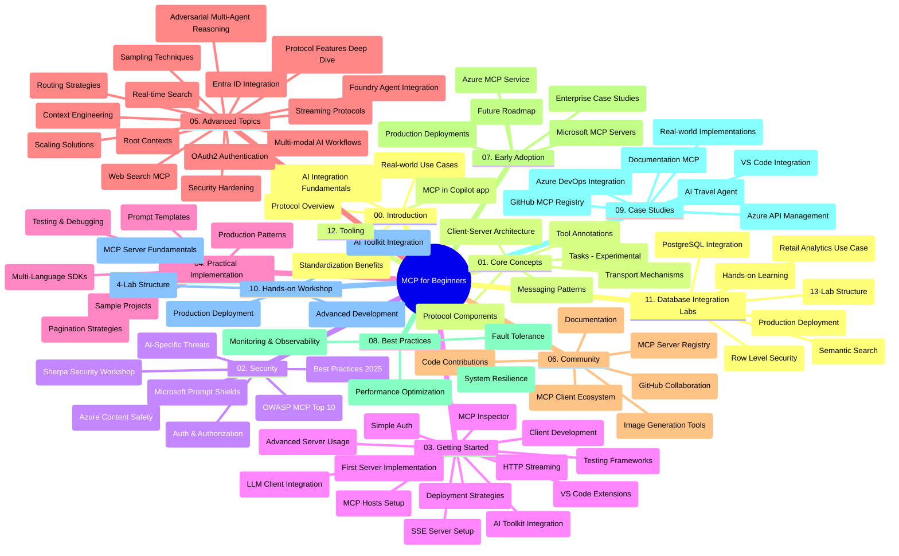

# தொடக்கம் கற்க MCP (Model Context Protocol) - படிப்புக்கான வழிகாட்டி  

இந்நிலை வழிகாட்டி "தொடக்கம் கற்க MCP (Model Context Protocol)" பாடத்திட்டத்திற்கு தேவையான குறியீடு அமைப்பும் உள்ளடக்கமும் பற்றிய மேலோட்டத்தை வழங்குகிறது. இந்த வழிகாட்டியை பயன்படுத்திக் கொண்டு இந்தக் குறியீடு அமைப்பை சீரிய முறையில் ஆராய்ந்து, கிடைக்கும் வளங்களை முழுமையாக பயன்படுத்துங்கள்.  

## குறியீடு அமைப்பின் மேலோட்டம்  

Model Context Protocol (MCP) என்பது AI மாதிரிகளும் வாடிக்கையாளர் செயலிகளும் இடையேயான தொடர்புக்கான ஒழுங்குமுறை அமைப்பாகும். முதலில் Anthropic உருவாக்கிய MCP, இப்போது அதிகாரப்பூர்வ GitHub அமைப்பின் மூலம் பெரிய MCP சமூகத்தால் பராமரிக்கப்படுகிறது. இந்தக் குறியீடு தொகுப்பு C#, Java, JavaScript, Python மற்றும் TypeScript போன்ற மொழிகளில் அமைகூடிய நடைமுறை குறியீட்டுக்கான பாடத்திட்டத்தினை வழங்குகிறது. இது AI அபிவிருத்தியாளர்கள், அமைப்பு நிபுணர்கள் மற்றும் மென்பொருள் பொறியாளர்களுக்கானது.  

## காட்சி பாடத்திட்ட வரைபடம்  

  
## குறியீடு அமைப்பு  

இந்தக் குறியீடு தொகுப்பு MCP-இன் பல்வேறு அம்சங்களைத் திறம்பட கையாளுமாறு பன்னிரு முக்கிய பிரிவுகளாக அமைக்கப்பட்டுள்ளது:  

1. **அறிமுகம் (00-Introduction/)**  
   - Model Context Protocol (MCP) உடன் மேலோட்டத் தொகுப்பு  
   - AI கருவிகளில் ஒழுங்குமுறை ஏன் அவசியம்  
   - நடைமுறை பயன்பாடுகள் மற்றும் நன்மைகள்  

2. **முக்கிய கருத்துக்கள் (01-CoreConcepts/)**  
   - கிளையண்ட்-சர்வர் கட்டமைப்பு  
   - முக்கிய ஒத்துழைப்பு கூறுகள்  
   - MCPல் செய்தி பரிமாற்ற முறைகள்  
   - தற்போதைய விவரக்குறிப்பு: [MCP இல் என்ன மாற்றம் ஏற்பட்டுள்ளது: 2026-07-28 விவரக்குறிப்பு](./01-CoreConcepts/mcp-2026-07-28.md) — நிலைத்தன்மையற்ற ஒத்துழைப்பு நுழுவாய், விரிவாக்க அமைப்பு, மற்றும் Roots/Sampling/Logging நீக்கங்கள்  

3. **பாதுகாப்பு (02-Security/)**  
   - MCP அடிப்படையிலான அமைப்புகளின் பாதுகாப்பு ஆபத்துகள்  
   - பாதுகாப்பை உறுதிப்படுத்த சிறந்த நடைமுறைகள்  
   - அங்கீகாரம் மற்றும் அங்கீகாரப்படுத்தல் யுக்திகள்  
   - பயிற்சி கையேடு [CIMD மற்றும் DCR அங்கீகார உதாரணம்](./02-Security/samples/cimd-dcr-auth/README.md)  
   - **தெளிவான பாதுகாப்பு ஆவணங்கள்**:  
     - MCP பாதுகாப்பு சிறந்த நடைமுறைகள்  
     - Azure உள்ளடக்க பாதுகாப்பு செயல்முறை கையேடு  
     - MCP பாதுகாப்பு கட்டுப்பாடுகள் மற்றும் நுட்பங்கள்  
     - MCP சிறந்த நடைமுறைகள் குறிப்பு  
   - **முக்கிய பாதுகாப்பு தலைப்புகள்**:  
     - விளம்பர ஊக்கம் மற்றும் கருவி விஷ வைப்புத் தாக்குதல்கள்  
     - அமர்வு களவாடுதல் மற்றும் குழப்பப்பட்ட டெப்பூ பிரச்சினைகள்  
     - டோக்கன் வழியாக உடன்கட்டி வன்முறை  
     - அதிகபட்ச அனுமதிகள் மற்றும் அணுகல் கட்டுப்பாடு  
     - AI கூறுகளுக்கான வழங்கல் சங்கிலி பாதுகாப்பு  
     - Microsoft விளம்பர கண்டைகளின் ஒருங்கிணைப்பு  

4. **தொடங்குதல் (03-GettingStarted/)**  
   - சூழல் அமைப்பு மற்றும் கட்டமைப்பு  
   - அடிப்படைக் MCP சர்வர்கள் மற்றும் கிளையண்ட் உருவாக்கம்  
   - முன்னிருந்த செயலிகளுடன் ஒருங்கிணைப்பு  
   - இதுவகை பகுதிகள் அடங்கும்:  
     - முதல் சர்வர் நிறைவேற்றல்  
     - கிளையண்ட் அபிவிருத்தி  
     - LLM கிளையண்ட் ஒருங்கிணைப்பு  
     - VS Code ஒருங்கிணைப்பு  
     - சர்வர் அனுப்பும் நிகழ்வுகள் (SSE) சர்வர்  
     - முன்னேற்றப்பட்ட சர்வர் பயன்பாடு  
     - HTTP ஸ்ட்ரீமிங்  
     - AI கருவி தொகுப்பு ஒருங்கிணைப்பு  
     - சோதனை யுக்திகள்  
     - உருவாக்க முறை  

5. **நடைமுறை நிறைவேற்றல் (04-PracticalImplementation/)**  
   - வெவ்வேறு நிரலாக்க மொழிகளில் SDK பயன்படுத்துதல்  
   - பிழைத்திருத்தம், சோதனை, மற்றும் சரிபார்ப்பு முறைகள்  
   - மறுபயன்பாட்டு ஊக்க உரையாடல் வடிவகைகள் மற்றும் வேலைப்பாடுகள்  
   - செயலாக்க உதாரணங்களுடனான மாதிரிப் திட்டங்கள்  

6. **முன்னேற்றப்பட்ட தலைப்புகள் (05-AdvancedTopics/)**  
   - சூழல் பொறியியல் நுட்பங்கள்  
   - Foundry ஏஜெண்ட் ஒருங்கிணைப்பு  
   - பன்முறைகண AI வேலைப்பாடுகள்  
   - OAuth2 அங்கீகார அறிமுகங்கள்  
   - நேரடி தேடல் திறன்பாடுகள்  
   - நேரடி ஸ்ட்ரீமிங்  
   - Root சூழல்கள் நிறைவேற்றல்  
   - வழிமுறைகள்  
   - மாதிரியைத் தேர்வு செய்தல்  
   - பரிமாற்றப்படுத்தும் முறைகள்  
   - பாதுகாப்புக் கருத்துக்கள்  
   - Entra ID பாதுகாப்பு ஒருங்கிணைப்பு  
   - வலை தேடல் ஒருங்கிணைப்பு  
   - எதிர்ப்பார்ப்ப ஆய்வு பன்முக ஏஜெண்ட் விளக்கம் (வாதம் முறைகள்)  

7. **சமூக பங்களிப்புகள் (06-CommunityContributions/)**  
   - குறியீடு மற்றும் ஆவணங்களை பங்களிப்பது எப்படி  
   - GitHub மூலம் ஒருங்கிணைப்பு  
   - சமூக இயக்கிகள் மற்றும் கருத்துக் கூறல்கள்  
   - வெவ்வேறு MCP கிளையண்டுகளைப் பயன்படுத்துதல் (Claude Desktop, Cline, VSCode)  
   - புகழ்பெற்ற MCP சர்வர்களுடன் வேலை செய்வது, இதற்குப்பட்சமாக பிம்ப உருவாக்கம்  

8. **துவக்க வழக்குகள் (07-LessonsfromEarlyAdoption/)**  
   - செயல்பாட்டு செயலாக்கங்கள் மற்றும் வெற்றி கதைகள்  
   - MCP அடிப்படையிலான தீர்வுகள் கட்டமைத்தல் மற்றும் நிறைவேற்றல்  
   - முன்னேற்றம் மற்றும் எதிர்கால திட்டம்  
   - **Microsoft MCP சர்வர் கையேடு**: 10 தயாரிப்புக்கான Microsoft MCP சர்வர்களுக்கான முழுமையான கையேடு:  
     - Microsoft Learn Docs MCP சர்வர்  
     - Azure MCP சர்வர் (15+ சிறப்பு இணைப்பிகள்)  
     - GitHub MCP சர்வர்  
     - Azure DevOps MCP சர்வர்  
     - MarkItDown MCP சர்வர்  
     - SQL Server MCP சர்வர்  
     - Playwright MCP சர்வர்  
     - Dev Box MCP சர்வர்  
     - Microsoft Foundry MCP சர்வர்  
     - Microsoft 365 Agents Toolkit MCP சர்வர்  

9. **சிறந்த நடைமுறைகள் (08-BestPractices/)**  
   - செயல்திறன் மேம்பாடு மற்றும் ஒழுங்குபடுத்தல்  
   - தவறு சக்தி உடைந்த MCP அமைப்புகளை வடிவமைத்தல்  
   - சோதனை மற்றும் உறுதி முறைமைகள்  

10. **வழக்கியல் ஆய்வுகள் (09-CaseStudy/)**  
    - **ஏழு விரிவான வழக்கியல் ஆய்வுகள்** MCP பல உருவங்களைக் காட்டுகின்றன:  
    - **Azure AI பயண முகவர்கள்**: Azure OpenAI மற்றும் AI தேடலை பன்முக ஏஜெண்ட் ஒருங்கிணைப்பு  
    - **Azure DevOps ஒருங்கிணைப்பு**: YouTube தரவு புதுப்பிப்புகளுடன் செயல்முறை தானியங்கி  
    - **நேரடி ஆவணத் திரட்டுதல்**: Python கான்சோல் கிளையண்ட் HTTP ஸ்ட்ரீமிங்குடன்  
    - **இணைகை படிப்பதற்கான திட்ட வெளியீடு**: Chainlit வலை செயலி உரையாடல் AI உடன்  
    - **எடிட்டர் உள்ள ஆவணங்கள்**: VS Code ஒருங்கிணைப்பு GitHub Copilot வேலை செயலிகளுடன்  
    - **Azure API மேலாண்மை**: MCP சர்வர் உருவாக்கத்துடன் நிறுவன API ஒருங்கிணைப்பு  
    - **GitHub MCP பதிவு நிலையம்**: சூழல் வளர்ச்சி மற்றும் ஏஜெண்ட் இயல்பு ஒருங்கிணைப்பு  
    - நிறுவன ஒருங்கிணைப்பு, உருவாக்குநர் செயல்திறன் மற்றும் சூழல் வளர்ச்சியை உள்ளடக்கிய செயலாக்க உதாரணங்கள்  

11. **பயிற்சி கூடம் (10-StreamliningAIWorkflowsBuildingAnMCPServerWithAIToolkit/)**  
    - MCP மற்றும் AI கருவி தொகுப்பின் விரிவான பயிற்சி கூடம்  
    - AI மாதிரிகள் மற்றும் நடைமுறை கருவிகளை இணைத்து புத்திசாலி பயன்பாடுகளை உருவாக்குதல்  
    - அடிப்படைகள், சுயமான சர்வர் உருவாக்கம் மற்றும் தயாரிப்பு வடிவமைப்பு முறைகள் நிறைந்த நடைமுறை நிலைகள்  
    - **பயிற்சி கூடம் வடிவமைப்பு**:  
      - கூடம் 1: MCP சர்வர் அடிப்படைகள்  
      - கூடம் 2: முன்நிலை MCP சர்வர் உருவாக்கம்  
      - கூடம் 3: AI கருவி தொகுப்பு ஒருங்கிணைப்பு  
      - கூடம் 4: தயாரிப்பு நிறைவேற்றல் மற்றும் பரிமாண நிர்வாகம்  
    - படிமால் படியிடும் வழிமுறை  

12. **MCP சர்வர் தரவுத்தளம் இணைப்பு பயிற்சிகள் (11-MCPServerHandsOnLabs/)**  
    - தயாரிப்புக்குரிய MCP சர்வர்களை PostgreSQL இணைப்புடன் உருவாக்க 13-பயிற்சி பாதை  
    - Zava புதையல் பயன்பாட்டின் உண்மை உலக வர்த்தக பகுப்பாய்வு செயலாக்கம்  
    - நிறுவன தர எழுத்துக்கள்: வரிசை நிலை பாதுகாப்பு, பொருள் சார்ந்த தேடல், பன்முக வாடிக்கையாளர் தரவு அணுகல்  
    - **முழுமையான பயிற்சி வடிவமைப்பு**:  
      - **பயிற்சிகள் 00-03: அடிப்படைகள்** - அறிமுகம், கட்டமைப்பு, பாதுகாப்பு, சூழல் அமைப்பு  
      - **பயிற்சிகள் 04-06: MCP சர்வர் உருவாக்குதல்** - தரவுத்தளம் வடிவமைப்பு, MCP சர்வர் செயற்பாடு, கருவி உருவாக்கம்  
      - **பயிற்சிகள் 07-09: முன்னேற்ற அம்சங்கள்** - பொருள் தேடல், சோதனை மற்றும் பிழைத்திருத்தம், VS Code ஒருங்கிணைப்பு  
      - **பயிற்சிகள் 10-12: தயாரிப்பு மற்றும் சிறந்த நடைமுறைகள்** - உருவாக்கம், கண்காணிப்பு, மேம்பாடு  
    - **கவரப்பட்ட தொழில்நுட்பங்கள்**: FastMCP அமைப்பு, PostgreSQL, Azure OpenAI, Azure கொண்டெய்னர் செயலிகள், பயன்பாட்டு காணிப்புப் பண்டல்கள்  
    - **கற்றல் விளைவுகள்**: தயாரிப்புக்குரிய MCP சர்வர்கள், தரவுத்தளம் இணைப்பு முறைகள், AI மூலம் இயக்கப்படும் பகுப்பாய்வு, நிறுவன பாதுகாப்பு  

13. **கருவிமுறை (12-tooling/)**  
    - MCP ஐ Copilot செயலியில் மற்றும் பிற கருவிகளில் எப்படி பயன்படுத்துவது என்பதை கற்க  

## கூடுதல் வளங்கள்  

குறியீடு தொகுப்பில் பின்வரும் ஆதரவு வளங்கள் அடங்கியுள்ளன:  

- **படங்கள் கோப்பு**: பாடத்திட்டம் முழுவதும் பயன்படுத்தப்பட்ட வரைபடங்கள் மற்றும் விளக்கங்கள்  
- **மொழிபெயர்ப்புகள்**: ஆவணங்களுக்கான தானாக மொழிபெயர்க்கும் செலை தொடர்ச்சி  
- **அதிகாரப்பூர்வ MCP வளங்கள்**:  
  - [MCP ஆவணங்கள்](https://modelcontextprotocol.io/)  
  - [MCP விவரக்குறிப்பு](https://modelcontextprotocol.io/specification/2026-07-28/)  
  - [MCP GitHub குறியீடு](https://github.com/modelcontextprotocol)  

## இந்தக் குறியீடு தொகுப்பைப் பயன்படுத்த எப்படி  

1. **தொடர் கற்றல்**: கட்டுரைகளைக் கொடியான முறையில் (00 முதல் 11 வரை) பின்பற்றி நெறியமைக்கப்பட்ட கற்றலை அனுபவிக்கவும்.  
2. **மொழி சார்ந்த அதிருப்தி**: நீங்கள் விரும்பும் நிரலாக்க மொழியில் அமைகுள்ள নমுவாதிகளை ஆராயுங்கள்.  
3. **நடைமுறை நடை**: "தொடங்குதல்" பிரிவில் சூழலை அமைத்து, முதற்கட்ட MCP சர்வர் மற்றும் கிளையண்ட் உருவாக்கத் தொடங்குங்கள்.  
4. **மேம்பட்ட ஆராய்ச்சி**: அடிப்படைகளை நன்கு புரிந்து கொண்ட பின், முன்னேற்றப்பட்ட தலைப்புக்களில் மூழ்கி அறிவை விரிவுபடுத்துங்கள்.  
5. **சமூக உறவு**: GitHub விவாதங்களிலும் Discord சேனல்களிலும் MCP சமூகத்துடன் இணைந்து நிபுணர்களுடன் மற்றும் அவற்றுடன் பணியாளர்களுடன் தொடர்பு கொள்ளுங்கள்.  

## MCP கிளையண்டுகள் மற்றும் கருவிகள்  

பாடத்திட்டம் பல MCP கிளையண்டுகளையும் கருவிகளையும் கையாள்கிறது:  

1. **அதிகாரப்பூர்வ கிளையண்டுகள்**:  
   - Visual Studio Code  
   - Visual Studio Code இல் MCP  
   - Claude Desktop  
   - VSCode இல் Claude  
   - Claude API  

2. **சமூக கிளையண்டுகள்**:  
   - Cline (மருவணந்திரிணையாக)  
   - Cursor (குறியீடு தொகுப்பான்)  
   - ChatMCP  
   - Windsurf  

3. **MCP நிர்வாக கருவிகள்**:  
   - MCP CLI  
   - MCP மேலாளர்  
   - MCP இணைப்பாளர்  
   - MCP வழிமுறை  

## பிரபல MCP சர்வர்கள்  

இந்தக் குறியீடு தொகுப்பு பல MCP சர்வர்களை அறிமுகப்படுத்துகிறது, அதாவது:  

1. **அதிகாரப்பூர்வமான Microsoft MCP சர்வர்கள்**:  
   - Microsoft Learn Docs MCP சர்வர்  
   - Azure MCP சர்வர் (15+ சிறப்பு இணைப்பிகள்)  
   - GitHub MCP சர்வர்  
   - Azure DevOps MCP சர்வர்  
   - MarkItDown MCP சர்வர்  
   - SQL Server MCP சர்வர்  
   - Playwright MCP சர்வர்  
   - Dev Box MCP சர்வர்  
   - Microsoft Foundry MCP சர்வர்  
   - Microsoft 365 Agents Toolkit MCP சர்வர்  

2. **அதிகாரப்பூர்வ குறிப்புப் சர்வர்கள்**:  
   - கோப்பு அமைப்பு  
   - ஏற்று  
   - நினைவகம்  
   - தொடர்ச்சியான சிந்தனை  

3. **பட உருவாக்கம்**:  
   - Azure OpenAI DALL-E 3  
   - Stable Diffusion WebUI  
   - மீண்டும் உருவாக்குதல்  

4. **உருவாக்க கருவிகள்**:  
   - Git MCP  
   - மருவணந்திரிணை கட்டுப்பாடு  
   - குறியீடு உதவியாளர்  

5. **சிறப்பு சர்வர்கள்**:  
   - Salesforce  
   - Microsoft Teams  
   - Jira & Confluence  

## பங்களிப்பு  

இந்தக் குறியீடு தொகுப்பு சமுதாயத்தினரிடமிருந்து பங்களிப்புகளை வரவேற்கிறது. MCP சூழலில் சிறந்த பங்களிப்புக்கான வழிகாட்டி சமூக பங்களிப்பு பிரிவில் உள்ளது.  

----  

*இந்த படிப்புத் தொகுப்பு 2026 செப்டம்பர் 9 இல் சமீபத்தில் புதுப்பிக்கப்பட்டது. இது MCP  
விவரக்குறிப்பு `2026-07-28` இன் தற்போதைய கரு பிண்ணறிவை பிரதிபலிக்கிறது. சில நடைமுறை  
உதாரணங்கள் தெளிவாக `2025-11-25` பதிப்புக்குள் வரையறுக்கப்பட்டாலும், அவை SDK களும் கருவிகளும்  
நிலைத்தன்மையற்ற ஒத்துழைப்பு API களை பின்பற்றுகின்றன.*  

---

<!-- CO-OP TRANSLATOR DISCLAIMER START -->
**மறுப்பு**:
இந்த ஆவணம் AI மொழிபெயர்ப்பு சேவை [Co-op Translator](https://github.com/Azure/co-op-translator) பயன்படுத்தி மொழிபெயர்க்கப்பட்டுள்ளது. நாங்கள் துல்லியத்திற்காக முயற்சி செய்துள்ளோம், ஆனால் தானாக செய்யப்படும் மொழிபெயர்ப்புகளில் பிழைகள் அல்லது தவறுகள் இருக்கலாம் என்பதை கவனத்தில் கொள்ளவும். அசல் ஆவணம் அதன் தாய்மொழியில் அதிகாரப்பூர்வ ஆதாரமாக கருதப்பட வேண்டும். முக்கியமான தகவல்களுக்கு, தொழில்நுட்பமான மனித மொழிபெயர்ப்பு பரிந்துரைக்கப்படுகிறது. இந்த மொழிபெயர்ப்பைப் பயன்படுத்துவதால் ஏற்படும் எந்த தவறான புரிதல்கள் அல்லது தவறான விளக்கத்திற்கும் நாங்கள் பொறுப்பில்வில்லை.
<!-- CO-OP TRANSLATOR DISCLAIMER END -->