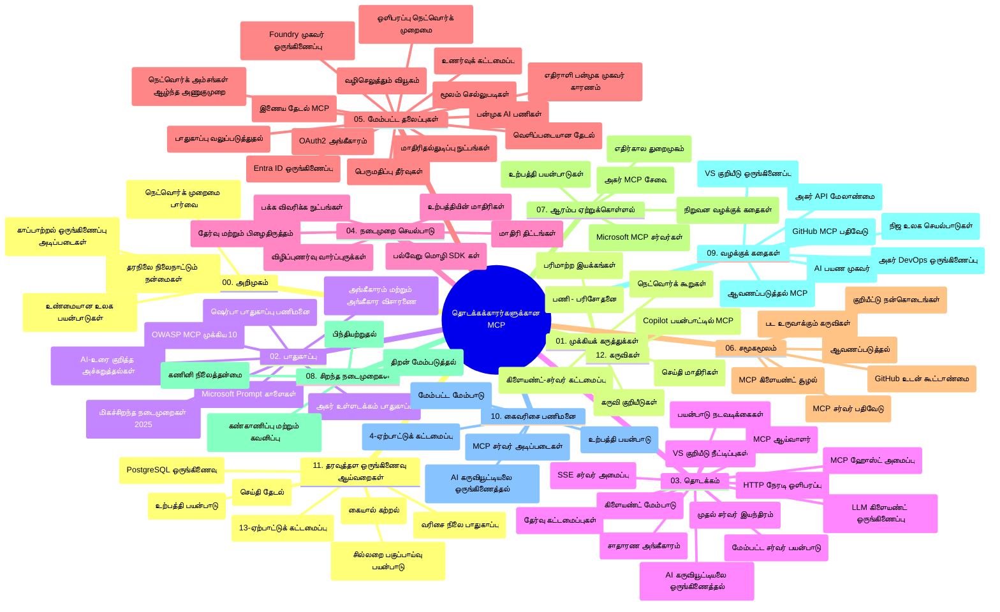

# தொடக்கத்தவர்களுக்கு மாதிரிக் சூழல் நெறிமுறை (MCP) - படிப்பு வழிகாட்டி

இந்த படிப்பு வழிகாட்டி "தொடக்கத்தவர்களுக்கு மாதிரிக் சூழல் நெறிமுறை (MCP)" பாடத்திட்டத்திற்கான நிரல் அமைப்பு மற்றும் உள்ளடக்கத்தின் ஒரு முன்னுரையை வழங்குகிறது. இந்த வழிகாட்டியை பயன்படுத்தி நிரலை திறம்படத் தேடுங்கள் மற்றும் கிடைக்கும் வளங்களை முழுமையாகப் பயன்படுத்திக் கொள்ளுங்கள்.

## நிரல் முன்னுரு

மாதிரிக் சூழல் நெறிமுறை (MCP) என்பது AI மாதிரிகள் மற்றும் கிளையண்ட் பயன்பாடுகளுக்கு இடையேயான பணியாற்றும் ஒன்றிணைந்த கட்டமைப்பாகும். முதலில் Anthropic உருவாக்கிய MCP இப்போது அதிகாரப்பூர்வ GitHub அமைப்பின் மூலம் பரவலான MCP சமூகத்தினரால் பராமரிக்கப்படுகிறது. இந்த நிரல் C#, Java, JavaScript, Python மற்றும் TypeScript ஆகிய மொழிகளில் பயன்படுத்தக்கூடிய கையடக்கக் குறியீடு உதாரணங்களுடன் கூடிய விரிவான பாடத்திட்டத்தை வழங்குகிறது, இது AI மேம்பாட்டாளர்கள், அமைப்பு அமைப்பாளர்கள் மற்றும் மென்பொருள் பொறியாளர்களுக்கானது.

## பார்வை பாடத்திட்ட வரைபடம்

## நிரல் அமைப்பு

இந்த நிரல் அரசி இரண்டு பத்தொன்பது முக்கிய பகுதிகளாக அமைக்கப்பட்டுள்ளது, ஒவ்வொன்றும் MCP இன் வெவ்வேறு அம்சங்களின் மீது கவனம் செலுத்துகிறது:

1. **அறிமுகம் (00-Introduction/)**
   - மாதிரிக் சூழல் நெறிமுறையின் மேலோட்டம்
   - AI பைப்லைன்களில் ஸ்டான்டர்டைசேஷன் ஏன் முக்கியம்
   - நடைமுறை பயன்பாடுகள் மற்றும் நன்மைகள்

2. **முகப்பு கருத்துகள் (01-CoreConcepts/)**
   - கிளையண்ட்-சர்வர் கட்டமைப்பு
   - முக்கிய நெறிமுறை கூறுகள்
   - MCP இல் செய்தி பரிமாற்ற மாதிரிகள்
   - எதிர்காலம் நோக்கி: [MCP இல் என்ன மாற்றம்: 2026-07-28 வெளியீட்டு வேட்கையாளர்](./01-CoreConcepts/mcp-2026-07-28-release-candidate.md) — நிலையற்ற நெறிமுறை முகப்பு, விரிவாக்கங்கள் கட்டமைப்பு மற்றும் அடுத்த அறிவுரையில் எதிர்பார்க்கப்படும் ரூட்ஸ்/சேம்பிளிங்/லோகிங் நீக்கம்

3. **பாதுகாப்பு (02-Security/)**
   - MCP அடிப்படையிலான அமைப்புகளில் பாதுகாப்பு பெரச்சல்கள்
   - அமல்படுத்தல்களுக்கு பாதுகாப்பு சிறந்த நடைமுறைகள்
   - அங்கீகாரம் மற்றும் அனுமதி யுத்த முறைகள்
   - **பருமையான பாதுகாப்பு ஆவணங்கள்**:
     - MCP பாதுகாப்பு சிறந்த நடைமுறைகள் 2025
     - Azure உள்ளடக்கம் பாதுகாப்பு செயலாக்கக் கையேடு
     - MCP பாதுகாப்பு கட்டுப்பாடுகள் மற்றும் நுட்பங்கள்
     - MCP சிறந்த நடைமுறைகள் விரைவு குறிப்புரை
   - **முக்கிய பாதுகாப்பு தலைப்புகள்**:
     - துருத்தல் குறுந்தகடு மற்றும் கருவி விசப்போகுதல்கள்
     - அமர்வு திருடுதல் மற்றும் குழப்பமான வழங்குநர் பிரச்சனைகள்
     - டோக்கன் கடத்தல் பலவீனங்கள்
     - கூடுதலான அனுமதிகள் மற்றும் அணுகல் கட்டுப்பாடு
     - AI கூறுகளுக்கான வழங்கல் சங்கிலி பாதுகாப்பு
     - Microsoft Prompt Shields ஒருங்கிணைப்பு

4. **தொடக்கம் (03-GettingStarted/)**
   - சூழல் அமைப்பு மற்றும் கட்டமைப்பு
   - அடிப்படை MCP சர்வர் மற்றும் கிளையண்ட் உருவாக்குதல்
   - தற்போதைய பயன்பாடுகளுடன் ஒருங்கிணைப்பு
   - பாகங்கள் உள்ளன:
     - முதலாவது சர்வர் செயல்படுத்தல்
     - கிளையண்ட் மேம்பாடு
     - LLM கிளையண்ட் ஒருங்கிணைப்பு
     - VS கோடு ஒருங்கிணைப்பு
     - சர்வர்-அனுப்பப்பட்ட நிகழ்வுகள் (SSE) சர்வர்
     - முன்னேறிய சர்வர் பயன்பாடு
     - HTTP ஸ்ட்ரீமிங்
     - AI கருவி தொகுப்பு ஒருங்கிணைப்பு
     - சோதனை முறைகள்
     - திட்டமிடல் வழிகாட்டிகள்

5. **நடவடிக்கை அமலாக்கம் (04-PracticalImplementation/)**
   - பல மொழிகளில் SDK களைப் பயன்படுத்துதல்
   - பிழைத்திருத்தம், சோதனை மற்றும் சரிபார்ப்பு நுட்பங்கள்
   - மீண்டும் பயன்படுத்தக்கூடிய முன்னேர்ச்சி மாதிரிகள் மற்றும் பணிவழிகள் வடிவமைத்தல்
   - செயலாக்க உதாரணங்களுடன் மாதிரிகள்

6. **முன்னேறிய தலைப்புகள் (05-AdvancedTopics/)**
   - சூழல் பொறியியல் நுட்பங்கள்
   - Foundry முகவர் ஒருங்கிணைப்பு
   - பல மாற்று AI பணிவழிகள்
   - OAuth2 அங்கீகாரம் போர்ட்டுகள்
   - நேரடி தேடல் திறன்கள்
   - நேரடி ஸ்ட்ரீமிங்
   - ரூட் சூழல்கள் செயல்படுத்தல்
   - வழிசெலுத்தல் தந்திரங்கள்
   - சேம்பிளிங் நுட்பங்கள்
   - அளவீட்டுக் கொள்கைகள்
   - பாதுகாப்பு கருத்துக்கள்
   - Entra ID பாதுகாப்பு ஒருங்கிணைப்பு
   - வலை தேடல் ஒருங்கிணைப்பு
   - எதிரியுள்ளபல முகவர் பரி்வாதிப்பு (வாத விளக்கங்கள்)

7. **சமூக பங்களிப்புகள் (06-CommunityContributions/)**
   - குறியீடு மற்றும் ஆவணத்தை எப்படி பங்களிக்க நேரம்
   - GitHub வழியாக ஒத்துழைப்பு
   - சமூக இயக்கப்பட்ட மேம்பாடுகள் மற்றும் பின்னூட்டங்கள்
   - பன்முக MCP கிளையண்ட்களை பயன்படுத்துதல் (Claude டெஸ்க்டாப், Cline, VSCode)
   - புகழ்பெற்ற MCP சர்வர்கள் உட்பட பணியாற்றல், படம் உருவாக்குதல் உட்பட

8. **ஆரம்ப ஏற்றுள்ளோரின் பாடங்கள் (07-LessonsfromEarlyAdoption/)**
   - நடைமுறை செயல்திறன்கள் மற்றும் வெற்றி கதைகள்
   - MCP அடிப்படையிலான தீர்வுகளைக் கட்டமைத்தல் மற்றும் முன்வைப்பது
   - பாணிகள் மற்றும் எதிர்கால திட்டக் கோவை
   - **Microsoft MCP சர்வர் வழிகாட்டி**: 10 உற்பத்திக்கு தயாரான Microsoft MCP சர்வர்களுக்கான விரிவான வழிகாட்டி, இதில்:
     - Microsoft Learn Docs MCP சர்வர்
     - Azure MCP சர்வர் (15+ சிறப்பு இணைப்பிகள்)
     - GitHub MCP சர்வர்
     - Azure DevOps MCP சர்வர்
     - MarkItDown MCP சர்வர்
     - SQL Server MCP சர்வர்
     - Playwright MCP சர்வர்
     - Dev Box MCP சர்வர்
     - Microsoft Foundry MCP சர்வர்
     - Microsoft 365 Agents Toolkit MCP சர்வர்

9. **சிறந்த நடைமுறைகள் (08-BestPractices/)**
   - செயல்திறன் மேம்பாடு மற்றும் ஒப்புமை
   - பிழை மதிப்பீடு கொண்ட MCP அமைப்புகளை வடிவமைத்தல்
   - சோதனை மற்றும் மீட்பு திட்டங்கள்

10. **வழக்குக்கூறுகள் (09-CaseStudy/)**
    - MCP பல்வேறு நீட்சியினைப் பிரதிபலிக்கும் **ஏழு விரிவான வழக்குக்கூறுகள்**:
    - **Azure AI பயண முகவர்கள்**: Azure OpenAI மற்றும் AI தேடல் இணைந்து பல முகவர்களையும் ஒருங்கிணைத்தல்
    - **Azure DevOps ஒருங்கிணைப்பு**: YouTube தரவு புதுப்பிப்புகளுடன் பணிவழி தானியங்கி செயல்பாடு
    - **நேரடி ஆவண மீட்புக்கான**: Python கன்சோல் கிளையண்ட் உடன் HTTP ஸ்ட்ரீமிங்
    - **பபலவழி படிப்பு திட்டம் உருவாக்கி**: Chainlit வலை பயன்பாடு உரையாடல் AI உடன்
    - **எடிட்டர் உள்ளே ஆவணங்கள்**: VS Code ஒருங்கிணைப்பு GitHub Copilot பணிவழிகளுடன்
    - **Azure API மேலாண்மை**: நிறுவன API ஒருங்கிணைப்பு MCP சர்வர் உருவாக்கத்துடன்
    - **GitHub MCP பதிவகம்**: சுற்றுச்சூழல் மேம்பாடு மற்றும் முகவர் ஒருங்கிணைப்பு தளம்
    - நிறுவன ஒருங்கிணைப்பு, மேம்பாட்டு திறன், சுற்றுச்சூழல் மேம்பாடு ஆகியவற்றை உள்ளடக்கிய செயலாக்க உதாரணங்கள்

11. **கையுடன் செய்யப்பட்ட பணிசாலை (10-StreamliningAIWorkflowsBuildingAnMCPServerWithAIToolkit/)**
    - MCP மற்றும் AI கருவி தொகுப்பின் ஒருங்கிணைப்புடன் விரிவான கையுடன் பணிசாலை
    - AI மாதிரிகளுடன் உலக நிகழ்வுகளை இணைக்கும் புத்திசாலி பயன்பாடுகளை கட்டமைத்தல்
    - அடிப்படைகள், தனிப்பயன் சர்வர் மேம்பாடு மற்றும் உற்பத்தி பிரயோக வழிகாட்டி களுடன் நடைமுறை தொகுதிகள்
    - **பணிசாலை அமைப்பு**:
      - பணிசாலை 1: MCP சர்வர் அடிப்படைகள்
      - பணிசாலை 2: முன்னேறிய MCP சர்வர் மேம்பாடு
      - பணிசாலை 3: AI கருவி தொகுப்பு ஒருங்கிணைப்பு
      - பணிசாலை 4: உற்பத்தி பிரயோகத்திற்கும் அளவீட்டுக்கும்
    - படிப்பதற்கான படி படிவழித்தடங்கள்

12. **MCP சர்வர் தரவுத்தள ஒருங்கிணைப்பு ஆய்வுகள் (11-MCPServerHandsOnLabs/)**
    - உற்பத்தி தயாரான MCP சர்வர்களை PostgreSQL ஒருங்கிணைப்புடன் கட்டியமைக்கும் **13 ஆய்வு பாதை முழுமையாக**
    - Zava Retail பயன்பாட்டைப் பயன்படுத்தி நன்கு நிகழும் சில்லறை இலக்கணம் செயலாக்கம்
    - நிறுவன தரநிலை வடிவங்களில் வரிசை மட்ட பாதுகாப்பு (RLS), அர்த்த தேடல் மற்றும் பல-குத்தகை தரவு அணுகல்
    - **முழுமையான ஆய்வுகளின் அமைப்பு**:
      - **ஆய்வுகள் 00-03: அடிப்படைகள்** - அறிமுகம், கட்டமைப்பு, பாதுகாப்பு, சூழல் அமைப்பு
      - **ஆய்வுகள் 04-06: MCP சர்வர் கட்டமைப்பு** - தரவுத்தள வடிவமைப்பு, MCP சர்வர் செயல்படுத்தல், கருவி மேம்பாடு
      - **ஆய்வுகள் 07-09: முன்னேறிய அம்சங்கள்** - அர்த்த தேடல், சோதனை மற்றும் பிழைத்திருத்தம், VS கோடு ஒருங்கிணைப்பு
      - **ஆய்வுகள் 10-12: உற்பத்தி மற்றும் சிறந்த நடைமுறைகள்** - விநியோகம், கண்காணிப்பு, மேம்பாடு
    - **பயன்படுத்தப்படும் தொழில்நுட்பங்கள்**: FastMCP கட்டமைப்பு, PostgreSQL, Azure OpenAI, Azure கன்டெய்னர் பயன்பாடுகள், பயன்பாட்டு பார்வைகள்
    - **கற்றல் முடிவுகள்**: உற்பத்தி தயாரான MCP சர்வர்கள், தரவுத்தள ஒருங்கிணைப்பு வடிவங்கள், AI இயக்கிய பகுப்பாய்வுகள், நிறுவன பாதுகாப்பு

13. **கருவிகள் (12-tooling/)**
    - Copilot பயன்பாடு மற்றும் பிற கருவிகளிலும் MCP ஐ எப்படி பயன்படுத்துவது என்பது கற்றல்

## கூடுதல் வளங்கள்

நிரல் ஆதரவு வளங்களை கொண்டுள்ளது:

- **படங்கள் கோப்புறை**: பாடத்திட்டத்தில் பயன்படுத்தப்படும் வரைபடங்கள் மற்றும் விளக்கங்கள்
- **மொழிபெயர்ப்புகள்**: ஆவணங்களின் பல மொழி ஆதரவுடன் தானியங்கி மொழிபெயர்ப்பு
- **அதிகாரப்பூர்வ MCP வளங்கள்**:
  - [MCP ஆவணங்கள்](https://modelcontextprotocol.io/)
  - [MCP விவரக்குறிப்பு](https://spec.modelcontextprotocol.io/)
  - [MCP GitHub நிரல்](https://github.com/modelcontextprotocol)

## இந்த நிரலை எவ்வாறு பயன்படுத்துவது

1. **Follow the chapters in order** (முதலில் 00 இலிருந்து 11 வரை வழிகாட்டப்பட்ட படிப்புக்கு பின்பற்றவும்).
2. **மொழி-முன்னுரிமை கொண்ட பார்வை**: உங்கள் விருப்ப மொழியில் செயலாக்க உதாரணங்களுக்கான மாதிரிக் கோப்புகளை ஆராயுங்கள்.
3. **நடைமுறை செயல்படுத்தல்**: "தொடக்கம்" பகுதியில் உங்கள் சூழலை அமைத்து முதலாவது MCP சர்வர் மற்றும் கிளையண்ட் உருவாக்குங்கள்.
4. **முன்னேறிய ஆராய்ச்சி**: அடிப்படைகள் பரிச்சயமாகிய பிறகு, முன்னேறிய தலைப்புகளில் உங்கள் அறிவை விரிவுப்படுத்துங்கள்.
5. **சமூகத் தொடர்பு**: MCP சமூகத்துடன் GitHub விவாதங்கள் மற்றும் Discord சேனல்களில் இணைக, நிபுணர்களோடு மற்றும் பிற மேம்பாட்டாளர்களோடு தொடர்பு கொள்ளுங்கள்.

## MCP கிளையண்ட்கள் மற்றும் கருவிகள்

பாடத்திட்டம் பல MCP கிளையண்ட்கள் மற்றும் கருவிகளைக் கலந்துகொள்கிறது:

1. **அதிகாரப்பூர்வ கிளையண்ட்கள்**:
   - Visual Studio Code
   - Visual Studio Code இல் MCP
   - Claude டெஸ்க்டாப்
   - VSCode இல் Claude
   - Claude API

2. **சமூக கிளையண்ட்கள்**:
   - Cline (டெர்மினல் அடிப்படையிலானது)
   - Cursor (குறியீடு ஆசிரியர்)
   - ChatMCP
   - Windsurf

3. **MCP மேலாண்மை கருவிகள்**:
   - MCP CLI
   - MCP மேலாளி
   - MCP இணைப்பாளர்
   - MCP வழிசெலுத்தி

## பிரபல MCP சர்வர்கள்

நிரல் பல MCP சர்வர்களை அறிமுகப்படுத்துகிறது, அதில்:

1. **அதிகார Microsoft MCP சர்வர்கள்**:
   - Microsoft Learn Docs MCP சர்வர்
   - Azure MCP சர்வர் (15+ சிறப்பு இணைப்புகள்)
   - GitHub MCP சர்வர்
   - Azure DevOps MCP சர்வர்
   - MarkItDown MCP சர்வர்
   - SQL Server MCP சர்வர்
   - Playwright MCP சர்வர்
   - Dev Box MCP சர்வர்
   - Microsoft Foundry MCP சர்வர்
   - Microsoft 365 Agents Toolkit MCP சர்வர்

2. **அதிகார குறிப்பு சர்வர்கள்**:
   - கோப்பு முறைமை
   - எடுத்துக்காட்டு
   - நினைவகம்
   - தொடர் சிந்தனை

3. **பட உருவாக்குதல்**:
   - Azure OpenAI DALL-E 3
   - Stable Diffusion WebUI
   - Replicate

4. **வளர்ச்சி கருவிகள்**:
   - Git MCP
   - டெர்மினல் கட்டுப்பாடு
   - குறியீடு உதவியாளர்

5. **சிறப்பு சர்வர்கள்**:
   - Salesforce
   - Microsoft Teams
   - Jira & Confluence

## பங்களிக்க

இந்த நிரல் சமுதாயத்திலிருந்து பங்களிப்புகளை வரவேற்கிறது. MCP சுற்றுச்சூழலில் பயனுள்ளதாக பங்களிப்பது எப்படி என்பது குறித்த வழிகாட்டிக்கு சமூக பங்களிப்புகள் பிரிவைப் பார்க்கவும்.

----

*இந்த படிப்பு வழிகாட்டி 2026 பிப்ரவரி 5 ஆம் தேதியுடன் MCP விவரக்குறிப்பு 2025-11-25 வெளியீட்டின் சமீபத்தியதைக் குறைவிற்காக புதுப்பிக்கப்பட்டது மற்றும் அந்த தேதியில் நிரலை முன்னுரை செய்கிறது. நிரல் உள்ளடக்கம் அந்த தேதிக்குப் பிறகு புதுப்பிக்கப்படலாம்.*

*சேர் (ஜூலை 2, 2026): 2026-07-28 MCP விவரக்குறிப்பு வெளியீட்டு வேட்கையாளர் [01-CoreConcepts](./01-CoreConcepts/mcp-2026-07-28-release-candidate.md) கீழ் சேர்க்கப்பட்டது; பாடத்திட்ட அடிப்படை 2025-11-25 வரை மாற்றமில்லாமல் உள்ளது.*

---

<!-- CO-OP TRANSLATOR DISCLAIMER START -->
**மறுப்பு**:
இந்த ஆவணம் AI மொழிபெயர்ப்பு சேவை [Co-op Translator](https://github.com/Azure/co-op-translator) பயன்படுத்தி மொழிபெயர்க்கப்பட்டுள்ளது. நாங்கள் துல்லியத்திற்காக முயற்சி செய்துள்ளோம், ஆனால் தானாக செய்யப்படும் மொழிபெயர்ப்புகளில் பிழைகள் அல்லது தவறுகள் இருக்கலாம் என்பதை கவனத்தில் கொள்ளவும். அசல் ஆவணம் அதன் தாய்மொழியில் அதிகாரப்பூர்வ ஆதாரமாக கருதப்பட வேண்டும். முக்கியமான தகவல்களுக்கு, தொழில்நுட்பமான மனித மொழிபெயர்ப்பு பரிந்துரைக்கப்படுகிறது. இந்த மொழிபெயர்ப்பைப் பயன்படுத்துவதால் ஏற்படும் எந்த தவறான புரிதல்கள் அல்லது தவறான விளக்கத்திற்கும் நாங்கள் பொறுப்பில்வில்லை.
<!-- CO-OP TRANSLATOR DISCLAIMER END -->