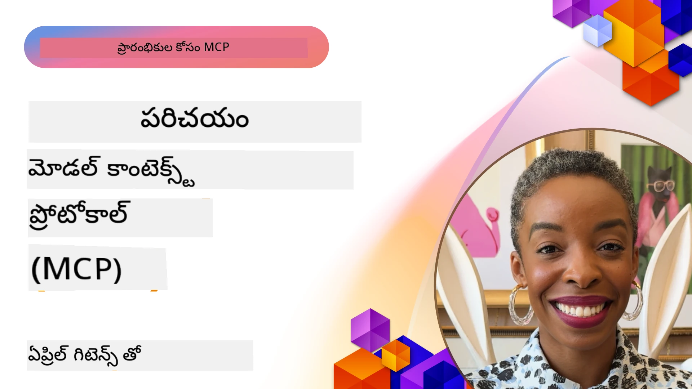
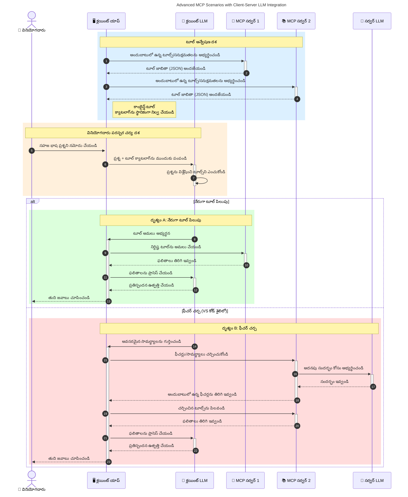

# మోడల్ కాంటెక్స్ట్ ప్రోటోకాల్ (MCP) పరిచయం: స్కేలబుల్ AI అప్లికేషన్లకు ఇది ఎందుకు ముఖ్యం

[](https://youtu.be/agBbdiOPLQA)

_(ఈ పాఠం వీడియోను చూడటానికి పైన ఉన్న చిత్రం క్లిక్ చేయండి)_

జనరేటివ్ AI అప్లికేషన్లు చాలా ముందడుగుగా ఉంటాయి ఎందుకంటే అవి సాధారణ భాషా ప్రాంప్ట్లు ఉపయోగించి యూజర్ అప్లికేషన్‌తో మాట్లాడేందుకు అనుమతిస్తాయి. అయితే, అలాంటి అప్లికేషన్లలో ఎక్కువ సమయం మరియు వనరులను పెట్టినప్పుడు, మీరు సులభంగా ఫంక్షనాలిటీస్ మరియు వనరులను ఇంటిగ్రేట్ చేయగలుగుతారని నిర్ధారించుకోవాలనుకుంటారు, మీ ఆప్ చాలా మోడల్స్ ఉపయోగించబడేలా caters చేయగలగాలి, మరియు వివిధ మోడల్ సంక్లిష్టతలను నిర్వహించాలని ఉంటుంది. సంక్షిప్తంగా చెప్పాలంటే, జనరేటివ్ AI అప్లికేషన్లు ప్రారంభించడములో సులభం, కానీ అవి పెరిగిపోవటంతో మరియు క్లిష్టంగా మారితే, మీరు ఎన్నో ఆర్కిటెక్చర్ అభివృద్ధి చేయడం మొదలు పెట్టాలి మరియు సాధారణంగా, మీ అప్లికేషన్లు సంప్రదాయంగా నిర్మింపబడాలని ఒక విధానాన్ని ఆధారపడాలి. ఇటువంటి సందర్భంలో MCP వస్తుంది మరియు వ్యవస్థను గమనించి ఒక ప్రమాణాన్ని అందిస్తుంది.

---

## **🔍 మోడల్ కాంటెక్స్ట్ ప్రోటోకాల్ (MCP) అంటే ఏమిటి?**

**మోడల్ కాంటెక్స్ట్ ప్రోటోకాల్ (MCP)** అనేది **ఓపెన్, ప్రమాణీకృత ఇంటర్‌ఫేస్** అవు, ఇది భారీ భాషా మోడల్స్ (LLMs) కు బాహ్య టూల్స్, APIలు, డేటా మూలాలతో సాఫీగా ఇంటరాక్ట్ చేయడానికి అనుమతిస్తుంది. ఇది AI మోడల్ ఫంక్షనాలిటీని వారి ట్రైనింగ్ డేటా దాటి మెరుగుపరచడానికి, చతుర / స్కేలబుల్ / ప్రతిస్పందన కలిగిన AI వ్యవస్థలను సాధించడానికి ఒక స్థిరమైన ఆర్కిటెక్చర్ ను అందిస్తుంది.

---

## **🎯 AI లో ప్రమాణీకరణ ఎందుకు ముఖ్యం?**

జనరేటివ్ AI అప్లికేషన్లు మరింత క్లిష్టంగా మారుతున్నందున, **స్కేలబిలిటీ, విస్తరణ సామర్ధ్యము, నిర్వహించగలిగేది,** మరియు **వెండర్ లాక్-ఇన్ ను నివారించడం** వంటి ప్రమాణాలను స్వీకరించడం అత్యవసరం. MCP ఈ అవసరాలను ఈ విధంగా పరిష్కరిస్తుంది:

- మోడల్-టూల్ ఇంటిగ్రేషన్ల ఏకీకరణ
- దుర్బలమైన, ఒక్కోసారి ప్రత్యేక పరిష్కారాలను తగ్గించడం
- వివిధ వెండర్ల నుండి వచ్చిన అనేక మోడల్స్ ఒకే వాతావరణంలో కలిసి ఉండగలగడం

**గమనిక:** MCP తనను ఓపెన్ ప్రమాణంగా ప్రకటించినప్పటికీ, IEEE, IETF, W3C, ISO, లేదా ఇతర ప్రమాణ సంస్థల ద్వారా MCP ని ప్రమాణీకరించాల్సిన ప్లాన్‌లు లేవు.

---

## **📚 నేర్చుకునే లక్ష్యాలు**

ఈ ఆర్టికల్ చివరికి, మీరు చేయగలుగుతారు:

- **మోడల్ కాంటెక్స్ట్ ప్రోటోకాల్ (MCP)** ని నిర్వచించడం మరియు దాని ఉపయోగాలను అర్థం చేసుకోవడం
- MCP ఎలా మోడల్-టు-టూల్ కమ్యూనికేషన్ ని ప్రమాణీకరిస్తుందో తెలుసుకోవడం
- MCP ఆర్కిటెక్చర్ యొక్క ప్రధాన భాగాలను గుర్తించడం
- వ్యాపార మరియు డెవలప్మెంట్ సందర్భాలలో MCP వాడుక ఉదాహరణలను అన్వేషించడం

---

## **💡 మోడల్ కాంటెక్స్ట్ ప్రోటోకాల్ (MCP) ఎందుకు గేమ్-చేంజర్?**

### **🔗 MCP AI ఇంటరాక్షన్ల లో విడిపోవడాన్ని పరిష్కరిస్తుంది**

MCP ముందుగా, మోడల్స్ మరియు టూల్స్ ను సమన్వయం చేయడం కోసం:

- ప్రతి టూల్-మోడల్ జంటకు ప్రత్యేక కస్టమ్ కోడ్
- ప్రతి వెండర్ కి ప్రామాణిక కాని API లు
- నిరంతర నవీకరణల కారణంగా తరచూ విరామాలు
- మరిన్ని టూల్స్ తో బాధాకరమైన స్కేలబిలిటీ

### **✅ MCP ప్రమాణీకరణ ప్రయోజనాలు**

| **ప్రయోజనం**             | **వివరణ**                                                               |
|--------------------------|-------------------------------------------------------------------------|
| ఇంటరాప్‌రబిలిటీ             | వివిధ వెండర్ల టూల్స్ తో LLM లు సాఫీగా పని చేయటం                       |
| సబలత (Consistency)       | ప్లాట్‌ఫారమ్‌లు మరియు టూల్స్ అంతటా ఏకచేతన ప్రవర్తన                     |
| పునఃపయోగం                | ఒకసారి టూల్స్ నిర్మించిన తర్వాత ప్రాజెక్టులు మరియు వ్యవస్థలలో ఉపయోగించటం     |
| వేగవంతమైన అభివృద్ధి        | ప్రమాణీకరించిన, ప్లగ్-అండ్-ప్లే ఇంటర్‌ఫేస్లను ఉపయోగించి అభివృద్ధి సమయాన్ని తగ్గించడం |

---

## **🧱 MCP యొక్క హై-లెవెల్ ఆర్కిటెక్చర్ అవలోకనం**

MCP ఒక **క్లయింట్-సర్వర్ మోడల్** ను అనుసరిస్తుంది, ఇందులో:

- **MCP హోస్ట్లు** AI మోడల్స్ ని నడుపుతాయి
- **MCP క్లయింట్లు** అభ్యర్థనలను ప్రారంభిస్తాయి
- **MCP సర్వర్లు** కాంటెక్స్ట్, టూల్స్, మరియు సామర్థ్యాలను సేవ్ చేస్తాయి

### **ప్రధాన భాగాలు:**

- **వనరులు** – మోడల్స్ కోసం స్థిరమైన లేదా డైనమిక్ డేటా  
- **ప్రాంప్ట్లు** – సూచిత జనరేషన్ కోసం ముందుగా నిర్ణీత వర్క్‌ఫ్లోలు  
- **టూల్స్** – శోధన, లెక్కింపులు వంటి అమలు చేయదగిన ఫంక్షన్లు  
- **సాంప్లింగ్** – రీకర్సివ్ ఇంటరాక్షన్ల ద్వారా ఏజెంటిక్ ప్రవర్తన (MCP `2026-07-28` లో డిప్రికేటెడ్; కొత్త అమలు‌లు నేరుగా LLM ప్రొవైడర్ తో ఇంటిగ్రేట్ చేయాలి)
 
 
- **ఎలిసిటేషన్** – యూజర్ ఇన్‌పుట్ కొరకై సర్వర్ ప్రారంభించే అభ్యర్థనలు
- **రూట్స్** – సర్వర్‌కు సంబంధించి సమాచార ఫైల్ సిస్టమ్ స్థానాలు (మరోసారి MCP `2026-07-28` లో డిప్రికేటెడ్; టూల్ పరామితులు, వనరు URIలు, లేదా సర్వర్ కాన్ఫిగరేషన్‌ను ప్రాధాన్యం ఇవ్వండి)


### **ప్రోటోకాల్ ఆర్కిటెక్చర్:**

MCP రెండుసార్లు స్థాయి ఆర్కిటెక్చర్‌ను ఉపయోగిస్తుంది:
- **డేటా లేయర్**: JSON-RPC 2.0 సందేశాలు, అభ్యర్థన-ప్రతి మెటాడేటా, డిస్కవరీ, మరియు ప్రోటోకాల్ ప్రిమిటివ్స్
 
- **ట్రాన్స్‌పోర్ట్ లేయర్**: స్థానిక సబ్ప్రాసెస్‌ల కోసం stdio మరియు రిమోట్ సర్వర్లు కోసం స్ట్రీమబుల్ HTTP. స్ట్రీమబుల్ HTTP స్ట్రీమ్ చేయబడిన ప్రతిస్పందనలకు SSE ఫ్రేమింగ్ ఉపయోగించవచ్చు, కానీ పాత HTTP+SSE ట్రాన్స్‌పోర్ట్ డిప్రికేటెడ్ అయింది.
 
 

---

## MCP సర్వర్లు ఎలా పనిచేస్తాయి

MCP సర్వర్లు ఈ విధంగా పనిచేస్తాయి:

- **అభ్యర్థన ప్రవాహం**:
    1. అభ్యర్థన ఒక తుది వినియోగదారు లేదా వారి తరపున పనిచేస్తున్న సాఫ్ట్వేర్ ద్వారా ప్రారంభించబడుతుంది.
    2. **MCP క్లయింట్** ఈ అభ్యర్థనను ఒక **MCP హోస్ట్** కి పంపుతుంది, ఇది AI మోడల్ రన్‌టైమ్ ను నిర్వహిస్తుంది.
    3. **AI మోడల్** యూజర్ ప్రాంప్ట్ ను అందుకుంటుంది మరియు ఒక లేదా ఎక్కువ టూల్ కాల్స్ ద్వారా బాహ్య టూల్స్ లేదా డేటా యాక్సెస్ కోరవచ్చు.
    4. **MCP హోస్ట్**, మోడల్ నేరుగా కాదు, సరైన **MCP సర్వర్(లు)** తో ప్రమాణీకృత ప్రోటోకాల్ ఉపయోగించి కమ్యూనికేట్ చేస్తుంది.
- **MCP హోస్ట్ ఫంక్షనాలిటీ**:
    - **టూల్ రిజిస్ట్రీ**: అందుబాటులో ఉన్న టూల్స్ మరియు వారి సామర్థ్యాల క్యాటలాగ్ నిర్వహిస్తుంది.
    - **ఆథెంటికేషన్**: టూల్ యాక్సెస్ కు అనుమతులను నిర్ధారిస్తుంది.
    - **అభ్యర్థన హ్యాండ్లర్**: మోడల్ నుండి వచ్చే టూల్ అభ్యర్థనలను ప్రాసెస్ చేస్తుంది.
    - **ప్రతిస్పందన ఫార్మాటర్**: టూల్ అవుట్పుట్ లను మోడల్ అర్థం చేసుకునే రూపంలో రూపొందిస్తుంది.
- **MCP సర్వర్ ఎగ్జిక్యూషన్**:
    - **MCP హోస్ట్** ఒకటి లేదా ఎక్కువ **MCP సర్వర్లకు** టూల్ కాల్స్ రూట్ చేస్తుంది, ప్రతి సర్వర్ ప్రత్యేక ఫంక్షన్స్ (ఉదా: శోధన, లెక్కింపులు, డేటాబేస్ క్యూరీస్) అందిస్తుంది.
    - **MCP సర్వర్లు** తమ సంబంధిత కార్యకలాపాలను నిర్వహించి స్థిరమైన రూపంలో ఫలితాలను **MCP హోస్ట్** కు తిరిగి ఇవ్వును.
    - **MCP హోస్ట్** ఫలితాలను ఫార్మాట్ చేసి **AI మోడల్** కు పంపుతుంది.
- **ప్రతిస్పందన ముగింపు**:
    - **AI మోడల్** టూల్ అవుట్పుట్‌లను తుది ప్రతిస్పందనలో చేర్చుతుంది.
    - **MCP హోస్ట్** ఆ ప్రతిస్పందనను **MCP క్లయింట్** కు తిరిగి పంపుతుంది, ఇది తుది వినియోగదారు లేదా అభ్యర్థించే సాఫ్ట్వేర్ కు అందిస్తుంది.
    

```mermaid
---
title: MCP Architecture and Component Interactions
description: A diagram showing the flows of the components in MCP.
---
graph TD
    Client[MCP క్లయింట్/అప్లికేషన్] -->|అభ్యర్థన పంపుతుంది| H[MCP హోస్ట్]
    H -->|ఆహ్వానిస్తుంది| A[AI మోడల్]
    A -->|టూల్ కాల్ అభ్యర్థన| H
    H -->|MCP Protocol| T1[MCP Server Tool 01: వెబ్ సెర్చ్
    H -->|MCP Protocol| T2[MCP Server Tool 02: క్యాలిక్యులేటర్ టూల్
    H -->|MCP Protocol| T3[MCP Server Tool 03: డేటాబేస్ యాక్సెస్ టూల్
    H -->|MCP Protocol| T4[MCP Server Tool 04: ఫైల్ సిస్టమ్ టూల్
    H -->|స్పందన పంపుతుంది| Client

    subgraph "MCP హోస్ట్ కంపోనెంట్స్"
        H
        G[టూల్ రిజిస్ట్రి]
        I[ధృవీకరణ]
        J[అభ్యర్థన హ్యాండ్లర్]
        K[స్పందన ఫార్మాట్ చేసినది]
    end

    H <--> G
    H <--> I
    H <--> J
    H <--> K

    style A fill:#f9d5e5,stroke:#333,stroke-width:2px
    style H fill:#eeeeee,stroke:#333,stroke-width:2px
    style Client fill:#d5e8f9,stroke:#333,stroke-width:2px
    style G fill:#fffbe6,stroke:#333,stroke-width:1px
    style I fill:#fffbe6,stroke:#333,stroke-width:1px
    style J fill:#fffbe6,stroke:#333,stroke-width:1px
    style K fill:#fffbe6,stroke:#333,stroke-width:1px
    style T1 fill:#c2f0c2,stroke:#333,stroke-width:1px
    style T2 fill:#c2f0c2,stroke:#333,stroke-width:1px
    style T3 fill:#c2f0c2,stroke:#333,stroke-width:1px
    style T4 fill:#c2f0c2,stroke:#333,stroke-width:1px
```

## 👨‍💻 MCP సర్వర్ ను ఎలా నిర్మించాలి (ఉదాహరణలతో)

MCP సర్వర్లు డేటా మరియు పనితీరు అందించడం ద్వారా LLM సామర్థ్యాలను విస్తరించడాన్ని అనుమతిస్తాయి.

దీన్ని ప్రయత్నించడానికి సిద్ధం? వివిధ భాషల/స్టాక్‌లలో సులభమైన MCP సర్వర్లను సృష్టించే SDKలూ మరియు ఉదాహరణలు ఇవి:

- **Python SDK**: https://github.com/modelcontextprotocol/python-sdk

- **TypeScript SDK**: https://github.com/modelcontextprotocol/typescript-sdk

- **Java SDK**: https://github.com/modelcontextprotocol/java-sdk

- **C#/.NET SDK**: https://github.com/modelcontextprotocol/csharp-sdk


## 🌍 MCP ఉపయోగించే వాస్తవ ప్రపంచం ఉదాహరణలు

MCP AI సామర్థ్యాలను విస్తరింపజేసి విస్తృత అప్లికేషన్లను సమర్ధవంతం చేస్తుంది:

| **అప్లికేషన్**              | **వివరణ**                                                               |
|------------------------------|-------------------------------------------------------------------------|
| సంస్థ డేటా ఇంటిగ్రేషన్         | LLM లను డేటాబేసులు, CRMలు లేదా అంతర్గత టూల్స్ తో కనెక్ట్ చేయడం       |
| ఏజెంటిక్ AI వ్యవస్థలు           | టూల్ యాక్సెస్ మరియు నిర్ణయం తీసుకునే వర్క్‌ఫ్లోలతో స్వయంచాలక ఏజెంట్లను సాధ్యం చేయడం |
| బహు-మాధ్యమ అప్లికేషన్లు         | ఒకే ఏకీకృత AI అప్లికేషన్‌లో పాఠ్యం, చిత్రం, ధ్వని టూల్స్ ను కలపడం     |
| నేరుగా డేటా అనుసంధానం          | AI ఇంటరాక్షన్ల లో ప్రస్తుత మరియు ఖచ్చితమైన అవుట్పుట్‌ల కొరకు ప్రత్యక్ష డేటాను తీసుకురావడం |


### 🧠 MCP = AI ఇంటరాక్షన్లకు సార్వత్రిక ప్రమాణం

మోడల్ కాంటెక్స్ట్ ప్రోటోకాల్ (MCP) అనేది AI ఇంటరాక్షన్లకు సార్వత్రిక ప్రమాణంగా పనిచేస్తుంది, USB-C ఎలా పరికరాలకు భౌతిక కనెక్షన్లను ప్రమాణీకరించింది అనేదాంట్లా. AI ప్రపంచంలో MCP ఒక స్థిరమైన ఇంటర్‌ఫేస్ ను అందిస్తుంది, ఇది మోడల్స్ (క్లయింట్లు) కు బాహ్య టూల్స్ మరియు డేటా ప్రొవైడర్లతో (సర్వర్లు) సాఫీగా అనుసంధానం కావడానికి అనుమతిస్తుంది. ఇది ప్రతి API లేదా డేటా మూలం కోసం విభిన్న, కస్టమ్ ప్రోటోకాల్ అవసరాన్ని తొలగిస్తుంది.

MCP కింద, MCP కంపాటిబుల్ టూల్ (MCP సర్వర్ గా అనేసారు) అనేది ఒక ఏకీకృత ప్రమాణాన్ని అనుసరిస్తుంది. ఈ సర్వర్లు అందించే టూల్స్ లేదా చర్యలను జాబితా చేయగలవు మరియు AI ఏజెంట్ అభ్యర్థనపై ఆ చర్యలను అమలు చేస్తాయి. MCP మద్దతు ఇచ్చే AI ఏజెంట్ ప్లాట్‌ఫారమ్‌లు సర్వర్ల నుండి అందుబాటులో ఉన్న టూల్స్‌ను కనుగొని ఈ ప్రమాణ ప్రోటోకాల్ ద్వారా వాటిని పిలిచే సామర్థ్యం కలిగి ఉంటాయి.

### 💡 జ్ఞానానికి ప్రాప్తిని సులభతరం చేస్తుంది

టూల్స్ అందించడం మించిపోయి, MCP జ్ఞానానికి ప్రాప్తిని కూడా సులభతరం చేస్తుంది. ఇది అప్లికేషన్లకు భారీ భాషా మోడల్స్ (LLMs) కి వివిధ డేటా మూలాలతో లింక్ చేస్తూ కాంటెక్స్ట్ అందించడానికి అనుమతిస్తుంది. ఉదాహరణకి, ఒక MCP సర్వర్ ఒక కంపెనీ డాక్యుమెంట్ రిపాజిటరీని సూచించవచ్చు, ఏజెంట్లకు అవసరమైన సమాచారాన్ని డిమాండ్ ఆధారంగా పొందటానికి అనుమతిస్తుంది. మరొక సర్వర్ ప్రత్యేక చర్యలను నిర్వహించవచ్చు, ఉదా: ఇమెయిల్స్ పంపడం లేదా రికార్డులను నవీకరించడం. ఏజెంట్ దృష్టికోణంలో ఇవి సాదారణ టూల్స్ లాంటివి — కొన్నింటి నుంచి డేటా (జ్ఞాన కాంటెక్స్ట్) వస్తుంది, మరికొన్ని చర్యలు చేస్తాయి. MCP ఈ రెండింటినీ సమర్థవంతంగా నిర్వహిస్తుంది.

MCP సర్వర్ కు కనెక్ట్ అయ్యే ఏజెంట్ సర్వర్ అందించే సామర్థ్యాలు మరియు అందుబాటులో ఉన్న డేటాను ఒక ప్రమాణిత ఫార్మాట్ ద్వారా స్వయంచాలకంగా నేర్చుకుంటుంది. ఈ ప్రమాణీకరణ డైనమిక్ టూల్ అందుబాటును సాధ్యమవుతుంది. ఉదాహరణకి, ఏజెంట్ సిస్టంలో కొత్త MCP సర్వర్ ను జోడిస్తే, దాని ఫంక్షన్లను తక్షణమే ఉపయోగించవచ్చు, ఏజెంట్ సూచనలను మరింత అనుకూలం చేసుకోవాల్సిన అవసరం లేకుండా.

ఈ సమగ్ర ఇంటిగ్రేషన్ క్రింది చిత్రంలో చూపించిన ప్రవాహంతో సరిపోగా, సర్వర్లు టూల్స్ మరియు జ్ఞానాన్ని అందిస్తూ వ్యవస్థల మధ్య సాఫీగా సహకారంపట్ల సహాయపడతాయి.

### 👉 ఉదాహరణ: స్కేలబుల్ ఏజెంట్ పరిష్కారం

```mermaid
---
title: Scalable Agent Solution with MCP
description: A diagram illustrating how a user interacts with an LLM that connects to multiple MCP servers, with each server providing both knowledge and tools, creating a scalable AI system architecture
---
graph TD
    User -->|ప్రాంప్ట్| LLM
    LLM -->|స్పందన| User
    LLM -->|MCP| ServerA
    LLM -->|MCP| ServerB
    ServerA -->|సర్వత్రక కనెక్టర్| ServerB
    ServerA --> KnowledgeA
    ServerA --> ToolsA
    ServerB --> KnowledgeB
    ServerB --> ToolsB

    subgraph సర్వర్ A
        KnowledgeA[జ్ఞానం]
        ToolsA[సాధనాలు]
    end

    subgraph సర్వర్ B
        KnowledgeB[జ్ఞానం]
        ToolsB[సాధనాలు]
    end
```
 యూనివర్సల్ కనెక్టర్ MCP సర్వర్లు ఒకదానికొకటి కమ్యూనికేట్ చేసి సామర్థ్యాలు పంచుకునేందుకు అనుమతిస్తుంది, అందువల్ల ServerA ServerB కు పనులను అప్పగించగలదు లేదా దాని టూల్స్ మరియు జ్ఞానాన్ని యాక్సెస్ చేయగలదు. ఈ విధంగా టూల్స్ మరియు డేటా సర్వర్ల మధ్య ఫెడరేట్ అవుతూ, స్కేలబుల్ మరియు మాడ్యూలర్ ఏజెంట్ ఆర్కిటెక్చర్లకు మద్దతు ఇస్తుంది. MCP టూల్ ప్రవేశాన్ని ప్రమాణీకరించినందున, ఏజెంట్లు సర్వర్లను డైనమిక్గా కనుగొని అభ్యర్థనలను ఎటువంటి హార్డ్‌కోడెడ్ ఇంటిగ్రేషన్లు లేకుండా సరఫరా చేయగలవు.


టూల్ మరియు జ్ఞాన ఫెడరేషన్: టూల్స్ మరియు డేటాను సర్వర్ల అంతటా యాక్సెస్ చేయవచ్చు, స్కేలబుల్ మరియు మాడ్యూలర్ ఏజెంటిక్ ఆర్కిటెక్చర్లను సమర్థవంతం చేస్తుంది.

### 🔄 క్లయింట్-సైడ్ LLM ఇంటిగ్రేషన్ తో అధునాతన MCP సందర్భాలు

ప్రాథమిక MCP ఆర్కిటెక్చర్ ఇతరహంగగా, క్లయింట్ మరియు సర్వర్ రెండింటిలో LLMలు ఉండటం ద్వారా మరింత ప్రగతిశీల ఇంటరాక్షన్లు సాధ్యమవుతున్న సందర్భాలు ఉన్నాయి. క్రింద ఉన్న చిత్రంలో, **క్లయింట్ ఆప్** ఒక IDE కావొచ్చు, మరియు LLM ద్వారా యూజర్ ఉపయోగించే అనేక MCP టూల్స్ అందుబాటులో ఉంటాయి:



## 🔐 MCP యొక్క ప్రాయోగిక ప్రయోజనాలు

MCP ఉపయోగించడంవలన ఈ క్రింది ప్రాయోగిక ప్రయోజనాలు కలుగుతాయి:

- **తాజాదనం**: మోడల్స్ తమ ట్రైనింగ్ డేటా దాటి తాజా సమాచారాన్ని యాక్సెస్ చేసుకోగలవు
- **సామర్థ్య విస్తరణ**: మోడల్స్ శిక్షణ పొందని పనుల కొరకు ప్రత్యేక టూల్స్ ఉపయోగించవచ్చు
- **హాల్యూసినేషన్‌లు తగ్గింపు**: బాహ్య డేటా మూలాలు వాస్తవ ఆధారాన్ని అందిస్తాయి
- **ప్రమాణభద్రత**: సున్నితమైన డేటా ప్రాంప్ట్‌లలో కాకుండా సురక్షిత పర్యావరణాల్లోనే ఉంచవచ్చు

## 📌 ముఖ్యమైన విషయాలు

MCP ఉపయోగం యొక్క ప్రధానమైన విషయాలు:

- **MCP** AI మోడల్స్ ఎలా టూల్స్ మరియు డేటా తో కమ్యూనికేట్ చేస్తాయో ప్రచలితం చేయును
- **విస్తరణ, సబలత మరియు ఇంటరాప్‌రబిలిటీని ప్రోత్సహిస్తుంది**
- MCP అభివృద్ధి సమయాన్ని తగ్గించడానికి, నమ్మకత పెంచడానికి మరియు మోడల్ సామర్థ్యాలను విస్తరించడానికి సహాయం చేస్తుంది
- క్లయింట్-సర్వర్ ఆర్కిటెక్చర్ **సులభమైన, విస్తరించదగ్గ AI అప్లికేషన్లకు అనుమతిస్తుంది**

## 🧠 వ్యాయామం

మీరు నిర్మించాలనుకునే AI అప్లికేషన్ గురించి ఆలోచించండి.

- దాని సామర్థ్యాలను పెంచేందుకు ఏ **బాహ్య టూల్స్ లేదా డేటా** ఉపయోగపడగలవు?
- MCP ఎలా ఇంటిగ్రేషన్ **సులభతరం మరియు నమ్మకమైనదిగా చేస్తుంది?**

## అదనపు వనరులు

- [MCP GitHub Repository](https://github.com/modelcontextprotocol)


## తరువాతి దశ ఏమిటి

తరువాత: [Chapter 1: Core Concepts](../01-CoreConcepts/README.md)

---

<!-- CO-OP TRANSLATOR DISCLAIMER START -->
**అస్వీకరణ**:
ఈ పత్రం AI అనువాద సేవ [Co-op Translator](https://github.com/Azure/co-op-translator) ఉపయోగించి అనువదించబడింది. మేము ఖచ్చితత్వానికి ప్రయత్నిస్తున్నప్పటికీ, ఆటోమేటెడ్ అనువాదాలు తప్పులు లేదా అసమగ్రతలను కలిగి ఉండవచ్చు. దాని స్వదేశ భాషలో ఉన్న అసలు పత్రాన్ని అధికారం కలిగిన మూలంగా పరిగణించాలి. కీలకమైన సమాచారం కోసం, ప్రొఫెషనల్ మానవ అనువాదాన్ని సిఫారసు చేస్తాము. ఈ అనువాదం ఉపయోగం వల్ల కలిగే ఏవైనా అపార్థాలు లేదా తప్పుదారులు కోసం మేము బాధ్యత వహించము.
<!-- CO-OP TRANSLATOR DISCLAIMER END -->