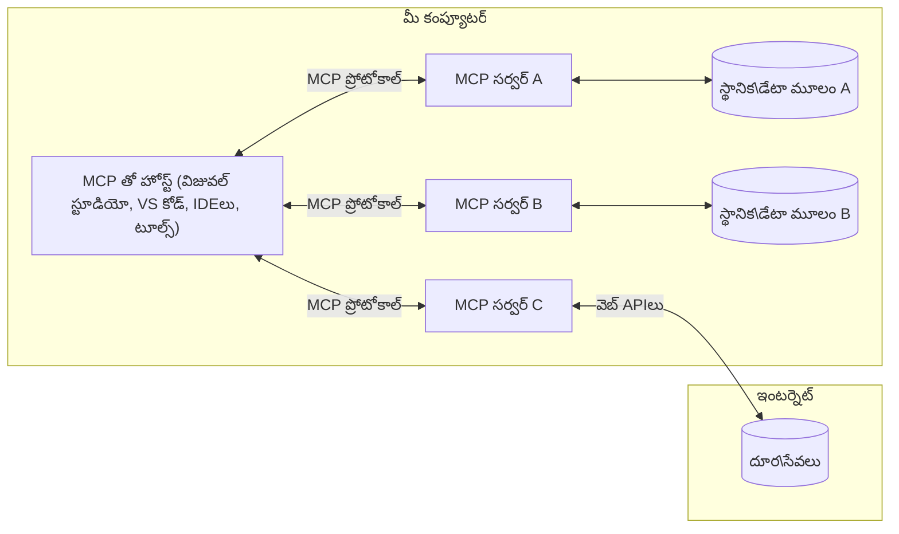

# MCP కోర్ కాన్సెప్ట్‌లు: AI ఇంటిగ్రేషన్ కోసం మోడల్ కాంటెక్స్ట్ ప్రోటోకాల్‌ను మాస్టర్ చేయడం

[](https://youtu.be/earDzWGtE84)

_(ఈ పాఠం వీడియోను చూడడానికి పై చిత్రాన్ని క్లిక్ చేయండి)_

[Model Context Protocol (MCP)](https://github.com/modelcontextprotocol) అనేది పెద్ద భాషా మోడల్స్ (LLMs) మరియు బాహ్య టూల్స్, అప్లికేషన్లు, మరియు డేటా సోర్సుల మధ్య కమ్యూనికేషన్‌ను ఆప్టిమైజ్ చేసే శక్తివంతమైన, ప్రమాణీకృత ఫ్రేమ్‌వర్క్.  
ఈ గైడ్ MCP యొక్క కోర్ కాన్సెప్ట్‌ల ద్వారా మీకు మార్గనిర్దేశం చేస్తుంది. మీరు దాని క్లయింట్-సర్వర్ ఆర్కిటెక్చర్, ముఖ్య భాగాలు, కమ్యూనికేషన్ మెకానిక్స్, మరియు అమలు ఉత్తమ పద్ధతుల గురించి నేర్చుకుంటారు.

- **స్పష్టమైన యూజర్ అనుమతి**: అన్ని డేటా యాక్సెస్ మరియు ఆపరేషన్లు అమలు ముందు స్పష్టమైన యూజర్ ఆమోదం అవసరం. యూజర్లు ఏ డేటా యాక్సెస్ చేయబడుతుందో మరియు ఏ చర్యలు తీసుకోబడతాయో స్పష్టంగా అర్థం చేసుకోవాలి, అనుమతులు మరియు అధికారం పై సూక్ష్మ నియంత్రణతో.

- **డేటా గోప్యత రక్షణ**: యూజర్ డేటా స్పష్టమైన అనుమతితో మాత్రమే ప్రదర్శించబడుతుంది మరియు మొత్తం ఇంటరాక్షన్ లైఫ్‌సైకిల్‌లో బలమైన యాక్సెస్ నియంత్రణలతో రక్షించబడాలి. అమలు అనధికార డేటా ప్రసారం నివారించాలి మరియు కఠిన గోప్యత సరిహద్దులను నిర్వహించాలి.

- **టూల్ ఎగ్జిక్యూషన్ సేఫ్టీ**: ప్రతి టూల్ పిలుపు స్పష్టమైన యూజర్ అనుమతితో అవసరం, టూల్ యొక్క ఫంక్షనాలిటీ, పారామీటర్లు, మరియు సంభావ్య ప్రభావం స్పష్టంగా అర్థం చేసుకోవాలి. బలమైన భద్రతా సరిహద్దులు అనుకోని, అసురక్షిత, లేదా దుర్మార్గ టూల్ అమలును నివారించాలి.

- **ట్రాన్స్‌పోర్ట్ లేయర్ సెక్యూరిటీ**: అన్ని కమ్యూనికేషన్ ఛానెల్స్ సరైన ఎన్‌క్రిప్షన్ మరియు ఆథెంటికేషన్ మెకానిజంలను ఉపయోగించాలి. రిమోట్ కనెక్షన్లు సురక్షిత ట్రాన్స్‌పోర్ట్ ప్రోటోకాల్స్ మరియు సరైన క్రెడెన్షియల్ నిర్వహణను అమలు చేయాలి.

#### అమలు మార్గదర్శకాలు:

- **అనుమతి నిర్వహణ**: యూజర్లు ఏ సర్వర్లు, టూల్స్, మరియు వనరులు యాక్సెస్ చేయగలరో నియంత్రించడానికి సూక్ష్మ అనుమతి వ్యవస్థలను అమలు చేయండి  
- **ఆథెంటికేషన్ & ఆథరైజేషన్**: సురక్షిత ఆథెంటికేషన్ పద్ధతులు (OAuth, API కీలు) సరైన టోకెన్ నిర్వహణ మరియు గడువు తో ఉపయోగించండి  
- **ఇన్‌పుట్ వాలిడేషన్**: ఇంజెక్షన్ దాడులను నివారించడానికి నిర్వచించిన స్కీమాల ప్రకారం అన్ని పారామీటర్లు మరియు డేటా ఇన్‌పుట్‌లను ధృవీకరించండి  
- **ఆడిట్ లాగింగ్**: భద్రతా పర్యవేక్షణ మరియు అనుగుణత కోసం అన్ని ఆపరేషన్ల సమగ్ర లాగ్‌లను నిర్వహించండి

## అవలోకనం

ఈ పాఠం Model Context Protocol (MCP) ఎకోసిస్టమ్‌ను రూపొందించే ప్రాథమిక ఆర్కిటెక్చర్ మరియు భాగాలను అన్వేషిస్తుంది. మీరు క్లయింట్-సర్వర్ ఆర్కిటెక్చర్, ముఖ్య భాగాలు, మరియు MCP ఇంటరాక్షన్లను శక్తివంతం చేసే కమ్యూనికేషన్ మెకానిజంల గురించి నేర్చుకుంటారు.

## ముఖ్యమైన నేర్చుకునే లక్ష్యాలు

ఈ పాఠం ముగింపు నాటికి, మీరు:

- MCP క్లయింట్-సర్వర్ ఆర్కిటెక్చర్‌ను అర్థం చేసుకుంటారు.  
- హోస్ట్లు, క్లయింట్లు, మరియు సర్వర్ల పాత్రలు మరియు బాధ్యతలను గుర్తిస్తారు.  
- MCP ను ఒక సౌలభ్యమైన ఇంటిగ్రేషన్ లేయర్‌గా చేసే ప్రధాన లక్షణాలను విశ్లేషిస్తారు.  
- MCP ఎకోసిస్టమ్‌లో సమాచారం ఎలా ప్రవహిస్తుందో నేర్చుకుంటారు.  
- .NET, జావా, పైథాన్, మరియు జావాస్క్రిప్ట్‌లో కోడ్ ఉదాహరణల ద్వారా ప్రాక్టికల్ అవగాహన పొందుతారు.

## MCP ఆర్కిటెక్చర్: లోతైన దృష్టి

MCP ఎకోసిస్టమ్ క్లయింట్-సర్వర్ మోడల్‌పై నిర్మించబడింది. ఈ మాడ్యులర్ నిర్మాణం AI అప్లికేషన్లు టూల్స్, డేటాబేసులు, APIs, మరియు సందర్భిక వనరులతో సమర్థవంతంగా ఇంటరాక్ట్ అవ్వడానికి అనుమతిస్తుంది. ఈ ఆర్కిటెక్చర్‌ను దాని ప్రధాన భాగాలుగా విభజిద్దాం.

మూలంగా, MCP ఒక క్లయింట్-సర్వర్ ఆర్కిటెక్చర్‌ను అనుసరిస్తుంది, ఇక్కడ ఒక హోస్ట్ అప్లికేషన్ అనేక సర్వర్లకు కనెక్ట్ అవుతుంది:


- **MCP హోస్ట్లు**: VSCode, Claude Desktop, IDEలు, లేదా MCP ద్వారా డేటా యాక్సెస్ చేయాలనుకునే AI టూల్స్ వంటి ప్రోగ్రామ్లు  
- **MCP క్లయింట్లు**: సర్వర్లతో 1:1 కనెక్షన్లను నిర్వహించే ప్రోటోకాల్ క్లయింట్లు  
- **MCP సర్వర్లు**: ప్రతి ఒక్కటి ప్రమాణీకృత Model Context Protocol ద్వారా నిర్దిష్ట సామర్థ్యాలను ప్రదర్శించే లైట్‌వెయిట్ ప్రోగ్రామ్లు  
- **లోకల్ డేటా సోర్సులు**: మీ కంప్యూటర్ ఫైళ్ళు, డేటాబేసులు, మరియు MCP సర్వర్లు సురక్షితంగా యాక్సెస్ చేయగల సేవలు  
- **రిమోట్ సర్వీసులు**: ఇంటర్నెట్ ద్వారా అందుబాటులో ఉన్న బాహ్య సిస్టమ్లు, MCP సర్వర్లు APIs ద్వారా కనెక్ట్ అవ్వగలవు.

MCP ప్రోటోకాల్ ఒక అభివృద్ధి చెందుతున్న ప్రమాణం, తేదీ ఆధారిత వెర్షనింగ్ (YYYY-MM-DD ఫార్మాట్) ఉపయోగిస్తుంది. ప్రస్తుత ప్రోటోకాల్ వెర్షన్ **2025-11-25**. మీరు తాజా నవీకరణలను [ప్రోటోకాల్ స్పెసిఫికేషన్](https://modelcontextprotocol.io/specification/2025-11-25/)లో చూడవచ్చు.

### 1. హోస్ట్లు

Model Context Protocol (MCP)లో, **హోస్ట్లు** అనేవి యూజర్లు ప్రోటోకాల్‌తో ఇంటరాక్ట్ అయ్యే ప్రాథమిక ఇంటర్‌ఫేస్‌గా పనిచేసే AI అప్లికేషన్లు. హోస్ట్లు అనేక MCP సర్వర్లకు కనెక్షన్లను సమన్వయపరచి నిర్వహిస్తాయి, ప్రతి సర్వర్ కనెక్షన్ కోసం ప్రత్యేక MCP క్లయింట్లను సృష్టించడం ద్వారా. హోస్ట్ల ఉదాహరణలు:

- **AI అప్లికేషన్లు**: Claude Desktop, Visual Studio Code, Claude Code  
- **డెవలప్‌మెంట్ ఎన్విరాన్‌మెంట్లు**: MCP ఇంటిగ్రేషన్ ఉన్న IDEలు మరియు కోడ్ ఎడిటర్లు  
- **కస్టమ్ అప్లికేషన్లు**: ప్రత్యేకంగా రూపొందించిన AI ఏజెంట్లు మరియు టూల్స్

**హోస్ట్లు** AI మోడల్ ఇంటరాక్షన్లను సమన్వయపరుస్తాయి. అవి:

- **AI మోడల్స్‌ను ఆర్కెస్ట్రేట్ చేస్తాయి**: LLMs తో స్పందనలు సృష్టించడానికి లేదా ఇంటరాక్ట్ చేయడానికి మరియు AI వర్క్‌ఫ్లోలను సమన్వయపరచడానికి  
- **క్లయింట్ కనెక్షన్లను నిర్వహిస్తాయి**: ప్రతి MCP సర్వర్ కనెక్షన్‌కు ఒక MCP క్లయింట్‌ను సృష్టించి నిర్వహిస్తాయి  
- **యూజర్ ఇంటర్‌ఫేస్‌ను నియంత్రిస్తాయి**: సంభాషణ ప్రవాహం, యూజర్ ఇంటరాక్షన్లు, మరియు స్పందన ప్రదర్శనను నిర్వహిస్తాయి  
- **భద్రతను అమలు చేస్తాయి**: అనుమతులు, భద్రతా పరిమితులు, మరియు ఆథెంటికేషన్‌ను నియంత్రిస్తాయి  
- **యూజర్ అనుమతిని నిర్వహిస్తాయి**: డేటా పంచుకోవడం మరియు టూల్ అమలుకు యూజర్ ఆమోదాన్ని నిర్వహిస్తాయి

### 2. క్లయింట్లు

**క్లయింట్లు** అనేవి హోస్ట్ మరియు MCP సర్వర్ల మధ్య ప్రత్యేకమైన ఒకటి-ఒకటి కనెక్షన్లను నిర్వహించే ముఖ్య భాగాలు. ప్రతి MCP క్లయింట్ ఒక నిర్దిష్ట MCP సర్వర్‌కు కనెక్ట్ కావడానికి హోస్ట్ ద్వారా సృష్టించబడుతుంది, క్రమబద్ధీకరించిన మరియు సురక్షిత కమ్యూనికేషన్ ఛానెల్స్‌ను నిర్ధారిస్తుంది. అనేక క్లయింట్లు హోస్ట్లకు అనేక సర్వర్లకు ఒకేసారి కనెక్ట్ కావడానికి అనుమతిస్తాయి.

**క్లయింట్లు** హోస్ట్ అప్లికేషన్‌లో కనెక్టర్ భాగాలు. అవి:

- **ప్రోటోకాల్ కమ్యూనికేషన్**: సర్వర్లకు JSON-RPC 2.0 అభ్యర్థనలు పంపడం, ప్రాంప్ట్‌లు మరియు సూచనలతో  
- **సామర్థ్య చర్చ**: ప్రారంభ సమయంలో సర్వర్లతో మద్దతు ఉన్న ఫీచర్లు మరియు ప్రోటోకాల్ వెర్షన్లను చర్చించడం  
- **టూల్ అమలు**: మోడల్స్ నుండి టూల్ అమలు అభ్యర్థనలను నిర్వహించడం మరియు స్పందనలను ప్రాసెస్ చేయడం  
- **రియల్-టైమ్ అప్డేట్లు**: సర్వర్ల నుండి నోటిఫికేషన్లు మరియు రియల్-టైమ్ అప్డేట్లను నిర్వహించడం  
- **స్పందన ప్రాసెసింగ్**: యూజర్లకు ప్రదర్శన కోసం సర్వర్ స్పందనలను ప్రాసెస్ చేసి ఫార్మాట్ చేయడం

### 3. సర్వర్లు

**సర్వర్లు** అనేవి MCP క్లయింట్లకు సందర్భం, టూల్స్, మరియు సామర్థ్యాలను అందించే ప్రోగ్రామ్లు. అవి లోకల్‌గా (హోస్ట్‌తో అదే యంత్రం) లేదా రిమోట్‌గా (బాహ్య ప్లాట్‌ఫారమ్‌లపై) అమలు చేయవచ్చు, మరియు క్లయింట్ అభ్యర్థనలను నిర్వహించి నిర్మిత స్పందనలను అందించడానికి బాధ్యత వహిస్తాయి. సర్వర్లు ప్రమాణీకృత Model Context Protocol ద్వారా నిర్దిష్ట ఫంక్షనాలిటీని ప్రదర్శిస్తాయి.

**సర్వర్లు** సందర్భం మరియు సామర్థ్యాలను అందించే సేవలు. అవి:

- **ఫీచర్ రిజిస్ట్రేషన్**: క్లయింట్లకు అందుబాటులో ఉన్న ప్రిమిటివ్స్ (వనరులు, ప్రాంప్ట్‌లు, టూల్స్)ను నమోదు చేసి ప్రదర్శించడం  
- **అభ్యర్థన ప్రాసెసింగ్**: క్లయింట్ల నుండి టూల్ కాల్స్, వనరు అభ్యర్థనలు, మరియు ప్రాంప్ట్ అభ్యర్థనలను స్వీకరించి అమలు చేయడం  
- **సందర్భం అందించడం**: మోడల్ స్పందనలను మెరుగుపరచడానికి సందర్భిక సమాచారం మరియు డేటాను అందించడం  
- **స్టేట్ నిర్వహణ**: సెషన్ స్థితిని నిర్వహించడం మరియు అవసరమైతే స్థితిసంబంధ ఇంటరాక్షన్లను నిర్వహించడం  
- **రియల్-టైమ్ నోటిఫికేషన్లు**: సామర్థ్య మార్పులు మరియు అప్డేట్ల గురించి కనెక్ట్ అయిన క్లయింట్లకు నోటిఫికేషన్లు పంపడం

సర్వర్లు ప్రత్యేక ఫంక్షనాలిటీతో మోడల్ సామర్థ్యాలను విస్తరించడానికి ఎవరికైనా అభివృద్ధి చేయవచ్చు, మరియు అవి లోకల్ మరియు రిమోట్ అమలును మద్దతు ఇస్తాయి.

### 4. సర్వర్ ప్రిమిటివ్స్

Model Context Protocol (MCP)లో సర్వర్లు మూడు ప్రధాన **ప్రిమిటివ్స్**ను అందిస్తాయి, ఇవి క్లయింట్లు, హోస్ట్లు, మరియు భాషా మోడల్స్ మధ్య సంపన్నమైన ఇంటరాక్షన్లకు ప్రాథమిక నిర్మాణ బ్లాక్స్‌ను నిర్వచిస్తాయి. ఈ ప్రిమిటివ్స్ ప్రోటోకాల్ ద్వారా అందుబాటులో ఉన్న సందర్భిక సమాచారం మరియు చర్యల రకాలను స్పష్టంగా పేర్కొంటాయి.

MCP సర్వర్లు క్రింది మూడు ప్రధాన ప్రిమిటివ్స్ ఏదైనా కలిపి ప్రదర్శించవచ్చు:

#### వనరులు (Resources)

**వనరులు** అనేవి AI అప్లికేషన్లకు సందర్భిక సమాచారాన్ని అందించే డేటా సోర్సులు. అవి మోడల్ అర్థం చేసుకోవడం మరియు నిర్ణయాలు తీసుకోవడాన్ని మెరుగుపరచగల స్థిరమైన లేదా డైనమిక్ కంటెంట్‌ను సూచిస్తాయి:

- **సందర్భిక డేటా**: AI మోడల్ వినియోగానికి నిర్మిత సమాచారం మరియు సందర్భం  
- **జ్ఞాన ఆధారాలు**: డాక్యుమెంట్ రిపాజిటరీలు, వ్యాసాలు, మాన్యువల్స్, మరియు పరిశోధనా పత్రాలు  
- **లోకల్ డేటా సోర్సులు**: ఫైళ్ళు, డేటాబేసులు, మరియు లోకల్ సిస్టమ్ సమాచారం  
- **బాహ్య డేటా**: API స్పందనలు, వెబ్ సర్వీసులు, మరియు రిమోట్ సిస్టమ్ డేటా  
- **డైనమిక్ కంటెంట్**: బాహ్య పరిస్థితుల ఆధారంగా నవీకరించబడే రియల్-టైమ్ డేటా

వనరులు URIల ద్వారా గుర్తించబడతాయి మరియు `resources/list` ద్వారా కనుగొనబడతాయి, `resources/read` ద్వారా పొందబడతాయి:

```text
file://documents/project-spec.md
database://production/users/schema
api://weather/current
```

#### ప్రాంప్ట్‌లు (Prompts)

**ప్రాంప్ట్‌లు** అనేవి భాషా మోడల్స్‌తో ఇంటరాక్షన్లను నిర్మించడానికి సహాయపడే పునర్వినియోగపరచదగిన టెంప్లేట్లు. అవి ప్రమాణీకృత ఇంటరాక్షన్ నమూనాలు మరియు టెంప్లేటెడ్ వర్క్‌ఫ్లోలను అందిస్తాయి:

- **టెంప్లేట్ ఆధారిత ఇంటరాక్షన్లు**: ముందుగా నిర్మించిన సందేశాలు మరియు సంభాషణ ప్రారంభకులు  
- **వర్క్‌ఫ్లో టెంప్లేట్లు**: సాధారణ పనులు మరియు ఇంటరాక్షన్ల కోసం ప్రమాణీకృత క్రమాలు  
- **ఫ్యూ-షాట్ ఉదాహరణలు**: మోడల్ సూచన కోసం ఉదాహరణ ఆధారిత టెంప్లేట్లు  
- **సిస్టమ్ ప్రాంప్ట్‌లు**: మోడల్ ప్రవర్తన మరియు సందర్భాన్ని నిర్వచించే ప్రాథమిక ప్రాంప్ట్‌లు  
- **డైనమిక్ టెంప్లేట్లు**: నిర్దిష్ట సందర్భాలకు అనుగుణంగా మారే పారామీటరైజ్డ్ ప్రాంప్ట్‌లు

ప్రాంప్ట్‌లు వేరియబుల్ సబ్‌స్టిట్యూషన్‌ను మద్దతు ఇస్తాయి మరియు `prompts/list` ద్వారా కనుగొనబడతాయి, `prompts/get` ద్వారా పొందబడతాయి:

```markdown
Generate a {{task_type}} for {{product}} targeting {{audience}} with the following requirements: {{requirements}}
```

#### టూల్స్ (Tools)

**టూల్స్** అనేవి AI మోడల్స్ నిర్దిష్ట చర్యలు చేయడానికి పిలవగల అమలయ్యే ఫంక్షన్లు. అవి MCP ఎకోసిస్టమ్‌లో "క్రియాపదాలు"గా ఉంటాయి, మోడల్స్ బాహ్య సిస్టమ్లతో ఇంటరాక్ట్ అవ్వడానికి వీలు కల్పిస్తాయి:

- **అమలయ్యే ఫంక్షన్లు**: మోడల్స్ నిర్దిష్ట పారామీటర్లతో పిలవగల విడివిడిగా ఆపరేషన్లు  
- **బాహ్య సిస్టమ్ ఇంటిగ్రేషన్**: API కాల్స్, డేటాబేస్ క్వెరీలు, ఫైల్ ఆపరేషన్లు, లెక్కింపులు  
- **అనన్య గుర్తింపు**: ప్రతి టూల్‌కు ప్రత్యేక పేరు, వివరణ, మరియు పారామీటర్ స్కీమా ఉంటుంది  
- **నిర్మిత I/O**: టూల్స్ ధృవీకరించబడిన పారామీటర్లను స్వీకరిస్తాయి మరియు నిర్మిత, టైప్ చేయబడిన స్పందనలను ఇస్తాయి  
- **చర్య సామర్థ్యాలు**: మోడల్స్‌కు వాస్తవ ప్రపంచ చర్యలు చేయడానికి మరియు ప్రత్యక్ష డేటాను పొందడానికి వీలు కల్పిస్తాయి

టూల్స్ పారామీటర్ ధృవీకరణ కోసం JSON స్కీమాతో నిర్వచించబడతాయి మరియు `tools/list` ద్వారా కనుగొనబడతాయి, `tools/call` ద్వారా అమలు చేయబడతాయి:

```typescript
server.tool(
  "search_products", 
  {
    query: z.string().describe("Search query for products"),
    category: z.string().optional().describe("Product category filter"),
    max_results: z.number().default(10).describe("Maximum results to return")
  }, 
  async (params) => {
    // శోధనను అమలు చేసి నిర్మిత ఫలితాలను తిరిగి ఇవ్వండి
    return await productService.search(params);
  }
);
```

## క్లయింట్ ప్రిమిటివ్స్

Model Context Protocol (MCP)లో, **క్లయింట్లు** హోస్ట్ అప్లికేషన్ నుండి అదనపు సామర్థ్యాలను సర్వర్లకు అభ్యర్థించడానికి ప్రిమిటివ్స్‌ను ప్రదర్శించవచ్చు. ఈ క్లయింట్-సైడ్ ప్రిమిటివ్స్ మరింత సంపన్నమైన, ఇంటరాక్టివ్ సర్వర్ అమలులను అనుమతిస్తాయి, ఇవి AI మోడల్ సామర్థ్యాలు మరియు యూజర్ ఇంటరాక్షన్లను యాక్సెస్ చేయగలవు.

### సాంప్లింగ్ (Sampling)

**సాంప్లింగ్** సర్వర్లకు క్లయింట్ యొక్క AI అప్లికేషన్ నుండి భాషా మోడల్ కంప్లీషన్లను అభ్యర్థించడానికి అనుమతిస్తుంది. ఈ ప్రిమిటివ్ సర్వర్లకు తమ స్వంత మోడల్ ఆధారితతలను ఎంబెడ్ చేయకుండా LLM సామర్థ్యాలను యాక్సెస్ చేయడానికి వీలు కల్పిస్తుంది:

- **మోడల్-స్వతంత్ర యాక్సెస్**: సర్వర్లు LLM SDKలను చేర్చకుండా లేదా మోడల్ యాక్సెస్‌ను నిర్వహించకుండా కంప్లీషన్లను అభ్యర్థించగలవు  
- **సర్వర్-ప్రేరిత AI**: సర్వర్లు స్వతంత్రంగా క్లయింట్ యొక్క AI మోడల్ ఉపయోగించి కంటెంట్ సృష్టించగలవు  
- **పునరావృత LLM ఇంటరాక్షన్లు**: సర్వర్లకు ప్రాసెసింగ్ కోసం AI సహాయం అవసరమైన సంక్లిష్ట పరిస్థితులను మద్దతు ఇస్తుంది  
- **డైనమిక్ కంటెంట్ సృష్టి**: హోస్ట్ యొక్క మోడల్ ఉపయోగించి సందర్భిక స్పందనలను సృష్టించడానికి సర్వర్లకు అనుమతిస్తుంది

సాంప్లింగ్ `sampling/complete` పద్ధతితో ప్రారంభించబడుతుంది, ఇక్కడ సర్వర్లు క్లయింట్లకు కంప్లీషన్ అభ్యర్థనలు పంపుతాయి.

### ఎలిసిటేషన్ (Elicitation)

**ఎలిసిటేషన్** సర్వర్లకు క్లయింట్ ఇంటర్‌ఫేస్ ద్వారా యూజర్ల నుండి అదనపు సమాచారం లేదా నిర్ధారణ కోరడానికి అనుమతిస్తుంది:

- **యూజర్ ఇన్‌పుట్ అభ్యర్థనలు**: టూల్ అమలుకు అవసరమైనప్పుడు సర్వర్లు అదనపు సమాచారాన్ని అడగగలవు  
- **నిర్ధారణ డైలాగ్లు**: సున్నితమైన లేదా ప్రభావవంతమైన ఆపరేషన్లకు యూజర్ ఆమోదం కోరడం  
- **ఇంటరాక్టివ్ వర్క్‌ఫ్లోలు**: సర్వర్లు దశలవారీగా యూజర్ ఇంటరాక్షన్లను సృష్టించగలవు  
- **డైనమిక్ పారామీటర్ సేకరణ**: టూల్ అమలులో లేని లేదా ఐచ్ఛిక పారామీటర్లను సేకరించడం

ఎలిసిటేషన్ అభ్యర్థనలు `elicitation/request` పద్ధతితో చేయబడతాయి, క్లయింట్ ఇంటర్‌ఫేస్ ద్వారా యూజర్ ఇన్‌పుట్ సేకరించడానికి.

### లాగింగ్ (Logging)

**లాగింగ్** సర్వర్లకు డీబగ్గింగ్, పర్యవేక్షణ, మరియు ఆపరేషనల్ విజిబిలిటీ కోసం నిర్మిత లాగ్ సందేశాలను క్లయింట్లకు పంపడానికి అనుమతిస్తుంది:

- **డీబగ్గింగ్ మద్దతు**: సమస్య పరిష్కారానికి సర్వర్లు వివరమైన అమలు లాగ్‌లను అందించగలవు  
- **ఆపరేషనల్ పర్యవేక్షణ**: క్లయింట్లకు స్థితి నవీకరణలు మరియు పనితీరు మెట్రిక్స్ పంపడం  
- **లోప నివేదిక**: వివరమైన లోప సందర్భం మరియు డయాగ్నోస్టిక్ సమాచారాన్ని అందించడం  
- **ఆడిట్ ట్రైల్స్**: సర్వర్ ఆపరేషన్లు మరియు నిర్ణయాల సమగ్ర లాగ్‌లను సృష్టించడం

లాగింగ్ సందేశాలు సర్వర్ ఆపరేషన్లలో పారదర్శకతను అందించడానికి మరియు డీబగ్గింగ్ సులభత కోసం క్లయింట్లకు పంపబడతాయి.

## MCPలో సమాచారం ప్రవాహం

Model Context Protocol (MCP) హోస్ట్లు, క్లయింట్లు, సర్వర్లు, మరియు మోడల్స్ మధ్య నిర్మిత సమాచార ప్రవాహాన్ని నిర్వచిస్తుంది. ఈ ప్రవాహాన్ని అర్థం చేసుకోవడం యూజర్ అభ్యర్థనలు ఎలా ప్రాసెస్ అవుతాయో మరియు బాహ్య టూల్స్ మరియు డేటా సోర్సులు మోడల్ స్పందనలలో ఎలా ఇంటిగ్రేట్ అవుతాయో స్పష్టత ఇస్తుంది.

- **హోస్ట్ కనెక్షన్ ప్రారంభిస్తుంది**  
  హోస్ట్ అప్లికేషన్ (IDE లేదా చాట్ ఇంటర్‌ఫేస్ వంటి) సాధారణంగా STDIO, WebSocket, లేదా మద్దతు ఉన్న మరొక ట్రాన్స్‌పోర్ట్ ద్వారా MCP సర్వర్‌కు కనెక్షన్ ఏర్పరుస్తుంది.

- **సామర్థ్య చర్చ**  
  క్లయింట్ (హోస్ట్‌లో ఎంబెడ్డెడ్) మరియు సర్వర్ తమ మద్దతు ఉన్న ఫీచర్లు, టూల్స్, వనరులు, మరియు ప్రోటోకాల్ వెర్షన్ల గురించి సమాచారాన్ని మార్పిడి చేస్తాయి. ఇది సెషన్ కోసం అందుబాటులో ఉన్న సామర్థ్యాలను రెండు వైపులూ అర్థం చేసుకోవడానికి సహాయపడుతుంది.

- **యూజర్ అభ్యర్థన**  
  యూజర్ హోస్ట్‌తో ఇంటరాక్ట్ అవుతాడు (ఉదా: ప్రాంప్ట్ లేదా కమాండ్ ఎంటర్ చేస్తాడు). హోస్ట్ ఈ ఇన్‌పుట్‌ను సేకరించి ప్రాసెసింగ్ కోసం క్లయింట్‌కు పంపుతుంది.

- **వనరు లేదా టూల్ ఉపయోగం**  
  - క్లయింట్ సర్వర్ నుండి అదనపు సందర్భం లేదా వనరులను (ఫైళ్ళు, డేటాబేస్ ఎంట్రీలు, లేదా జ్ఞాన ఆధార వ్యాసాలు) అభ్యర్థించవచ్చు, మోడల్ అర్థం చేసుకోవడాన్ని మెరుగుపరచడానికి.  
  - మోడల్ టూల్ అవసరమని నిర్ణయిస్తే (ఉదా: డేటా తీసుకోవడం, లెక్కింపు చేయడం, లేదా API పిలవడం), క్లయింట్ టూల్ పిలుపు అభ్యర్థనను సర్వర్‌కు పంపుతుంది, టూల్ పేరు మరియు పారామీటర్లను పేర్కొంటూ.

- **సర్వర్ అమలు**  
  సర్వర్ వనరు లేదా టూల్ అభ్యర్థనను స్వీకరించి, అవసరమైన ఆపరేషన్లను అమలు చేస్తుంది (ఫంక్షన్ నడపడం, డేటాబేస్ క్వెరీ చేయడం, లేదా ఫైల్ తీసుకోవడం) మరియు ఫలితాలను నిర్మిత ఫార్మాట్‌లో క్లయింట్‌కు తిరిగి ఇస్తుంది.

- **స్పందన సృష్టి**  
  క్లయింట్ సర్వర్ స్పందనలను (వనరు డేటా, టూల్ అవుట్పుట్లు, మొదలైనవి) కొనసాగుతున్న మోడల్ ఇంటరాక్షన్‌లో ఏకీకృతం చేస్తుంది. మోడల్ ఈ సమాచారాన్ని ఉపయోగించి సమగ్ర మరియు సందర్భానుగుణమైన స్పందనను సృష్టిస్తుంది.

- **ఫలిత ప్రదర్శన**  
  హోస్ట్ క్లయింట్ నుండి తుది అవుట్పుట్‌ను స్వీకరించి యూజర్‌కు ప్రదర్శిస్తుంది, తరచుగా మోడల్ సృష్టించిన టెక్స్ట్ మరియు టూల్ అమలు లేదా వనరు లుకప్ ఫలితాలను రెండింటినీ కలిపి.

ఈ ప్రవాహం MCPకి అధునాతన, ఇంటరాక్టివ్, మరియు సందర్భ-అవగాహన AI అప్లికేషన్లను మోడల్స్‌ను బాహ్య టూల్స్ మరియు డేటా సోర్సులతో సజావుగా కనెక్ట్ చేయడం ద్వారా మద్దతు ఇస్తుంది.

## ప్రోటోకాల్ ఆర్కిటెక్చర్ & లేయర్లు

MCP రెండు వేర్వేరు ఆర్కిటెక్చరల్ లేయర్లతో కూడి ఉంటుంది, ఇవి కలిసి పూర్తి కమ్యూనికేషన్ ఫ్రేమ్‌వర్క్‌ను అందిస్తాయి:

### డేటా లేయర్

**డేటా లేయర్** MCP ప్రోటోకాల్ యొక్క కోర్‌ను **JSON-RPC 2.0** ఆధారంగా అమలు చేస్తుంది. ఈ లేయర్ సందేశ నిర్మాణం, అర్థాలు, మరియు ఇంటరాక్షన్ నమూనాలను నిర్వచిస్తుంది:

#### కోర్ భాగాలు:

- **JSON-RPC 2.0 ప్రోటోకాల్**: అన్ని కమ్యూనికేషన్ మెథడ్ కాల్స్, స్పందనలు, మరియు నోటిఫికేషన్ల కోసం ప్రమాణీకృత JSON-RPC 2.0 సందేశ ఫార్మాట్ ఉపయోగిస్తుంది
- **లైఫ్‌సైకిల్ నిర్వహణ**: క్లయింట్లు మరియు సర్వర్ల మధ్య కనెక్షన్ ప్రారంభం, సామర్థ్య చర్చ, మరియు సెషన్ ముగింపు నిర్వహిస్తుంది  
- **సర్వర్ ప్రిమిటివ్స్**: సర్వర్లు టూల్స్, వనరులు, మరియు ప్రాంప్ట్‌ల ద్వారా ప్రాథమిక ఫంక్షనాలిటీని అందించగలుగుతాయి  
- **క్లయింట్ ప్రిమిటివ్స్**: సర్వర్లు LLMల నుండి శాంప్లింగ్ కోరడం, వినియోగదారుల ఇన్‌పుట్ పొందడం, మరియు లాగ్ సందేశాలు పంపడం చేయగలుగుతాయి  
- **రియల్-టైమ్ నోటిఫికేషన్లు**: పోలింగ్ లేకుండా డైనమిక్ అప్‌డేట్ల కోసం అసింక్రోనస్ నోటిఫికేషన్లను మద్దతు ఇస్తుంది  

#### ముఖ్య లక్షణాలు:

- **ప్రోటోకాల్ వెర్షన్ చర్చ**: అనుకూలత కోసం తేదీ ఆధారిత వెర్షనింగ్ (YYYY-MM-DD) ఉపయోగిస్తుంది  
- **సామర్థ్య కనుగొనడం**: ప్రారంభ సమయంలో క్లయింట్లు మరియు సర్వర్లు మద్దతు ఉన్న ఫీచర్ల సమాచారాన్ని మార్పిడి చేస్తాయి  
- **స్టేట్‌ఫుల్ సెషన్లు**: అనేక పరస్పర చర్యలలో కనెక్షన్ స్థితిని నిర్వహించి సందర్భం కొనసాగింపును అందిస్తుంది  

### ట్రాన్స్‌పోర్ట్ లేయర్

**ట్రాన్స్‌పోర్ట్ లేయర్** MCP పాల్గొనేవారికి మధ్య కమ్యూనికేషన్ ఛానల్స్, సందేశ ఫ్రేమింగ్, మరియు ధృవీకరణను నిర్వహిస్తుంది:

#### మద్దతు పొందిన ట్రాన్స్‌పోర్ట్ మెకానిజమ్స్:

1. **STDIO ట్రాన్స్‌పోర్ట్**:  
   - ప్రత్యక్ష ప్రాసెస్ కమ్యూనికేషన్ కోసం స్టాండర్డ్ ఇన్‌పుట్/అవుట్‌పుట్ స్ట్రీమ్స్ ఉపయోగిస్తుంది  
   - అదే యంత్రంపై స్థానిక ప్రాసెస్‌లకు నెట్‌వర్క్ ఓవర్‌హెడ్ లేకుండా ఉత్తమం  
   - స్థానిక MCP సర్వర్ అమలులకు సాధారణంగా ఉపయోగిస్తారు  

2. **స్ట్రీమబుల్ HTTP ట్రాన్స్‌పోర్ట్**:  
   - క్లయింట్-టు-సర్వర్ సందేశాల కోసం HTTP POST ఉపయోగిస్తుంది  
   - సర్వర్-టు-క్లయింట్ స్ట్రీమింగ్ కోసం ఐచ్ఛిక Server-Sent Events (SSE)  
   - నెట్‌వర్క్‌ల ద్వారా రిమోట్ సర్వర్ కమ్యూనికేషన్‌ను సులభతరం చేస్తుంది  
   - ప్రామాణిక HTTP ధృవీకరణ (బేరర్ టోకెన్లు, API కీలు, కస్టమ్ హెడ్డర్లు) మద్దతు  
   - సురక్షిత టోకెన్-ఆధారిత ధృవీకరణ కోసం MCP OAuthని సిఫార్సు చేస్తుంది  

#### ట్రాన్స్‌పోర్ట్ అభిసరణ:

ట్రాన్స్‌పోర్ట్ లేయర్ కమ్యూనికేషన్ వివరాలను డేటా లేయర్ నుండి వేరుచేస్తుంది, అందువల్ల అన్ని ట్రాన్స్‌పోర్ట్ మెకానిజమ్స్‌లో ఒకే JSON-RPC 2.0 సందేశ ఫార్మాట్ ఉపయోగించబడుతుంది. ఈ అభిసరణ అనువర్తనాలకు స్థానిక మరియు రిమోట్ సర్వర్ల మధ్య సులభంగా మార్పిడి చేయడానికి అనుమతిస్తుంది.

### భద్రతా పరిగణనలు

MCP అమలులు అన్ని ప్రోటోకాల్ ఆపరేషన్లలో సురక్షిత, నమ్మదగిన, మరియు భద్రత కలిగిన పరస్పర చర్యలను నిర్ధారించడానికి కొన్ని కీలక భద్రతా సూత్రాలను పాటించాలి:

- **వినియోగదారుల అనుమతి మరియు నియంత్రణ**: ఏ డేటా యాక్సెస్ చేయబడక ముందు లేదా ఆపరేషన్లు చేయబడక ముందు వినియోగదారులు స్పష్టమైన అనుమతిని ఇవ్వాలి. వారు ఏ డేటా పంచుకోవాలో మరియు ఏ చర్యలు అనుమతించబడ్డాయో స్పష్టంగా నియంత్రించగలగాలి, సమీక్షించడానికి మరియు ఆమోదించడానికి సులభమైన వినియోగదారు ఇంటర్‌ఫేస్‌లతో మద్దతు కలిగి ఉండాలి.

- **డేటా గోప్యత**: వినియోగదారుల డేటా స్పష్టమైన అనుమతితో మాత్రమే ప్రదర్శించబడాలి మరియు సరైన యాక్సెస్ నియంత్రణలతో రక్షించబడాలి. MCP అమలులు అనధికార డేటా ప్రసారం నుండి రక్షించాలి మరియు అన్ని పరస్పర చర్యలలో గోప్యతను నిర్ధారించాలి.

- **టూల్ భద్రత**: ఏ టూల్‌ను పిలవడానికి ముందు స్పష్టమైన వినియోగదారుల అనుమతి అవసరం. వినియోగదారులు ప్రతి టూల్ యొక్క ఫంక్షనాలిటీని స్పష్టంగా అర్థం చేసుకోవాలి, మరియు అనుకోని లేదా అసురక్షిత టూల్ అమలును నివారించడానికి బలమైన భద్రతా సరిహద్దులు అమలు చేయాలి.

ఈ భద్రతా సూత్రాలను పాటించడం ద్వారా MCP అన్ని ప్రోటోకాల్ పరస్పర చర్యలలో వినియోగదారుల నమ్మకం, గోప్యత, మరియు భద్రతను కాపాడుతుంది మరియు శక్తివంతమైన AI ఇంటిగ్రేషన్లను సాధ్యమవుతుంది.

## కోడ్ ఉదాహరణలు: ముఖ్య భాగాలు

క్రింది కోడ్ ఉదాహరణలు కొన్ని ప్రముఖ ప్రోగ్రామింగ్ భాషలలో MCP సర్వర్ ముఖ్య భాగాలు మరియు టూల్స్ ఎలా అమలు చేయాలో చూపిస్తాయి.

### .NET ఉదాహరణ: టూల్స్‌తో సింపుల్ MCP సర్వర్ సృష్టించడం

ఇది ఒక ప్రాక్టికల్ .NET కోడ్ ఉదాహరణ, ఇది కస్టమ్ టూల్స్‌తో సింపుల్ MCP సర్వర్ ఎలా అమలు చేయాలో చూపిస్తుంది. ఈ ఉదాహరణ టూల్స్ నిర్వచించడం, రిజిస్టర్ చేయడం, అభ్యర్థనలను నిర్వహించడం, మరియు మోడల్ కాంటెక్స్ట్ ప్రోటోకాల్ ఉపయోగించి సర్వర్ కనెక్ట్ చేయడం ఎలా చేయాలో చూపిస్తుంది.

```csharp
using System;
using System.Threading.Tasks;
using ModelContextProtocol.Server;
using ModelContextProtocol.Server.Transport;
using ModelContextProtocol.Server.Tools;

public class WeatherServer
{
    public static async Task Main(string[] args)
    {
        // Create an MCP server
        var server = new McpServer(
            name: "Weather MCP Server",
            version: "1.0.0"
        );
        
        // Register our custom weather tool
        server.AddTool<string, WeatherData>("weatherTool", 
            description: "Gets current weather for a location",
            execute: async (location) => {
                // Call weather API (simplified)
                var weatherData = await GetWeatherDataAsync(location);
                return weatherData;
            });
        
        // Connect the server using stdio transport
        var transport = new StdioServerTransport();
        await server.ConnectAsync(transport);
        
        Console.WriteLine("Weather MCP Server started");
        
        // Keep the server running until process is terminated
        await Task.Delay(-1);
    }
    
    private static async Task<WeatherData> GetWeatherDataAsync(string location)
    {
        // This would normally call a weather API
        // Simplified for demonstration
        await Task.Delay(100); // Simulate API call
        return new WeatherData { 
            Temperature = 72.5,
            Conditions = "Sunny",
            Location = location
        };
    }
}

public class WeatherData
{
    public double Temperature { get; set; }
    public string Conditions { get; set; }
    public string Location { get; set; }
}
```

### జావా ఉదాహరణ: MCP సర్వర్ భాగాలు

ఈ ఉదాహరణ .NET ఉదాహరణలో ఉన్న MCP సర్వర్ మరియు టూల్ రిజిస్ట్రేషన్‌ను జావాలో అమలు చేస్తుంది.

```java
import io.modelcontextprotocol.server.McpServer;
import io.modelcontextprotocol.server.McpToolDefinition;
import io.modelcontextprotocol.server.transport.StdioServerTransport;
import io.modelcontextprotocol.server.tool.ToolExecutionContext;
import io.modelcontextprotocol.server.tool.ToolResponse;

public class WeatherMcpServer {
    public static void main(String[] args) throws Exception {
        // ఒక MCP సర్వర్ సృష్టించండి
        McpServer server = McpServer.builder()
            .name("Weather MCP Server")
            .version("1.0.0")
            .build();
            
        // వాతావరణ సాధనాన్ని నమోదు చేయండి
        server.registerTool(McpToolDefinition.builder("weatherTool")
            .description("Gets current weather for a location")
            .parameter("location", String.class)
            .execute((ToolExecutionContext ctx) -> {
                String location = ctx.getParameter("location", String.class);
                
                // వాతావరణ డేటాను పొందండి (సరళీకృతం)
                WeatherData data = getWeatherData(location);
                
                // ఫార్మాట్ చేయబడిన ప్రతిస్పందనను తిరిగి ఇవ్వండి
                return ToolResponse.content(
                    String.format("Temperature: %.1f°F, Conditions: %s, Location: %s", 
                    data.getTemperature(), 
                    data.getConditions(), 
                    data.getLocation())
                );
            })
            .build());
        
        // stdio ట్రాన్స్‌పోర్ట్ ఉపయోగించి సర్వర్‌ను కనెక్ట్ చేయండి
        try (StdioServerTransport transport = new StdioServerTransport()) {
            server.connect(transport);
            System.out.println("Weather MCP Server started");
            // ప్రాసెస్ ముగిసే వరకు సర్వర్ నడిపించండి
            Thread.currentThread().join();
        }
    }
    
    private static WeatherData getWeatherData(String location) {
        // అమలు వాతావరణ APIని పిలుస్తుంది
        // ఉదాహరణ కోసం సరళీకృతం చేయబడింది
        return new WeatherData(72.5, "Sunny", location);
    }
}

class WeatherData {
    private double temperature;
    private String conditions;
    private String location;
    
    public WeatherData(double temperature, String conditions, String location) {
        this.temperature = temperature;
        this.conditions = conditions;
        this.location = location;
    }
    
    public double getTemperature() {
        return temperature;
    }
    
    public String getConditions() {
        return conditions;
    }
    
    public String getLocation() {
        return location;
    }
}
```

### పైథాన్ ఉదాహరణ: MCP సర్వర్ నిర్మాణం

ఈ ఉదాహరణ fastmcp ఉపయోగిస్తుంది, కాబట్టి దయచేసి ముందుగా దాన్ని ఇన్‌స్టాల్ చేసుకోండి:

```python
pip install fastmcp
```
కోడ్ నమూనా:

```python
#!/usr/bin/env python3
import asyncio
from fastmcp import FastMCP
from fastmcp.transports.stdio import serve_stdio

# FastMCP సర్వర్ సృష్టించండి
mcp = FastMCP(
    name="Weather MCP Server",
    version="1.0.0"
)

@mcp.tool()
def get_weather(location: str) -> dict:
    """Gets current weather for a location."""
    return {
        "temperature": 72.5,
        "conditions": "Sunny",
        "location": location
    }

# ఒక తరగతి ఉపయోగించి ప్రత్యామ్నాయ విధానం
class WeatherTools:
    @mcp.tool()
    def forecast(self, location: str, days: int = 1) -> dict:
        """Gets weather forecast for a location for the specified number of days."""
        return {
            "location": location,
            "forecast": [
                {"day": i+1, "temperature": 70 + i, "conditions": "Partly Cloudy"}
                for i in range(days)
            ]
        }

# తరగతి టూల్స్‌ను నమోదు చేయండి
weather_tools = WeatherTools()

# సర్వర్ ప్రారంభించండి
if __name__ == "__main__":
    asyncio.run(serve_stdio(mcp))
```

### జావాస్క్రిప్ట్ ఉదాహరణ: MCP సర్వర్ సృష్టించడం

ఈ ఉదాహరణ జావాస్క్రిప్ట్‌లో MCP సర్వర్ సృష్టించడం మరియు రెండు వాతావరణ సంబంధిత టూల్స్‌ను రిజిస్టర్ చేయడం చూపిస్తుంది.

```javascript
// అధికారిక మోడల్ కాంటెక్స్ట్ ప్రోటోకాల్ SDK ఉపయోగించడం
import { McpServer } from "@modelcontextprotocol/sdk/server/mcp.js";
import { StdioServerTransport } from "@modelcontextprotocol/sdk/server/stdio.js";
import { z } from "zod"; // పారామితి ధృవీకరణ కోసం

// ఒక MCP సర్వర్ సృష్టించండి
const server = new McpServer({
  name: "Weather MCP Server",
  version: "1.0.0"
});

// ఒక వాతావరణ సాధనం నిర్వచించండి
server.tool(
  "weatherTool",
  {
    location: z.string().describe("The location to get weather for")
  },
  async ({ location }) => {
    // ఇది సాధారణంగా వాతావరణ API ని పిలుస్తుంది
    // ప్రదర్శన కోసం సరళీకృతం
    const weatherData = await getWeatherData(location);
    
    return {
      content: [
        { 
          type: "text", 
          text: `Temperature: ${weatherData.temperature}°F, Conditions: ${weatherData.conditions}, Location: ${weatherData.location}` 
        }
      ]
    };
  }
);

// ఒక వానిశాఖ సాధనం నిర్వచించండి
server.tool(
  "forecastTool",
  {
    location: z.string(),
    days: z.number().default(3).describe("Number of days for forecast")
  },
  async ({ location, days }) => {
    // ఇది సాధారణంగా వాతావరణ API ని పిలుస్తుంది
    // ప్రదర్శన కోసం సరళీకృతం
    const forecast = await getForecastData(location, days);
    
    return {
      content: [
        { 
          type: "text", 
          text: `${days}-day forecast for ${location}: ${JSON.stringify(forecast)}` 
        }
      ]
    };
  }
);

// సహాయక ఫంక్షన్లు
async function getWeatherData(location) {
  // API కాల్ ను అనుకరించండి
  return {
    temperature: 72.5,
    conditions: "Sunny",
    location: location
  };
}

async function getForecastData(location, days) {
  // API కాల్ ను అనుకరించండి
  return Array.from({ length: days }, (_, i) => ({
    day: i + 1,
    temperature: 70 + Math.floor(Math.random() * 10),
    conditions: i % 2 === 0 ? "Sunny" : "Partly Cloudy"
  }));
}

// stdio ట్రాన్స్‌పోర్ట్ ఉపయోగించి సర్వర్ ను కనెక్ట్ చేయండి
const transport = new StdioServerTransport();
server.connect(transport).catch(console.error);

console.log("Weather MCP Server started");
```
  
ఈ జావాస్క్రిప్ట్ ఉదాహరణ MCP క్లయింట్‌ను సృష్టించి సర్వర్‌కు కనెక్ట్ అవ్వడం, ప్రాంప్ట్ పంపడం, మరియు టూల్ కాల్స్ సహా ప్రతిస్పందనను ప్రాసెస్ చేయడం ఎలా చేయాలో చూపిస్తుంది.

## భద్రత మరియు అనుమతి

MCP ప్రోటోకాల్ అంతటా భద్రత మరియు అనుమతిని నిర్వహించడానికి కొన్ని అంతర్గత భావనలు మరియు మెకానిజమ్స్ కలిగి ఉంది:

1. **టూల్ అనుమతి నియంత్రణ**:  
   సెషన్ సమయంలో మోడల్ ఉపయోగించగల టూల్స్‌ను క్లయింట్లు నిర్దేశించవచ్చు. ఇది స్పష్టంగా అనుమతించబడిన టూల్స్ మాత్రమే యాక్సెస్ చేయబడేలా చేస్తుంది, అనుకోని లేదా అసురక్షిత ఆపరేషన్ల ప్రమాదాన్ని తగ్గిస్తుంది. అనుమతులు వినియోగదారుల ఇష్టాలు, సంస్థా విధానాలు, లేదా పరస్పర చర్య సందర్భం ఆధారంగా డైనమిక్‌గా సెట్ చేయవచ్చు.

2. **ధృవీకరణ**:  
   సర్వర్లు టూల్స్, వనరులు, లేదా సున్నితమైన ఆపరేషన్ల యాక్సెస్‌కు ముందు ధృవీకరణ అవసరం చేయవచ్చు. ఇది API కీలు, OAuth టోకెన్లు, లేదా ఇతర ధృవీకరణ పద్ధతులను ఉపయోగించవచ్చు. సరైన ధృవీకరణ ద్వారా మాత్రమే నమ్మకమైన క్లయింట్లు మరియు వినియోగదారులు సర్వర్-సైడ్ సామర్థ్యాలను పిలవగలుగుతారు.

3. **పరిశీలన**:  
   అన్ని టూల్ పిలుపులకు పారామీటర్ పరిశీలన అమలు చేయబడుతుంది. ప్రతి టూల్ తన పారామీటర్ల కోసం అంచనా వేసిన రకాలు, ఫార్మాట్లు, మరియు పరిమితులను నిర్వచిస్తుంది, మరియు సర్వర్ వచ్చే అభ్యర్థనలను అనుగుణంగా పరిశీలిస్తుంది. ఇది తప్పు లేదా దుష్టమైన ఇన్‌పుట్ టూల్ అమలులకు చేరకుండా నిరోధిస్తుంది మరియు ఆపరేషన్ల సమగ్రతను కాపాడుతుంది.

4. **రేట్ లిమిటింగ్**:  
   దుర్వినియోగం నివారించడానికి మరియు సర్వర్ వనరుల సమాన వినియోగాన్ని నిర్ధారించడానికి MCP సర్వర్లు టూల్ కాల్స్ మరియు వనరు యాక్సెస్‌కు రేట్ లిమిటింగ్ అమలు చేయవచ్చు. రేట్ పరిమితులు వినియోగదారుని, సెషన్‌ను, లేదా గ్లోబల్‌గా వర్తించవచ్చు, మరియు డినయల్-ఆఫ్-సర్వీస్ దాడులు లేదా అధిక వనరు వినియోగం నుండి రక్షణ ఇస్తాయి.

ఈ మెకానిజమ్స్ కలిపి MCP భాషా మోడల్స్‌ను బాహ్య టూల్స్ మరియు డేటా వనరులతో సురక్షితంగా ఇంటిగ్రేట్ చేయడానికి, వినియోగదారులు మరియు డెవలపర్లకు యాక్సెస్ మరియు వినియోగంపై సున్నితమైన నియంత్రణను అందిస్తుంది.

## ప్రోటోకాల్ సందేశాలు & కమ్యూనికేషన్ ప్రవాహం

MCP కమ్యూనికేషన్ స్పష్టమైన మరియు నమ్మదగిన పరస్పర చర్యలకు నిర్మితమైన **JSON-RPC 2.0** సందేశాలను ఉపయోగిస్తుంది. ప్రోటోకాల్ వివిధ రకాల ఆపరేషన్ల కోసం నిర్దిష్ట సందేశ నమూనాలను నిర్వచిస్తుంది:

### ప్రాథమిక సందేశ రకాలు:

#### **ప్రారంభ సందేశాలు**  
- **`initialize` అభ్యర్థన**: కనెక్షన్ స్థాపించి ప్రోటోకాల్ వెర్షన్ మరియు సామర్థ్యాలను చర్చిస్తుంది  
- **`initialize` ప్రతిస్పందన**: మద్దతు ఉన్న ఫీచర్లు మరియు సర్వర్ సమాచారాన్ని నిర్ధారిస్తుంది  
- **`notifications/initialized`**: ప్రారంభం పూర్తయిందని మరియు సెషన్ సిద్ధంగా ఉందని సంకేతం ఇస్తుంది  

#### **కనుగొనడం సందేశాలు**  
- **`tools/list` అభ్యర్థన**: సర్వర్ నుండి అందుబాటులో ఉన్న టూల్స్ కనుగొంటుంది  
- **`resources/list` అభ్యర్థన**: అందుబాటులో ఉన్న వనరుల (డేటా సోర్సులు) జాబితా  
- **`prompts/list` అభ్యర్థన**: అందుబాటులో ఉన్న ప్రాంప్ట్ టెంప్లేట్లను పొందుతుంది  

#### **నిర్వహణ సందేశాలు**  
- **`tools/call` అభ్యర్థన**: అందించిన పారామీటర్లతో నిర్దిష్ట టూల్‌ను అమలు చేస్తుంది  
- **`resources/read` అభ్యర్థన**: నిర్దిష్ట వనరు నుండి కంటెంట్‌ను పొందుతుంది  
- **`prompts/get` అభ్యర్థన**: ఐచ్ఛిక పారామీటర్లతో ప్రాంప్ట్ టెంప్లేట్‌ను తెస్తుంది  

#### **క్లయింట్-సైడ్ సందేశాలు**  
- **`sampling/complete` అభ్యర్థన**: సర్వర్ క్లయింట్ నుండి LLM పూర్తి కోరుతుంది  
- **`elicitation/request`**: సర్వర్ వినియోగదారుల ఇన్‌పుట్ కోసం క్లయింట్ ఇంటర్‌ఫేస్ ద్వారా అభ్యర్థిస్తుంది  
- **లాగింగ్ సందేశాలు**: సర్వర్ క్లయింట్‌కు నిర్మిత లాగ్ సందేశాలు పంపుతుంది  

#### **నోటిఫికేషన్ సందేశాలు**  
- **`notifications/tools/list_changed`**: టూల్ మార్పుల గురించి క్లయింట్‌కు సర్వర్ నోటిఫై చేస్తుంది  
- **`notifications/resources/list_changed`**: వనరు మార్పుల గురించి క్లయింట్‌కు సర్వర్ నోటిఫై చేస్తుంది  
- **`notifications/prompts/list_changed`**: ప్రాంప్ట్ మార్పుల గురించి క్లయింట్‌కు సర్వర్ నోటిఫై చేస్తుంది  

### సందేశ నిర్మాణం:

అన్ని MCP సందేశాలు JSON-RPC 2.0 ఫార్మాట్‌ను అనుసరిస్తాయి:  
- **అభ్యర్థన సందేశాలు**: `id`, `method`, మరియు ఐచ్ఛిక `params` కలిగి ఉంటాయి  
- **ప్రతిస్పందన సందేశాలు**: `id` మరియు `result` లేదా `error` కలిగి ఉంటాయి  
- **నోటిఫికేషన్ సందేశాలు**: `method` మరియు ఐచ్ఛిక `params` కలిగి ఉంటాయి (id లేదా ప్రతిస్పందన అవసరం లేదు)  

ఈ నిర్మిత కమ్యూనికేషన్ నమ్మదగిన, ట్రేస్ చేయదగిన, మరియు విస్తరించదగిన పరస్పర చర్యలను నిర్ధారిస్తుంది, రియల్-టైమ్ అప్‌డేట్లు, టూల్ చైనింగ్, మరియు బలమైన లోప నిర్వహణ వంటి ఆధునిక సన్నివేశాలను మద్దతు ఇస్తుంది.

## ముఖ్యాంశాలు

- **ఆర్కిటెక్చర్**: MCP క్లయింట్-సర్వర్ ఆర్కిటెక్చర్ ఉపయోగించి హోస్ట్లు అనేక క్లయింట్ కనెక్షన్లను సర్వర్లకు నిర్వహిస్తాయి  
- **పాల్గొనేవారు**: ఈ ఎకోసిస్టమ్‌లో హోస్ట్లు (AI అనువర్తనాలు), క్లయింట్లు (ప్రోటోకాల్ కనెక్టర్లు), మరియు సర్వర్లు (సామర్థ్య ప్రొవైడర్లు) ఉంటారు  
- **ట్రాన్స్‌పోర్ట్ మెకానిజమ్స్**: కమ్యూనికేషన్ STDIO (స్థానిక) మరియు స్ట్రీమబుల్ HTTP ఐచ్ఛిక SSE (రిమోట్) మద్దతు ఇస్తుంది  
- **ప్రాథమిక ప్రిమిటివ్స్**: సర్వర్లు టూల్స్ (నిర్వహించదగిన ఫంక్షన్లు), వనరులు (డేటా సోర్సులు), మరియు ప్రాంప్ట్‌లు (టెంప్లేట్లు) అందిస్తాయి  
- **క్లయింట్ ప్రిమిటివ్స్**: సర్వర్లు శాంప్లింగ్ (LLM పూర్తి), ఎలిసిటేషన్ (వినియోగదారుల ఇన్‌పుట్), మరియు లాగింగ్ కోసం క్లయింట్లను కోరగలుగుతాయి  
- **ప్రోటోకాల్ పునాది**: JSON-RPC 2.0 ఆధారంగా, తేదీ ఆధారిత వెర్షనింగ్ (ప్రస్తుత: 2025-11-25)  
- **రియల్-టైమ్ సామర్థ్యాలు**: డైనమిక్ అప్‌డేట్లు మరియు రియల్-టైమ్ సమకాలీకరణ కోసం నోటిఫికేషన్లను మద్దతు ఇస్తుంది  
- **భద్రత మొదటి ప్రాధాన్యం**: స్పష్టమైన వినియోగదారుల అనుమతి, డేటా గోప్యత రక్షణ, మరియు సురక్షిత ట్రాన్స్‌పోర్ట్ ప్రధాన అవసరాలు  

## వ్యాయామం

మీ డొమైన్‌లో ఉపయోగకరమైన సింపుల్ MCP టూల్‌ను డిజైన్ చేయండి. నిర్వచించండి:  
1. ఆ టూల్ పేరు ఏమిటి  
2. అది ఏ పారామీటర్లను స్వీకరిస్తుంది  
3. అది ఏ అవుట్‌పుట్‌ను ఇస్తుంది  
4. వినియోగదారుల సమస్యలను పరిష్కరించడానికి మోడల్ ఈ టూల్‌ను ఎలా ఉపయోగించవచ్చు  

---

## తదుపరి

తదుపరి: [అధ్యాయం 2: భద్రత](../02-Security/README.md)

---

<!-- CO-OP TRANSLATOR DISCLAIMER START -->
**అస్పష్టత**:  
ఈ పత్రాన్ని AI అనువాద సేవ [Co-op Translator](https://github.com/Azure/co-op-translator) ఉపయోగించి అనువదించబడింది. మేము ఖచ్చితత్వానికి ప్రయత్నించినప్పటికీ, ఆటోమేటెడ్ అనువాదాల్లో పొరపాట్లు లేదా తప్పిదాలు ఉండవచ్చు. మూల పత్రం దాని స్వదేశీ భాషలో అధికారిక మూలంగా పరిగణించాలి. ముఖ్యమైన సమాచారానికి, ప్రొఫెషనల్ మానవ అనువాదం సిఫార్సు చేయబడుతుంది. ఈ అనువాదం వాడకంలో ఏర్పడిన ఏవైనా అపార్థాలు లేదా తప్పుదారితీసే అర్థాలు కోసం మేము బాధ్యత వహించము.
<!-- CO-OP TRANSLATOR DISCLAIMER END -->