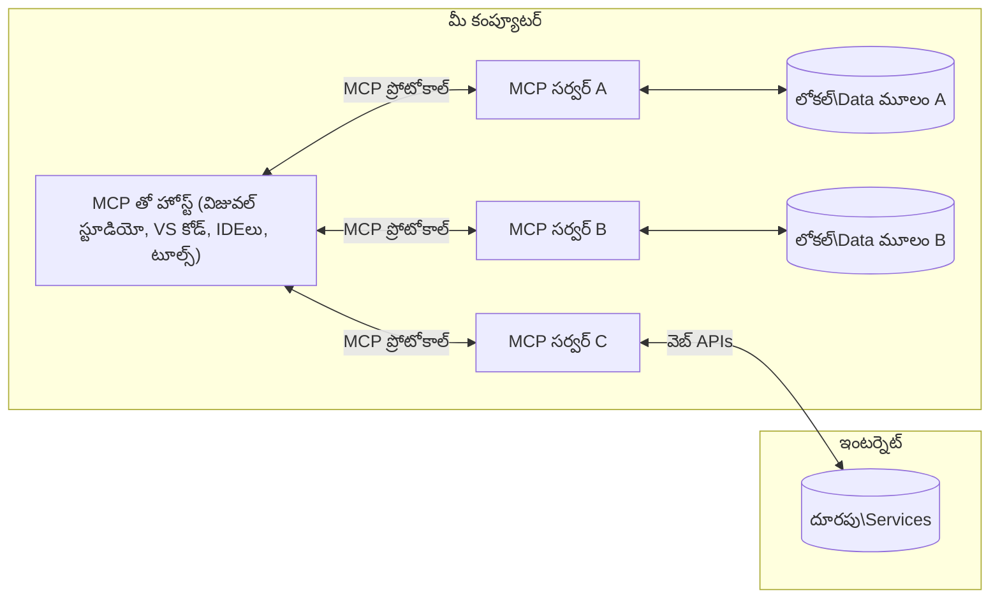

# MCP కోర్ భావనలు: AI ఇంటిగ్రేషన్ కోసం మోడల్ కాంటెక్స్ట్ ప్రోటోకాల్‌లో నైపుణ్యం సాధించడం

[](https://youtu.be/earDzWGtE84)

_(ఈ పాఠం వీడియోను వీక్షించడానికి పై చిత్రం క్లిక్ చేయండి)_

[Model Context Protocol (MCP)](https://github.com/modelcontextprotocol) అనేది భారీ భాషా మోడల్స్ (LLMs) మరియు బాహ్య సాధనాలు, అనువర్తనలు, మరియు డేటా మూలాల మధ్య కమ్యూనికేషన్‌ను సమర్థవంతంగా సరిచేసే శక్తివంతమైన, ప్రమాణీకృత ఫ్రేమ్‌వర్క్.  
ఈ గైడ్లో MCP యొక్క కోర్ భావనలు మీకు పరిచయం చేస్తుంది. మీరు దీని క్లయింట్-సర్వర్ వ్యూహం, ముఖ్య భాగాలు, కమ్యూనికేషన్ యాంత్రికతలు, మరియు అమలు ఉత్తమ అభ్యాసాలను నేర్చుకుంటారు.

- **స్పష్టమైన వాడుకరి సమ్మతి**: అన్ని డేటా యాక్సెస్ మరియు ఆపరేషన్లు అమలు చేయడానికి ముందుగా స్పష్టమైన వాడుకరి ఆమోదం అవసరం. వాడుకరులు ఎలాంటి డేటా యాక్సెస్ చేయబడుతోందో మరియు ఏ చర్యలు తీసుకోబడతాయో పూర్తిగా అర్థం చేసుకున్నట్టు ఉండాలి, అనుమతులు మరియు అధికారాలపై సూక్ష్మమైన నియంత్రణతో.

- **డేటా గోప్యత రక్షణ**: వాడుకరి డేటా స్పష్టమైన సమ్మతితో మాత్రమే ప్రదర్శించబడుతుంది మరియు మొత్తం ఇంటరాక్షన్ జీవితచక్రంలో పటిష్టమైన యాక్సెస్ నియంత్రణలతో రక్షించబడాలి. అమలు చేయడంలో అనధికార జమాన రహిత డేటా ప్రసారం నివారించాలి మరియు గోప్యతా సరిహద్దులను కఠినంగా నిర్వహించాలి.

- **సాధన అమలు భద్రత**: ప్రతి సాధన ఆహ్వానం స్పష్టమైన వాడుకరి సమ్మత అవసరం, సాధన యొక్క కార్యాచరణ, పారా మీటర్లు, మరియు సంభవిత ప్రభావాలను స్ఫష్టంగా అర్థం చేసుకోవాలి. పటిష్టమైన భద్రతా సరిహద్దులు అనుకోని, అపహాస్య, లేదా దుర్భావనాశీల సాధన అమలును నిరోధించాలి.

- **రవాణా స్థర భద్రత**: అన్ని కమ్యూనికేషన్ చానెల్స్ తగిన ఎన్‌క్రిప్షన్ మరియు ధృవీకరణ యాంత్రికతలను ఉపయోగించాలి. రిమోట్ కనెక్షన్స్ భద్రతా రవాణా ప్రోటోకాల్స్ మరియు సరైన క్రెడెన్షియల్ నిర్వహణను అమలు చేయాలి.

#### అమలు మార్గదర్శకాలు:

- **అనుమతి నిర్వహణ**: వాడుకరులు ఎవరెవరు సర్వర్లు, సాధనాలు, మరియు వనరులను యాక్సెస్ చేయగలరో నియంత్రించడానికి స్మూత్ మరియు సూక్ష్మ అనుమతి వ్యవస్థలను అమలు చేయడం  
- **ధృవీకరణ & అధికరణ**: సంక్షిప్త ధృవీకరణ పద్ధతులు (OAuth, API కీలు) సరైన టోకెన్ నిర్వహణ మరియు ముగింపు సమయంతో ఉపయోగించడం  
- **ఇన్‌పుట్ ధృవీకరణ**: కొలతించిన స్కీమాల ప్రకారం అన్ని పారా మీటర్లు మరియు డేటా ఇన్‌పుట్లను ధృవీకరించడం, ఇంజెక్షన్ దాడులను నివారించడానికి  
- **ఆడిట్ లాగింగ్**: భద్రతా పర్యవేక్షణ మరియు అనుగుణత కోసం అన్ని ఆపరేషన్ల సమగ్ర లాగులను నిర్వహించడం

## సమీక్ష

ఈ పాఠం మోడల్ కాంటెక్స్ట్ ప్రోటోకాల్ (MCP) పర్యావరణ వ్యవస్థను నిర్మించే ప్రాథమిక నిర్మాణం మరియు భాగాలను అన్వేషిస్తుంది. మీరు క్లయింట్-సర్వర్ నిర్మాణం, ముఖ్య భాగాలు, మరియు MCP ఇంటరాక్షన్లను శక్తివంతం చేసే కమ్యూనికేషన్ యాంత్రికతలను నేర్చుకుంటారు.

## ముఖ్య అభ్యాస లక్ష్యాలు

ఈ పాఠం ముగిసే వరకు, మీరు:

- MCP క్లయింట్-సర్వర్ నిర్మాణాన్ని అర్థం చేసుకుంటారు.  
- హోస్టులు, క్లయింట్‌లు, మరియు సర్వర్‌ల యొక్క పాత్రలు మరియు బాధ్యతలను గుర్తిస్తారు.  
- MCP ను సౌలభ్యవంతమైన ఇంటిగ్రేషన్ పొరగా రూపొందించే ముఖ్య ఫీచర్లను విశ్లేషిస్తారు.  
- MCP పర్యావరణంలో సమాచారం ఎలా ప్రవహిస్తుందో తెలుసుకుంటారు.  
- .NET, జావా, పైథాన్, మరియు జావాస్క్రిప్ట్ కోడ్ ఉదాహరణల ద్వారా ప్రాథమిక అవగాహన పొందుతారు.

## MCP నిర్మాణం: లోతైన దృష్టి

MCP పర్యావరణ వ్యవస్థ క్లయింట్-సర్వర్ మోడల్ మీద నిర్మించబడింది. ఈ మాడ్యూలర్ నిర్మాణం AI అనువర్తనాలు సాధనాలు, డేటాబేస్‌లు, APIలు, మరియు సంగ్రహాత్మక వనరుల‌తో సమర్థవంతంగా ఇంటరాక్ట్ అవ్వడానికి అనుమతిస్తుంది. ఈ నిర్మాణాన్ని ప్రాథమిక భాగాలుగా విభజిద్దాం.

మూలంగా, MCP ఒక క్లయింట్-సర్వర్ నిర్మాణాన్ని అనుసరిస్తుంది, ఇక్కడ ఒక హోస్ట్ అనువర్తనం అనేక సర్వర్లకు కనెక్ట్ అవుతుంది:


```mermaid
flowchart LR
    subgraph "మీ కంప్యూటర్"
        Host["MCP తో హోస్ట్ (విజువల్ స్టూడియో, VS కోడ్, IDEలు, టూల్స్)"]
        S1["MCP సర్వర్ A"]
        S2["MCP సర్వర్ B"]
        S3["MCP సర్వర్ C"]
        Host <-->|"MCP ప్రోటోకాల్"| S1
        Host <-->|"MCP ప్రోటోకాల్"| S2
        Host <-->|"MCP ప్రోటోకాల్"| S3
        S1 <--> D1[("లోకల్\Data మూలం A")]
        S2 <--> D2[("లోకల్\Data మూలం B")]
    end
    subgraph "ఇంటర్నెట్"
        S3 <-->|"వెబ్ APIs"| D3[("దూరపు\Services")]
    end
```  
- **MCP హోస్టులు**: VSCode, Claude డెస్క్‌టాప్, IDEలు, లేదా MCP ద్వారా డేటాను యాక్సెస్ చేయదలిచిన AI సాధనాలు  
- **MCP క్లయింట్లు**: సర్వర్లతో 1:1 కనెక్షన్లను నిర్వహించే ప్రోటోకాల్ క్లయింట్లు  
- **MCP సర్వర్లు**: ప్రమాణీకృత Model Context Protocol ద్వారా నిర్దిష్ట సామర్థ్యాలను అందించే కాంతి-భారమైన ప్రోగ్రామ్‌లు  
- **లోకల్ డేటా మూలాలు**: MCP సర్వర్లు భద్రపరచగల మీ కంప్యూటర్ ఫైళ్ల, డేటాబేస్‌ల, మరియు సేవల  
- **రిమోట్ సేవలు**: ఇంటర్నెట్ ద్వారా అందుబాటులో ఉన్న బాహ్య సిస్టమ్స్, MCP సర్వర్లు APIల ద్వారా కనెక్ట్ కావచ్చు.

MCP ప్రోటోకాల్ ఒక రూపాంతర ప్రామాణికం, ఇది తేదీ-ఆధారిత సంచిక (YYYY-MM-DD ఫార్మాట్) ఉపయోగిస్తుంది. ప్రస్తుత ప్రోటోకాల్ సంచిక **2025-11-25**. మీరు [ప్రోటోకాల్ స్పెసిఫికేషన్](https://modelcontextprotocol.io/specification/2025-11-25/)లో తాజా అప్డేట్స్ చూడొచ్చు.

### 1. హోస్టులు

Model Context Protocol (MCP) లో, **హోస్టులు** అనేవి వాడుకర్లు ప్రోటోకాల్‌తో ఇంటరాక్ట్ అయ్యే ప్రధాన ఇంటర్‌ఫేస్‌గా పనిచేసే AI అనువర్తనాలు. హోస్టులు ఒక MCP సర్వర్‌కు ప్రత్యేకంగా MCP క్లయింట్లను సృష్టించడం ద్వారా అనేక MCP సర్వర్లకు కనెక్షన్లను సమన్వయపరుచుకుంటాయి. హోస్టుల ఉదాహరణలు:

- **AI అనువర్తనాలు**: Claude డెస్క్‌టాప్, Visual Studio Code, Claude కోడ్  
- **డెవలప్‌మెంట్ వాతావరణాలు**: MCP ఇంటిగ్రేషన్ కలిగిన IDEలు మరియు కోడ్ ఎడిటర్లు  
- **కస్టమ్ అనువర్తనాలు**: ప్రత్యేకంగా రూపొందించిన AI ఏజెంట్లు మరియు సాధనాలు

**హోస్టులు** AI మోడల్ ఇంటరాక్షన్లను సమన్వయపరచు అనువర్తనాలు. అవి:

- **AI మోడళ్లను ఆర్కెస్ట్రేట్ చేయడం**: LLMలతో పనిచేసి సవాలు లేదా నిర్ధారణలను ఉత్పత్తి చేస్తాయి మరియు AI వర్క్‌ఫ్లోలను సమన్వయపరుస్తాయి  
- **క్లయింట్ కనెక్షన్లను నిర్వహించడం**: ప్రతి MCP సర్వర్ కనెక్షన్‌కు ఒక MCP క్లయింట్ సృష్టించి నిర్వహిస్తాయి  
- **వాడుకరి ఇంటర్‌ఫేస్ నియంత్రణ**: సంభాషణ ప్రవాహం, వాడుకరి ఇంటరాక్షన్లు మరియు ప్రతిస్పందన ప్రదర్శన స్వాధీనం చేసుకుంటాయి  
- **భద్రత అమలు**: అనుమతులు, భద్రతా నియంత్రణలు, మరియు ధృవీకరణలను నియంత్రిస్తాయి  
- **వాడుకరి సమ్మతి నిర్వహణ**: డేటా పంచుకునే మరియు సాధన అమలు కోసం వాడుకరి ఆమోదాన్ని నిర్వహిస్తాయి

### 2. క్లయింట్లు

**క్లయింట్లు** అనేవి ముఖ్య భాగాలు, అవి హోస్ట్లు మరియు MCP సర్వర్ల మధ్య ప్రత్యేక 1:1 కనెక్షన్లను నిర్వహిస్తాయి. ప్రతి MCP క్లయింట్ హోస్ట్ ద్వారా ప్రత్యేక MCP సర్వర్‌కు కనెక్ట్ అయ్యేందుకు సృష్టించబడుతుంది, ఇది ఘనమైన మరియు భద్రతయుత కమ్యూనికేషన్ ఛానెల్స్‌ను నిర్ధారిస్తుంది. అనేక క్లయింట్లు హోస్టుకు అనేక సర్వర్లకు ఒకేసారి కనెక్ట్ కావడానికి అనుమతిస్తాయి.

**క్లయింట్లు** అనేవి హోస్ట్ అనువర్తనం లో కనెక్టర్ భాగాలు. అవి:

- **ప్రోటోకాల్ కమ్యూనికేషన్**: JSON-RPC 2.0 అభ్యర్థనలు సర్వర్లకు పంపి ప్రాంప్ట్స్ మరియు సూచనలను అందిస్తాయి  
- **సామర్థ్యం చర్చ**: ఇనిషియలైజేషన్ సమయంలో సర్వర్లతో మద్దతుపడిన ఫీచర్‌లు మరియు ప్రోటోకాల్ సంచికలను చర్చిస్తాయి  
- **సాధన అమలు**: మోడళ్ల నుంచి సాధన అమలు అభ్యర్థనలను నిర్వహించి ప్రతిస్పందనలను ప్రాసెస్ చేస్తాయి  
- **ప్రస్తుతం నవీకరణలు**: సర్వర్ల నుండి నోటిఫికేషన్లు మరియు అసలు సమయ నవీకరణలను నిర్వహిస్తాయి  
- **ప్రతిస్పందన ప్రాసెసింగ్**: వాడుకర్లకు ప్రదర్శించడానికి సర్వర్ ప్రతిస్పందనలను ప్రాసెస్ చేసి ఫార్మాట్ చేస్తాయి

### 3. సర్వర్లు

**సర్వర్లు** అనేవి MCP క్లయింట్లకు కాంటెక్స్ట్, సాధనాలు, మరియు సామర్థ్యాలను అందించే ప్రోగ్రామ్లు. అవి స్థానికంగా (హోస్ట్ ఉన్న యంత్రం) లేదా రిమోట్ (బాహ్య ప్లాట్‌ఫారమ్‌లపై) అమలు చేయవచ్చు, క్లయింట్ అభ్యర్థనలను చేతలెక్క చేసి నిర్మిత ప్రతిస్పందనలను అందించే బాధ్యత వహిస్తాయి. సర్వర్లు ప్రమాణీకృత Model Context Protocol ద్వారా నిర్దిష్ట ఫంక్షనాలిటీని ప్రదర్శిస్తాయి.

**సర్వర్లు** అనేవి కాంటెక్స్ట్ మరియు సామర్థ్యాలను అందించే సేవలుగాను ఉంటాయి. అవి:

- **ఫీచర్ నమోదు**: అందుబాటులో ఉన్న ప్రిమిటివ్‌లు (వనరులు, ప్రాంప్ట్‌లు, సాధనాలు) క్లయింట్లకు నమోదు చేసి ప్రదర్శిస్తాయి  
- **అభ్యర్థన ప్రాసెసింగ్**: సాధన కాల్స్, వనరు అభ్యర్థనలు, మరియు ప్రాంప్ట్ అభ్యర్థనలను స్వీకరించి అమలు చేస్తాయి  
- **కాంటెక్స్ట్ అందింపు**: మోడల్ ప్రతిస్పందనలను మెరుగుపరచడానికి సారగర్భిత సమాచారాన్ని అందిస్తాయి  
- **స్థితి నిర్వహణ**: సెషన్ స్థితిని నిర్వహించి స్థితిస్థాపక ఇంటరాక్షన్లను అవసరమైతే నిర్వహిస్తాయి  
- **అసలు సమయ నోటిఫికేషన్లు**: సామర్థ్యం మార్పుల మరియు నవీకరణల గురించి కనెక్ట్ అయిన క్లయింట్లకు నోటిఫై చేస్తాయి

సర్వర్లు ఎవరైనా అభివృద్ధి చేయవచ్చు, ప్రత్యేకమైన ఫంక్షనాలిటీతో మోడల్ సామర్థ్యాలను విస్తరించడానికి, మరియు స్థానిక మరియు రిమోట్ అమలులో రెండింటినీ మద్దతు ఇస్తాయి.

### 4. సర్వర్ ప్రిమిటివ్‌లు

Model Context Protocol (MCP) లో సర్వర్లు మూడు ప్రాథమిక **ప్రిమిటivs**ను అందిస్తాయి, ఇవి క్లయింట్లు, హోస్ట్లు, మరియు భాషా మోడళ్ల మధ్య సంతృప్తికరమైన ఇంటరాక్షన్లకు అవశ్యక భవన భాగాలు. ఈ ప్రిమిటివ్‌లు ప్రోటోకాల్ ద్వారా అందుబాటులో ఉన్న కాంటెక్స్ట్ సమాచారం మరియు చర్యలను స్పష్టంగా నిర్వచిస్తాయి.

MCP సర్వర్లు కింది మూడు ప్రాథమిక ప్రిమిటివ్‌ల ఏదైనా కలయికను ప్రదర్శించవచ్చు:

#### వనరులు (Resources)

**వనరులు** అనేవి AI అనువర్తనాలకు కాంటెక్స్చువల్ సమాచారాన్ని అందించే డేటా మూలాలు. అవి స్థిరమైన లేదా డైనమిక్ కంటెంట్‌ను సూచిస్తాయి, ఇది మోడల్ అర్ధం చేసుకోవడంలో మరియు నిర్ణయం తీసుకోవడంలో మెరుగుపరుస్తుంది:

- **సందర్భ సమాచారము**: AI మోడల్ సేవకు నిర్మిత సమాచారం మరియు కాంటెక్స్ట్  
- **జ్ఞాన డేటాబేస్‌లు**: దస్త్రాల నిల్వ, ఆర్టికల్స్, మాన్యువల్స్, మరియు పరిశోధనా పత్రాలు  
- **లోకల్ డేటా మూలాలు**: ఫైళ్ల, డేటాబేస్‌లు, మరియు స్థానిక సిస్టమ్ సమాచారం  
- **బాహ్య డేటా**: API ప్రతిస్పందనలు, వెబ్ సేవలు, మరియు రిమోట్ సిస్టమ్ డేటా  
- **డైనమిక్ కంటెంట్**: బాహ్య పరిస్థితుల ఆధారంగా ప్రస్తుతకాల డేటా

వనరులు URIల ద్వారా గుర్తించబడతాయి మరియు `resources/list` ద్వారా ఆవిష్కరించబడతాయి, మరియు `resources/read` ద్వారా పొందవచ్చు:

```text
file://documents/project-spec.md
database://production/users/schema
api://weather/current
```
  
#### ప్రాంప్ట్‌లు (Prompts)

**ప్రాంప్ట్‌లు** అనేవి మళ్లీ ఉపయోగించగల టెంప్లేట్లు, ఇవి భాషా మోడళ్లతో ఇంటరాక్షన్‌లను నిర్మాణాత్మకంగా చేయడానికి సహాయపడతాయి. ఇవి ప్రమాణీకృత ఇంటరాక్షన్ నమూనాలు మరియు టెంప్లేటెడ్ వర్క్‌ఫ్లోలను అందిస్తాయి:

- **టెంప్లేట్ ఆధారిత ఇంటరాక్షన్లు**: ముందుగా నిర్మిత సందేశాలు మరియు సంభాషణ ప్రారంభాలు  
- **వర్క్‌ఫ్లో టెంప్లేట్లు**: సాధారణ పనులు మరియు ఇంటరాక్షన్ల కోసం ప్రమాణీకృత క్రమాలు  
- **ఫ్యూ-షాట్ ఉదాహరణలు**: మోడల్ సూచన కోసం ఉదాహరణల ఆధారిత టెంప్లేట్లు  
- **సిస్టమ్ ప్రాంప్ట్‌లు**: మోడల్ ప్రవర్తన మరియు కాంటెక్స్ట్ నిర్వచించే ఫౌండేషనల్ ప్రాంప్ట్‌లు  
- **డైనమిక్ టెంప్లేట్లు**: నిర్దిష్ట కాంటెక్స్ట్ లకు తగ్గట్టుగా మారే పారా మీటర్ ఆధారిత ప్రాంప్ట్‌లు

ప్రాంప్ట్‌లు వేరియబుల్ స్థానంలో పెట్టడాన్ని మద్దతు ఇస్తాయి, అవి `prompts/list` ద్వారా ఆవిష్కరించబడి, `prompts/get` ద్వారా పొందవచ్చు:

```markdown
Generate a {{task_type}} for {{product}} targeting {{audience}} with the following requirements: {{requirements}}
```
  
#### సాధనాలు (Tools)

**సాధనాలు** అనేవి AI మోడళ్లు అమలు చేయగల ఫంక్షన్లు, ఇవి నిర్దిష్ట చర్యలను నిర్వహించడానికి మోడళ్లకు అనుమతిస్తాయి. ఇవి MCP పర్యావరణంలో "క్రియలు"గా ఉంటాయి, మోడళ్లు బాహ్య వ్యవస్థలతో ఇంటరాక్ట్ అయ్యేందుకు వీలు చేస్తాయి:

- **అమలయ్యే ఫంక్షన్లు**: నిర్దిష్ట పారా మీటర్లతో మోడళ్లు కాల్ చేయగల సమర్థ ఆపరేషన్లు  
- **బాహ్య వ్యవస్థ సమైక్యం**: API కాల్స్, డేటాబేస్ క్వెరీలు, ఫైల్ ఆపరేషన్లు, లెక్కింపులు  
- **విశిష్ట గుర్తింపు**: ప్రతి సాధనకు ప్రత్యేక పేరు, వివరణ, మరియు పారా మీటర్ స్కీమా ఉంటుంది  
- **నిర్మిత ఇన్‌పుట్/ఆؤట్పుట్**: సాధనాలు ధృవీకరించిన పారా మీటర్లను స్వీకరిస్తాయి మరియు నిర్మిత, టైప్డ్ ప్రతిస్పందనలను తిరిగి ఇస్తాయి  
- **చర్య సామర్థ్యాలు**: మోడళ్లు నిజ జీవిత చర్యలను చేయగలగడం మరియు ప్రత్యక్ష డేటాను పొందడం

సాధనాలు పారా మీరు ధృవీకరణ కోసం JSON స్కీమాతో నిర్వచించబడతాయి, `tools/list` ద్వారా ఆవిష్కరించబడతాయి, మరియు `tools/call` ద్వార అమలు అవుతాయి. సాధనాలు మెరుగైన UI ప్రదర్శన కోసం అదనపు మెటాడేటాగా **ఐకాన్లను** కూడా కలిగి ఉండవచ్చు.

**సాధన వ్యాఖ్యానాలు**: సాధనాలు నిర్వహణలో సూచనాత్మక వ్యాఖ్యానాలు (`readOnlyHint`, `destructiveHint` వంటి)ని మద్దతు ఇస్తాయి, ఇవి సాధనం చదవడానికి మాత్రమేనా లేదా నాశనకరమైనదా అన్న దానిపై క్లయింట్లకు సమాచారాన్ని అందించి, సముచిత నిర్ణయాలు తీసుకోవడానికి సహాయపడతాయి.

ఉదాహరణ సాధన నిర్వచనం:

```typescript
server.tool(
  "search_products", 
  {
    query: z.string().describe("Search query for products"),
    category: z.string().optional().describe("Product category filter"),
    max_results: z.number().default(10).describe("Maximum results to return")
  }, 
  async (params) => {
    // శోధనను నిర్వహించి నిర్మిత ఫలితాలను తిరిగి ఇవ్వండి
    return await productService.search(params);
  }
);
```
  
## క్లయింట్ ప్రిమిటివ్స్

Model Context Protocol (MCP) లో, **క్లయంట్లు** ప్రిమిటివ్‌లను ప్రదర్శించవచ్చు, ఇవి సర్వర్లు హోస్ట్ అనువర్తనానికి అదనపు సామర్థ్యాలను అభ్యర్థించేందుకు అనుమతిస్తాయి. ఈ క్లయింట్-చేరిన ప్రిమిటివ్‌లు మరింత సాంప్రదాయ, ఇంటరాక్టివ్ సర్వర్ అమలు కోసం వీలు కలిగిస్తాయి, ఇవి AI మోడల్ సామర్థ్యాలు మరియు వాడుకరి ఇంటరాక్షన్లను పొందవచ్చు.

### శాంప్లింగ్ (Sampling)

**శాంప్లింగ్** ద్వారా సర్వర్లు వారి క్లయింట్ AI అనువర్తనాల నుంచి భాషా మోడల్ పూర్తిచేసే అభ్యర్థనలు చేయగలవు. ఈ ప్రిమిటివ్ సర్వర్లకు తమ సొంత మోడల్ ఆధారాలు లేకుండానే LLM సామర్థ్యాలను యాక్సెస్ చేసుకోవడానికి అనుమతిస్తుంది:

- **మోడల్-స్వతంత్ర యాక్సెస్**: సర్వర్లు LLM SDKలను కలుపుకోకుండా లేదా మోడల్ యాక్సెస్ నిర్వహణ లేకుండా పూర్తిచేసే అభ్యర్థనలు చేయగలవు  
- **సర్వర్-ప్రేరిత AI**: సర్వర్లు స్వతంత్రంగా క్లయింట్ యొక్క AI మోడల్ ఉపయోగించి కంటెంట్ రూపొందించేందుకు అవకాశం  
- **పునరావృత LLM ఇంటరాక్షన్లు**: సర్వర్లకు ఉత్పత్తి సహాయం అవసరమయ్యే సంక్లిష్ట పరిస్థితులనూ మద్దతు  
- **డైనమిక్ కంటెంట్ సృష్టి**: హోస్ట్అధ్వరక మోడల్ ఉపయోగించి సందర్భానుగుణ ప్రతిస్పందనల సృష్టి  
- **సాధన కాలింగ్ మద్దతు**: సర్వర్లు శాంప్లింగ్ సమయంలో సాధనాలు అమలు చేయడానికి క్లయింట్ యొక్క మోడల్‌కు `tools` మరియు `toolChoice` పారా మీటర్లను అందించగలవు

శాంప్లింగ్ `sampling/complete` మెథడ్ ద్వారా ప్రారంభించబడుతుంది, ఇక్కడ సర్వర్లు క్లయింట్లకు పూర్తిచేసే అభ్యర్థనలు పంపుతారు.

### రూట్స్ (Roots)

**రూట్స్** సర్వర్లకు ఫైల్‌సిస్టమ్ సరిహద్దులను అర్థం చేసుకోవడానికి క్లయింట్లు సమర్థవంతమైన పద్ధతిని అందిస్తాయి, అవి సర్వర్లు ఎక్కడ ఫోల్డర్ల మరియు ఫైల్స్ యాక్సెస్ చేయగలరో స్ఫష్టం చేస్తాయి:

- **ఫైల్‌సిస్టమ్ సరిహద్దులు**: సర్వర్లు ఫైల్‌సిస్టమ్‌లో ఎక్కడ పనిచేయగలరో నిర్వచిస్తాయి  
- **యాక్సెస్ నియంత్రణ**: సర్వర్లకు ఏ డైరెక్టరీలు మరియు ఫైల్స్ అనుమతి కలిగి ఉన్నాయని అర్థం చేసుకొనడానికి సహాయపడతాయి  
- **డైనమిక్ నవీకరణలు**: కింద ముక్కలు మారినప్పుడు క్లయింట్లు సర్వర్లకు సూచనలు పంపుతాయి  
- **URI ఆధారిత గుర్తింపు**: రూట్స్ `file://` URIల ద్వారా యాక్సెసబుల్ డైరెక్టరీలు మరియు ఫైల్స్ గుర్తిస్తాయి

రూట్స్ `roots/list` ద్వారా ఆవిష్కరించబడతాయి, క్లయింట్లు రూట్స్ మారినప్పుడు `notifications/roots/list_changed` నోటిఫికేషన్లు పంపుతాయి.

### ఎలిసిటేషన్ (Elicitation)

**ఎలిసిటేషన్** ద్వారా సర్వర్లు క్లయింట్ ఇంటర్‌ఫేస్ ద్వారా వాడుకరుల నుంచి అదనపు సమాచారం లేదా ధృవీకరణ కోరగలవు:

- **వాడుకరి ఇన్‌పుట్ అభ్యర్థనలు**: సాధన అమలుకు కావలసిన అదనపు సమాచారాన్ని సర్వర్లు అడగగలవు  
- **ధృవీకరణ డైలాగ్లు**: స్పర్శులు లేదా ప్రభావవంతమైన చర్యలకు వాడుకరి ఆమోదాన్ని కోరగలవు  
- **ఇంటరాక్టివ్ వర్క్‌ఫ్లోలు**: దశలవారీ వాడుకరి ఇంటరాక్షన్లను సృష్టించడానికి సర్వర్లకు అనుమతిస్తుంది  
- **డైనమిక్ పారా మీటర్ సేకరణ**: సాధన అమలు సమయంలో మిస్సింగ్ లేదా ఐచ్ఛిక పారా మీరు సేకరించడం

ఎలిసిటేషన్ అభ్యర్థనలు క్లయింట్ ఇంటర్‌ఫేస్ ద్వారా వాడుకరి ఇన్‌పుట్ సేకరించడానికి `elicitation/request` మెథడ్ ఉపయోగించి చేస్తారు.

**URL మోడ్ ఎలిసిటేషన్**: సర్వర్లు URL ఆధారిత వాడుకరి ఇంటరాక్షన్లను కూడా అభ్యర్థించవచ్చు, ఇది సర్వర్లు వాడుకర్లను బాహ్య వెబ్ పేజీలకు తొలగించి ధృవీకరణ, ఆమోదం లేదా డేటా నమోదు చేయించేందుకు అనుమతిస్తుంది.

### లాగింగ్ (Logging)

**లాగింగ్** ద్వారా సర్వర్లు క్లయింట్లకు నిర్మిత లాగ్ సందేశాలను పంపి డీబగ్గింగ్, పర్యవేక్షణ, మరియు ఆపరేషనల్ దృశ్యత్వం అందించగలవు:

- **డీబగ్గింగ్ మద్దతు**: సమస్యల పరిష్కారానికి విస్తృత అమలు లాగులను అందించేందుకు సర్వర్లకు వీలుగా  
- **ఆపరేషనల్ పర్యవేక్షణ**: క్లయింట్లకు స్థితి నవీకరణలు మరియు పనితీరు మెట్రిక్స్ పంపడం  
- **పొరపాటు నివేదికలు**: విస్తృత పొరపాటు సందర్భాలు మరియు నిర్ధారణ సమాచారాన్ని అందించడం  
- **ఆడిట్ ట్రెయిల్స్**: సర్వర్ ఆపరేషన్లు మరియు నిర్ణయాల సమగ్ర లాగులను సృష్టించడం

లాగింగ్ సందేశాలు సర్వర్ ఆపరేషన్లపై పారదర్శకతను అందించడానికి మరియు డీబగ్గింగ్ సౌలభ్యం కోసం క్లయింట్లకు పంపబడతాయి.

## MCPలో సమాచార ప్రవాహం

Model Context Protocol (MCP) హోస్ట్లు, క్లయింట్లు, సర్వర్లు, మరియు మోడళ్ల మధ్య నిర్మిత సమాచార ప్రవాహాన్ని నిర్వచిస్తుంది. ఈ ప్రవాహాన్ని అర్థం చేసుకోవడం వాడుకరి అభ్యర్థనలు ఎలా ప్రాసెస్ అవుతాయో, మరియు బాహ్య సాధనాలు మరియు డేటా ఎలా మోడల్ ప్రతిస్పందనలలో ఏకీకృతమవుతాయో స్పష్టత ఇస్తుంది.
- **హోస్ట్ కనెక్షన్ ప్రారంభిస్తుంది**  
  హోస్ట్ అప్లికేషన్ (IDE లేదా చాట్ ఇంటర్ఫేస్ వంటివి) సాధారణంగా STDIO, WebSocket లేదా మరో మద్దతు ఉన్న ట్రాన్స్‌పోర్ట్ ద్వారా MCP సర్వర్‌కు కనెక్షన్ ఏర్పరుస్తుంది.

- **సామర్థ్య చర్చ**  
  క్లయింట్ (హోస్ట్‌లోlegdembedding్) మరియు సర్వర్ తమ మద్దతునిచ్చే ఫీచర్ల, టూల్స్, వనరుల, మరియు ప్రోటోకాల్ వెర్షన్ల గురించి సమాచార మార్పిడి చేస్తారు. ఇది రెండు వైపులూ సెషన్ కోసం అందుబాటులో ఉన్న సామర్థ్యాలను అర్థం చేసుకోవడాన్ని నిర్ధారిస్తుంది.

- **వినియోగదారు అభ్యర్థన**  
  యూజర్ హోస్ట్‌తో (ఉదా: ఒక ప్రాంప్ట్ లేదా కమాండ్ నమోదు చేస్తూ) ఇন্টারాక్షన్ చేస్తాడు. హోస్ట్ ఆ ఇన్‌పుట్‌ను సేకరించి ప్రాసెసింగ్ కోసం క్లయింట్‌కు పంపుతుంది.

- **వనరు లేదా టూల్ ఉపయోగం**  
  - క్లయింట్ మోడల్ అవగాహనను పెంచడానికి అవసరమైతే సర్వర్ నుండి అదనపు సందర్భం లేదా వనరులు (ఫైల్స్, డేటాబేస్ ఎంట్రీలు లేదా జ్ఞానాధార ఆర్టికల్స్ వంటివి) అభ్యర్థించవచ్చు.  
  - మోడల్ టూల్ అవసరం ఉందని నిర్ధారిస్తే (ఉదా: డేటా తీసుకురావడానికి, లెక్కింపు చేయడానికి లేదా API పిలవడానికి), క్లయింట్ సర్వర్‌కు టూల్ పిలుపు అభ్యర్థన పంపుతుంది, దీనిలో టూల్ పేరు మరియు పారామితులు ఉంటాయి.

- **సర్వర్ అమలు**  
  సర్వర్ వనరు లేదా టూల్ అభ్యర్థనను అందుకొని అవసరమైన ఆపరేషన్లు (ఫంక్షన్ నడిపించడం, డేటాబేస్ ప్రశ్నించడం లేదా ఫైల్ పొందడం) చేస్తుంది మరియు ఫలితాలను క్లయింట్‌కు వ్యవస్థాపిత ఫార్మాట్లో తిరిగి ఇస్తుంది.

- **ప్రతిస్పందన ఉత్పత్తి**  
  క్లయింట్ సర్వర్ యొక్క ప్రతిస్పందనలు (వనరు డేటా, టూల్ అవుట్‌పుట్స్ వంటివి) ongoing మోడల్ ఇంటరాక్షన్‌లో చేర్చుతుంది. మోడల్ ఈ సమాచారంతో సమగ్రమైన, సందర్భానుగుణమైన ప్రతిస్పందనను ఉత్పత్తి చేస్తుంది.

- **ఫలితాని ప్రదర్శన**  
  హోస్ట్ క్లయింట్ నుండి తుది అవుట్‌పుట్‌ని అందుకొని యూజర్‌కు ప్రదర్శిస్తుంది, సాధారణంగా మోడల్ సృష్టించిన టెక్స్ట్ మరియు టూల్ అమలు లేదా వనరు లుక్‌ప్స్ ఫలితాలను కూడ కలిగి ఉంటుంది.

ఈ ఫ్లో MCPకు అధునాతన, ఇంటరాక్టివ్, సందర్భానుగుణ AI అప్లికేషన్లకు మోడల్స్‌ను బయట టూల్స్ మరియు డేటా సోర్స్‌లతో సజావుగా క‌నెక్ట్ చేయ‌డానికి అనుమతిస్తుంది.

## ప్రోటోకాల్ ఆర్కిటెక్చర్ & లేయర్స్

MCP పూర్తీ కమ్యూనికేషన్ ఫ్రేమ్‌వర్క్‌ను అందించడానికి కలిసి పని చేసే రెండు స్పష్టమైన ఆర్కిటెక్చరల్ లేయర్స్‌తో ఉంటుంది:

### డేటా లేయర్

**డేటా లేయర్** **JSON-RPC 2.0**ను తమ పునాది గా తీసుకొని MCP ప్రోటోకాల్ కోర్‌ను అమలు చేస్తుంది. ఈ లేయర్ సందేశ నిర్మాణం, semantics మరియు ఇంటరాక్షన్ నమూనాలను నిర్వచిస్తుంది:

#### ముఖ్య భాగాలు:

- **JSON-RPC 2.0 ప్రోటోకాల్**: అన్ని కమ్యూనికేషన్స్ JSON-RPC 2.0 మెసేజ్ ఫార్మాట్ ను ప్రామాణికంగా ఉపయోగిస్తాయి (మెతడ్ కాల్స్, ప్రతిస్పందనలు, నోటిఫికేషన్స్)
- **లైఫ్ సైకిల్ మేనేజ్‌మెంట్**: కనెక్షన్ మొదలుపెట్టడం, సామర్థ్య చర్చలు, సెషన్ ముగింపు నిర్వహణ
- **సర్వర్ ప్రిమిటివ్స్**: సర్వర్స్ టూల్స్, వనరులు, మరియు ప్రాంప్ట్స్ ద్వారా కోర్ సదుపాయాలు అందించగలుగుతాయి
- **క్లయింట్ ప్రిమిటివ్స్**: సర్వర్స్ LLMల నుండి సాంప్లింగ్ అభ్యర్థించగలుగుతారు, యూజర్ ఇన్‌పుట్ తీసుకోవచ్చు, మరియు లాగ్ సందేశాలు పంపవచ్చు
- **రిఅల్-టైం నోటిఫికేషన్స్**: అసింక్రోనస్ నోటిఫికేషన్లకు మద్దతు ఇస్తుంది, పోలింగ్ లేకుండా డైనమిక్ అప్‌డేట్స్ కోసం

#### ప్రధాన ఫీచర్లు:

- **ప్రోటోకాల్ వెర్షన్ చర్చ**: సరిపోలుకోగలిగేలా తేదీ ఆధారిత వెర్షనింగ్ (YYYY-MM-DD) ఉపయోగిస్తుంది  
- **సామర్థ్యం కనుగొనడము**: ప్రారంభ సమయంలో క్లయింట్ లు మరియు సర్వర్ లు మద్దతు ఇచ్చే ఫీచర్లు మారుస్తారు  
- **స్టేట్‌ఫుల్ సెషన్స్**: అనేక ఇంటరాక్షన్‌లకు కంటెక్స్ట్ కొనసాగింపునకు కనెక్షన్ ఎస్టేట్‌ను నిర్వహిస్తుంది

### ట్రాన్స్పోర్ట్ లేయర్

**ట్రాన్స్పోర్ట్ లేయర్** MCP పార్టిసిపెంట్స్ మధ్య కమ్యూనికేషన్ ఛానెల్స్, సందేశ ఫ్రేమింగ్, మరియు ప్రామాణికతను నిర్వహిస్తుంది:

#### మద్దతు పొందిన ట్రాన్స్పోర్ట్ మెకానిజమ్స్:

1. **STDIO ట్రాన్స్పోర్ట్**:  
   - డైరెక్ట్ ప్రాసెస్ కమ్యూనికేషన్ కోసం స్టాండర్డ్ ఇన్‌పుట్/అవుట్‌పుట్ స్ట్రీమ్స్ ఉపయోగిస్తుంది  
   - అదే యంత్రం లోకల్ ప్రాసెస్‌లకు అత్యుత్తమం, నెట్‌వర్క్ ఓవ‌ర్‌హెడ్ లేదు  
   - స్థానిక MCP సర్వర్ అమలుల కోసం సాధారణంగా ఉపయోగించబడును  

2. **స్ట్రీమబుల్ HTTP ట్రాన్స్పోర్ట్**:  
   - క్లయింట్-కు-సర్వర్ సందేశాలకై HTTP POST ఉపయోగిస్తుంది  
   - సర్వర్ నుండి క్లయింట్‌కి స్ట్రీమింగ్ కోసం ఐచ్ఛిక సర్వర్-సెంట్ ఈవెంట్స్ (SSE)  
   - నెట్‌వర్క్‌లపై రిమోట్ సర్వర్ కమ్యూనికేషన్  
   - ప్రామాణిక HTTP ఆథెంటికేషన్‌కు మద్దతు (బియరర్ టోకెన్లు, API కీలు, కస్టమ్ హెడర్లు)  
   - సెక్యూర్ టోకెన్ ఆధారిత ఆథెంటికేషన్ కోసం MCP Oauthను推奨ిస్తుంది

#### ట్రాన్స్పోర్ట్ అభిసరణ:

ట్రాన్స్పోర్ట్ లేయర్ కమ్యూనికేషన్ వివరాలను డేటా లేయర్ నుండి విడదీస్తుంది, అందువలన అన్ని ట్రాన్స్పోర్ట్ మెకానిజమ్స్ కోసం అదే JSON-RPC 2.0 సందేశ ఫార్మాట్ ఉపయోగించవచ్చు. ఈ అభిసరణ అనువర్తనాలను లోకల్ మరియు రిమోట్ సర్వర్‌ల మధ్య సజావుగా మార్పిడి చేయడానికి అనుమతిస్తుంది.

### భద్రతా పరంగా పరిగణించవలసిన అంశాలు

MCP అమలు సురక్షితమైన, విశ్వసనీయ మరియు భద్రత కలిగి ఉండే ఇంటరాక్షన్ల కోసం పలు క్రిటికల్ భద్రతా సూత్రాలను పాటించాలి:

- **వినియోగదారుల అనుమతి మరియు নিয়ంత్రణ**: యూజర్లు ఏ డేటా యాక్సెస్ అవుతుందో లేదా ఎలాంటి ఆపరేషన్లు జరుగుతాయో స్పష్టమైన అనుమతిని ఇవ్వాలి. యూజర్లు ఏ డేటా పంచుకోవాలో మరియు ఏ చర్యలు అనుమతించాలో క్లియర్ కంట్రోల్ కలిగి ఉండాలి. దాని కోసం సెకండ్‌రీ UI ఫీచర్ల ద్వారా సమీక్షించడానికి మరియు ఆమోదించడానికి సౌకర్యాలు ఉండాలి.

- **డేటా గోప్యత**: యూజర్ డేటా స్పష్టమైన అనుమతి లేకుండానే బయటపడకూడదు మరియు సరైన యాక్సెస్ కంట్రోల్స్ ద్వారా రక్షించబడాలి. MCP అమలులో అనధికార డేటా ప్రసరణకు భద్రత ఉండాలి మరియు అన్ని ఇంటరాక్షన్లలో గోప్యతని నిర్ధారించాలి.

- **టూల్ భద్రత**: ఏ టూల్ పిలుస్తున్న ముందుకు యూజర్ స్పష్టమైన అనుమతిని ఇవ్వాలి. యూజర్లు ప్రతి టూల్ యొక్క ఫంక్షనాలిటీ స్పష్టంగా అర్థం చేసుకోవాలి. అనూహ్యమైన లేదా అసురక్షిత టూల్ అమలు సాధ్యం కాకుండా బలమైన భద్రతా సరిహద్దులు అమలు చేయాలి.

ఈ భద్రతా సూత్రాలను పాటించడం ద్వారా MCP మొత్తం ప్రోటోకాల్ ఇంటరాక్షన్లలో యూజర్ విశ్వాసం, గోప్యత మరియు భద్రతను నిర్ధారిస్తుంది మరియు శక్తివంతమైన AI ఇంటిగ్రేషన్లను అందిస్తుంది.

## కోడ్ ఉదాహరణలు: ప్రధాన భాగాలు

కింది ఉదాహరణలు కొన్ని ప్రముఖ ప్రోగ్రామింగ్ భాషల్లో కీలక MCP సర్వర్ భాగాలు మరియు టూల్స్ ఎలా అమలు చేయాలో చూపిస్తాయి.

### .NET ఉదాహరణ: టూల్స్ తో సాధారణ MCP సర్వర్ తయారీ

ఇది సాధారణ MCP సర్వర్‌ను కస్టమ్ టూల్స్ ఉపయోగించి ఎలా రూపొందించాలో చూపే ప్రాక్టికల్ .NET కోడ్ ఉదాహరణ:

```csharp
using System;
using System.Threading.Tasks;
using ModelContextProtocol.Server;
using ModelContextProtocol.Server.Transport;
using ModelContextProtocol.Server.Tools;

public class WeatherServer
{
    public static async Task Main(string[] args)
    {
        // Create an MCP server
        var server = new McpServer(
            name: "Weather MCP Server",
            version: "1.0.0"
        );
        
        // Register our custom weather tool
        server.AddTool<string, WeatherData>("weatherTool", 
            description: "Gets current weather for a location",
            execute: async (location) => {
                // Call weather API (simplified)
                var weatherData = await GetWeatherDataAsync(location);
                return weatherData;
            });
        
        // Connect the server using stdio transport
        var transport = new StdioServerTransport();
        await server.ConnectAsync(transport);
        
        Console.WriteLine("Weather MCP Server started");
        
        // Keep the server running until process is terminated
        await Task.Delay(-1);
    }
    
    private static async Task<WeatherData> GetWeatherDataAsync(string location)
    {
        // This would normally call a weather API
        // Simplified for demonstration
        await Task.Delay(100); // Simulate API call
        return new WeatherData { 
            Temperature = 72.5,
            Conditions = "Sunny",
            Location = location
        };
    }
}

public class WeatherData
{
    public double Temperature { get; set; }
    public string Conditions { get; set; }
    public string Location { get; set; }
}
```

### Java ఉదాహరణ: MCP సర్వర్ భాగాలు

.NET ఉదాహరణలోని అదే MCP సర్వర్ మరియు టూల్ రిజిస్ట్రేషన్‌ను జావాలో అమలు చేసి చూపుతుంది.

```java
import io.modelcontextprotocol.server.McpServer;
import io.modelcontextprotocol.server.McpToolDefinition;
import io.modelcontextprotocol.server.transport.StdioServerTransport;
import io.modelcontextprotocol.server.tool.ToolExecutionContext;
import io.modelcontextprotocol.server.tool.ToolResponse;

public class WeatherMcpServer {
    public static void main(String[] args) throws Exception {
        // ఒక MCP సర్వర్ సృష్టించండి
        McpServer server = McpServer.builder()
            .name("Weather MCP Server")
            .version("1.0.0")
            .build();
            
        // ఒక వాతావరణ సాధనం నమోదు చేయండి
        server.registerTool(McpToolDefinition.builder("weatherTool")
            .description("Gets current weather for a location")
            .parameter("location", String.class)
            .execute((ToolExecutionContext ctx) -> {
                String location = ctx.getParameter("location", String.class);
                
                // వాతావరణ డేటాను పొందండి (సరళీకృతం)
                WeatherData data = getWeatherData(location);
                
                // ఫార్మాట్ చేసిన ప్రతిస్పందనను తిరిగి ఇవ్వండి
                return ToolResponse.content(
                    String.format("Temperature: %.1f°F, Conditions: %s, Location: %s", 
                    data.getTemperature(), 
                    data.getConditions(), 
                    data.getLocation())
                );
            })
            .build());
        
        // సర్వర్‌ను stdio వాహకాన్ని ఉపయోగించి కనెక్ట్ చేయండి
        try (StdioServerTransport transport = new StdioServerTransport()) {
            server.connect(transport);
            System.out.println("Weather MCP Server started");
            // ప్రక్రియ ముగిసే వరకు సర్వర్ నడుపుతూ ఉంచండి
            Thread.currentThread().join();
        }
    }
    
    private static WeatherData getWeatherData(String location) {
        // అమలు వాతావరణ APIని పిలుస్తుంది
        // ఉదాహరణ ప్రయోజనాల కోసం సరళీకృతం చేయబడింది
        return new WeatherData(72.5, "Sunny", location);
    }
}

class WeatherData {
    private double temperature;
    private String conditions;
    private String location;
    
    public WeatherData(double temperature, String conditions, String location) {
        this.temperature = temperature;
        this.conditions = conditions;
        this.location = location;
    }
    
    public double getTemperature() {
        return temperature;
    }
    
    public String getConditions() {
        return conditions;
    }
    
    public String getLocation() {
        return location;
    }
}
```

### Python ఉదాహరణ: MCP సర్వర్ నిర్మాణం

ఈ ఉదాహరణ fastmcp ఉపయోగిస్తుంది, కాబట్టి ముందు దాన్ని ఇన్‌స్టాల్ చేసుకోండి:

```python
pip install fastmcp
```
కోడ్ సాంపుల్:

```python
#!/usr/bin/env python3
import asyncio
from fastmcp import FastMCP
from fastmcp.transports.stdio import serve_stdio

# FastMCP సర్వర్ సృష్టించండి
mcp = FastMCP(
    name="Weather MCP Server",
    version="1.0.0"
)

@mcp.tool()
def get_weather(location: str) -> dict:
    """Gets current weather for a location."""
    return {
        "temperature": 72.5,
        "conditions": "Sunny",
        "location": location
    }

# క్లాస్ ఉపయోగించి ప్రత్యామ్నాయ దృష్టికోణం
class WeatherTools:
    @mcp.tool()
    def forecast(self, location: str, days: int = 1) -> dict:
        """Gets weather forecast for a location for the specified number of days."""
        return {
            "location": location,
            "forecast": [
                {"day": i+1, "temperature": 70 + i, "conditions": "Partly Cloudy"}
                for i in range(days)
            ]
        }

# క్లాస్ టూల్స్ ని నమోదు చేయండి
weather_tools = WeatherTools()

# సర్వర్ ప్రారంభించండి
if __name__ == "__main__":
    asyncio.run(serve_stdio(mcp))
```

### జావాస్క్రిప్ట్ ఉదాహరణ: MCP సర్వర్ సృష్టి

ఈ ఉదాహరణ MCP సర్వర్‌ను జావాస్క్రిప్ట్‌లో ఎలా సృష్టించాలో మరియు వాతావరణ సంబంధిత రెండు టూల్స్ ఎలా రిజిస్టర్ చేయాలో చూపిస్తుంది.

```javascript
// అధికారిక మోడల్ కాంటెక్స్ట్ ప్రోటోకాల్ SDK ఉపయోగించడం
import { McpServer } from "@modelcontextprotocol/sdk/server/mcp.js";
import { StdioServerTransport } from "@modelcontextprotocol/sdk/server/stdio.js";
import { z } from "zod"; // పారామీటర్ చెల్లింపుని కోసం

// ఒక MCP సర్వర్ సృష్టించండి
const server = new McpServer({
  name: "Weather MCP Server",
  version: "1.0.0"
});

// ఒక వాతావరణ సాధనం నిర్వచించండి
server.tool(
  "weatherTool",
  {
    location: z.string().describe("The location to get weather for")
  },
  async ({ location }) => {
    // ఇది సాధారణంగా వాతావరణ API ని పిలుస్తుంది
    // ప్రదర్శన కోసం సులభీకరించారు
    const weatherData = await getWeatherData(location);
    
    return {
      content: [
        { 
          type: "text", 
          text: `Temperature: ${weatherData.temperature}°F, Conditions: ${weatherData.conditions}, Location: ${weatherData.location}` 
        }
      ]
    };
  }
);

// ఒక ఊహాకల్పన సాధనం నిర్వచించండి
server.tool(
  "forecastTool",
  {
    location: z.string(),
    days: z.number().default(3).describe("Number of days for forecast")
  },
  async ({ location, days }) => {
    // ఇది సాధారణంగా వాతావరణ API ని పిలుస్తుంది
    // ప్రదర్శన కోసం సులభీకరించారు
    const forecast = await getForecastData(location, days);
    
    return {
      content: [
        { 
          type: "text", 
          text: `${days}-day forecast for ${location}: ${JSON.stringify(forecast)}` 
        }
      ]
    };
  }
);

// సహాయ కారికలు
async function getWeatherData(location) {
  // API పిలుపు అనుకరించు
  return {
    temperature: 72.5,
    conditions: "Sunny",
    location: location
  };
}

async function getForecastData(location, days) {
  // API పిలుపు అనుకరించు
  return Array.from({ length: days }, (_, i) => ({
    day: i + 1,
    temperature: 70 + Math.floor(Math.random() * 10),
    conditions: i % 2 === 0 ? "Sunny" : "Partly Cloudy"
  }));
}

// stdio ట్రాన్స్‌పోర్ట్ ద్వారా సర్వర్‌ను అనుసంధానించండి
const transport = new StdioServerTransport();
server.connect(transport).catch(console.error);

console.log("Weather MCP Server started");
```
  
ఈ జావాస్క్రిప్ట్ ఉదాహరణ MCP సర్వర్‌ను చూపిస్తుంది, ఇది వాతావరణ టూల్స్ రిజిస్టర్ చేసి stdio ట్రాన్స్పోర్ట్ ఉపయోగించి వస్తున్న క్లయింట్ అభ్యర్థనలను నిర్వహిస్తుంది.

## భద్రత మరియు అధికారంపెట్టు

MCP మొత్తం ప్రోటోకాల్ ద్వారా భద్రత మరియు అధికారంపెట్టు నిర్వహణకి పలు అంతర్గత కాన్సెప్ట్‌లు మరియు మెకానిజమ్స్ కలిగి ఉంది:

1. **టూల్ అనుమతుల నియంత్రణ**:  
   సెషన్‌లో మోడల్ ఏ టూల్స్ ఉపయోగించగలదో క్లయింట్ స్పష్టంగా పేర్కొనవచ్చు. ఇది స్పష్టంగా అనుమతించని టూల్స్‌కు చేరువను నిరోధించి అనుకోని లేదా అసురక్షిత ఆపరేషన్ల ప్రమాదాన్ని తగ్గిస్తుంది. అనుమతులు యూజర్ ఇష్టాలు, సంస్థ విధానాలు, లేదా ఇంటరాక్షన్ కంటెక్స్ట్ ఆధారంగా డైనమిక్గా కన్ఫిగర్ చేయవచ్చు.

2. **ఆథెంటికేషన్**:  
   సర్వర్లు టూల్స్, వనరులు లేదా సున్నిత ఆపరేషన్లకి యాక్సెస్ ఇవ్వాలని ముందు ఆథెంటికేషన్ కోరవచ్చు. ఇది API కీలు, OAuth టోకెన్లు లేదా ఇతర ఆథెంటికేషన్ స్కీమ్స్ తో ఉండవచ్చు. సరైన ఆథెంటికేషన్ ద్వారా బలమైన క్లయింట్లు మరియు యూజర్లకే సర్వర్ సామర్థ్యాలు అందొచ్చు.

3. **యధార్ధత నిర్ధారణ**:  
   అన్ని టూల్ పిలుపులకి పారామీటర్ల వాలిడేషన్ అమలు చేయబడుతుంది. ప్రతి టూల్ తన పారామీటర్లతో సంభందించిన టైపులు, ఫార్మాట్లు మరియు పరిమితులను నిర్వచిస్తుంది, సర్వర్ అవి సరైనవో కాదో నమూనా పరీక్షిస్తుంది. ఇది తప్పు లేదా దుర్మార్గ ఇన్‌పుట్ టూల్ అమలుకు రాకుండా చేస్తుంది మరియు ఆపరేషన్ల సమగ్రతను కాపాడుతుంది.

4. **రేట్ లిమిటింగ్**:  
   అపక్రమ వాడకాన్ని నిరోధించి సర్వర్ వనరుల సమాన వాడకాన్ని నిర్ధారించడానికి ratelimits అమలు చేయవచ్చు. ఇవి యూజరు, సెషన్ లేదా గ్లోబల్ పరంగా ఉండవచ్చు, డెనయిల్-ఆఫ్-సర్వీస్ దాడులు లేదా అధిక వనరు వినియోగాన్ని నిరోధించడానికి.

ఈ మెకానిజమ్స్ కలిపి MCPకి భద్రత కలిగిన పునాది కల్పిస్తూ భాషా మోడల్స్‌ని బాహ్య టూల్స్ మరియు డేటా సోర్స్‌లతో సమగ్రమైన నియంత్రణతో అనుసంధానం చేసే అవకాశాన్ని ఇస్తుంది.

## ప్రోటోకాల్ సందేశాలు & కమ్యూనికేషన్ ఫ్లో

MCP కమ్యూనికేషన్ క్లియర్ మరియు నమ్మకమైన ఇంటరాక్షన్ల కోసం నిర్మాణాత్మక **JSON-RPC 2.0** సందేశాలను ఉపయోగిస్తుంది. ప్రోటోకాల్ వివిధ ఆపరేషన్ల కోసం నిర్దిష్ట సందేశ నమూనాలు నిర్వచిస్తుంది:

### కోర్ సందేశ రకాలు:

#### **ఆరంభ సందేశాలు**  
- **`initialize` అభ్యర్థన**: కనెక్షన్ ఏర్పాటు మరియు ప్రోటోకాల్ వెర్షన్, సామర్థ్యాల చర్చ  
- **`initialize` స్పందన**: మద్దతు ఫీచర్లు మరియు సర్వర్ సమాచారం ధృవీకరణ  
- **`notifications/initialized`**: Initialization పూర్తి కాగా సెషన్ సిద్ధమైందని సంకేతం

#### **షోధన సందేశాలు**  
- **`tools/list` అభ్యర్థన**: సర్వర్ నుండి అందుబాటులో ఉన్న టూల్స్ తెలుసుకోవడం  
- **`resources/list` అభ్యర్థన**: అందుబాటులో ఉన్న వనరుల జాబితా  
- **`prompts/list` అభ్యర్థన**: అందుబాటులో ఉన్న ప్రాంప్ట్ టెంప్లేట్‌లు పొందడం

#### **అమలు సందేశాలు**  
- **`tools/call` అభ్యర్థన**: నిర్దిష్ట టూల్‌ను పారామితులతో అమలు చేయడం  
- **`resources/read` అభ్యర్థన**: నిర్దిష్ట వనరు నుండి కంటెంట్ పొందడం  
- **`prompts/get` అభ్యర్థన**: ఐచ్ఛిక పారామితులతో ప్రాంప్ట్ టెంప్లేట్ పొందడం

#### **క్లయింట్-సైడ్ సందేశాలు**  
- **`sampling/complete` అభ్యర్థన**: సర్వర్ నుంచి LLM పూర్తి క్లయింట్ ద్వారా అభ్యర్థన  
- **`elicitation/request`**: క్లయింట్ ఇంటర్ఫేస్ ద్వారా వినియోగదారు ఇన్‌పుట్ అడగడం  
- **లోగింగ్ సందేశాలు**: సర్వర్ నుండి క్లయింట్‌కు నిర్మిత లోగ్ సందేశాలు పంపడం

#### **నోటిఫికేషన్ సందేశాలు**  
- **`notifications/tools/list_changed`**: టూల్ మార్పుల గురించి క్లయింట్‌కి నోటిఫికేషన్  
- **`notifications/resources/list_changed`**: వనరు మార్పుల పరిశోదన  
- **`notifications/prompts/list_changed`**: ప్రాంప్ట్ మార్పుల గురించి నోటిఫికేషన్  

### సందేశ నిర్మాణం:

అన్ని MCP సందేశాలు JSON-RPC 2.0 ఫార్మాట్ పాటిస్తాయి:
- **అభ్యర్థన సందేశాలు**: `id`, `method`, మరియు ఐచ్ఛిక `params` ఉంటాయి  
- **స్పందన సందేశాలు**: `id` మరియు `result` లేదా `error` ఉంటాయి  
- **నోటిఫికేషన్ సందేశాలు**:  `method` మరియు ఐచ్ఛిక `params` ఉంటాయి (no `id` or expected response)

ఈ నిర్మాణాత్మక కమ్యూనికేషన్ నమ్మకమైన, ట్రేసబుల్, మరిన్ని ఫీచర్లతో కూడిన ఇంటరాక్షన్లను గ్యారంటీ చేస్తుంది, ఉదాహరణకు రియల్-టైం అప్‌డేట్స్, టూల్ చైనింగ్, మరియు దృఢమైన లోపాల నిర్వహణ.

### టాస్కులు (ప్రయోగాత్మక)

**టాస్కులు** అనేవి MCP అభ్యర్థులకు దార్ఢ్యమయిన అమలు ర్యాపర్స్‌ను అందించి ఫలితాల defer చేయడం మరియు స్థితిని ట్రాక్ చేయడానికి ఉపయోగపడతాయి:

- **పొడుగైన ఆపరేషన్లు**: భారీ గణనలు, వర్క్‌ఫ్లో ఆటోమేషన్‌, బ్యాచ్ ప్రాసెసింగ్  
- **Deferred ఫలితాలు**: టాస్క్ స్థితిని పోలింగ్ చేసి ఆపరేషన్ పూర్తయిన తర్వాత ఫలితాలు పొందడం  
- **స్థితి ట్రాకింగ్**: నిర్వచించిన జీవన చక్ర రాష్ట్రాల ద్వారా పురోగతిని పర్యవేక్షణ  
- **బహుళ దశల ఆపరేషన్లు**: ఒకటి కన్నా ఎక్కువ ఇంటరాక్షన్లు spanning చేసే సంక్లిష్ట వర్క్‌ఫ్లోలకు మద్దతు

టాస్కులు సాధారణ MCP అభ్యర్థనల‌ను ర్యాప్ చేసి తక్షణ పూర్తి కాలేకపోయే ఆపరేషన్ల కోసం అసింక్రోనస్ అమలులు సాధ్యమవుతాయి.

## ప్రధాన విషయాలు

- **ఆర్కిటెక్చర్**: MCP హోస్ట్‌లు బహుళ క్లయింట్ కనెక్షన్లు సర్వర్‌లను నిర్వహించే క్లయింట్-సర్వర్ ఆర్కిటెక్చర్  
- **పారిటిసిపెంట్స్**: పరిసరములో హోస్ట్‌లు (AI అప్లికేషన్స్), క్లయింట్‌లు (ప్రోటోకాల్ కనెక్టర్లు), సర్వర్‌లు (సామర్థ్య ప్రొవైడర్స్) ఉంటారు  
- **ట్రాన్స్పోర్ట్ మెకానిజమ్స్**: STDIO (లోకల్) మరియు స్ట్రీమబుల్ HTTP SSEతో (రిమోట్) మద్దతు  
- **కోర్ ప్రిమిటివ్స్**: సర్వర్‌లు టూల్స్ (కార్యం నిర్వహించే ఫంక్షన్లు), వనరులు (డేటా సోర్స్‌లు), ప్రాంప్ట్‌లు (టెంప్లేట్లు) ఎక్స్‌పోజ్ చేస్తాయి  
- **క్లయింట్ ప్రిమిటివ్స్**: సర్వర్‌లు సాంప్లింగ్ (టూల్ కాలింగ్ మద్దతుతో LLM కంప్లీషన్స్), elicitation (URL మోడ్ సహా యూజర్ ఇన్‌పుట్), రూట్స్ (ఫైల్ సిస్టమ్ సరిహద్దులు), మరియు లోగింగ్ కోరవచ్చు  
- **ప్రయోగాత్మక ఫీచర్లు**: టాస్కులు పొడుగైన ఆపరేషన్లకు దార్ఢ్యమయిన అమలు ర్యాపర్‌లు అందిస్తాయి  
- **ప్రోటోకాల్ పునాది**: JSON-RPC 2.0, డేట్ ఆధారిత వెర్షనింగ్ (ప్రస్తుతము: 2025-11-25)  
- **రిఅల్ప టైమ్ సామర్థ్యాలు**: డైనమిక్ అప్‌డేట్స్ మరియు రియల్-టైం సింక్‌కు మద్దతు  
- **భద్రత మొదట**: స్పష్టమైన యూజర్ అనుమతి, డేటా గోప్యత సంరక్షణ మరియు సురక్షిత ట్రాన్స్పోర్ట్ అవసరాలు

## వ్యాయామం

మీ డొమైన్‌లో ఉపయోగకరమైన సాధారణ MCP టూల్‌ను రూపొందించండి. నిర్వచించండి:
1. ఆ టూల్ పేరు ఏమిటి  
2. అది ఏ పారామితులను స్వీకరిస్తుంది  
3. అది ఏ అవుట్‌పुट్‌ను ఇస్తుంది  
4. మోడల్ ఈ టూల్‌ను వినియోగదారు సమస్యలను ఎలా పరిష్కరించడానికి ఉపయోగించవచ్చు

---

## తరువాత ఏం ఉంది

తర్వాత: [అధ్యాయం 2: భద్రత](../02-Security/README.md)

---

<!-- CO-OP TRANSLATOR DISCLAIMER START -->
**నిరాకరణ**:  
ఈ పత్రాన్ని AI అనువాద సేవ [Co-op Translator](https://github.com/Azure/co-op-translator) ఉపయోగించి అనువదించారు. మేము ఖచ్చితత్వానికి ప్రయత్నిస్తున్నప్పటికీ, ఆేటోమేటెడ్ అనువాదాలలో పొరపాట్లు లేదా తప్పుదోవలు ఉండవచ్చని దయచేసి గమనించండి. స్థానిక భాషలో ఉన్న అసలు పత్రం అధికారిక మూలంగా పరిగణించాలి. ముఖ్యమైన సమాచారానికి, ప్రొఫెషనల్ మానవ అనువాద సేవలను ఉపయోగించడం శిఫారసు చేయబడుతుంది. ఈ అనువాదంతో సంబంధం కలిగిన ఏదైనా అవగాహన లోపాలు లేదా తప్పు వ్యాఖ్యానాలకు మేము బాధ్యులం కం.
<!-- CO-OP TRANSLATOR DISCLAIMER END -->