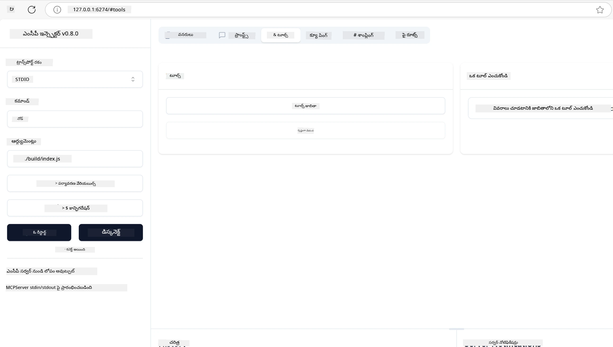
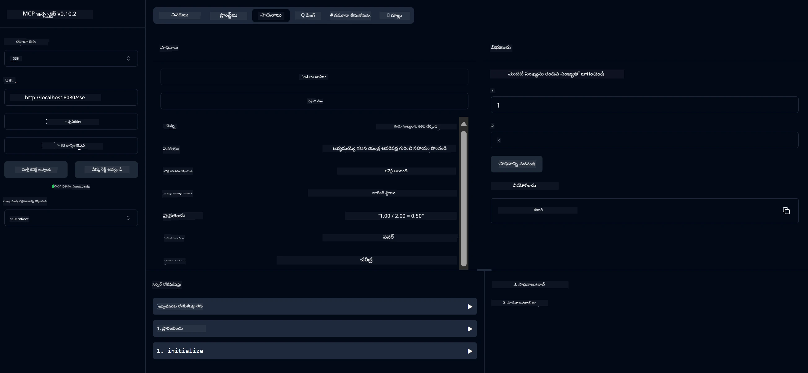
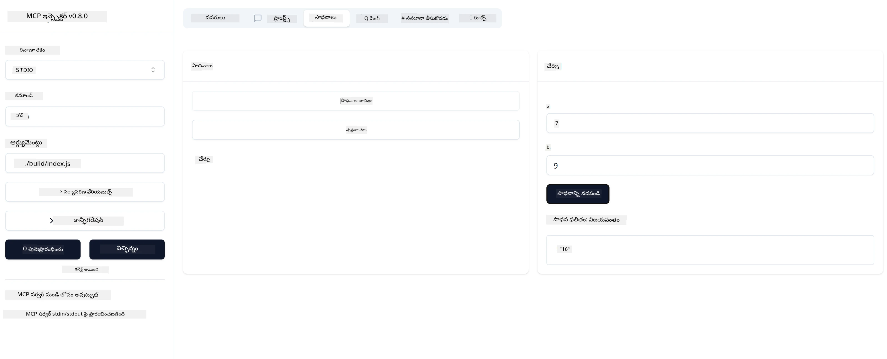

# MCP తో ప్రారంభించండి

> [!NOTE]
> ఈ పాఠంలో జావా HTTP ఉదాహరణ పూర్వ జవాబుదారమైన HTTP+SSE రవాణాను ఉపయోగిస్తూ,
> MCP కి సరిపోయే SDK `2025-11-25` ను లక్ష్యంగా ఉంచుతుంది. కొత్త రిమోట్ సర్వర్ల కోసం,
> `2026-07-28` Streamable HTTP రవాణాను ఉపయోగించండి మరియు మీ SDK లో మద్దతు ఉండడం పరీక్షించండి.

మోడల్ కాంటెక్స్ట్ ప్రోటోకాల్ (MCP) తో మీ మొదటి దశల్లోకి స్వాగతం! మీరు MCP కి కొత్తవారైనా లేదా మీ అవగాహనను లోతుగా పొందాలనుకుంటున్నా, ఈ గైడ్ మిమ్మల్ని అవసరమైన సెట్ అప్ మరియు అభివృద్ధి ప్రక్రియ ద్వారా నడిపించు. MCP ఎలా AI మోడల్స్ మరియు అనువర్తనాల మధ్య స్మూత్ ఇంటిగ్రేషన్ ను సాధ్యంగా చేస్తుందో మీరు తెలుసుకుంటారు మరియు MCP ఆధారిత పరిష్కారాలను నిర్మించడం మరియు పరీక్షించడానికి మీ వాతావరణాన్ని శీఘ్రంగా సిద్ధం చేసుకోవడాన్ని నేర్చుకుంటారు.

> సంక్షేపంగా; మీరు AI అనువర్తనాలను నిర్మిస్తే, మీరు మీ LLM (లార్జ్ లాంగ్వేజ్ మోడల్) కు టూల్స్ మరియు ఇతర వనరులు జోడించవచ్చని తెలుసు, అందువల్ల LLM మరింత జ్ఞానశీలం అవుతుంది. అయితే మీరు ఆ టూల్స్ మరియు వనరులను సర్వర్ పై ఉంచితే, ఆ అనువర్తనం మరియు సర్వర్ సామర్థ్యాలు ఏ LLM ఉన్న/లేకపోయిన క్లయింట్ ద్వారా ఉపయోగించబడవచ్చు.

## అవలోకనం

ఈ పాఠం MCP వాతావరణాలను సెట్ చేయడం మరియు మీ మొదటి MCP అనువర్తనాలను నిర్మించడం ఎలా చేయాలో ప్రాక్టికల్ మార్గదర్శకత్వాన్ని అందిస్తుంది. అవసరమైన టూల్స్ మరియు ఫ్రేమ్‌వర్క్‌లను సెటప్ చేయడం, ప్రాథమిక MCP సర్వర్లు నిర్మించడం, హోస్ట్ అనువర్తనాలు సృష్టించడం, మరియు మీ అమలులను పరీక్షించడం నేర్చుకుంటారు.

మోడల్ కాంటెక్స్ట్ ప్రోటోకాల్ (MCP) అనేది ఒక ఓపెన్ ప్రోటోకాల్, ఇది అనువర్తనాలు LLMs కు కాంటెక్స్ట్ ఇవ్వడం ఎలా ఉండాలనే ప్రమాణీకరించేది. MCP ను AI అనువర్తనాల కోసం USB-C పోర్ట్ లాగా భావించవచ్చు - ఇది AI మోడల్స్ ను విభిన్న డేటా మూలాలు మరియు టూల్స్ కు కనెక్ట్ చేసే ప్రమాణీకృత మార్గాన్ని అందిస్తుంది.

## నేర్చుకునే లక్ష్యాలు

ఈ పాఠం ముగిసినప్పుడు, మీరు చేయగలుగుతారు:

- C#, Java, Python, TypeScript, మరియు Rust లో MCP అభివృద్ధి వాతావరణాలను సెటప్ చేయడం
- కస్టమ్ ఫీచర్లతో (వనరులు, ప్రమ్ప్ట్‌లు, మరియు టూల్స్) ప్రాథమిక MCP సర్వర్లు నిర్మించడం మరియు డిప్లాయ్ చేయడం
- MCP సర్వర్లకు కనెక్ట్ అయ్యే హోస్ట్ అనువర్తనాలు సృష్టించడం
- MCP అమలులను పరీక్షించడం మరియు డిబగ్గింగ్ చేయడం

## మీ MCP వాతావరణం సెటప్ చేయడం

MCP తో పని మొదలు పెట్టేముందు, మీ అభివృద్ధి వాతావరణాన్ని సిద్ధం చేయడం మరియు ప్రాథమిక వర్క్‌ఫ్లోను అర్థం చేసుకోవటం ముఖ్యం. ఈ విభాగం మీరు MCP తో సాఫీగా మొదలుపెట్టేందుకు ప్రారంభ సెట్ అప్ దశలను సూచిస్తుంది.

### అవసరమైనవే

MCP అభివృద్ధిలో మునిగేముందు, మీరు కలిగి ఉండాలి:

- **అభివృద్ధి వాతావరణం**: మీ ఎంచుకున్న భాష (C#, Java, Python, TypeScript, లేదా Rust) కోసం
- **IDE/ఏడిటర్**: Visual Studio, Visual Studio Code, IntelliJ, Eclipse, PyCharm, లేదా ఏ ఆధునిక కోడ్ ఎడిటర్
- **ప్యాకేజీ మేనేజర్లు**: NuGet, Maven/Gradle, pip, npm/yarn, లేదా Cargo
- **API కీస్**: మీరు మీ హోస్ట్ అనువర్తనాలలో ఉపయోగించదలచిన ఏ AI సేవలకు అయినా

## ప్రాథమిక MCP సర్వర్ నిర్మాణం

ఒక MCP సర్వర్ సాధారణంగా ఉంటుంది:

- **సర్వర్ కాన్ఫిగరేషన్**: పోర్ట్, ఆథెంటికేషన్ మరియు ఇతర సెట్టింగ్లు సెట్ చేయడం
- **వనరులు**: LLMs కు అందించే డేటా మరియు కాంటెక్స్ట్
- **టూల్స్**: మోడల్స్ కాల్ చేయగల ఫంక్షనాలిటీ
- **ప్రాంప్ట్‌లు**: టెక్స్ట్ ఉత్పత్తి లేదా నిర్మాణం కోసం టెంప్లేట్లు

ఇక్కడ TypeScript లో సరళీకృత ఉదాహరణ ఉంది:

```typescript
import { McpServer, ResourceTemplate } from "@modelcontextprotocol/sdk/server/mcp.js";
import { StdioServerTransport } from "@modelcontextprotocol/sdk/server/stdio.js";
import { z } from "zod";

// ఒక MCP సర్వర్ సృష్టించండి
const server = new McpServer({
  name: "Demo",
  version: "1.0.0"
});

// ఒక అదనపు సాధనాన్ని జోడించండి
server.tool("add",
  { a: z.number(), b: z.number() },
  async ({ a, b }) => ({
    content: [{ type: "text", text: String(a + b) }]
  })
);

// ఒక డైనమిక్ గ్రీటింగ్ వనరును జోడించండి
server.resource(
  "file",
  // 'list' పరామితి వనరు అందుబాటులో ఉన్న ఫైల్స్ ను ఎలా జాబితాలో చూపించాలో నియంత్రిస్తుంది. దీన్ని undefined గా సెట్ చేయడం వలన ఈ వనరుకు జాబితా చూపించడం నిలిపివేయబడుతుంది.
  new ResourceTemplate("file://{path}", { list: undefined }),
  async (uri, { path }) => ({
    contents: [{
      uri: uri.href,
      text: `File, ${path}!`
    }]
  })
);

// ఫైల్ కంటెంట్ చదివే ఫైల్ వనరును జోడించండి
server.resource(
  "file",
  new ResourceTemplate("file://{path}", { list: undefined }),
  async (uri, { path }) => {
    let text;
    try {
      text = await fs.readFile(path, "utf8");
    } catch (err) {
      text = `Error reading file: ${err.message}`;
    }
    return {
      contents: [{
        uri: uri.href,
        text
      }]
    };
  }
);

server.prompt(
  "review-code",
  { code: z.string() },
  ({ code }) => ({
    messages: [{
      role: "user",
      content: {
        type: "text",
        text: `Please review this code:\n\n${code}`
      }
    }]
  })
);

// stdin లో సందేశాలు స్వీకరించడం మరియు stdout లో సందేశాలు పంపించడం ప్రారంభించండి
const transport = new StdioServerTransport();
await server.connect(transport);
```

మునుపటి కోడ్ లో మేము:

- MCP TypeScript SDK నుండి అవసరమైన తరగతులను దిగుమతి చేసుకున్నాం.
- కొత్త MCP సర్వర్ ఉదాహరణను సృష్టించి కాన్ఫిగర్ చేశాం.
- కస్టమ్ టూల్ (`calculator`) ను హ్యాండ్లర్ ఫంక్షన్ తో రిజిస్టర్ చేశాం.
- MCP అభ్యర్థనలకు వినిపించడానికి సర్వర్‌ను ప్రారంభించాం.

## పరీక్షించటం మరియు డిబగ్గింగ్

MCP సర్వర్ ను పరీక్షించుట మొదలుపెట్టేముందు, అందుబాటులో ఉన్న టూల్స్ మరియు డిబగ్గింగ్ కోసం ఉత్తమ పద్ధతులను అర్థం చేసుకోవడం ముఖ్యం. ఫలప్రదమైన పరీక్ష మీ సర్వర్ ఆశించినట్లు పని చేస్తున్నదని నిర్ధారిస్తుంది మరియు సమస్యలను వేగంగా గుర్తించి పరిష్కరించేందుకు సహాయపడుతుంది. క్రింది భాగం MCP అమలును ధృవీకరించుకోవడానికి సూచించిన మార్గాలను వివరించును.

MCP మీ సర్వర్లను పరీక్షించడానికి మరియు డిబగ్గ్ చేయడానికి టూల్స్ అందిస్తుంది:

- **ఇన్స్పెక్టర్ టూల్**, ఈ గ్రాఫికల్ ఇంటర్‌ఫేస్ ద్వారా మీరు మీ సర్వర్ కు కనెక్ట్ అయి మీ టూల్స్, ప్రాంప్ట్‌లు మరియు వనరులను పరీక్షించవచ్చు.
- **కర్ల్ (curl)**, మీరు సర్వర్ కు కమాండ్ లైన్ టూల్ అయిన కర్ల్ లేదా HTTP ఆదేశాలు సృష్టించగల ఇతర క్లయింట్ల ద్వారా కూడా కనెక్ట్ అవచ్చు.

### MCP ఇన్స్పెక్టర్ ఉపయోగించడం

[MCP ఇన్స్పెక్టర్](https://github.com/modelcontextprotocol/inspector) ఒక దృష్టితో పరీక్షించే టూల్, ఇది మీరు చేయగల పనులు:

1. **సర్వర్ సామర్థ్యాలను కనుగొనడం**: అందుబాటులో ఉన్న వనరులు, టూల్స్, మరియు ప్రాంప్ట్‌లను ఆటోమేటిగ్గా గుర్తించడం
2. **టూల్ నిర్వాహకాన్ని పరీక్షించడం**: వేరే వేరే పారామీటర్లను ప్రయత్నించి ప్రత్యుత్తరాలను ప్రత్యక్షంగా చూడటం
3. **సర్వర్ మెటాడేటాను వీక్షించడం**: సర్వర్ సమాచారం, స్కీమాలు, మరియు కాన్ఫిగరేషన్లను పరిశీలించడం

```bash
# ఉదాహరణ TypeScript, MCP ఇన్స్‌పెక్టర్‌ను ఇన్‌స్టాల్ చేసి నిర్వహించడం
npx @modelcontextprotocol/inspector node build/index.js
```

మీరు పై ఆదేశాలు నడపగానే, MCP ఇన్స్పెక్టర్ మీ బ్రౌజర్లో లోకల్ వెబ్ ఇంటర్‌ఫేస్ ను ప్రారంభిస్తుంది. అక్కడ మీరు మీ రిజిస్టర్ చేసిన MCP సర్వర్లను, అందుబాటులో ఉన్న టూల్స్, వనరులు మరియు ప్రాంప్ట్‌లను డాష్బోర్డ్ లో చూడగలరు. ఆ ఇంటర్‌ఫేస్ టూల్ నిర్వాహకాన్ని ప్రత్యక్షంగా పరీక్షించడానికి, సర్వర్ మెటాడేటాను పరిశీలించడానికి మరియు ప్రత్యక్ష ప్రత్యుత్తరాలను వీక్షించడానికి అనువుగా ఉంటుంది, MCP సర్వర్ అమలులను ధృవీకరించడం మరియు డిబగ్గింగ్ చేయడం కొరకు సులభతరం చేస్తుంది.

దీనికి ఇది ఒక స్క్రీన్ షాట్:



## సాధారణ సెటప్ సమస్యలు మరియు పరిష్కారాలు

| సమస్య | సాధ్య పరిష్కారం |
|-------|-------------------|
| కనెక్షన్ తిరస్కరించడం | సర్వర్ నడుస్తున్నదా మరియు పోర్ట్ సరైనదా అని తనిఖీ చేయండి |
| టూల్ నిర్వహణ లో తప్పులు | పారామీటర్ ధృవీకరణ మరియు ఎర్రర్ హ్యాండ్లింగ్ పున:సమీక్షించండి |
| ఆథెంటికేషన్ వైఫల్యం | API కీస్ మరియు అనుమతులను నిర్థారించండి |
| స్కీమా ధృవీకరణ లో తప్పులు | పారామీటర్లు నిర్వచించిన స్కీమాతో సరిపోవడం చూసుకోండి |
| సర్వర్ ప్రారంభం కావడం లేదు | పోర్ట్ సంకర్షణలు లేదా లెక్కతీసుకోని ఆధారాలపై పరీక్షించండి |
| CORS తప్పులు | క్రాస్-ఆరిజిన్ అభ్యర్థనల కోసం సరైన CORS హెడ్డర్లను సెట్ చేయండి |
| ఆథెంటికేషన్ సమస్యలు | టోకెన్ చెలామణీ మరియు అనుమతులను నిర్ధారించండి |

## లోకల్ అభివృద్ధి

లోకల్ అభివృద్ధి మరియు పరీక్ష కోసం, మీరు MCP సర్వర్లను మీ యంత్రంపై నేరుగా నడిపే అవకాశం ఉంది:

1. **సర్వర్ ప్రాసెస్ ప్రారంభించండి**: మీ MCP సర్వర్ అనువర్తనాన్ని నడపండి
2. **నెట్‌వర్కింగ్ సెటప్ చేయండి**: సర్వర్ ఆశించిన పోర్ట్ లో యాక్సెస్ అవుతుందని నిర్ధారించండి
3. **క్లయింట్లను కనెక్ట్ చేయండి**: `http://localhost:3000` వంటివి ఉపయోగించండి

```bash
# ఉదాహరణ: TypeScript MCP సర్వర్‌ను లోకల్‌గా నడపడం
npm run start
# సర్వర్ http://localhost:3000 వద్ద నడుస్తోంది
```

## మీ మొదటి MCP సర్వర్ నిర్మించడం

మేము [కోర్ కాన్సెప్ట్స్](../../01-CoreConcepts/README.md) ను మునుపటి పాఠంలో కవర్ చేశాం, ఇప్పుడు ఆ జ్ఞానాన్ని వినియోగించడానికి సమయం వచ్చింది.

### సర్వర్ ఏమి చేయగలదు

కోడ్ రాయడం మొదలుపెట్టేముందు, సర్వర్ ఏమి చేయగలదో మళ్లీ గుర్తు పెట్టుకోవాలి:

ఉదాహరణకు, ఒక MCP సర్వర్ చేయగలిగేది:

- లోకల్ ఫైళ్ల మరియు డేటాబేస్‌లను యాక్సెస్ చేయడం
- రిమోట్ APIs కి కనెక్ట్ కావడం
- లెక్కలు చేయడం
- ఇతర టూల్స్ మరియు సేవలతో ఇంటిగ్రేట్ కావడం
- ఇంటరాక్షన్ కోసం యూజర్ ఇంటర్‌ఫేస్ అందించడం

బాగుంది, ఇప్పుడు మనం ఏం చేయగలమో తెలుసుకున్నాము, కోడింగ్ మొదలుపెట్టుదాం.

## వ్యాయామం: సర్వర్ సృష్టించడం

సర్వర్ సృష్టించడానికి, ఈ దశలను అనుసరించండి:

- MCP SDKని ఇన్‌స్టాల్ చేయండి.
- ఒక ప్రాజెక్ట్ తయారు చేసి ప్రాజెక్ట్ నిర్మాణాన్ని సెటప్ చేయండి.
- సర్వర్ కోడ్ రాయండి.
- సర్వర్ ను పరీక్షించండి.

### -1- ప్రాజెక్ట్ సృష్టించండి

#### TypeScript

```sh
# ప్రాజెక్ట్ డైరెక్టరీని సృష్టించి npm ప్రాజెక్ట్ ప్రారంభించండి
mkdir calculator-server
cd calculator-server
npm init -y
```

#### Python

```sh
# ప్రాజెక్ట్ డైరెక్టరీని సృష్టించండి
mkdir calculator-server
cd calculator-server
# ఫోల్డర్‌ను Visual Studio Codeలో తెరవండి - మీరు వేరే IDE ఉపయోగిస్తే దీన్ని తప్పించండి
code .
```

#### .NET

```sh
dotnet new console -n McpCalculatorServer
cd McpCalculatorServer
```

#### Java

జావా కోసం, Spring Boot ప్రాజెక్ట్ సృష్టించండి:

```bash
curl https://start.spring.io/starter.zip \
  -d dependencies=web \
  -d javaVersion=21 \
  -d type=maven-project \
  -d groupId=com.example \
  -d artifactId=calculator-server \
  -d name=McpServer \
  -d packageName=com.microsoft.mcp.sample.server \
  -o calculator-server.zip
```

జిప్ ఫైల్ ని ఎక్స్‌ట్రాక్ట్ చేయండి:

```bash
unzip calculator-server.zip -d calculator-server
cd calculator-server
# ఆప్షనల్ ఉపయోగించని టెస్ట్ అవసరంలేదు అంటే తొలగించండి
rm -rf src/test/java
```

మీ *pom.xml* ఫైలుకు క్రింది పూర్తి కాన్ఫిగరేషన్ జత చేయండి:

```xml
<?xml version="1.0" encoding="UTF-8"?>
<project xmlns="http://maven.apache.org/POM/4.0.0"
    xmlns:xsi="http://www.w3.org/2001/XMLSchema-instance"
    xsi:schemaLocation="http://maven.apache.org/POM/4.0.0 http://maven.apache.org/xsd/maven-4.0.0.xsd">
    <modelVersion>4.0.0</modelVersion>
    
    <!-- Spring Boot parent for dependency management -->
    <parent>
        <groupId>org.springframework.boot</groupId>
        <artifactId>spring-boot-starter-parent</artifactId>
        <version>3.5.0</version>
        <relativePath />
    </parent>

    <!-- Project coordinates -->
    <groupId>com.example</groupId>
    <artifactId>calculator-server</artifactId>
    <version>0.0.1-SNAPSHOT</version>
    <name>Calculator Server</name>
    <description>Basic calculator MCP service for beginners</description>

    <!-- Properties -->
    <properties>
        <java.version>21</java.version>
        <maven.compiler.source>21</maven.compiler.source>
        <maven.compiler.target>21</maven.compiler.target>
    </properties>

    <!-- Spring AI BOM for version management -->
    <dependencyManagement>
        <dependencies>
            <dependency>
                <groupId>org.springframework.ai</groupId>
                <artifactId>spring-ai-bom</artifactId>
                <version>1.0.0-SNAPSHOT</version>
                <type>pom</type>
                <scope>import</scope>
            </dependency>
        </dependencies>
    </dependencyManagement>

    <!-- Dependencies -->
    <dependencies>
        <dependency>
            <groupId>org.springframework.ai</groupId>
            <artifactId>spring-ai-starter-mcp-server-webflux</artifactId>
        </dependency>
        <dependency>
            <groupId>org.springframework.boot</groupId>
            <artifactId>spring-boot-starter-actuator</artifactId>
        </dependency>
        <dependency>
         <groupId>org.springframework.boot</groupId>
         <artifactId>spring-boot-starter-test</artifactId>
         <scope>test</scope>
      </dependency>
    </dependencies>

    <!-- Build configuration -->
    <build>
        <plugins>
            <plugin>
                <groupId>org.springframework.boot</groupId>
                <artifactId>spring-boot-maven-plugin</artifactId>
            </plugin>
            <plugin>
                <groupId>org.apache.maven.plugins</groupId>
                <artifactId>maven-compiler-plugin</artifactId>
                <configuration>
                    <release>21</release>
                </configuration>
            </plugin>
        </plugins>
    </build>

    <!-- Repositories for Spring AI snapshots -->
    <repositories>
        <repository>
            <id>spring-milestones</id>
            <name>Spring Milestones</name>
            <url>https://repo.spring.io/milestone</url>
            <snapshots>
                <enabled>false</enabled>
            </snapshots>
        </repository>
        <repository>
            <id>spring-snapshots</id>
            <name>Spring Snapshots</name>
            <url>https://repo.spring.io/snapshot</url>
            <releases>
                <enabled>false</enabled>
            </releases>
        </repository>
    </repositories>
</project>
```

#### Rust

```sh
mkdir calculator-server
cd calculator-server
cargo init
```

### -2- ఆధారాలు జత చేయండి

ఇప్పుడు మీ ప్రాజెక్ట్ సృష్టించబడింది, తదుపరి ఆధారాలను జత చేద్దాం:

#### TypeScript

```sh
# ఇప్పటికీ ఇన్‌స్టాల్ చేయబడలేదంటే, TypeScript ను గ్లోబలీ ఇన్‌స్టాల్ చేయండి
npm install typescript -g

# MCP SDK మరియు స్కీమా సరైనందాన్ని కోసం Zod ను ఇన్‌స్టాల్ చేయండి
npm install @modelcontextprotocol/sdk zod
npm install -D @types/node typescript
```

#### Python

```sh
# ఒక వర్చువల్ ఎన్వ్ సృష్టించి డిపెండెన్సీలు ఇన్స్టాల్ చేయండి
python -m venv venv
venv\Scripts\activate
pip install "mcp[cli]"
```

#### Java

```bash
cd calculator-server
./mvnw clean install -DskipTests
```

#### Rust

```sh
cargo add rmcp --features server,transport-io
cargo add serde
cargo add tokio --features rt-multi-thread
```

### -3- ప్రాజెక్ట్ ఫైళ్లను సృష్టించండి

#### TypeScript

*package.json* ఫైల్ తెరవండి మరియు క్రింది విషయం తో మార్చండి, సర్వర్ నిర్మాణం మరియు నడిపేందుకు నిర్ధారించండి:

```json
{
  "name": "calculator-server",
  "version": "1.0.0",
  "main": "index.js",
  "type": "module",
  "scripts": {
    "build": "tsc",
    "start": "npm run build && node ./build/index.js",
  },
  "keywords": [],
  "author": "",
  "license": "ISC",
  "description": "A simple calculator server using Model Context Protocol",
  "dependencies": {
    "@modelcontextprotocol/sdk": "^1.16.0",
    "zod": "^3.25.76"
  },
  "devDependencies": {
    "@types/node": "^24.0.14",
    "typescript": "^5.8.3"
  }
}
```

క్రింది విషయం తో *tsconfig.json* సృష్టించండి:

```json
{
  "compilerOptions": {
    "target": "ES2022",
    "module": "Node16",
    "moduleResolution": "Node16",
    "outDir": "./build",
    "rootDir": "./src",
    "strict": true,
    "esModuleInterop": true,
    "skipLibCheck": true,
    "forceConsistentCasingInFileNames": true
  },
  "include": ["src/**/*"],
  "exclude": ["node_modules"]
}
```

మీ మూల కోడ్ కొరకు డైరెక్టరీ సృష్టించండి:

```sh
mkdir src
touch src/index.ts
```

#### Python

*server.py* ఫైల్ సృష్టించండి

```sh
touch server.py
```

#### .NET

అవసరమైన NuGet ప్యాకేజీలను ఇన్స్టాల్ చేయండి:

```sh
dotnet add package ModelContextProtocol --prerelease
dotnet add package Microsoft.Extensions.Hosting
```

#### Java

Java Spring Boot ప్రాజెక్టులలో ప్రాజెక్ట్ నిర్మాణం ఆటోమేటిగ్గా సృష్టించబడుతుంది.

#### Rust

Rust లో, `cargo init` నడిపించినప్పుడు *src/main.rs* ఫైల్ డిఫాల్ట్ గా సృష్టించబడుతుంది. ఆ ఫైల్ తెరిచి డిఫాల్ట్ కోడ్ ని తొలగించండి.

### -4- సర్వర్ కోడ్ సృష్టించండి

#### TypeScript

*index.ts* ఫైల్ సృష్టించి క్రింది కోడ్ జత చేయండి:

```typescript
import { McpServer, ResourceTemplate } from "@modelcontextprotocol/sdk/server/mcp.js";
import { StdioServerTransport } from "@modelcontextprotocol/sdk/server/stdio.js";
import { z } from "zod";
 
// ఒక MCP సర్వర్ సృష్టించండి
const server = new McpServer({
  name: "Calculator MCP Server",
  version: "1.0.0"
});
```

ఇప్పుడు మీరు సర్వర్ కలిగి ఉన్నారు, కానీ అది ఎక్కువగా చేయదు, దాన్ని సరిచేద్దాం.

#### Python

```python
# server.py
from mcp.server.fastmcp import FastMCP

# ఒక MCP సర్వర్‌ను సృష్టించండి
mcp = FastMCP("Demo")
```

#### .NET

```csharp
using Microsoft.Extensions.DependencyInjection;
using Microsoft.Extensions.Hosting;
using Microsoft.Extensions.Logging;
using ModelContextProtocol.Server;
using System.ComponentModel;

var builder = Host.CreateApplicationBuilder(args);
builder.Logging.AddConsole(consoleLogOptions =>
{
    // Configure all logs to go to stderr
    consoleLogOptions.LogToStandardErrorThreshold = LogLevel.Trace;
});

builder.Services
    .AddMcpServer()
    .WithStdioServerTransport()
    .WithToolsFromAssembly();
await builder.Build().RunAsync();

// add features
```

#### Java

జావా కోసం, కోర్ సర్వర్ కంపోనెంట్లను సృష్టించండి. మొదట ప్రధాన అనువర్తన తరగతిని మార్చండి:

*src/main/java/com/microsoft/mcp/sample/server/McpServerApplication.java*:

```java
package com.microsoft.mcp.sample.server;

import org.springframework.ai.tool.ToolCallbackProvider;
import org.springframework.ai.tool.method.MethodToolCallbackProvider;
import org.springframework.boot.SpringApplication;
import org.springframework.boot.autoconfigure.SpringBootApplication;
import org.springframework.context.annotation.Bean;
import com.microsoft.mcp.sample.server.service.CalculatorService;

@SpringBootApplication
public class McpServerApplication {

    public static void main(String[] args) {
        SpringApplication.run(McpServerApplication.class, args);
    }
    
    @Bean
    public ToolCallbackProvider calculatorTools(CalculatorService calculator) {
        return MethodToolCallbackProvider.builder().toolObjects(calculator).build();
    }
}
```

క్యాల్క్యులేటర్ సేవను సృష్టించండి *src/main/java/com/microsoft/mcp/sample/server/service/CalculatorService.java*:

```java
package com.microsoft.mcp.sample.server.service;

import org.springframework.ai.tool.annotation.Tool;
import org.springframework.stereotype.Service;

/**
 * Service for basic calculator operations.
 * This service provides simple calculator functionality through MCP.
 */
@Service
public class CalculatorService {

    /**
     * Add two numbers
     * @param a The first number
     * @param b The second number
     * @return The sum of the two numbers
     */
    @Tool(description = "Add two numbers together")
    public String add(double a, double b) {
        double result = a + b;
        return formatResult(a, "+", b, result);
    }

    /**
     * Subtract one number from another
     * @param a The number to subtract from
     * @param b The number to subtract
     * @return The result of the subtraction
     */
    @Tool(description = "Subtract the second number from the first number")
    public String subtract(double a, double b) {
        double result = a - b;
        return formatResult(a, "-", b, result);
    }

    /**
     * Multiply two numbers
     * @param a The first number
     * @param b The second number
     * @return The product of the two numbers
     */
    @Tool(description = "Multiply two numbers together")
    public String multiply(double a, double b) {
        double result = a * b;
        return formatResult(a, "*", b, result);
    }

    /**
     * Divide one number by another
     * @param a The numerator
     * @param b The denominator
     * @return The result of the division
     */
    @Tool(description = "Divide the first number by the second number")
    public String divide(double a, double b) {
        if (b == 0) {
            return "Error: Cannot divide by zero";
        }
        double result = a / b;
        return formatResult(a, "/", b, result);
    }

    /**
     * Calculate the power of a number
     * @param base The base number
     * @param exponent The exponent
     * @return The result of raising the base to the exponent
     */
    @Tool(description = "Calculate the power of a number (base raised to an exponent)")
    public String power(double base, double exponent) {
        double result = Math.pow(base, exponent);
        return formatResult(base, "^", exponent, result);
    }

    /**
     * Calculate the square root of a number
     * @param number The number to find the square root of
     * @return The square root of the number
     */
    @Tool(description = "Calculate the square root of a number")
    public String squareRoot(double number) {
        if (number < 0) {
            return "Error: Cannot calculate square root of a negative number";
        }
        double result = Math.sqrt(number);
        return String.format("√%.2f = %.2f", number, result);
    }

    /**
     * Calculate the modulus (remainder) of division
     * @param a The dividend
     * @param b The divisor
     * @return The remainder of the division
     */
    @Tool(description = "Calculate the remainder when one number is divided by another")
    public String modulus(double a, double b) {
        if (b == 0) {
            return "Error: Cannot divide by zero";
        }
        double result = a % b;
        return formatResult(a, "%", b, result);
    }

    /**
     * Calculate the absolute value of a number
     * @param number The number to find the absolute value of
     * @return The absolute value of the number
     */
    @Tool(description = "Calculate the absolute value of a number")
    public String absolute(double number) {
        double result = Math.abs(number);
        return String.format("|%.2f| = %.2f", number, result);
    }

    /**
     * Get help about available calculator operations
     * @return Information about available operations
     */
    @Tool(description = "Get help about available calculator operations")
    public String help() {
        return "Basic Calculator MCP Service\n\n" +
               "Available operations:\n" +
               "1. add(a, b) - Adds two numbers\n" +
               "2. subtract(a, b) - Subtracts the second number from the first\n" +
               "3. multiply(a, b) - Multiplies two numbers\n" +
               "4. divide(a, b) - Divides the first number by the second\n" +
               "5. power(base, exponent) - Raises a number to a power\n" +
               "6. squareRoot(number) - Calculates the square root\n" + 
               "7. modulus(a, b) - Calculates the remainder of division\n" +
               "8. absolute(number) - Calculates the absolute value\n\n" +
               "Example usage: add(5, 3) will return 5 + 3 = 8";
    }

    /**
     * Format the result of a calculation
     */
    private String formatResult(double a, String operator, double b, double result) {
        return String.format("%.2f %s %.2f = %.2f", a, operator, b, result);
    }
}
```

**ఉత్పత్తి-సిద్ధ సేవ కోసం ఐచ్ఛిక భాగాలు:**

స్టార్ట్ అప్ కాన్ఫిగరేషన్ సృష్టించండి *src/main/java/com/microsoft/mcp/sample/server/config/StartupConfig.java*:

```java
package com.microsoft.mcp.sample.server.config;

import org.springframework.boot.CommandLineRunner;
import org.springframework.context.annotation.Bean;
import org.springframework.context.annotation.Configuration;

@Configuration
public class StartupConfig {
    
    @Bean
    public CommandLineRunner startupInfo() {
        return args -> {
            System.out.println("\n" + "=".repeat(60));
            System.out.println("Calculator MCP Server is starting...");
            System.out.println("SSE endpoint: http://localhost:8080/sse");
            System.out.println("Health check: http://localhost:8080/actuator/health");
            System.out.println("=".repeat(60) + "\n");
        };
    }
}
```

ఆరోగ్య కంట్రోలర్ సృష్టించండి *src/main/java/com/microsoft/mcp/sample/server/controller/HealthController.java*:

```java
package com.microsoft.mcp.sample.server.controller;

import org.springframework.http.ResponseEntity;
import org.springframework.web.bind.annotation.GetMapping;
import org.springframework.web.bind.annotation.RestController;
import java.time.LocalDateTime;
import java.util.HashMap;
import java.util.Map;

@RestController
public class HealthController {
    
    @GetMapping("/health")
    public ResponseEntity<Map<String, Object>> healthCheck() {
        Map<String, Object> response = new HashMap<>();
        response.put("status", "UP");
        response.put("timestamp", LocalDateTime.now().toString());
        response.put("service", "Calculator MCP Server");
        return ResponseEntity.ok(response);
    }
}
```

ఎక్సెప్షన్ హ్యాండ్లర్ సృష్టించండి *src/main/java/com/microsoft/mcp/sample/server/exception/GlobalExceptionHandler.java*:

```java
package com.microsoft.mcp.sample.server.exception;

import org.springframework.http.HttpStatus;
import org.springframework.http.ResponseEntity;
import org.springframework.web.bind.annotation.ExceptionHandler;
import org.springframework.web.bind.annotation.RestControllerAdvice;

@RestControllerAdvice
public class GlobalExceptionHandler {

    @ExceptionHandler(IllegalArgumentException.class)
    public ResponseEntity<ErrorResponse> handleIllegalArgumentException(IllegalArgumentException ex) {
        ErrorResponse error = new ErrorResponse(
            "Invalid_Input", 
            "Invalid input parameter: " + ex.getMessage());
        return new ResponseEntity<>(error, HttpStatus.BAD_REQUEST);
    }

    public static class ErrorResponse {
        private String code;
        private String message;

        public ErrorResponse(String code, String message) {
            this.code = code;
            this.message = message;
        }

        // గెటర్స్
        public String getCode() { return code; }
        public String getMessage() { return message; }
    }
}
```

కస్టమ్ బ్యానర్ సృష్టించండి *src/main/resources/banner.txt*:

```text
_____      _            _       _             
 / ____|    | |          | |     | |            
| |     __ _| | ___ _   _| | __ _| |_ ___  _ __ 
| |    / _` | |/ __| | | | |/ _` | __/ _ \| '__|
| |___| (_| | | (__| |_| | | (_| | || (_) | |   
 \_____\__,_|_|\___|\__,_|_|\__,_|\__\___/|_|   
                                                
Calculator MCP Server v1.0
Spring Boot MCP Application
```

</details>

#### Rust

*src/main.rs* ఫైల్ టాప్ కు క్రింది కోడ్ జత చేయండి. ఇది మీ MCP సర్వర్ కొరకు అవసరమైన లైబ్రరీలు మరియు మాడ్యూల్‌లను దిగుమతి చేస్తుంది.

```rust
use rmcp::{
    handler::server::{router::tool::ToolRouter, tool::Parameters},
    model::{ServerCapabilities, ServerInfo},
    schemars, tool, tool_handler, tool_router,
    transport::stdio,
    ServerHandler, ServiceExt,
};
use std::error::Error;
```

క్యాల్క్యులేటర్ సర్వర్ ఒక సరళమైనది, ఇది రెండు నంబర్లను జత చేస్తుంది. క్యాల్క్యులేటర్ అభ్యర్థనను ప్రాతినిధ్యం సాధించడానికి ఒక struct సృష్టిద్దాం.

```rust
#[derive(Debug, serde::Deserialize, schemars::JsonSchema)]
pub struct CalculatorRequest {
    pub a: f64,
    pub b: f64,
}
```

తర్వాత, క్యాల్క్యులేటర్ సర్వర్ ని ప్రాతినిధ్యం చేసే struct సృష్టించండి. ఈ struct టూల్ రౌటర్ ను కలిగి ఉంటుంది, ఇది టూల్స్ రిజిస్టర్ చేయడానికి ఉపయోగపడుతుంది.

```rust
#[derive(Debug, Clone)]
pub struct Calculator {
    tool_router: ToolRouter<Self>,
}
```

ఇప్పుడు, `Calculator` struct ను అమలు చేయవచ్చు సర్వర్ కొత్త ఉదాహరణ సృష్టించడానికి మరియు సర్వర్ సమాచారాన్ని అందించే సర్వర్ హ్యాండ్లర్ ను అమలు చేయడానికి.

```rust
#[tool_router]
impl Calculator {
    pub fn new() -> Self {
        Self {
            tool_router: Self::tool_router(),
        }
    }
}

#[tool_handler]
impl ServerHandler for Calculator {
    fn get_info(&self) -> ServerInfo {
        ServerInfo {
            instructions: Some("A simple calculator tool".into()),
            capabilities: ServerCapabilities::builder().enable_tools().build(),
            ..Default::default()
        }
    }
}
```

చివరగా, సర్వర్ ను ప్రారంభించే ప్రధాన ఫంక్షన్ ను అమలు చేయాలి. ఈ ఫంక్షన్ `Calculator` struct యొక్క ఉదాహరణ సృష్టించి దానిని స్టాండర్డ్ ఇన్పుట్/ఔట్పుట్ పై సేవ్ చేస్తుంది.

```rust
#[tokio::main]
async fn main() -> Result<(), Box<dyn Error>> {
    let service = Calculator::new().serve(stdio()).await?;
    service.waiting().await?;
    Ok(())
}
```

సర్వర్ ఇప్పుడు తన గురించి ప్రాథమిక సమాచారాన్ని అందించేందుకు సిద్ధంగా ఉంది. తరువాత, జోడింపు చేయడానికి టూల్‌ను ఆడించుకుందాం.

### -5- టూల్ మరియు వనరు జోడించడం

క్రింది కోడ్ జత చేయడం ద్వారా టూల్ మరియు వనరు జోడించండి:

#### TypeScript

```typescript
server.tool(
  "add",
  { a: z.number(), b: z.number() },
  async ({ a, b }) => ({
    content: [{ type: "text", text: String(a + b) }]
  })
);

server.resource(
  "greeting",
  new ResourceTemplate("greeting://{name}", { list: undefined }),
  async (uri, { name }) => ({
    contents: [{
      uri: uri.href,
      text: `Hello, ${name}!`
    }]
  })
);
```

మీ టూల్ `a` మరియు `b` అనే పారామీటర్లను తీసుకుని, క్రింది రూపంలో స్పందనను ఉత్పత్తి చేసే ఫంక్షన్ నడుపుతుంది:

```typescript
{
  contents: [{
    type: "text", content: "some content"
  }]
}
```

మీ వనరు "greeting" అనే స్ట్రింగ్ ద్వారా యాక్సెస్ చేయబడుతుంది మరియు `name` అనే పారామీటర్ తీసుకుని టూల్ దానిలా సమ్మతించిన స్పందనను ఉత్పత్తి చేస్తుంది:

```typescript
{
  uri: "<href>",
  text: "a text"
}
```

#### Python

```python
# ఒక జోడింపు సాధనాన్ని జోడించండి
@mcp.tool()
def add(a: int, b: int) -> int:
    """Add two numbers"""
    return a + b


# ఒక గతి శీల స్వాగత వనరును జోడించండి
@mcp.resource("greeting://{name}")
def get_greeting(name: str) -> str:
    """Get a personalized greeting"""
    return f"Hello, {name}!"
```

క్రింద కోడ్ లో మేము:

- `add` అనే టూల్ నిర్వచించాము, ఇది `a` మరియు `b` అనే రెండు పూర్తిసंख్యాల పారామీటర్లను తీసుకుంటుంది.
- `greeting` అనే వనరును సృష్టించాము, ఇది `name` అనే పారామీటర్ తీసుకుంటుంది.

#### .NET

దీన్ని మీ Program.cs ఫైలులో జత చేయండి:

```csharp
[McpServerToolType]
public static class CalculatorTool
{
    [McpServerTool, Description("Adds two numbers")]
    public static string Add(int a, int b) => $"Sum {a + b}";
}
```

#### Java

టూల్స్ ఇప్పటికే మునుపటి దశలో సృష్టించబడ్డాయి.

#### Rust

`impl Calculator` బ్లాక్ లో కొత్త టూల్ ని జోడించండి:

```rust
#[tool(description = "Adds a and b")]
async fn add(
    &self,
    Parameters(CalculatorRequest { a, b }): Parameters<CalculatorRequest>,
) -> String {
    (a + b).to_string()
}
```

### -6- తుది కోడ్

సర్వర్ ప్రారంభానికి అవసరమైన చివరి కోడ్ జోడిద్దాం:

#### TypeScript

```typescript
// stdin పై మెసేజులు అందుకోవడం ప్రారంభించి stdout పై మెసేజులు పంపడం ప్రారంభించండి
const transport = new StdioServerTransport();
await server.connect(transport);
```

పూర్తి కోడ్ ఇట్లు ఉంటుంది:

```typescript
// index.ts
import { McpServer, ResourceTemplate } from "@modelcontextprotocol/sdk/server/mcp.js";
import { StdioServerTransport } from "@modelcontextprotocol/sdk/server/stdio.js";
import { z } from "zod";

// ఒక MCP సర్వర్‌ని సృష్టించండి
const server = new McpServer({
  name: "Calculator MCP Server",
  version: "1.0.0"
});

// ఒక యాడిషన్ టూల్‌ని జోడించండి
server.tool(
  "add",
  { a: z.number(), b: z.number() },
  async ({ a, b }) => ({
    content: [{ type: "text", text: String(a + b) }]
  })
);

// ఒక డైనమిక్ గ్రీటింగ్ వనరును జోడించండి
server.resource(
  "greeting",
  new ResourceTemplate("greeting://{name}", { list: undefined }),
  async (uri, { name }) => ({
    contents: [{
      uri: uri.href,
      text: `Hello, ${name}!`
    }]
  })
);

// stdin పై సందేశాలు స్వీకరించటం మరియు stdout పై సందేశాలు పంపటం ప్రారంభించండి
const transport = new StdioServerTransport();
server.connect(transport);
```

#### Python

```python
# server.py
from mcp.server.fastmcp import FastMCP

# ఒక MCP సర్వర్ సృష్టించండి
mcp = FastMCP("Demo")


# ஒரு చేర్పు సాధనాన్ని జోడించండి
@mcp.tool()
def add(a: int, b: int) -> int:
    """Add two numbers"""
    return a + b


# ఒక డైనమిక్ గ్రీటింగ్ వనరును జోడించండి
@mcp.resource("greeting://{name}")
def get_greeting(name: str) -> str:
    """Get a personalized greeting"""
    return f"Hello, {name}!"

# ప్రధాన అమలు బ్లాక్ - సర్వర్ నడపడానికి ఇది అవసరం
if __name__ == "__main__":
    mcp.run()
```

#### .NET

క్రింది విషయం తో Program.cs ఫైల్ సృష్టించండి:

```csharp
using Microsoft.Extensions.DependencyInjection;
using Microsoft.Extensions.Hosting;
using Microsoft.Extensions.Logging;
using ModelContextProtocol.Server;
using System.ComponentModel;

var builder = Host.CreateApplicationBuilder(args);
builder.Logging.AddConsole(consoleLogOptions =>
{
    // Configure all logs to go to stderr
    consoleLogOptions.LogToStandardErrorThreshold = LogLevel.Trace;
});

builder.Services
    .AddMcpServer()
    .WithStdioServerTransport()
    .WithToolsFromAssembly();
await builder.Build().RunAsync();

[McpServerToolType]
public static class CalculatorTool
{
    [McpServerTool, Description("Adds two numbers")]
    public static string Add(int a, int b) => $"Sum {a + b}";
}
```

#### Java

మీ పూర్తి మెయిన్ అనువర్తన తరగతి ఇలా ఉండాలి:

```java
// McpServerApplication.java
package com.microsoft.mcp.sample.server;

import org.springframework.ai.tool.ToolCallbackProvider;
import org.springframework.ai.tool.method.MethodToolCallbackProvider;
import org.springframework.boot.SpringApplication;
import org.springframework.boot.autoconfigure.SpringBootApplication;
import org.springframework.context.annotation.Bean;
import com.microsoft.mcp.sample.server.service.CalculatorService;

@SpringBootApplication
public class McpServerApplication {

    public static void main(String[] args) {
        SpringApplication.run(McpServerApplication.class, args);
    }
    
    @Bean
    public ToolCallbackProvider calculatorTools(CalculatorService calculator) {
        return MethodToolCallbackProvider.builder().toolObjects(calculator).build();
    }
}
```

#### Rust

Rust సర్వర్ యొక్క తుది కోడ్ ఇట్లు ఉంటుంది:

```rust
use rmcp::{
    ServerHandler, ServiceExt,
    handler::server::{router::tool::ToolRouter, tool::Parameters},
    model::{ServerCapabilities, ServerInfo},
    schemars, tool, tool_handler, tool_router,
    transport::stdio,
};
use std::error::Error;

#[derive(Debug, serde::Deserialize, schemars::JsonSchema)]
pub struct CalculatorRequest {
    pub a: f64,
    pub b: f64,
}

#[derive(Debug, Clone)]
pub struct Calculator {
    tool_router: ToolRouter<Self>,
}

#[tool_router]
impl Calculator {
    pub fn new() -> Self {
        Self {
            tool_router: Self::tool_router(),
        }
    }
    
    #[tool(description = "Adds a and b")]
    async fn add(
        &self,
        Parameters(CalculatorRequest { a, b }): Parameters<CalculatorRequest>,
    ) -> String {
        (a + b).to_string()
    }
}

#[tool_handler]
impl ServerHandler for Calculator {
    fn get_info(&self) -> ServerInfo {
        ServerInfo {
            instructions: Some("A simple calculator tool".into()),
            capabilities: ServerCapabilities::builder().enable_tools().build(),
            ..Default::default()
        }
    }
}

#[tokio::main]
async fn main() -> Result<(), Box<dyn Error>> {
    let service = Calculator::new().serve(stdio()).await?;
    service.waiting().await?;
    Ok(())
}
```

### -7- సర్వర్ ను పరీక్షించండి

క్రింది ఆదేశంతో సర్వర్ ను ప్రారంభించండి:

#### TypeScript

```sh
npm run build
```

#### Python

```sh
mcp run server.py
```

> MCP ఇన్స్పెక్టర్ ఉపయోగించడానికి, `mcp dev server.py` ను ఉపయోగించండి, ఇది ఆటోమేటిగ్గా ఇన్స్పెక్టర్ ను ప్రారంభించి అవసరమైన ప్రోక్సీ సెషన్ టోకెన్ అందిస్తుంది. `mcp run server.py` ఉపయోగిస్తే, మీరు دستیగా ఇన్స్పెక్టర్ ను ప్రారంభించి కనెక్షన్ ను కాన్ఫిగర్ చేసుకోవాలి.

#### .NET

మీరు మీ ప్రాజెక్ట్ డైరెక్టరీలో ఉన్నారని నిర్ధారించుకోండి:

```sh
cd McpCalculatorServer
dotnet run
```

#### Java

```bash
./mvnw clean install -DskipTests
java -jar target/calculator-server-0.0.1-SNAPSHOT.jar
```

#### Rust

సర్వర్ ని ఫార్మాట్ చేసి నడపడానికి క్రింది ఆదేశాలు నడపండి:

```sh
cargo fmt
cargo run
```

### -8- ఇన్స్పెక్టర్ ఉపయోగించి నడపండి

ఇన్స్పెక్టర్ ఒక గొప్ప టూల్, ఇది మీ సర్వర్ నడిపించి మీరు దానితో ఇంటరాక్ట్ అయ్యి అది పనిచేస్తుందో లేదో పరీక్షించగలుగుతున్నారు. దీన్ని ప్రారంభిద్దాం:

> [!NOTE]
> "కమాండ్" ఫీల్డ్ లో ఇది వేరుగా కనిపించవచ్చు ఎందుకంటే అది మీ స్పెసిఫిక్ రన్‌టైమ్తో సర్వర్ నడపడానికి కమాండ్ ను కలిగి ఉంటుంది.

#### TypeScript

```sh
npx @modelcontextprotocol/inspector node build/index.js
```

లేదా దీన్ని మీ *package.json* లో ఈ విధంగా జత చేయండి: `"inspector": "npx @modelcontextprotocol/inspector node build/index.js"` మరియు తర్వాత `npm run inspector` నడపండి

#### Python

Python లో Node.js టూల్ ఇన్స్పెక్టర్ మگار ఉంటుంది. దాన్ని ఇలా పిలవవచ్చు:

```sh
mcp dev server.py
```


అయితే, ఇది టూల్‌పై అందుబాటులో ఉన్న అన్ని విధానాలను అమలు చేయదు కాబట్టి మీరు క్రింది విధంగా నేరుగా Node.js టూల్‌ను నడపడం సిఫార్సు చేయబడింది:

```sh
npx @modelcontextprotocol/inspector mcp run server.py
```

మీరు స్క్రిప్టులు నడపడానికి కమాండ్లు మరియు ఆర్గ్యూమెంట్లను కాన్ఫిగర్ చేయడానికి అనుమతించే టూల్ లేదా ఐడీఈ ఉపయోగిస్తుంటే, 
`Command` ఫీల్డ్‌లో `python` ను మరియు `Arguments` గా `server.py` ను ఖచ్చితంగా సెట్ చేయండి. ఇది స్క్రిప్ట్ సరైన విధంగా నడిచేందుకు నిర్ధారిస్తుంది.

#### .NET

మీరు మీ ప్రాజెక్ట్ డైరెక్టరీలో ఉన్నారని నిర్ధారించుకోండి:

```sh
cd McpCalculatorServer
npx @modelcontextprotocol/inspector dotnet run
```

#### Java

మీ కలిక్యులేటర్ సర్వర్ నడుస్తున్నదని నిర్ధారించుకోండి
ఆపై ఇన్స్పెక్టర్‌ను నడపండి:

```cmd
npx @modelcontextprotocol/inspector
```

ఇన్స్పెక్టర్ వెబ్ ఇంటర్ఫేస్ లో:

1. ట్రాన్స్‌పోర్ట్ రకంగా "SSE" ను ఎంచుకోండి
2. URL ను ఇలా సెట్ చేయండి: `http://localhost:8080/sse`
3. "Connect" పై క్లిక్ చేయండి



**మీరు ఇప్పుడు సర్వర్‌కి కనెక్ట్ అయ్యారు**
**ఇప్పుడు Java సర్వర్ టెస్టింగ్ విభాగం పూర్తి అయింది**

తదుపరి విభాగం సర్వర్‌తో ఇంటరాక్ట్ చేయడం గురించి.

మీరు క్రింది యూజర్ ఇంటర్ఫేస్‌ను చూడవచ్చు:


1. కనెక్ట్ బటన్ ఎంచుకొని సర్వర్‌కు కనెక్ట్ అవ్వండి
  సర్వర్‌కు కనెక్ట్ అయిన తర్వాత, మీరు ఇప్పుడు క్రింది దాన్ని చూడవచ్చు:

  

1. "Tools" మరియు "listTools" ను ఎంచుకోండి, "Add" కనిపించాలి, "Add" ను ఎంచుకుని పారామితి విలువలను పూరించండి.

  మీరు క్రింది ప్రతిస్పందనను చూడాలి, అంటే "add" టూల్ నుండి ఫలితం:

  

అభినందనలు, మీరు మీ మొదటి సర్వర్‌ను సృష్టించి నడిపించారు!

#### Rust

MCP ఇన్స్పెక్టర్ CLI తో Rust సర్వర్‌ను నడపడానికి, క్రింది కమాండ్‌ను ఉపయోగించండి:

```sh
npx @modelcontextprotocol/inspector cargo run --cli --method tools/call --tool-name add --tool-arg a=1 b=2
```

### అధికారిక SDKలు

MCP అనేక భాషల కోసం అధికారిక SDKలను అందిస్తుంది:

- [C# SDK](https://github.com/modelcontextprotocol/csharp-sdk) - మైక్రోసాఫ్ట్‌తో కలిసి నిర్వహించబడుతుంది
- [Java SDK](https://github.com/modelcontextprotocol/java-sdk) - Spring AIతో కలిసి నిర్వహించబడుతుంది
- [TypeScript SDK](https://github.com/modelcontextprotocol/typescript-sdk) - అధికారిక TypeScript అమలు
- [Python SDK](https://github.com/modelcontextprotocol/python-sdk) - అధికారిక Python అమలు
- [Kotlin SDK](https://github.com/modelcontextprotocol/kotlin-sdk) - అధికారిక Kotlin అమలు
- [Swift SDK](https://github.com/modelcontextprotocol/swift-sdk) - Loopwork AIతో కలిసి నిర్వహించబడుతుంది
- [Rust SDK](https://github.com/modelcontextprotocol/rust-sdk) - అధికారిక Rust అమలు

## ముఖ్యమైన అంశాలు

- MCP అభివృద్ధి వాతావరణాన్ని భాషా-ప్రత్యేక SDKలతో సులభంగా కన్‌ఫిగర్ చేసుకోవచ్చు
- MCP సర్వర్‌ల నిర్మాణం స్పష్టమైన స్కీమాలతో టూల్‌లను సృష్టించి నమోదు చేయడాన్ని కలిగి ఉంటుంది
- విశ్వసనీయ MCP అమలుకు పరీక్షించడం మరియు డీబగ్గింగ్ అవసరం

## నమూనాలు

- [Java Calculator](../samples/java/calculator/README.md)
- [.NET Calculator](../../../../03-GettingStarted/samples/csharp)
- [JavaScript Calculator](../samples/javascript/README.md)
- [TypeScript Calculator](../samples/typescript/README.md)
- [Python Calculator](../../../../03-GettingStarted/samples/python)
- [Rust Calculator](../../../../03-GettingStarted/samples/rust)

## అసైన్‌మెంట్

మీరే ఎంచుకున్న ఒక టూల్తో ఒక సాదా MCP సర్వర్‌ను సృష్టించండి:

1. మీ ఇష్టమైన భాషలో (.NET, Java, Python, TypeScript, లేదా Rust) టూల్‌ను అమలు చేయండి.
2. ఇన్పుట్ పారామితులు మరియు రిటర్న్ విలువలను నిర్వచించండి.
3. సర్వర్ సరిగా పనిచేస్తుందో లేదో నిర్ధారించడానికి ఇన్స్పెక్టర్ టూల్‌ను నడపండి.
4. వివిధ ఇన్‌పుట్‌లతో అమలును పరీక్షించండి.

## పరిష్కారం

[Solution](./solution/README.md)

## అదనపు వనరులు

- [Azureపై Model Context Protocol ఉపయోగించి బిల్డింగ్ ఏజెంట్లు](https://learn.microsoft.com/azure/developer/ai/intro-agents-mcp)
- [Azure Container Apps తో Remote MCP (Node.js/TypeScript/JavaScript)](https://learn.microsoft.com/samples/azure-samples/mcp-container-ts/mcp-container-ts/)
- [.NET OpenAI MCP ఏజెంట్](https://learn.microsoft.com/samples/azure-samples/openai-mcp-agent-dotnet/openai-mcp-agent-dotnet/)

## తదుపరి దశ

తదుపరి: [MCP క్లయింట్లతో ప్రారంభించడం](../02-client/README.md)

---

<!-- CO-OP TRANSLATOR DISCLAIMER START -->
**అస్వీకరణ**:
ఈ పత్రం AI అనువాద సేవ [Co-op Translator](https://github.com/Azure/co-op-translator) ఉపయోగించి అనువదించబడింది. మేము ఖచ్చితత్వానికి ప్రయత్నిస్తున్నప్పటికీ, ఆటోమేటెడ్ అనువాదాలు తప్పులు లేదా అసమగ్రతలను కలిగి ఉండవచ్చు. దాని స్వదేశ భాషలో ఉన్న అసలు పత్రాన్ని అధికారం కలిగిన మూలంగా పరిగణించాలి. కీలకమైన సమాచారం కోసం, ప్రొఫెషనల్ మానవ అనువాదాన్ని సిఫారసు చేస్తాము. ఈ అనువాదం ఉపయోగం వల్ల కలిగే ఏవైనా అపార్థాలు లేదా తప్పుదారులు కోసం మేము బాధ్యత వహించము.
<!-- CO-OP TRANSLATOR DISCLAIMER END -->