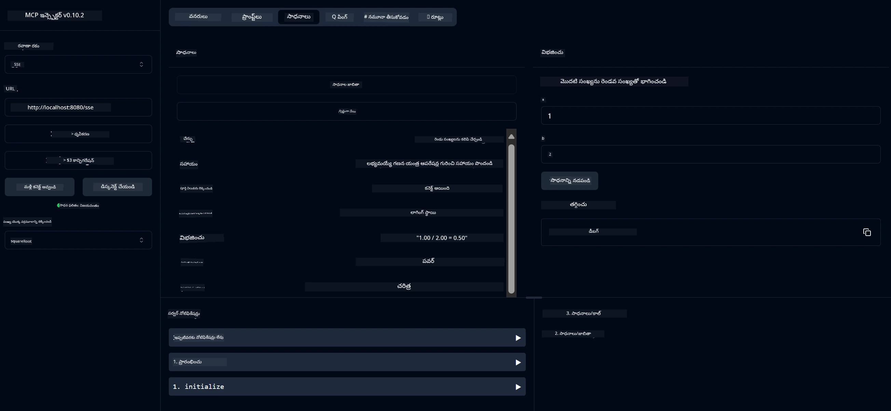

# ప్రాథమిక కేలిక్యులేటర్ MCP సేవ

> [!NOTE]
> ఈ జావా పరిష్కారం లెగసీ HTTP+SSE ట్రాన్స్‌పోర్ట్‌ను ఉపయోగిస్తుంది మరియు MCP `2025-11-25`కు అనుకూలమైన SDKని లక్ష్యంగా పెట్టుకుంది.
> ఇది కోర్సు కోడ్‌తో సరిపోల్చడానికి ఉంచబడింది;
> కొత్త రిమోట్ సర్వర్లు `2026-07-28` స్ట్రీమబుల్ HTTP మద్దతును ఉపయోగించాలి.

ఈ సేవ Spring Boot తో WebFlux ట్రాన్స్‌పోర్ట్ ఉపయోగించి Model Context Protocol (MCP) ద్వారా ప్రాథమిక కేలిక్యులేటర్ ఆపరేషన్లను అందిస్తుంది. ఇది MCP అమలు గురించి నేర్చుకునే ప్రారంభికులు కోసం ఒక సాదా ఉదాహరణగా రూపొందించబడింది.

మరింత సమాచారం కోసం, [MCP Server Boot Starter](https://docs.spring.io/spring-ai/reference/api/mcp/mcp-server-boot-starter-docs.html) సూత్రవాక్య డాక్యుమెంటేషన్‌ను చూడండి.


## సేవను ఉపయోగించడం

ఈ సేవ MCP ప్రొటోకాల్ ద్వారా ఈ క్రింది API ఎండ్‌పాయింట్లు నిర్దేశిస్తుంది:

- `add(a, b)`: రెండు సంఖ్యలను కలిపి జోడించు
- `subtract(a, b)`: రెండవ సంఖ్యను మొదటివాడినుండి తీసివేయు
- `multiply(a, b)`: రెండు సంఖ్యలను గుణించు
- `divide(a, b)`: మొదటి సంఖ్యను రెండవదితో భాగించు (సున్నా తనిఖీతో)
- `power(base, exponent)`: ఒక సంఖ్య శక్తిని గణించు
- `squareRoot(number)`: చదరపు మూలాన్ని గణించు (ऋణ సంఖ్య తనిఖీతో)
- `modulus(a, b)`: భాగించేటప్పుడు మిగులు గణించు
- `absolute(number)`: పరమాణువు విలువను గణించు

## ఆధారాలు

ఈ ప్రాజెక్ట్ క్రింది ముఖ్య ఆధారాలను అవసరమవుతుంది:

```xml
<dependency>
    <groupId>org.springframework.ai</groupId>
    <artifactId>spring-ai-starter-mcp-server-webflux</artifactId>
</dependency>
```

## ప్రాజెక్టును నిర్మించడం

Maven ఉపయోగించి ప్రాజెక్టును నిర్మించండి:
```bash
./mvnw clean install -DskipTests
```

## సర్వర్ ను నడపడం

### జావా ఉపయోగించడం

```bash
java -jar target/calculator-server-0.0.1-SNAPSHOT.jar
```

### MCP ఇన్స్‌పెక్టర్ ఉపయోగించడం

MCP ఇన్స్‌పెక్టర్ MCP సేవలతో పరిచయం కావడానికి ఉపయోగకరమైన సాధనం. ఈ కేలిక్యులేటర్ సేవతో దీన్ని ఉపయోగించడానికి:

1. **MCP ఇన్స్‌పెక్టర్‌ను ఇన్స్టాల్ చేసి నడపండి** కొత్త టెర్మినల్ విండోలో:
   ```bash
   npx @modelcontextprotocol/inspector
   ```

2. **అనువర్తనం చూపించే URLపై క్లిక్ చేసి వెబ్ UIకి వెళ్లండి** (సాధారణంగా http://localhost:6274)

3. **కనెక్షన్‌ని కాన్ఫిగర్ చేయండి**:
   - ట్రాన్స్‌పోర్ట్ రకంగా "SSE"ని ఎంచుకోండి
   - మీరు నడుపుతున్న సర్వర్ యొక్క SSE ఎండ్‌పాయింట్ URLని సెట్ చేయండి: `http://localhost:8080/sse`
   - "Connect" పై క్లిక్ చేయండి

4. **సాధనాలను ఉపయోగించండి**:
   - అందుబాటులో ఉన్న కేలిక్యులేటర్ ఆపరేషన్లను చూడటానికి "List Tools" పై క్లిక్ చేయండి
   - ఒక సాధనాన్ని ఎంచుకుని ఆపరేషన్ ను అమలు చేయడానికి "Run Tool" పై క్లిక్ చేయండి



---

<!-- CO-OP TRANSLATOR DISCLAIMER START -->
**అస్వీకరణ**:
ఈ పత్రం AI అనువాద సేవ [Co-op Translator](https://github.com/Azure/co-op-translator) ఉపయోగించి అనువదించబడింది. మేము ఖచ్చితత్వానికి ప్రయత్నిస్తున్నప్పటికీ, ఆటోమేటెడ్ అనువాదాలు తప్పులు లేదా అసమగ్రతలను కలిగి ఉండవచ్చు. దాని స్వదేశ భాషలో ఉన్న అసలు పత్రాన్ని అధికారం కలిగిన మూలంగా పరిగణించాలి. కీలకమైన సమాచారం కోసం, ప్రొఫెషనల్ మానవ అనువాదాన్ని సిఫారసు చేస్తాము. ఈ అనువాదం ఉపయోగం వల్ల కలిగే ఏవైనా అపార్థాలు లేదా తప్పుదారులు కోసం మేము బాధ్యత వహించము.
<!-- CO-OP TRANSLATOR DISCLAIMER END -->