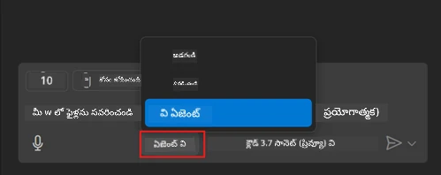
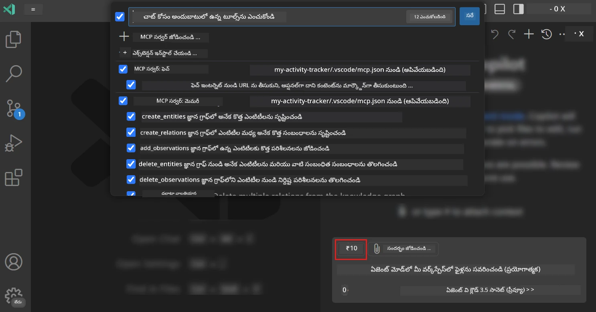
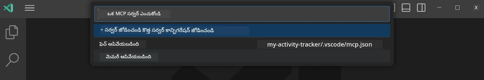
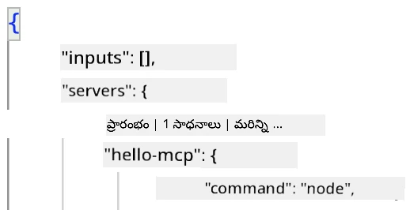
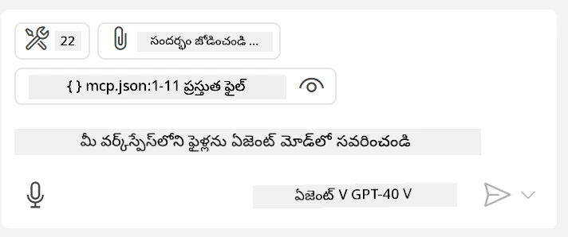
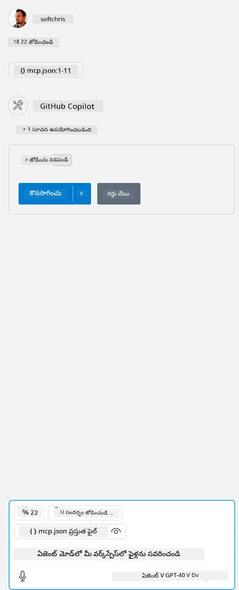

# GitHub Copilot ఏజెంట్ మోడ్ నుండి సర్వర్‌ను వినియోగించడం  

Visual Studio Code మరియు GitHub Copilot ఒక క్లయింట్‌గా పని చేసి MCP సర్వర్‌ను వినియోగించవచ్చు. మీరు ఏమి అడగవచ్చు ఇలా ఎందుకు చేస్తాం? అంటే MCP సర్వర్ కలిగిన అన్ని ఫీచర్లు ఇప్పుడు మీ IDE నుండి ఉపయోగించుకోవచ్చు. ఉదాహరణకి మీరు GitHub యొక్క MCP సర్వర్‌ను జోడిస్తే, ఇది GitHub ని ప్రాంప్ట్స్ ద్వారా నియంత్రించడానికి టెర్మినల్‌లో ప్రత్యేక ఆజ్ఞలు టైప్ చేయడం అవసరం లేకుండా చేస్తుంది. లేదా సాధారణంగా ఏమి అయితేనైనా, అది మీ డెవలపర్ అనుభవాన్ని మెరుగుపరుస్తూ సహజ భాష ద్వారా నియంత్రించబడుతుంది. ఇప్పుడు మీరు విజయం ఎలా అనిపిస్తుంది కదా?  

## అవల్లోకనం  

ఈ పాఠం Visual Studio Code మరియు GitHub Copilot ఏజెంట్ మోడ్‌ను మీ MCP సర్వర్ కోసం క్లయింట్‌గా ఎలా ఉపయోగించాలో కవర్ చేస్తుంది.  

## అభ్యాస లక్ష్యాలు  

ఈ పాఠాంతం చివరికి మీరు దీన్ని చేయగలరు:  

- Visual Studio Code ద్వారా MCP సర్వర్‌ను వినియోగించండి.  
- GitHub Copilot ద్వారా టూల్స్ వంటి సామర్థ్యాలను నడిపించండి.  
- Visual Studio Code ను మీ MCP సర్వర్‌ను కనుగొని నిర్వహించేందుకు అమర్చండి.  

## వినియోగం  

మీరు మీ MCP సర్వర్‌ను రెండు వేర్వేరు మార్గాల్లో నియంత్రించవచ్చు:  

- యూజర్ ఇంటర్ఫేస్, దీన్ని ఈ అధ్యాయం తరువాత మీకు చూపిస్తాము.  
- టెర్మినల్, `code` ఎగ్జిక్యూటబుల్ ఉపయోగించి టెర్మినల్ నుండి విషయాలను నియంత్రించడం సాధ్యం:  

  మీ వినియోగదారు ప్రొఫైల్‌కు MCP సర్వర్‌ను జోడించడానికి --add-mcp ఆజ్ఞా లైన్ ఎంపికను ఉపయోగించి, JSON సర్వర్ కాన్ఫిగరేషన్‌ను {\"name\":\"server-name\",\"command\":...} రూపంలో అందించండి.  

  ```
  code --add-mcp "{\"name\":\"my-server\",\"command\": \"uvx\",\"args\": [\"mcp-server-fetch\"]}"
  ```
  
### స్క్రీన్‌షాట్లు  

  
  
  

తర్వాతి విభాగాలలో మనం విజువల్ ఇంటర్ఫేస్ ఎలా ఉపయోగిస్తామో మాట్లాడుకుందాము.  

## 접근ం (పద్ధతి)  

ఇది ఎలాగో ఉన్నత స్థాయిలో ఇలా 접근ించాలి:  

- మా MCP సర్వర్ కనుగొనే ఫైల్ ను అమర్చండి.  
- ఆ సర్వర్ ను ప్రారంభించి దాని సామర్థ్యాలను జాబితా చేయండి.  
- GitHub Copilot చాట్ ఇంటర్‌ఫేస్ ద్వారా ఆ సామర్థ్యాలను ఉపయోగించండి.  

చక్కగా, ఇప్పుడు ప్రవాహం తెలిసింది కాబట్టి, Visual Studio Code ద్వారా MCP సర్వర్‌ను ఎలా ఉపయోగించాలో ఒక వ్యాయామంలో ప్రయత్నిద్దాం.  

## వ్యాయామం: సర్వర్ వినియోగించడం  

ఈ వ్యాయామంలో, Visual Studio Code ను మీ MCP సర్వర్ కనుగొనేట్టుగా అమర్చిపోతాం తద్వారా GitHub Copilot చాట్ ఇంటర్‌ఫేస్ నుండి ఉపయోగించుకోవచ్చు.  

### -0- ప్రాథమిక ప్రదేశం, MCP సర్వర్ కనుగొనడం ఆన్ చేయండి  

మీరు MCP సర్వర్ల కనుగొనడాన్ని ఆన్ చేయవలసి ఉండవచ్చు.  

1. Visual Studio Code లో `File -> Preferences -> Settings` కి వెళ్ళండి.  

1. "MCP" కోసం శోధించి `chat.mcp.discovery.enabled` ను settings.json ఫైలులో ఎనేబుల్ చేయండి.  

### -1- కాన్ఫిగ్ ఫైల్ సృష్టించండి  

మీ ప్రాజెక్ట్ రూట్లో .vscode అనే ఫోల్డర్‌లో MCP.json అనే ఫైల్ సృష్టించడం మొదలు పెట్టండి. ఇది ఇలా ఉండాలి:  

```text
.vscode
|-- mcp.json
```
  
తర్వాత, సర్వర్ ఎంట్రీని ఎలా జోడించాలో చూద్దాం.  

### -2- సర్వర్‌ను అమర్చండి  

*mcp.json* లో క్రింది విషయాలను జోడించండి:  

```json
{
    "inputs": [],
    "servers": {
       "hello-mcp": {
           "command": "node",
           "args": [
               "build/index.js"
           ]
       }
    }
}
```
  
పై ఉదాహరణలో Node.js లో వ్రాయబడిన సర్వర్ ఎలా ప్రారంభించాలో ఉంది, ఇతర రన్‌టైమ్‌ల కోసం `command` మరియు `args` ఉపయోగించి సర్వర్ ప్రారంభించే సరైన ఆజ్ఞను చూపించండి.  

### -3- సర్వర్ ప్రారంభించండి  

మీరు ఎంట్రీ జోడించిన తరువాత, ఇప్పుడు సర్వర్‌ను ప్రారంభిద్దాం:  

1. *mcp.json* లో మీ ఎంట్రీని గుర్తించి "play" చిహ్నాన్ని కనుగొనండి:  

    

1. "play" చిహ్నంపై క్లిక్ చేయండి, మీరు GitHub Copilot చాట్ లో టూల్స్ చిహ్నం పెరిగిన టూల్స్ సంఖ్యను చూడగలరు. ఆ టూల్స్ గుర్తుపై క్లిక్ చేస్తే, మీరు రిజిస్టర్ చేసిన టూల్స్ జాబితా చూస్తారు. టూల్ ఉపయోగించాలనుకున్నప్పుడు ఎంచుకోండి లేదా తొలగించండి:  

    

1. టూల్ ను నడపడానికి, మీకు తెలిసిన టూల్ వివరణతో సరిపోయే ప్రాంప్ట్ టైప్ చేయండి, ఉదాహరణకి "add 22 to 1" వంటి ప్రాంప్ట్:  

    

  23 అని ప్రతిస్పందన వస్తుందని మీరు చూడగలరు.  

## అసైన్‌మెంట్  

మీ *mcp.json* ఫైలుకు సర్వర్ ఎంట్రీని జోడించి సర్వర్‌ను ఆపడం/ప్రారంభించడం చేయగలరా పరీక్షించండి. GitHub Copilot చాట్ ఇంటర్‌ఫేస్ ద్వారా మీ సర్వర్ టూల్స్ తో కమ్యూనికేట్ చేయగలరా చూసుకోండి.  

## పరిష్కారం  

[పరిష్కారం](./solution/README.md)  

## ముఖ్య పాఠాలు  

ఈ అధ్యాయం నుంచి ముఖ్య పాఠాలు ఈ క్రింది విధంగా ఉన్నాయి:  

- Visual Studio Code అనేక MCP సర్వర్లను మరియు వాటి టూల్స్‌ను వినియోగించుకునే గొప్ప క్లయింట్.  
- GitHub Copilot చాట్ ఇంటర్‌ఫేస్ ద్వారా మీరు సర్వర్లతో ఇంటరాక్ట్ అవ్వవచ్చు.  
- సర్వర్ ఎంట్రీని *mcp.json* ఫైలులో కాన్ఫిగర్ చేసే సమయంలో API కీలు వంటి వినియోగదారుల ఇన్పుట్లను అడగవచ్చు, వీటిని MCP సర్వర్‌కు పంపవచ్చు.  

## నమూనాలు  

- [Java క్యాల్క్యులేటర్](../samples/java/calculator/README.md)  
- [.Net క్యాల్క్యులేటర్](../../../../03-GettingStarted/samples/csharp)  
- [JavaScript క్యాల్క్యులేటర్](../samples/javascript/README.md)  
- [TypeScript క్యాల్క్యులేటర్](../samples/typescript/README.md)  
- [Python క్యాల్క్యులేటర్](../../../../03-GettingStarted/samples/python)  

## అదనపు వనరులు  

- [విజువల్ స్టూడియో డాక్స్](https://code.visualstudio.com/docs/copilot/chat/mcp-servers)  

## తరువాత ఏమి చేయాలి  

- తదుపరి: [stdio సర్వర్ సృష్టించడం](../05-stdio-server/README.md)  

---

<!-- CO-OP TRANSLATOR DISCLAIMER START -->
**అస్వీకరణ**:
ఈ పత్రం AI అనువాద సేవ [Co-op Translator](https://github.com/Azure/co-op-translator) ఉపయోగించి అనువదించబడింది. మేము ఖచ్చితత్వానికి ప్రయత్నిస్తున్నప్పటికీ, ఆటోమేటెడ్ అనువాదాలు తప్పులు లేదా అసమగ్రతలను కలిగి ఉండవచ్చు. దాని స్వదేశ భాషలో ఉన్న అసలు పత్రాన్ని అధికారం కలిగిన మూలంగా పరిగణించాలి. కీలకమైన సమాచారం కోసం, ప్రొఫెషనల్ మానవ అనువాదాన్ని సిఫారసు చేస్తాము. ఈ అనువాదం ఉపయోగం వల్ల కలిగే ఏవైనా అపార్థాలు లేదా తప్పుదారులు కోసం మేము బాధ్యత వహించము.
<!-- CO-OP TRANSLATOR DISCLAIMER END -->