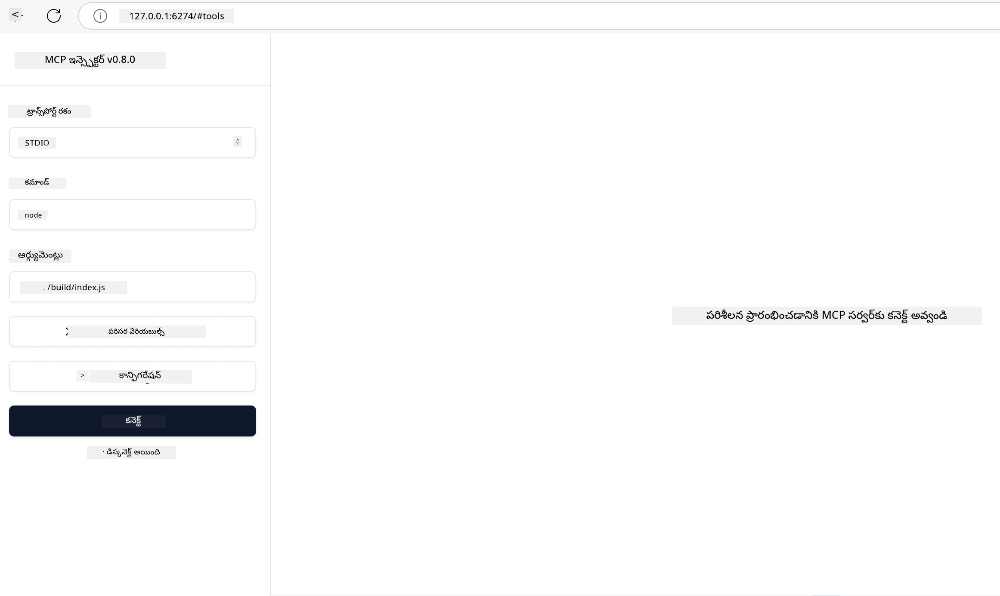

## పరీక్షణ మరియు డీబగ్గింగ్

మీ MCP సర్వర్‌ను పరీక్షించటానికి ముందుగా, అందుబాటులో ఉన్న సాధనాలు మరియు డీబగ్గింగ్‌ కోసం ఉత్తమ ఆచారాల గురించి అర్థం చేసుకోవడం ముఖ్యం. సమర్థవంతమైన పరీక్షా ప్రక్రియ మీ సర్వర్ ఆశించిన విధంగా పనిచేస్తుందనే విషయాన్ని నిర్ధారిస్తుంది మరియు సమస్యలను త్వరగా గుర్తించి పరిష్కరించడానికి సహాయపడుతుంది. ఈ క్రింది విభాగం మీ MCP అమలును సరిచూసుకోవడానికీ, ధృవీకరించడానికీ సిఫార్సు చేసిన విధానాలను వివరిస్తుంది.

## అవలోకనం

ఈ పాఠం సరైన పరీక్షా విధానాన్ని ఎంపిక చేయడం మరియు అత్యంత సమర్థవంతమైన పరీక్షా సాధనాన్ని గురించి తెలుసుకుంటుంది.

## అభ్యాస లక్ష్యాలు

ఈ పాఠం ముగింపు వరకు, మీరు చేయగలరుగా ఉంటారు:

- పరీక్షించేందుకు వివిధ విధానాలను వివరిస్తారు.
- మీ కోడ్‌ను సమర్థవంతంగా పరీక్షించడానికి వివిధ సాధనాలను ఉపయోగిస్తారు.


## MCP సర్వర్లను పరీక్షించడం

MCP మీ సర్వర్లను పరీక్షించడానికి మరియు డీబగ్ చేయడానికి సహాయపడే సాధనాలను అందిస్తుంది:

- **MCP ఇన్స్పెక్టర్**: కమాండ్ లైన్ సాధనం, CLI సాధనంగా మరియు విజువల్ సాధనగా రెండుగా ఉపయోగించవచ్చు.
- **ম্যানువల్ పరీక్ష**: మీరు curl వంటి సాధనాన్ని ఉపయోగించి వెబ్ అభ్యర్థనలు চালించవచ్చు, కానీ ఏదైనా HTTP ను నడిపించగల సాధనం సరిపోతుంది.
- **యూనిట్ పరీక్ష**: సర్వర్ మరియు క్లయింట్ రీత్యా ఫీచర్లు పరీక్షించడానికి మీ ఇష్టమైన పరీక్షా ఫ్రేమ్‌వర్క్‌ను ఉపయోగించవచ్చు.

### MCP ఇన్స్పెక్టర్ ఉపయోగించడం

మేము ఈ సాధనాన్ని పూర్వवर्ती పాఠాల్లో వివరించాము కానీ ఇక్కడ కొద్దిగా సారాంశం చెప్పుకుందాం. ఇది Node.js లో నిర్మించబడిన సాధనం, మీరు `npx` ఎగ్జిక్యూటబుల్‌ను పిలిచి ఉపయోగించవచ్చు, ఇది సాధ్నం తాత్కాలికంగా డౌన్‌లోడ్ చేసి ఇంస్టాల్ చేస్తుంది మరియు మీ ఆపరేషన్ పూర్తయిన తర్వాత స్వయంగా తుడుస్తుంది.

[MCP ఇన్స్పెక్టర్](https://github.com/modelcontextprotocol/inspector) ఈ విధంగా సహాయపడుతుంది:

- **సర్వర్ సామర్ధ్యాలు కనుగొనడం**: అందుబాటులో ఉన్న వనరులు, సాధనాలు, ప్రాంప్ట్‌లు స్వయంచాలకంగా గుర్తించడం
- **సాధన అమలును పరీక్షించడం**: విభిన్న పారామితులను ప్రయత్నించి సమాధానాలను రియల్-టైంలో చూడడం
- **సర్వర్ మెటాడేటా వీక్షణ**: సర్వర్ సమాచారం, స్కీమాలు, కాన్ఫిగరేషన్లు వివరంగా తిలకించడం

సాధనాన్ని సాధారణంగా ఇలా నడిపిస్తారు:

```bash
npx @modelcontextprotocol/inspector node build/index.js
```

పైన ఇచ్చిన ఆజ్ఞ MCP మరియు దాని విజువల్ ఇంటర్ఫేస్‌ను ప్రారంభించి, మీ బ్రౌజర్ లో స్థానిక వెబ్ ఇంటర్ఫేస్ ను ప్రారంభిస్తుంది. మీరు నమోదు చేసిన MCP సర్వర్లు, అందుబాటులో ఉన్న సాధనాలు, వనరులు, ప్రాంప్ట్‌ల డాష్‌బోర్డును చూడవచ్చు. ఈ ఇంటర్ఫేస్ మీరు సాధన అమలును సంకీర్తించే, సర్వర్ మెటాడేటాను పరిక్షించే, రియల్-టైం సమాధానాలను చూచే సౌలభ్యం ఇస్తుంది, ఇది మీ MCP సర్వర్ అమలును ధృవీకరించడం మరియు డీబగ్ చేయడాన్ని సులభతరం చేస్తుంది.

ఇది ఇలాగే కనిపించవచ్చు: 

మీరు ఈ సాధనాన్ని CLI మోడ్ లో కూడా నడిపించవచ్చు, అందుకు `--cli` లక్షణం జోడించాలి. క్రింద "CLI" మోడ్ లో సర్వర్ పై ఉన్న అన్ని సాధనాలను జాబితా చేసే ఉదాహరణ:

```sh
npx @modelcontextprotocol/inspector --cli node build/index.js --method tools/list
```

### మాన్యువల్ పరీక్ష

సర్వర్ సామర్ధ్యాలు పరీక్షించడానికి ఇన్స్పెక్టర్ సాధనాన్ని నడపడం తప్ప మరొక దారి HTTP ఉపయోగించగల క్లయింట్‌ను నడపడం కూడా.

curl తో, మీరు MCP సర్వర్లను నేరుగా HTTP అభ్యర్థనల ద్వారా పరీక్షించవచ్చు:

```bash
# ఉదాహరణ: సర్వర్ మెటాడేటా పరీక్షించండి
curl http://localhost:3000/v1/metadata

# ఉదాహరణ: ఒక ఉపకరణాన్ని అమలు చేయండి
curl -X POST http://localhost:3000/v1/tools/execute \
  -H "Content-Type: application/json" \
  -d '{"name": "calculator", "parameters": {"expression": "2+2"}}'
```

పై curl ఉపయోగించే పద్ధతి నుండి మీరు గమనించవచ్చు, సాధనాన్ని పిలవడానికి POST అభ్యర్థనను ఉపయోగిస్తారు, అది సాధన పేరు మరియు దాని పారామితులను కలిగిన లోడును ఉపయోగిస్తుంది. మీకు సరిపోయే పద్ధతిని ఉపయోగించండి. CLI సాధనాలు సాధారణంగా వేగంగా ఉపయోగించడానికి అనువుగా ఉంటాయి మరియు స్క్రిప్టింగ్‌కు అనుకూలంగా ఉంటాయి, ఇవి CI/CD వాతావరణంలో ఉపయోగపడతాయి.

### యూనిట్ పరీక్ష

మీ సాధనాలు మరియు వనరుల కోసం యూనిట్ టెస్ట్‌లు సృష్టించండి, అవి కచ్చితంగా పనిచేస్తున్నాయో లేదో నిర్ధారించడానికి. కొన్ని ఉదాహరణ టెస్టింగ్ కోడ్ ఇక్కడ ఉంది.

```python
import pytest

from mcp.server.fastmcp import FastMCP
from mcp.shared.memory import (
    create_connected_server_and_client_session as create_session,
)

# అసింక్ పరీక్షల కోసం మొత్తం మాడ్యూల్‌ను గుర్తించండి
pytestmark = pytest.mark.anyio


async def test_list_tools_cursor_parameter():
    """Test that the cursor parameter is accepted for list_tools.

    Note: FastMCP doesn't currently implement pagination, so this test
    only verifies that the cursor parameter is accepted by the client.
    """

 server = FastMCP("test")

    # కొన్ని పరీక్ష సాధనాలు సృష్టించండి
    @server.tool(name="test_tool_1")
    async def test_tool_1() -> str:
        """First test tool"""
        return "Result 1"

    @server.tool(name="test_tool_2")
    async def test_tool_2() -> str:
        """Second test tool"""
        return "Result 2"

    async with create_session(server._mcp_server) as client_session:
        # కర్సర్ పారామీటర్ లేకుండా పరీక్షించండి (ఉల్లేఖించలేదు)
        result1 = await client_session.list_tools()
        assert len(result1.tools) == 2

        # cursor=None తో పరీక్షించండి
        result2 = await client_session.list_tools(cursor=None)
        assert len(result2.tools) == 2

        # కర్సర్ స్ట్రింగ్‌గా ఉన్నప్పుడైన పరీక్ష
        result3 = await client_session.list_tools(cursor="some_cursor_value")
        assert len(result3.tools) == 2

        # ఖాళీ స్ట్రింగ్ కర్సర్‌తో పరీక్షించండి
        result4 = await client_session.list_tools(cursor="")
        assert len(result4.tools) == 2
    
```

మునుపటి కోడ్ ఈ క్రింది విధంగా పని చేస్తుంది:

- pytest ఫ్రేమ్‌వర్క్‌ను ఉపయోగిస్తుంది, ఇది మీరు ఫంక్షన్లు రూపంలో టెస్ట్‌లు సృష్టించడానికీ assert ప్రకటనలు వాడేందుకు సౌకర్యం ఇస్తుంది.
- రెండు విభిన్న సాధనాలతో MCP సర్వర్‌ను సృష్టిస్తుంది.
- నిర్దిష్ట పరిస్థితులు తీరుతున్నాయో లేదో తెలుసుకోవడానికి `assert` ప్రకటన ఉపయోగిస్తుంది.

[మొత్తం ఫైలు ఇక్కడ చూడండి](https://github.com/modelcontextprotocol/python-sdk/blob/main/tests/client/test_list_methods_cursor.py)

పై ఫైల్ ఆధారంగా, మీరు మీ సొంత సర్వర్‌ని పరీక్షించి, సామర్థ్యాలు వ్యావహారికంగా సృష్టించబడినాయో కాదో తెలుసుకోవచ్చు.

ప్రధాన SDKలలో కూడా ఇలాంటి పరీక్ష సెక్షన్లు ఉంటాయి కాబట్టి మీరు మీ ఎంపిక చేసిన రన్‌టైమ్కు అనుగుణంగా మార్చుకోవచ్చు.

## నమూనాలు

- [Java కాలిక్యులేటర్](../samples/java/calculator/README.md)
- [.Net కాలిక్యులేటర్](../../../../03-GettingStarted/samples/csharp)
- [JavaScript కాలిక్యులేటర్](../samples/javascript/README.md)
- [TypeScript కాలిక్యులేటర్](../samples/typescript/README.md)
- [Python కాలిక్యులేటర్](../../../../03-GettingStarted/samples/python) 

## అదనపు వనరులు

- [Python SDK](https://github.com/modelcontextprotocol/python-sdk)

## తదుపరి

- తదుపరి: [డిప్లాయ్‌మెంట్](../09-deployment/README.md)

---

<!-- CO-OP TRANSLATOR DISCLAIMER START -->
**వార్తావోయింపు**:
ఈ పత్రం AI అనువాద సేవ [Co-op Translator](https://github.com/Azure/co-op-translator) ఉపయోగిస్తూ అనువదించబడింది. మేము నిబద్ధతతో ఖచ్చితత్వాన్ని సాధించేందుకు ప్రయత్నించినప్పటికీ, ఆటోమేటెడ్ అనువాదాల్లో తప్పులు లేదా అసమర్థతలు ఉండొచ్చు. అసలు పత్రం native భాషలో నిఖార్సైన మూలంగా పరిగణించాలి. ముఖ్యమైన సమాచారం కోసం, వృత్తిపరమైన మనవ అనువాదాన్ని సిఫారసు చేస్తాము. ఈ అనువాదం వలన కలిగే ఏదైనా అపార్థాలు లేదా తప్పుగా అర్థం చేసుకోవడంపై మేము బాధ్యత వహించము.
<!-- CO-OP TRANSLATOR DISCLAIMER END -->