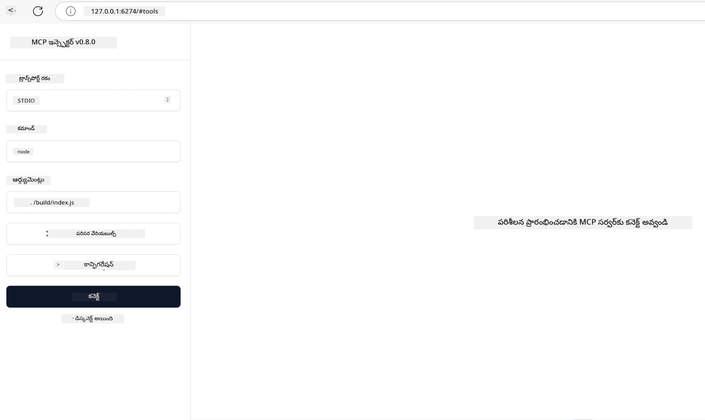

## పరీక్ష మరియు డీబగ్గింగ్

మీ MCP సర్వర్‌ను పరీక్షించడం ప్రారంభించేముందు, అందుబాటులో ఉన్న సాధనాలు మరియు డీబగ్గింగ్ కోసం ఉత్తమ పద్ధతులను అర్థం చేసుకోవడం 중요ం. సమర్థవంతమైన పరీక్ష విధానం మీ సర్వర్ ఆశించిన విధంగా పనిచేస్తుందని నిర్ధారిస్తుంది మరియు మీరు సమస్యలను త్వరగా గుర్తించి పరిష్కరించడానికి సహాయపడుతుంది. క్రింది విభాగం మీ MCP అమలు సరిచూసుకునే సిఫారసు చేసిన పద్ధతులను వివరించింది.

## సమీక్ష

ఈ పాఠం సరైన పరీక్ష పద్ధతిని ఎంపిక చేయడం మరియు అత్యంత సమర్థవంతమైన పరీక్ష సాధనాన్ని గురించి చూపిస్తుంది.

## అభ్యాస లక్ష్యాలు

ఈ పాఠం తో ముగిసే సమయానికి, మీరు చేయగలుగుతారు:

- వివిధ పరీక్షా పద్ధతులను వివరించండి.
- మీ కోడ్‌ను సమర్థవంతంగా పరీక్షించడానికి వేరువేరు సాధనాలను ఉపయోగించండి.


## MCP సర్వర్లను పరీక్షించడం

MCP మీ సర్వర్‌లను పరీక్షించడానికి, డీబగ్గింగ్ చేయడానికి సహాయపడే సాధనాలను అందిస్తుంది:

- **MCP ఇన్‌స్పెక్టర్**: CLI సాధనంగా మరియు విజువల్ సాధనంగా రెండింటుగా నడపగల కామాండ్ లైన్ టూల్.
- **మాన్యువల్ పరీక్ష**: curl వంటి సాధనాన్ని ఉపయోగించి వెబ్ అభ్యర్ధనలు నడపవచ్చు, కానీ HTTP నడపగల ఏ సాధనైనా ఉపయోగించవచ్చు.
- **యూనిట్ పరీక్ష**: సర్వర్ మరియు క్లయింట్ లక్షణాలను పరీక్షించడానికి మీరు ఇష్టమైన పరీక్షా ఫ్రేమ్‌వర్క్‌ను ఉపయోగించవచ్చు.

### MCP ఇన్‌స్పెక్టర్ ఉపయోగించడం

మేము ఈ సాధనం ఉపయోగాన్ని గత పాఠాల్లో వివరించాం, కానీ దీన్ని హెచ్ లెవెల్‌లో కొంచెం మాట్లాడుకుందాం. ఇది Node.jsలో నిర్మించిన సాధనం మరియు మీరు దానిని `npx` ఎగ్జిక్యూటబుల్ ద్వారా ఉపయోగించవచ్చు, ఇది తాత్కాలికంగా సాధనాన్ని డౌన్లోడ్ చేసి ఇన్‌స్టాల్ చేసి, మీ అభ్యర్ధన నడిచాక తాను స్వయంచాలకంగా శుభ్రం చేస్తుంది.

[MCP ఇన్‌స్పెక్టర్](https://github.com/modelcontextprotocol/inspector) మీకు సహాయపడుతుంది:

- **సర్వర్ సామర్థ్యాలను కనుగొనడం**: అందుబాటులో ఉన్న వనరులు, సాధనాలు మరియు ప్రాంప్ట్‌లను ఆటోమేటిక్‌గా గుర్తించడం
- **పరీక్ష సాధనం నిర్వహణ**: వేరేరక పరామితులను ప్రయత్నించి ప్రత్యక్ష సమాధానాలు చూడటం
- **సర్వర్ మెటాడేటాను చూడండి**: సర్వర్ సమాచారం, స్కీమాలు మరియు కాన్ఫిగరేషన్లను పరిశీలించడం

సాధనం సాధారణ నడిపేటప్పుడు ఇలా ఉంటుంది:

```bash
npx @modelcontextprotocol/inspector node build/index.js
```

పై ఆజ్ఞ ఒక MCP మరియు దాని విజువల్ ఇంటర్‌ఫేస్‌ను ప్రారంభించి మీ బ్రౌజర్‌లో స్థానిక వెబ్ ఇంటర్‌ఫేస్‌ను ఆవిష్కరిస్తుంది. మీరు నమోదు చేసిన MCP సర్వర్‌లు, అందుబాటులో ఉన్న సాధనాలు, వనరులు, ప్రాంప్ట్‌లను చూపించే డాష్‌బోర్డ్‌ను చూడవచ్చు. ఈ ఇంటర్‌ఫేస్ మీరు ఇంటరాక్టివ్‌గా పరీక్ష సాధనం నిర్వహణ చేయగలిగే విధంగా, సర్వర్ మెటాడేటాను తనిఖీ చేయడం, ప్రత్యక్ష సమాధానాలు చూడటం సాధ్యమవుతుంది, ఇది మీ MCP సర్వర్ అమలును సులభంగా సరిచూడటానికి మరియు డీబగ్గింగ్ చేసుకోవడానికి సహాయపడుతుంది.

ఇది ఇలా కనిపించవచ్చు: 

మీరు ఈ సాధనాన్ని CLI మోడ్‌లో కూడా నడపవచ్చు, ఈ సందర్భంలో `--cli` అట్రిబ్యూట్‌ను జోడించండి. ఇది సర్వర్‌పై ఉన్న అన్ని సాధనాలను జాబితా చేసే ఉదాహరణ:

```sh
npx @modelcontextprotocol/inspector --cli node build/index.js --method tools/list
```

### మాన్యువల్ పరీక్ష

సర్వర్ సామర్థ్యాలను పరీక్షించడానికి ఇన్‌స్పెక్టర్ సాధనం నడపడం తప్ప మరొక సమాన పద్ధతి HTTP నడిపే క్లయింట్‌ను ఉపయోగించడం, ఉదా: curl.

curl తో, మీరు MCP సర్వర్‌లను నేరుగా HTTP అభ్యర్థనలతో పరీక్షించవచ్చు:

```bash
# ఉదాహరణ: పరీక్షా సర్వర్ మెటాడేటా
curl http://localhost:3000/v1/metadata

# ఉదాహరణ: ఒక టూల్ నడపండి
curl -X POST http://localhost:3000/v1/tools/execute \
  -H "Content-Type: application/json" \
  -d '{"name": "calculator", "parameters": {"expression": "2+2"}}'
```

పై curl ఉపయోగం నుండి మీరు చూడగలుగుతున్నట్లు, మీరు ఒక POST అభ్యర్థనను ఉపయోగించి సాధనం పేరు మరియు దాని పరామితులతో కూడిన పేలోడ్‌ను పంపించి సాధనాన్ని నడపడాన్ని ప్రారంభిస్తారు. మీకు అనుకూలంగా ఉన్న పద్ధతిని ఉపయోగించండి. CLI సాధనాలు సాధారణంగా వేగంగా పనిచేస్తాయి మరియు అవి స్క్రిప్ట్ చేయటానికి అనువుగా ఉంటాయి, ఇది CI/CD పరిసరాలకి ఉపయోగకరం.

### యూనిట్ పరీక్ష

మీ సాధనాలు మరియు వనరుల కోసం యూనిట్ పరీక్షలను సృష్టించి అవి అంచనల ప్రకారం పనిచేస్తున్నాయని నిర్ధారించండి. క్రింది ఉదాహరణ పరీక్ష కోడ్ చూడండి.

```python
import pytest

from mcp.server.fastmcp import FastMCP
from mcp.shared.memory import (
    create_connected_server_and_client_session as create_session,
)

# అసింక్ టెస్టుల కోసం మొత్తం మాడ్యూల్‌ని మార్క్ చేయండి
pytestmark = pytest.mark.anyio


async def test_list_tools_cursor_parameter():
    """Test that the cursor parameter is accepted for list_tools.

    Note: FastMCP doesn't currently implement pagination, so this test
    only verifies that the cursor parameter is accepted by the client.
    """

 server = FastMCP("test")

    # కొన్ని టెస్ట్ టూల్స్‌ని సృష్టించండి
    @server.tool(name="test_tool_1")
    async def test_tool_1() -> str:
        """First test tool"""
        return "Result 1"

    @server.tool(name="test_tool_2")
    async def test_tool_2() -> str:
        """Second test tool"""
        return "Result 2"

    async with create_session(server._mcp_server) as client_session:
        # కర్సర్ పారామీటర్ లేకుండా పరీక్షించండి (తొలగించబడింది)
        result1 = await client_session.list_tools()
        assert len(result1.tools) == 2

        # కర్సర్=None తో పరీక్షించండి
        result2 = await client_session.list_tools(cursor=None)
        assert len(result2.tools) == 2

        # కర్సర్ స్ట్రింగ్‌గా ఉన్నప్పుడు పరీక్షించండి
        result3 = await client_session.list_tools(cursor="some_cursor_value")
        assert len(result3.tools) == 2

        # ఖాళీ స్ట్రింగ్ కర్సర్‌తో పరీక్షించండి
        result4 = await client_session.list_tools(cursor="")
        assert len(result4.tools) == 2
    
```

పై కోడ్ ఈ క్రింది పనులు చేస్తుంది:

- pytest ఫ్రేమ్‌వర్క్‌ను ఉపయోగించి, ఇది ఫంక్షన్లుగా పరీక్షలను సృష్టించటానికి మరియు assert స్టేట్మెంట్లను ఉపయోగించడానికి అనుమతిస్తుంది.
- రెండు వేరే సాధనాలతో MCP సర్వర్‌ను సృష్టిస్తుంది.
- కొన్ని పరిస్థితులు పూర్తయ్యాయా అన్నది చూసేందుకు `assert` స్టేట్మెంట్ ఉపయోగిస్తుంది.

పూర్తి ఫైల్‌ను ఇక్కడ చూడండి: [full file here](https://github.com/modelcontextprotocol/python-sdk/blob/main/tests/client/test_list_methods_cursor.py)

పై ఫైల్ ఆధారంగా, మీరు మీ సర్వర్‌ను పరీక్షించి సామర్థ్యాలు సరిగా సృష్టించబడ్డాయని నిర్ధారించవచ్చు.

అన్ని ప్రధాన SDKల వద్ద కూడా సమానమైన పరీక్షా విభాగాలు ఉంటాయి కాబట్టి మీరు మీ ఎంచుకున్న రన్‌టైమ్‌కు అనుగుణంగా మార్చుకోవచ్చు.

## నమూనాలు

- [Java Calculator](../samples/java/calculator/README.md)
- [.Net Calculator](../../../../03-GettingStarted/samples/csharp)
- [JavaScript Calculator](../samples/javascript/README.md)
- [TypeScript Calculator](../samples/typescript/README.md)
- [Python Calculator](../../../../03-GettingStarted/samples/python)

## అదనపు వనరులు

- [Python SDK](https://github.com/modelcontextprotocol/python-sdk)

## తదుపరి

- తదుపరి: [Deployment](../09-deployment/README.md)

---

<!-- CO-OP TRANSLATOR DISCLAIMER START -->
**అస్వీకరణ**:
ఈ పత్రం AI అనువాద సేవ [Co-op Translator](https://github.com/Azure/co-op-translator) ఉపయోగించి అనువదించబడింది. మేము ఖచ్చితత్వానికి ప్రయత్నిస్తున్నప్పటికీ, ఆటోమేటెడ్ అనువాదాలు తప్పులు లేదా అసమగ్రతలను కలిగి ఉండవచ్చు. దాని స్వదేశ భాషలో ఉన్న అసలు పత్రాన్ని అధికారం కలిగిన మూలంగా పరిగణించాలి. కీలకమైన సమాచారం కోసం, ప్రొఫెషనల్ మానవ అనువాదాన్ని సిఫారసు చేస్తాము. ఈ అనువాదం ఉపయోగం వల్ల కలిగే ఏవైనా అపార్థాలు లేదా తప్పుదారులు కోసం మేము బాధ్యత వహించము.
<!-- CO-OP TRANSLATOR DISCLAIMER END -->