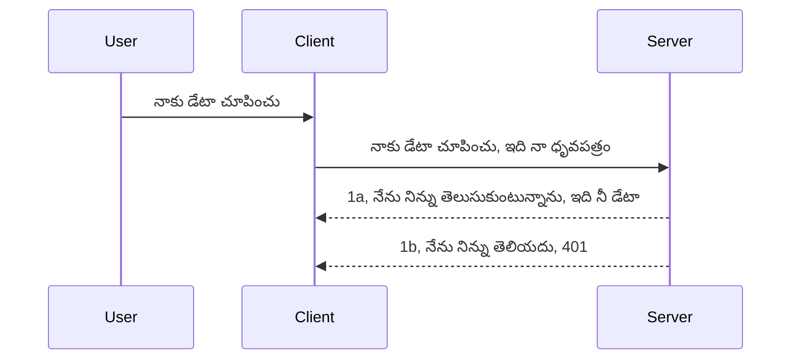

# సింపుల్ ఆ auth

MCP SDKs OAuth 2.1 ఉపయోగాన్ని మద్దతు ఇస్తాయి, ఇది నిజానికి auth server, resource server, credentials పోస్ట్ చేయడం, కోడ్ పొందడం, కోడ్ ను bearer token లో మార్పిడి చేయడం వంటి ఆలోచనలను కలిగి ఉన్న ఒక సందర్భం. మీరు OAuth కు అలవాటు లేకపోతే, ఇది అమలు చేయడానికి గొప్ప విషయం, మీరు కొన్ని ప్రాథమిక స్థాయి auth తో ప్రారంభించి మెరుగైన మరియు మెరుగైన భద్రతకు అభివృద్ధి చెందడం మంచిది. అందుకే ఈ అధ్యాయం ఉంది, మీను మరింత అభివృద్ధి చెందిన auth కు పైకి తీసుకెళ్ళడానికి.

## auth, మనం ఏం అర్థం చేసుకుంటున్నాం?

Auth అంటే authentication మరియు authorization యొక్క సంక్షిప్త రూపం. ఆలోచన ఏమిటంటే మనం రెండు పనులు చేయాలి:

- **Authentication**, అంటే మన ఇంటి లోకి ఒకవారు ఎవరనేది తెలుసుకునే ప్రక్రియ, వారు "ఇక్కడ" ఉండేందుకు లేదా మన resource server కి యాక్సెస్ పొందే హక్కు కలిగివున్నారా అంటే తెలుసుకోవడం.
- **Authorization**, ఒక యూజర్ వారు అడుగుతున్న నిర్దిష్ట రిసోర్స్లకు, ఉదాహరణకు ఆ ఆర్డర్స్ లేదా ఉత్పత్తులు, ప్రాప్యత కలిగి ఉండాలా లేదా వారు కంటెంట్ ను చదవగలరా కానీ తొలగించలేరా అనే వంటివి చూసేది.

## Credentials: మేము సిస్టమ్ కు మనం ఎవరో చెప్పడం ఎలా?

మికెందరు వెబ్ డెవలపర్లు credentials ని సర్వర్ కు అందించడాన్ని ఆలోచిస్తారు, సాధారణంగా ఒక రహస్యం అది "Authentication" కోసం వారు ఇక్కడ ఉండే హక్కు ఉందా అంటే చెబుతుంది. ఈ credential సాధారణంగా username మరియు password యొక్క base64 కుడుపెట్టి లేదా యునిక్ గా ఒక యూజర్ను గుర్తించే API key గా ఉంటుంది.

ఇది "Authorization" అనే హెడ్డర్ ద్వారా ఇలా పంపబడుతుంది:

```json
{ "Authorization": "secret123" }
```

దీన్ని సాధారణంగా basic authentication అంటారు. మొత్తం flow ఎలా పని చేస్తుంది అంటే ఇలా:


ఇప్పుడు flow పరంగా ఇది ఎలా పనిచేస్తుందో మనకి తెలుసు, దీన్ని ఎలా అమలు చేయాలి? ఎక్కువ వెబ్ సర్వర్లు middleware అనే కల్పన కలిగి ఉంటాయి, ఇది కోడ్ యొక్క ఒక భాగం ఇది రిక్వెస్ట్ భాగంగా నడుస్తుంది, ఇది credentials ని ధృవీకరిస్తుంది, మరియు credentials సరి అయితే రిక్వెస్ట్ ముందుకు వెళ్ళేందుకు అనుమతిస్తుంది. credentials సరియైనవి కాకపోతే auth error వస్తుంది. దీన్ని ఎలా అమలు చేయాలో చూద్దాం:

**Python**

```python
class AuthMiddleware(BaseHTTPMiddleware):
    async def dispatch(self, request, call_next):

        has_header = request.headers.get("Authorization")
        if not has_header:
            print("-> Missing Authorization header!")
            return Response(status_code=401, content="Unauthorized")

        if not valid_token(has_header):
            print("-> Invalid token!")
            return Response(status_code=403, content="Forbidden")

        print("Valid token, proceeding...")
       
        response = await call_next(request)
        # ప్రతిస్పందనలో ఏదైనా కస్టమర్ హెడ్డర్స్ ను జోడించండి లేదా మార్పు చేయండి
        return response


starlette_app.add_middleware(CustomHeaderMiddleware)
```

ఇక్కడ మనం:

- `AuthMiddleware` అనే middleware ను సృష్టించాము, దాని `dispatch` పద్ధతి వెబ్ సర్వర్ ద్వారా పిలవబడుతుంది.
- వెబ్ సర్వర్ లో middlewareని చేర్చాము:

    ```python
    starlette_app.add_middleware(AuthMiddleware)
    ```

- Authorization హెడ్డర్ ఉందా మరియు రహస్యం సరియైనదిగా ఉందా అని తనిఖీ చేసే వాలిడేషన్ లాజిక్ వ్రాసాము:

    ```python
    has_header = request.headers.get("Authorization")
    if not has_header:
        print("-> Missing Authorization header!")
        return Response(status_code=401, content="Unauthorized")

    if not valid_token(has_header):
        print("-> Invalid token!")
        return Response(status_code=403, content="Forbidden")
    ```

రహస్యం సరియైనది ఉంటే `call_next` ను పిలిచి రిక్వెస్ట్ ను ముందుకు వెళ్ళనిస్తాము మరియు స్పందనను ఇస్తాము.

    ```python
    response = await call_next(request)
    # అత్యంత కస్టమర్ హెడర్లు జోడించండి లేదా ప్రతిస్పందనలో ఏదో మార్పు చేయండి
    return response
    ```

విభిన్న రిక్వెస్ట్ సర్వర్ కు వచ్చినప్పుడు middleware పిలవబడుతుంది మరియు అమలులో ఉన్న విధానం ప్రకారం రిక్వెస్ట్ ని ముందుకు పంపనో లేదా క్లయింట్ అభ్యర్ధనకు అనుమతి లేదని error ను తిరిగివ్వనో చేస్తుంది.

**TypeScript**

ఇక్కడ మనం Express లో middleware ని సృష్టించి MCP Server కి రిక్వెస్ట్ అందుకుముందు ఆకతాయి. కోడ్ ఇక్కడ:

```typescript
function isValid(secret) {
    return secret === "secret123";
}

app.use((req, res, next) => {
    // 1. పరవాన్ హెడర్ ఉందా?
    if(!req.headers["Authorization"]) {
        res.status(401).send('Unauthorized');
    }
    
    let token = req.headers["Authorization"];

    // 2. చెలామణీ మైనదా అని తనిఖీ చేయండి.
    if(!isValid(token)) {
        res.status(403).send('Forbidden');
    }

   
    console.log('Middleware executed');
    // 3. అభ్యర్థన పైపైన్లో తదుపరి దశకు అభ్యర్థనను పంపుతుంది.
    next();
});
```

ఈ కోడ్ లో మనం చేస్తాము:

1. మొదట Authorization హెడ్డర్ ఉందో లేదో తనిఖీ చేస్తాము, లేకపోతే 401 error పంపిస్తాము.
2. credentials/token సరియైనదో చూస్తాము, లేకపోతే 403 error పంపిస్తాము.
3. చివరగా రిక్వెస్ట్ pipeline లో రిక్వెస్ట్ ను ముందుకు పంపించి అడిగిన రిసోర్స్ ఇస్తాము.

## వ్యాయామం: authentication అమలు చేయండి

మన జ్ఞానం తీసుకొని దీనిని అమలు చేసేద్దాం. ప్రణాళిక:

సర్వర్

- వెబ్ సర్వర్ మరియు MCP instance ని సృష్టించండి.
- సర్వర్ కోసం middlewareను అమలు చేయండి.

క్లయింట్

- credentials తో వెబ్ రిక్వెస్ట్ పంపండి, హెడ్డర్ ద్వారా.

### -1- వెబ్ సర్వర్ మరియు MCP instance సృష్టించండి

మొదటి దశలో, మనం వెబ్ సర్వర్ instance మరియు MCP Server ని సృష్టించాలి.

**Python**

ఇక్కడ MCP server instance సృష్టించి, starlette web app సృష్టించి uvicorn తో హోస్ట్ చేయాలి.

```python
# MCP సర్వర్ సృష్టించడం

app = FastMCP(
    name="MCP Resource Server",
    instructions="Resource Server that validates tokens via Authorization Server introspection",
    host=settings["host"],
    port=settings["port"],
    debug=True
)

# స్టార్‌లెట్ వెబ్ యాప్ సృష్టించడం
starlette_app = app.streamable_http_app()

# uvicorn ద్వారా యాప్ సేవ చేస్తోంది
async def run(starlette_app):
    import uvicorn
    config = uvicorn.Config(
            starlette_app,
            host=app.settings.host,
            port=app.settings.port,
            log_level=app.settings.log_level.lower(),
        )
    server = uvicorn.Server(config)
    await server.serve()

run(starlette_app)
```

ఈ కోడ్ లో:

- MCP Server ని సృష్టించాము.
- MCP Server నుండి starlette web app ను నిర్మించారు: `app.streamable_http_app()`.
- uvicorn ఉపయోగించి web app ని హోస్ట్ చేసి సర్వ్ చేస్తున్నాము: `server.serve()`.

**TypeScript**

ఇక్కడ MCP Server instance సృష్టిస్తున్నాము.

```typescript
const server = new McpServer({
      name: "example-server",
      version: "1.0.0"
    });

    // ... సర్వర్ వనరులు, టూల్స్, మరియు ప్రాంప్ట్‌లను సెట్ చేయండి ...
```

ఈ MCP Server సృష్టి POST /mcp రూట్ నిర్వచనలో జరగాలి, కాబట్టి పై కోడ్ ని ఇలా మార్చుదాం:

```typescript
import express from "express";
import { randomUUID } from "node:crypto";
import { McpServer } from "@modelcontextprotocol/sdk/server/mcp.js";
import { StreamableHTTPServerTransport } from "@modelcontextprotocol/sdk/server/streamableHttp.js";
import { isInitializeRequest } from "@modelcontextprotocol/sdk/types.js"

const app = express();
app.use(express.json());

// సెషన్ ఐడీఅయిన ట్రాన్స్‌పోర్ట్‌లను సંગ્રహించడానికి మ్యాప్
const transports: { [sessionId: string]: StreamableHTTPServerTransport } = {};

// క్లయింట్-టు-సర్వర్ కమ్యూనికేషన్ కోసం POST అభ్యర్థనలను నిర్వహించండి
app.post('/mcp', async (req, res) => {
  // ఇప్పటికే ఉన్న సెషన్ ఐడీ కోసం తనిఖీ చేయండి
  const sessionId = req.headers['mcp-session-id'] as string | undefined;
  let transport: StreamableHTTPServerTransport;

  if (sessionId && transports[sessionId]) {
    // ఇప్పటికే ఉన్న ట్రాన్స్‌పోర్ట్‌ను పునర్వినియోగం చేసుకోండి
    transport = transports[sessionId];
  } else if (!sessionId && isInitializeRequest(req.body)) {
    // కొత్త ప్రారంభీకరణ అభ్యర్థన
    transport = new StreamableHTTPServerTransport({
      sessionIdGenerator: () => randomUUID(),
      onsessioninitialized: (sessionId) => {
        // సెషన్ ఐడీ ద్వారా ట్రాన్స్‌పోర్ట్‌ను సંગ્રహించండి
        transports[sessionId] = transport;
      },
      // DNS రీబైండింగ్ రక్షణ డిఫాల్ట్‌గా వెనుకబడిన అనుకూలత కోసం నిలిపివేశారు. మీరు ఈ సర్వర్‌ను
      // స్థానికంగా నడిపిస్తుంటే, నిర్ధారించుకోండి:
      // enableDnsRebindingProtection: true,
      // allowedHosts: ['127.0.0.1'],
    });

    // ట్రాన్స్‌పోర్ట్ మూసివేయబడినప్పుడు శుభ్రపరచండి
    transport.onclose = () => {
      if (transport.sessionId) {
        delete transports[transport.sessionId];
      }
    };
    const server = new McpServer({
      name: "example-server",
      version: "1.0.0"
    });

    // ... సర్వర్ వనరులు, సాధనాలు, మరియు ప్రాంప్ట్‌లను సెట్ చేయండి ...

    // MCP సర్వర్‌తో కనెక్ట్ అవ్వండి
    await server.connect(transport);
  } else {
    // చెల్లని అభ్యర్థన
    res.status(400).json({
      jsonrpc: '2.0',
      error: {
        code: -32000,
        message: 'Bad Request: No valid session ID provided',
      },
      id: null,
    });
    return;
  }

  // అభ్యర్థనను నిర్వహించండి
  await transport.handleRequest(req, res, req.body);
});

// GET మరియు DELETE అభ్యర్థనల కోసం పునర్వినియోగ హ్యాండ్లర్
const handleSessionRequest = async (req: express.Request, res: express.Response) => {
  const sessionId = req.headers['mcp-session-id'] as string | undefined;
  if (!sessionId || !transports[sessionId]) {
    res.status(400).send('Invalid or missing session ID');
    return;
  }
  
  const transport = transports[sessionId];
  await transport.handleRequest(req, res);
};

// SSE ద్వారా సర్వర్-టు-క్లయింట్ నోటిఫికేషన్లకు GET అభ్యర్థనలను నిర్వహించండి
app.get('/mcp', handleSessionRequest);

// సెషన్ ముగింపునకు DELETE అభ్యర్థనలను నిర్వహించండి
app.delete('/mcp', handleSessionRequest);

app.listen(3000);
```

ఇప్పుడు మీరు చూడవచ్చు MCP Server సృష్టి `app.post("/mcp")` లోకి తరలించబడింది.

తరువాత మిదిల్డ్వేర్ సృష్టి దశకు వెళ్దాం, తద్వారా వచ్చే credentials ను ధృవీకరించవచ్చు.

### -2- సర్వర్ కోసం middlewareను అమలు చేయండి

ఇప్పుడు మిదిల్డ్వేర్ భాగం వద్దకి వెళ్దాం. ఇక్కడ `Authorization` హెడ్డర్ లో ఒక credential ని మనవి చేసి ధృవీకరిస్తాం. సరైనది అయితే రిక్వెస్ట్ ముందుకు వెళ్తుంది (ఉదా: టూల్స్ జాబితా చూపు, రిసోర్స్ చదవడం లేక MCP ఫంక్షనాలిటీ చేయడం).

**Python**

middleware సృష్టించడానికి, మనం `BaseHTTPMiddleware` నుంచి వారసత్వం పొందిన క్లాస్ సృష్టించాలి. రెండు ముఖ్య భాగాలున్నాయి:

- `request` నుండి హెడ్డర్ సమాచారం చదవడం.
- `call_next` అనే కాల్బ్యాక్, ఇది కస్టమర్ సరైన credentials తీసుకు వచ్చినప్పుడు పిలవాలి.

మొదటి, `Authorization` హెడ్డర్ లేనప్పుడు హ్యాండిల్ చేయాలి:

```python
has_header = request.headers.get("Authorization")

# హెడ్డర్ లేదు, 401తో విఫలమవ్వు, లేనిదే ముందుకు సాగు.
if not has_header:
    print("-> Missing Authorization header!")
    return Response(status_code=401, content="Unauthorized")
```

ఇక్కడ 401 unauthorized సందేశం పంపబడుతుంది, కస్టమర్ authentication లో విఫలమవుతున్నప్పుడై.

తర్వాత, credential సమర్పించబడితే దాని సరైనతను తనిఖీ చేస్తాం:

```python
 if not valid_token(has_header):
    print("-> Invalid token!")
    return Response(status_code=403, content="Forbidden")
```

403 forbidden సందేశం ఎలా పంపుతామో చూడండి. క్రింది полной middleware పూర్తి అమలు:

```python
class AuthMiddleware(BaseHTTPMiddleware):
    async def dispatch(self, request, call_next):

        has_header = request.headers.get("Authorization")
        if not has_header:
            print("-> Missing Authorization header!")
            return Response(status_code=401, content="Unauthorized")

        if not valid_token(has_header):
            print("-> Invalid token!")
            return Response(status_code=403, content="Forbidden")

        print("Valid token, proceeding...")
        print(f"-> Received {request.method} {request.url}")
        response = await call_next(request)
        response.headers['Custom'] = 'Example'
        return response

```

మంచి ఉంది, కానీ `valid_token` ఫంక్షన్ గురించి? ఇది క్రింద ఉంది:

```python
# ఉత్పత్తికి ఉపయోగించ వద్దు - దయచేసి దీనిని మెరుగుపరచండి !!
def valid_token(token: str) -> bool:
    # "Bearer " ముందస్తు పదం తీసివేయండి
    if token.startswith("Bearer "):
        token = token[7:]
        return token == "secret-token"
    return False
```

ఇది మరింత మెరుగుపరచాలి.

ముఖ్యమైనది: కోడ్ లో ఇలాంటి రహస్యాలు ఎప్పుడూ ఉంచకూడదు. వీటిని డేటా సోర్స్ లేదా IDP (identity service provider) నుండి పొందటం మరింత మంచిది, లేదా IDP ద్వారా ధృవీకరణ చేయించాల్సివుంది.

**TypeScript**

Express తో అమలు చేయడానికి, `use` పద్ధతిని పిలవాలి, ఇది middleware ఫంక్షన్లను అందుకుంటుంది.

మనము చేయవలసింది:

- రిక్వెస్ట్ లో `Authorization` ప్రాపర్టీ లో credential తనిఖీ.
- ధృవీకరించి సరి అయితే రిక్వెస్ట్ కొనసాగించి MCP ఫంక్షనాలిటీ చేయించాలి.

ఇక్కడ `Authorization` హెడ్డర్ ఉన్నదా తనిఖీ చేసి లేకుంటే రిక్వెస్ట్ ఆపేస్తాం:

```typescript
if(!req.headers["authorization"]) {
    res.status(401).send('Unauthorized');
    return;
}
```

హెడ్డర్ మొదట్లో పంపించకపోతే 401 వస్తుంది.

తర్వాత credential సరైంది కాదా అనే తనిఖీ, తప్పు అయితే ఇలా చేస్తాం:

```typescript
if(!isValid(token)) {
    res.status(403).send('Forbidden');
    return;
} 
```

ఇప్పుడు 403 error వస్తుంది.

పూర్తి కోడ్:

```typescript
app.use((req, res, next) => {
    console.log('Request received:', req.method, req.url, req.headers);
    console.log('Headers:', req.headers["authorization"]);
    if(!req.headers["authorization"]) {
        res.status(401).send('Unauthorized');
        return;
    }
    
    let token = req.headers["authorization"];

    if(!isValid(token)) {
        res.status(403).send('Forbidden');
        return;
    }  

    console.log('Middleware executed');
    next();
});
```

వెబ్ సర్వర్ లో middleware ని సెటప్ చేసి, క్లయింట్ పంపే credential తనిఖీ చేస్తుంది. క్లయింట్ గురించి?

### -3- credentials తో వెబ్ రిక్వెస్ట్ పంపండి

క్లయింట్ credential హెడ్డర్ లో పంపుతున్నదనే చూసుకోవాలి. MCP client ఉపయోగిస్తాం కాబట్టి దీన్ని ఎలా చేయాలో చూద్దాం.

**Python**

క్లయింట్ కోసం credential తో హెడ్డర్ పంపాలి ఇలా:

```python
# విలువను కఠినంగా కోడ్ చేయకండి, కనీసం దానిని వాతావరణ చరము లేదా మరింత భద్రమైన నిల్వలో ఉంచండి
token = "secret-token"

async with streamablehttp_client(
        url = f"http://localhost:{port}/mcp",
        headers = {"Authorization": f"Bearer {token}"}
    ) as (
        read_stream,
        write_stream,
        session_callback,
    ):
        async with ClientSession(
            read_stream,
            write_stream
        ) as session:
            await session.initialize()
      
            # TODO, క్లయింట్‌లో మీరు చేయించాలనుకుంటున్నది, ఉదాహరణకు పరికరాలను జాబితా చేయడం, పరికరాలను కాల్ చేయడం మొదలైనవి.
```

`headers = {"Authorization": f"Bearer {token}"}` గా వుంటుంది.

**TypeScript**

ఇదిని రెండు దశల్లో చేయవచ్చు:

1. config object ని credential తో నింపండి.
2. config object ని transport కి పంపండి.

```typescript

// ఇక్కడ చూపించినట్లుగా విలువను హార్డ్‌కోడ్ చేయవద్దు. కనీసం దాన్ని env వేరియబల్‌గా పెట్టండి మరియు dev మోడ్‌లో dotenv వంటివి ఉపయోగించండి.
let token = "secret123"

// ఒక క్లయింట్ ట్రాన్స్పోర్ట్ ఎంపిక ఆబ్జెక్టును నిర్వచించండి
let options: StreamableHTTPClientTransportOptions = {
  sessionId: sessionId,
  requestInit: {
    headers: {
      "Authorization": "secret123"
    }
  }
};

// ఆప్షన్స్ ఆబ్జెక్టును ట్రాన్స్పోర్ట్‌కు పంపండి
async function main() {
   const transport = new StreamableHTTPClientTransport(
      new URL(serverUrl),
      options
   );
```

ఇక్కడ `options` object సృష్టించి అందులో `requestInit` లో header లు నిర్ణయించాము.

ముఖ్యమైనది: ఇక్కడ నుండి ఎలా మెరుగుపరచాలి? ప్రస్తుతం credential పంపడం ప్రమాదకరం, కనీసం HTTPS ఉండాలి. అయినప్పటికీ credential దొరకొచ్చు, కాబట్టి మీరు టోకెన్ని రద్దు చేయగల వ్యవস্থা ఉండాలి, అదనపు తనిఖీలు (ఏ దేశంలోనుండి వస్తుందో, ఎంత తరచుగా రిక్వెస్ట్ వస్తుందో (bot ప్రవర్తన), మొదలైనవి) ఉండాలి.

సరళమైన APIs కోసం ఇది మంచిది, ఎవరూ authenticate లేకుండా API పిలవకూడదనుకుంటే ఇది మంచి మొదలు.

ఇది ఉన్నప్పటి నుండి భద్రతను మరింత కచ్చితంగా చేయడానికి JSON Web Token (JWT) అనే ప్రమాణిత రూపాన్ని ఉపయోగిద్దాం.

## JSON వెబ్ టోకెన్స్, JWT

కాబట్టి, సింపుల్ సర్టిఫికెట్ల దాని మించి మెరుగులు ఏమిటి?

- **భద్రతా మెరుగుదలలు**. basic auth లో username,password ని base64 లో తరచూ పంపుతారు - ఇది ప్రమాదం. JWT లో username,password పంపించి టోకెన్ పొందుతారు, ఇది కాలం-సారిత (expirable). JWT అవసరాల ప్రకారం roles, permissions తో నిజమైన నియంత్రణ ఇస్తుంది.
- **Statelessness & Scalability**. JWT స్వతంత్రంగా ఉంది, అంతర్గతంగా అన్ని యూజర్ సమాచారం కలిగి ఉంటుంది, సర్వర్ సెషన్ నిల్వ అవసరం లేదు. టోకెన్ స్థానికంగా ధృవీకరించవచ్చు.
- **ఇంటర్‌ఒపరబిలిటీ & ఫెడరేషన్**. JWT OpenID Connect లో కేంద్రస్థానంలో ఉంది, మరియు ఎన్‌ట్రా ID, గూగుల్ ఐడెంటిటీ, Auth0 వంటి దినపత్రికలతో ఉపయోగపడుతుంది. single sign on, ఇతర అధునాతన విషయాలు వీటితో సాధ్యం.
- **మాడ్యులారిటీ & ఫ్లెక్సిబిలిటీ**. Azure API Management, NGINX వంటి API గేట్వేలు తో ఉపయోగించవచ్చు. authentication నేర్పుతూ server-to-service సంబంధాలు, impersonation, delegation సర్వీస్ లు చేయవచ్చు.
- **పర్ఫార్మెన్స్ & caching**. వెడతరం తర్వాత JWT ని కాచింగ్ చేయవచ్చు, ఇది ఉపస్థాపన తగ్గిస్తుంది, అధిక ట్రాఫిక్ తో బ్యాచ్ ను మెరిసిపిస్తుంది.
- **అధునాతన ఫీచర్లు**. introspection (సర్వర్ మీద ధృవీకరణ) మరియు revocation (టోకెన్ చెల్లదు చేయడం) మద్దతు.

ఈ లాభాలతో, మన అమలు ని దశల వారీగా ముందుకు తీసుకుందాం.

## basic auth ని JWT లోకి మార్చడం

అందుకే, చెయ్యవలసిన పెద్ద మార్పులు:

- **JWT టోకెన్ ను సృష్టించడం**, కస్టమర్ నుండి సర్వర్ కు పంపేందుకు సిద్ధం చేయడం.
- **JWT టోకెన్ ధృవీకరించడం**, సరైనదైతే క్లయింట్ కి రిసోర్సులు అందించడం.
- **టోకెన్ భద్రతతో నిల్వ**. టోకెన్ ఎలా నిల్వ చేయాలి.
- **రూట్లు రక్షణ**. రూట్లు మరియు MCP ఫీచర్లను రక్షించాలి.
- **refresh tokens చేర్చడం**. చిన్న కాలం టోకన్స్ సహా దీర్ఘకాలిక refresh tokens ను సృష్టించి, అవి కాలం కుదరితే కొత్త టోకెన్లు పొందేందుకు refresh endpoint మరియు రోటేషన్ విధానాన్ని కలిగి ఉండాలి.

### -1- JWT టోకెన్ సృష్టించు

మొదట JWT టోకెన్ భాగాలు:

- **header**, ఉపయోగించే ఆల్గోరిథం మరియు టోకెన్ రకం.
- **payload**, claims, ఉదా: sub (user లేదా entitiy), exp (కాలం ముగింపునప్పటికీ), role (పాత్ర)
- **signature**, రహస్య లేదా ప్రైవేట్ కీ తో సంతకం.

header, payload, encoded token ని నిర్మించాలి.

**Python**

```python

import jwt
import jwt
from jwt.exceptions import ExpiredSignatureError, InvalidTokenError
import datetime

# JWT పై సంతకం చేయడానికి ఉపయోగించే రహస్య కీ
secret_key = 'your-secret-key'

header = {
    "alg": "HS256",
    "typ": "JWT"
}

# వినియోగదారు సమాచారం మరియు దాని హక్కులు మరియు గడువు కాలం
payload = {
    "sub": "1234567890",               # విషయం (వినియోగదారు ID)
    "name": "User Userson",                # అనుకూల హక్కు
    "admin": True,                     # అనుకూల హక్కు
    "iat": datetime.datetime.utcnow(),# జారీ చేసిన సమయం
    "exp": datetime.datetime.utcnow() + datetime.timedelta(hours=1)  # గడువు
}

# దాన్ని సంకేతీకరించండి
encoded_jwt = jwt.encode(payload, secret_key, algorithm="HS256", headers=header)
```

ఇక్కడ:

- HS256 ఆల్గోరిథంతో header ని నిర్వచించాము మరియు రకం JWT గా.
- payload లో subject (user id), username, role, నిర్దిష్టంగా ప్రకటించిన సమయం మరియు ముదీర్చి వేయాల్సిన సమయం కలిపాము.

**TypeScript**

ఇక్కడ JWT టోకెన్ సృష్టించడానికి కొన్ని డిపెండెన్సీలు అవసరం.

డిపెండెన్సీలు:

```sh

npm install jsonwebtoken
npm install --save-dev @types/jsonwebtoken
```

ఇప్పుడు header, payload సృష్టించి encoded token తయారు చేద్దాం.

```typescript
import jwt from 'jsonwebtoken';

const secretKey = 'your-secret-key'; // ఉత్పత్తిలో env వేరియబుల్స్ ఉపయోగించండి

// పేలోడ్ ని నిర్వచించండి
const payload = {
  sub: '1234567890',
  name: 'User usersson',
  admin: true,
  iat: Math.floor(Date.now() / 1000), // జారీ చేయబడింది
  exp: Math.floor(Date.now() / 1000) + 60 * 60 // 1 గంటలో ముగుస్తుంది
};

// హెడ్డర్ ని నిర్వచించండి (ఐచ్ఛికం, jsonwebtoken డిఫాల్ట్స్ సెట్ చేస్తుంది)
const header = {
  alg: 'HS256',
  typ: 'JWT'
};

// టోకెన్ సృష్టించండి
const token = jwt.sign(payload, secretKey, {
  algorithm: 'HS256',
  header: header
});

console.log('JWT:', token);
```

ఈ టోకెన్:

HS256 తో సంతకం చేయబడింది  
1 గంట పాటు చెల్లుబాటు  
claims లో sub, name, admin, iat, exp ఉన్నాయి.

### -2- టోకెన్ ధృవీకరణ చేయండి

టోకెన్ సర్వర్ లో ధృవీకరించాలి. నిర్మాణం, చెల్లుబాటు పరిశీలన చేయాలి. యూజర్ మన ప్రణాళికలో ఉందో లేదో కూడా పరీక్షించాలి.

decode చేసి తనిఖీ చేసేందుకు:

**Python**

```python

# JWT ను డీకోడ్ చేసి ధృవపరచండి
try:
    decoded = jwt.decode(token, secret_key, algorithms=["HS256"])
    print("✅ Token is valid.")
    print("Decoded claims:")
    for key, value in decoded.items():
        print(f"  {key}: {value}")
except ExpiredSignatureError:
    print("❌ Token has expired.")
except InvalidTokenError as e:
    print(f"❌ Invalid token: {e}")

```

ఇక్కడ `jwt.decode` ని token, రహస్య కీ, ఆల్గోరిథంతో పిలుస్తున్నాము. try-catch తో విఫలమైతే error వస్తుంది.

**TypeScript**

ఇక్కడ `jwt.verify` తో decode చేసి తర్వాత విశ్లేషించాలి. విఫలం అయితే structue తప్పు లేదా ఎప్పటికీ చెల్లదు.

```typescript

try {
  const decoded = jwt.verify(token, secretKey);
  console.log('Decoded Payload:', decoded);
} catch (err) {
  console.error('Token verification failed:', err);
}
```

గమనిక: ఈ టోకెన్ మన యూజర్ ని సూచిస్తున్నదని మరియు వారి హక్కులు సరైనదని కూడా పరీక్షించాలి.

తరువాత RBAC (role based access control) గురించి చూద్దాం.
## పాత్ర ఆధారిత యాక్సెస్ కంట్రోల్ జోడించడం

వివిధ పాత్రలకు వేరేవేరే అనుమతులు ఉండాలని వ్యక్తపరచాలనుకున్నాము. ఉదాహరణకు, ఒక అడ్మిన్ అన్నీ చేయగలడు, సాధారణ యూజర్లు చదవడం/వ్రాయడం చేయగలరు, గెస్ట్ కేవలం చదవగలడు అనుకుందాం. అందువలన, ఇక్కడ కొన్ని సాధ్యమైన అనుమతి స్థాయిలు:

- Admin.Write  
- User.Read  
- Guest.Read  

ఇలాంటి నియంత్రణను మిడిల్వేర్‌తో ఎలా అమలు చేయొచ్చో చూద్దాం. రూట్ మేరకు, అలాగే అన్ని రూట్‌ల కోసం మిడిల్వేర్ జోడించవచ్చు.

**Python**

```python
from starlette.middleware.base import BaseHTTPMiddleware
from starlette.responses import JSONResponse
import jwt

# గూఢసూచన కోడ్‌లో న పెట్టకండి, ఇది కేవలం ప్రదర్శన కోసం మాత్రమే. దీన్ని సురక్షితమైన స్థలంలోనుంచి చదవండి.
SECRET_KEY = "your-secret-key" # దీన్ని env వేరియబుల్‌లో ఉంచండి
REQUIRED_PERMISSION = "User.Read"

class JWTPermissionMiddleware(BaseHTTPMiddleware):
    async def dispatch(self, request, call_next):
        auth_header = request.headers.get("Authorization")
        if not auth_header or not auth_header.startswith("Bearer "):
            return JSONResponse({"error": "Missing or invalid Authorization header"}, status_code=401)

        token = auth_header.split(" ")[1]
        try:
            decoded = jwt.decode(token, SECRET_KEY, algorithms=["HS256"])
        except jwt.ExpiredSignatureError:
            return JSONResponse({"error": "Token expired"}, status_code=401)
        except jwt.InvalidTokenError:
            return JSONResponse({"error": "Invalid token"}, status_code=401)

        permissions = decoded.get("permissions", [])
        if REQUIRED_PERMISSION not in permissions:
            return JSONResponse({"error": "Permission denied"}, status_code=403)

        request.state.user = decoded
        return await call_next(request)


```
  
కింద చూపిన విధంగా మిడిల్వేర్ జోడించే కొన్ని పద్ధతులు ఉన్నాయి:

```python

# Alt 1: స్టార్లెట్ యాప్ రూపొందిస్తున్నప్పుడు మిడిల్వేర్ జోడించండి
middleware = [
    Middleware(JWTPermissionMiddleware)
]

app = Starlette(routes=routes, middleware=middleware)

# Alt 2: స్టార్లెట్ యాప్ ఇప్పటికే తయారైన తర్వాత మిడిల్వేర్ జోడించండి
starlette_app.add_middleware(JWTPermissionMiddleware)

# Alt 3: ప్రతి రూట్ కు మిడిల్వేర్ జోడించండి
routes = [
    Route(
        "/mcp",
        endpoint=..., # హ్యాండ్లర్
        middleware=[Middleware(JWTPermissionMiddleware)]
    )
]
```
  
**TypeScript**

మనం `app.use` ఉపయోగించి అన్ని అభ్యర్థనలకు మిడిల్వేర్ నడపవచ్చు.

```typescript
app.use((req, res, next) => {
    console.log('Request received:', req.method, req.url, req.headers);
    console.log('Headers:', req.headers["authorization"]);

    // 1. అధికారీకరణ శీర్షిక పంపబడిందో లేదో పరిశీలించండి

    if(!req.headers["authorization"]) {
        res.status(401).send('Unauthorized');
        return;
    }
    
    let token = req.headers["authorization"];

    // 2. టోకెన్ సరైనదో లేదో తనిఖీ చేయండి
    if(!isValid(token)) {
        res.status(403).send('Forbidden');
        return;
    }  

    // 3. టోకెన్ వినియోగదారు మా వ్యవస్థలో ఉన్నాడో లేదో చూడండి
    if(!isExistingUser(token)) {
        res.status(403).send('Forbidden');
        console.log("User does not exist");
        return;
    }
    console.log("User exists");

    // 4. టోకెన్ సరైన అనుమతులు కలిగి ఉందా అని నిర్ధారించండి
    if(!hasScopes(token, ["User.Read"])){
        res.status(403).send('Forbidden - insufficient scopes');
    }

    console.log("User has required scopes");

    console.log('Middleware executed');
    next();
});

```
  
మిడిల్వేర్ చేయాల్సిన, చేయగల కొన్ని ముఖ్యమైన పనులు ఉన్నాయి, అవి:

1. అనుమతి హెడ్డర్ ఉందో లేదో పరిశీలించడం  
2. టోకెన్ సరైనదా చెక్ చేయడం, `isValid` అనే మేమే రాసిన పద్ధతితో JWT టోకెన్ అస‌లు నిజమైనదో, చెల్లుబాటైనదో ప‌రిశీలిస్తాము  
3. యూజర్ మన సిస్టంలో ఉందో లేదో ధృవీకరించడం, దీన్ని కూడా చెక్ చేయాలి  

   ```typescript
    // డిబీలో ఉన్న వినియోగదారులు
   const users = [
     "user1",
     "User usersson",
   ]

   function isExistingUser(token) {
     let decodedToken = verifyToken(token);

     // చేయవలసింది, వినియోగదారుడు డిబీలో ఉన్నాడు కదా చెక్ చేయండి
     return users.includes(decodedToken?.name || "");
   }
   ```
  
   మేము ఇక్కడ చాలా సులభమైన `users` జాబితా తయారుచేశాము, ఇది డేటాబేసులో ఉండాలి.

4. అదనంగా టోకెన్ సరైన అనుమతులు కలిగివుండాలి అని కూడా చూడాలి

   ```typescript
   if(!hasScopes(token, ["User.Read"])){
        res.status(403).send('Forbidden - insufficient scopes');
   }
   ```
  
   పై మిడిల్వేర్ కోడ్‌లో, టోకెన్ వద్ద User.Read అనుమతి ఉందా అని పరిశీలిస్తాము, లేకపోతే 403 లోపాన్ని పంపిస్తాము. క్రింద ఉంది `hasScopes` సహాయక పద్ధతి.

   ```typescript
   function hasScopes(scope: string, requiredScopes: string[]) {
     let decodedToken = verifyToken(scope);
    return requiredScopes.every(scope => decodedToken?.scopes.includes(scope));
  }  
   ```

Have a think which additional checks you should be doing, but these are the absolute minimum of checks you should be doing.

Using Express as a web framework is a common choice. There are helpers library when you use JWT so you can write less code.

- `express-jwt`, helper library that provides a middleware that helps decode your token.
- `express-jwt-permissions`, this provides a middleware `guard` that helps check if a certain permission is on the token.

Here's what these libraries can look like when used:

```typescript
const express = require('express');
const jwt = require('express-jwt');
const guard = require('express-jwt-permissions')();

const app = express();
const secretKey = 'your-secret-key'; // put this in env variable

// Decode JWT and attach to req.user
app.use(jwt({ secret: secretKey, algorithms: ['HS256'] }));

// Check for User.Read permission
app.use(guard.check('User.Read'));

// multiple permissions
// app.use(guard.check(['User.Read', 'Admin.Access']));

app.get('/protected', (req, res) => {
  res.json({ message: `Welcome ${req.user.name}` });
});

// Error handler
app.use((err, req, res, next) => {
  if (err.code === 'permission_denied') {
    return res.status(403).send('Forbidden');
  }
  next(err);
});

```
  
ఇప్పుడు మిడిల్వేర్‌ను authentication మరియు authorization రెండు కోసం ఎలా ఉపయోగించవచ్చో చూశాం. అయితే MCP విషయంలో ఏమైనా మార్పు ఉందా? తదుపరి భాగంలో తెలుసుకుందాం.

### -3- MCPకి RBAC జోడించడం

మీరు ఇప్పటి వరకు మిడిల్వేర్ ద్వారా RBAC ఎలా జోడించాలో చూశారు, అయితే MCPకి ప్రతీ MCP ఫీచర్‌కు RBAC సులభంగా జోడించే మార్గం లేదు. ఇలాంటప్పుడు మనం ఏం చేస్తాం? ఈ సందర్భంలో క్లయింట్ ఒక నిర్దిష్ట టూల్‌ను పిలవడానికి అనుమతి కలిగి ఉందో లేదో చెక్ చేసే కోడ్ మాత్రమే జోడించాలి:

ప్రతి ఫీచర్‌కు RBAC సాధించడానికి కొన్ని ఎంపికలు ఉన్నాయి, అవి:

- మీరు అనుమతి స్థాయిలను పరిశీలించాల్సిన ప్రతి టూల్, రిసోర్స్, ప్రాంప్ట్ కోసం ఒక చెక్ జోడించండి.

   **python**

   ```python
   @tool()
   def delete_product(id: int):
      try:
          check_permissions(role="Admin.Write", request)
      catch:
        pass # క్లయింట్ అధికారం పొందడంలో విఫలమైంది, అధికారం ఎర్రర్‌ని ఎగరగొట్టు
   ```
  
   **typescript**

   ```typescript
   server.registerTool(
    "delete-product",
    {
      title: Delete a product",
      description: "Deletes a product",
      inputSchema: { id: z.number() }
    },
    async ({ id }) => {
      
      try {
        checkPermissions("Admin.Write", request);
        // చేయాల్సినది, id ని productService మరియు remote entry కి పంపించాలి
      } catch(Exception e) {
        console.log("Authorization error, you're not allowed");  
      }

      return {
        content: [{ type: "text", text: `Deletected product with id ${id}` }]
      };
    }
   );
   ```


- అడ్వాన్స్డ్ సర్వర్ ఆప్రోచ్ మరియు రిక్వెస్ట్ హ్యాండ్లర్స్ ఉపయోగించి చెక్ చేసే చోట్లను తగ్గించుకోండి.

   **Python**

   ```python
   
   tool_permission = {
      "create_product": ["User.Write", "Admin.Write"],
      "delete_product": ["Admin.Write"]
   }

   def has_permission(user_permissions, required_permissions) -> bool:
      # user_permissions: యూజర్ వద్ద ఉన్న అనుమతుల జాబితా
      # required_permissions: టూల్ కోసం అవసరమైన అనుమతుల జాబితా
      return any(perm in user_permissions for perm in required_permissions)

   @server.call_tool()
   async def handle_call_tool(
     name: str, arguments: dict[str, str] | None
   ) -> list[types.TextContent]:
    # request.user.permissions అనేది యూజర్‌కు సంబంధించిన అనుమతుల జాబితాగా తీసుకోండి
     user_permissions = request.user.permissions
     required_permissions = tool_permission.get(name, [])
     if not has_permission(user_permissions, required_permissions):
        # "మీకు టూల్ {name} పిలవడానికి అనుమతి లేదు" అనే లోపాన్ని వేయండి
        raise Exception(f"You don't have permission to call tool {name}")
     # కొనసాగించి టూల్ పిలవండి
     # ...
   ```   
  

   **TypeScript**

   ```typescript
   function hasPermission(userPermissions: string[], requiredPermissions: string[]): boolean {
       if (!Array.isArray(userPermissions) || !Array.isArray(requiredPermissions)) return false;
       // యూజర్ వద్ద కనీసం ఒక అవసరమైన అనుమతి ఉంటే true ను రిటర్న్ చేయండి
       
       return requiredPermissions.some(perm => userPermissions.includes(perm));
   }
  
   server.setRequestHandler(CallToolRequestSchema, async (request) => {
      const { params: { name } } = request;
  
      let permissions = request.user.permissions;
  
      if (!hasPermission(permissions, toolPermissions[name])) {
         return new Error(`You don't have permission to call ${name}`);
      }
  
      // కొనసాగించండి..
   });
   ```
  
   గమనించండి, మీరు మీ మిడిల్వేర్ రిక్వెస్ట్ యొక్క user ప్రాపర్టీకి డీకోడెడ్ టోకెన్‌ను కేటాయించాలి, తద్వారా పై కోడ్ సులభంగా ఉంటుంది.

### సారాంశం

ఇప్పుడు మనం RBACను సాధారణంగా మరియు MCPలో ప్రత్యేకంగా ఎలా జోడించాలో చర్చించాం, మీరు మీ సొంతంగా భద్రతను అమలు చేయడానికి ప్రయత్నించండి, తద్వారా మీకు ఈ భావాలు అర్థం అయ్యాయన్న ధృవీకరణ.

## అసైన్మెంట్ 1: mcp సర్వర్ మరియు mcp క్లయింట్ బేసిక్ authentication ఉపయోగించి నిర్మించండి

ఇక్కడ మీరు హెడ్డర్స్ ద్వారా క్రెడెన్షియల్స్ పంపడం గురించి నేర్చుకున్నదాన్ని ఉపయోగిస్తారు.

## పరిష్కారం 1

[Solution 1](./code/basic/README.md)

## అసైన్మెంట్ 2: అసైన్మెంట్ 1 నుండి పరిష్కారాన్ని JWT ఉపయోగించి అభివృద్ధి పరచండి

మొదటి పరిష్కారం తీసుకోండి, కానీ ఈసారి మెరుగుపరచుకుందాం.

Basic Auth బదులు JWT ఉపయోగించుకుందాం.

## పరిష్కారం 2

[Solution 2](./solution/jwt-solution/README.md)

## సవాలు

"Add RBAC to MCP" సెక్షన్‌లో వివరిస్తున్న RBACని ప్రతి టూల్‌కు జోడించండి.

## సమగ్ర సమాచారం

ఈ అధ్యాయం ద్వారా మీరు బాగానే నేర్చుకున్నారు, భద్రత లేకపోవడం నుంచి ప్రాథమిక భద్రత, JWT వరకూ మరియు MCPలో దాన్ని ఎలా జోడించాలో.

మనం కస్టమ్ JWTలతో బలమైన ఆధారం సృష్టించాము, కానీ పెరుగుదలతో, స్టాండర్డ్ ఆధారిత ఐడెంటిటీ మోడల్ వైపు వెళ్లిపోతున్నామంటే అర్థం. Entra లేదా Keycloak వంటి IdPను స్వీకరించడం ద్వారా టోకెన్ జారీ, ధృవీకరణ, మరియు జీవన చక్ర నిర్వహణని నమ్మకమైన ప్లాట్‌ఫామ్‌కు అప్పగించవచ్చు — తద్వారా మనం యాప్ లాజిక్ మరియు వినియోగదారుల అనుభవంపై దృష్టి పెట్టగలుగుతాము.

దానికి, మాకు [Entra పై అధునాతన అధ్యాయం](../../05-AdvancedTopics/mcp-security-entra/README.md) ఉంది

## తదుపరి ఏమిటి

- తదుపరి: [MCP హోస్ట్‌లను సెట్ చేయడం](../12-mcp-hosts/README.md)

---

<!-- CO-OP TRANSLATOR DISCLAIMER START -->
**అస్పృశ్యం**:
ఈ పత్రాన్ని AI అనువాద సేవ [Co-op Translator](https://github.com/Azure/co-op-translator) ఉపయోగించి అనువదించబడింది. మేము ఖచ్చితత్వానికి ప్రయత్నించినప్పటికీ, ఆటోమేటిక్ అనువాదాల్లో పొరపాట్లు లేదా తప్పులుండవచ్చని దయచేసి గమనించండి. స్వదేశీ భాషలో ఉన్న మూల పత్రం అధికారికమైన మూలంగా పరిగణించాలి. ముఖ్యమైన సమాచారానికి, ప్రొఫెషనల్ మానవ అనువాదం చేయించుకోవడం సిఫార్సు చేయబడుతుంది. ఈ అనువాదం వాడకానుండి కలిగే ఏ సమజంకరతలు లేదా తప్పు భావనలు విషయంలో మేము బాధ్యత వహించము.
<!-- CO-OP TRANSLATOR DISCLAIMER END -->