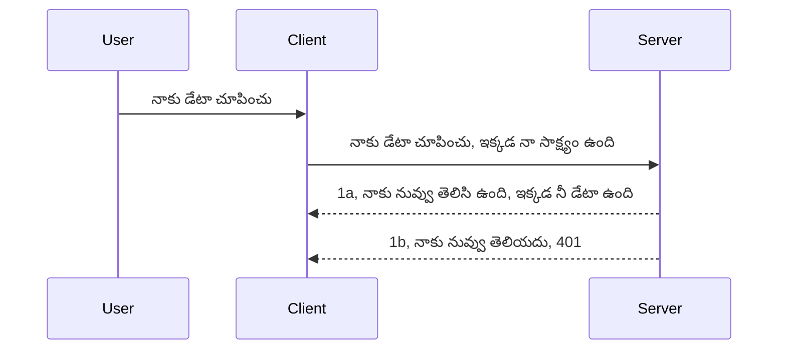

# సరళమైన ath

MCP SDKలు OAuth 2.1ని ఉపయోగించడాన్ని మద్దతు ఇస్తాయి, ఇది నిజంగా auth సర్వర్, resource సర్వర్, క్రెడెన్షియల్స్ పోస్ట్ చేయడం, కోడ్ పొందడం, ఆ కోడ్‌ను bearer టోకెన్‌కు మార్పిడి చేయడం వంటి సూత్రాలను కలిగిన ఒక సంక్లిష్ట ప్రక్రియ. మీరు OAuthకి అలవాటైనవారు కాకపోతే, ఇది అమలు చేయడానికి గొప్ప విషయం అయినప్పటికీ, మూల స్ధాయిలో కొంత authతో ప్రారంభించి మెరుగైన భద్రత వైపు పెరుగుతున్నది మంచి ఆలోచన. అప్పుడు ఈ అధ్యాయం ఉద్దేశ్యం, మీకు మరింత అభివృద్ధి یافته authకు సహాయం చేయడం.

## Auth అంటే ఏమిటి?

Auth అనేది authentication మరియు authorization కు సంక్షిప్త రూపం. ఉద్దేశ్యం రెండు విషయాలు చేయాల్సిన అవసరం ఉంది:

- **Authentication**, అంటే మన దగ్గరికి ఎవరికీ మన ఇల్లు వచ్చే అనుమతి ఇవ్వాలి, వారు "ఇక్కడ" ఉండటానికి హక్కును కలిగి ఉన్నారా అని తెలుసుకోవడం, అంటే మన MCP సర్వర్ ఫీచర్లు ఉన్న resource సర్వర్‌కు యాక్సెస్ కలిగి ఉన్నారా అని నిర్ధారించడం.
- **Authorization**, అనేది వాడుకరికి వారు కోరుకున్న ఈ ప్రత్యేక వనరులకు యాక్సెస్ ఉండాలి లేదా లేదో తెలుసుకోవడం, ఉదాహరణకు ఈ ఆర్డర్‌లు లేదా ఈ ఉత్పత్తులు లేదా వారు కంటెంట్ చదవగలరా కానీ తొలగించకూడదని లాగుండా లేదో.

## క్రెడెన్షియల్స్: మనం సిస్టమ్‌కు ఎవరిని అనే చెప్పడం

చాలామంది వెబ్ డెవలపర్లు సర్వర్ కు క్రెడెన్షియల్ ఇవ్వాలని ఆలోచిస్తారు, సాధారణంగా ఇది వారి ఇక్కడ ఉండడానికి అనుమతిస్తున్నదని చూపించే ఒక సీక్రెట్ "Authentication". ఈ క్రెడెన్షియల్ సాధారణంగా username మరియు password యొక్క base64 కైన కోడ్ లేదా ఒక API కీ ఉంటుంది, ఇది ఒక ప్రత్యేక వాడుకరిని గుర్తిస్తుంది.

దీనిని "Authorization" అనే హెడర్ ద్వారా ఇలా పంపిస్తారు:

```json
{ "Authorization": "secret123" }
```

దీనిని సాధారణంగా basic authentication అంటారు. మొత్తం ప్రవాహం ఎలా పని చేస్తుందో ఇలా ఉంటుంది:


```mermaid
sequenceDiagram
   participant User
   participant Client
   participant Server

   User->>Client: నాకు డేటా చూపించు
   Client->>Server: నాకు డేటా చూపించు, ఇక్కడ నా సాక్ష్యం ఉంది
   Server-->>Client: 1a, నాకు నువ్వు తెలిసి ఉంది, ఇక్కడ నీ డేటా ఉంది
   Server-->>Client: 1b, నాకు నువ్వు తెలియదు, 401 
```

ఇప్పుడు ప్రవాహం నుండి ఇది ఎలా పని చేస్తుందో అర్థం చేసుకున్నారంటే, దీన్ని ఎలా అమలు చేయాలి? చాలా వెబ్ సర్వర్లకు middleware అనే కాన్సెప్ట్ ఉంటుంది, ఇది ఒక కోడ్ భాగం, ఇది రిక్వెస్ట్ భాగంగా నడుస్తుంది, క్రెడెన్షియల్స్ సరిచూసుకుని, అవి సరైనవైతే రిక్వెస్ట్ పాస్ చేయవచ్చు. రిక్వెస్ట్ వద్ద సరైన క్రెడెన్షియల్స్ లేకపోతే auth తప్పిదం వస్తుంది. ఇది ఎలా అమలు చేయవచ్చో చూద్దాం:

**Python**

```python
class AuthMiddleware(BaseHTTPMiddleware):
    async def dispatch(self, request, call_next):

        has_header = request.headers.get("Authorization")
        if not has_header:
            print("-> Missing Authorization header!")
            return Response(status_code=401, content="Unauthorized")

        if not valid_token(has_header):
            print("-> Invalid token!")
            return Response(status_code=403, content="Forbidden")

        print("Valid token, proceeding...")
       
        response = await call_next(request)
        # ఏదైనా కస్టమర్ హెడర్లు జోడించండి లేదా ప్రతిస్పందనలో ఏదైనా మార్పు చేయండి
        return response


starlette_app.add_middleware(CustomHeaderMiddleware)
```

ఇక్కడ ఉంది:

- `AuthMiddleware` అనే middleware ని తయారు చేసాము, దీని `dispatch` మెతడ్ సర్వర్ ద్వారా పిలవబడుతుంది.
- ఆ middlewareని సర్వర్‌లో జోడించాము:

    ```python
    starlette_app.add_middleware(AuthMiddleware)
    ```

- Authorization హెడర్ ఉన్నదో లేదో, పంపబడిన సీక్రెట్ సరైనదో లేదో నిర్ధారించే validation లాజిక్ రాసాము:

    ```python
    has_header = request.headers.get("Authorization")
    if not has_header:
        print("-> Missing Authorization header!")
        return Response(status_code=401, content="Unauthorized")

    if not valid_token(has_header):
        print("-> Invalid token!")
        return Response(status_code=403, content="Forbidden")
    ```

    సీక్రెట్ ఉంటే మరియు సరైనదైతే, `call_next` పిలిచే ద్వారా రిక్వెస్ట్ పాస్ చేయించి ప్రతిస్పందనను తిరిగి ఇస్తాము.

    ```python
    response = await call_next(request)
    # ఎలాంటి కస్టమర్ హెడర్లు జోడించండి లేదా రిస్పాన్స్‌లో ఏదైనా మార్పు చేయండి
    return response
    ```

ఇది ఎలా పని చేస్తుందంటే, ఒక వెబ్ రిక్వెస్ట్ సర్వర్ వైపు పంపితే middleware పిలవబడుతుంది మరియు అమలు ప్రకారం రిక్వెస్ట్ పాస్ చేయవచ్చు లేదా క్లయింట్ కి ప్రొసీడు చేయడానికి అనుమతి లేదని తప్పిదాన్ని ఇస్తుంది.

**TypeScript**

ఇక్కడ మేము పాపులర్ ఫ్రేమ్‌వర్క్ Expressతో middleware తయారు చేసి MCP సర్వర్ కు రిక్వెస్ట్ చేరే ముందు దాన్ని ఇన్తర్సెప్టు చేస్తున్నాము. కోడ్ ఇది:

```typescript
function isValid(secret) {
    return secret === "secret123";
}

app.use((req, res, next) => {
    // 1. అనుమతి హెడర్ ఉందా?
    if(!req.headers["Authorization"]) {
        res.status(401).send('Unauthorized');
    }
    
    let token = req.headers["Authorization"];

    // 2. సరైనదిని తనిఖీ చేయండి.
    if(!isValid(token)) {
        res.status(403).send('Forbidden');
    }

   
    console.log('Middleware executed');
    // 3. అభ్యర్థనను అభ్యర్థన పైప్లైన్‌లో తదుపరి దశకు పంపండి.
    next();
});
```

ఈ కోడ్ లో మేము:

1. మొట్టమొదట Authorization హెడర్ ఉన్నదో లేదో తడవటం, లేకుంటే 401 తప్పిదం పంపడం.
2. క్రెడెన్షియల్/టోకెన్ సరైనదో లేదో నిర్ధారించడం, లేకుంటే 403 తప్పిదం పంపడం.
3. చివరగా రిక్వెస్ట్ రిక్వెస్ట్ పైప్‌లైన్‌లో పాస్ చేసి అడిగిన వనరును తిరిగి ఇవ్వడం.

## వ్యాయామం: authenticationని అమలు చేయండి


మన సమాచారం తీసుకుని దాన్ని అమలు చేయడానికి ప్రయత్నిద్దాం. ఇక్కడ ప్లాన్ ఉంది:

సర్వర్

- వెబ్ సర్వర్ మరియు MCP ఇన్‌స్టాన్స్‌ని సృష్టించండి.
- సర్వర్ కోసం మిడిల్వేర్‌ను అమలు చేయండి.

క్లయింట్

- ప్రచారం ద్వారా క్రెడెన్షియల్‌తో వెబ్ అభ్యర్థనను పంపండి.

### -1- వెబ్ సర్వర్ మరియు MCP ఇన్‌స్టాన్స్‌ని సృష్టించండి

> [!WARNING]
> క్రింద TypeScript ఉదాహరణ MCP `2025-11-25` లక్ష్యం. ఇది ట్రాన్స్‌పోర్ట్స్‌ని
> `mcp-session-id` ద్వారా ట్రాక్ చేస్తుంది మరియు ఇది ప్రస్తుత `2026-07-28` ట్రాన్స్‌పోర్ట్ ఉదాహరణ కాదు. MCP
> `2026-07-28` `initialize` హ్యాండ్షేక్ మరియు ప్రోటోకాల్ సెషన్ ID తీసివేస్తుంది; కొత్త
> అమలు స్వీయ-పరిపూరక అభ్యర్థనలను ఉపయోగిస్తాయి. చూడండి
> [MCPలో మార్పులు: 2026-07-28 స్పెసిఫికేషన్](../../01-CoreConcepts/mcp-2026-07-28.md).

మన మొదటి దశలో, మనం వెబ్ సర్వర్ ఇన్‌స్టాన్స్ మరియు MCP సర్వర్‌ను సృష్టించాలి.

**Python**

ఇక్కడ మనం MCP సర్వర్ ఇన్‌స్టాన్స్‌ను సృష్టించుకుంటాము, starlette వెబ్ ఆಪ್ రూపొందించి దాన్ని uvicorn తో హోస్ట్ చేస్తాము.

```python
# MCP సర్వర్‌ను సృష్టించడం

app = FastMCP(
    name="MCP Resource Server",
    instructions="Resource Server that validates tokens via Authorization Server introspection",
    host=settings["host"],
    port=settings["port"],
    debug=True
)

# starlette వెబ్ యాప్‌ను సృష్టించడం
starlette_app = app.streamable_http_app()

# uvicorn ద్వారా యాప్‌ను సేవ్ చేయడం
async def run(starlette_app):
    import uvicorn
    config = uvicorn.Config(
            starlette_app,
            host=app.settings.host,
            port=app.settings.port,
            log_level=app.settings.log_level.lower(),
        )
    server = uvicorn.Server(config)
    await server.serve()

run(starlette_app)
```

ఈ కోడ్‌లో మనం:

- MCP సర్వర్ సృష్టించు.
- MCP సర్వర్ నుంచి starlette వెబ్ ఆప్ నిర్మించు, `app.streamable_http_app()`.
- uvicorn ద్వారా వెబ్ ఆప్‌ను హోస్ట్ చేసి సర్వ్ చేయి `server.serve()`.

**TypeScript**

ఇక్కడ మనం MCP సర్వర్ ఇన్‌స్టాన్స్‌ను సృష్టిస్తాము.

```typescript
const server = new McpServer({
      name: "example-server",
      version: "1.0.0"
    });

    // ... సర్వర్ వనరులు, సాధనాలు, మరియు ప్రాంప్ట్‌లను సജ్జం చేయండి ...
```

ఈ MCP సర్వర్ సృష్టి మన POST /mcp రూట్ నిర్వచనంలో జరగాలి, కాబట్టి పై కోడ్ తీసుకుని ఇలా మార్చుకుందాం:

```typescript
import express from "express";
import { randomUUID } from "node:crypto";
import { McpServer } from "@modelcontextprotocol/sdk/server/mcp.js";
import { StreamableHTTPServerTransport } from "@modelcontextprotocol/sdk/server/streamableHttp.js";
import { isInitializeRequest } from "@modelcontextprotocol/sdk/types.js"

const app = express();
app.use(express.json());

// సెషన్ ID ద్వారా ట్రాన్స్పోర్ట్‌లని నిల్వ చేయడానికి మ్యాప్
const transports: { [sessionId: string]: StreamableHTTPServerTransport } = {};

// క్లయింట్-టు-సర్వర్ కమ్యూనికేషన్ కోసం POST అభ్యర్థనలు నిర్వహించండి
app.post('/mcp', async (req, res) => {
  // ఉన్న సెషన్ ID తనిఖీ చేయండి
  const sessionId = req.headers['mcp-session-id'] as string | undefined;
  let transport: StreamableHTTPServerTransport;

  if (sessionId && transports[sessionId]) {
    // ఉన్న ట్రాన్స్పోర్ట్‌ను మళ్లీ ఉపయోగించండి
    transport = transports[sessionId];
  } else if (!sessionId && isInitializeRequest(req.body)) {
    // కొత్త ప్రారంభ అభ్యర్థన
    transport = new StreamableHTTPServerTransport({
      sessionIdGenerator: () => randomUUID(),
      onsessioninitialized: (sessionId) => {
        // సెషన్ ID ద్వారా ట్రాన్స్పోర్ట్ నిల్వ చేయండి
        transports[sessionId] = transport;
      },
      // DNS రీబైండింగ్ రక్షణ డిఫాల్ట్ గా పూర్వ అనుకూలత కోసం నిలిపివేశారు. మీరు ఈ సర్వర్‌ను
      // లోకల్ గా నడుపుతున్నట్లయితే, ఖచ్చితంగా పాటించండి:
      // enableDnsRebindingProtection: true,
      // allowedHosts: ['127.0.0.1'],
    });

    // ట్రాన్స్పోర్ట్ మూసివేసినప్పుడు శుభ్రపరిచండి
    transport.onclose = () => {
      if (transport.sessionId) {
        delete transports[transport.sessionId];
      }
    };
    const server = new McpServer({
      name: "example-server",
      version: "1.0.0"
    });

    // ... సర్వర్ వనరులు, టూల్స్ మరియు ప్రాంప్ట్లు సెట్ చేయండి ...

    // MCP సర్వర్‌తో కనెక్ట్ అవ్వండి
    await server.connect(transport);
  } else {
    // చెల్లని అభ్యర్థన
    res.status(400).json({
      jsonrpc: '2.0',
      error: {
        code: -32000,
        message: 'Bad Request: No valid session ID provided',
      },
      id: null,
    });
    return;
  }

  // అభ్యర్థనను నిర్వహించండి
  await transport.handleRequest(req, res, req.body);
});

// GET మరియు DELETE అభ్యర్థనల కోసం పునర్వినియోగ యోగ్యమైన హ్యాండ్లర్
const handleSessionRequest = async (req: express.Request, res: express.Response) => {
  const sessionId = req.headers['mcp-session-id'] as string | undefined;
  if (!sessionId || !transports[sessionId]) {
    res.status(400).send('Invalid or missing session ID');
    return;
  }
  
  const transport = transports[sessionId];
  await transport.handleRequest(req, res);
};

// SSE ద్వారా సర్వర్-టు-క్లయింట్notifications కోసం GET అభ్యర్థనలను నిర్వహించండి
app.get('/mcp', handleSessionRequest);

// సెషన్ ముగింపు కోసం DELETE అభ్యర్థనలు నిర్వహించండి
app.delete('/mcp', handleSessionRequest);

app.listen(3000);
```

ఇప్పుడు మీరు ఎలా MCP సర్వర్ సృష్టి `app.post("/mcp")` లోకి moved అయ్యిందో చూడొచ్చు.

ఇప్పుడు ఆ తరువాత మెటిల్వేర్ సృష్టించే దశవైపు వెళ్ళుదాం అంటే వచ్చిన క్రెడెన్షియల్‌ను చెల్లుబాటు చెయ్యడానికి.

### -2- సర్వర్ కోసం మెటిల్వేర్ ని అమలు చేయండి

మరి ఇప్పుడు మెటిల్వేర్ భాగానికి వస్తాం. ఇక్కడ మనం ఒక మెటిల్వేర్ సృష్టిస్తాము, ఇది `Authorization` హెడ్డర్‌లో క్రెడెన్షియల్ కోసం చూస్తుంది మరియు దాన్ని ధృవీకరిస్తుంది. అది అంగీకారమైతే, అభ్యర్థన అవసరమైనది చేయటానికి ముందుకు పోతుంది (ఉదాహరణకు టూల్స్ జాబితా చెయ్యడం, వనరులను చదవడం లేదా క్లయింట్ అడిగిన MCP ఫంక్షనాలిటీ).

**Python**

మెటిల్వేర్ సృష్టించడానికి, మనకు `BaseHTTPMiddleware` నుండి వారసత్వం పొందిన ఒక క్లాస్ సృష్టించాలి. రెండు ఆసక్తికరమైన భాగాలు ఉన్నాయి:

- అధికారం `request` , మనం హెడ్డర్ సమాచారం చదువుతాము.
- `call_next` కాల్‌బ్యాక్ మనం ఆహ్వానించవలసినదిగా క్లయింట్ సరైన క్రెడెన్షియల్ తీసుకువచ్చినప్పుడు.

ముందుగా, `Authorization` హెడ్డర్ లేకపోతే ఏమౌతుందో చూద్దాం:

```python
has_header = request.headers.get("Authorization")

# హెడ్డర్ లేరు, 401 తో విఫలమవుతూ, లేకపోతే ముందుకు వెళ్లండి.
if not has_header:
    print("-> Missing Authorization header!")
    return Response(status_code=401, content="Unauthorized")
```

ఇక్కడ మనం 401 అనఆధికారిత సందేశం పంపుతాము, ఎందుకంటే క్లయింట్ సర్టిఫికేషన్ విఫలంగా ఉంది.

తరువాత, క్రెడెన్షియల్ అన్‌ప్ చేస్తే, దాని చెల్లింపు ని ఇలా తనిఖీ చేయాలి:

```python
 if not valid_token(has_header):
    print("-> Invalid token!")
    return Response(status_code=403, content="Forbidden")
```

పైగా 403 నిషేధిత సందేశం పంపుతామనే గమనించండి. ఇప్పుడు పూర్తిగా క్రింద ఉన్న మెటిల్వేర్ చూద్దాం, మనం చెప్పిన వాటన్నింటిని అమలు చేస్తూ:

```python
class AuthMiddleware(BaseHTTPMiddleware):
    async def dispatch(self, request, call_next):

        has_header = request.headers.get("Authorization")
        if not has_header:
            print("-> Missing Authorization header!")
            return Response(status_code=401, content="Unauthorized")

        if not valid_token(has_header):
            print("-> Invalid token!")
            return Response(status_code=403, content="Forbidden")

        print("Valid token, proceeding...")
        print(f"-> Received {request.method} {request.url}")
        response = await call_next(request)
        response.headers['Custom'] = 'Example'
        return response

```

బాగుంది, కానీ `valid_token` ఫంక్షన్ ఏమిటి? దీన్ని క్రింద చూడండి:

```python
# ఉత్పత్తి కోసం ఉపయోగించవద్దు - దీనిని మెరుగుపరుచుకోండి !!
def valid_token(token: str) -> bool:
    # "Bearer " ఉపసర్గ తీసివేయండి
    if token.startswith("Bearer "):
        token = token[7:]
        return token == "secret-token"
    return False
```

ఇది స్పష్టంగా మెరుగుపరచాలి.

IMPORTANT: ఇలాంటి రహస్యాలను కోడ్‌లో ఎప్పుడూ ఉంచకూడదు. మీరు ఇదిగో పోల్చే విలువ డేటా సోర్స్ నుండి లేదా IDP (గుర్తింపు సేవా ప్రదాత) నుండి పొందడం ఉత్తమం, లేదా అమెలు తనిఖీ చేయడమేది IDPకి నిచ్చేయండి.

**TypeScript**


దీన్ని Express తో అమలు చేయడానికి, మేము మిడిల్‌వేర్ ఫంక్షన్‌లను తీసుకునే `use` పద్ధతిని పిలవాల్సి ఉంటుంది.


మనం చేయాల్సింది:

- `Authorization` ప్రాపర్టీలో పంపిన క్రెడెన్షియల్‌ను తనిఖీ చేయడానికి రిక్వెస్ట్ వేరియబుల్‌తో ఇంటరాక్ట్ చేయాలి.
- క్రెడెన్షియల్‌ను వాలిడేట్ చేయండి, మరియు సరైనట్లైతే రిక్వెస్ట్ కొనసాగించడానికి మరియు క్లయింట్ యొక్క MCP రిక్వెస్ట్ తగిన విధంగా (ఉదా: టూల్స్ జాబితాను పొందడం, రిసోర్సును చదవడం లేదా MCP కు సంబంధించిన ఇతర పనులు) చేయడానికి అనుమతించండి.

ఇక్కడ, `Authorization` హెడ్డర్ ఉందో లేదో చెక్ చేస్తున్నాం, లేకపోతే రిక్వెస్ట్ పోవడాన్ని ఆపివేస్తున్నాం:

```typescript
if(!req.headers["authorization"]) {
    res.status(401).send('Unauthorized');
    return;
}
```

మొదటిసారి హెడ్డర్ పంపకపోతే, మీరు 401ను పొందుతారు.

తరువాత, క్రెడెన్షియల్ చెల్లదు అయితే రిక్వెస్ట్ ఆపివేయడం జరుగుతుంది, కాని కొంచెం భిన్నమైన సందేశంతో:

```typescript
if(!isValid(token)) {
    res.status(403).send('Forbidden');
    return;
} 
```

ఇప్పుడు మీరు 403 పొరపాటు వస్తుందని గమనించండి.

ఇక్కడ పూర్తి కోడ్ ఉందది:

```typescript
app.use((req, res, next) => {
    console.log('Request received:', req.method, req.url, req.headers);
    console.log('Headers:', req.headers["authorization"]);
    if(!req.headers["authorization"]) {
        res.status(401).send('Unauthorized');
        return;
    }
    
    let token = req.headers["authorization"];

    if(!isValid(token)) {
        res.status(403).send('Forbidden');
        return;
    }  

    console.log('Middleware executed');
    next();
});
```

వెబ్ సర్వర్‌ను మిడిల్వేర్ ఆమోదించటానికి సెటప్ చేశాం, ఇది క్లయింట్ పంపగల క్రెడెన్షియల్‌ను తనిఖీ చేస్తుంది. ఆ తర్వాత క్లయింట్ గురించి ఏమిటి?

### -3- హెడ్డర్ ద్వారా క్రిడెన్షియల్ తో వెబ్ రిక్వెస్ట్ పంపండి

క్లయింట్ హెడ్డర్ ద్వారా క్రెడెన్షియల్ పంపుతున్నాడని నిర్ధారించుకోవాలి. మేం MCP క్లయింట్ ఉపయోగించబోయే కాబట్టి, అది ఎలా చేయాలో తెలుసుకోవాలి.

**Python**

క్లయింట్ కోసం క్రింద చెప్పిన విధంగా క్రెడెన్షియల్‌తో హెడ్డర్ పంపాలి:

```python
# విలువను హార్డ్‌కోడ్ చేయకండి, కనీసం అవుట్‌విరామెంట్ వేరియబుల్‌లో లేదా మరింత సురక్షితమైన నిల్వలో ఉంచండి
token = "secret-token"

async with streamablehttp_client(
        url = f"http://localhost:{port}/mcp",
        headers = {"Authorization": f"Bearer {token}"}
    ) as (
        read_stream,
        write_stream,
        session_callback,
    ):
        async with ClientSession(
            read_stream,
            write_stream
        ) as session:
            await session.initialize()
      
            # చేయాల్సిన పని, క్లయింట్‌లో ఏమి చేయించాలనుకుంటున్నారో, ఉదా: టూల్స్‌ను జాబితా చేయడం, టూల్స్‌కు కాల్ చేయడం మొదలైనవి.
```

ఎలా `headers` ప్రాపర్టీని ఇలా population చేస్తున్నామో గమనించండి: ` headers = {"Authorization": f"Bearer {token}"}`.

**TypeScript**

దీన్ని రెండు దశలలో పరిష్కరించవచ్చు:

1. మన క్రెడెన్షియల్‌తో ఒక కాన్ఫిగరేషన్ ఆబ్జెక్ట్‌ను population చేయండి.
2. ఆ కాన్ఫిగరేషన్ ఆబ్జెక్ట్‌ను ట్రాన్స్‌పోర్ట్‌కు పంపండి.

```typescript

// ఇక్కడ చూపించినట్లుగా విలువను హార్డ్కోడ్ చేయకండి. కనీసం ఒక env వేరియబుల్‌గా ఉంచి, dev మోడ్‌లో dotenv వంటి ఏదైనా ఉపయోగించండి.
let token = "secret123"

// ఒక క్లీంట్ ట్రాన్స్‌పోర్ట్ ఆప్షన్ ఆబ్జెక్టును నిర్వచించండి
let options: StreamableHTTPClientTransportOptions = {
  sessionId: sessionId,
  requestInit: {
    headers: {
      "Authorization": "secret123"
    }
  }
};

// ఆప్షన్ ఆబ్జెక్టును ట్రాన్స్‌పోర్ట్‌కు పంపండి
async function main() {
   const transport = new StreamableHTTPClientTransport(
      new URL(serverUrl),
      options
   );
```

పై కోడ్‌లో `options` ఆబ్జెక్ట్ సృష్టించి, మన headers ను `requestInit` ప్రాపర్టీలో పెట్టిన విధానం చూడండి.

ముఖ్యమైనది: ఇక్కడి నుండి ఎలా మెరుగుపరచాలి? ప్రస్తుత అమలులో కొన్ని సమస్యలు ఉన్నాయి. మొదటగా, ఇలాంటి విధంగా క్రెడెన్షియల్ పంపడం చాలా రిస్కీ, కనీసం HTTPS ఉంటే మంచిది. అయినప్పటికీ, క్రెడెన్షియల్ దొంగిలించబడవచ్చు కాబట్టి టోకెన్‌ను రివోక్ చేసుకునే సిస్టమ్ ఉండాలి మరియు అదనపు తనిఖీలు అవసరం, ఉదా: ఇది ఎక్కడినుంచి వస్తుందో, రిక్వెస్ట్ బాగా తరచూ వస్తుందో లేదో (బాట్ వంటి ప్రవర్తన), ప్రాథమికంగా చాలా ఆందోళనలు ఉన్నాయి.

అయితే, చాలా సింపుల్ APIs కోసం మీరు ఒకరికీ మీ APIకి అనధికార ప్రవేశం ఇవ్వదలచుకోకుంటే ఇది మంచి మొదలూజేమై ఉంది.

అలా అనుకుంటే, JSON వెబ్ టోకెన్ (JWT లేదా "JOT" టోకెన్లు) వంటి ప్రామాణిక ఫార్మాట్ ఉపయోగించి సెక్యూరిటీను కొంచెం బలపర్చుకుందాం.

## JSON వెబ్ టోకెన్లు, JWT

కాబట్టి, సింపుల్ క్రెడెన్షియల్స్ పంపకుండా మెరుగుపరిచే ప్రయత్నం చేస్తున్నాం. JWTని అనుసరించడం వల్ల వెంటనే ఏమైన మెరుగుదలలు వస్తాయో చూద్దాం.

- **సెక్యూరిటీ మెరుగుదలలు**. బేసిక్ ఆథ్‌లో, మీరు యూజర్ నేమ్ మరియు పాస్వర్డ్‌ను base64 ఎంకోడ్ అయిన టోకెన్ (లేదా API కీ) రూపంలో సమర్పిస్తారు, ఇది పునరావృతం అవుతుంది, అటువంటి వాడుక ప్రమాదం పెంచుతుంది. JWTలో, మీరు యూజర్ నేమ్ మరియు పాస్వర్డ్ పంపించి టోకెన్ పొందుతారు ఇది టైమ్ బౌండెడ్ కూడా ఉంటుంది అంటే ఇది గడువు ముగిస్తాయి. JWT రోల్స్, స్కోప్స్ మరియు అనుమతులు ద్వారా ఫైన్-గ్రెయిన్డ్ యాక్సెస్ కంట్రోల్ చేయడానికి అనుకూలంగా ఉంటుంది.
- **స్టేట్ లెస్ మరియు స్కేలబిలిటీ**. JWTలు స్వీయ కంటెయిన్డ్, అవి మొత్తం యూజర్ సమాచారాన్ని కలిగి ఉంటాయి మరియు సర్వర్-సైడ్ సెషన్ నిల్వ అవసరాన్ని తొలగిస్తాయి. టోకెన్‌ను స్థానికంగా కూడా వెరిఫై చేయవచ్చు.
- **ఇంటరొపరబిలిటీ మరియు ఫెడరేషన్**. JWTలు Open ID Connectలోకైవ Mittelpunkt గా ఉంటాయి మరియు Entra ID, Google Identity మరియు Auth0 వంటి గుర్తింపు ప్రొవైడర్లతో ఉపయోగించబడతాయి. సింగిల్ సైన్ ఆన్ మరియు మరెన్నో తળుపులను జోడించడానికీ వీటిని సులభం చేస్తాయి, కనుక ఇవి ఎంటర్ప్రైజ్-గ్రేడ్.
- **మాడ్యులారిటీ మరియు ఫ్లెక్సిబిలిటీ**. JWTలు Azure API Management, NGINX వంటి API గేట్వేలతో కూడా ఉపయోగించవచ్చు. అవి యూజర్ ఆథెంటికేషన్ సన్నివేశాలు మరియు సర్వర్-టూ-సర్వీస్ కమ్యూనికేషన్ ప్రారంభకాలు, డెలిగేషన్ సన్నివేశాలనూ మద్దతు ఇస్తాయి.
- **పర్ఫార్మెన్స్ మరియు క్యాచింగ్**. JWT decoding తరువాత క్యాచ్ చేయబడవచ్చు, ఇది పార్సింగ్ అవసరాన్ని తగ్గిస్తుంది. ఇది అధిక ట్రాఫిక్ ఆప్స్ కోసం throughputని మెరుగుపరిచి, ఎంచుకున్న ఇన్‌ఫ్రాస్ట్రక్చర్‌పై లోడ్ తగ్గిస్తుంది.
- **అడ్వాన్స్డ్ ఫీచర్స్**. ఇది introspection(సర్వర్‌పై తనిఖీ) మరియు revocation(టోకెన్ చెలామణీని నిలిపివేయడం)కు మద్దతు ఇస్తుంది.

ఈ లాభాలతో, మన అమలును మరింత మెరుగుపరచడం ఎలా చేయాలో చూద్దాం.

## బేసిక్ ఆథ్‌ను JWTగా మార్చడం

అందువల్ల, మనం చేయాల్సిన పెద్ద మార్పులు:

- **JWT టోకెన్ నిర్మాణం నేర్చుకోవడం** మరియు క్లయింట్ నుండి సర్వర్‌కు పంపడానికి సిద్ధం చేయడం.
- **JWT టోకెన్ వాలిడేట్ చేయడం**, అవసరమైతే క్లయింట్‌కు మన రిసోర్సులు అందించడం.
- **సురక్షిత టోకెన్ నిల్వ**. ఈ టోకెన్‌ను ఎలా నిల్వ చేసుకుంటామో.
- **రూట్ల రక్షణ**. మనం రూట్లను రక్షించాలి, మన సందర్భంలో రూట్లు మరియు కొన్ని MCP ఫీచర్లను రక్షించాలి.
- **రిఫ్రెష్ టోకెన్లు జోడించడం**. తక్కువకాలం ఉండే టోకెన్లను సృష్టించడం, కానీ అవి గడువు తీరగా కొత్త టోకెన్లు పొందడానికి ఉపయోగించే పొడవు గడువు రిఫ్రెష్ టోకెన్లను కూడా ఇవ్వడం. Refresh ఎండ్‌పాయింట్ మరియు రొటేషన్ వ్యూహం కూడా ఉండాలి.

### -1- JWT టోకెన్ నిర్మాణం

మొదటిగా, JWT టోకెన్ క్రింది భాగాలు ఉంటాయి:

- **హెడర్**, అల్గోరిథం ఉపయోగించి, టోకెన్ రకము.
- **పేలోడ్**, క్లెయిమ్స్, ఉదా: sub (టోకెన్ సూచించే యూజర్ లేదా స్థలం. ఆథ్ సందర్భంలో ఇది సాధారణంగా యూజర్‌ఐడి), exp (గడువు తీరే సమయం), role (పాత్ర)
- **సంతకం**, రహస్యమైన లేదా ప్రైవేట్ కీతో సంతకం చేయబడింది.

దానికి, మనం హెడర్, పేలోడ్ మరియు ఎంకోడ్ చేయబడిన టోకెన్‌ని నిర్మించాలి.

**Python**

```python

import jwt
import jwt
from jwt.exceptions import ExpiredSignatureError, InvalidTokenError
import datetime

# JWT సంతకం చెయ్యడానికి ఉపయోగించే రహస్య కీ
secret_key = 'your-secret-key'

header = {
    "alg": "HS256",
    "typ": "JWT"
}

# యూజర్ సమాచారం మరియు దాని హక్కులు మరియు గడువు సమయం
payload = {
    "sub": "1234567890",               # విషయం (యూజర్ ID)
    "name": "User Userson",                # అనుకూల హక్కు
    "admin": True,                     # అనుకూల హక్కు
    "iat": datetime.datetime.utcnow(),# జారీ చేయబడిన సమయం
    "exp": datetime.datetime.utcnow() + datetime.timedelta(hours=1)  # గడువు
}

# దానిని సంకేతీకరించండి
encoded_jwt = jwt.encode(payload, secret_key, algorithm="HS256", headers=header)
```

పై కోడ్లో మనం:

- HS256 అల్గోరిథం గా మరియు టైప్ JWTగా హెడర్ నిర్వచించాము.
- సబ్జెక్ట్ లేదా యూజర్ ఐడి, యూజర్ పేరు, పాత్ర, ఎప్పుడు జారీ అయిందో, ఎప్పుడు గడువు ముగుస్తుందో ఉండే పేలోడ్ నిర్మించాము, ఇది మనం ముందుగా చెప్పిన టైమ్ బౌండ్ అంశాన్ని అమలు చేస్తుంది.

**TypeScript**

ఇక్కడ JWT టోకెన్ ఆకృతి కోసం సహాయం చేసే కొన్ని డిపెండెన్సీల అవసరం ఉంటుంది.

డిపెండెన్సీలు

```sh

npm install jsonwebtoken
npm install --save-dev @types/jsonwebtoken
```

ఆ తర్వాత, మనం హెడర్, పేలోడ్ సృష్టించి దాని ద్వారా ఎంకోడ్ చేసిన టోకెన్ తయారుచేయాలి.

```typescript
import jwt from 'jsonwebtoken';

const secretKey = 'your-secret-key'; // ఉత్పత్తిలో env vars ను ఉపయోగించండి

// లోడును నిర్వచించండి
const payload = {
  sub: '1234567890',
  name: 'User usersson',
  admin: true,
  iat: Math.floor(Date.now() / 1000), // విడుదల సమయం
  exp: Math.floor(Date.now() / 1000) + 60 * 60 // 1 గంటలో ముగియును
};

// హెడర్ ను నిర్వచించండి (ऐच्छికం, jsonwebtoken డిఫాల్ట్ లను సెట్చేస్తుంది)
const header = {
  alg: 'HS256',
  typ: 'JWT'
};

// టోకెన్ సృష్టించు
const token = jwt.sign(payload, secretKey, {
  algorithm: 'HS256',
  header: header
});

console.log('JWT:', token);
```

ఈ టోకెన్:

HS256తో సంతకం చేయబడింది
1 గంట చెలామణీకి సరి
sub, name, admin, iat మరియు exp వంటి క్లెయిమ్స్‌ను కలిగి ఉంది.

### -2- టోకెన్‌ను వాలిడేట్ చేయడం

టోకెన్ వాలిడేట్ చేయాల్సి ఉంటుంది, ఇది సర్వర్‌పై చేయాల్సిన పని, దాంతో క్లయింట్ పంపుతున్నది నిజంగానే చెల్లుబాటు అయ్యిందేమో తనిఖీ చేయవచ్చు. నిర్మాణం నుండి వాలిడిటీ వరకు అనేక తనిఖీలు చేయవచ్చు. యూజర్ మీ సిస్టంలో ఉన్నాడో లేదో చూడటానికి మరిన్ని చెక్‌లు జోడించవచ్చు.

టోకెన్ వాలిడేషన్ కోసం, decode చేసి చదివి, తదుపరి వాలిడిటీ తనిఖీ చేయాలి:

**Python**

```python

# JWTని డీకోడ్ చేసి ధృవీకరించండి
try:
    decoded = jwt.decode(token, secret_key, algorithms=["HS256"])
    print("✅ Token is valid.")
    print("Decoded claims:")
    for key, value in decoded.items():
        print(f"  {key}: {value}")
except ExpiredSignatureError:
    print("❌ Token has expired.")
except InvalidTokenError as e:
    print(f"❌ Invalid token: {e}")

```


ఈ కోడులో, మేము టోకెన్, సీక్రెట్ కీ మరియు ఎంచుకున్న ఆల్గోరిథమ్‌ను ఇన్పుట్‌గా ఉపయోగించి `jwt.decode` ను పిలుస్తున్నాము. ఒక వైఫల్యац్చిన ధృవీకరణ లోపం ఒక పొరపాటు ఏర్పడినప్పుడు ట్రై-క్యాచ్ నిర్మాణాన్ని ఎలా ఉపయోగిస్తున్నామో గమనించండి.

**TypeScript**

ఇక్కడ మాకు టోకెన్ డికోడ్ చేసిన వెర్షన్ పొందడానికి `jwt.verify` పిలవాలి, దీన్ని మరింత విశ్లేషించవచ్చు. ఈ కాల్ విఫలమైతే, టోకెన్ యొక్క నిర్మాణం తప్పు లేదా ఇది ఇకపై చెల్లుబాటు కానిది అని అర్థం.

```typescript

try {
  const decoded = jwt.verify(token, secretKey);
  console.log('Decoded Payload:', decoded);
} catch (err) {
  console.error('Token verification failed:', err);
}
```

గమనిక: ముందుగా చెప్పినట్లు, ఈ టోకెన్ మన సిస్టమ్‌లోని యూజర్‌ను సూచిస్తున్నదా మరియు యూజర్ తన హక్కులను కలిగి ఉన్నాడా అని నిర్ధారించడానికి అదనపు తనిఖీలు నిర్వహించాలి.

తరువాత, రోల్ ఆధారిత అనుమతి నియంత్రణ (RBAC)ని పరిశీలిద్దాం.

## రోల్ ఆధారిత అనుమతి నియంత్రణను జోడించడం

వాదన ఏమిటంటే, వేర్వేరు పాత్రలకు వేర్వేరు అనుమతులు ఉంటాయని తెలియజేయాలనుకున్నాం. ఉదాహరణకు, అడ్మిన్ అన్ని పనులు చేయగలడు, సాధారణ యూజర్ చదవడం/వ్రాయడం చేయగలడు మరియు గెస్ట్ మాత్రమే చదవగలడు. కనుక, ఇక్కడ కొన్ని అనుమతుల స్థాయిలు ఉన్నాయి:

- Admin.Write 
- User.Read
- Guest.Read

మిడిల్‌వేర్ ద్వారా ఇలాంటి నియంత్రణను ఎలా అమలు చేయవచ్చో చూద్దాం. రూట్(ల)కు మరియు అన్ని రూట్(ల)కు మిడిల్‌వేర్ ను జోడించవచ్చు.

**Python**

```python
from starlette.middleware.base import BaseHTTPMiddleware
from starlette.responses import JSONResponse
import jwt

# రహస్యం కోడ్లో ఉండకూడదు, ఇది కేవలం డెమో కోసం మాత్రమే. దయచేసి దానిని సురక్షిత స్థలం నుండి చదవండి.
SECRET_KEY = "your-secret-key" # దీన్ని env వేరియబుల్‌లో ఉంచండి
REQUIRED_PERMISSION = "User.Read"

class JWTPermissionMiddleware(BaseHTTPMiddleware):
    async def dispatch(self, request, call_next):
        auth_header = request.headers.get("Authorization")
        if not auth_header or not auth_header.startswith("Bearer "):
            return JSONResponse({"error": "Missing or invalid Authorization header"}, status_code=401)

        token = auth_header.split(" ")[1]
        try:
            decoded = jwt.decode(token, SECRET_KEY, algorithms=["HS256"])
        except jwt.ExpiredSignatureError:
            return JSONResponse({"error": "Token expired"}, status_code=401)
        except jwt.InvalidTokenError:
            return JSONResponse({"error": "Invalid token"}, status_code=401)

        permissions = decoded.get("permissions", [])
        if REQUIRED_PERMISSION not in permissions:
            return JSONResponse({"error": "Permission denied"}, status_code=403)

        request.state.user = decoded
        return await call_next(request)


```

దిగువ ఉన్నట్లు మిడిల్‌వేర్ జోడించడానికి కొన్ని విభిన్న మార్గాలు ఉన్నాయి:

```python

# ప్రత్యామ్నాయం 1: స్టార్లెట్ అనువర్తనం నిర్మిస్తున్నప్పుడు మిడిల్‌వేర్‌ని జోడించండి
middleware = [
    Middleware(JWTPermissionMiddleware)
]

app = Starlette(routes=routes, middleware=middleware)

# ప్రత్యామ్నాయం 2: స్టార్లెట్ అనువర్తనం ఇప్పటికే నిర్మించబడిన తర్వాత మిడిల్‌వేర్‌ని జోడించండి
starlette_app.add_middleware(JWTPermissionMiddleware)

# ప్రత్యామ్నాయం 3: మార్గం కు ఒక్కోసారి మిడిల్‌వేర్‌ని జోడించండి
routes = [
    Route(
        "/mcp",
        endpoint=..., # హ్యాండ్లర్
        middleware=[Middleware(JWTPermissionMiddleware)]
    )
]
```

**TypeScript**

మేము `app.use` మరియు అన్ని అభ్యర్థనల కోసం నిర్వహించే మిడిల్‌వేర్ ను ఉపయోగించవచ్చు.

```typescript
app.use((req, res, next) => {
    console.log('Request received:', req.method, req.url, req.headers);
    console.log('Headers:', req.headers["authorization"]);

    // 1. అథారైజేషన్ హెడర్ పంపబడింది లేదా లేదో తనిఖీ చేయండి

    if(!req.headers["authorization"]) {
        res.status(401).send('Unauthorized');
        return;
    }
    
    let token = req.headers["authorization"];

    // 2. టోకెన్ చెల్లుబాటు అవుతుందో లేదో తనిఖీ చేయండి
    if(!isValid(token)) {
        res.status(403).send('Forbidden');
        return;
    }  

    // 3. టోకెన్ వినియోగదారు మన సిస్టంలో ఉందా అని తనిఖీ చేయండి
    if(!isExistingUser(token)) {
        res.status(403).send('Forbidden');
        console.log("User does not exist");
        return;
    }
    console.log("User exists");

    // 4. టోకెన్ సరైన అనుమతులు కలిగి ఉన్నాయా అని ధృవీకరించండి
    if(!hasScopes(token, ["User.Read"])){
        res.status(403).send('Forbidden - insufficient scopes');
    }

    console.log("User has required scopes");

    console.log('Middleware executed');
    next();
});

```

మిడిల్‌వేర్ మా చేయగల మరియు చేయాల్సిన ముఖ్యమైన కొన్ని పనులు ఉన్నాయి, అవి:

1. అధికారం హెడ్డర్ ఉన్నదో లేదో చూడటం
2. టోకెన్ చెల్లుబాటు వున్నదో లేదో చూడటం, దీనికోసం మనం రాసిన `isValid` పద్ధతిని పిలుస్తాము, ఇది JWT టోకెన్ యొక్క సమగ్రత మరియు చెల్లుబాటు వుండటం తనిఖీ చేస్తుంది.
3. యూజర్ మన సిస్టమ్‌లో ఉన్నాడేమో చూడండి, ఇది తనిఖీ చేయాలి.

   ```typescript
    // డేటాబేస్‌లో ఉన్న యూజర్లు
   const users = [
     "user1",
     "User usersson",
   ]

   function isExistingUser(token) {
     let decodedToken = verifyToken(token);

     // చేయవలసినది, యూజర్ డేటాబేస్‌లో ఉందో చూడండి
     return users.includes(decodedToken?.name || "");
   }
   ```

   పైగా, మేము ఒక చాలా సరళమైన `users` జాబితాను సృష్టించాము, ఇది స్పష్టంగా డేటాబేస్‌లో ఉండాలి.

4. అదనంగా, టోకెన్ సరైన అనుమతులు కలిగి ఉందో చూడాలి.

   ```typescript
   if(!hasScopes(token, ["User.Read"])){
        res.status(403).send('Forbidden - insufficient scopes');
   }
   ```

   పై మిడిల్‌వేర్ కోడులో, టోకెన్‌లో User.Read అనుమతి ఉందో లేదో మేము తనిఖీ చేస్తాము, లేకపోతే 403 పొరపాటు పంపుతాము. క్రింద `hasScopes` సహాయక పద్ధతి ఉంది.

   ```typescript
   function hasScopes(scope: string, requiredScopes: string[]) {
     let decodedToken = verifyToken(scope);
    return requiredScopes.every(scope => decodedToken?.scopes.includes(scope));
  }
   ```

Have a think which additional checks you should be doing, but these are the absolute minimum of checks you should be doing.

Using Express as a web framework is a common choice. There are helpers library when you use JWT so you can write less code.

- `express-jwt`, helper library that provides a middleware that helps decode your token.
- `express-jwt-permissions`, this provides a middleware `guard` that helps check if a certain permission is on the token.

Here's what these libraries can look like when used:

```typescript
const express = require('express');
const jwt = require('express-jwt');
const guard = require('express-jwt-permissions')();

const app = express();
const secretKey = 'your-secret-key'; // put this in env variable

// Decode JWT and attach to req.user
app.use(jwt({ secret: secretKey, algorithms: ['HS256'] }));

// Check for User.Read permission
app.use(guard.check('User.Read'));

// multiple permissions
// app.use(guard.check(['User.Read', 'Admin.Access']));

app.get('/protected', (req, res) => {
  res.json({ message: `Welcome ${req.user.name}` });
});

// Error handler
app.use((err, req, res, next) => {
  if (err.code === 'permission_denied') {
    return res.status(403).send('Forbidden');
  }
  next(err);
});

```

మీరు ఇప్పుడు మిడిల్‌వేర్ ఎలా ప్రామాణీకరణ మరియు అధికారం కోసం ఉపయోగించవచ్చో చూశారు, అయితే MCP విషయంలో ఏమిటి? auth ఎలా మారుతుందో చూద్దాం తదుపరి విభాగంలో.

### -3- MCPకి RBAC జోడించడం

ఇప్పటి వరకు మిడిల్‌వేర్ ద్వారా RBAC ఎలా జోడించవచ్చో మీరు చూశారు, అయితే MCPకి ఎలాంటి సులభమైన పద్ధతులు లేవు ఒక MCP ఫీచర్ కు అనుగుణంగా RBAC జోడించడానికి, కాబట్టి మనం ఏం చేయాలి? ఈ సందర్భంలో క్లయింట్‌కు నిర్దిష్ట టూల్ పిలవడానికి హక్కులు ఉన్నాయా అన్నది తనిఖీ చేసే ఈ కోడ్ ని జోడించాలి:

ప్రతి ఫీచర్ కు RBAC సాధించడానికి కొన్ని ఎంపికలు ఉన్నాయి, ఇవి కొన్ని:

- ప్రతి టూల్, వనరు, ప్రాంప్ట్ కోసం పరీక్ష జోడించండి అనుమతి స్థాయిని తనిఖీ చేయలిసినప్పుడు.

   **python**

   ```python
   @tool()
   def delete_product(id: int):
      try:
          check_permissions(role="Admin.Write", request)
      catch:
        pass # క్లయింట్ అధికారం నిర్దిష్టతలో విఫలమయ్యింది, అధికారం లోపం చూపించండి
   ```

   **typescript**

   ```typescript
   server.registerTool(
    "delete-product",
    {
      title: Delete a product",
      description: "Deletes a product",
      inputSchema: { id: z.number() }
    },
    async ({ id }) => {
      
      try {
        checkPermissions("Admin.Write", request);
        // చేయవలసినది, id ని productService కు మరియు remote entry కి పంపండి
      } catch(Exception e) {
        console.log("Authorization error, you're not allowed");  
      }

      return {
        content: [{ type: "text", text: `Deletected product with id ${id}` }]
      };
    }
   );
   ```


- అధునాతన సర్వర్ పద్ధతిని మరియు అభ్యర్థన హ్యాండ్లర్లను ఉపయోగించండి తద్వారా మీరు తనిఖీ మొదలైన వాటిని చేయాల్సిన చోట్లను తగ్గించవచ్చు.

   **Python**

   ```python
   
   tool_permission = {
      "create_product": ["User.Write", "Admin.Write"],
      "delete_product": ["Admin.Write"]
   }

   def has_permission(user_permissions, required_permissions) -> bool:
      # user_permissions: వినియోగదారుడికి ఉన్న అనుమతుల జాబితా
      # required_permissions: పరికరం కోసం అవసరమైన అనుమతుల జాబితా
      return any(perm in user_permissions for perm in required_permissions)

   @server.call_tool()
   async def handle_call_tool(
     name: str, arguments: dict[str, str] | None
   ) -> list[types.TextContent]:
    # request.user.permissions అనేది వినియోగదారుడి అనుమతుల జాబితా అని ఊహించండి
     user_permissions = request.user.permissions
     required_permissions = tool_permission.get(name, [])
     if not has_permission(user_permissions, required_permissions):
        # తప్పు ఏర్పడించండి "మీకు పరికరం {name} ను కాల్ చేయడానికి అనుమతి లేదు"
        raise Exception(f"You don't have permission to call tool {name}")
     # కొనసాగించండి మరియు పరికరాన్ని కాల్ చేయండి
     # ...
   ```   
   

   **TypeScript**

   ```typescript
   function hasPermission(userPermissions: string[], requiredPermissions: string[]): boolean {
       if (!Array.isArray(userPermissions) || !Array.isArray(requiredPermissions)) return false;
       // వినియోగదారుడు కనీసం ఒక అవసరమైన అనుమతి కలిగి ఉంటే సత్యాన్ని తిరిగి ఇవ్వండి
       
       return requiredPermissions.some(perm => userPermissions.includes(perm));
   }
  
   server.setRequestHandler(CallToolRequestSchema, async (request) => {
      const { params: { name } } = request;
  
      let permissions = request.user.permissions;
  
      if (!hasPermission(permissions, toolPermissions[name])) {
         return new Error(`You don't have permission to call ${name}`);
      }
  
      // కొనసాగించండి..
   });
   ```

   గమనిక, మీరు నిర్ధారించుకోవాల్సి ఉంటుంది మీ మిడిల్‌వేర్ డికోడ్ చేసిన టోకెన్ ను అభ్యర్థనలో user ప్రాపర్టీకి కేటాయించి, అప్పుడు పై కోడ్ సులభంగా తయారవుతుంది.

### సారాంశం

ఇప్పుడు మేము RBAC ఎలా సాధారణంగా మరియు MCP కోసం జోడించాలో చర్చించాం, మీరే సెక్యూరిటీ అమలు చేయడానికి ప్రయత్నించండి, మీరు మీరు అందించిన భావనలను అనుసరించి అర్థం చేసుకున్నారని నిర్ధారించుకోండి.

## అసైన్‌మెంట్ 1: మౌలిక ప్రామాణీకరణ ఉపయోగించి mcp సర్వర్ మరియు mcp క్లయింట్‌ను నిర్మించండి

ఇక్కడ మీరు హెడర్ల ద్వారా క్రెడెన్షియల్స్ పంపడం గురించి నేర్చుకున్నది ఉపయోగించనున్నారు.

## పరిష్కారం 1

[పరిష్కారం 1](./code/basic/README.md)

## అసైన్‌మెంట్ 2: అసైన్‌మెంట్ 1 నుండి పరిష్కారాన్ని JWT ఉపయోగించి మెరుగుపరచండి

మొదటి పరిష్కారాన్ని తీసుకోండి కానీ ఈసారి మెరుగుపరచుకుందాం.

బేసిక్ ఆథ్ ఉపయోగించకుండా JWT ఉపయోగిద్దాం.

## పరిష్కారం 2

[పరిష్కారం 2](./solution/jwt-solution/README.md)

## సవాలు

"MCPకి RBAC జోడించండి" విభాగంలో చెప్పినటువంటి RBAC ను ప్రతి టూల్ కు జోడించండి.

## సమారంభం

మీరు ఈ అధ్యాయంలో చాలా నేర్చుకున్నారని ఆశిస్తున్నాము, పూర్తి సెక్యూరిటీ లేని నుండి, మౌలిక సెక్యూరిటీ వరకు, JWT మరియు అది MCPలో ఎలా జోడించవచ్చో.

మనం అనుకూల JWTలతో బలమైన పునాదిని నిర్మించాము, కానీ విస్తరించేటప్పుడు, మేము ప్రమాణాల ఆధారిత ఐడెంటిటీ మోడల్ వైపు కదులుతున్నాము. Entra లేదా Keycloak వంటి IdPని స్వీకరించడం ద్వారా, మేం టోకెన్ జారీ, ధృవీకరణ, మరియు జీవిత చక్ర నిర్వహణను నమ్మకమైన ప్లాట్‌ఫారమ్‌కు అప్పగించవచ్చు — తద్వారా మేం యాప్ లాజిక్ మరియు యూజర్ అనుభవంపై దృష్టి పెట్టగలము.

అందుకు, మనకు మరింత [అత్యాధునిక అధ్యాయo Entra పై](../../05-AdvancedTopics/mcp-security-entra/README.md) ఉంది

## తదుపరి

- తదుపరి: [MCP హోస్ట్లను సెట్ చేయడం](../12-mcp-hosts/README.md)

---

<!-- CO-OP TRANSLATOR DISCLAIMER START -->
**అస్వీకరణ**:
ఈ పత్రం AI అనువాద సేవ [Co-op Translator](https://github.com/Azure/co-op-translator) ఉపయోగించి అనువదించబడింది. మేము ఖచ్చితత్వానికి ప్రయత్నిస్తున్నప్పటికీ, ఆటోమేటెడ్ అనువాదాలు తప్పులు లేదా అసమగ్రతలను కలిగి ఉండవచ్చు. దాని స్వదేశ భాషలో ఉన్న అసలు పత్రాన్ని అధికారం కలిగిన మూలంగా పరిగణించాలి. కీలకమైన సమాచారం కోసం, ప్రొఫెషనల్ మానవ అనువాదాన్ని సిఫారసు చేస్తాము. ఈ అనువాదం ఉపయోగం వల్ల కలిగే ఏవైనా అపార్థాలు లేదా తప్పుదారులు కోసం మేము బాధ్యత వహించము.
<!-- CO-OP TRANSLATOR DISCLAIMER END -->