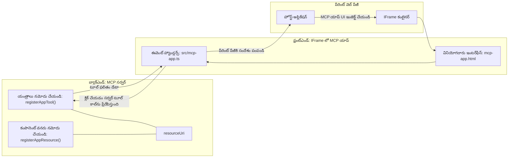
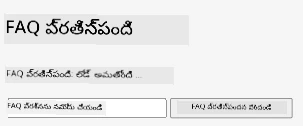
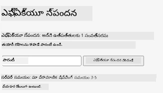
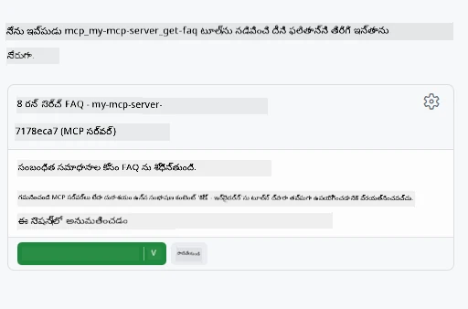
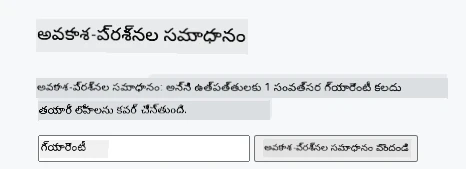

# MCP అప్లికేషన్లు

MCP అప్లికేషన్లు MCPలో ఒక కొత్త దృక్పథం. ఐడియా ఏమిటంటే, మీరు ఒక టూల్ కాల్ నుండి డేటా వెనుకుకు మాత్రమే స్పందించడం కాదు, మీరు ఈ సమాచారం ఎట్లాగా ఎంటరాక్ట్ చేయాలో కూడా సమాచారం అందిస్తారు. అంటే ఇప్పుడు టూల్ ఫలితాల్లో UI సమాచారం కూడా ఉండవచ్చు. ఇది ఎందుకు కావాలి? బాగుంటే, మీరు ఈ రోజు ఎలా పని చేస్తారు అనుకోండి. మీరు సాధారణంగా MCP సర్వర్ ఫలితాలను తీసుకుని దాని ముందునుంచి ఒక ఫ్రంట్ ఎండ్ పెట్టే అవకాశం ఉంటుంది, అది మీకు వ్రాయాల్సిన మరియు నిర్వహించాల్సిన కోడ్. కొన్ని సార్లు మీకు అది కావచ్చు, కానీ కొన్ని సార్లు మీరు డేటా నుండి యూజర్ ఇంటర్‌ఫేస్ వరకు అన్ని ఒక స్వయం సంకలిత స్నిపెట్ తీసుకురాగలిగితే అదెంత బాగుంటుందో చూడండి.

## అవలోకనం

ఈ పాఠం MCP అప్లికేషన్లపై ప్రాక్టికల్ మార్గనిర్దేశం అందిస్తుంది, ప్రారంభం ఎలా చేయాలో మరియు మీరు ఇప్పటికే ఉన్న వెబ్ అప్లికేషన్లలో దానిని ఎలా ఇంటిగ్రేట్ చేయాలో చెప్పుతుంది. MCP అప్లికేషన్లు MCP స్టాండర్డ్‌లో ఒక చాలా కొత్త జోడింపు.

## అభ్యసన లక్ష్యాలు

ఈ పాఠం చివర మీరు సాదించగలుగుతారు:

- MCP అప్లికేషన్లు ఏమిటి అనే విషయాన్ని వివరించగలగటం.
- ఎప్పుడు MCP అప్లికేషన్లు ఉపయోగించాలో అర్ధం చేసుకోవటం.
- మీ స్వంత MCP అప్లికేషన్లు నిర్మించి ఇంటిగ్రేట్ చేయగలగటం.

## MCP అప్లికేషన్లు - ఇది ఎలా పనిచేస్తుంది

MCP అప్లికేషన్లతో కూడిన ఆలోచన ఏమిటంటే, సాదారణంగా ఇది ఒక కంపోనెంట్ గా స్పందన ఇవ్వడం అవసరం. అలాంటి కంపోనెంట్ వద్ద విజువల్స్ మరియు ఇంటరాక్టివిటీ ఉండవచ్చు, ఉదాహరణకు బటన్ క్లిక్‌లు, యూజర్ ఇన్పుట్ మరియు మరిన్ని. మనం సర్వర్ వైపు నుండి మొదలు పెడదాం మన MCP సర్వర్ తో. MCP అప్లికేషన్ కంపోనెంట్ సృష్టించాలంటే మీరు ఒక టూల్, అలాగే ఒక అప్లికేషన్ రిసోర్స్ కూడా సృష్టించాలి. ఈ రెండు భాగాలు resourceUri ద్వారా కనెక్ట్ అవుతాయి.

ఇది ఎలా పనిచేస్తుందో ఒక ఉదాహరణ ఇక్కడ ఉంది. ఏవీ భాగాలు ముఖ్యమో, వాటి పని ఏమిటో చూద్దాం:

```text
server.ts -- responsible for registering tools and the component as a UI component
src/
  mcp-app.ts -- wiring up event handlers
mcp-app.html -- the user interface
```
  
ఈ విజువల్ ఒక కంపోనెంట్ మరియు దాని లాజిక్ కోసం ఆర్కిటెక్చర్ వివరించబడి ఉంది.


మనం తరువాత బ్యాక్ ఎండ్ మరియు ఫ్రంట్ ఎండ్ బాధ్యతలు ఎలా ఉంటాయో వివరిద్దాం.

### బ్యాక్ ఎండ్

మనం చేయాల్సిన రెండు పనులు ఉన్నాయి:

- మనం ఇంటరాక్ట్ చేయదలచిన టూల్స్‌ను రిజిస్టర్చి చేసుకోవడం.
- కంపోనెంట్ను నిర్వచించడం.

**టూల్ రిజిస్ట్రేషన్**

```typescript
registerAppTool(
    server,
    "get-time",
    {
      title: "Get Time",
      description: "Returns the current server time.",
      inputSchema: {},
      _meta: { ui: { resourceUri } }, // ఈ సాధనాన్ని దాని UI వనరుకు లింక్ చేయుతుంది
    },
    async () => {
      const time = new Date().toISOString();
      return { content: [{ type: "text", text: time }] };
    },
  );

```
  
పై కోడ్ ఒక `get-time` అనే టూల్‌ను చూపిస్తుంది. దీనికి ఎలాంటి ఇన్పుట్ అవసరం లేదు కానీ ఇది ప్రస్తుత సమయాన్ని ఉత్పత్తి చేస్తుంది. అవసరమైనప్పుడు టూల్స్‌కు ఉపయోగించేందుకు `inputSchema` కూడా ఈ విధంగా నిర్వచించవచ్చు.

**కంపోనెంట్ రిజిస్ట్రేషన్**

అదే ఫైలులో మనం కంపోనెంట్‌ని కూడా రిజిస్టర్చి చేయాలి:

```typescript
const resourceUri = "ui://get-time/mcp-app.html";

// UI కోసం బ్యాండిల్ చేయబడ్డ HTML/జావాస్క్రిప్ట్‌ను తిరిగి ఇచ్చే రిసోర్స్‌ను రిజిస్టర్ చేయండి.
registerAppResource(
  server,
  resourceUri,
  resourceUri,
  { mimeType: RESOURCE_MIME_TYPE },
  async () => {
    const html = await fs.readFile(path.join(DIST_DIR, "mcp-app.html"), "utf-8");

    return {
    contents: [
        { uri: resourceUri, mimeType: RESOURCE_MIME_TYPE, text: html },
    ],
    };
  },
);
```
  
మనము `resourceUri`ని ఎలా టూల్స్ తో కంపోనెంట్ కనెక్ట్ చేస్తున్నామో గమనించండి. చివరలో ఒక కాల్‌బ్యాక్ ఉంది, ఇక్కడ UI ఫైల్‌ను లోడ్ చేసి కంపోనెంట్‌ను రిటర్న్ చేస్తున్నాం.

### కంపోనెంట్ ఫ్రంట్ ఎండ్

బ్యాక్ ఎండ్ లాగా, ఇక్కడ కూడా రెండు భాగాలు ఉంటాయి:

- ప్యూర్ HTML లో వ్రాసిన ఫ్రంట్ ఎండ్.
- ఈవెంట్స్ నిర్వహణకు మరియు ఏమి చేయాలో నిర్ణయించేందుకు కై కోడ్, ఉదాహరణకు టూల్స్ కాలింగ్ లేదా పేరెంట్ విండోతో మెసేజ్ చేయడం.

**యూజర్ ఇంటర్‌ఫేస్**

యూజర్ ఇంటర్‌ఫేస్ ఒకసారి చూద్దాం.

```html
<!-- mcp-app.html -->
<!DOCTYPE html>
<html lang="en">
  <head>
    <meta charset="UTF-8" />
    <title>Get Time App</title>
  </head>
  <body>
    <p>
      <strong>Server Time:</strong> <code id="server-time">Loading...</code>
    </p>
    <button id="get-time-btn">Get Server Time</button>
    <script type="module" src="/src/mcp-app.ts"></script>
  </body>
</html>
```
  
**ఈవెంట్ వైర్-అప్**

చివరి భాగం ఈవెంట్ వైర్-అప్. ఇది మన UI లో ఎక్కడ ఈవెంట్ హ్యాండ్లర్స్ అవసరమో గుర్తించి, ఈవెంట్లు వచ్చినప్పుడు ఏం చేయాలో నిర్ణయిస్తుంది:

```typescript
// mcp-app.ts

import { App } from "@modelcontextprotocol/ext-apps";

// అంశ సూచనలను పొందండి
const serverTimeEl = document.getElementById("server-time")!;
const getTimeBtn = document.getElementById("get-time-btn")!;

// యాప్ ఉదాహరణను సృష్టించండి
const app = new App({ name: "Get Time App", version: "1.0.0" });

// సర్వర్ నుండి టూల్ ఫలితాలను నిర్వహించండి. ప్రారంభ టూల్ ఫలితాన్ని మిస్ కాకుండా `app.connect()` ముందు సెట్ చేయండి
// ప్రారంభ టూల్ ఫలితాన్ని మిస్ కావడం
app.ontoolresult = (result) => {
  const time = result.content?.find((c) => c.type === "text")?.text;
  serverTimeEl.textContent = time ?? "[ERROR]";
};

// బటన్ క్లిక్ ను జోడించండి
getTimeBtn.addEventListener("click", async () => {
  // `app.callServerTool()` UIకు సర్వర్ నుండి తాజా డేటాను అభ్యర్థించడానికి అనుమతిస్తుంది
  const result = await app.callServerTool({ name: "get-time", arguments: {} });
  const time = result.content?.find((c) => c.type === "text")?.text;
  serverTimeEl.textContent = time ?? "[ERROR]";
});

// హోస్ట్‌కు కనెక్ట్ అవ్వండి
app.connect();
```
  
పై కోడ్ నుండి మనం చూడగలిగిందిగా, ఇది డొమ్ ఎలెమెంట్లకు ఈవెంట్లను జతచేసే సామాన్య కోడ్. ముఖ్యమైనది `callServerTool` ఫంక్షన్ కాల్, ఇది బ్యాక్ ఎండ్ లోని టూల్ ను పిలుస్తుంది.

## యూజర్ ఇన్పుట్ తో వ్యవహరించడం

ఇప్పటివరకు, మనం ఒక కంపోనెంట్ చూశాం, అందులో బటన్ క్లిక్ చేయడం ద్వారా ఒక టూల్ పిలవబడుతోంది. మరిన్ని UI ఎలెమెంట్లు జోడించి, ఇన్పుట్ ఫీల్డ్ లా వాటిని కలిపి, టూల్ కు ఆర్గ్యుమెంట్లను పంపేందుకు ప్రయత్నిద్దాం. మనం FAQ ఫంక్షనాలిటీ అమలు చేద్దాం. ఇది ఇలా పని చేయాలి:

- ఒక బటన్ మరియు ఒక ఇన్పుట్ ఎలిమెంట్ ఉండాలి, అందులో యూజర్ ఒక కీవర్డ్ టైప్ చేసి శోధించాలి, ఉదాహరణకు "Shipping". ఇది బ్యాక్ ఎండ్ లోని ఒక టూల్ పిలవాలి, అది FAQ డేటాలో శోధన చేస్తుంది.
- ఒక టూల్ FAQ శోధనకు మద్దతు ఇవ్వాలి.

ముందుగా అవసరమైన మద్దతును బ్యాక్ ఎండ్ లో జత చేద్దాం:

```typescript
const faq: { [key: string]: string } = {
    "shipping": "Our standard shipping time is 3-5 business days.",
    "return policy": "You can return any item within 30 days of purchase.",
    "warranty": "All products come with a 1-year warranty covering manufacturing defects.",
  }

registerAppTool(
    server,
    "get-faq",
    {
      title: "Search FAQ",
      description: "Searches the FAQ for relevant answers.",
      inputSchema: zod.object({
        query: zod.string().default("shipping"),
      }),
      _meta: { ui: { resourceUri: faqResourceUri } }, // ఈ టూల్‌ని దాని UI వనరుతో లింక్ చేస్తుంది
    },
    async ({ query }) => {
      const answer: string = faq[query.toLowerCase()] || "Sorry, I don't have an answer for that.";
      return { content: [{ type: "text", text: answer }] };
    },
  );
```
  
ఇక్కడ మనం `inputSchema` ని ఎలా పూరించాలో చూస్తున్నాం మరియు `zod` స్కీమా ఇట్లు ఇస్తున్నాం:

```typescript
inputSchema: zod.object({
  query: zod.string().default("shipping"),
})
```
  
పై స్కీమాలో మనం `query` అనే ఇన్పుట్ పారామీటర్ ఉందని, అది ఐచ్ఛికం మరియు దీని డిఫాల్ట్ విలువ "shipping" అని ప్రకటించాం.

ఆరు, *mcp-app.html* లో మనం UI ఏంటి తయారుచేసుకోవాలో చూద్దాం:

```html
<div class="faq">
    <h1>FAQ response</h1>
    <p>FAQ Response: <code id="faq-response">Loading...</code></p>
    <input type="text" id="faq-query" placeholder="Enter FAQ query" />
    <button id="get-faq-btn">Get FAQ Response</button>
  </div>
```
  
గొప్పది, ఇప్పుడు మాకు ఒక ఇన్పుట్ ఎలిమెంట్ మరియు బటన్ ఉన్నాయి. తరువాత *mcp-app.ts* లో ఈవెంట్లను వైర్-అప్ చేద్దాం:

```typescript
const getFaqBtn = document.getElementById("get-faq-btn")!;
const faqQueryInput = document.getElementById("faq-query") as HTMLInputElement;

getFaqBtn.addEventListener("click", async () => {
  const query = faqQueryInput.value;
  const result = await app.callServerTool({ name: "get-faq", arguments: { query } });
  const faq = result.content?.find((c) => c.type === "text")?.text;
  faqResponseEl.textContent = faq ?? "[ERROR]";
});
```
  
పై కోడ్ లో మనం:

- ఆసక్తికరమైన UI ఎలెమెంట్లకు రిఫరెన్సులు సృష్టించాము.
- బటన్ క్లిక్ ను హ్యాండిల్ చేస్తూ ఇన్పుట్ ఎలిమెంట్ విలువ‌ను పార్స్ చేసి, `app.callServerTool()` ని `name` మరియు `arguments` (ఇక్కడ `query` విలువ తో) కలిపి పిలుస్తుంది.

`callServerTool` పిలిచినప్పుడు యేమైంది అంటే ఇది ప్యారెంట్ విండో కి మెసేజ్ పంపుతుంది, ఆ విండో MCP సర్వర్‌ని కాల్ చేస్తుంది.

### ప్రయత్నించండి

దీనిని ప్రయత్నిస్తే ఇప్పుడు మనం క్రిందివి చూడగలుగుతాం:



ఇంకా ఇన్పుట్ "warranty" తో ప్రయత్నించగలం:



ఈ కోడ్ ని రన్ చేయాలంటే [కోడ్ సెక్షన్](./code/README.md) కి వెళ్లండి

## విజువల్ స్టూడియో కోడ్ లో పరీక్షించుట

విజువల్ స్టూడియో కోడ్ MVP అప్స్ కొరకు గొప్ప మద్దతు కలిగి ఉంటుంది మరియు మీ MCP అప్లికేషన్లను పరీక్షించడానికి ఇది అనేక సులభతమ మార్గాలలో ఒకటి. Visual Studio Code ఉపయోగించాలంటే, *mcp.json* లో ఒక సర్వర్ ఎంట్రీ కింద విధంగా జోడించండి:

```json
"my-mcp-server-7178eca7": {
    "url": "http://localhost:3001/mcp",
    "type": "http"
  }
```
  
అప్పుడు సర్వర్ ని ప్రారంభించండి, మీరు Chat విండో ద్వారా మీ MCP అప్లికేషన్‌తో సంభాషించగలుగుతారు, దీని కోసం GitHub Copilot ఇన్స్టాల్ అవ్వాలి.

ఉదాహరణకు "#get-faq" ద్వారా ట్రిగ్గర్ చేసే విధంగా:



ఇది వెబ్ బ్రౌజర్ లో నడిపించినట్టు, అదే విధంగా UI ను చూడవచ్చు:



## అసైన్‌మెంట్

ఒక రాక్ పేపర్ సిస్సర్ ఆటను సృష్టించండి. ఇందులో ఈ క్రింది అంశాలు ఉండాలి:

UI:

- ఎంపికలతో డ్రాప్ డౌన్ జాబితా
- ఎంపిక సబ్మిట్ చేయడానికి ఒక బటన్
- ఎవరు ఏమి ఎంచుకున్నారు మరియు ఎవరు గెలిచారో చూపించు లేబుల్

సర్వర్:

- "choice" అనే ఇన్‌పుట్ అందుకునే ఒక రాక్ పేపర్ సిస్సర్ టూల్ ఉండాలి. ఇది కంప్యూటర్ ఎంపికను కూడా ప్రదర్శించి విజేతను నిర్ణయించాలి.

## పరిష్కారం

[పరిష్కారం](./assignment/README.md)

## సారాంశం

మనం ఈ కొత్త దృక్పథం MCP అప్లికేషన్ల గురించి నేర్పుకున్నాము. ఇది MCP సర్వర్లు కేవలం డేటా మాత్రమే కాకుండా, ఆ డేటా ఎలా చూపించాలో కూడా అభిప్రాయం కలిగించేలా చేస్తుంది.

సంబంధితంగా, ఈ MCP అప్లికేషన్లు IFrame లో హోస్ట్ చేయబడతాయి మరియు MCP సర్వర్లతో కమ్యూనికేట్ చేయడానికి ప్యారెంట్ వెబ్ అప్లికేషన్ కు మెసేజ్ పంపాలి. ఈ కమ్యూనికేషన్ సులభతరం చేసేవిధంగా plain JavaScript, React మరియు మరెన్నో కోసం అనేక లైబ్రరీలు ఉన్నాయి.

## ముఖ్యమైన అంశాలు

మీరు నేర్చుకున్నవి:

- MCP అప్లికేషన్లు ఒక కొత్త స్టాండర్డ్, ఇది డేటా మరియు UI ఫీచర్లు రెండూ షిప్ చేయాలనుకునే సమయాల్లో ఉపయోగకరంగా ఉంటుంది.
- భద్రత కారణాల వలన ఈ రకం అప్లికేషన్లు IFrame లో నడుస్తాయి.

## తదుపరి ఏమిటి

- [అధ్యాయం 4](../../04-PracticalImplementation/README.md)

---

<!-- CO-OP TRANSLATOR DISCLAIMER START -->
**నిరాకరణ**:  
ఈ పత్రాన్ని AI అనువాద సేవ [Co-op Translator](https://github.com/Azure/co-op-translator) ఉపయోగించి అనువదించబడింది. మేము నిష్పక్షపాతత్వానికి ప్రయత్నిస్తున్నప్పటికీ, స్వయంచాలక అనువాదాలలో పొరపాట్లు లేదా తప్పిదాలు ఉండే అవకాశం ఉంటుందని దయచేసి గమనించండి. అసలు పత్రం స్థానిక భాషలో ఉన్న దాన్ని అధికారిక మూలంగా పరిగణించాలి. ముఖ్యమైన సమాచారం కోసం ప్రొఫెషనల్ మానవ అనువాదం సూచించబడుతుంది. ఈ అనువాదం వాడుకలో వచ్చిన ఏదైనా అపార్థాలు లేదా తప్పింపులకు మేము బాధ్యత వహించము.
<!-- CO-OP TRANSLATOR DISCLAIMER END -->