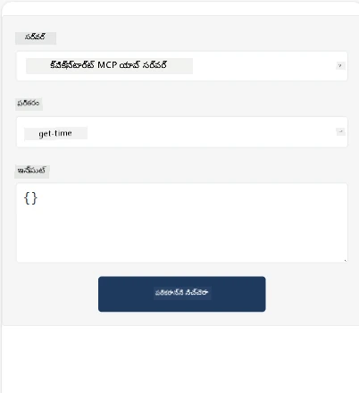
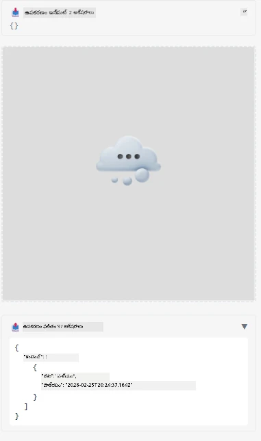

ఇది MCP యాప్ ని చూపించే ఒక ఉదాహరణ

## ఇన్‌స్టాల్ చేయండి

1. *mcp-app* ఫోల్డర్ కు వెళ్లండి
1. `npm install` ను నడపండి, ఇది ఫ్రంట్‌ఎండ్ మరియు బ్యాక్‌ఎండ్ డిపెండెన్సీలను ఇన్‌స్టాల్ చేస్తుంది

బ్యాక్‌ఎండ్ సరిగ్గా కంపైల్ అవుతుందో లేదో చెకప్ చేసేందుకు నడపండి:

```sh
npx tsc --noEmit
```

అన్నీ సరిగా ఉంటే ఏ అవుట్‌పుట్ ఉండదు.

## బ్యాక్‌ఎండ్ నడపండి

> మీరు విండోస్ మెషిన్ మీద ఉన్నట్లయితే ఇది కొంచెం అదనపు పని అవసరం, ఎందుకంటే MCP యాప్స్ సొల్యూషన్ `concurrently` లైబ్రరీని ఉపయోగించి నడుపుతుంది, దానికి మీరు ప్రత్యామ్నాయాన్ని కనుగొనాలి. ఇక్కడ MCP యాప్ లో *package.json* లో సమస్య ఉన్న లైన్:

    ```json
    "start": "concurrently \"cross-env NODE_ENV=development INPUT=mcp-app.html vite build --watch\" \"tsx watch main.ts\""
    ```

ఈ యాప్ రెండు భాగాలు కలిగి ఉంది, ఒకటి బ్యాక్‌ఎండ్ భాగం మరియు మరొకటి హోస్ట్ భాగం.

బ్యాక్‌ఎండ్ ను ప్రారంభించడానికి ఇదాన్ని పిలవండి:

```sh
npm start
```

 ఇది `http://localhost:3001/mcp` వద్ద బ్యాక్‌ఎండ్ ని ప్రారంభించాలి.

> గమనిక, మీరు Codespace లో ఉంటే, పోర్ట్ వీక్షణను పబ్లిక్ గా సెట్ చేయాల్సి ఉంటుంది. https://<Codespace పేరువై కాని>.app.github.dev/mcp ద్వారా బ్రౌజర్ లో ఎండ్ పాయింట్ చేరగలరని తనిఖీ చేసుకోండి

## ఎంపిక -1 Visual Studio Code లో యాప్ ని పరీక్షించండి

Visual Studio Code లో సొల్యూషన్ ని పరీక్షించేందుకు, ఈ క్రింది దశలను అనుసరించండి:

- `mcp.json` లో క్రింది విధంగా సర్వర్ എൻట్రీ జోడించండి:

    ```json
    {
        "servers": {
            "my-mcp-server-7178eca7": {
                "url": "http://localhost:3001/mcp",
                "type": "http"
            }
        },
        "inputs": []
    }
    ```

1. *mcp.json* లో "start" బటన్ పై క్లిక్ చేయండి
1. చాట్ విండో ఓపెన్ అయి `get-faq` టైపు చేసి ఫలితాన్ని ఈ క్రింది విధంగా చూడండి:

    

## ఎంపిక -2- హోస్ట్ తో యాప్ ని పరీక్షించండి

<https://github.com/modelcontextprotocol/ext-apps> రిపోలో పలు వేర్వేరు హోస్టులు ఉన్నాయి, వాటిని ఉపయోగించి మీ MVP యాప్స్ ని పరీక్షించవచ్చు.

ఇక్కడ మేము మీకు రెండు ఎంపికలను అందిస్తున్నాం:

### లోకల్ మెషిన్

- మీరు రిపో ని క్లోన్ చేసిన తరువాత *ext-apps* లోకి వెళ్లండి.

- డిపెండెన్సీలను ఇన్‌స్టాల్ చేయండి

   ```sh
   npm install
   ```

- మరో టెర్మినల్ విండోలో *ext-apps/examples/basic-host* కి వెళ్ళండి

    > మీరు Codespace ఉపయోగిస్తుంటే, మీరు serve.ts లో లైన్ 27 కి వెళ్లి http://localhost:3001/mcp ని మీ Codespace URL తో మార్చాలి, ఉదా: https://psychic-xylophone-657rpjgvxpc5g64-3001.app.github.dev/mcp

- హోస్ట్ ని నడపండి:

    ```sh
    npm start
    ```

    ఇది హోస్ట్ ను బ్యాక్‌ఎండ్ తో కనెక్ట్ చేస్తుంది మరియు యాప్ ఈ విధంగా నడుస్తుంద‌ని చూడగలరు:

    

### కోడ్స్‌పేస్

కోడ్స్‌పేస్ వాతావరణాన్ని పనిచేయించేందుకు కొంచెం అదనపు పని అవసరం. Codespace ద్వారా హోస్ట్ ఉపయోగించాలంటే:

- *ext-apps* డైరెక్టరీలోకి వెళ్లి *examples/basic-host* లోకి వెళ్ళండి.
- డిపెండెన్సీలను ఇన్‌స్టాల్ చేయడానికి `npm install` నడపండి
- హోస్ట్ పెట్టడానికి `npm start` నడపండి.

## యాప్ ని పరీక్షించండి

క్రిందివిధంగా యాప్ ని ప్రయత్నించండి:

- "Call Tool" బటన్ ని ఎంచుకోండి మరియు ఫలితాలు ఈ విధంగా కనిపిస్తాయి:

    

అద్భుతం, అన్నీ సరిగ్గా పని చేస్తోంది.

---

<!-- CO-OP TRANSLATOR DISCLAIMER START -->
**అస్పష్టత**:
ఈ పత్రాన్ని AI అనువాద సేవ [Co-op Translator](https://github.com/Azure/co-op-translator) ద్వారా అనువదించారు. మనం సరికొత్తతకు యత్నించినప్పటికీ, ఆటోమేటెడ్ అనువాదాలలో పొరపాట్లు లేదా తప్పిదాలు ఉండవచ్చు. స్థానిక భాషలో ఉన్న అసలు పత్రం అధికారిక సాధనంగా పరిగణించాలి. ముఖ్యమైన సమాచారం కోసం, ప్రొఫెషనల్ మానవ అనువాదాన్ని సిఫార్సు చేస్తాము. ఈ అనువాదం వాడకంలో వచ్చే ఏవైనా బుసులు లేదా తప్పుగా అర్థం చేసుకోవడాలకు మేము బాధ్యత వహించమని తెలియజేస్తున్నాము.
<!-- CO-OP TRANSLATOR DISCLAIMER END -->