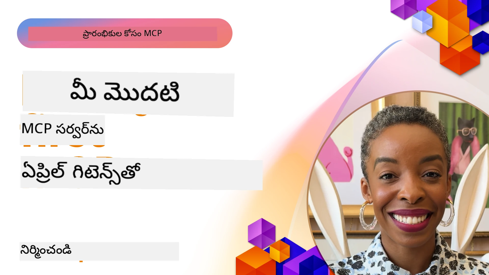

## ప్రారంభించటం  

_(ఈ పాఠం వీడియోను చూడటానికి పై చిత్రాన్ని క్లిక్ చేయండి)_

ఈ విభాగం లో పలు పాఠాలు ఉన్నాయి:

- **1 మీ మొదటి సర్వర్**, ఈ మొదటి పాఠంలో మీ మొదటి సర్వర్ ని ఎలా సృష్టించాలో, ఇన్‌స్పెక్టర్ టూల్ తో దాన్ని పరిశీలించడం ఎలా చేయాలో నేర్పబడుతుంది, ఇది మీ సర్వర్ ను పరీక్షించటం మరియు డీబగ్ చేయటానికి విలువైన మార్గం, [పాఠానికి](01-first-server/README.md)

- **2 క్లయింట్**, ఈ పాఠంలో, మీరు మీ సర్వర్ కు కనెక్ట్ కావడానికి సరిపోయే క్లయింట్ ని ఎలా రాయాలో నేర్పబడుతుంది, [పాఠానికి](02-client/README.md)

- **3 LLM తో క్లయింట్**, క్లయింట్ రాయటానికి మరింత మెరుగైన మార్గం LLM ని చేర్చి సర్వర్ తో "పాతెనీ" చెయ్యగలిగే విధంగా చేయడం, [పాఠానికి](03-llm-client/README.md)

- **4 గిట్ హబ్ కోపైలట్ ఏజెంట్ మోడ్ ని ఉపయోగించి Visual Studio Code లో MCP సర్వర్ ని వినియోగించడం**. ఇక్కడ, Visual Studio Code లో నుండి మా MCP సర్వర్ ని నడపటం చూద్దాం, [పాఠానికి](04-vscode/README.md)

- **5 stdio ట్రాన్స్‌పోర్ట్ సర్వర్** stdio ట్రాన్స్‌పోర్ట్ స్థానిక MCP సర్వర్ నుండి క్లయింట్లతో కమ్యూనికేషన్ కి సిఫారసైన ప్రమాణం, సురక్షితమైన సబ్‌ప్రాసెస్ ఆధారిత కమ్యూనికేషన్ తో పాటు ప్రాసెస్ ఐసోలేషన్ అందిస్తుంది [పాఠానికి](05-stdio-server/README.md)

- **6 MCP తో HTTP స్ట్రీమింగ్ (స్ట్రీమబుల్ HTTP)**. ఆధునిక HTTP స్ట్రీమింగ్ ట్రాన్స్‌పోర్ట్ గురించి నేర్చుకోండి (దూరపు MCP సర్వర్ల కోసం సిఫారసు చేయబడిన విధానం [MCP స్పెసిఫికేషన్ 2025-11-25](https://spec.modelcontextprotocol.io/specification/2025-11-25/basic/transports/#streamable-http) ప్రకారం), పురోగతి సమాచారం, మరియు స్ట్రీమబుల్ HTTP ఉపయోగించి స్కేలబుల్, రియల్-టైమ్ MCP సర్వర్లు మరియు క్లయింట్లను ఎలా అమలు చేయాలో [పాఠానికి](06-http-streaming/README.md)

- **7 VSCode కోసం AI టూల్‌కిట్ ఉపయోగించి MCP క్లయింట్లు మరియు సర్వర్లను వినియోగించి పరీక్షించడం** [పాఠానికి](07-aitk/README.md)

- **8 పరీక్షించడం**. ఇక్కడ మేము ముఖ్యంగా మా సర్వర్ మరియు క్లయింట్ ని వివిధ మార్గాల్లో ఎలా పరీక్షించాలో చూడ్తాము, [పాఠానికి](08-testing/README.md)

- **9 డిప్లాయ్‌మెంట్**. ఈ అధ్యాయం మీ MCP పరిష్కారాలను వివిధ విధాలుగా ఎలా అమలు చేయాలో చూస్తుంది, [పాఠానికి](09-deployment/README.md)

- **10 ఆధునిక సర్వర్ ఉపయోగం**. ఈ అధ్యాయం ఆధునిక సర్వర్ వినియోగాన్ని కవర్ చేస్తుంది, [పాఠానికి](./10-advanced/README.md)

- **11 అథ్**. ఈ అధ్యాయం సింపుల్ అథ్ ను ఎలా చేర్చాలో కవర్ చేస్తుంది, బేసిక్ అథ్ నుండి JWT మరియు RBAC ఉపయోగించడం వరకు. మీరు ఇక్కడ ప్రారంభించి అధ్యాయం 5 లో ఆధునిక విషయాలను చూసి, తర్వాత అధ్యాయం 2 లో సూచించబడిన అదనపు భద్రతా చర్యలను అనుసరించమని ప్రోత్సహించబడతారు, [పాఠానికి](./11-simple-auth/README.md)

- **12 MCP హోస్ట్స్**. క్లౌడ్ డెస్క్‌టాప్, కర్సర్, క్లైన్ మరియు విండ్సర్ఫ్ వంటి ప్రాచుర్యంలోని MCP హోస్ట్ క్లయింట్లను కాన్ఫిగర్ చేసి వినియోగించండి. ట్రాన్స్‌పోర్ట్ రకాలు మరియు ట్రబుల్‌షూటింగ్ నేర్చుకోండి, [పాఠానికి](./12-mcp-hosts/README.md)

- **13 MCP ఇన్స్పెక్టర్**. MCP ఇన్స్పెక్టర్ టూల్ ఉపయోగించి మీ MCP సర్వర్లను ఇంటరాక్టివ్ గా డీబగ్ చేసి పరీక్షించండి. టూల్స్, వనరులు మరియు ప్రోటోకాల్ సందేశాలు ట్రబుల్‌షూట్ చేయడం నేర్చుకోండి, [పాఠానికి](./13-mcp-inspector/README.md)

- **14 శాంప్లింగ్**. MCP క్లయింట్లతో కలిసి LLM సంబంధిత పనులపై కలిసి పనిచేసే MCP సర్వర్లు సృష్టించండి, [పాఠానికి](./14-sampling/README.md)

- **15 MCP యాప్స్**. UI సూచనలతో కూడిన స్పందనలు కలిగిన MCP సర్వర్లు నిర్మించండి, [పాఠానికి](./15-mcp-apps/README.md)

Model Context Protocol (MCP) అనేది ఓపెన్ ప్రోటోకాల్, ఇది LLMలకు సాపేక్షంగా అప్లికేషన్లు ఎలా కాంటెక్స్ట్ అందించాలో ప్రమాణీకరిస్తుంది. MCP ని AI అప్లికేషన్లకు USB-C పోర్ట్ లాగా ఆలోచించవచ్చు - ఇది విభిన్న డేటా మూలాలు మరియు సాధనలతో AI మోడళ్లను కనెక్ట్ చేయడానికి ప్రమాణీకృతమైన మార్గాన్ని అందిస్తుంది.

## అభ్యాస లక్ష్యాలు

ఈ పాఠం ముగిసిన తరువాత, మీరు చేయగలరు:

- C#, Java, Python, TypeScript, మరియు JavaScript లో MCP అభివృద్ధి వాతావరణాలను ఏర్పాటు చేయండి
- కస్టమ్ ఫీచర్ల (వనరులు, ప్రాంప్ట్‌లు, సాధనాలు) తో ప్రాథమిక MCP సర్వర్లను నిర్మించి అమలు చేయండి
- MCP సర్వర్లకు కనెక్ట్ అయ్యే హోస్ట్ అప్లికేషన్లు సృష్టించండి
- MCP అమలు పరీక్షించండి మరియు డీబగ్ చేయండి
- సాధారణ సెటప్ సవాళ్లు మరియు వాటి పరిష్కారాలను అర్థం చేసుకోండి
- MCP అమలను ప్రాచుర్యంలో ఉన్న LLM సర్వీసులకు కనెక్ట్ చేయండి

## మీ MCP వాతావరణాన్ని సెటప్ చేయటం

MCP తో పని ప్రారంభించే ముందు, మీ అభివృద్ధి వాతావరణాన్ని సర్దుబాటు చేయడం మరియు ప్రాథమిక పని ప్రవాహాన్ని అర్థం చేసుకోవడం ముఖ్యం. ఈ విభాగం మీకు మొదటి సెటప్ దశలను సులభతరం చేస్తుంది MCP తో సాఫీగా ప్రారంభించడానికి.

### ముందస్తు అవసరాలు

MCP అభివృద్ధిలోకి దిగేముందు, ఈ ఐటమ్స్ మీ వద్ద ఉండాలి:

- **అభివృద్ధి వాతావరణం**: మీరు ఎంచుకున్న భాష కోసం (C#, Java, Python, TypeScript, లేదా JavaScript)
- **IDE/ఎడిటర్**: Visual Studio, Visual Studio Code, IntelliJ, Eclipse, PyCharm, లేదా ఏ ఆధునిక కోడ్ ఎడిటర్
- **ప్యాకేజ్ మేనేజర్లు**: NuGet, Maven/Gradle, pip, లేదా npm/yarn
- **API కీలు**: మీరు ఉపయోగించబోయే ఏ AI సేవల కోసం

### అధికారిక SDKలు

తదుపరి అధ్యాయాలలో మీరు Python, TypeScript, Java మరియు .NET ఉపయోగించి నిర్మించిన పరిష్కారాలను చూడగలుగుతారు. అధికారికంగా మద్దతు ఇచ్చే SDKలు ఇవీ:

MCP అనేక భాషల కోసం అధికారిక SDKలు అందిస్తుంది ([MCP Specification 2025-11-25](https://spec.modelcontextprotocol.io/specification/2025-11-25/) ప్రకారం):
- [C# SDK](https://github.com/modelcontextprotocol/csharp-sdk) - Microsoft తో సహకారంలో నిర్వహిస్తున్నారు
- [Java SDK](https://github.com/modelcontextprotocol/java-sdk) - Spring AI తో కలిసి నిర్వహిస్తున్నారు
- [TypeScript SDK](https://github.com/modelcontextprotocol/typescript-sdk) - అధికారిక TypeScript అమలు
- [Python SDK](https://github.com/modelcontextprotocol/python-sdk) - అధికారిక Python అమలు (FastMCP)
- [Kotlin SDK](https://github.com/modelcontextprotocol/kotlin-sdk) - అధికారిక Kotlin అమలు
- [Swift SDK](https://github.com/modelcontextprotocol/swift-sdk) - Loopwork AI తో సహకారంలో నిర్వహిస్తున్నారు
- [Rust SDK](https://github.com/modelcontextprotocol/rust-sdk) - అధికారిక Rust అమలు
- [Go SDK](https://github.com/modelcontextprotocol/go-sdk) - అధికారిక Go అమలు

## ముఖ్యాంశాలు

- MCP అభివృద్ధి వాతావరణాన్ని భాషా-ప్రత్యేక SDKలతో సులభంగా ఏర్పాటు చేయవచ్చు
- MCP సర్వర్లు నిర్మించడం అంటే స్పష్టమైన స్కీమాలతో సాధనాలను సృష్టించి నమోదు చేయడం
- MCP క్లయింట్లు సర్వర్లు మరియు మోడళ్లను కలపడం ద్వారా విస్తృత సామర్థ్యాలు పొందుతాయి
- పరీక్షించడం మరియు డీబగింగ్ MCP అమలులో విశ్వసనీయతకు ముఖ్యమైనవి
- డిప్లాయ్‌మెంట్ ఎంపికలు స్థానిక అభివృద్ధి నుంచి క్లౌడ్ ఆధారిత పరిష్కారాల వరకు ఉంటాయి

## అభ్యాసం

ఈ విభాగంలో మీరు చూసే అన్ని అధ్యాయాలు కోసం వ్యాయామాలను పూర్తి చేసే నమూనాలు మాకు ఉన్నాయి. అదనంగా ప్రతి అధ్యాయం తన దాని వ్యాయామాలు మరియు అసైన్మెంట్లను కలిగి ఉంటుంది

- [Java క్యాల్క్యులేటర్](./samples/java/calculator/README.md)
- [.Net క్యాల్క్యులేటర్](../../../03-GettingStarted/samples/csharp)
- [JavaScript క్యాల్క్యులేటర్](./samples/javascript/README.md)
- [TypeScript క్యాల్క్యులేటర్](./samples/typescript/README.md)
- [Python క్యాల్క్యులేటర్](../../../03-GettingStarted/samples/python)

## అదనపు వనరులు

- [Azure పై Model Context Protocol ఉపయోగించి ఏజెంట్లు తయారు చేయడం](https://learn.microsoft.com/azure/developer/ai/intro-agents-mcp)
- [Azure కంటైనర్ యాప్స్ తో రిమోట్ MCP (Node.js/TypeScript/JavaScript)](https://learn.microsoft.com/samples/azure-samples/mcp-container-ts/mcp-container-ts/)
- [.NET OpenAI MCP ఏజెంట్](https://learn.microsoft.com/samples/azure-samples/openai-mcp-agent-dotnet/openai-mcp-agent-dotnet/)

## తర్వాత ఏమి చేయాలి

మొదటి పాఠం తో ప్రారంభించండి: [మీ మొదటి MCP సర్వర్ సృష్టించడం](01-first-server/README.md)

ఈ మాడ్యూల్ పూర్తి అయిన తర్వాత, కొనసాగండి: [మాడ్యూల్ 4: ప్రాక్టికల్ అమలు](../04-PracticalImplementation/README.md)

---

<!-- CO-OP TRANSLATOR DISCLAIMER START -->
**డిస్క్లైమర్**:  
ఈ డాక్యుమెంట్‌ను AI అనువాద సేవ అయిన [Co-op Translator](https://github.com/Azure/co-op-translator) ఉపయోగించి అనువదించారు. మేము ఖచ్చితత్వానికి ప్రయత్నిస్తాము, అయినప్పటికీ స్వయంచాలక అనuvadతలు లో తప్పులు లేదా అసంగతతలు ఉండవచ్చు. మూల డాక్యుమెంట్ దాని స్వదేశీ భాషలో అధికారిక మూలంగా పరిగణించబడాలి. ముఖ్యమైన సమాచారం కోసం, ప్రొఫెషనల్ మానవ అనువాదాన్ని సూచిస్తాము. ఈ అనువాదం ఉపయోగించడం వలన వచ్చే ఏవైనా తప్పులు లేదా తప్పుదోవలకు మేము బాధ్యత వహించము.
<!-- CO-OP TRANSLATOR DISCLAIMER END -->