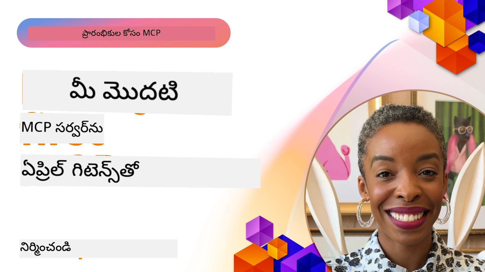

## ప్రారంభించడం  

_(ఈ పాఠం వీడియోను చూడటానికి పై చిత్రాన్ని క్లిక్ చేయండి)_

ఈ విభాగం పలుసార్లు పాఠాలనుంది:

- **1 మీ మొదటి సర్వర్**, ఈ మొదటి పాఠంలో, మీరు మీ మొదటి సర్వర్‌ను సృష్టించడం మరియు దాన్ని ఇన్స్పెక్టర్ టూల్తో పరిశీలించడం నేర్చుకుంటారు, ఇది మీ సర్వర్‌ను పరీక్షించే మరియు డీబగ్ చేయడానికి విలువైన పద్ధతి, [పాఠానికి](01-first-server/README.md)

- **2 క్లయింట్**, ఈ పాఠంలో, మీరు మీ సర్వర్‌కు కనెక్ట్ అవగలిగే క్లయింట్‌ను ఎలా రాయాలో నేర్చుకుంటారు, [పాఠానికి](02-client/README.md)

- **3 LLM తో క్లయింట్**, క్లయింట్ రాయడానికి ఇంకా మంచి పద్ధతి అది LLM ని జోడించడం, తద్వారా అది మీ సర్వర్‌తో "నెగోషియేట్" చేయగలదు ఏమి చేయాలో, [పాఠానికి](03-llm-client/README.md)

- **4 Visual Studio Code లో GitHub Copilot ఏజెంట్ మోడ్ ఉపయోగించి సర్వర్‌ను పరస్పర క్రియాశీలంగా ఉపయోగించడం**. ఇక్కడ మనం Visual Studio Code లో నుండే మన MCP సర్వర్ నడపడం చూస్తున్నాము, [పాఠానికి](04-vscode/README.md)

- **5 stdio ట్రాన్స్‌పోర్ట్ సర్వర్** stdio ట్రాన్స్‌పోర్ట్ స్థానిక MCP సర్వర్-క్లయింట్ కమ్యూనికేషన్ కోసం సిఫార్సు చేయబడిన ప్రామాణికం, బిల్ట్-ఇన్ ప్రాసెస్ ఐసోలేషన్‌తో కూడిన సురక్షిత ఉపప్రాసెస్ ఆధారిత కమ్యూనికేషన్ అందిస్తుంది [పాఠానికి](05-stdio-server/README.md)

- **6 MCP తో HTTP స్ట్రీమింగ్ (Streamable HTTP)**. ప్రామాణిక
	దూర ట్రాన్స్‌పోర్ట్ గురించి తెలుసుకోండి [MCP స్పెసిఫికేషన్ 2026-07-28](https://modelcontextprotocol.io/specification/2026-07-28/basic/transports/streamable-http)
	తదుపరి పాఠంలో మిగిలిన సవరించబడిన సెషన్ ఆధారిత అమలు.
	[పాఠానికి](06-http-streaming/README.md)

- **7 VSCode కోసం AI టూల్‌కిట్ ఉపయోగించడం** మీ MCP క్లయింట్లు మరియు సర్వర్‌లను ఉపయోగించి పరీక్షించడానికి [పాఠానికి](07-aitk/README.md)

- **8 పరీక్షించడం**. ఇక్కడ మనం బహుముఖంగా మన సర్వర్ మరియు క్లయింట్ పరీక్షించడంపై దృష్టి సారిస్తాము, [పాఠానికి](08-testing/README.md)

- **9 డిప్లాయ్‌మెంట్**. ఈ అధ్యాయం మీ MCP పరిష్కారాలను విభిన్న రీతుల్లో ఎలా పంపిణీ చేయాలో చూస్తుంది, [పాఠానికి](09-deployment/README.md)

- **10 అధునాతన సర్వర్ వాడకం**. ఈ అధ్యాయం అధునాతన సర్వర్ వాడకాన్ని కవర్ చేస్తుంది, [పాఠానికి](./10-advanced/README.md)

- **11 ధృవీకరణ**. ఈ అధ్యాయం సులభమైన ధృవీకరణను Basic Auth నుండి JWT మరియు RBAC వాడకంలో ఎలా జోడించాలో వివరించుతుంది. మీరు ఇక్కడ మొదలు పెట్టడానికి ప్రోత్సహించబడతారు మరియు తర్వాత అధ్యాయం 5 లో ఉన్న అధునాతన అంశాలు మరియు అధ్యాయం 2 లో సిఫార్సు చేసిన అదనపు భద్రతా బలోపేతానికి చూడండి, [పాఠానికి](./11-simple-auth/README.md)

- **12 MCP హోస్ట్స్**. Claude Desktop, Cursor, Cline, మరియు Windsurf వంటి ప్రముఖ MCP హోస్ట్ క్లయింట్లతో కాన్ఫిగర్ చేసి ఉపయోగించడం. ట్రాన్స్‌పోర్ట్ రకాలూ, సమస్య పరిష్కారాలు నేర్చుకోండి, [పాఠానికి](./12-mcp-hosts/README.md)

- **13 MCP ఇన్స్పెక్టర్**. MCP ఇన్స్పెక్టర్ టూల్ ఉపయోగించి మీ MCP సర్వర్‌లను అంతర్రాష్ట్రంగా డీబగ్ చేసి పరీక్షించండి. టూల్స్, వనరులు, మరియు ప్రోటోకాల్ సందేశాలను పరిష్కరించడం నేర్చుకోండి, [పాఠానికి](./13-mcp-inspector/README.md)

- **14 సాంప్లింగ్**. `2025-11-25` కోసం లెగసీ సాంప్లింగ్ ప్రిమిటివ్ను నేర్చుకోండి మరియు
	ఎలా కొత్త డిజైన్లు నేరుగా LLM ప్రొవైడర్ ఇంటిగ్రేషన్‌కు మార్చాలో తెలుసుకోండి. సాంప్లింగ్
	MCP `2026-07-28`లో డిప్రికేటెడ్ అయింది. [పాఠానికి](./14-sampling/README.md)

- **15 MCP యాప్స్**. UI సూచనలతో కూడిన MCP సర్వర్లను సృష్టించండి, [పాఠానికి](./15-mcp-apps/README.md)

Model Context Protocol (MCP) అనేది ఒక ఓపెన్ ప్రోటోకాల్, ఇది ప్రధానంగా AI అనువర్తనాలు LLM లకు ప్రాసంగిక సమాచారాన్ని ఎలా అందించాలో ప్రమాణీకరిస్తుంది. MCP ని AI అనువర్తనాల కోసం USB-C పోర్ట్ లాగా భావించండి - ఇది AI నమూనాలను వివిధ డేటా మూలాలు మరియు టూల్లకు కనెక్ట్ చేయడానికి ఒక ప్రమాణీకరించిన మార్గాన్ని అందిస్తుంది.

## అభ్యాస లక్ష్యాలు

ఈ పాఠం చివరగా, మీరు చేయగలుగుతారు:

- C#, Java, Python, TypeScript, మరియు JavaScript లో MCP కోసం అభివృద్ధి వాతావరణాలు సిద్ధం చేయండి
- సంప్రదాయ MCP సర్వర్ లను ప్రత్యేక ఫీచర్లతో (సంసాధనలు, ప్రాంప్ట్‌లు, టూల్స్) నిర్మించి డిప్లాయ్ చేయండి
- MCP సర్వర్లకు కనెక్ట్ అయ్యే హోస్ట్ అనువర్తనాలు సృష్టించండి
- MCP అమలు పరీక్షించి డీబగ్ చేయండి
- సాధారణ సెటప్ సమస్యలు మరియు వాటి పరిష్కారాలను అర్థం చేసుకోండి
- మీ MCP అమలును ప్రముఖ LLM సేవలకు కనెక్ట్ చేయండి

## మీ MCP వాతావరణం ఏర్పాటు చేయడం

MCP తో పని చేయడం మొదలు పెట్టేముందు, మీ అభివృద్ధి వాతావరణం సన్నద్ధం చేయడం మరియు ప్రాథమిక వర్క్‌ఫ్లో అర్థం చేసుకోవడం ముఖ్యంగా ఉంటుంది. ఈ విభాగం మీరు సక్రమమైన ప్రారంభానికి అవసరమైన ప్రారంభ సెటప్ దశలను 안내 చేస్తుంది.

### ముందస్తు అవసరాలు

MCP అభివృద్ధిలోకి దిగేముందు, మీరు కింది వాటిని కలిగి ఉండాలి:

- **అభివృద్ధి వాతావరణం**: మీ ఎంచుకున్న భాష (C#, Java, Python, TypeScript, లేదా JavaScript)
- **IDE/ఎడిటర్**: Visual Studio, Visual Studio Code, IntelliJ, Eclipse, PyCharm, లేదా ఏ ఆధునిక కోడ్ ఎడిటర్
- **ప్యాకేజీ మేనేజర్లు**: NuGet, Maven/Gradle, pip, లేదా npm/yarn
- **API కీలు**: మీరు హోస్ట్ అనువర్తనాలలో ఉపయోగించే ఏ AI సేవల కోసం

### అధికారిక SDK లు

రాబోయే అధ్యాయాలలో మీరు Python, TypeScript,
Java మరియు .NET వాడిన పరిష్కారాలను చూస్తారు. ఇవి అధికారిక SDK లు.

MCP `2026-07-28` సపోర్ట్ SDKలు భాషకు అనుగుణంగా స్వతంత్రంగా విడుదల అవుతున్నాయి.
ఉదాహరణ ఒకదాన్ని నడపేముందు, దాని ప్యాకేజీ వెర్షన్ మరియు SDK విడుదల నోట్లను చూసి
మద్దతు ఇచ్చే ప్రోటోకాల్ సంస్కరణలను నిర్ధారించండి. చూడండి
[అధికారం ఉన్న SDK జాబితా](https://modelcontextprotocol.io/docs/sdk):
- [C# SDK](https://github.com/modelcontextprotocol/csharp-sdk) - Microsoft తో కలిసి నిర్వహణలో
- [Java SDK](https://github.com/modelcontextprotocol/java-sdk) - Spring AI తో కలిసి నిర్వహణలో
- [TypeScript SDK](https://github.com/modelcontextprotocol/typescript-sdk) - అధికారిక TypeScript అమలు
- [Python SDK](https://github.com/modelcontextprotocol/python-sdk) - అధికారిక Python అమలు (FastMCP)
- [Kotlin SDK](https://github.com/modelcontextprotocol/kotlin-sdk) - అధికారిక Kotlin అమలు
- [Swift SDK](https://github.com/modelcontextprotocol/swift-sdk) - Loopwork AI తో కలిసి నిర్వహణలో
- [Rust SDK](https://github.com/modelcontextprotocol/rust-sdk) - అధికారిక Rust అమలు
- [Go SDK](https://github.com/modelcontextprotocol/go-sdk) - అధికారిక Go అమలు

## ముఖ్యమైన అంశాలు

- MCP అభివృద్ధి వాతావరణం ఏర్పాటు భాషా-ప్రత్యేక SDKలతో సులభం
- MCP సర్వర్‌ని నిర్మించడం అనగా స్పష్టమైన స్కీమాలతో టూల్స్ సృష్టించడం మరియు నమోదు చేయడం
- MCP క్లయింట్లు సర్వర్లు మరియు మోడళ్లకు కనెక్ట్ అవుతూ విస్తృత సామర్ధ్యాలను ఉపయోగిస్తాయి
- MCP అమలుల విశ్వసనీయత కోసం పరీక్షలు మరియు డీబగింగ్ అవసరం
- డిప్లాయ్‌మెంట్ ఎంపికలు స్థానిక అభివృద్ధి నుండి క్లౌడ్ తయారీ పరిష్కారాల వరకు ఉంటాయి

## అభ్యాసం

ఈ అన్ని అధ్యాయాల్లో మీరు చూసే వ్యాయామాలకు అనుగుణంగా కొన్ని నమూనాలు మన వద్ద ఉన్నాయి. అదనంగా ప్రతి అధ్యాయానికి తమ స్వంత వ్యాయామాలు మరియు పనులు ఉన్నాయి

- [Java క్యాల్క్యులేటర్](./samples/java/calculator/README.md)
- [.NET క్యాల్క్యులేటర్](../../../03-GettingStarted/samples/csharp)
- [JavaScript క్యాల్క్యులేటర్](./samples/javascript/README.md)
- [TypeScript క్యాల్క్యులేటర్](./samples/typescript/README.md)
- [Python క్యాల్క్యులేటర్](../../../03-GettingStarted/samples/python)

## అదనపు వనరులు

- [Azure పై Model Context Protocol ఉపయోగించి ఏజెంట్లను నిర్మించడం](https://learn.microsoft.com/azure/developer/ai/intro-agents-mcp)
- [Azure కంటెయినర్ యాప్స్ తో రిమోట్ MCP (Node.js/TypeScript/JavaScript)](https://learn.microsoft.com/samples/azure-samples/mcp-container-ts/mcp-container-ts/)
- [.NET OpenAI MCP ఏజెంట్](https://learn.microsoft.com/samples/azure-samples/openai-mcp-agent-dotnet/openai-mcp-agent-dotnet/)

## తదుపరి ఏమిటి

మొదటి పాఠంతో ప్రారంభించండి: [మీ మొదటి MCP సర్వర్ సృష్టించడం](01-first-server/README.md)

ఈ మాడ్యూల్ పూర్తి చేసిన తర్వాత, కొనసాగండి: [మాడ్యూల్ 4: ప్రాయోగిక అమలు](../04-PracticalImplementation/README.md)

---

<!-- CO-OP TRANSLATOR DISCLAIMER START -->
**అస్వీకరణ**:
ఈ పత్రం AI అనువాద సేవ [Co-op Translator](https://github.com/Azure/co-op-translator) ఉపయోగించి అనువదించబడింది. మేము ఖచ్చితత్వానికి ప్రయత్నిస్తున్నప్పటికీ, ఆటోమేటెడ్ అనువాదాలు తప్పులు లేదా అసమగ్రతలను కలిగి ఉండవచ్చు. దాని స్వదేశ భాషలో ఉన్న అసలు పత్రాన్ని అధికారం కలిగిన మూలంగా పరిగణించాలి. కీలకమైన సమాచారం కోసం, ప్రొఫెషనల్ మానవ అనువాదాన్ని సిఫారసు చేస్తాము. ఈ అనువాదం ఉపయోగం వల్ల కలిగే ఏవైనా అపార్థాలు లేదా తప్పుదారులు కోసం మేము బాధ్యత వహించము.
<!-- CO-OP TRANSLATOR DISCLAIMER END -->