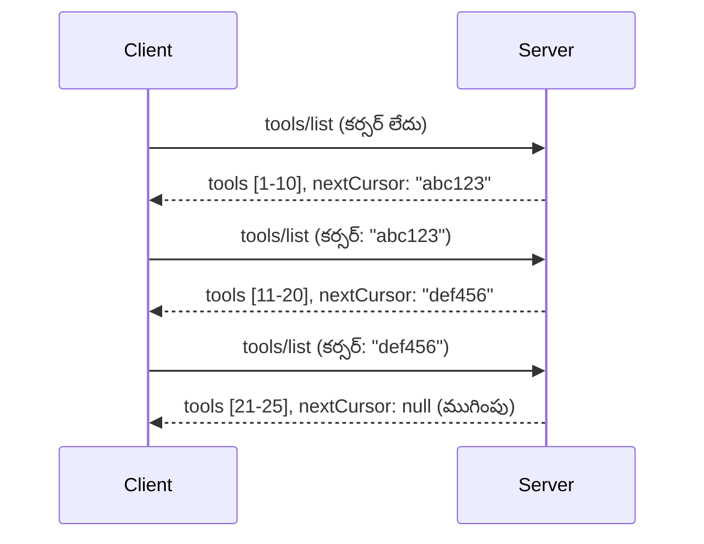

# MCPలో పేజినేషన్ మరియు పెద్ద ఫలితం సెట్‌లు

మీ MCP సర్వర్ పెద్ద డేటాసెట్లను నిర్వహించినప్పుడు - వేలాది ఫైళ్ళు, డేటాబేస్ రికార్డులు లేదా శోధన ఫలితాలను జాబితా చేయాలనుకుంటే - మీరు మెమోరీని సమర్థవంతంగా నిర్వహించడానికి మరియు స్పందనాత్మక యూజర్ అనుభవాలను అందించడానికి పేజినేషన్ అవసరం. ఈ గైడ్ MCPలో పేజినేషన్‌ను ఎలా అమలు చేయాలని మరియు ఉపయోగించాలో వివరిస్తుంది.

## పేజినేషన్ ఎందుకు ముఖ్యమైంది

పేజినేషన్ లేకపోతే, పెద్ద సమాధానాలు ఈ సమస్యలు కలగజేస్తాయి:

- **మెమొరీ కల్లోనం** - ఒకేసారి లక్షల సంఖ్యలో రికార్డులు లోడ్ చేస్తే
- **స్పందన సమయాలు నెమ్మదవడం** - అన్ని డేటా లోడ్ అయ్యేవరకు యూజర్లు వేచి ఉండాలి
- **టైమవుట్ లోపాలు** - అభ్యర్థనలు టైమవుట్ పరిమితులను మించి పోతాయి
- **తప్పు AI పనితీరు** - పెద్ద పరిసరంతో LLMలు ఇబ్బంది పడతాయి

MCP ఫలితాల సెట్‌లను నమ్మకదాయకంగా, నిరంతరంగా పేజింగ్ చేయడానికి **కర్సర్ ఆధారిత పేజినేషన్** ఉపయోగిస్తుంది.

---

## MCPలో పేజినేషన్ ఎలా పనిచేస్తుంది

### కర్సర్ కాన్సెప్ట్

ఒక **కర్సర్** అనేది ఫలితాల సెట్‌లో మీ స్థానాన్ని గుర్తించే అన్య రహస్యమైన స్ట్రింగ్. దీన్ని పొడవైన పుస్తకం లో ఒక బుక్‌మార్క్ లాగా గమనించండి.



### MCP మెథడ్లలో పేజినేషన్

ఈ MCP మెథడ్లు పేజినేషన్‌కు మద్దతు ఇస్తాయి:

| మెథడ్ | ఫలితాలు | కర్సర్ మద్దతు |
|--------|---------|----------------|
| `tools/list` | టూల్ నిర్వచనాలు | ✅ |
| `resources/list` | వనరు నిర్వచనాలు | ✅ |
| `prompts/list` | ప్రాంప్ట్ నిర్వచనాలు | ✅ |
| `resources/templates/list` | వనరు టెంప్లేట్లు | ✅ |

---

## సర్వర్ అమలు

### పైథాన్ (FastMCP)

```python
from mcp.server import Server
from mcp.types import Tool, ListToolsResult
import math

app = Server("paginated-server")

# అనుకరించిన భారీ డేటాసెట్
ALL_TOOLS = [
    Tool(name=f"tool_{i}", description=f"Tool number {i}", inputSchema={})
    for i in range(100)
]

PAGE_SIZE = 10

@app.list_tools()
async def list_tools(cursor: str | None = None) -> ListToolsResult:
    """List tools with pagination support."""
    
    # ప్రారంభ సూచిక పొందడానికి కర్సర్ డీకోడ్ చేయండి
    start_index = 0
    if cursor:
        try:
            start_index = int(cursor)
        except ValueError:
            start_index = 0
    
    # ఫలితాల పేజీని పొందండి
    end_index = min(start_index + PAGE_SIZE, len(ALL_TOOLS))
    page_tools = ALL_TOOLS[start_index:end_index]
    
    # తదుపరి కర్సర్ ను లెక్కించండి
    next_cursor = None
    if end_index < len(ALL_TOOLS):
        next_cursor = str(end_index)
    
    return ListToolsResult(
        tools=page_tools,
        nextCursor=next_cursor
    )
```

### టైప్‌స్క్రిప్ట్

```typescript
import { Server } from "@modelcontextprotocol/sdk/server/index.js";
import { ListToolsResultSchema } from "@modelcontextprotocol/sdk/types.js";

const server = new Server({
  name: "paginated-server",
  version: "1.0.0"
});

// అనుకరణ పెద్ద డేటాసెట్
const ALL_TOOLS = Array.from({ length: 100 }, (_, i) => ({
  name: `tool_${i}`,
  description: `Tool number ${i}`,
  inputSchema: { type: "object", properties: {} }
}));

const PAGE_SIZE = 10;

server.setRequestHandler(ListToolsResultSchema, async (request) => {
  // కర్సర్ డీకోడ్ చేయండి
  let startIndex = 0;
  if (request.params?.cursor) {
    startIndex = parseInt(request.params.cursor, 10) || 0;
  }
  
  // ఫలితాల పేజీ పొందండి
  const endIndex = Math.min(startIndex + PAGE_SIZE, ALL_TOOLS.length);
  const pageTools = ALL_TOOLS.slice(startIndex, endIndex);
  
  // తదుపరి కర్సర్ లెక్కించండి
  const nextCursor = endIndex < ALL_TOOLS.length ? String(endIndex) : undefined;
  
  return {
    tools: pageTools,
    nextCursor
  };
});
```

### జావా (Spring MCP)

```java
@Service
public class PaginatedToolService {
    
    private static final int PAGE_SIZE = 10;
    private final List<Tool> allTools;
    
    public PaginatedToolService() {
        // పెద్ద డేటాసెట్‌ను ప్రారంభించండి
        this.allTools = IntStream.range(0, 100)
            .mapToObj(i -> new Tool("tool_" + i, "Tool number " + i, Map.of()))
            .collect(Collectors.toList());
    }
    
    @McpMethod("tools/list")
    public ListToolsResult listTools(@Param("cursor") String cursor) {
        // కర్సర్‌ను డీకోడ్ చేయండి
        int startIndex = 0;
        if (cursor != null && !cursor.isEmpty()) {
            try {
                startIndex = Integer.parseInt(cursor);
            } catch (NumberFormatException e) {
                startIndex = 0;
            }
        }
        
        // ఫలితాల పేజీ పొందండి
        int endIndex = Math.min(startIndex + PAGE_SIZE, allTools.size());
        List<Tool> pageTools = allTools.subList(startIndex, endIndex);
        
        // తదుపరి కర్సర్‌ని లెక్కించండి
        String nextCursor = endIndex < allTools.size() ? String.valueOf(endIndex) : null;
        
        return new ListToolsResult(pageTools, nextCursor);
    }
}
```

---

## క్లయింట్ అమలు

### పైథాన్ క్లయింట్

```python
from mcp import ClientSession

async def get_all_tools(session: ClientSession) -> list:
    """Fetch all tools using pagination."""
    all_tools = []
    cursor = None
    
    while True:
        result = await session.list_tools(cursor=cursor)
        all_tools.extend(result.tools)
        
        if result.nextCursor is None:
            break
        cursor = result.nextCursor
    
    return all_tools

# ఉపయోగం
async with client_session as session:
    tools = await get_all_tools(session)
    print(f"Found {len(tools)} tools")
```

### టైప్‌స్క్రిప్ట్ క్లయింట్

```typescript
import { Client } from "@modelcontextprotocol/sdk/client/index.js";

async function getAllTools(client: Client): Promise<Tool[]> {
  const allTools: Tool[] = [];
  let cursor: string | undefined = undefined;
  
  do {
    const result = await client.listTools({ cursor });
    allTools.push(...result.tools);
    cursor = result.nextCursor;
  } while (cursor);
  
  return allTools;
}

// ఉపయోగం
const tools = await getAllTools(client);
console.log(`Found ${tools.length} tools`);
```

### లేజీ లోడింగ్ నమూనా

చాలా పెద్ద డేటాసెట్ల కోసం, అవసరం పడినప్పుడు పేజీలను లోడ్ చేయండి:

```python
class PaginatedToolIterator:
    """Lazily iterate through paginated tools."""
    
    def __init__(self, session: ClientSession):
        self.session = session
        self.cursor = None
        self.buffer = []
        self.exhausted = False
    
    async def __anext__(self):
        # బ్యుఫర్ అందుబాటులో ఉన్నట్లయితే తిరిగి పంపండి
        if self.buffer:
            return self.buffer.pop(0)
        
        # మేము అన్ని పేజీలను పూర్తిగా ఉపయోగించామో లేదో తనిఖీ చేయండి
        if self.exhausted:
            raise StopAsyncIteration
        
        # తదుపరి పేజీని తీసుకోండి
        result = await self.session.list_tools(cursor=self.cursor)
        self.buffer = list(result.tools)
        self.cursor = result.nextCursor
        
        if self.cursor is None:
            self.exhausted = True
        
        if not self.buffer:
            raise StopAsyncIteration
        
        return self.buffer.pop(0)
    
    def __aiter__(self):
        return self

# ఉపయోగం - పెద్ద డేటాసెట్‌ల కోసం మెమరీ ప్రయోజనకరమైనది
async for tool in PaginatedToolIterator(session):
    process_tool(tool)
```

---

## వనరులకు పేజినేషన్

డైరెక్టరీలు లేదా పెద్ద డేటాసెట్లకు వనరులు సాధారణంగా పేజినేషన్ అవసరం:

```python
from mcp.server import Server
from mcp.types import Resource, ListResourcesResult
import os

app = Server("file-server")

@app.list_resources()
async def list_resources(cursor: str | None = None) -> ListResourcesResult:
    """List files in directory with pagination."""
    
    directory = "/data/files"
    all_files = sorted(os.listdir(directory))
    
    # కర్సర్ డీకోడ్ చేయండి (ఫైల్ సూచిక)
    start_index = int(cursor) if cursor else 0
    page_size = 20
    end_index = min(start_index + page_size, len(all_files))
    
    # ఈ పేజీకి వనరు జాబితాను సృష్టించండి
    resources = []
    for filename in all_files[start_index:end_index]:
        filepath = os.path.join(directory, filename)
        resources.append(Resource(
            uri=f"file://{filepath}",
            name=filename,
            mimeType="application/octet-stream"
        ))
    
    # తదుపరి కర్సర్ లెక్కించండి
    next_cursor = str(end_index) if end_index < len(all_files) else None
    
    return ListResourcesResult(
        resources=resources,
        nextCursor=next_cursor
    )
```

---

## కర్సర్ డిజైన్ వ్యూహాలు

### వ్యూహం 1: సూచ్యకం ఆధారిత (సాధారణ)

```python
# కర్సర్ కేవలం సూచిక మాత్రమే
cursor = "50"  # అంశం 50 నుండి ప్రారంభించండి
```

**ప్రోస్:** సింపుల్, స్టేట్‌లెస్
**కౌన్స్:** ఐటెమ్స్ చేర్చడం/తీసివేత వల్ల ఫలితాలు మారుతాయి

### వ్యూహం 2: ID ఆధారిత (స్థిరమైన)

```python
# కర్సర్ అనేది చివరిగా చూసిన ID
cursor = "item_abc123"  # ఈ అంశం తరువాత ప్రారంభించండి
```

**ప్రోస్:** ఐటెమ్స్ మారినా స్థిరంగా ఉంటుంది
**కౌన్స్:** ఆర్డర్ చేసిన IDs అవసరం

### వ్యూహం 3: సంకేతీకృత పరిస్థితి (సంక్లిష్టమైన)

```python
import base64
import json

def encode_cursor(state: dict) -> str:
    return base64.b64encode(json.dumps(state).encode()).decode()

def decode_cursor(cursor: str) -> dict:
    return json.loads(base64.b64decode(cursor).decode())

# కర్సర్‌లో అనేక స్థితి ఫీల్డులు ఉంటాయి
cursor = encode_cursor({
    "offset": 50,
    "filter": "active",
    "sort": "name"
})
```

**ప్రోస్:** సంక్లిష్ట పరిస్థితిని సంకేతీకరించవచ్చు
**కౌన్స్:** ఎక్కువ సంక్లిష్టత, పెద్ద కర్సర్ స్ట్రింగులు

---

## ఉత్తమ ఆచారాలు

### 1. సరైన పేజీ పరిమాణాలు ఎంచుకోండి

```python
# డేటా పరిమాణాన్ని పరిగణించండి
PAGE_SIZE_SMALL_ITEMS = 100   # సులభమైన మెటాడేటా
PAGE_SIZE_MEDIUM_ITEMS = 20   # సమృద్ధి చెందిన వస్తువులు
PAGE_SIZE_LARGE_ITEMS = 5     # సంక్లిష్ట కంటెంట్
```

### 2. చెల్లని కర్సర్లను శ్రద్ధగా నిర్వహించండి

```python
@app.list_tools()
async def list_tools(cursor: str | None = None) -> ListToolsResult:
    try:
        start_index = int(cursor) if cursor else 0
        if start_index < 0 or start_index >= len(ALL_TOOLS):
            start_index = 0  # ప్రారంభానికి రీసెట్ చేయండి
    except (ValueError, TypeError):
        start_index = 0  # చెల్లని కర్సర్, కొత్తగా మొదలు చేయండి
    # ...
```

### 3. మొత్తం లెక్కను చేర్చండి (వైకల్పికం)

```python
return ListToolsResult(
    tools=page_tools,
    nextCursor=next_cursor,
    # కొంత అమలు UI పురోగతికి మొత్తం ను కలిగి ఉంటాయి
    _meta={"total": len(ALL_TOOLS)}
)
```

### 4. ఎడ్జ్ కేసులను పరీక్షించండి

```python
async def test_pagination():
    # ఖాళీ ఫలితం సెట్
    result = await session.list_tools()
    assert result.tools == []
    assert result.nextCursor is None
    
    # ఏకైక పేజీ
    result = await session.list_tools()
    assert len(result.tools) <= PAGE_SIZE
    
    # చెల్లని కర్సర్
    result = await session.list_tools(cursor="invalid")
    assert result.tools  # మొదటి పేజీని తిరిగి ఇవ్వాలి
```

---

## సాధారణ తప్పిదాలు

### ❌ అన్నీ ఫలితాలను తిరిగి ఇచ్చి తరువాత క్లయింట్-సైడ్‌లో పేజినేట్ చేయడం

```python
# చెడు: అన్ని 데이터를 జ్ఞాపకంలో లోడ్ చేస్తుంది
@app.list_tools()
async def list_tools() -> ListToolsResult:
    all_tools = load_all_tools()  # 1 మిలియన్ పరికరాలు!
    return ListToolsResult(tools=all_tools)
```

### ✅ డేటా మూలంలోనే పేజినేట్ చేయండి

```python
# మంచి: అవసరమైనది మాత్రమే లోడ్ అవుతుంది
@app.list_tools()
async def list_tools(cursor: str | None = None) -> ListToolsResult:
    offset = int(cursor) if cursor else 0
    tools = await db.query_tools(offset=offset, limit=PAGE_SIZE)
    return ListToolsResult(tools=tools, nextCursor=...)
```

---

## తరువాత ఏమిటి

- [Module 5.14 - Context Engineering](../../05-AdvancedTopics/mcp-contextengineering/README.md)
- [Module 8 - Best Practices](../../08-BestPractices/README.md)
- [3.8 - Testing Your MCP Server](../../03-GettingStarted/08-testing/README.md)

---

## అదనపు వనరులు

- [MCP స్పెసిఫికేషన్ - పేజినేషన్](https://modelcontextprotocol.io/specification/2026-07-28/)
- [కర్సర్-ఆధారిత పేజినేషన్ వివరణ](https://slack.engineering/evolving-api-pagination-at-slack/)
- [Python SDK పేజినేషన్ పరీక్షలు](https://github.com/modelcontextprotocol/python-sdk/blob/main/tests/client/test_list_methods_cursor.py)

---

<!-- CO-OP TRANSLATOR DISCLAIMER START -->
**అస్వీకరణ**:
ఈ పత్రం AI అనువాద సేవ [Co-op Translator](https://github.com/Azure/co-op-translator) ఉపయోగించి అనువదించబడింది. మేము ఖచ్చితత్వానికి ప్రయత్నిస్తున్నప్పటికీ, ఆటోమేటెడ్ అనువాదాలు తప్పులు లేదా అసమగ్రతలను కలిగి ఉండవచ్చు. దాని స్వదేశ భాషలో ఉన్న అసలు పత్రాన్ని అధికారం కలిగిన మూలంగా పరిగణించాలి. కీలకమైన సమాచారం కోసం, ప్రొఫెషనల్ మానవ అనువాదాన్ని సిఫారసు చేస్తాము. ఈ అనువాదం ఉపయోగం వల్ల కలిగే ఏవైనా అపార్థాలు లేదా తప్పుదారులు కోసం మేము బాధ్యత వహించము.
<!-- CO-OP TRANSLATOR DISCLAIMER END -->