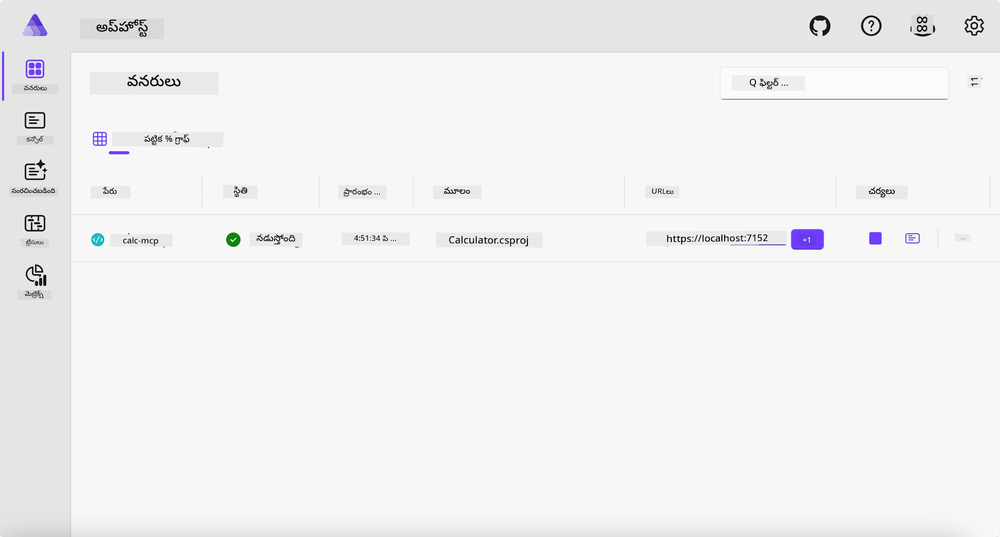
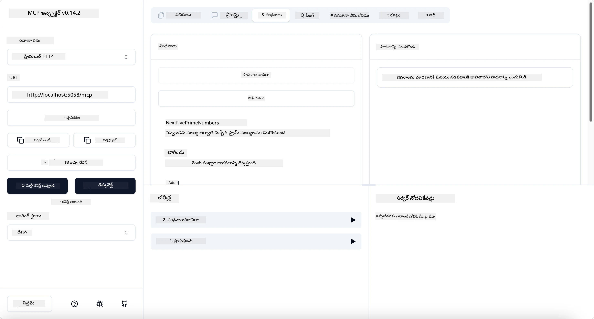
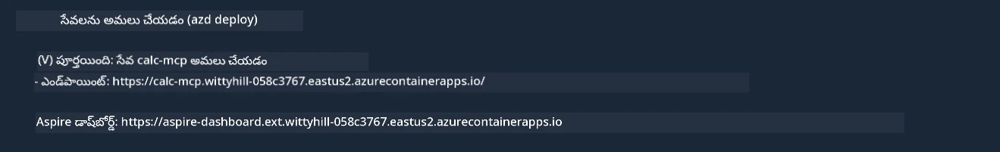

# ఉదాహరణ

మొదటి ఉదాహరణలో స్థానిక .NET ప్రాజెక్టును `stdio` రకం తో ఎలా ఉపయోగించాలో చూపబడింది. మరియు సర్వర్‌ను స్థానికంగా కంటైనర్‌లో ఎలా నడిపించాలో కూడా చూపబడింది. ఇది అనేక సందర్భాలలో మంచి పరిష్కారం. అయితే, సర్వర్‌ను క్లౌడ్ వాతావరణంలో లేదా రిమోట్‌గా నడిపించడం సహాయకరం అవుతుంది. అప్పుడు `http` రకం ఉపయోగపడుతుంది.

`04-PracticalImplementation` ఫోల్డర్‌లో పరిష్కారాన్ని చూస్తే, అది ముందు ఉన్న దానికంటే కాస్త క్లిష్టంగా కనిపించవచ్చు. కానీ వాస్తవానికి అంత కష్టం కాదు. ప్రాజెక్టు `src/Calculator` ను మెచ్చగా పరిశీలిస్తే, దీని కోడ్ ఎక్కువగా ముందటి ఉదాహరణతో సమానంగా ఉంటుంది. తేడా ఏమిటంటే HTTP అభ్యర్థనలను నిర్వహించడానికి మేము వేరే లైబ్రరీ `ModelContextProtocol.AspNetCore` ను ఉపయోగిస్తున్నాం. మరియు `IsPrime` మెథడ్ ని ప్రైవేట్గా మార్చాము, ఇది మీ కోడ్‌లో ప్రైవేట్ మెథడ్స్ ఉండవచ్చునని చూపించేందుకు మాత్రమే. మిగతా కోడ్ అలాగే ఉంది.

ఇతర ప్రాజెక్టులు [Aspire](https://aspire.dev/get-started/what-is-aspire/) నుండి వచ్చాయి. పరిష్కారంలో Aspire ఉండటం వలన డెవలపర్ అనుభవం మెరుగవుతుంది, అభివృద్ధి, పరీక్షలలో సహాయం చేస్తుంది మరియు పరిశీలనలో సౌలభ్యం కల్పిస్తుంది. సర్వర్ నడపడానికి ఇది తప్పనిసరి కాదు, కానీ మీ పరిష్కారంలో దీన్ని కలిగి ఉండటం మంచి ఆచారం.

## సర్వర్ ను స్థానికంగా ప్రారంభించండి

1. VS కోడ్ (C# DevKit ఎక్స్‌టెన్షన్ తో) నుంచి `04-PracticalImplementation/samples/csharp` డైరెక్టరీకి వెళ్ళండి.
1. సర్వర్ ప్రారంభించేందుకు క్రింది కమాండ్ ను అమలు చేయండి:

   ```bash
    dotnet watch run --project ./src/AppHost
   ```

1. ఒక వెబ్ బ్రౌజర్ Aspire డాష్‌బోర్డ్ను తెరవగానే, `http` URL నోటు చేసుకోండి. అది సాధారణంగా `http://localhost:5058/` లాగా ఉంటుంది.

   

## MCP ఇన్‌స్పెక్టర్ తో Streamable HTTP ను పరీక్షించండి

మీ వద్ద Node.js 22.7.5 లేదా అంతకంటే పై వర్షన్ ఉంటే, MCP ఇన్‌స్పెక్టర్‌తో సర్వర్‌ని పరీక్షించవచ్చును.

సర్వర్ ప్రారంభించి టెర్మినల్లో క్రింది కమాండ్‌ను అమలు చేయండి:

```bash
npx @modelcontextprotocol/inspector http://localhost:5058
```



- ట్రాన్స్‌పోర్ట్ రకంగా `Streamable HTTP` ను ఎంచుకోండి.
- Url ఫీల్డ్‌లో ముందుగా చూసుకున్న సర్వర్ URL ఇవ్వండి, చివరగా `/mcp` జోడించండి. అది `http` (కాదు `https`) ఉండాలి, ఉదాహరణకు `http://localhost:5058/mcp`.
- Connect బటనును ఎంచుకోండి.

ఇన్‌స్పెక్టర్ అందించే మంచి విషయం ఏమిటంటే ఇది జరుగుతున్నది ఏంటో బాగా ఫలితం చూపిస్తుంది.

- అందుబాటులో ఉన్న టూల్స్ జాబితాను చూసి చూడు
- వాటిలో కొన్ని ప్రయత్నించండి, అవి ఇలాగే పనిచేస్తాయని చూపుతుంది.

## VS కోడ్‌లో GitHub Copilot చాట్‌తో MCP సర్వర్ ని పరీక్షించండి

Streamable HTTP ట్రాన్స్‌పోర్ట్‌ను GitHub Copilot చాట్‌తో ఉపయోగించేందుకు, ముందుగా సృష్టించిన `calc-mcp` సర్వర్ సెట్టింగ్స్ ఈ విధంగా మార్చండి:

```jsonc
// .vscode/mcp.json
{
  "servers": {
    "calc-mcp": {
      "type": "http",
      "url": "http://localhost:5058/mcp"
    }
  }
}
```

కొంత పరీక్షించండి:

- "6780 తర్వాత 3 ప్రైమ్ నంబర్స్ ఇవ్వి" అని అడగండి. Copilot, కొత్త టూల్స్ `NextFivePrimeNumbers` ఉపయోగించి మొదటి 3 ప్రైమ్ నంబర్స్ మాత్రమే ఇస్తుంది.
- "111 తర్వాత 7 ప్రైమ్ నంబర్స్ ఇవ్వి" అని అడగండి, ఏమి జరుగుతుందో చూడండి.
- "జాన్ దగ్గర 24 లోలీస్ ఉన్నాయి, అతను వాటిని తన 3 పిల్లలకు పంపాలనుకుంటున్నాడు. ప్రతి పిల్లకి ఎంత లోలీస్ వస్తాయి?" అని అడగండి, ఫలితం చూడండి.

## సర్వర్‌ను Azure కు డిప్లాయ్ చేయండి

మరిన్ని మంది ఉపయోగించేందుకు సర్వర్‌ను Azure కు డిప్లాయ్ చేద్దాం.

టెర్మినల్ నుండి `04-PracticalImplementation/samples/csharp` ఫోల్డర్‌కు వెళ్ళి క్రింది కమాండ్ ను అమలు చేయండి:

```bash
azd up
```

డిప్లాయ్ పూర్తిగా జరిగాక, మీకు ఈవిధంగా సందేశం కనిపిస్తుంది:



URLను పక్కన పెట్టుకుని MCP ఇన్‌స్పెక్టర్ మరియు GitHub Copilot చాట్లో ఉపయోగించండి.

```jsonc
// .vscode/mcp.json
{
  "servers": {
    "calc-mcp": {
      "type": "http",
      "url": "https://calc-mcp.gentleriver-3977fbcf.australiaeast.azurecontainerapps.io/mcp"
    }
  }
}
```

## తదుపరి ఏమిటి?

మేము విభిన్న ట్రాన్స్‌పోర్ట్ రకాలు మరియు టెస్టింగ్ టూల్స్ ప్రయత్నించాం. అలాగే MCP సర్వర్‌ను Azureకి డిప్లాయ్ చేశాం. కానీ మన సర్వర్‌ను ప్రైవేట్ రిసోర్సులకు యాక్సెస్ కావాలంటే? ఉదాహరణకు, డేటాబేస్ లేదా ప్రైవేట్ API? తదుపరి అధ్యాయంలో మనం మన సర్వర్ భద్రతను ఎలా మెరుగుపరుచుకోవచ్చో చూద్దాం.

---

<!-- CO-OP TRANSLATOR DISCLAIMER START -->
**అస్వీకరణ**:
ఈ పత్రం AI అనువాద సేవ [Co-op Translator](https://github.com/Azure/co-op-translator) ఉపయోగించి అనువదించబడింది. మేము ఖచ్చితత్వానికి ప్రయత్నిస్తున్నప్పటికీ, ఆటోమేటెడ్ అనువాదాలు తప్పులు లేదా అసమగ్రతలను కలిగి ఉండవచ్చు. దాని స్వదేశ భాషలో ఉన్న అసలు పత్రాన్ని అధికారం కలిగిన మూలంగా పరిగణించాలి. కీలకమైన సమాచారం కోసం, ప్రొఫెషనల్ మానవ అనువాదాన్ని సిఫారసు చేస్తాము. ఈ అనువాదం ఉపయోగం వల్ల కలిగే ఏవైనా అపార్థాలు లేదా తప్పుదారులు కోసం మేము బాధ్యత వహించము.
<!-- CO-OP TRANSLATOR DISCLAIMER END -->