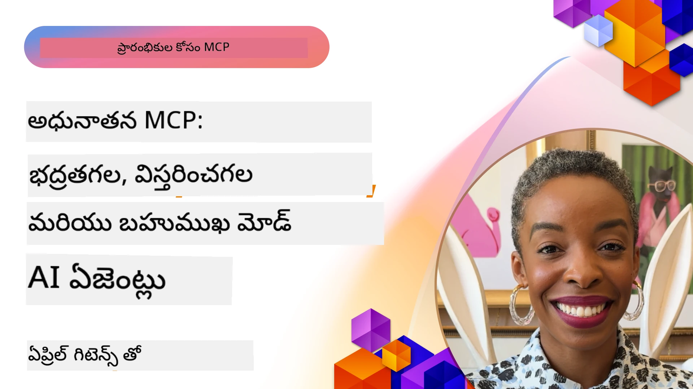

# MCPలో అధునాతన విషయాలు

_(ఈ పాఠం వీడియోను చూడడానికి పై చిత్రం పై క్లిక్ చేయండి)_

ఈ అధ్యాయం మోడల్ కాన్టెక్స్ట్ ప్రోటోకాల్ (MCP) అమలులో బహుముఖ అనుసంధానం, విస్తరణ సౌలభ్యం, సెక్యూరిటీ ఉత్తమ పద్ధతులు మరియు ఎంటర్‌ప్రైజ్ అనుసంధానంపై ఆధారిత ఒక శ్రేణి అధునాతన విషయాలను మనుగడ చేస్తుంది. ఆధునిక AI సిస్టమ్స్ అవసరాలను త‌ర‌చుగా నెరవేర్చగల, ప్రొడక్షన్-సిద్ధమైన MCP అప్లికేషన్లను నిర్మించడానికి ఇవి విపరీతంగా కీలకం.

## అవలోకనం

ఈ పాఠం మోడల్ కాన్టెక్స్ట్ ప్రోటోకాల్ అమలులో అధునాతన భావనలను అన్వేషిస్తుంది, బహు-మోడ్ అనుసంధానం, స్కేలబిలిటీ, సెక్యూరిటీ ఉత్తమ పద్దతులపై మరియు ఎంటర్‌ప్రైజ్ అనుసంధానంపై దృష్టిపెడుతుంది. ఎంటర్‌ప్రైజ్ వాతావరణాల్లోసంక్లిష్ట అవసరాలను నిర్వహించగల ప్రొడక్షన్-గ్రేడ్ MCP అప్లికేషన్ల నిర్మాణానికి ఈ అంశాలు అవసరం.

> **ప్రస్తుత స్పెసిఫికేషన్ నోట్:** MCP `2026-07-28` పాఠాలు 5.4 మరియు 5.6లో కవర్ అయిన రూట్స్ మరియు శాంప్లింగ్ ప్రిమిటివ్‌లను డిప్రికేట్ చేస్తుంది. ఇది ప్రోటోకాల్ ఫీచర్స్ (5.16)లో సూచించిన ప్రయోగాత్మక టాస్క్స్ ఫీచర్‌ను ప్రత్యేక టాస్క్స్ విస్తరణకు మార్చుతుంది. ఆ పాఠాలు వారసత్వ `2025-11-25` అమలు కోసం ఉంచబడ్డాయి మరియు మైగ్రేషన్ మార్గదర్శకత్వాన్ని కలిగి ఉంటాయి. వివరాలకు [MCPలో ఏమి మారింది: 2026-07-28 స్పెసిఫికేషన్](../01-CoreConcepts/mcp-2026-07-28.md) చూడండి.

## నేర్చుకోవాల్సిన లక్ష్యాలు

ఈ పాఠం ముగింపు నాటికి, మీరు చేయగలుగుతారు:

- MCP ఫ్రేమ్‌వర్క్‌లలో బహుమోడి సామర్థ్యాలను అమలు చేయడం
- అధిక డిమాండ్ సందర్భాల కోసం MCP నిర్మాణాలను విస్తరించదగినట్టు డిజైన్ చేయడం
- MCP సెక్యూరిటీ సూత్రాలతో సరిపడే సెక్యూరిటీ ఉత్తమ పద్ధతులను వర్తించడం
- MCPని ఎంటర్‌ప్రైజ్ AI సిస్టమ్స్ మరియు ఫ్రేమ్‌వర్క్‌లతో అనుసంధానం చేయడం
- ప్రొడక్షన్ వాతావరణాలలో పనితీరు మరియు విశ్వసనీయతను ఆప్టిమైజ్ చేయడం

## పాఠాలు మరియు నమూనా ప్రాజెక్టులు

| లింక్ | శీర్షిక | వివరణ |
|------|-------|-------------|
| [5.1 అన్ని Azureతో అనుసంధానం](./mcp-integration/README.md) | Azureతో అనుసంధానం | మీ MCP సర్వర్‌ను Azureపై అనుసంధానించడం నేర్చుకోండి |
| [5.2 బహు-మోడ్ సాంపుల్](./mcp-multi-modality/README.md) | MCP బహు మోడ్ సాంప్ల్స్  | ఆడియో, చిత్రం మరియు బహు మోడ్ ప్రతిస్పందనకు నమూనాలు |
| [5.3 MCP OAuth2 సాంపుల్](../../../05-AdvancedTopics/mcp-oauth2-demo) | MCP OAuth2 డెమో | MCPతో OAuth2ని ప్రదర్శించే తక్కువ Spring Boot app, అధీకారం మరియు రిసోర్స్ సర్వర్‌గా. సురక్షిత టోకెన్ ఇష్యూ, రక్షిత ఎండ్‌పాయింట్లు, Azure కంటైనర్ యాప్స్ డిప్లాయ్‌మెంట్, మరియు API మేనేజ్మెంట్ అనుసంధానం చూపిస్తుంది. |
| [5.4 రూట్ కాన్టెక్స్ట్‌లు](./mcp-root-contexts/README.md) | రూట్ కాన్టెక్స్ట్‌లు  | వారసత్వ `2025-11-25` రూట్స్ ప్రిమిటివ్ మరియు ప్రస్తుత మైగ్రేషన్ ఎంపికలను నేర్చుకోండి (`2026-07-28` లో డిప్రికేట్). |
| [5.5 రూటింగ్](./mcp-routing/README.md) | రూటింగ్ | రూటింగ్ రకాలు తెలుసుకోండి |
| [5.6 శాంప్లింగ్](./mcp-sampling/README.md) | శాంప్లింగ్ | వారసత్వ `2025-11-25` శాంప్లింగ్ ప్రిమిటివ్ మరియు ప్రస్తుత మైగ్రేషన్ ఎంపికలను నేర్చుకోండి (`2026-07-28` లో డిప్రికేట్). |
| [5.7 స్కేలింగ్](./mcp-scaling/README.md) | స్కేలింగ్  | స్కేలింగ్ గురించి తెలుసుకోండి |
| [5.8 సెక్యూరిటీ](./mcp-security/README.md) | సెక్యూరిటీ  | మీ MCP సర్వర్ సురక్షితంగా ఉంచండి |
| [5.9 వెబ్ శోధన సాంపుల్](./web-search-mcp/README.md) | వెబ్ శోధన MCP | SerpAPIతో సమకాలిక వెబ్, వార్తలు, ఉత్పత్తి శోధన మరియు ప్రశ్నోత్తరాలకు Python MCP సర్వర్ మరియు క్లయింట్ అనుసంధానం. బహు-సాధనం సమన్వయం, బయటి API అనుసంధానం, మరియు బలమైన లోపాల నిర్వహణ చూపిస్తుంది. |
| [5.10 సమకాలిక స్ట్రీమింగ్](./mcp-realtimestreaming/README.md) | స్ట్రీమింగ్  | సమకాలిక డేటా స్ట్రీమింగ్ ఈ కాలంలోని డేటా-ఆధారిత ప్రపంచంలో అవసరం అయింది, వ్యాపారాలు మరియు అప్లికేషన్లు తక్షణ సమాచారం అవసరాన్ని తీర్చడానికి.|
| [5.11 సమకాలిక వెబ్ శోధన](./mcp-realtimesearch/README.md) | వెబ్ శోధన | MCP ఎలా సమకాలిక వెబ్ శోధనను సంపూర్ణ సర్వైల్ చేసిన దృక్పథంతో AI మోడల్స్, శోధన ఇంజెన్లు మరియు అప్లికేషన్లకు సాందర్భం నిర్వహణను అందిస్తుంది. | 
| [5.12 మోడల్ కాన్టెక్స్ట్ ప్రోటోకాల్ సర్వర్‌ల కోసం ఎంట్రా ID ధృవీకరణ](./mcp-security-entra/README.md) | ఎంట్రా ID ధృవీకరణ | మైక్రోసాఫ్ట్ ఎంట్రా ID ఒక బలమైన క్లౌడ్-ఆధారిత గుర్తింపు మరియు యాక్సెస్ నిర్వహణ పరిష్కారాన్ని అందిస్తుంది, మీ MCP సర్వర్‌తో సంబంధం పెట్టుకొనే అనుమతించబడిన వినియోగదారులు మరియు అప్లికేషన్లను మాత్రమే ఇచ్చేలా సహాయపడుతుంది.|
| [5.13 మైక్రోసాఫ్ట్ ఫౌండ్రి ఏజెంట్ అనుసంధానం](./mcp-foundry-agent-integration/README.md) | మైక్రోసాఫ్ట్ ఫౌండ్రి అనుసంధానం | మోడల్ కాన్టెక్స్ట్ ప్రోటోకాల్ సర్వర్‌లను మైక్రోసాఫ్ట్ ఫౌండ్రి ఏజెంట్లతో ఎలా అనుసంధానం చేయాలో నేర్చుకోండి, బలమైన సాధనం సమన్వయం మరియు ఎంటర్‌ప్రైజ్ AI సామర్థ్యాలను ప్రామాణీకరించబడిన బయటి డేటా సోర్స్ కనెక్షన్లతో సాధ్యం చేస్తుంది.|
| [5.14 కాన్టెక్స్ట్ ఇంజనీర్](./mcp-contextengineering/README.md) | కాన్టెక్స్ట్ ఇంజనీర్ | MCP సర్వర్‌ల కోసం కాన్టెక్స్ట్ ఇంజనీర్ సాంకేతికతల భవిష్యత్తు అవకాశాలు, కాన్టెక్స్ట్ ఆప్టిమైజేషన్, డైనమిక్ కాన్టెక్స్ట్ నిర్వహణ, మరియు MCP ఫ్రేమ్‌వర్క్‌లలో సమర్థవంతమైన ప్రాంప్ట్ ఇంజనీరింగ్ వ్యూహాలు.|
| [5.15 MCP కస్టమ్ ట్రాన్స్‌పోర్ట్](./mcp-transport/README.md) | కస్టమ్ ట్రాన్స్‌పోర్ట్ | ప్రత్యేక MCP కమ్యూనికేషన్ పరిస్థితుల కోసం కస్టమ్ ట్రాన్స్‌పోర్ట్ పద్ధతులను ఎలా అమలు చేయాలో నేర్చుకోండి.|
| [5.16 ప్రోటోకాల్ ఫీచర్స్ లోతైన అవగాహన](./mcp-protocol-features/README.md) | ప్రోటోకాల్ ఫీచర్స్ | ప్రొగ్రెస్ నోటిఫికేషన్లు, అభ్యర్థన రద్దు, వనరు టెంప్లేట్లు, మరియు లోపాల నిర్వహణ నమూనాలు వంటి అధునాతన ప్రోటోకాల్ ఫీచర్లలో నైపుణ్యం సాధించండి.|
| [5.17 ప్రత్యర్థి బహుఏజెంట్ తర్కం](./mcp-adversarial-agents/README.md) | ప్రత్యర్థి ఏజెంట్లు | విరుద్ధ స్థానాలు ఉన్న రెండు ఏజెంట్లను ఉపయోగించి, ఒకే MCP సాధనం సెట్ పంచుకుంటూ, హల్యుసినేషన్లను పట్టుకోవడం, అంచు సందర్భాలను వెలికి తీయడం, మరియు నిర్మిత వాదన ద్వారా మెరుగైన లెక్కింపు అవుట్‌పుట్‌లను ఉత్పత్తి చేయడం.|

> **చరిత్రాత్మక `2025-11-25` గమనిక:** ఆ సవరణ ప్రయోగాత్మక టాస్క్స్ మరియు అనేక ప్రోటోకాల్ ఫీచర్లను విస్తరించింది. `2026-07-28`లో, టాస్క్స్ అధికారిక విస్తరణగా మారిపోయింది మరియు రూట్స్ డిప్రికేట్ అయ్యింది. ప్రస్తుత మార్గదర్శకంగా `2025-11-25` ఫీచర్ స్థితిని ఉపయోగించవద్దు; [2026-07-28 చేంజ్‌లాగ్](https://modelcontextprotocol.io/specification/2026-07-28/changelog) చూడండి.

## అదనపు సూచనలు

అధునాతన MCP విషయాలపై తాజా సమాచారం కోసం, వీటిని సంప్రదించండి:
- [MCP డాక్యుమెంటేషన్](https://modelcontextprotocol.io/)
- [MCP స్పెసిఫికేషన్ (2026-07-28)](https://modelcontextprotocol.io/specification/2026-07-28/)
- [GitHub రిపాజిటరీ](https://github.com/modelcontextprotocol)
- [OWASP MCP టాప్ 10](https://microsoft.github.io/mcp-azure-security-guide/mcp/) - సెక్యూరిటీ రిస్కులు మరియు నివారణలు
- [MCP సెక్యూరిటీ సమిట్ వర్క్‌షాప్ (షెర్పా)](https://azure-samples.github.io/sherpa/) - ప్రాక్టికల్ సెక్యూరిటీ శిక్షణ

## ముఖ్య విషయం గుర్తింపు

- బహుముఖ MCP అమలులు పాఠ్య ప్రాసెసింగ్ కంటే పైన AI సామర్థ్యాలను విస్తరిస్తాయి
- సంస్థాపన డిప్లాయ్మెంట్ల కొరకు స్కేలబిలిటీ అవసరం మరియు దీన్ని అడ్డుకునేందుకు పారిశ్రామిక మరియు నిలువ కొనసాగింపు ద్వారా పరిష్కరించవచ్చు
- సమగ్ర భద్రతా చర్యలు డేటాను రక్షిస్తాయి మరియు సరైన ప్రవేశ నియంత్రణను నిర్ధారిస్తాయి
- Azure OpenAI మరియు Microsoft AI Foundry వంటి ప్లాట్‌ఫారమ్‌లతో సంస్థాపన ఏకీకరణ MCP సామర్థ్యాలను పెంచుతుంది
- అభివృద్ధి చెందిన MCP అమలులు ఆప్టిమైజ్ చేయబడిన ఆర్కిటెక్చర్ల మరియు జాగ్రత్తగా వనరుల నిర్వహణ నుండి లాభపడతాయి

## వ్యాయామం

ఒక నిర్దిష్ట వినియోగ కేసు కోసం సంస్థాపనా గ్రేడ్ MCP అమలును రూపొందించండి:

1. మీ వినియోగ కేసుకు బహుముఖ అవసరాలను గుర్తించండి
2. సున్నితమైన డేటాని రక్షించేందుకు అవసరమైన భద్రతా నియంత్రణలను వివరించండి
3. వేరువేరు లోడులను నిర్వహించగలిగే స్కేలబుల్ ఆర్కిటెక్చరును రూపకల్పన చేయండి
4. సంస్థాపనా AI వ్యవస్థలతో ఏకీకరణ బిందువులను ప్రణాళిక చేయండి
5. సాద్యమైన పనితీరు అడ్డంకులను మరియు వాటిని తీర్చే వ్యూహాలను డాక్యుమెంటేషన్ చేయండి

## అదనపు వనరులు

- [Azure OpenAI డాక్యుమెంటేషన్](https://learn.microsoft.com/en-us/azure/ai-services/openai/)
- [Microsoft AI Foundry డాక్యుమెంటేషన్](https://learn.microsoft.com/en-us/ai-services/)

---

## తదుపరి ఏమిటి

ఈ మాడ్యూల్‌లోని పాఠాలను [5.1 MCP ఇంటిగ్రేషన్](./mcp-integration/README.md) నుండి ప్రారంభించి అన్వేషించండి

ఈ మాడ్యూల్ పూర్తి చేసిన తర్వాత, [మాడ్యూల్ 6: కమ్యూనిటీ ಕೊಡುಗೆలు](../06-CommunityContributions/README.md) వైపు కొనసాగండి

---

<!-- CO-OP TRANSLATOR DISCLAIMER START -->
**అస్వీకరణ**:
ఈ పత్రం AI అనువాద సేవ [Co-op Translator](https://github.com/Azure/co-op-translator) ఉపయోగించి అనువదించబడింది. మేము ఖచ్చితత్వానికి ప్రయత్నిస్తున్నప్పటికీ, ఆటోమేటెడ్ అనువాదాలు తప్పులు లేదా అసమగ్రతలను కలిగి ఉండవచ్చు. దాని స్వదేశ భాషలో ఉన్న అసలు పత్రాన్ని అధికారం కలిగిన మూలంగా పరిగణించాలి. కీలకమైన సమాచారం కోసం, ప్రొఫెషనల్ మానవ అనువాదాన్ని సిఫారసు చేస్తాము. ఈ అనువాదం ఉపయోగం వల్ల కలిగే ఏవైనా అపార్థాలు లేదా తప్పుదారులు కోసం మేము బాధ్యత వహించము.
<!-- CO-OP TRANSLATOR DISCLAIMER END -->