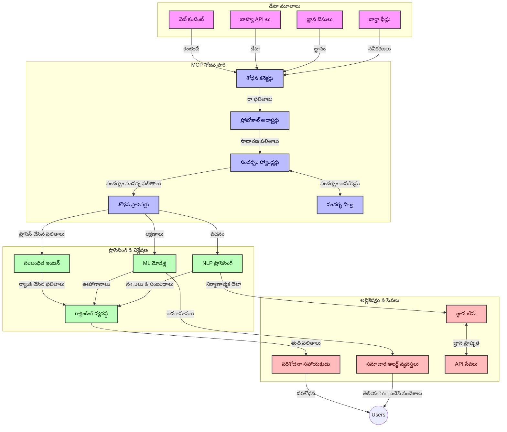
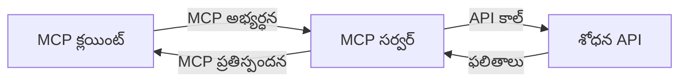
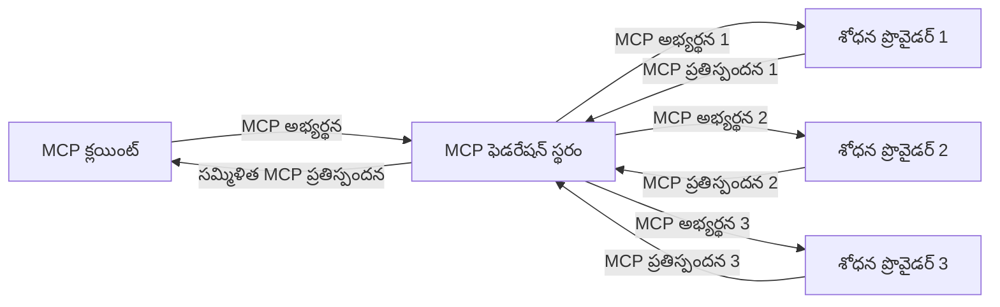
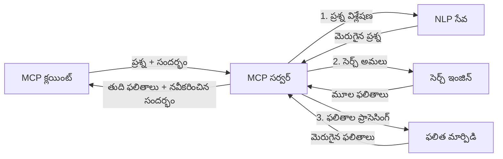

# రియల్-టైమ్ వెబ్ శోధన కోసం మోడల్ కాంటెక్స్ ప్రోటోకాల్

## అవలోకనం

రియల్-టైమ్ వెబ్ శోధన ఈ రోజు సమాచార ఆధారిత వాతావరణంలో అత్యవసరం అయ్యింది, ఎందుకంటే అనువర్తనాలకు సంబంధిత మరియు సమయానికి సమాధానాలు అందించడానికి ఇంటర్నెట్ అంతటా అప్డేట్ అయిన సమాచారంకు తక్షణ ప్రవేశం అవసరం. మోడల్ కాంటెక్స్ ప్రోటోకాల్ (MCP) ఈ రియల్-టైమ్ శోధన ప్రక్రియలను ఆప్టిమైజ్ చేయడంలో ఒక ముఖ్యమైన అభివృద్ధి చూపిస్తుంది, ఇది శోధన సామర్ధ్యాన్ని పెంచటం, సాంకేతిక కాంటెక్స్ ను నిలుపుకోవడం, మరియు మొత్తం సిస్టమ్ పనితీరును మెరుగుపరుస్తుంది.

ఈ మాడ్యూల్ MCP ఎలా రియల్-టైమ్ వెబ్ శోధనను మార్చుతుందో అన్వేషిస్తుంది, ఇది AI మోడళ్లు, శోధన ఇంజిన్లు, మరియు అనువర్తనాల మధ్య కాంటెక్స్ నిర్వహణకు ఒక ప్రమాణీకృత విధానం అందిస్తుంది.

### మీరు నేర్చుకునేది

ఈ సమగ్ర మార్గదర్శకంలో, మీరు తెలుసుకోబోతున్నది:

- MCP ఎలా AI మోడళ్లను మరియు రియల్-టైమ్ వెబ్ శోధన సామర్ధ్యాలను సరళమైన ప్లాట్‌ఫారమ్ ద్వారా కలిపే విధానం
- MCPతో సమర్థవంతమైన మరియు స్కేలబుల్ శోధన పరిష్కారాలను అమలు చేయడానికి ఆర్కిటెక్చర్ నమూనాలు
- బహుళ క్వెరీలు మరియు ఇంటరాక్షన్లలో శోధన కాంటెక్స్ ను నిలుపుకునే సాంకేతికతలు
- వివిధ శోధన సందర్భాలలో పార్థనీయ కోడ్ అమలులు Python మరియు JavaScriptలో
- MCP ఆధారిత శోధన వ్యవస్థల్లో సంబంధితత, తాజాదనము మరియు పనితీరును ఎలా సమతుల్యం చేయాలో విధానాలు

## రియల్-టైమ్ వెబ్ శోధనకి పరిచయం

రియల్-టైమ్ వెబ్ శోధన అనేది వెబ్ ఆధారిత సమాచారాన్ని ప్రచురిస్తున్న లేదా నవీకరించబోతున్న సమయంలోనే సార్వత్రికంగా క్వెరీ చేయడం, ప్రాసెస్ చేయడం, మరియు విశ్లేషణ చేయడానికి అనుమతించే సాంకేతిక పద్ధతి, ఇది సిస్టమ్లకు తక్కువ ఆలస్యం తో తాజా మరియు సంబంధిత సమాచారాన్ని అందిస్తుంది. సాంప్రదాయిక శోధన వ్యవస్థలు పార్శ్వ నుడస క్రమంలో పనిచేస్తాయ, ఈ వ్యవస్థలు గడచిన గంటలు లేదా రోజులు పాత సమాచారంతో పని చేస్తే, రియల్-టైమ్ శోధన ప్రత్యక్షం గా వెబ్ నుండి సమాచారాన్ని తీసుకుని ప్రస్తుత ఆన్‌లైన్ కంటెంట్ గుండా పూర్తి సమాచారాన్ని అందిస్తుంది.

### రియల్-టైమ్ వెబ్ శోధన యొక్క మూల సూత్రాలు:

- **కొనసాగుతున్న క్వెరీ ప్రాసెసింగ్**: శోధన క్వెరీలు నిరంతరం అప్డేట్ జరుగుతున్న డేటా మూలాలపై ప్రాసెస్ చేయబడతాయి
- **తాజాదన ప్రాధాన్యత**: సిస్టమ్లు తాజా సమాచారాన్ని ప్రాధాన్యత ఇస్తాయి
- **సంబంధితత సమతుల్యం**: సంబంధితత మరియు తాజాదన మధ్య సమతుల్యతను నిలుపుకోవడం
- **స్కేలబుల్ ఆర్కిటెక్చర్**: సిస్టమ్‌లు వేరియబుల్ క్వెరీ లోడ్‌లు మరియు డేటా పరిమాణాలను నిర్వహించగలగాలి
- **కాంటెక్స్చువల్ అండర్‌స్టాండింగ్**: శోధన పునరావృతాల సమయంలో వినియోగదారు కాంటెక్స్ ను నిలుపుకోవటం ముఖ్యంగా ఫలితాలకి మరింత అర్ధం ఇవ్వడానికి అవసరం
- **డైనమిక్ క్వెరీ రిఫార్మ్యులేషన్**: కాంటెక్స్ మరియు మునుపటి ఫలితాల ఆధారంగా క్వెరీలను అనుకూలంగా సవరించడం
- **బహుళ మూలాల సమాహారం**: అనేక శోధన ప్రొవైడర్లు మరియు వెబ్ మూలాల నుండి ఫలితాలను కలిసి పొందటం
- **సెమాంటిక్ అండర్‌స్టాండింగ్**: కేవలం కీవర్డ్స్ కాకుండా అర్థం ఆధారంగా క్వెరీలు మరియు కంటెంట్ ని ప్రాసెస్ చేయడం
- **రియల్-టైమ్ ర్యాంకింగ్**: కొత్త సమాచారం అందుబాటులోకి వచ్చినప్పుడు ఫలితాల ర్యాంకింగ్ ను నిరంతరం సవరించడం

### మోడల్ కాంటెక్స్ ప్రోటోకాల్ మరియు రియల్-టైమ్ వెబ్ శోధన

మోడల్ కాంటెక్స్ ప్రోటోకాల్ (MCP) రియల్-టైమ్ వెబ్ శోధన వాతావరణాలలో కొన్ని ముఖ్యమైన సవాళ్ళను పరిష్కరిస్తుంది:

1. **శోధన కాంటెక్స్ పరిరక్షణ**: MCP పంపిణీ చేసిన శోధన భాగాలుగా కాంటెక్స్ ఎలా నిలుపుకోవాలో ప్రమాణీకరిస్తుంది మరియు ఇది AI మోడళ్లు మరియు ప్రాసెసింగ్ నోడ్లకు సంబంధిత క్వెరీ చరిత్ర మరియు వినియోగదారు మెచ్చిన దృక్కోణాలను అందిస్తుంది.

2. **సమర్థవంతమైన క్వెరీ నిర్వహణ**: కాంటెక్స్ పంపిణీకి నిర్మితమైన విధానాలను అందించడం ద్వారా MCP ప్రతి శోధన పునరావృతంలో కాంటెక్స్ పునరావృతాన్ని తగ్గిస్తుంది.

3. **ఇంటర్‌ఒపరబిలిటీ**: వివిధ శోధన సాంకేతికతలు మరియు AI మోడళ్ల మధ్య కాంటెక్స్ పంచుకునేందుకు ఒక సాధారణ భాషను MCP సృష్టిస్తుంది, ఇది మరింత సౌలభ్యమైన మరియు విస్తరించదగిన నిర్మాణాలకు ఉపయోగపడుతుంది.

4. **శోధన-ఆప్టిమైజ్ అయిన కాంటెక్స్**: MCP అమలు ప్రక్రియలు ఎఫెక్టివ్ శోధన కోసం అత్యంత సంబంధిత కాంటెక్స్ అంశాలను ప్రాధాన్యం ఇస్తాయి, పనితీరు మరియు ఖచ్చితత్వం రెండింటికి ఆప్టిమైజ్ చేస్తాయి.

5. **అనుకూల శోధన ప్రాసెసింగ్**: MCP ద్వారా సరైన కాంటెక్స్ నిర్వహణతో, శోధన వ్యవస్థలు అభివృద్ధి చెందుతున్న వినియోగదారు అవసరాలు మరియు సమాచారం పరిసరాల ఆధారంగా డైనమిక్‌గా ప్రాసెసింగ్ ను సర్దుబాటు చేయగలవు.

వార్త సమాహారం నుండి పరిశోధన సహాయకారుల వరకు ఆధునిక అనువర్తనాల్లో, MCPని వెబ్ శోధన సాంకేతికతలతో ఏకీకృతం చేయడం మరింత తెలివైన, కాంటెక్స్-సూచిత శోధనను సాధ్యం చేస్తుంది, ఇది వినియోగదారు అంతఃక్రియలు కొనసాగించడంతో మరింత సంబంధిత ఫలితాలను అందిస్తుంది.

## అభ్యాస లక్ష్యాలు

ఈ పాఠం ముగింపులో, మీరు చేయగలగాలి:

- ఆధునిక అనువర్తనాల్లో రియల్-టైమ్ వెబ్ శోధన మరియు దాని సవాళ్ల మౌలిక విషయాలను అర్థం చేసుకోవాలి
- మోడల్ కాంటెక్స్ ప్రోటోకాల్ (MCP) రియల్-టైమ్ వెబ్ శోధన సామర్థ్యాలను ఎలా మెరుగుపరుస్తుందో వివరించగలగాలి
- ప్రముఖ ఫ్రేమ్‌వర్క్‌లు మరియు APIs ఉపయోగించి MCP ఆధారిత శోధన పరిష్కారాలను అమలు చేయగలగాలి
- MCPతో స్కేలబుల్, అధిక పనితీరు శోధన ఆర్కిటెక్చర్లను డిజైన్ చేసి అమలు చేయగలగాలి
- సెమాంటిక్ శోధన, పరిశోధన సహాయం, మరియు AI-ఆగ్మెంటెడ్ బ్రౌజింగ్ వంటి వివిధ ఉపయోగాలకి MCP భావనలను వర్తించగలగాలి
- MCP ఆధారిత శోధన సాంకేతికతలలో వస్తున్న ధోరణులు మరియు భవిష్యత్తు ఆవిష్కరణలను అంచనా వేయగలగాలి
- వినియోగదారుల అంతఃక్రియల నుండి నేర్చుకునే కాంటెక్స్-సూచిత శోధన వ్యవస్థలను అభివృద్ధి చేయగలగాలి
- MCP ప్రమాణీకృత ప్రోటోకాల్లను ఉపయోగించి AI సహాయకరాలలో వెబ్ శోధన సామర్థ్యాలను ఏకీకృతం చేయగలగాలి
- కాంటెక్స్ ఆధారంగా ఫలితాలను క్రమపద్ధతిగా మెరుగుపరచే బహుళ-దశ శోధన పైప్లైన్లను తయారుచేయగలగాలి
- విస్తృత కాంటెక్స్ అవగాహనను నిలుపుకున్నప్పటికీ శోధన పనితీరును ఆప్టిమైజ్ చేయగలగాలి

### నిర్వచనం మరియు ప్రాముఖ్యత

రియల్-టైమ్ వెబ్ శోధన అనగా తక్కువ ఆలస్యం తో నిరంతరం వెబ్ ఆధారిత సమాచారాన్ని క్వెరీ చేయడం, తిరిగి పొందటం మరియు అందించడం. సాంప్రదాయ శోధన ఇంజిన్లు వెబ్‌ను కాలక్రమేణా క్రాల్ చేసి సూచికలో ఉంచుతుంటే, రియల్-టైమ్ శోధన అందుబాటులోకి వచ్చిన సమయానికి సమాచారాన్ని తక్షణం ప్రదానం చేస్తుంది.

రియల్-టైమ్ వెబ్ శోధన ముఖ్య లక్షణాలు:

- **తాజాదనం**: ఇటీవల సమాచారాన్ని మరియు నవీకరణలను ప్రాధాన్యం ఇవ్వడం
- **కొనసాగుతున్న ప్రాసెసింగ్**: కొత్త సమాచారం కోసం నిరంతరం అన్వేషించడం
- **క్వెరీ అనుకూలీకరణ**: కాంటెక్స్ మరియు ఫీడ్‌బ్యాక్ ఆధారంగా శోధన క్వెరీలను మెరుగుపరచడం
- **తక్షణ డెలివరీ**: తక్కువ ఆలస్యం తో శోధన ఫలితాలను అందించడం
- **కాంటెక్స్ నిలుపుదల**: మెరుగైన సంబంధితత కోసం గత క్వెరీలపై ఆధారపడి ఉండటం

### సాంప్రదాయ వెబ్ శోధనలో సవాళ్లు

సాంప్రదాయ వెబ్ శోధన విధానాలు రియల్-టైమ్ సందర్భాల్లో అనేక పరిమితులను ఎదుర్కొంటాయి:

1. **కాంటెక్స్ విభజన**: ఒకাধিক క్వెరీలలో శోధన కాంటెక్స్ నిలుపుకోవటంలో సమస్యలు
2. **సమాచార తాజాదన**: తాజా సమాచారాన్ని యాక్సెస్ చేసుకోవడం మరియు ప్రాధాన్యత ఇవ్వడంలో సవాళ్లు
3. **ఇంటిగ్రేషన్ సంక్లిష్టత**: శోధన వ్యవస్థలు మరియు అనువర్తనాల మధ్య ఇంటర్‌ఒపరబిలిటీలో సమస్యలు
4. **ఆలస్యం సమస్యలు**: సమగ్ర శోధనను జవాబు సమయ అవసరాల‌తో సమతుల్యం చేయడం
5. **సంబంధితత సర్దుబాటు**: తాజాదన ప్రాధాన్యత ఇస్తున్నప్పటికీ ఖచ్చితత్వం మరియు సంబంధితతను నిర్ధారించడం

## శోధన కోసం మోడల్ కాంటెక్స్ ప్రోటోకాల్ (MCP) అర్థం చేసుకోవడం

### శోధన కాంటెక్స్ లో MCP అంటే ఏమిటి?

మోడల్ కాంటెక్స్ ప్రోటోకాల్ (MCP) అనేది AI మోడళ్ల మరియు అనువర్తనాల మధ్య సమర్థవంతమైన సంభాషణను సులభతరం చేయడానికి రూపొందించిన ప్రమాణీకృత కమ్యూనికేషన్ ప్రోటోకాల్గా ఉంటుంది. రియల్-టైమ్ వెబ్ శోధన సందర్భంలో, MCP ఈ విధానాలను అందిస్తుంది:

- క్వెరీ సీక్వెన్స్‌లలో శోధన కాంటెక్స్ నిలుపుకోవడం
- శోధన క్వెరీ మరియు ఫలిత ఫార్మాట్‌లను ప్రమాణీకరించడం
- శోధన పరిమాణాలు మరియు ఫలితాల ప్రసారాన్ని ఆప్టిమైజ్ చేయడం
- మోడల్-టూకి శోధన ఇంజిన్ కమ్యూనికేషన్‌ను పెంపొందించడం

### ప్రధాన భాగాలు మరియు ఆర్కిటెక్చర్

రియల్-టైమ్ వెబ్ శోధన కోసం MCP ఆర్కిటెక్చర్‌లో కొన్ని ముఖ్యమైన భాగాలు ఉంటాయి:

1. **క్వెరీ కాంటెక్స్ హ్యాండ్లర్లు**: బహుళ క్వెరీలలో శోధన కాంటెక్స్ నిర్వహించడం మరియు సంరక్షించడం
2. **శోధన ప్రాసెసర్లు**: కాంటెక్స్-అవగాహన కలిగిన సాంకేతికతలతో వస్తున్న శోధన అభ్యర్థనలను ప్రాసెస్ చేయడం
3. **ప్రోటోకాల్ అడాప్టర్లు**: వివిధ శోధన APIs మధ్య మార్పిడి చేస్తూ కాంటెక్స్ నిలుపుకోడం
4. **కాంటెక్స్ స్టోర్**: శోధన చరిత్ర మరియు ప్రాధాన్యతలను సమర్థవంతంగా నిల్వ చేయటం మరియు తిరిగి పొందటం
5. **శోధన కనెక్టర్లు**: వివిధ శోధన ఇంజిన్లు మరియు వెబ్ APIs కు కనెక్ట్ అవుతాయి



### MCP రియల్-టైమ్ వెబ్ శోధనను ఎలా మెరుగుపరుస్తుంది

MCP సాంప్రదాయ వెబ్ శోధన సవాళ్లను ఈ విధంగా పరిష్కరిస్తుంది:

- **కాంటెక్స్ కాంటిన్యూయిటి**: మొత్తం శోధన సెషన్‌లో క్వెరీల మధ్య సంబంధాలను నిలుపుకోవడం
- **ఆప్టిమైజ్ చేయబడిన ప్రసారం**: తెలివైన కాంటెక్స్ నిర్వహణ ద్వారా శోధన పరిమాణాల్లో పునరావృతాలను తగ్గించడం
- **ప్రామాణిక ఇంటర్‌ఫేస్లు**: శోధన భాగాలకోసం స్థిరమైన APIs అందించడం
- **తగ్గిన ఆలస్యం**: సమర్థవంతమైన కాంటెక్స్ హ్యాండ్లింగ్ ద్వారా ప్రాసెసింగ్ ఓవర్‌హెడ్‌ను తగ్గించడం
- **మెరుగైన సంబంధితత**: బహుళ క్వెరీల పై వినియోగదారు ఉద్దేశ్యాన్ని నిలుపుకుని శోధన సంబంధితతను మెరుగుపరచడం

## ఓకొక్కటి సమాహారం మరియు అమలుకు

రియల్-టైమ్ వెబ్ శోధన వ్యవస్థలు పనితీరు మరియు కాంటెక్స్ సాంకేతిక అమితత్వం రెండింటినీ నిలుపుకోవడానికి జాగ్రత్తగా ఆర్కిటెక్చర్ డిజైన్ మరియు అమలు అవసరం. మోడల్ కాంటెక్స్ ప్రోటోకాల్ AI మోడళ్లు మరియు శోధన సాంకేతికతలను ఏకీకృతం చేసే ప్రమాణీకృత పద్ధతిని కల్పిస్తుంది, తద్వారా మరింత పరిణత, కాంటెక్స్-సూచిత శోధన పైప్లైన్లను సృష్టించవచ్చు.

### శోధన ఆర్కిటెక్చర్లలో MCP ఏకీకరణ అవలోకనం

రియల్-టైమ్ వెబ్ శోధన వాతావరణాలలో MCP అమలు చేయడంలో కొన్ని ముఖ్యమైన విషయాలు ఉన్నాయి:

1. **శోధన కాంటెక్స్ సీరియలైజేషన్**: MCP శోధన అభ్యర్థనలలో కాంటెక్స्चువల్ సమాచారాన్ని ఎంచుకోవటానికి సమర్థవంతమైన ఉపాయాలను అందిస్తుంది, ఇది కీలకమైన కాంటెక్స్ క్వెరీ మొత్తం ప్రాసెసింగ్ పైప్లైన్ ద్వారా అనుసరిస్తుందని హామీ ఇస్తుంది. ఇందులో శోధన-సంబంధిత మెటాడేటాని ఆప్టిమైజ్ చేసిన ప్రమాణీకృత సీరియలైజేషన్ ఫార్మాట్లు ఉన్నాయి.

2. **స్థితిస్థాపక శోధన ప్రాసెసింగ్**: MCP శోధన పునరావృతాలపై సమానమైన కాంటెక్స్ ప్రాతినిధ్యం నిర్వహిస్తూ మరింత తెలివైన స్థితిస్థాపక ప్రాసెసింగ్‌కు సహాయపడుతుంది. ఇది బహుళ దశ శోధన పైప్లైన్లలో భారీగా ఉపయోగకరంగా ఉంటుంది, ఎందుకంటే కాంటెక్స్ మెరుగుదల ఫలితాలను మెరుగుపరుస్తుంది.

3. **క్వెరీ విస్తరణ మరియు మెరుగుదల**: MCP అమలు శోధన వ్యవస్థల్లో సేకరించిన కాంటెక్స్ ఆధారంగా స్కోపులు విస్తరించడం మరియు మెరుగుపరచుటకు సులభతరం చేస్తుంది, తద్వారా శోధన సెషన్ పురోగమనంలో మరింత సంబంధిత ఫలితాలు అందిస్తాయి.

4. **ఫలితం కాషింగ్ మరియు ప్రాధాన్యం నిర్ణయం**: కాంటెక్స్ నిర్వహణను ప్రమాణీకరించడం ద్వారా MCP ఫలితాల కాష్ నిర్వహణ మరియు ప్రాధాన్యతను సమర్థవంతంగా నిర్వహించుతుంది, భాగాలో కాంటెక్స్ పరిణామాన్ని అనుగుణంగా మార్చుకోవచ్చు.

5. **శోధన ఫెడరేషన్ మరియు సమాహారం**: MCP శోధన కాంటెక్స్ యొక్క నిర్మాణాత్మక ప్రతినిధులతో పలు బ్యాక్‌ఎండ్లపై శోధన ఫెడరేషన్ మరింత జాగ్రత్తగా చేయడానికి సహాయపడుతుంది, వివిధ మూలాల నుంచి ఫలితాలను మరింత అర్థవంతంగా సమాహరించడానికి వీలు ఇస్తుంది.

వివిధ శోధన సాంకేతికతలలో MCP అమలు కాంటెక్స్ నిర్వహణకు ఒక ఐక్య విధానాన్ని సృష్టిస్తుంది, ప్రత్యేక శోధన ఇంటిగ్రేషన్ కోడ్ అవసరాన్ని తగ్గించి శోధన క్వెరీల అభివృద్ధి క్రమంలో అర్థవంతమైన కాంటెక్స్ నిలుపుదల సామర్థ్యాన్ని పెంచుతుంది.

### MCP వివిధ వెబ్ శోధన అమలుల్లో

ఈ ఉదాహరణలు ప్రస్తుత MCP స్పెసిఫికేషన్ ని అనుసరిస్తాయి, ఇది వేర్వేరు ట్రాన్స్పోర్ట్ విధానాలతో JSON-RPC ఆధారిత ప్రోటోకాల్ పై దృష్టి సారిస్తుంది. కింది కోడ్ మీరు MCP ప్రోటోకాల్‌తో పూర్తి అనుకూలత కలిగించి ప్రత్యేక శోధన ఇంటిగ్రేషన్లను ఎలా అమలు చేయవచ్చో చూపిస్తుంది.


<details>
<summary>జనరిక్ శోధన APIతో Python అమలు</summary>

```python
import asyncio
import json
import aiohttp
from typing import Dict, Any, Optional, List
from contextlib import asynccontextmanager
from collections.abc import AsyncIterator

# ప్రామాణిక MCP గ్రంథాలయాలను దిగుమతి చేయండి
from mcp.client.session import ClientSession
from mcp.client.streamable_http import streamablehttp_client
from mcp.types import TextContent, CreateMessageRequestParams, CreateMessageResult
from mcp.server.fastmcp import FastMCP

# వెబ్ శోధన కోసం FastMCP సర్వర్ సృష్టించండి
search_server = FastMCP("WebSearch")

# వెబ్ శోధన కార్యాచరణలను నిర్వహించే తరగతి
class WebSearchHandler:
    def __init__(self, api_endpoint: str, api_key: str):
        self.api_endpoint = api_endpoint
        self.api_key = api_key
        self.session = None
        
    async def initialize(self):
        """Initialize the HTTP session"""
        self.session = aiohttp.ClientSession(
            headers={"Authorization": f"Bearer {self.api_key}"}
        )
    
    async def close(self):
        """Close the HTTP session"""
        if self.session:
            await self.session.close()
            
    async def perform_search(self, query: str, max_results: int = 5, 
                           include_domains: List[str] = None, 
                           exclude_domains: List[str] = None,
                           time_period: str = "any") -> Dict[str, Any]:
        """Perform web search using the search API"""
        # శోధన పారామితులను నిర్మించండి
        search_params = {
            "q": query,
            "limit": max_results,
            "time": time_period
        }
        
        if include_domains:
            search_params["site"] = ",".join(include_domains)
            
        if exclude_domains:
            search_params["exclude_site"] = ",".join(exclude_domains)
        
        # శోధన అభ్యర్థనను నిర్వహించండి
        try:
            async with self.session.get(
                self.api_endpoint,
                params=search_params
            ) as response:
                if response.status != 200:
                    error_text = await response.text()
                    raise Exception(f"Search API error: {response.status} - {error_text}")
                
                search_data = await response.json()
                
                # API-ప్రత్యేక ప్రతిస్పందనను ప్రామాణిక రూపానికి మార్చండి
                results = []
                for item in search_data.get("results", []):
                    results.append({
                        "title": item.get("title", ""),
                        "url": item.get("url", ""),
                        "snippet": item.get("snippet", ""),
                        "date": item.get("published_date", ""),
                        "source": item.get("source", "")
                    })
                
                return {
                    "query": query,
                    "totalResults": len(results),
                    "results": results
                }
        except Exception as e:
            print(f"Search API request error: {e}")
            raise

# శోధన హ్యాండ్లర్‌ను ప్రారంభించండి
search_handler = WebSearchHandler(
    api_endpoint="https://api.search-service.example/search",
    api_key="your-api-key-here"
)

# శోధన హ్యాండ్లర్‌ను నిర్వహించడానికి జీవితకాలాన్ని సెట్ చేయండి
@asyncio.asynccontextmanager
async def app_lifespan(server: FastMCP):
    """Manage application lifecycle"""
    await search_handler.initialize()
    try:
        yield {"search_handler": search_handler}
    finally:
        await search_handler.close()

# సర్వర్ కోసం జీవితకాలాన్ని సెట్ చేయండి
search_server = FastMCP("WebSearch", lifespan=app_lifespan)

# వెబ్ శోధన సాధనాన్ని నమోదుచేయండి
@search_server.tool()
async def web_search(query: str, max_results: int = 5, 
                   include_domains: List[str] = None,
                   exclude_domains: List[str] = None,
                   time_period: str = "any") -> Dict[str, Any]:
    """
    Search the web for information
    
    Args:
        query: The search query
        max_results: Maximum number of results to return (default: 5)
        include_domains: List of domains to include in search results
        exclude_domains: List of domains to exclude from search results
        time_period: Time period for results ("day", "week", "month", "any")
        
    Returns:
        Dictionary containing search results
    """
    ctx = search_server.get_context()
    search_handler = ctx.request_context.lifespan_context["search_handler"]
    
    results = await search_handler.perform_search(
        query=query,
        max_results=max_results,
        include_domains=include_domains,
        exclude_domains=exclude_domains,
        time_period=time_period
    )
    
    return results

# ఉదాహరణ క్లయింట్ ఉపయోగం
async def client_example():
    # Streamable HTTP రవాణా ఉపయోగించి శోధన సర్వర్‌కు కనెక్షన్ చేయండి
    async with streamablehttp_client("http://localhost:8000/mcp") as (read, write, _):
        async with ClientSession(read, write) as session:
            # కనెక్షన్‌ను ప్రారంభించండి
            await session.initialize()
            
            # web_search సాధనాన్ని పిలవండి
            search_results = await session.call_tool(
                "web_search", 
                {
                    "query": "latest developments in AI and Model Context Protocol",
                    "max_results": 5,
                    "time_period": "day",
                    "include_domains": ["github.com", "microsoft.com"]
                }
            )
            
            print(f"Search results: {search_results}")

# సర్వర్ అమలులో ఉదాహరణ
if __name__ == "__main__":
    # Streamable HTTP రవాణాతో సర్వర్‌ను నడపండి
    search_server.run(transport="streamable-http")
```
</details> 

<details>
<summary>బ్రౌజర్-ఆధారిత శోధనతో JavaScript అమలు</summary>


```javascript
// వెబ్ సెర్చ్ కోసం MCP సర్వర్ అమలు
import { McpServer, ResourceTemplate } from '@modelcontextprotocol/sdk/server/mcp.js';
import { StreamableHTTPServerTransport } from '@modelcontextprotocol/sdk/server/streamableHttp.js';
import { z } from 'zod';

// వెబ్ సెర్చ్ కోసం MCP సర్వర్ సృష్టించండి
const searchServer = new McpServer({
    name: "BrowserSearch",
    description: "A server that provides web search capabilities"
});

// సెర్చ్ సర్వీస్ క్లాస్
class SearchService {
    constructor(searchApiUrl, apiKey) {
        this.searchApiUrl = searchApiUrl;
        this.apiKey = apiKey;
    }

    async performSearch(parameters) {
        const {
            query = '',
            maxResults = 5,
            includeDomains = [],
            excludeDomains = [],
            timePeriod = 'any'
        } = parameters;
        
        // ప్యారామీటర్లు తో సెర్చ్ URL నిర్మించండి
        const url = new URL(this.searchApiUrl);
        url.searchParams.append('q', query);
        url.searchParams.append('limit', maxResults);
        url.searchParams.append('time', timePeriod);
        
        if (includeDomains.length > 0) {
            url.searchParams.append('site', includeDomains.join(','));
        }
        
        if (excludeDomains.length > 0) {
            url.searchParams.append('exclude_site', excludeDomains.join(','));
        }
        
        try {
            const response = await fetch(url.toString(), {
                method: 'GET',
                headers: {
                    'Authorization': `Bearer ${this.apiKey}`,
                    'Content-Type': 'application/json'
                }
            });
            
            if (!response.ok) {
                const errorText = await response.text();
                throw new Error(`Search API error: ${response.status} - ${errorText}`);
            }
            
            const searchData = await response.json();
            
            // API-ప్రత్యేక స్పందనను ప్రామాణిక ఫార్మాట్‌కి మార్చండి
            const results = searchData.results?.map(item => ({
                title: item.title || '',
                url: item.url || '',
                snippet: item.snippet || '',
                date: item.published_date || '',
                source: item.source || ''
            })) || [];
            
            return {
                query,
                totalResults: results.length,
                results
            };
        } catch (error) {
            console.error('Search API request error:', error);
            throw error;
        }
    }
}

// సెర్చ్ సర్వీస్‌ను ప్రారంభించండి
const searchService = new SearchService(
    'https://api.search-service.example/search',
    'your-api-key-here'
);

// సర్వర్ కోసం కాంటెక్స్ట్ ప్రొవైడర్‌ను సెటప్ చేయండి
searchServer.setContextProvider(() => {
    return {
        searchService
    };
});

// వెబ్ సెర్చ్ టూల్‌ను రిజిస్టర్ చేయండి
searchServer.tool({
    name: 'web_search',
    description: 'Search the web for information',
    parameters: {
        type: 'object',
        properties: {
            query: {
                type: 'string',
                description: 'The search query'
            },
            maxResults: {
                type: 'integer',
                description: 'Maximum number of results to return',
                default: 5
            },
            includeDomains: {
                type: 'array',
                items: { type: 'string' },
                description: 'List of domains to include in search results'
            },
            excludeDomains: {
                type: 'array',
                items: { type: 'string' },
                description: 'List of domains to exclude from search results'
            },
            timePeriod: {
                type: 'string',
                description: 'Time period for results',
                enum: ['day', 'week', 'month', 'any'],
                default: 'any'
            }
        },
        required: ['query']
    },
    handler: async (params, context) => {
        const { searchService } = context;
        return await searchService.performSearch(params);
    }
});

// సెర్చ్ సర్వర్‌కు కనెక్ట్ అయ్యే ఉదాహరణ క్లయింట్ కోడ్
import { Client } from '@modelcontextprotocol/sdk/client/index.js';
import { StreamableHTTPClientTransport } from '@modelcontextprotocol/sdk/client/streamableHttp.js';

async function connectToSearchServer() {
    // సెర్చ్ సర్వర్‌కు కనెక్ట్ అవ్వండి
    const transport = new StreamableHTTPClientTransport(
        new URL('http://localhost:8000/mcp')
    );
    
    const client = new Client({
        name: 'search-client',
        version: '1.0.0'
    });
    
    await client.connect(transport);
    
    // సెర్చ్ టూల్‌ను అమలు చేయండి
    const searchResults = await client.callTool({
        name: 'web_search',
        arguments: {
            query: 'Model Context Protocol implementation examples',
            maxResults: 10,
            timePeriod: 'week',
            includeDomains: ['github.com', 'docs.microsoft.com']
        }
    });
    
    console.log('Search results:', searchResults);
    
    // శుభ్రపరచడం
    await client.disconnect();
}

// సర్వర్‌ను ప్రారంభించండి
const transport = new StreamableHTTPServerTransport();
await searchServer.connect(transport);
console.log('Search server running at http://localhost:8000/mcp');

// వేరొక ప్రాసెస్‌లో లేదా సర్వర్ ప్రారంభమైన తరువాత
// connectToSearchServer().catch(console.error);
```
</details> 


## కోడ్ ఉదాహరణల వివరణ

> **ముఖ్యమైన సూచన**: ఈ క్రింది కోడ్ ఉదాహరణలు మోడల్ కాంటెక్స్ ప్రోటోకాల్ (MCP) వెబ్ శోధన ఫంక్షనాలిటీతో ఏకీకృతాన్ని చూపిస్తాయి. అవి అధికారిక MCP SDKలు అనుసరించే నమూనాలలో ఉన్నాయి, కానీ విద్యా ప్రయోజనాల కోసం సరళీకృతం చేయబడ్డాయి.
> 
> ఈ ఉదాహరణలు చూపించేవి:
> 
> 1. **Python అమలు**: FastMCP సర్వర్ అమలు, ఇది వెబ్ శోధన సాధనం అందిస్తూ బాహ్య శోధన APIకి కనెక్ట్ అవుతుంది. ఈ ఉదాహరణ జీవితకాల నిర్వహణ, కాంటెక్స్ హ్యాండ్లింగ్, మరియు సాధనం అమలు సరైన విధానాలను అధికారిక MCP Python SDK అనుసరించడంతో చూపిస్తుంది. సర్వర్ ప్రొడక్షన్ అమరికలకు పాత SSE ట్రాన్స్పోర్ట్ ని మార్చిన సిఫారసు చేసిన Streamable HTTP ట్రాన్స్పోర్ట్ ఉపయోగిస్తుందీ.
> 
> 2. **JavaScript అమలు**: FastMCP నమూనాను ఉపయోగించి TypeScript/JavaScript లో ఒక శోధన సర్వర్ అమలు, సరైన సాధన నిర్వచనలు మరియు క్లయింట్ కనెక్షన్లను కలిగి. ఇది సెషన్ నిర్వహణ మరియు కాంటెక్స్ పరిరక్షణకు తాజా సిఫారసులు అనుసరిస్తుంది.
> 
> ప్రొడక్షన్ ఉపయోగానికి ఈ ఉదాహరణలకు అదనపు దోష నిర్వహణ, ప్రామాణీకరణ, మరియు ప్రత్యేక API ఇంటిగ్రేషన్ కోడ్ అవసరం. చూపించిన శోధన API ఎండ్‌పాయింట్‌లు (`https://api.search-service.example/search`) ప్లేస్‌హోల్డర్లు మాత్రమే, వాటిని వాస్తవ శోధన సేవ ఎండ్‌పాయింట్లతో మార్పిడి చేయాలి.
> 
> పూర్తి అమలుకు సంబంధించి మరియు అత్యంత తాజా విధానాలకు, 
> [అధికారిక MCP స్పెసిఫికేషన్](https://modelcontextprotocol.io/specification/2026-07-28/)ను
> మరియు SDK డాక్యుమెంటేషన్ చూడండి.

## ప్రధాన సూత్రాలు

### మోడల్ కాంటెక్స్ ప్రోటోకాల్ (MCP) ఫ్రేమ్‌వర్క్

తన మౌలిక దశలో, మోడల్ కాంటెక్స్ ప్రోటోకాల్ AI మోడళ్ల, అనువర్థనాలు మరియు సేవల మధ్య కాంటెక్స్ మార్చుకునే ప్రమాణీకృత విధానాన్ని అందిస్తుంది. రియల్-టైమ్ వెబ్ శోధనలో, ఈ ఫ్రేమ్‌వర్క్ సక్రమమైన, బహుళ-టర్న్ శోధన అనుభవాలని సృష్టించడంలో అవసరం. కీలక భాగాలు:

1. **క్లయింట్-సర్వర్ ఆర్కిటెక్చర్**: MCP శోధన క్లయింట్లు (అభ్యర్థనకర్తలు) మరియు శోధన సర్వర్లు (ప్రొవైడర్లు) మధ్య స్పష్టమైన వేర్వేరు ఏర్పాటును కల్పిస్తుంది, ఇది సులభమైన అమరికలకు దారి తీస్తుంది.

2. **JSON-RPC కమ్యూనికేషన్**: ఈ ప్రోటోకాల్ సందేశ మార్పిడి కోసం JSON-RPC ఉపయోగిస్తుంది, ఇది వెబ్ సాంకేతికతలకు అనుకూలంగా, వివిధ ప్లాట్‌ఫారమ్‌లలో సులభంగా అమలు చేయగలది.

3. **కాంటెక్స్ నిర్వహణ**: MCP బహుళ పరస్పర చర్యలలో శోధన కాంటెక్స్ ని నిలుపుకోడానికి, నవీకరించడానికి, మరియు ఉపయోగించడానికి నిర్మిత విధానాలను నిర్వచిస్తుంది.

4. **సాధన నిర్వచనలు**: శోధన సామర్థ్యాలను సూత్రీకృత పారామీటర్లు మరియు తిరిగి విలువలతో ప్రమాణీకృత సాధనాలుగా ప్రదర్శిస్తాయి.

5. **స్ట్రీమింగ్ మద్దతు**: రియల్-టైమ్ శోధనలో ఫలితాలు దశలవారీగా రాలేదు అంటే స్ట్రీమింగ్ ఫలితాలను ప్రోటోకాల్గా మద్దతు ఇస్తుంది.

### వెబ్ శోధన ఏకీకరణ నమూనాలు

MCPని వెబ్ శోధనలో ఏకీకృతం చేసేటప్పుడు కొన్ని నమూనాలు కనిపిస్తాయి:

#### 1. నేరుగా శోధన ప్రొవైడర్ ఏకీకరణ



ఈ నమూనాలో MCP సర్వర్ నేరుగా ఒకటి లేదా ఎక్కువ శోధన APIలతో ఇంటర్‌ఫేస్ అవుతుంది, MCP అభ్యర్థనలను API-విశిష్ట కాల్‌లగా అనువదించి ఫలితాలను MCP స్పందనల రూపంలో ఫార్మాట్ చేస్తుంది.

#### 2. కాంటెక్స్ పరిరక్షణతో సమ్మిళిత శోధన (ఫెడరేటెడ్)



ఈ నమూనా MCP-అనుకూల శోధన ప్రొవైడర్లలోని బహుళ శోధన క్వెరీలను పంపిణీ చేసి, ఒక్కటైయిన కాంటెక్స్ ను నిలుపుకుంటూ, విధానాలు లేదా శోధన సామర్థ్యాల్లో ప్రత్యేకత గలవారితో పని చేస్తుంది.

#### 3. కాంటెక్స్ పెంపొందించిన శోధన సపరియు



ఈ నమూనాలో శోధన ప్రక్రియను బహుళ దशలుగా విభజించి, ప్రతి దశలో కాంటెక్స్ పెంపొందించి, క్రమానుగతంగా మరింత సంబంధిత ఫలితాలను సాధిస్తుంది.

### శోధన కాంటెక్స్ భాగాలు

MCP ఆధారిత వెబ్ శోధనలో కాంటెక్స్ సాధారణంగా చూడబడే అంశాలు:

- **క్వెరీ చరిత్ర**: సెషన్‌లో మునుపటి శోధన క్వెరీలు
- **వినియోగదారు అభిరుచులు**: భాష, ప్రాంతం, సురక్షిత శోధన సెట్టింగ్స్
- **ఇంటరాక్షన్ చరిత్ర**: ఏ ఫలితాలు క్లిక్ చేయబడ్డాయో, ఫలితాలపై గడిపిన సమయం
- **శోధన పారామీటర్లు**: ఫిల్టర్లు, క్రమాల పరంగా శోధన మార్చింపులు
- **డొమైన్ జ్ఞానం**: శోధనకు సంబంధించిన ప్రత్యేక సబ్జెక్టు-స్పెసిఫిక్ కాటెక్స్
- **కాల కాంటెక్స్**: సమయానుగుణమైన సంబంధితత అంశాలు
- **మూల అభిరుచులు**: నమ్మకమయ్యిన లేదా ప్రాధాన్యమైన సమాచారం మూలాలు

## ఉపయోగాలు మరియు అనువర్తనాలు

### పరిశోధన మరియు సమాచారం సేకరణ

MCP పరిశోధన వర్క్‌ఫ్లోలను మెరుగుపరుస్తుంది:

- పరిశోధనా సెషన్లలో కాంటెక్స్ నిలుపుకోవడం
- మరింత పరిణత మరియు కాంటెక్స్ సంబంధిత క్వెరీలు చేయగలిగేలా చేయడం
- బహుళ మూలాల నుండి శోధన ఫెడరేషన్‌కు మద్దతు
- శోధన ఫలితాల నుండి జ్ఞానం వెలికితీసేలా సులభతరం చేయడం

### రియల్-టైమ్ వార్తలు మరియు ధోరణి పర్యవేక్షణ

MCP ఆధారిత శోధన వార్తల పర్యవేక్షణకు ప్రాధాన్యాలు ఇస్తుంది:

- రిపోర్టింగ్‌కు సమీప రియల్-టైమ్ ఆవిష్కరణ వార్త కథనాలు
- సంబంధిత సమాచారాన్ని కాంటెక్స్ ద్వారా వడపోసడం
- బహుళ మూలాలలో నుండి టాపిక్ మరియు యూజర్ ట్రాకింగ్
- వినియోగదారు కాంటెక్స్ ఆధారంగా వ్యక్తిగతీకరించిన వార్త అలర్ట్‌లు

### AI-ఆగ్మెంటెడ్ బ్రౌజింగ్ మరియు పరిశోధన

MCP AI-ఆగ్మెంటెడ్ బ్రౌజింగ్ కోసం కొత్త అవకాశాలను సృష్టిస్తుంది:

- ప్రస్తుతం బ్రౌజర్ కార్యకలాపాలపై ఆధారపడి కాంటెక్స్-సూచనలు
- LLM ఆధారిత సహాయకులతో వెబ్ శోధన ను సులభతరంగా ఏకీకృతం
- నిర్వహిత కాంటెక్స్‌తో బహుళ-టర్న్ శోధన మెరుగుదల
- మెరుగైన వాస్తవ-సత్య నిర్ధారణ మరియు సమాచారం తేలికపరచుట

## భవిష్యత్తు ధోరణులు మరియు ఆవిష్కరణలు

### వెబ్ శోధనలో MCP అభివృద్ధి

ముందుగా చూస్తున్నప్పుడు, MCP క్రింది అంశాల్లో అభివృద్ధి కావలసిన సావధానతలు ఉంటాయని నిరీక్షిస్తున్నాము:


- **మల్టిమోడల్ సెర్చ్**: టెక్స్ట్, ఇమేజ్, ఆడియో మరియు వీడియో సెర్చ్‌లను సంరక్షించబడిన సందర్భంతో統合ించడం
- **డిసెంట్రలైజ్డ్ సెర్చ్**: పంపిణీ మరియు ఫెడరేటెడ్ సెర్చ్ ఈకోసిస్టమ్స్‌ను మద్దతు ఇవ్వడం
- **సెర్చ్ గోప్యత**: సందర్భ-అనుసరించిన గోప్యతను పరిరక్షించే సెర్చ్ యంత్రాంగాలు
- **క్వెరీ అర్థం**: సహజ భాష సెర్చ్ క్వెరీల లోతైన సేమాంటిక్ విశ్లేషణ

### సాంకేతికతలో ఉన్న అవకాశాలు

MCP సెర్చ్ భవిష్యత్తును రూపొడుస్తున్న అభివృద్ధి సాంకేతికతలు:

1. **న్యూరల్ సెర్చ్ ఆర్కిటెక్చర్స్**: MCP కోసం ఆప్టిమైజ్ అయిన ఎంబెడింగ్-ఆధారిత సెర్చ్ సిస్టమ్స్
2. **వ్యక్తిగతమైన సెర్చ్ సందర్భం**: వ్యక్తిగత వినియోగదారుల సెర్చ్ నమూనాలను కాలానుగుణంగా నేర్చుకోవడం
3. **జ్ఞాన గ్రాఫ్ సంయోజనం**: డొమైన్-స్పెసిఫిక్ జ్ఞాన గ్రాఫ్‌లతో మెరుగుపరిచిన సందర్భ-ఆధారిత సెర్చ్
4. **క్రాస్-మోడల్ సందర్భం**: విభిన్న సెర్చ్ మోడాలిటీలలో సందర్భాన్ని నిలబెట్టుకోవడం

## హ్యాండ్స్-ఆన్ వ్యాయామాలు

### వ్యాయామం 1: ప్రాథమిక MCP సెర్చ్ పైప్‌లైన్ సెటప్ చేయడం

ఈ వ్యాయామంలో మీరు నేర్చుకోబోతున్నది:
- ప్రాథమిక MCP సెర్చ్ వాతావరణాన్ని కాంక్ఫిగర్ చేయడం
- వెబ్ సెర్చ్ కోసం సందర్భ హ్యాండ్లర్లను అమలు చేయడం
- సెర్చ్ చక్రాలుగా సందర్భ పరిరక్షణను పరీక్షించి ధృవీకరించడం

### వ్యాయామం 2: MCP సెర్చ్‌తో రీసెర్చ్ అసిస్టెంట్ నిర్మాణం

పూర్తయిన అప్లికేషన్‌ను తయారు చేయండి, ఇది:
- సహజ భాష రీసెర్చ్ ప్రశ్నలను ప్రాసెస్ చేస్తుంది
- సందర్భ-ఆధారిత వెబ్ సెర్చ్‌లు చేస్తుంది
- అనేక వనరుల నుండి సమాచారం సమ్మిళితం చేయుతుంది
- సక్రమంగా వ్యవస్థీకృత పరిశోధన ఫలితాలను ప్రదర్శిస్తుంది

### వ్యాయామం 3: MCP తో మల్టీ-సోర్స్ సెర్చ్ ఫెడరేషన్ అమలు

అడ్వాన్స్‌డ్ వ్యాయామం, దీంట్లో:
- అనేక సెర్చ్ ఇంజన్‌లకు సందర్భ-ఆధారిత క్వెరీ పంపించడం
- ఫలితాల ర్యాంకింగ్ మరియు సమాహారం
- సెర్చ్ ఫలితాల సందర్భానుసారమైన డూప్లికేషన్ తొలగింపు
- సోర్స్-స్పెసిఫిక్ మెటాడేటాను నిర్వహించడం

## అదనపు వనరులు

- [Model Context Protocol Specification](https://modelcontextprotocol.io/specification/2026-07-28/) - అధికారిక MCP స్పెసిఫికేషన్ మరియు విస్తృత ప్రోటోకాల్ డాక్యుమెంటేషన్
- [Model Context Protocol Documentation](https://modelcontextprotocol.io/) - విస్తృత పాఠాలు మరియు అమలు మార్గదర్శకాలు
- [MCP Python SDK](https://github.com/modelcontextprotocol/python-sdk) - MCP ప్రోటోకాల్ యొక్క అధికారిక పైథాన్ అమలు
- [MCP TypeScript SDK](https://github.com/modelcontextprotocol/typescript-sdk) - MCP ప్రోటోకాల్ యొక్క అధికారిక టైప్స్క్రిప్ట్ అమలు
- [MCP Reference Servers](https://github.com/modelcontextprotocol/servers) - MCP సర్వర్‌ల రిఫరెన్స్ అమలు
- [Bing Web Search API Documentation](https://learn.microsoft.com/en-us/bing/search-apis/bing-web-search/overview) - మైక్రోసాఫ్ట్ వెబ్ సెర్చ్ API
- [Google Custom Search JSON API](https://developers.google.com/custom-search/v1/overview) - గూగుల్ ప్రోగ్రామబుల్ సెర్చ్ ఇంజన్
- [SerpAPI Documentation](https://serpapi.com/search-api) - సెర్చ్ ఇంజన్ ఫలితాల పేజీ API
- [Meilisearch Documentation](https://www.meilisearch.com/docs) - ఓపెన్-సోర్స్ సెర్చ్ ఇంజన్
- [Elasticsearch Documentation](https://www.elastic.co/guide/index.html) - పంపిణీ సెర్చ్ మరియు విశ్లేషణ ఇంజన్
- [LangChain Documentation](https://python.langchain.com/docs/get_started/introduction) - LLMs తో అప్లికేషన్లు నిర్మించడం

## అభ్యాసం ఫలితాలు

ఈ మాడ్యూల్‌ను పూర్తిచేశాక, మీరు చేయగలుగుతారు:

- రియల్-టైమ్ వెబ్ సెర్చ్ యొక్క ప్రాథమికాలు మరియు సవాళ్లను అర్థం చేసుకోవడం
- Model Context Protocol (MCP) ఎలా రియల్-టైమ్ వెబ్ సెర్చ్ సామర్థ్యాలను మెరుగుపరుస్తుందో వివరించడం
- ప్రముఖ ఫ్రేమ్‌వర్క్‌లు మరియు APIల ద్వారా MCP-ఆధారిత సెర్చ్ పరిష్కారాలను అమలు చేయడం
- MCPతో స్కేలబుల్, హై-పర్ఫార్మెన్స్ సెర్చ్ ఆర్కిటెక్చర్లను డిజైన్ చేసి అమలు చేయడం
- సేమాంటిక్ సెర్చ్, పరిశోధన సహాయకుడు, మరియు AI-పరిపుష్ట బ్రౌసింగ్ వంటి వివిధ వినియోగాల్లో MCP కాన్సెప్ట్లను వర్తింపజెయ్యడం
- MCP-ఆధారిత సెర్చ్ సాంకేతికతలలో ఎదుగుతున్న ధోరణులు మరియు భవిష్యత్తు ఆవిష్కరణలను మూల్యాంకనం చేయడం


### నమ్మకం మరియు భద్రత పరిక్షణలు

MCP-ఆధారిత వెబ్ సెర్చ్ పరిష్కారాలను అమలు చేస్తున్నప్పుడు, MCP స్పెసిఫికేషన్ నుండి ఈ ముఖ్యమైన సూత్రాలను గుర్తుంచుకోండి:

1. **వినియోగదారుల అనుమతి మరియు నియంత్రణ**: వినియోగదారులు అన్ని డేటా యాక్సెస్ మరియు ఆపరేషన్లకు స్పష్టంగా అనుమతిని ఇవ్వాలి మరియు అవగాహన కలిగి ఉండాలి. ఇది వెబ్ సెర్చ్ అమలులో ప్రత్యేకంగా ముఖ్యమైనది, ఎందుకంటే అవి బాహ్య డేటా మూలాలకు యాక్సెస్ చేయవచ్చు.

2. **డేటా గోప్యత**: సెర్చ్ క్వెరీలు మరియు ఫలితాలను ప్రత్యేకంగా సంరక్షించండి, ముఖ్యంగా అవి సున్నితమైన సమాచారాన్ని కలిగి ఉండవచ్చు. వినియోగదారుల డేటాను రక్షించడానికి సరైన యాక్సెస్ నియంత్రణలను అమలు చేయండి.

3. **ఉపకరణ భద్రత**: సెర్చ్ ఉపకరణాల కోసం సరైన అథరైజేషన్ మరియు ధృవీకరణను అమలు చేయండి, ఎందుకంటే అవి సరైన అనుమతి లేకుండా కోడ్ అమలుకు సుగమం కావచ్చు. ఉపకరణపు ప్రవర్తన వివరణలను విశ్వసనీయ సర్వర్ నుండి పొందకపోతే అవి నమ్మకంగా పరిగణించకూడదు.

4. **స్పష్టమైన డాక్యుమెంటేషన్**: MCP స్పెసిఫికేషన్‌ను అనుసరించి, మీ MCP-ఆధారిత సెర్చ్ అమలుకి సంబంధించిన సామర్థ్యాలు, పరిమితులు, మరియు భద్రతా పరిగణనల గురించి స్పష్టమైన డాక్యుమెంటేషన్ ఇవ్వండి.

5. **దృఢమైన అనుమతి ప్రవాహాలు**: ప్రతి ఉపకరణం ఏం చేస్తుందో స్పష్టంగా వివరించి, దాని ఉపయోగానికి అనుమతి ఇవ్వడానికి ముందు దృఢమైన అనుమతి మరియు అథరైజేషన్ ప్రవాహాలను నిర్మించండి, ప్రత్యేకంగా బాహ్య వెబ్ వనరులతో ఇంటరాక్ట్ అయ్యే ఉపకరణాల కోసం.

MCP భద్రత మరియు నమ్మకం పరిక్షణాలపైన పూర్తి వివరాలకు, చూడండి
[అధికారిక డాక్యుమెంటేషన్](https://modelcontextprotocol.io/specification/2026-07-28/basic/security_best_practices).

## తర్వాత ఏమి ఉంది

- [5.12 Entra ID Authentication for Model Context Protocol Servers](../mcp-security-entra/README.md)

---

<!-- CO-OP TRANSLATOR DISCLAIMER START -->
**అస్వీకరణ**:
ఈ పత్రం AI అనువాద సేవ [Co-op Translator](https://github.com/Azure/co-op-translator) ఉపయోగించి అనువదించబడింది. మేము ఖచ్చితత్వానికి ప్రయత్నిస్తున్నప్పటికీ, ఆటోమేటెడ్ అనువాదాలు తప్పులు లేదా అసమగ్రతలను కలిగి ఉండవచ్చు. దాని స్వదేశ భాషలో ఉన్న అసలు పత్రాన్ని అధికారం కలిగిన మూలంగా పరిగణించాలి. కీలకమైన సమాచారం కోసం, ప్రొఫెషనల్ మానవ అనువాదాన్ని సిఫారసు చేస్తాము. ఈ అనువాదం ఉపయోగం వల్ల కలిగే ఏవైనా అపార్థాలు లేదా తప్పుదారులు కోసం మేము బాధ్యత వహించము.
<!-- CO-OP TRANSLATOR DISCLAIMER END -->