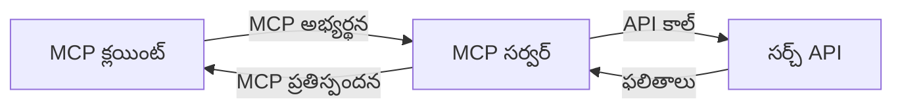
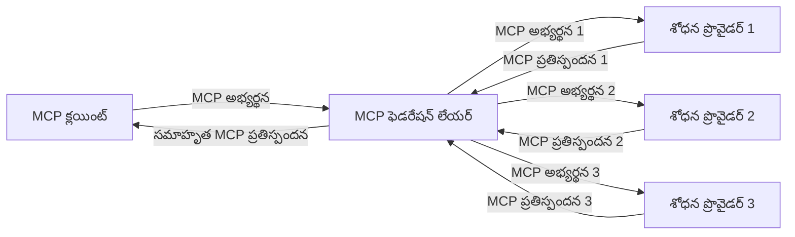
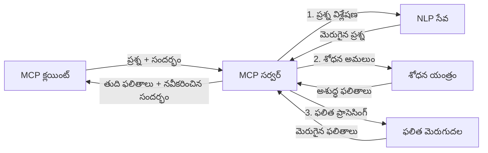

# రియల్-టైమ్ వెబ్ శోధన కోసం మోడల్ కాంటెక్స్ట్ ప్రోటోకాల్

## అవలోకనం

రియల్-టైమ్ వెబ్ శోధన ఈ రోజుల సమాచార-ఆధారిత వాతావరణంలో అవసరం అయిపోయింది, ఇక్కడ అనువర్తనాలు ఇంటర్నెట్‌లో తాజా సమాచారానికి తక్షణమే ప్రాప్తి కోరుకుంటాయి, సంబంధిత మరియు సమయానుకూల స్పందనలు అందించడానికి. మోడల్ కాంటెక్స్ట్ ప్రోటోకాల్ (MCP) ఈ రియల్-టైమ్ శోధన ప్రక్రియలను మెరుగుపరచడంలో ఒక ప్రధాన పురోగతి చూపుతుంది, శోధన సమర్ధతను పెంపొందించడం, సందర్భం అంతర్రాయాన్ని కాపాడటం మరియు మొత్తం సిస్టమ్ పనితీరును మెరుగుపరచడం.

ఈ మాడ్యూల్ MCP రియల్-టైమ్ వెబ్ శోధనను ఎలా మార్చుతుంది, AI మోడల్స్, శోధన ఇంజిన్లు మరియు అనువర్తనాల మధ్య సందర్భ నిర్వహణకు ఒక ప్రమాణీకృత కలపుదల అందించటం ద్వారా అర్థం చేసుకుంటుంది.

### మీరు నేర్చుకునే విషయాలు

ఈ సమగ్ర గైడ్‌లో, మీరు తెలుసుకుంటారు:

- MCP AI మోడల్స్ మరియు రియల్-టైమ్ వెబ్ శోధన సామర్థ్యాల మధ్య సమగ్ర వంతెనను ఎలా సృష్టిస్తుంది
- MCPతో సమర్థవంతమైన మరియు స్కేలబుల్ శోధన పరిష్కారాలను అమలు చేసే ఆర్చిటెక్చరల్ నమూనాలు
- బహుళ ప్రశ్నలు మరియు పరస్పర చర్యలలో శోధన సందర్భాన్ని నిమ్నంగా నిలుపుకునే సాంకేతికతలు
- వివిధ శోధన పరిస్థితులకు పైన Python మరియు JavaScript లో వాస్తవిక కోడ్ అమలులు
- MCP ఆధారిత శోధన వ్యవస్థలలో సంబంధం, తాజాదనం మరియు పనితీరు సమతుల్యత సాధించే పద్ధతులు

## రియల్-టైమ్ వెబ్ శోధనకు పరిచయం

రియల్-టైమ్ వెబ్ శోధన అనేది వెబ్ ఆధారిత సమాచారాన్ని ప్రచురించబడడంతో లేదా నవీకరణకు వచ్చే సమయంలో నిరంతరం ప్రశ్నించటం, ప్రాసెస్ చేయటం మరియు విశ్లేషించటం ద్వారా తాము నిరవధిక శోధన, తాజా మరియు సంబంధిత సమాచారాన్ని తక్కువ ఆలస్యం తో అందించగలిగే సాంకేతిక విధానం. సంప్రదాయ శోధన వ్యవస్థలు గంటలు లేదా రోజులు పాత డేటా మీద ఆధారపడటం వలన తక్కువగా ఉంటే, రియల్-టైమ్ శోధన సజీవ డేటాను వాడి, ఆన్‌లైన్ కంటెంట్ ప్రస్తుత స్థితిని వ్యక్తపరుస్తూ అవగాహన మరియు సమాచారాన్ని అందిస్తుంది.

### రియల్-టైమ్ వెబ్ శోధన ప్రాథమిక భావాలు:

- **నిరంతర ప్రశ్న ప్రక్రియ**: శోధన ప్రశ్నలు నిరంతరం నవీకరణ చేయబడ్డ డేటా వనరులపై ప్రాసెస్ చేయబడతాయి
- **తాజాదనం ప్రాధాన్యత**: వ్యవస్థలు తాజా సమాచారాన్ని ప్రాధాన్యం ఇవ్వడానికి రూపొందించబడ్డాయి
- **సంబంధం సమతుల్యత**: సంబంధం మరియు తాజాదనం మధ్య సమతుల్యతను నిలుపుకోవడం
- **విస్తృత ఆరేఖ**: వ్యవస్థలు బహుళ ప్రశ్నల లోడ్లు మరియు డేటా పరిమాణాలను నిర్వహించగలగాలి
- **సందర్భ సంభాషణా అవగాహన**: శోధన పునరావృతాల్లో ఉపయోగకరిస్తున్న సందర్భాన్ని నిలుపుకోవడం అనివార్యంగా ఉంటుంది
- **క్రియాత్మక ప్రశ్న పునర్నిర్మాణం**: సందర్భం మరియు మునుపటి ఫలితాల ఆధారంగా ప్రశ్నలను అనుకూలంగా మార్పు చేయడం
- **బహుళ-మూలం సమ్మేళనం**: అనేక శోధన ప్రాదాన్యాలు మరియు వెబ్ వనరుల నుండి ఫలితాలను కలపడం
- **అర్థ వ్యర్థతా అవగాహన**: కీవర్డ్ల కంటే అర్థం ఆధారంగా ప్రశ్నలు మరియు కంటెంట్‌ను ప్రాసెస్ చేయడం
- **రియల్-టైమ్ ర్యాంకింగ్**: కొత్త సమాచారం అందుబాటులోకి రాగానే ఫలితాల ర్యాంకింగులను నిరంతరం సర్దుబాటు చేయడం

### మోడల్ కాంటెక్స్ట్ ప్రోటోకాల్ మరియు రియల్-టైమ్ వెబ్ శోధన

మోడల్ కాంటెక్స్ట్ ప్రోటోకాల్ (MCP) రియల్-టైమ్ వెబ్ శోధన వాతావరణాల్లో అనేక కీలక సవాళ్లను పరిష్కరిస్తుంది:

1. **శోధన సందర్భం పరిరక్షణ**: MCP పంపిణీ చేయబడిన శోధన భాగాల మధ్య సందర్భాన్ని ఎలా నిర్వహించాలో ప్రమాణీకరిస్తుంది, AI మోడల్స్ మరియు ప్రాసెసింగ్ నోడ్లకు సంబంధిత ప్రశ్న చరిత్ర మరియు ఉపయోగకరి అభిరుచులకు ప్రాప్యతను నిర్ధారిస్తుంది.

2. **సమర్థవంతమైన ప్రశ్న నిర్వహణ**: సందర్భం ప్రసారానికి నిర్మిత మెకానిజములను అందించడం ద్వారా MCP ప్రతీ శోధన పునరావృతంలో సందర్భాన్ని పునరావృతం చేయడం వల్ల కలిగే అధికభారం తగ్గిస్తుంది.

3. **అంతర్భాగత సామర్ధ్యం**: MCP వివిధ శోధన సాంకేతికతలు మరియు AI మోడల్స్ మధ్య సందర్భం పంచుకోవడానికి సాధారణ భాషను సృష్టించీ మరింత సౌకర్యవంతమైన మరియు విస్తరించగల ఆర్చిటెక్చర్లను సాధ్యమవతుకు చేస్తుంది.

4. **శోధన-అభిముఖ సందర్భం**: MCP అమలులు శోధనకు అత్యంత సంబంధించిన సందర్భ అంశాలను ఎంపిక చేసి, పనితీరు మరియు ఖచ్చితత్వం రెండింటినీ మెరుగుపరచడానికి ప్రాధాన్యత కల్పించగలవు.

5. **అనుకూల శోధన ప్రాసెసింగ్**: MCP ద్వారా సరైన సందర్భ నిర్వహణతో, శోధన వ్యవస్థలు మారుతున్న ఉపయోగకరి అవసరాలు మరియు సమాచార పరిసరాల ఆధారంగా ప్రాసెసింగ్‌ను డైనమిక్‌గా సర్దుబాటు చేయగలవు.

న్యూస్ అగ్రిగేషన్ నుండి పరిశోధన సహాయకారులవరకు ఆధునిక అనువర్తనాలలో, MCP మరియు వెబ్ శోధన సాంకేతికతల సమగ్రత మరింత తెలివైన, సందర్భ-అగ్రహించే శోధనను సాధ్యమవతుకు చేస్తుంది, ఇది ఉపయోగకరి పరస్పర చర్యలు కొనసాగినట్లే మరింత సంబంధిత ఫలితాలను అందిస్తుంది.

## అభ్యసన లక్ష్యాలు

ఈ పాఠం ముగింపులో, మీరు చేయగలరా:

- రియల్-టైమ్ వెబ్ శోధన మరియు ఆధునిక అనువర్తనాలలో దీని సవాళ్ల ప్రాథమిక అంశాలను అవగాహన చేసుకోవడం
- మోడల్ కాంటెక్స్ట్ ప్రోటోకాల్ (MCP) రియల్-టైమ్ వెబ్ శోధన సామర్థ్యాలను ఎలా మెరుగుపరుస్తుందో వివరించడం
- ప్రముఖ ఫ్రేమ్‌వర్క్‌లు మరియు APIsను వాడి MCP-ఆధారిత శోధన పరిష్కారాలను అమలు చేయడం
- MCPతో స్కేలబుల్, అధిక పనితీరు శోధన ఆర్చిటెక్చర్లను రూపకల్పన మరియు అమలు చేయడం
- సేమాంటిక్ శోధన, పరిశోధన సహాయం మరియు AI-సహాయ బౌజింగ్ అలాంటి అనేక ఉపయోగ సందర్భాలలో MCP భావాలను వర్తింపజెయ్యడం
- MCP-ఆధారిత శోధన సాంకేతికతలలో ఎదుగుతున్న ధోరణులు మరియు భవిష్యత్తు అభివృద్దుల్ని మూల్యాంకనం చేయడం
- ఉపయోగకరి పరస్పర చర్యలనుండి నేర్చుకునే సందర్భ-అగ్రహించే శోధన వ్యవస్థలను అభివృద్ధి చేయడం
- ప్రమాణీకృత MCP ప్రోటోకాల్‌లను వాడి AI సహాయకుల్లో వెబ్ శోధన సామర్థ్యాన్ని సమగ్రపరచడం
- సందర్భం ఆధారంగా శోధన ఫలితాలను దశల వారీగా మెరుగుపరచే బహుళ దశల శోధన పైపు లైన్‌లను సృష్టించడం
- సమగ్ర సందర్భ అవగాహనను నిలుపుకున్నప్పటికీ శోధన పనితీరును మెరుగుపరచడం

### నిర్వచనం మరియు ప్రాముఖ్యత

రియల్-టైమ్ వెబ్ శోధన అంటే వెబ్ ఆధారిత సమాచారాన్ని నిరవధికంగా ప్రశ్నించడం, పొందడం మరియు తక్కువ ఆలస్యం తో అందించడం. సంప్రదాయ శోధన ఇంజిన్లు వెబ్‌ను నిరంతరం క్రాల్ చేసి సూచికలు తయారుచేస్తున్నా, రియల్-టైమ్ శోధన అందుబాటులో వచ్చిన వెంటనే సమాచారాన్ని ప్రదర్శించడానికి లక్ష్యంగా ఉంటుంది, అత్యంత తాజా సcontentకి తక్షణ ప్రాప్తిని సాధిస్తుంది.

రియల్-టైమ్ వెబ్ శోధన ముఖ్య లక్షణాలు:

- **తాజాదనం**: తాజా కంటెంట్ మరియు నవీకరణలను ప్రాధాన్యం ఇవ్వడం
- **నిరంతర ప్రాసెసింగ్**: కొత్త సమాచారాన్నివలన నిరంతరం పర్య webనం చేయడం
- **ప్రశ్న అనుకూలత**: సందర్భం మరియు ఫీడ్బ్యాక్ ఆధారంగా శోధన ప్రశ్నలను మెరుగుపరచడం
- **తక్షణ డెలివరీ**: తక్కువ ఆలస్యం ద్వారా శోధన ఫలితాలను అందించడం
- **సందర్భ నిలుపుదల**: మెరుగైన సంబంధితత కోసం మునుపటి ప్రశ్నలపై నిర్మించటం

### సంప్రదాయ వెబ్ శోధనలో సవాళ్లు

సంప్రదాయ వెబ్ శోధన విధానాలు రియల్-టైమ్ సందర్భాలలో కొన్ని పరిమితుల సామన్లు:

1. **సందర్భ విభజన**: బహుళ ప్రశ్నలలో శోధన సందర్భాన్ని నిర్వహించడం కష్టతరమైనది
2. **సమాచారం తాజాదనం**: అత్యంత తాజా సమాచారాన్ని పొందడంలో మరియు ప్రాధాన్యత ఇవ్వడంలో సవాళ్లు
3. **సమ్మేళన సంక్లిష్టత**: శోధన వ్యవస్థలు మరియు అనువర్తనాల మధ్య అంతర్భాగత సౌకర్య సమస్యలు
4. **ఆలస్యం సమస్యలు**: సమగ్ర శోధనతో స్పందన సమయం అవసరాల మధ్య సమతుల్యత
5. **సంబంధం సర్దుబాటు**: తాజాదన ప్రాధాన్యతతో ఖచ్చితత్వం మరియు సంబంధితతను నిర్ధారించడం

## శోధన కోసం మోడల్ కాంటెక్స్ట్ ప్రోటోకాల్ (MCP) అర్థం చేసుకోవడం

### శోధన సందర్భాలలో MCP అంటే ఏమిటి?

మోడల్ కాంటెక్స్ట్ ప్రోటోకాల్ (MCP) అనేది AI మోడల్స్ మరియు అనువర్తనాల మధ్య సమర్థవంతమైన పరస్పర చర్య కోసం రూపొందించిన ప్రమాణీకృత కమ్యూనికేషన్ ప్రోటోకాల్. రియల్-టైమ్ వెబ్ శోధన సందర్భంలో MCP కింది ఫ్రేమ్‌వర్క్‌ను అందిస్తుంది:

- ప్రశ్నల సిరీస్ అంతా శోధన సందర్భాన్ని నిలుపుకోవడం
- శోధన ప్రశ్న మరియు ఫలితాల ఫార్మాట్లను ప్రమాణీకరించడం
- శోధన పారామితులు మరియు ఫలితాల ప్రసారాన్నీ ఆప్టిమైజ్ చేయడం
- మోడల్-టు-శోధన ఇంజిన్ కమ్యూనికేషన్ మెరుగుపరచడం

### ప్రధాన భాగాలు మరియు ఆర్చిటెక్చర్

రియల్-టైమ్ వెబ్ శోధనకోసం MCP ఆర్చిటెక్చర్ అనేక ప్రధాన భాగాల కలయికగా ఉంటుంది:

1. **ప్రశ్న సందర్భ హ్యాండ్లర్లు**: బహుళ ప్రశ్నలలో శోధన సందర్భాన్ని నిర్వహించడం
2. **శోధన ప్రాసెసర్లు**: సందర్భ-అగ్రహించే సాంకేతికతలతో వచ్చే శోధన అభ్యర్థనలను ప్రాసెస్ చేయడం
3. **ప్రోటోకాల్ అడాప్టర్లు**: వివిధ శోధన APIల మధ్య మార్చటం కంటె, సందర్భాన్ని నిలిపి ఉంచడం
4. **సందర్భ నిల్వ**: శోధన చరిత్ర మరియు అభిరుచులను సమర్థవంతంగా నిల్వ చేయడం మరియు పొందడం
5. **శోధన కనెక్టర్లు**: వివిధ శోధన ఇంజిన్లు మరియు వెబ్ APIలకు కనెక్ట్ కావడం


### MCP రియల్-టైమ్ వెబ్ శోధనను ఎలా మెరుగుపరుస్తుంది

MCP సంప్రదాయ వెబ్ శోధన సవాళ్లను ఈ విధంగా పరిష్కరిస్తుంది:

- **సందర్భ నిరంతరత**: మొత్తం శోధన సెషన్ అంతటా ప్రశ్నల మధ్య సంబంధాలను నిలుపుకోవడం
- **ఆప్టిమైజ్డ్ ప్రసారం**: తెలివైన సందర్భ నిర్వహణ ద్వారా శోధన పారామితుల పునరావృతం తగ్గించడం
- **ప్రమాణీకృత ఇంటర్ఫేసులు**: శోధన భాగాల కోసం సुस్పష్ట APIsని అందించడం
- **తక్కువ ఆలస్యం**: సమర్థవంతమైన సందర్భ నిర్వహణతో ప్రాసెసింగ్ లో అధిక భారాన్ని తగ్గించడం
- **పెరిగిన సంబంధం**: బహుళ ప్రశ్నలలో ఉపయోగకరి ఉద్దేశం నిలుపుకొనేందుకు శోధన సంబంధితతను మెరుగుపరచడం

## సమగ్రత మరియు అమలు

రియల్-టైమ్ వెబ్ శోధన వ్యవస్థలకు పనితీరు మరియు సందర్భ అంతర్రాయాన్ని రెండింటినీ నిలుపుకోవడానికి జాగ్రత్తగా ఆర్చిటెక్చరల్ రూపకల్పన మరియు అమలు అవసరం. మోడల్ కాంటెక్స్ట్ ప్రోటోకాల్ AI మోడల్స్ మరియు శోధన సాంకేతికతలను సమగ్రపరచడానికి ప్రమాణీకృత విధానాన్ని అందిస్తుంటే, మరింత సంక్లిష్ట, సందర్భ-అగ్రహించే శోధన పైపు లైన్‌లను సాధ్యం చేస్తుంది.

### శోధన ఆర్చిటెక్చర్లలో MCP ఇంటిగ్రేషన్ అవలోకనం

రియల్-టైమ్ వెబ్ శోధన వాతావరణాలలో MCP అమలు చాలా విషయాలను దృష్టిలో ఉంచుకోవాలి:

1. **శోధన సందర్భ సీరియలైజేషన్**: MCP శోధన అభ్యర్థనలలో సందర్భ సమాచారాన్ని ఎన్‌కోడ్‌ చేయడానికి సమర్థవంతమైన పద్ధతులను అందించి, ముఖ్యమైన సందర్భం ప్రశ్న ప్రాసెసింగ్ పైపు జలాంతరంలో కొనసాగుతుందని నిర్ధారిస్తుంది. ఇందులో శోధన సంబంధిత మెటా డేటాకు అనుకూలమైన ప్రమాణీకృత సీరియలైజేషన్ ఫార్మాట్లు ఉంటాయి.

2. **స్థితి-ఆధారిత శోధన ప్రాసెసింగ్**: MCP దృఢమైన సందర్భ ప్రతినిధిత్వాన్ని నిలుపుకోవడం ద్వారా మరింత తెలివైన స్థితి-కేంద్రిత ప్రాసెసింగ్‌కి అవకాశమిస్తుంది. ఇది ముఖ్యంగా బహుళ దశల శోధన పైపు లైన్లలో ఉపయోగకరమవుతుంది, ఇక్కడ సందర్భం అభివృద్ధి ఫలితాలను మెరుగుపరుస్తుంది.

3. **ప్రశ్న విస్తరణ మరియు మెరుగుదల**: సంచిత_CONTEXT ఆధారంగా ప్రశ్న విస్తరణ మరియు మెరుగుదలలకు MCP అమలులు సహాయం చేస్తూనే, శోధన సెషన్ పురోగతిలో మరింత సంబంధిత ఫలితాలు అందిస్తాయి.

4. **ఫలితం క్యాచింగ్ మరియు ప్రాధాన్యత**: MCP.Context నిర్వహణను ప్రమాణీకరించడం ద్వారా ఫలితాలను క్యాచ్ చేయడం మరియు ప్రాధాన్యత నియంత్రణ సులభం అవుతుంది, శోధన పరిసరాల అభివృద్ధికి అనుగుణంగా భాగాలు అనుకూలమవుతాయి.

5. **శోధన సమ్మేళనం మరియు ఏకీకరణ**: MCP శోధనాన్ని బహుళ బ్యాక్‌ఎండ్లలో మరింత సంక్లిష్టమైన సమ్మేళనానికి సహకరిస్తుంది, ఇది విభిన్న మూలాల నుండి ఫలితాలను మరింత అర్థవంతంగా ఏకీకరించడానికి సందర్భ ప్రతినిధిత్వాన్ని అందిస్తుంది.

వివిధ శోధన సాంకేతికతలపై MCP అమలు ఒక సమగ్ర సందర్భ నిర్వహణ పద్ధతిని సృష్టించి, కస్టమ్ ఇంటిగ్రేషన్ కోడ్ అవసరాన్ని తగ్గించి, శోధన ప్రశ్నలు అభివృద్ధి చెందుతుండగా కూడా అన్వయిస్తూనే సారాంశక సందర్భాన్ని నిలుపుకోవడానికి సిస్టమ్ సామర్ధ్యాన్ని పెంచుతుంది.

### వివిధ వెబ్ శోధన అమలులలో MCP

ఈ ఉదాహరణలు ప్రస్తుత MCP స్పెసిఫికేషన్‌ను అనుసరిస్తున్నాయి, ఇది వేర్వేరు ట్రాన్స్‌పోర్ట్ పద్ధతులతో JSON-RPC ఆధారిత ప్రోటోకాల్‌పై కేంద్రీకృతం. కోడ్ మీరు MCP ప్రోటోకాల్‌తో పూర్తిస్థాయిలో అనుకూలంగా ఉండేటటువంటి అనుకూల శోధన సమ్మేళనాలను ఎలా అమలు చేయవచ్చో చూపిస్తుంది.


<details>
<summary>జనరల్ శోధన APIతో Python అమలు</summary>

```python
import asyncio
import json
import aiohttp
from typing import Dict, Any, Optional, List
from contextlib import asynccontextmanager
from collections.abc import AsyncIterator

# ప్రామాణిక MCP లైబ్రరీలను దిగుమతి చేయండి
from mcp.client.session import ClientSession
from mcp.client.streamable_http import streamablehttp_client
from mcp.types import TextContent, CreateMessageRequestParams, CreateMessageResult
from mcp.server.fastmcp import FastMCP

# వెబ్ శోధన కోసం FastMCP సర్వర్‌ను సృష్టించండి
search_server = FastMCP("WebSearch")

# వెబ్ శోధన కార్యకలాపాలను నిర్వహించే తరగతి
class WebSearchHandler:
    def __init__(self, api_endpoint: str, api_key: str):
        self.api_endpoint = api_endpoint
        self.api_key = api_key
        self.session = None
        
    async def initialize(self):
        """Initialize the HTTP session"""
        self.session = aiohttp.ClientSession(
            headers={"Authorization": f"Bearer {self.api_key}"}
        )
    
    async def close(self):
        """Close the HTTP session"""
        if self.session:
            await self.session.close()
            
    async def perform_search(self, query: str, max_results: int = 5, 
                           include_domains: List[str] = None, 
                           exclude_domains: List[str] = None,
                           time_period: str = "any") -> Dict[str, Any]:
        """Perform web search using the search API"""
        # శోధన పరామితులను రూపొందించండి
        search_params = {
            "q": query,
            "limit": max_results,
            "time": time_period
        }
        
        if include_domains:
            search_params["site"] = ",".join(include_domains)
            
        if exclude_domains:
            search_params["exclude_site"] = ",".join(exclude_domains)
        
        # శోధన అభ్యర్థనను నిర్వహించండి
        try:
            async with self.session.get(
                self.api_endpoint,
                params=search_params
            ) as response:
                if response.status != 200:
                    error_text = await response.text()
                    raise Exception(f"Search API error: {response.status} - {error_text}")
                
                search_data = await response.json()
                
                # API-స్పెసిఫిక్ ప్రతిస్పందనను ప్రామాణిక ఫార్మాట్‌కు మార్చండి
                results = []
                for item in search_data.get("results", []):
                    results.append({
                        "title": item.get("title", ""),
                        "url": item.get("url", ""),
                        "snippet": item.get("snippet", ""),
                        "date": item.get("published_date", ""),
                        "source": item.get("source", "")
                    })
                
                return {
                    "query": query,
                    "totalResults": len(results),
                    "results": results
                }
        except Exception as e:
            print(f"Search API request error: {e}")
            raise

# శోధన నిర్వహణాకర్తను ప్రారంభించండి
search_handler = WebSearchHandler(
    api_endpoint="https://api.search-service.example/search",
    api_key="your-api-key-here"
)

# శోధన నిర్వహణాకర్తను నిర్వహించడానికి లైఫ్ఫ్‌స్పాన్‌ను సెట్ చేయండి
@asyncio.asynccontextmanager
async def app_lifespan(server: FastMCP):
    """Manage application lifecycle"""
    await search_handler.initialize()
    try:
        yield {"search_handler": search_handler}
    finally:
        await search_handler.close()

# సర్వర్ కోసం లైఫ్ఫ్‌స్పాన్‌ను సెట్ చేయండి
search_server = FastMCP("WebSearch", lifespan=app_lifespan)

# వెబ్ శోధన సాధనాన్ని నమోదు చేయండి
@search_server.tool()
async def web_search(query: str, max_results: int = 5, 
                   include_domains: List[str] = None,
                   exclude_domains: List[str] = None,
                   time_period: str = "any") -> Dict[str, Any]:
    """
    Search the web for information
    
    Args:
        query: The search query
        max_results: Maximum number of results to return (default: 5)
        include_domains: List of domains to include in search results
        exclude_domains: List of domains to exclude from search results
        time_period: Time period for results ("day", "week", "month", "any")
        
    Returns:
        Dictionary containing search results
    """
    ctx = search_server.get_context()
    search_handler = ctx.request_context.lifespan_context["search_handler"]
    
    results = await search_handler.perform_search(
        query=query,
        max_results=max_results,
        include_domains=include_domains,
        exclude_domains=exclude_domains,
        time_period=time_period
    )
    
    return results

# ఉదాహరణ క్లయింట్ వాడకం
async def client_example():
    # Streamable HTTP ట్రాన్స్‌పోర్ట్ ద్వారా శోధన సర్వర్‌కు সংযোগించండి
    async with streamablehttp_client("http://localhost:8000/mcp") as (read, write, _):
        async with ClientSession(read, write) as session:
            # కనెక్షన్‌ను ప్రారంభించండి
            await session.initialize()
            
            # web_search సాధనాన్ని పిలవండి
            search_results = await session.call_tool(
                "web_search", 
                {
                    "query": "latest developments in AI and Model Context Protocol",
                    "max_results": 5,
                    "time_period": "day",
                    "include_domains": ["github.com", "microsoft.com"]
                }
            )
            
            print(f"Search results: {search_results}")

# సర్వర్ అమలుద్వారా ఉదాహరణ
if __name__ == "__main__":
    # Streamable HTTP ట్రాన్స్‌పోర్ట్‌తో సర్వర్‌ను నడపండి
    search_server.run(transport="streamable-http")
```
</details> 

<details>
<summary>బ్రౌజర్-ఆధారిత శోధనతో JavaScript అమలు</summary>


```javascript
// వెబ్ శోధన కోసం MCP సర్వర్ అమలు
import { McpServer, ResourceTemplate } from '@modelcontextprotocol/sdk/server/mcp.js';
import { StreamableHTTPServerTransport } from '@modelcontextprotocol/sdk/server/streamableHttp.js';
import { z } from 'zod';

// వెబ్ శోధన కోసం MCP సర్వర్ సృష్టించండి
const searchServer = new McpServer({
    name: "BrowserSearch",
    description: "A server that provides web search capabilities"
});

// శోధన సేవ తరగతి
class SearchService {
    constructor(searchApiUrl, apiKey) {
        this.searchApiUrl = searchApiUrl;
        this.apiKey = apiKey;
    }

    async performSearch(parameters) {
        const {
            query = '',
            maxResults = 5,
            includeDomains = [],
            excludeDomains = [],
            timePeriod = 'any'
        } = parameters;
        
        // పరామితులతో శోధన URL ను నిర్మించండి
        const url = new URL(this.searchApiUrl);
        url.searchParams.append('q', query);
        url.searchParams.append('limit', maxResults);
        url.searchParams.append('time', timePeriod);
        
        if (includeDomains.length > 0) {
            url.searchParams.append('site', includeDomains.join(','));
        }
        
        if (excludeDomains.length > 0) {
            url.searchParams.append('exclude_site', excludeDomains.join(','));
        }
        
        try {
            const response = await fetch(url.toString(), {
                method: 'GET',
                headers: {
                    'Authorization': `Bearer ${this.apiKey}`,
                    'Content-Type': 'application/json'
                }
            });
            
            if (!response.ok) {
                const errorText = await response.text();
                throw new Error(`Search API error: ${response.status} - ${errorText}`);
            }
            
            const searchData = await response.json();
            
            // API-ప్రత్యేక ప్రతిస్పందనను స్టాండర్డ్ ఫార్మాట్ కు మార్పిడి చేయండి
            const results = searchData.results?.map(item => ({
                title: item.title || '',
                url: item.url || '',
                snippet: item.snippet || '',
                date: item.published_date || '',
                source: item.source || ''
            })) || [];
            
            return {
                query,
                totalResults: results.length,
                results
            };
        } catch (error) {
            console.error('Search API request error:', error);
            throw error;
        }
    }
}

// శోధన సేవను ప్రారంభించండి
const searchService = new SearchService(
    'https://api.search-service.example/search',
    'your-api-key-here'
);

// సర్వర్ కోసం సందర్భం ప్రొవైడర్ ఏర్పాటు చేయండి
searchServer.setContextProvider(() => {
    return {
        searchService
    };
});

// వెబ్ శోధన టూల్ నమోదు చేయండి
searchServer.tool({
    name: 'web_search',
    description: 'Search the web for information',
    parameters: {
        type: 'object',
        properties: {
            query: {
                type: 'string',
                description: 'The search query'
            },
            maxResults: {
                type: 'integer',
                description: 'Maximum number of results to return',
                default: 5
            },
            includeDomains: {
                type: 'array',
                items: { type: 'string' },
                description: 'List of domains to include in search results'
            },
            excludeDomains: {
                type: 'array',
                items: { type: 'string' },
                description: 'List of domains to exclude from search results'
            },
            timePeriod: {
                type: 'string',
                description: 'Time period for results',
                enum: ['day', 'week', 'month', 'any'],
                default: 'any'
            }
        },
        required: ['query']
    },
    handler: async (params, context) => {
        const { searchService } = context;
        return await searchService.performSearch(params);
    }
});

// శోధన సర్వర్ కి కనెక్ట్ అయ్యేందుకు ఉదాహరణ క్లయింట్ కోడ్
import { Client } from '@modelcontextprotocol/sdk/client/index.js';
import { StreamableHTTPClientTransport } from '@modelcontextprotocol/sdk/client/streamableHttp.js';

async function connectToSearchServer() {
    // శోధన సర్వర్ కి కనెక్ట్ అవ్వండి
    const transport = new StreamableHTTPClientTransport(
        new URL('http://localhost:8000/mcp')
    );
    
    const client = new Client({
        name: 'search-client',
        version: '1.0.0'
    });
    
    await client.connect(transport);
    
    // శోధన టూల్ ను అమలు చేయండి
    const searchResults = await client.callTool({
        name: 'web_search',
        arguments: {
            query: 'Model Context Protocol implementation examples',
            maxResults: 10,
            timePeriod: 'week',
            includeDomains: ['github.com', 'docs.microsoft.com']
        }
    });
    
    console.log('Search results:', searchResults);
    
    // శుభ్రపరిచుట
    await client.disconnect();
}

// సర్వర్ను ప్రారంభించండి
const transport = new StreamableHTTPServerTransport();
await searchServer.connect(transport);
console.log('Search server running at http://localhost:8000/mcp');

// వేరే ప్రాసెస్ లో లేదా సర్వర్ ప్రారంభమైన తర్వాత
// connectToSearchServer().catch(console.error);
```
</details> 


## కోడ్ ఉదాహరణల పట్టిక

> **ముఖ్య సూచన**: క్రింద ఇచ్చిన కోడ్ ఉదాహరణలు మోడల్ కాంటెక్స్ట్ ప్రోటోకాల్ (MCP) ను వెబ్ శోధన ఫంక్షనాలిటీతో సమగ్రపరిచే విధంగా చూపిస్తున్నాయి. అవి అధికారిక MCP SDKల నమూనాలు మరియు నిర్మాణాలు అనుసరించినప్పటికీ, విద్యా ప్రయోజనాల కోసం సరళీకృతం చేయబడ్డాయి.
> 
> ఈ ఉదాహరణలు చూపిస్తున్నవి:
> 
> 1. **Python అమలు**: ఒక FastMCP సర్వర్ అమలు ఇది ఒక వెబ్ శోధన సాధనం అందించి బాహ్య శోధన APIకి కనెక్ట్ అవుతుంది. ఇది అధికారిక MCP Python SDK [నమూనాలను](https://github.com/modelcontextprotocol/python-sdk) అనుసరించి సరైన జీవిత కాల నిర్వహణ, సందర్భ నిర్వహణ మరియు సాధన అమలు చూపిస్తుంది. సర్వర్ సిఫార్సు చేసిన Streamable HTTP ట్రాన్స్‌పోర్ట్ ఉపయోగిస్తుంది, ఇది మరుగుని SSE ట్రాన్స్‌పోర్ట్ స్థానంలో ప్రొడక్షన్ మైలురాయిలకు ఉపయోగపడుతుంది.
> 
> 2. **JavaScript అమలు**: ఒక TypeScript/JavaScript అమలు ఇది అధికారిక MCP TypeScript SDK [నమూనాను](https://github.com/modelcontextprotocol/typescript-sdk) వీక్షిస్తూ FastMCP నమూనాను ఉపయోగించి సరైన సాధన నిర్వచనాలు మరియు క్లయింట్ కనెక్షన్లతో శోధన సర్వర్‌ను సృష్టిస్తుంది. ఇది సెషన్ నిర్వహణ మరియు సందర్భం పరిరక్షణకు తాజా సిఫార్సు నమూనాలను అనుసరిస్తుంది.
> 
> ఈ ఉదాహరణలకు ప్రొడక్షన్ వాడుక కోసం అదనపు లోపాల నిర్వహణ, ధృవీకరణ మరియు ప్రత్యేక API ఇంటిగ్రేషన్ కోడ్ అవసరం. చూపించిన శోధన API ఎండ్పాయింట్లు (`https://api.search-service.example/search`) ప్లేస్‌హోల్డర్లు మాత్రమే, వాటిని అసలైన శోధన సర్వీస్ ఎండ్పాయింట్లతో మార్చాలి.
> 
> పూర్తి అమలు వివరాలు మరియు తాజా పద్ధతులు కోసం, అధికారిక MCP [స్పెసిఫికేషన్](https://spec.modelcontextprotocol.io/) మరియు SDK డాక్యుమెంటేషన్ చూడండి.

## ముఖ్య భావాలు

### మోడల్ కాంటెక్స్ట్ ప్రోటోకాల్ (MCP) ఫ్రేమ్‌వర్క్

మెరుగైన ప్రాథమికంగా, మోడల్ కాంటెక్స్ట్ ప్రోటోకాల్ AI మోడల్స్, అనువర్తనాలు మరియు సేవల మధ్య సందర్భం మార్పిడి కోసం ప్రమాణీకృత విధానాన్ని అందిస్తుంది. రియల్-టైమ్ వెబ్ శోధనలో, ఈ ఫ్రేమ్‌వర్క్ సమగ్రమైన, బహుళ-తిరుగుబాటు శోధన అనుభవాలను సృష్టించడానికి అవసరం. ముఖ్య భాగాలు:

1. **క్లయింట్-సర్వర్ ఆర్చిటెక్చర్**: MCP శోధన క్లయింట్లు (అభ్యర్థనదారులు) మరియు శోధన సర్వర్‌లు (పరవాణికులు) మధ్య స్పష్టమైన విభజనను ఏర్పరుస్తుంది, ఈ విధంగా వెడల్పైన వినియోగ నమూనాలు సాధ్యమవుతాయి.

2. **JSON-RPC కమ్యూనికేషన్**: ఈ ప్రోటోకాల్ సందేశ మార్పిదలకు JSON-RPC వాడుతుంది, ఇది వెబ్ సాంకేతికతలకు అనుకూలంగా ఉంటుంది మరియు విభిన్న వేదికలపై అమలు చేయడం సులభం.

3. **సందర్భ నిర్వహణ**: MCP బహుళ పరస్పర చర్యలలో శోధన సందర్భాన్ని నిలుపుకునేందుకు, నవీకరించేందుకు, మరియు వినియోగించేందుకు సముచిత పద్ధతులను నిర్వచిస్తుంది.

4. **సాధన నిర్వచనాలు**: శోధన సామర్థ్యాలను ప్రమాణీకృత సాధనలుగా నీటి, స్పష్టమైన పరామితులు మరియు రిటర్న్ విలువలతో అందజేస్తుంది.

5. **స్ట్రీమింగ్ మద్దతు**: ఈ ప్రోటోకాల్ ఫలితాల స్ట్రీమింగ్ ఆమోదిస్తుంది, రియల్-టైమ్ శోధనలో ఫలితాలు క్రమం తప్పకుండా అందట్లేకపోవచ్చు.

### వెబ్ శోధన సమ్మేళన నమూనాలు

MCPను వెబ్ శోధనతో సమగ్రపరిచేటప్పుడు, కొన్ని నమూనాలు ప్రత్యక్షమవుతాయి:

#### 1. డైరెక్ట్ శోధన ప్రొవైడర్ సమ్మేళనం



ఈ నమూనాలో, MCP సర్వర్ నేరుగా ఒకటి లేదా ఎక్కువ శోధన APIలతో ఇంటర్ఫేస్ చేసి, MCP అభ్యర్థనలను API నిర్దిష్ట కాల్స్‌గా మార్చి ఫలితాలను MCP ప్రతిస్పందనలుగా ఫార్మాట్ చేస్తుంది.

#### 2. సందర్భ పరిరక్షణతో కూడిన సమ్మేళిత శోధన



ఈ నమూనా MCP అనుకూల శోధన ప్రొవైడర్లకు బహుళ ప్రశ్నలను పంపించి, ప్రతి ఒక్కరు వివిధ రకాల కంటెంట్ లేదా శోధన సామర్థ్యాలలో నిపుణులు అయితేనూ సంఘటిత సందర్భాన్ని నిలుపుతూ పంపిణీ చేస్తుంది.

#### 3. సందర్భ-Mధల్పరిత శోధన గొలుసు



ఈ నమూనాలో, శోధన ప్రక్రియని పలు దశలుగా విడగొట్టి, ప్రతీ దశలో సందర్భాన్ని సుసంపన్నం చేస్తూ క్రమంగా మరింత సంబంధిత ఫలితాలను అందించడం జరుగుతుంది.

### శోధన సందర్భ భాగాలు

MCP ఆధారిత వెబ్ శోధనలో సందర్భం సాధారణంగా:

- **ప్రశ్న చరిత్ర**: సెషన్‌లోని మునుపటి శోధన ప్రశ్నలు
- **వినియోగకరి అభిరుచులు**: భాష, ప్రాంతం, సేఫ్ శోధన సెడింగ్స్
- **పరస్పర చరిత్ర**: ఏ ఫలితాలను క్లిక్ చేశారో, ఫలితాలపై గడిపిన సమయం
- **శోధన పరామితులు**: ఫిల్టర్లు, శ్రేణీకరణ, మరియు ఇతరశోధన మార్పిడి పరికరాలు
- **విషయ పరిజ్ఞానం**: శోధనకు సంబంధించిన విషయం-విశేష సందర్భం
- **కాలిక సందర్భం**: కాలం ఆధారిత సంబంధిత అంశాలు
- **మూల అభిరుచులు**: నమ్మకమైన లేదా ప్రాధాన్యం కూడిన సమాచార మూలాలు

## ఉపయోగాలు మరియు అనువర్తనాలు

### పరిశోధన మరియు సమాచార సేకరణ

MCP పరిశోధన పనుల సమర్ధతను పెంచుతుంది:

- శోధన సెషన్లలో పరిశోధన సందర్భాన్ని నిలుపుకోవడం
- మరింత సంక్లిష్టంగా మరియు సందర్భానుగుణంగా సంబంధిత ప్రశ్నలకు మద్దతు ఇవ్వడం
- బహుళ మూలాల శోధన సమ్మేళనానికి మద్దతు
- శోధన ఫలితాల నుండి జ్ఞానాన్ని సేకరించడాన్ని సులభం చేయడం

### రియల్-టైమ్ వార్తలు మరియు ట్రెండ్ పరిరక్షణ

MCP ఆధారిత శోధనం వార్తల పర్య webనం కోసం ప్రయోజనాలు అందిస్తుంది:

- దగ్గర-రిఅల్-టైమ్ అభివృద్ధి చెందుతున్న వార్తా కథనాల కనుగొడటం
- సంబంధిత సమాచారానికి సందర్భం ఆధారంగా ఫిల్టరింగ్
- బహుళ మూలాలపై అంశం మరియు వస్తువు ట్రాకింగ్
- వినియోగకరి సందర్భం ఆధారంగా వ్యక్తిగతీకరించిన వార్తా అలర్ట్లు

### AI-సహాయ జాలాన్వేషణ మరియు పరిశోధన

MCP AI-సహాయ Browsingకి కొత్త అవకాశాలను సృష్టిస్తుంది:

- ప్రస్తుత బ్రౌజర్ కార్యకలాపం ఆధారంగా సందర్భ-ఆధారిత శోధన సూచనలు
- వెబ్ శోధనను LLM ఆధారిత సహాయకులతో సమగ్రపరచడం
- సంభాషణా సందర్భం నిలుపుకున్న బహుళ-తిరుగుబాటు శోధన మెరుగుదల
- అభివృద్ధైన వాస్తవ నిర్ధారణ మరియు సమాచార ధృవీకరణ

## భవిష్యత్తు ధోరణులు మరియు కొత్త ఆవిష్కరణలు

### వెబ్ శోధనలో MCP అభివృద్ధి

ఎదురుచూడుతూ, మేము MCP ఈ క్రింది అంశాలను తగ్గించి అభివృద్ధి చెందుతుందని అంచనా వేస్తున్నాము:


- **బహుమాధ్యమ శోధన**: పరిరక్షించబడిన నేపథ్యంలో టెక్స్ట్, చిత్రం, ఆడియో, మరియు వీడియో శోధనలను సమన్వయపరచడం  
- **విభజిత శోధన**: పంపిణీ మరియు ఫెడరేటెడ్ శోధన వ్యవస్థలను మద్దతు ఇవ్వడం  
- **శోధన గోప్యత**: సందర్భ-జ్ఞాన గోప్యత-రక్షణ శోధన యంత్రాంగాలు  
- **ప్రశ్న అర్థం చేసుకోటం**: సహజ భాష శోధన ప్రశ్నల లోతైన సేమాంటిక్ విశ్లేషణ  

### సాంకేతికతలో సాధ్యమైన పురోగతులు

MCP శోధన యొక్క భవిష్యత్తును రూపకల్పన చేసే উদীয়মান సాంకేతికతలు:

1. **న్యూరల్ శోధన శిల్పకళలు**: MCP కోసం ఆప్టిమైజ్ చేయబడిన ఎంబెడ్డింగ్-ఆధారిత శోధన వ్యవస్థలు  
2. **వ్యక్తిగతీకృత శోధన సందర్భం**: కాలక్రమేణా వ్యక్తిగత వినియోగదారుడి శోధన మాదిరులను నేర్చుకోవడం  
3. **జ్ఞాన గ్రాఫ్ సమాగమనం**: డొమైన్-ప్రత్యేక జ్ఞాన గ్రాఫ్‌ల ద్వారా పెంపొందించబడిన సందర్భశీల శోధన  
4. **పరస్పర-మాధ్యమాంతర సందర్భం**: వివిధ శోధన మాధ్యమాల మధ్య సందర్భం నిలుపుకోవడం  

## అనుసmary ఆచరణాత్మక వ్యాయామాలు  

### వ్యాయామం 1: ప్రాథమిక MCP శోధన పైప్‌లైన్‌ను సెటప్ చేయడం  

ఈ వ్యాయామంలో, మీరు నేర్చుకుంటారు:
- ప్రాథమిక MCP శోధన వాతావరణాన్ని కాన్ఫిగర్ చేయడం  
- వెబ్ శోధనకు సందర్భ హ్యాండ్లింగ్ అమలు చేయడం  
- శోధన పునరావృతాలలో సందర్భ పరిరక్షణను పరీక్షించి, ధృవీకరించడం  

### వ్యాయామం 2: MCP శోధనతో పరిశోధనా సహాయకుని నిర్మించడం  

పూర్తి అప్లికేషన్‌ను సృష్టించడం, ఇది:
- సహజ భాష పరిశోధనా ప్రశ్నలను ప్రాసెస్ చేస్తుంది  
- సందర్భ-జ్ఞాన వెబ్ శోధనలు నిర్వహిస్తుంది  
- బహుళ మూలాల నుండి సమాచారాన్ని సారాంశం చేస్తుంది  
- సువ్యవస్థితమైన పరిశోధనా కనుగొండ్రలను ప్రదర్శిస్తుంది  

### వ్యాయామం 3: MCPతో బహుళ మూల శోధన ఫెడరేషన్‌ను అమలు చేయడం  

ప్రగతికరమైన వ్యాయామం, ఇది కవర్ చేస్తుంది:
- బహుళ శోధన యంత్రాలకుటుంచి సందర్భ-జ్ఞాన ప్రశ్న పంపిణీ  
- ఫలితాల ర్యాంకింగ్ మరియు ఏకీకరణ  
- శోధన ఫలితాల సందర్భ అనుకరణ  
- మూల-ప్రత్యేక మెటాడేటా నిర్వహణ  

## అదనపు వనరులు  

- [Model Context Protocol Specification](https://spec.modelcontextprotocol.io/) - అధికారిక MCP స్పెసిఫికేషన్ మరియు విస్తృత ప్రోటోకాల్ డాక్యుమెంటేషన్  
- [Model Context Protocol Documentation](https://modelcontextprotocol.io/) - విస్తృత ట్యుటోరియల్స్ మరియు అమలు గైడ్లు  
- [MCP Python SDK](https://github.com/modelcontextprotocol/python-sdk) - MCP ప్రోటోకాల్ యొక్క అధికారిక Python అమలు  
- [MCP TypeScript SDK](https://github.com/modelcontextprotocol/typescript-sdk) - MCP ప్రోటోకాల్ యొక్క అధికారిక TypeScript అమలు  
- [MCP Reference Servers](https://github.com/modelcontextprotocol/servers) - MCP సర్వర్‌ల సూచన అమలు  
- [Bing Web Search API Documentation](https://learn.microsoft.com/en-us/bing/search-apis/bing-web-search/overview) - మైక్రోసాఫ్ట్ వెబ్ శోధన API  
- [Google Custom Search JSON API](https://developers.google.com/custom-search/v1/overview) - గూగుల్ ప్రోగ్రామబుల్ శోధన ఇంజిన్  
- [SerpAPI Documentation](https://serpapi.com/search-api) - శోధన ఇంజిన్ ఫలితాల పేజీ API  
- [Meilisearch Documentation](https://www.meilisearch.com/docs) - ఓపెన్-సోర్స్ శోధన ఇంజిన్  
- [Elasticsearch Documentation](https://www.elastic.co/guide/index.html) - పంపిణీ షోధన మరియు విశ్లేషణ ఇంజిన్  
- [LangChain Documentation](https://python.langchain.com/docs/get_started/introduction) - LLMలతో అప్లికేషన్‌లు నిర్మించడం  

## నేర్చుకున్న నిష్టలు  

ఈ మాడ్యూల్ పూర్తి చేయడంతో, మీరు సాధించగలుగుతారు:

- రియల్‌టైమ్ వెబ్ శోధన ఆధారాలతో మరియు దాని సవాళ్లను అర్థం చేసుకోవడం  
- మోడల్ కాంటెక్స్ట్ ప్రోటోకాల్ (MCP) రియల్‌టైమ్ వెబ్ శోధన సామర్థ్యాలను ఎలా పెంపొందిస్తుందో వివరించడం  
- ప్రముఖ ఫ్రేమ్‌వర్క్‌లు మరియు APIs ఉపయోగించి MCP-ఆధారిత శోధన పరిష్కారాలను అమలు చేయడం  
- MCPతో స్కేలబుల్, అధిక ప్రదర్శన శోధన శిల్పకళలను రూపకల్పన చేసి, అమలు చేయడం  
- శబ్దార్థ శోధన, పరిశోధనా సహాయం, మరియు AI-పరిణత బ్రౌజింగ్ సహా వివిధ వినియోగాలలో MCP భావనలను అన్వయించడం  
- MCP-ఆధారిత శోధన సాంకేతికాలలో వృద్ధిచెందుతున్న ధోరణులు మరియు భవిష్యత్తు వినూత్నతలను మూల్యాంకనం చేయడం  


### విశ్వాసం మరియు భద్రతా పరిగణనలు  

MCP-ఆధారిత వెబ్ శోధన పరిష్కారాలను అమలు చేయునప్పుడు, MCP విశిష్టత నుండి ఈ ముఖ్యమైన సూత్రాలను గుర్తుంచుకోండి:

1. **వినియోగదారు అనుమతి మరియు నియంత్రణ**: వినియోగదారులు అన్ని డేటా యాక్సెస్ మరియు ఆపరేషన్లకు స్పష్టంగా అనుమతించాలి మరియు అర్థం చేసుకోవాలి. ఇది ప్రత్యేకంగా బాహ్య డేటా మూలాలకు యాక్సెస్ చేసే వెబ్ శోధన అమలు కోసం అవసరం.  

2. **డేటా గోప్యత**: శోధన ప్రశ్నలు మరియు ఫలితాలను సౌకర్యవంతంగా నిర్వహించండి, ముఖ్యంగా అవి సంస్పర్శించదగిన సమాచారం కలిగి ఉంటే. వినియోగదారు డేటాను రక్షించడానికి సరైన యాక్సెస్ నియంత్రణలు అమలు చేయండి.  

3. **పరికరం భద్రత**: శోధన పరికరాల కోసం సరైన అనుమతి మరియు ధృవీకరణను అమలు చేయండి, ఎందుకంటే అవి అనియత కోడ్ అమలును ద్వారా సాంప్రదాయక భద్రతా ప్రమాదాలను కలిగించగలవు. పరికరం ప్రవర్తన వివరణలను అగత్యమైన సర్వర్ నుండి లభించకపోతే నమ్మకమైనదిగా పరిగణించకూడదు.  

4. **స్పష్టమైన డాక్యుమెంటేషన్**: మీ MCP-ఆధారిత శోధన అమలుకు సంబంధించిన సామర్థ్యాలు, పరిమితులు మరియు భద్రతా పరిగణనలను స్పష్టంగా అందించండి, MCP స్పెసిఫికేషన్ నుండి అమలు మార్గదర్శకాలను అనుసరించండి.  

5. **స్థిరమైన అనుమతి ప్రవాహాలు**: ప్రతి పరికరం ఎలాంటి పనులు చేస్తుందో స్పష్టంగా వివరించే స్థిరమైన అనుమతి మరియు అధీకారం ప్రవాహాలను నిర్మించండి, ముఖ్యంగా బాహ్య వెబ్ వనరులతో సంభంధించే పరికరాల కోసం.  

MCP భద్రత మరియు విశ్వాస పరిగణనలపై పూర్తి వివరాలకు, [అధికారిక డాక్యుమెంటేషన్](https://modelcontextprotocol.io/specification/2025-11-25/basic/security_best_practices) చూడండి.  

## తదుపరి ఏమిటి  

- [5.12 Entra ID Authentication for Model Context Protocol Servers](../mcp-security-entra/README.md)  

---

<!-- CO-OP TRANSLATOR DISCLAIMER START -->
**అస్వీకరణ**:
ఈ పత్రం AI అనువాద సేవ [Co-op Translator](https://github.com/Azure/co-op-translator) ఉపయోగించి అనువదించబడింది. మేము ఖచ్చితత్వానికి ప్రయత్నిస్తున్నప్పటికీ, ఆటోమేటెడ్ అనువాదాలు తప్పులు లేదా అసమగ్రతలను కలిగి ఉండవచ్చు. దాని స్వదేశ భాషలో ఉన్న అసలు పత్రాన్ని అధికారం కలిగిన మూలంగా పరిగణించాలి. కీలకమైన సమాచారం కోసం, ప్రొఫెషనల్ మానవ అనువాదాన్ని సిఫారసు చేస్తాము. ఈ అనువాదం ఉపయోగం వల్ల కలిగే ఏవైనా అపార్థాలు లేదా తప్పుదారులు కోసం మేము బాధ్యత వహించము.
<!-- CO-OP TRANSLATOR DISCLAIMER END -->