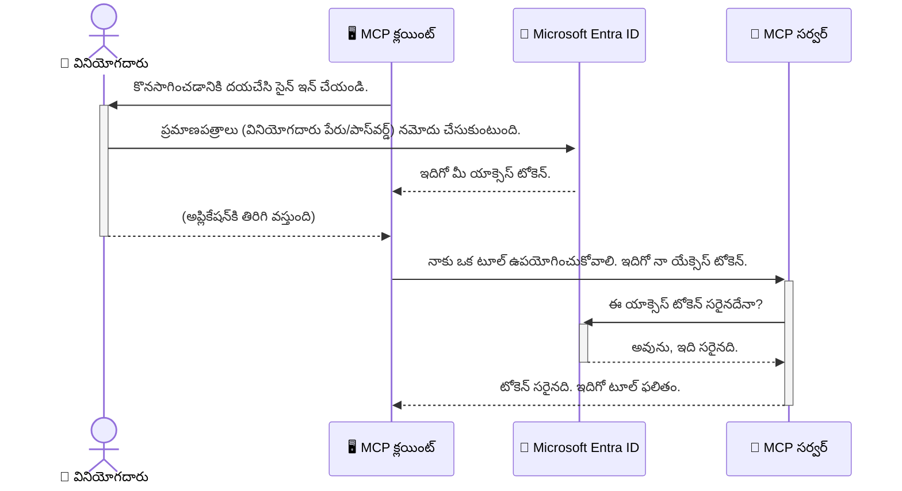

# AI వర్క్‌ఫ్లోలను సురక్షితం చేయడం: మోడల్ కంటెక్స్ట్ ప్రోటోకాల్ సర్వర్స్ కోసం Entra ID ప్రమాణీకరణ  

> [!NOTE]  
> ఈ పాఠంలో రిమోట్ సర్వర్ కోడ్ పూర్వీకృతమైన `/sse` మరియు `/message`  
> ఎండ్పాయింట్లను మరియు MCP `2025-11-25` లక్ష్యాలను రక్షిస్తుంది. దీని గుర్తింపుని మరియు టోకెన్-సరియైన ధ్రువీకరణ  
> విధానాలను కాపాడు, కానీ కొత్త అమలుల కోసం `2026-07-28` అనుకూలమైన Streamable HTTP ట్రాన్స్‌పోర్ట్ ఉపయోగించు.  
 

## పరిచయం  
మీ Model Context Protocol (MCP) సర్వర్‌ను సురక్షితం చేయడం మీ ఇంటి ముందరి తలుపును తాళం వేయడంలానిది ముఖ్యం. మీ MCP సర్వర్‌ను ఓపెన్‌గా ఉంచడం అనధికార ప్రవేశానికి మీ సాధనాలు మరియు డేటాను ఉంచడం, ఇది భద్రతా ఉల్లంఘనలకు దారితీస్తుంది. Microsoft Entra ID బలమైన క్లౌడ్-ఆధారిత గుర్తింపు మరియు యాక్సెస్ నిర్వహణ పరిష్కారం అందిస్తుంది, కేవలం అనధికారిత వినియోగదారులు మరియు అప్లికేషన్లు మీ MCP సర్వర్‌తో పరస్పరం చేయగలుగుతాయి అని ధృవీకరించడంలో సహాయపడుతుంది. ఈ విభాగంలో, మీరు Entra ID ప్రమాణీకరణను ఉపయోగించి మీ AI వర్క్‌ఫ్లోలను రక్షించడం ఎలా చేయాలో నేర్చుకుంటారు.  

## నేర్చుకోవాల్సిన లక్ష్యాలు  
ఈ విభాగం ముగిసినప్పుడు, మీరు చేయగలుగుతారు:  

- MCP సర్వర్లను సురక్షితం చేయడం ముఖ్యం అనే విషయం అర్థం చేసుకోవడం.  
- Microsoft Entra ID మరియు OAuth 2.0 ప్రమాణీకరణ మౌలికాంశాలను వివరించడం.  
- పబ్లిక్ మరియు గోప్య క్లయింట్లు మధ్య తేడాను గుర్తించడం.  
- స్థానిక (పబ్లిక్ క్లయింట్) మరియు రిమోట్ (గోప్య క్లయింట్) MCP సర్వర్ పరిస్థితులలో Entra ID ప్రమాణీకరణను అమలు చేయడం.  
- AI వర్క్‌ఫ్లోలను అభివృద్ధి చేయడంలో భద్రతా ఉత్తమ పద్ధతులను వర్తించడం.  

## భద్రత మరియు MCP  

మీరు మీ ఇంటి ముందు తలుపును తాళం వేయకుండా ఉంచకపోవడం లాంటిదే, మీ MCP సర్వర్‌ను ఎవ్వరైనా ఉపయోగించేందుకు తెనుకే పెట్టకూడదు. మీ AI వర్క్‌ఫ్లోలను సురక్షితం చేయడం, బలమైన, నమ్మకమైన, మరియు సురక్షితమైన అప్లికేషన్లను నిర్మించడానికి అవసరం. ఈ అధ్యాయం Microsoft Entra ID ఉపయోగించి మీ MCP సర్వర్లను సురక్షితం చేయడం గురించి పరిచయం చేస్తుంది, అందుకే కేవలం అనధికార హక్కులున్న వినియోగదారులు మరియు అప్లికేషన్లు మాత్రమే మీ సాధనాలు మరియు డేటాతో పరస్పరం చేయగలుగుతారు.  

## MCP సర్వర్లకు భద్రత ఎందుకు ముఖ్యం?  

మీ MCP సర్వర్‌లో ఇమెయిల్స్ పంపగలిగే లేదా కస్టమర్ డేటాబేస్‌కి యాక్సెస్ చేయగల సాధనం ఉందని ఊహించండి. ఒక సురక్షితంగా లేని సర్వర్ వెన్నడిలో ఎవరు అయినా ఆ సాధనాన్ని ఉపయోగించవచ్చు, అనధికార డేటా యాక్సెస్, స్పామ్, లేదా ఇతర చెడ్డ కార్యక్రమాలకు దారితీస్తుంది.  

ప్రమాణీకరణను అమలు చేయడం ద్వారా, మీరు సర్వర్‌కు చేసే ప్రతి అభ్యర్థనను ధృవీకరిస్తారు, అభ్యర్థన చేసే వినియోగదారు లేదా అప్లికేషన్ యొక్క గుర్తింపును నిర్ధారించుకుంటారు. ఇది AI వర్క్‌ఫ్లోలను సురక్షితం చేయడంలో మొదటి మరియు అత్యంత ముఖ్యమైన దశ.  

## Microsoft Entra ID పరిచయం  

[**Microsoft Entra ID**](https://adoption.microsoft.com/microsoft-security/entra/) అనేది క్లౌడ్ ఆధారిత గుర్తింపు మరియు యాక్సెస్ నిర్వహణ సేవ. దీన్ని మీ అప్లికేషన్లకు విశ్వవ్యాప్త భద్రతా గార్డ్‌గా భావించండి. ఇది వినియోగదారు గుర్తింపులను ధృవీకరించడం (ప్రమాణీకరణ) మరియు వారు ఏమి చేయగలరో నిర్ణయించడం (అనుమతి) అనే క్లిష్టమైన ప్రక్రియను నిర్వహిస్తుంది.  

Entra ID ఉపయోగించి మీరు చేయగలిగింది:  

- వినియోగదారులకు సురక్షిత సైన్-ఇన్‌ను సాధ్య పరచడం.  
- APIs మరియు సేవలను రక్షించడం.  
- యాక్సెస్ విధానాలను ఒక కేంద్ర స్థానం నుంచి నిర్వహించడం.  

MCP సర్వర్ల కోసం, Entra ID మీ సర్వర్ సామర్థ్యాలను సరిగా ఎవరు యాక్సెస్ చేయగలరో నిర్వహించేందుకు ఒక బలమైన మరియు విశ్వసనీయ పరిష్కారాన్ని అందిస్తుంది.  

---  

## మాయాజాలి అర్థం చేసుకోవడం: Entra ID ప్రమాణీకరణ ఎలా పనిచేస్తుందో  

Entra ID **OAuth 2.0** లాంటి ఓపెన్ స్టాండర్డ్స్‌ను ఉపయోగించి ప్రమాణీకరణను నిర్వహిస్తుంది. వివరాలు క్లిష్టంగా ఉండవచ్చు, కానీ ప్రాథమిక భావన సరళమైనది మరియు ఉదాహరణ ద్వారా అర్థంకాగలదు.  

### OAuth 2.0 కు సున్నితమైన పరిచయం: వెలెట్ కీలు  

OAuth 2.0 ను మీ కారు కోసం వెలెట్ సేవ వంటిది అనుకోండి. మీరు రెస్టారెంట్ వద్దికి వచ్చినప్పుడు, మీరు మీ మాస్టర్ కీని వెలెట్‌కు ఇవ్వరు. బదులుగా, మీరు **వెలెట్ కీ**ని ఇస్తారు, ఇది పరిమిత అనుమతులు కలిగి ఉంటుంది—అది కారు స్టార్ట్ చేయగలదు మరియు తలుపులు తాళం వేయగలదు, కానీ ట్రంక్ లేదా గ్లవ్ కంపార్ట్‌మెంట్ తెరవలదు.  

ఈ ఉదాహరణలో:  

- **మీరు** **వినియోగదారు**.  
- **మీ కారు** విలువైన సాధనాలు మరియు డేటాతో కూడిన **MCP సర్వర్**.  
- **వెలెట్** = **Microsoft Entra ID**.  
- **పార్కింగ్ అటెండెంట్** = **MCP క్లయింట్** (సర్వర్‌ను యాక్సెస్ చేయడానికి ప్రయత్నించే అప్లికేషన్).  
- **వెలెట్ కీ** = **యాక్సెస్ టోకెన్**.  

యాక్సెస్ టోకెన్ అనేది Entra ID నుండి మీరు సైన్ ఇన్ అయిన తర్వాత MCP క్లయింట్ అందుకునే సురక్షిత టెక్స్ట్ స్ట్రింగ్. క్లయింట్ ఆ టోకెన్‌ను ప్రతి అభ్యర్థనతో MCP సర్వర్‌కు అందిస్తుంది. సర్వర్ ఆ టోకెన్ సరిచూసి అభ్యర్థన నిజమైనదని మరియు క్లయింట్‌కు అవసరమైన అనుమతులు ఉన్నాయని నిర్ధారించగలదు, అందులో మీ అసలు క్రెడెన్షియల్స్ (పాస్‌వర్డ్ లాంటి) ని ఏమీ హ్యాండిల్ చేయాల్సి ఉండదు.  

### ప్రమాణీకరణ ప్రవాహం  

ఈ ప్రక్రియ ప్రాక్టీసులో ఇలా పనిచేస్తుంది:  


  
### Microsoft Authentication Library (MSAL) పరిచయం  

కోడులోకి రావడానికి ముందు, మీరు ఉదాహరణల్లో చూడబోయే ఒక కీలక భాగమైన **Microsoft Authentication Library (MSAL)** ని పరిచయం చేయడం ముఖ్యం.  

MSAL అనేది Microsoft అభివృద్ధి చేసిన గ్రంథాలయం, ఇది డెవలపర్లకు ప్రమాణీకరణ నిర్వహణను సులభతరం చేస్తుంది. మీరు భద్రతా టోకెన్లను నిర్వహించడానికి, సైన్-ఇన్ లను నిర్వహించడానికి, సెషన్లను రిఫ్రెష్ చేయడానికి సమస్త క్లిష్టమైన కోడ్ రాయాల్సిన అవసరం లేకుండా MSAL భారం తీసుకుంటుంది.  

MSAL వంటి గ్రంథాలయాన్ని ఉపయోగించడం చాలా సిఫార్సు చేయబడింది, ఎందుకంటే:  

- **ఇది సురక్షితం:** ఇది పరిశ్రమ-ప్రామాణిక ప్రోటోకాల్స్ మరియు భద్రతా ఉత్తమ పద్ధతులను అమలు చేస్తుంది, మీ కోడ్‌లో దుర్బలతలను తగ్గిస్తుంది.  
- **ఇది అభివృద్ధిని సులభతరం చేస్తుంది:** OAuth 2.0 మరియు OpenID Connect ప్రోటోకాల్స్ యొక్క క్లిష్టతలను అస్పష్టంగా చేస్తుంది, కొన్ని కోడ్ పంక్తులే ద్వారా బలమైన ప్రమాణీకరణను మీ అప్లికేషన్లో చేరుస్తుంది.  
- **ఇది నిర్వహించబడుతుంది:** Microsoft కొత్త భద్రతా బెదిరింపులు మరియు వేదిక మార్పులకు అనుగుణంగా MSAL ని చురుకుగా నిర్వహిస్తూ నవీకరిస్తుంది.  

MSAL అనేక భాషలు మరియు అప్లికేషన్ ఫ్రేమ్‌వర్క్‌లను మద్దతు ఇస్తుంది, అందులో .NET, JavaScript/TypeScript, Python, Java, Go, మరియు iOS, Android వంటి మొబైల్ వేదికలు ఉన్నాయి. దీని అర్థం మీరు మీ సాంకేతిక స్టాక్ అంతటా సరిగ్గా ఒకటే ప్రమాణీకరణ నమూనాలను ఉపయోగించవచ్చు.  

MSAL గురించి మరింత తెలుసుకోవడానికి, మీరు అధికారిక [MSAL అవలోకనం డాక్యుమెంటేషన్](https://learn.microsoft.com/entra/identity-platform/msal-overview) చూడవచ్చు.  

---  

## Entra IDతో మీ MCP సర్వర్‌ను సురక్షితం చేయడం: దశల వారీ గైడ్  

ఇప్పుడు, Entra IDను ఉపయోగించి స్థానిక MCP సర్వర్ (stdio ద్వారా కమ్యూనికేట్ చేసే) ను సురక్షితం చేసే విధానాన్ని చూద్దాం. ఈ ఉదాహరణ **పబ్లిక్ క్లయింట్** ని ఉపయోగిస్తుంది, ఇది వినియోగదారుని కంప్యూటర్లో నడిచే అప్లికేషన్లకు సరైనది, ఉదా: డెస్క్‌టాప్ యాప్ లేదా స్థానిక అభివృద్ధి సర్వర్.  

### దృష్టాంతం 1: స్థానిక MCP సర్వర్ సురక్షితం చేయడం (పబ్లిక్ క్లయింట్‌తో)  

ఈ దృష్టాంతంలో, మేము `stdio` ద్వారా కమ్యూనికేట్ చేసే స్థానికంగా నడిచే MCP సర్వర్‌ని చూల్దాం, ఇది యూజర్‌ను ఆమేలయ్యే ముందు Entra IDతో ప్రమాణీకరణ చేస్తుంది. సర్వర్ వద్ద ఒకే సాధనం ఉంటుంది, అది Microsoft Graph API నుండి వినియోగదారు ప్రొఫైల్ సమాచారాన్ని తెస్తుంది.  

#### 1. Entra IDలో అప్లికేషన్ సెటప్ చేయడం  

ఏ కోడ్ రాయక ముందే, మీరు Microsoft Entra IDలో మీ అప్లికేషన్‌ను నమోదు చేయాలి. ఇది Entra IDకి మీ అప్లికేషన్ గురించిన సమాచారాన్ని అందిస్తుంది మరియు అది ప్రమాణీకరణ సేవలను ఉపయోగించడానికి అనుమతిస్తుంది.  

1. **[Microsoft Entra పోర్టల్](https://entra.microsoft.com/)** కు వెళ్లండి.  
2. **App registrations** కు వెళ్లి **New registration** క్లిక్ చేయండి.  
3. మీ అప్లికేషన్‌కు పేరు ఇవ్వండి (ఉదా: "My Local MCP Server").  
4. **Supported account types** కోసం **Accounts in this organizational directory only** ఎంచుకోండి.  
5. ఈ ఉదాహరణ కోసం **Redirect URI** ఖాళీగా ఉంచవచ్చు.  
6. **Register** క్లిక్ చేయండి.  

నమోదు చేసిన తర్వాత, **Application (client) ID** మరియు **Directory (tenant) ID**లను గమనించండి. మీరు కోడ్‌లో వీటిని ఉపయోగించాలి.  

#### 2. కోడ్: ఒక విడగొట్టు  

మీరే ధృవీకరణ నిర్వహణ చేసే కీలక భాగాలను పరిశీలిద్దాం. ఈ ఉదాహరణలో పూర్తి కోడ్ [Entra ID - Local - WAM](https://github.com/Azure-Samples/mcp-auth-servers/tree/main/src/entra-id-local-wam) ఫోల్డర్‌లో [mcp-auth-servers GitHub రిపోజిటరీ](https://github.com/Azure-Samples/mcp-auth-servers) లో లభ్యత ఉంది.  

**`AuthenticationService.cs`**  

ఈ క్లాస్ Entra IDతో పరస్పర చర్య నిర్వహించేందుకు బాధ్యత వహిస్తుంది.  

- **`CreateAsync`**: ఈ పద్ధతి MSAL (Microsoft Authentication Library) నుండి `PublicClientApplication`ని ప్రారంభిస్తుంది. ఇది మీ అప్లికేషన్ యొక్క `clientId` మరియు `tenantId` తో కాన్ఫిగర్ చేయబడింది.  
- **`WithBroker`**: ఈ ఫీచర్ ఒక బ్రోకర్ (Windows Web Account Manager వంటిది) ఉపయోగించడాన్ని నమ్మకం కలిగిస్తూ, ఒక మరింత సురక్షితమైన మరియు సులభమైన సింగిల్ సైన్-ఆన్ అనుభవం అందిస్తుంది.  
- **`AcquireTokenAsync`**: ఇది ప్రాథమిక పద్ధతి. మొదట, ఇది సైలెంట్ రీతిలో టోకెన్ పొందడానికి ప్రయత్నిస్తుంది (వినియోగదారు ఇప్పటికే సరైన సెషన్ ఉన్నా మరోసారి సైన్ ఇన్ చేయాల్సిన అవసరం ఉండదు). సైలెంట్ టోకెన్ లభించకపోతే, వినియోగదారుని ఇంటరాక్టివ్‌గా సైన్ ఇన్ చేయమని అడుతుంది.  

```csharp
// Simplified for clarity
public static async Task<AuthenticationService> CreateAsync(ILogger<AuthenticationService> logger)
{
    var msalClient = PublicClientApplicationBuilder
        .Create(_clientId) // Your Application (client) ID
        .WithAuthority(AadAuthorityAudience.AzureAdMyOrg)
        .WithTenantId(_tenantId) // Your Directory (tenant) ID
        .WithBroker(new BrokerOptions(BrokerOptions.OperatingSystems.Windows))
        .Build();

    // ... cache registration ...

    return new AuthenticationService(logger, msalClient);
}

public async Task<string> AcquireTokenAsync()
{
    try
    {
        // Try silent authentication first
        var accounts = await _msalClient.GetAccountsAsync();
        var account = accounts.FirstOrDefault();

        AuthenticationResult? result = null;

        if (account != null)
        {
            result = await _msalClient.AcquireTokenSilent(_scopes, account).ExecuteAsync();
        }
        else
        {
            // If no account, or silent fails, go interactive
            result = await _msalClient.AcquireTokenInteractive(_scopes).ExecuteAsync();
        }

        return result.AccessToken;
    }
    catch (Exception ex)
    {
        _logger.LogError(ex, "An error occurred while acquiring the token.");
        throw; // Optionally rethrow the exception for higher-level handling
    }
}
```
  
**`Program.cs`**  

ఇక్కడ MCP సర్వర్ సెటప్ చేయబడింది మరియు ఆథెంటికేషన్ సేవ ఏకీకృతం చేయబడింది.  

- **`AddSingleton<AuthenticationService>`**: `AuthenticationService`ని డిపెండెన్సీ ఇంజెక్షన్ కంటైనర్‌లో రిజిస్టర్ చేస్తుంది, తద్వారా అప్లికేషన్ ఇతర భాగాలు (మా సాధనం వంటివి) దీనిని ఉపయోగించగలవు.  
- **`GetUserDetailsFromGraph` సాధనం**: ఈ సాధనానికి `AuthenticationService` యొక్క ఇన్స్టాన్స్ కావాలి. ఏమీ చేయక ముందే, అది `authService.AcquireTokenAsync()`ని పిలిచి సరైన యాక్సెస్ టోకెన్ పొందుతుంది. ప్రమాణీకరణ విజయవంతమైతే, టోకెన్ ఉపయోగించి Microsoft Graph APIని పిలిచి వినియోగదారుని వివరాలు తీసుకుంటుంది.  

```csharp
// Simplified for clarity
[McpServerTool(Name = "GetUserDetailsFromGraph")]
public static async Task<string> GetUserDetailsFromGraph(
    AuthenticationService authService)
{
    try
    {
        // This will trigger the authentication flow
        var accessToken = await authService.AcquireTokenAsync();

        // Use the token to create a GraphServiceClient
        var graphClient = new GraphServiceClient(
            new BaseBearerTokenAuthenticationProvider(new TokenProvider(authService)));

        var user = await graphClient.Me.GetAsync();

        return System.Text.Json.JsonSerializer.Serialize(user);
    }
    catch (Exception ex)
    {
        return $"Error: {ex.Message}";
    }
}
```
  
#### 3. అన్ని భాగాలు ఏ విధంగా కలిసి పనిచేస్తాయి  

1. MCP క్లయింట్ `GetUserDetailsFromGraph` సాధనాన్ని ఉపయోగించడానికి ప్రయత్నించినపుడు, సాధనం ముందుగా `AcquireTokenAsync`ని పిలుస్తుంది.  
2. `AcquireTokenAsync` MSAL గ్రంథాలయాన్ని సరైన టోకెన్ కోసం తనిఖీ చేయమని అంటుంది.  
3. టోకెన్ లేకపోతే, MSAL బ్రోకర్ ద్వారా వినియోగదారుని Entra ID అకౌంట్ తో సైన్ ఇన్ చేయమని అడుగుతుంది.  
4. వినియోగదారు సైన్ ఇన్ చేసిన వెంటనే, Entra ID యాక్సెస్ టోకెన్ ఇవ్వడం మొదలు పెట్టుతుంది.  
5. సాధనం ఆ టోకెన్‌ను తీసుకుని Microsoft Graph APIకి భద్రతతో పిలుపునిచ్చుతుంది.  
6. వినియోగదారుని వివరాలు MCP క్లయింట్ కు తిరిగి వస్తాయి.  

ఈ ప్రక్రియ బుద్ధిగా ధృవీకరించిన వినియోగదార్లు మాత్రమే సాధనం ఉపయోగించగలరని నిర్ధారిస్తుంది, మీ స్థానిక MCP సర్వర్‌ను సమర్ధంగా రక్షిస్తుంది.  

### దృష్టాంతం 2: రిమోట్ MCP సర్వర్‌ను సురక్షితం చేయడం (గోప్య క్లయింట్‌తో)  

మీరు MCP సర్వర్‌ను రిమోట్ మెషీన్ (క్లౌడ్ సర్వర్ లాంటి) పై నడపగా, HTTP స్ట్రీమింగ్ వంటి ప్రోటోకాల్ ద్వారా కమ్యూనికేట్ చేస్తున్నప్పుడు, భద్రత అవసరాలు భిన్నంగా ఉంటాయి. ఈ సందర్భంలో, మీరు **గోప్య క్లయింట్** మరియు **Authorization Code Flow** ఉపయోగించాలి. ఇది మరింత సురక్షితమైన పద్ధతి, ఎందుకంటే అప్లికేషన్ రహస్యాలు బ్రౌజర్ లో ఎప్పటికీ బయటపడవు.  

ఈ ఉదాహరణ TypeScript ఆధారిత MCP సర్వర్‌ను ఉపయోగిస్తుంది, ఇది HTTP అభ్యర్థనలను నిర్వహించడానికి Express.js ఉపయోగిస్తుంది.  

#### 1. Entra IDలో అప్లికేషన్‌ను సెటప్ చేయడం  

Entra IDలో సెటప్ పబ్లిక్ క్లయింట్‌తో సారూప్యం, ఒక ముఖ్యమైన తేడాతో: మీరు **client secret** సృష్టించాలి.  

1. **[Microsoft Entra పోర్టల్](https://entra.microsoft.com/)** కు వెళ్ళండి.  
2. మీ అప్లికేషన్ రిజిస్ట్రేషన్‌లో **Certificates & secrets** టాబ్‌కు వెళ్లండి.  
3. **New client secret** అనాని క్లిక్ చేసి, ఒక వివరణ ఇవ్వండి మరియు **Add** క్లిక్ చేయండి.  
4. **ముఖ్యమైనది:** సీక్రెట్ విలువను వెంటనే కాపీ చేసుకోండి. దీన్ని మళ్ళీ చూడలేరు.  
5. మీరు ఒక **Redirect URI** కూడా కాన్ఫిగర్ చేయాలి. **Authentication** టాబ్‌కు వెళ్లి **Add a platform** క్లిక్ చేసి, **Web** ఎంచుకొని మీ అప్లికేషన్ కోసం రీడైరెక్ట్ URI ఇవ్వండి (ఉదా: `http://localhost:3001/auth/callback`).  

> **⚠️ ముఖ్య భద్రతా గమనిక:** ప్రొడక్షన్ అప్లికేషన్ల కోసం, Microsoft క్లయింట్ సీక్రెట్ల బదులు **secretless authentication** పద్ధతులను, ఉదా: **Managed Identity** లేదా **Workload Identity Federation** వాడమని బలంగా సిఫారసు చేస్తుంది. క్లయింట్ సీక్రెట్లు సెక్యూరిటీ ప్రమాదాలకు గురయ్యే అవకాశముంది ఎందుకంటే అవి బయటపడి లేదా దుర్వినియోగం కావచ్చు. మేనేజ్ చేయబడే ఐడెంటిటీలు మీ కోడ్ లేదా కాన్ఫిగరేషన్‌లో క్రెడెన్షియల్స్ నిల్వ చేయాల్సిన ఆవశ్యకత తొలగించి మరింత సురక్షితమైన పరిష్కారాన్ని అందిస్తాయి.  
>  
> మేనేజ్ చేయబడే ఐడెంటిటీల గురించి మరింత సమాచారం మరియు వాటిని ఎలా అమలు చేయాలో తెలుసుకోవడానికి, [Azure రిసోర్సుల కోసం మేనేజ్ చేయబడే ఐడెంటిటీల అవలోకనం](https://learn.microsoft.com/entra/identity/managed-identities-azure-resources/overview) చూడండి.  

#### 2. కోడ్: ఒక విడగొట్టు  

ఈ ఉదాహరణ సెషన్ ఆధారిత మార్గాన్ని ఉపయోగిస్తుంది. వినియోగదారు ప్రమాణీకరించినప్పుడు, సర్వర్ యాక్సెస్ టోకెన్ మరియు రిఫ్రెష్ టోకెన్‌ను సెషన్‌లో నిల్వ చేస్తుంది మరియు వినియోగదారుని ఒక సెషన్ టోకెన్ ఇస్తుంది. ఆ సెషన్ టోకెన్ తరువాతి అభ్యర్థనల కోసం ఉపయోగించబడుతుంది. పూర్తి కోడ్ [Entra ID - Confidential client](https://github.com/Azure-Samples/mcp-auth-servers/tree/main/src/entra-id-cca-session) ఫోల్డర్లో అందుబాటులో ఉంది [mcp-auth-servers GitHub రిపోజిటరీ](https://github.com/Azure-Samples/mcp-auth-servers).  

**`Server.ts`**  

ఈ ఫైల్ Express సర్వర్ మరియు MCP ట్రాన్స్‌పోర్ట్ లేయర్‌ను సెటప్ చేస్తుంది.  

- **`requireBearerAuth`**: ఇది మిడిల్వేర్, `/sse` మరియు `/message` ఎండ్పాయింట్లను రక్షిస్తుంది. ఇది అభ్యర్థన యొక్క `Authorization` హెడర్‌లో సరైన బేరర్ టోకెన్‌ను తనిఖీ చేస్తుంది.  
- **`EntraIdServerAuthProvider`**: ఇది ఒక కస్టమ్ క్లాస్, `McpServerAuthorizationProvider` ఇంటర్‌ఫేస్‌ను అమలు చేస్తుంది. ఇది OAuth 2.0 ప్రవాహాన్ని నిర్వహించడంలో బాధ్యత వహిస్తుంది.  
- **`/auth/callback`**: ఈ ఎండ్పాయింట్ వినియోగదారు ప్రమాణీకరణ తర్వాత Entra ID నుండి రీడైరెక్ట్‌ను నిర్వహిస్తుంది. ఇది అథారైజేషన్ కోడ్‌ను యాక్సెస్ టోకెన్ మరియు రిఫ్రెష్ టోకెన్ కు మార్చుతుంది.  

```typescript
// క్లారణత కోసం సులభతరం చేశారు
const app = express();
const { server } = createServer();
const provider = new EntraIdServerAuthProvider();

// SSE ఎండ్‌పాయింట్‌ను రక్షించండి
app.get("/sse", requireBearerAuth({
  provider,
  requiredScopes: ["User.Read"]
}), async (req, res) => {
  // ... రవాణాకు সংযোগండి ...
});

// సందేశ ఎండ్‌పాయింట్‌ను రక్షించండి
app.post("/message", requireBearerAuth({
  provider,
  requiredScopes: ["User.Read"]
}), async (req, res) => {
  // ... సందేశాన్ని హ్యాండిల్ చేయండి ...
});

// OAuth 2.0 కాల్‌బ్యాక్‌ను నిర్వహించండి
app.get("/auth/callback", (req, res) => {
  provider.handleCallback(req.query.code, req.query.state)
    .then(result => {
      // ... విజయం లేదా విఫలతను హ్యాండిల్ చేయండి ...
    });
});
```
  
**`Tools.ts`**  

ఈ ఫైల్ MCP సర్వర్ అందించే సాధనలను నిర్వచిస్తుంది. `getUserDetails` సాధనం పూర్వపు ఉదాహరణకు సమానం కానీ ఇది టోకెన్‌ను సెషన్ నుండి పొందుతుంది.  

```typescript
// స్పష్టత కోసం సులభతరంగా
server.setRequestHandler(CallToolRequestSchema, async (request) => {
  const { name } = request.params;
  const context = request.params?.context as { token?: string } | undefined;
  const sessionToken = context?.token;

  if (name === ToolName.GET_USER_DETAILS) {
    if (!sessionToken) {
      throw new AuthenticationError("Authentication token is missing or invalid. Ensure the token is provided in the request context.");
    }

    // సెషన్ స్టోర్ నుండి ఎంట్రా ID టోకెన్ పొందండి
    const tokenData = tokenStore.getToken(sessionToken);
    const entraIdToken = tokenData.accessToken;

    const graphClient = Client.init({
      authProvider: (done) => {
        done(null, entraIdToken);
      }
    });

    const user = await graphClient.api('/me').get();

    // ... వినియోగదారు వివరాలు తిరిగి ఇవ్వండి ...
  }
});
```
  
**`auth/EntraIdServerAuthProvider.ts`**  

ఈ క్లాస్ ఈ లాజిక్‌ను నిర్వహిస్తుంది:  

- వినియోగదారుని Entra ID సైన్-ఇన్ పేజీకి రీడైరెక్ట్ చేయడం.  
- అథారైజేషన్ కోడ్‌ను యాక్సెస్ టోకెన్ కి మార్పిడి చేయడం.  
- టోకెన్లను `tokenStore` లో నిల్వ చేయడం.  
- టోకెన్ గడువు ముగిసినప్పుడు యాక్సెస్ టోకెన్‌ను రిఫ్రెష్ చేయడం.  


#### 3. ఇది మొత్తం ఎలా కలిసి పనిచేస్తుంది

1. ఒక వినియోగదారు మొదట MCP సర్వర్‌కు కనెక్ట్ కావడానికి ప్రయత్నించినప్పుడు, `requireBearerAuth` మధ్యవర్తిత్వం వారికి సక్రమ సెషన్ లేదని గమనించి, వారి‌ను Entra ID సైన్-ఇన్ పేజీకి మార్పు చేస్తుంది.
2. వినియోగదారు తమ Entra ID ఖాతాతో సైన్ ఇన్ చేయడం.
3. Entra ID వినియోగదారుడిని `/auth/callback` ఎండ్పాయింట్‌కు ఒక అనుమతిపత్ర కోడ్‌తో తిరిగి మార్గనిర్దేశం చేస్తుంది.
4. సర్వర్ ఆ కోడ్‌ను యాక్సెస్ టోకెన్ మరియు రిఫ్రెష్ టోకెన్ కోసం మార్చి, వాటిని నిల్వ చేస్తుంది మరియు ఒక సెషన్ టోకెన్ తయారుచేసి క్లయింట్‌కు పంపుతుంది.
5. క్లయింట్ అన్ని భవిష్యత్ MCP సర్వర్ అభ్యర్థనల కోసం ఈ సెషన్ టోకెన్‌ను `Authorization` హెడ్డర్‌లో ఉపయోగించుకోవచ్చు.
6. `getUserDetails` టూల్ పిలవబడినప్పుడు, అది సెషన్ టోకెన్ ఉపయోగించి Entra ID యాక్సెస్ టోకెన్‌ను వెతుకుతుంది మరియు ఆ తర్వాత అది Microsoft Graph APIని పిలుస్తుంది.

ఈ ప్రవాహం ప్రజా క్లయింట్ ప్రవాహం కంటే ఎక్కువ క్లిష్టమైనది, కానీ ఇంటర్నెట్-ముఖ్యమైన ఎండ్పాయింట్ల కోసం ఇది అవసరం. రిమోట్ MCP సర్వర్లు ప్రజా ఇంటర్నెట్ మీద సులభంగా అందుబాటులో ఉంటే, అవి అనధికార ప్రాప్యత మరియు సాధ్యమైన దాడుల నుంచి రక్షించుకునేందుకు బలమైన భద్రతా చర్యలు అవసరం.


## భద్రతా ఉత్తమ ప్రథమాలు

- **ఎప్పుడైనా HTTPS ఉపయోగించండి**: క్లయింట్ మరియు సర్వర్ మధ్య సమాచారాన్ని గుప్తీకరించి, టోకెన్లను పట్టుబడకుండా రక్షించండి.
- **పాత్ర ఆధారిత ప్రాప్యత నియంత్రణ (RBAC) అమలు చేయండి**: యూజర్ ధృవీకరించబడ్డాడా అనేది మాత్రమే కాకుండా, వారు ఏ చర్యలు చేయడానికి అనుమతించబడ్డారో కూడా తనిఖీ చేయండి. మీరు Entra IDలో పాత్రలను నిర్వచించి వాటిని MCP సర్వర్‌లో తనిఖీ చేయవచ్చు.
- **నిరీక్షణ మరియు ఆడిట్ చేయండి**: అన్ని ధృవీకరణ ఘటనలను లాగ్ చేయండి, తద్వారా అసమంజస క్రియలను కనుగొనడం మరియు స్పందించడం చేయవచ్చు.
- **రేటు పరిమితి మరియు విరామం నిర్వహణ**: Microsoft Graph మరియు ఇతర APIs దుర్వినియోగం నివారించేందుకు రేటు పరిమితి అమలుచేస్తాయి. MCP సర్వర్‌లో ఎక్స్పోనెన్షియల్ బ్యాక్ ఆఫ్ మరియు పఠనం లాజిక్ అమలు చేసి HTTP 429 (చాలా అభ్యర్థనలు) స్పందనలను సక్రమంగా నిర్వహించండి. API కాల్స్ తగ్గించేందుకు తరచూ యాక్సెస్ అయ్యే డేటాను కాషే చేయడం పరిగణించండి.
- **టోకెన్ నిల్వను భద్రపరచండి**: యాక్సెస్ టోకెన్లు మరియు రిఫ్రెష్ టోకెన్లను సురక్షితంగా నిల్వ చేయండి. స్థానిక అనువర్తనాల కోసం, సిస్టమ్ యొక్క సురక్షిత నిల్వ యాంత్రణలను ఉపయోగించండి. సర్వర్ అనువర్తనాలకు, గుప్తీకృత నిల్వ లేదా Azure Key Vault వంటి సురక్షిత కీల నిర్వహణ సేవలను ఉపయోగించాలని పరిగణించండి.
- **టోకెన్ గడువు నిర్వహణ**: యాక్సెస్ టోకెన్లకు పరిమిత కాలం ఉంటుంది. మళ్లీ ధృవీకరణ అవసరం లేకుండా నిరంతర వినియోగదారు అనుభవాన్ని నిర్వహించేందుకు రిఫ్రెష్ టోకెన్లు ఉపయోగించి ఆటోమేటిక్ టోకెన్ రిఫ్రెష్ అమలు చేయండి.
- **Azure API Management ఉపయోగించడాన్ని పరిగణించండి**: భద్రతను నేరుగా MCP సర్వర్‌లో అమలు చేయడం ద్వారా మీకు సూక్ష్మ నియంత్రణ లభించినప్పటికీ, API గేట్వేస్‌లు (Azure API Management వంటి) అనేక భద్రతా విషయాలను ఆటోమేటిక్గా నిర్వహించవచ్చు, వీటిలో ధృవీకరణ, అనుమతిప్రదానం, రేటు పరిమితి మరియు నిరీక్షణ ఉన్నాయి. ఇవి మీ క్లయింట్లు మరియు MCP సర్వర్ల మధ్య నిలవే కేంద్రీకృత భద్రతా పొరని అందిస్తాయి. MCP తో API గేట్వేస్‌లు ఉపయోగించడం గురించి మరింత సమాచారం కోసం, మా [Azure API Management Your Auth Gateway For MCP Servers](https://techcommunity.microsoft.com/blog/integrationsonazureblog/azure-api-management-your-auth-gateway-for-mcp-servers/4402690) ని చూడండి.


##  ముఖ్యమైన ముచ్చట్లు

- మీ MCP సర్వర్ భద్రపరచడం మీ డేటా మరియు సాధనాల రక్షణకు చాలా ముఖ్యం.
- Microsoft Entra ID ధృవీకరణ మరియు అనుమతిప్రదానం కోసం బలమైన మరియు వ్యాప్తి కలిగిన పరిష్కారాన్ని అందిస్తుంది.
- స్థానిక అనువర్తనాల కోసం **పబ్లిక్ క్లయింట్** మరియు రిమోట్ సర్వర్‌ల కోసం **గోప్య క్లయింట్** ఉపయోగించండి.
- వెబ్ అనువర్తనాల కోసం **Authorization Code Flow** అత్యంత భద్రతా ఎంపిక.


## వ్యాయామం

1. మీరు తయారుచేసే MCP సర్వర్ గురించి ఆలోచించండి. అది స్థానిక సర్వర్ లేదా రిమోట్ సర్వర్ అవుతుందా?
2. మీ సమాధానం ఆధారంగా, మీరు పబ్లిక్ లేదా గోప్య క్లయింట్ ఉపయోగిస్తారా?
3. Microsoft Graph పై చర్యలు చేపడతానికి మీ MCP సర్వర్ ఏ అనుమతిని అభ్యర్థిస్తుంది?


## ప్రాక్టికల్ వ్యాయామాలు

### వ్యాయామం 1: Entra IDలో ఒక అనువర్తనం నమోదు చేయండి
Microsoft Entra పోర్టల్‌కు నావిగేట్ అవండి.
మీ MCP సర్వర్ కోసం ఒక కొత్త అనువర్తనాన్ని నమోదు చేయండి.
అనువర్తనం (క్లయింట్) ID మరియు డైరెక్టరీ (టెనెంట్) ID రికార్డు చేయండి.

### వ్యాయామం 2: స్థానిక MCP సర్వర్‌ను భద్రపరచండి (పబ్లిక్ క్లయింట్)
- MSAL (Microsoft Authentication Library) ను వినియోగదారు ధృవీకరణ కోసం ఏకీకృతం చేయడానికి కోడ్ ఉదాహరణను అనుసరించండి.
- Microsoft Graph నుండి యూజర్ వివరాలు తీయడం కోసం MCP టూల్‌ను పిలివడం ద్వారా ధృవీకరణ ప్రవాహాన్ని పరీక్షించండి.

### వ్యాయామం 3: రిమోట్ MCP సర్వర్‌ను భద్రపరచండి (గోప్య క్లయింట్)
- Entra IDలో గోప్య క్లయింట్‌ను నమోదు చేసి ఒక క్లయింట్ సీక్రెట్ సృష్టించండి.
- మీ Express.js MCP సర్వర్‌ను Authorization Code Flow ఉపయోగించడానికి కాన్ఫిగర్ చేయండి.
- రక్షిత ఎండ్పాయింట్లను పరీక్షించి టోకెన్ ఆధారిత ప్రాప్యతని నిర్ధారించండి.

### వ్యాయామం 4: భద్రతా ఉత్తమ ప్రథమాలను వర్తింపజేయండి
- మీ స్థానిక లేదా రిమోట్ సర్వర్ కోసం HTTPSని సాధ్యం చేయండి.
- మీ సర్వర్ లాజిక్‌లో పాత్ర ఆధారిత ప్రాప్యత నియంత్రణ (RBAC) అమలు చేయండి.
- టోకెన్ గడువు నిర్వహణ మరియు భద్రతా నిల్వను జోడించండి.

## వనరులు

1. **MSAL అవలోకనం డాక్యుమెంటేషన్**  
   Microsoft Authentication Library (MSAL) ఎలా విభిన్న వేదికలపై భద్రతా టోకెన్ సొమ్మె పొందడానికి సహాయపడుతుంది తెలుసుకోండి:  
   [MSAL Overview on Microsoft Learn](https://learn.microsoft.com/en-gb/entra/msal/overview)

2. **Azure-Samples/mcp-auth-servers GitHub రిపోజిటరీ**  
   ధృవీకరణ ప్రవాహాలను ప్రదర్శించే MCP సర్వర్లకు ఉదాహరణ అమలు:  
   [Azure-Samples/mcp-auth-servers on GitHub](https://github.com/Azure-Samples/mcp-auth-servers)

3. **Azure వనరుల కోసం నిర్వహించబడిన ఐడెంటిటీల అవలోకనం**  
   సిస్టమ్ లేదా వినియోగదారు నియమిత నిర్వహించబడిన ఐడెంటిటీలను ఉపయోగించి రహస్యాలను తొలగించడాన్ని అర్థం చేసుకోండి:  
   [Managed Identities Overview on Microsoft Learn](https://learn.microsoft.com/en-us/entra/identity/managed-identities-azure-resources/)

4. **Azure API Management: MCP సర్వర్లకు మీ ధృవీకరణ గేట్వే**  
   MCP సర్వర్లకు సురక్షిత OAuth2 గేట్వేగా APIM ఉపయోగించే ఇప్పుడు లోతైన అవగాహన:  
   [Azure API Management Your Auth Gateway For MCP Servers](https://techcommunity.microsoft.com/blog/integrationsonazureblog/azure-api-management-your-auth-gateway-for-mcp-servers/4402690)

5. **Microsoft Graph అనుమతుల సూచిక**  
   Microsoft Graph కోసం ప్రతినిధిత మరియు అనువర్తన అనుమతుల సమగ్ర జాబితా:  
   [Microsoft Graph Permissions Reference](https://learn.microsoft.com/zh-tw/graph/permissions-reference)


## నేర్చుకున్న ఫలితాలు
ఈ విభాగం పూర్తయిన తర్వాత, మీరు:

- MCP సర్వర్ల మరియు AI వర్క్‌ఫ్లోల కోసం ధృవీకరణ ఎందుకు ముఖ్యమో వివరించగలుగుతారు.
- స్థానిక మరియు రిమోట్ MCP సర్వర్ సందర్భాలలో Entra ID ధృవీకరణను సెట్ అప్ చేసి కాన్ఫిగర్ చేయగలుగుతారు.
- మీ సర్వర్ అమరిక ఆధారంగా సరైన క్లయింట్ రకాన్ని (పబ్లిక్ లేదా గోప్య) ఎంచుకోవచ్చు.
- భద్రతా కోడింగ్ పద్ధతులు, టోకెన్ నిల్వ మరియు పాత్ర ఆధారిత అనుమతిప్రదానం అమలు చేయగలుగుతారు.
- మీ MCP సర్వర్ మరియు సాధనాలను అనధికార ప్రాప్యత నుండి విశ్వాసంగా రక్షించగలుగుతారు.

## తదుపరి ఏమిటి  

- [5.13 Model Context Protocol (MCP) Integration with Microsoft Foundry](../mcp-foundry-agent-integration/README.md)

---

<!-- CO-OP TRANSLATOR DISCLAIMER START -->
**అస్వీకరణ**:
ఈ పత్రం AI అనువాద సేవ [Co-op Translator](https://github.com/Azure/co-op-translator) ఉపయోగించి అనువదించబడింది. మేము ఖచ్చితత్వానికి ప్రయత్నిస్తున్నప్పటికీ, ఆటోమేటెడ్ అనువాదాలు తప్పులు లేదా అసమగ్రతలను కలిగి ఉండవచ్చు. దాని స్వదేశ భాషలో ఉన్న అసలు పత్రాన్ని అధికారం కలిగిన మూలంగా పరిగణించాలి. కీలకమైన సమాచారం కోసం, ప్రొఫెషనల్ మానవ అనువాదాన్ని సిఫారసు చేస్తాము. ఈ అనువాదం ఉపయోగం వల్ల కలిగే ఏవైనా అపార్థాలు లేదా తప్పుదారులు కోసం మేము బాధ్యత వహించము.
<!-- CO-OP TRANSLATOR DISCLAIMER END -->