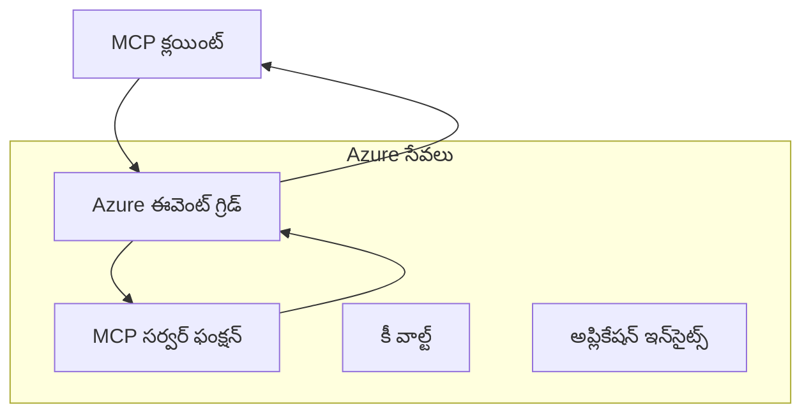
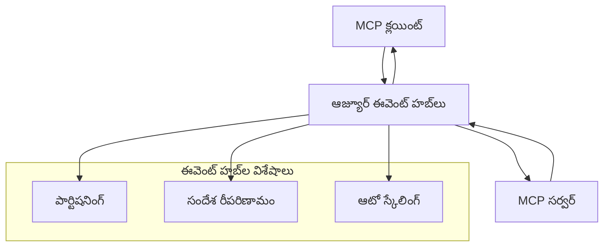

# MCP కస్టమ్ ట్రాన్స్‌పోర్ట్లు - ఆధునిక అమలు మార్గదర్శకం

మోడల్ కాంటెక్స్ట్ ప్రోటోకాల్ (MCP) ప్రత్యేక వాతావరణాల కోసం కస్టమ్ ట్రాన్స్‌పోర్ట్ అమలులను అనుమతిస్తుంది.
ఈ అధికరిణ మార్గదర్శకం Azure ఈవెంట్ గ్రిడ్ మరియు
Azure ఈవెంట్ హబ్స్‌ను ఆర్కిటెక్చర్ నమూనాలుగా పరిశీలిస్తుంది. ఇవి ప్రామాణిక MCP ట్రాన్స్‌పోర్ట్స్
కాగా ఉండవు మరియు రెండు ఎండ్పాయింట్లు కస్టమ్ మ్యాపింగ్‌పై ఒప్పుకోవాలి.

> **MCP `2026-07-28` పరిధి:** ప్రస్తుత ప్రోటోకాల్‌కు ప్రోటోకాల్ స్థాయి
> సెషన్లు లేవు, కాబట్టి కస్టమ్ ట్రాన్స్‌పోర్ట్లు సెషన్ అలంకారం లేదా
> ప్రతి సెషన్ క్రమాన్ని ఆధారపర్చకూడదు. `Mcp-Method` మరియు షరతు `Mcp-Name` హెడర్లు
> ప్రామాణిక స్ట్రీమబుల్ HTTP ట్రాన్స్‌పోర్ట్ అవసరాలు; non-HTTP ట్రాన్స్‌పోర్ట్
> కోసం సమానమైన, స్పష్టంగా ఒప్పుకున్న మ్యాపింగ్ అవసరం ఉంటే మధ్యవర్తులు JSON-RPC శరీరం డీకోడ్ చేయకుండా రూట్ చేయాలి.
> చూడండి
> [MCPలో ఏం మారింది: 2026-07-28 స్పెసిఫికేషన్](../../01-CoreConcepts/mcp-2026-07-28.md).

## పరిచయం

MCP యొక్క ప్రామాణిక ట్రాన్స్‌పోర్ట్లు stdio మరియు స్ట్రీమబుల్ HTTP. కొన్ని ఎంటర్ప్రైజ్
వాతావరణాలు ఉన్న ఆధారిత సందేశ పంపిణీ
మౌలిక సదుపాయాలతో అనుసంధానం కొరకు కస్టమ్ మ్యాపింగ్ ఉపయోగిస్తాయి, కానీ ఇది MCP హోస్ట్‌లు మరియు
ప్రామాణిక ట్రాన్స్‌పోర్ట్లను మాత్రమే అమలు చేసే SDKలతో సమవాయ్యతను తగ్గించవచ్చు.

ఈ పాఠం MCP స్పెసిఫికేషన్
`2026-07-28` యొక్క రహిత స్థితి డిమాండ్లను Azure సందేశ సేవలు మరియు ఏర్పడిన ఎంటర్ప్రైజ్ ఇంటిగ్రేషన్
నమూనాలకు వర్తింప జేస్తుంది.

### **MCP ట్రాన్స్‌పోర్ట్ ఆర్కిటెక్చర్**

**MCP స్పెసిఫికేషన్ `2026-07-28` నుండి:**

- **ప్రామాణిక ట్రాన్స్‌పోర్ట్లు**: stdio మరియు స్ట్రీమబుల్ HTTP
- **కస్టమ్ ట్రాన్స్‌పోర్ట్లు**: ఐచ్ఛికం, అమలుపరమైన స్పెసిఫిక్ మ్యాపింగ్స్ రెండు ఎండ్పాయింట్లు ఒప్పుకున్నవి

- **సందేశ ఫార్మాట్**: JSON-RPC 2.0 MCP-స్పెసిఫిక్ విస్తరణలతో
- **స్వీయ-సంపూర్ణ అభ్యర్థనలు**: అభ్యర్థనల మధ్య స్థితిని తీసుకునే ప్రోటోకాల్ సెషన్ లేదా హ్యాండ్‌షేక్ లేదు


## నేర్చుకునే లక్ష్యాలు

ఈ అధునాతన పాఠం చివరికి, మీరు చేయగలుగుతారు:

- **కస్టమ్ ట్రాన్స్‌పోర్ట్ డిమాండ్లను అర్థం చేసుకోండి**: ఏదైనా ట్రాన్స్‌పోర్ట్ లేయర్ మీద MCP ప్రోటోకాల్ అమలు చేయండి మరియు అనుగుణతను నిర్ధారించండి
- **Azure ఈవెంట్ గ్రిడ్ ట్రాన్స్‌పోర్ట్ నిర్మించండి**: సర్వర్ లేని వ్యాప్తి కొరకు ఈవెంట్ ఆధారిత MCP సర్వర్లను Azure ఈవెంట్ గ్రిడ్ ఉపయోగించి సృష్టించండి
- **Azure ఈవెంట్ హబ్స్ ట్రాన్స్‌పోర్ట్ అమలు చేయండి**: Azure ఈవెంట్ హబ్స్ ఉపయోగించి గరిష్ట నెలతీ, రియల్-టైం స్ట్రీమింగ్ కల MCP పరిష్కారాలు గడపండి
- **ఎంటర్ప్రైజ్ నమూనాలు వర్తించండి**: ఉన్న Azure మౌలిక సదుపాయాలు మరియు భద్రతా మోడల్స్‌తో కస్టమ్ ట్రాన్స్‌పోర్ట్లను అనుసంధానించండి
- **ట్రాన్స్‌పోర్ట్ విశ్వసనీయతను నిర్వహించండి**: సందేశ స్థిరత్వం, క్రమం మరియు లోప నిర్వహణను ఎంటర్ప్రైజ్ సందర్భాలకు అమలు చేయండి
- **పనితీరు మెరుగుపర్చండి**: విస్తీర్ణం, ఆలస్యం, మరియు నెలతీ డిమాండులకు ట్రాన్స్‌పోర్ట్ పరిష్కారాలను రూపకల్పన చేయండి

## **ట్రాన్స్‌పోర్ట్ డిమాండ్లు**

### **MCP `2026-07-28` కొరకు ప్రధాన డిమాండ్లు**

```yaml
Message Protocol:
  format: "JSON-RPC 2.0 with MCP extensions"
    correlation: "Match responses to requests by JSON-RPC id"
    state: "Each request must be self-contained"
  
Transport Layer:
  reliability: "Transport MUST handle connection failures gracefully"
  security: "Transport MUST support secure communication"
    identification: "Carry protocol version, capabilities, and identity per request"
  
Custom Transport:
    compliance: "Map the selected MCP revision without adding session assumptions"
  extensibility: "MAY add transport-specific features"
    interoperability: "Both endpoints MUST agree on the custom mapping"
```

## **Azure ఈవెంట్ గ్రిడ్ ట్రాన్స్‌పోర్ట్ అమలు**

Azure ఈవెంట్ గ్రిడ్ ఈవెంట్ ఆధారిత MCP ఆర్కిటెక్చర్లకు అనువైన సర్వర్ లేని ఈవెంట్ రూటింగ్ సేవను అందిస్తుంది. ఈ అమలు వ్యాప్తించగలిగిన, స్వల్ప బంధిత MCP వ్యవస్థలను నిర్మించడం ఎలా అనేది చూపిస్తుంది.

### **ఆర్కిటెక్చర్ అవలోకనం**



### **C# అమలు - ఈవెంట్ గ్రిడ్ ట్రాన్స్‌పోర్ట్**

```csharp
using Azure.Messaging.EventGrid;
using Microsoft.Extensions.Azure;
using System.Text.Json;

public class EventGridMcpTransport : IMcpTransport
{
    private readonly EventGridPublisherClient _publisher;
    private readonly string _topicEndpoint;
    private readonly string _clientId;
    
    public EventGridMcpTransport(string topicEndpoint, string accessKey, string clientId)
    {
        _publisher = new EventGridPublisherClient(
            new Uri(topicEndpoint), 
            new AzureKeyCredential(accessKey));
        _topicEndpoint = topicEndpoint;
        _clientId = clientId;
    }
    
    public async Task SendMessageAsync(McpMessage message)
    {
        var eventGridEvent = new EventGridEvent(
            subject: $"mcp/{_clientId}",
            eventType: "MCP.MessageReceived",
            dataVersion: "1.0",
            data: JsonSerializer.Serialize(message))
        {
            Id = Guid.NewGuid().ToString(),
            EventTime = DateTimeOffset.UtcNow
        };
        
        await _publisher.SendEventAsync(eventGridEvent);
    }
    
    public async Task<McpMessage> ReceiveMessageAsync(CancellationToken cancellationToken)
    {
        // Event Grid is push-based, so implement webhook receiver
        // This would typically be handled by Azure Functions trigger
        throw new NotImplementedException("Use EventGridTrigger in Azure Functions");
    }
}

// Azure Function for receiving Event Grid events
[FunctionName("McpEventGridReceiver")]
public async Task<IActionResult> HandleEventGridMessage(
    [EventGridTrigger] EventGridEvent eventGridEvent,
    ILogger log)
{
    try
    {
        var mcpMessage = JsonSerializer.Deserialize<McpMessage>(
            eventGridEvent.Data.ToString());
        
        // Process MCP message
        var response = await _mcpServer.ProcessMessageAsync(mcpMessage);
        
        // Send response back via Event Grid
        await _transport.SendMessageAsync(response);
        
        return new OkResult();
    }
    catch (Exception ex)
    {
        log.LogError(ex, "Error processing Event Grid MCP message");
        return new BadRequestResult();
    }
}
```

### **TypeScript అమలు - ఈవెంట్ గ్రిడ్ ట్రాన్స్‌పోర్ట్**

```typescript
import { EventGridPublisherClient, AzureKeyCredential } from "@azure/eventgrid";
import { McpTransport, McpMessage } from "./mcp-types";

export class EventGridMcpTransport implements McpTransport {
    private publisher: EventGridPublisherClient;
    private clientId: string;
    
    constructor(
        private topicEndpoint: string,
        private accessKey: string,
        clientId: string
    ) {
        this.publisher = new EventGridPublisherClient(
            topicEndpoint,
            new AzureKeyCredential(accessKey)
        );
        this.clientId = clientId;
    }
    
    async sendMessage(message: McpMessage): Promise<void> {
        const event = {
            id: crypto.randomUUID(),
            source: `mcp-client-${this.clientId}`,
            type: "MCP.MessageReceived",
            time: new Date(),
            data: message
        };
        
        await this.publisher.sendEvents([event]);
    }
    
    // ఈవెంట్-డ్రైవెన్ స్వీకరణ Azure Functions ద్వారా
    onMessage(handler: (message: McpMessage) => Promise<void>): void {
        // అమలుబద్ధత Azure Functions ఈవెంట్ గ్రిడ్ ట్రిగర్ ఉపయోగిస్తుంది
        // ఇది వెబ్‌హుక్ రిసీవర్ కోసం ఒక భావనాత్మక ఇంటరఫేస్
    }
}

// Azure Functions అమలుబద్ధత
import { app, InvocationContext, EventGridEvent } from "@azure/functions";

app.eventGrid("mcpEventGridHandler", {
    handler: async (event: EventGridEvent, context: InvocationContext) => {
        try {
            const mcpMessage = event.data as McpMessage;
            
            // MCP సందేశాన్ని ప్రాసెస్ చేయండి
            const response = await mcpServer.processMessage(mcpMessage);
            
            // ఈవెంట్ గ్రిడ్ ద్వారా ప్రతిస్పందన పంపండి
            await transport.sendMessage(response);
            
        } catch (error) {
            context.error("Error processing MCP message:", error);
            throw error;
        }
    }
});
```

### **Python అమలు - ఈవెంట్ గ్రిడ్ ట్రాన్స్‌పోర్ట్**

```python
from azure.eventgrid import EventGridPublisherClient, EventGridEvent
from azure.core.credentials import AzureKeyCredential
import asyncio
import json
from typing import Callable, Optional
import uuid
from datetime import datetime

class EventGridMcpTransport:
    def __init__(self, topic_endpoint: str, access_key: str, client_id: str):
        self.client = EventGridPublisherClient(
            topic_endpoint, 
            AzureKeyCredential(access_key)
        )
        self.client_id = client_id
        self.message_handler: Optional[Callable] = None
    
    async def send_message(self, message: dict) -> None:
        """Send MCP message via Event Grid"""
        event = EventGridEvent(
            data=message,
            subject=f"mcp/{self.client_id}",
            event_type="MCP.MessageReceived",
            data_version="1.0"
        )
        
        await self.client.send(event)
    
    def on_message(self, handler: Callable[[dict], None]) -> None:
        """Register message handler for incoming events"""
        self.message_handler = handler

# Azure ఫంక్షన్స్ అమలు
import azure.functions as func
import logging

def main(event: func.EventGridEvent) -> None:
    """Azure Functions Event Grid trigger for MCP messages"""
    try:
        # ఈవెంట్ గ్రిడ్ ఈవెంట్ నుండి MCP సందేశాన్ని పార్స్ చేయండి
        mcp_message = json.loads(event.get_body().decode('utf-8'))
        
        # MCP సందేశాన్ని ప్రాసెస్ చేయండి
        response = process_mcp_message(mcp_message)
        
        # ఈవెంట్ గ్రిడ్ ద్వారా ప్రతిస్పందన పంపండి
        # (అమలు కొత్త ఈవెంట్ గ్రిడ్ క్లయింట్‌ను సృష్టిస్తుంది)
        
    except Exception as e:
        logging.error(f"Error processing MCP Event Grid message: {e}")
        raise
```

## **Azure ఈవెంట్ హబ్స్ ట్రాన్స్‌పోర్ట్ అమలు**

Azure ఈవెంట్ హబ్స్ తక్కువ ఆలస్యం మరియు భారీ సందేశ పరిమాణం అవసరమైన MCP పరిసరాల కోసం గరిష్ట నెలతీ, రియల్-టైం స్ట్రీమింగ్ సామర్ధ్యాలను అందిస్తుంది.

### **ఆర్కిటెక్చర్ అవలోకనం**




### **C# అమలు - ఈవెంట్ హబ్ ట్రాన్స్‌పోర్ట్**

```csharp
using Azure.Messaging.EventHubs;
using Azure.Messaging.EventHubs.Producer;
using Azure.Messaging.EventHubs.Consumer;
using System.Text;

public class EventHubsMcpTransport : IMcpTransport, IDisposable
{
    private readonly EventHubProducerClient _producer;
    private readonly EventHubConsumerClient _consumer;
    private readonly string _consumerGroup;
    private readonly CancellationTokenSource _cancellationTokenSource;
    
    public EventHubsMcpTransport(
        string connectionString, 
        string eventHubName,
        string consumerGroup = "$Default")
    {
        _producer = new EventHubProducerClient(connectionString, eventHubName);
        _consumer = new EventHubConsumerClient(
            consumerGroup, 
            connectionString, 
            eventHubName);
        _consumerGroup = consumerGroup;
        _cancellationTokenSource = new CancellationTokenSource();
    }
    
    public async Task SendMessageAsync(McpMessage message)
    {
        var messageBody = JsonSerializer.Serialize(message);
        var eventData = new EventData(Encoding.UTF8.GetBytes(messageBody));
        
        // Add MCP-specific properties
        eventData.Properties.Add("MessageType", message.Method ?? "response");
        eventData.Properties.Add("MessageId", message.Id);
        eventData.Properties.Add("Timestamp", DateTimeOffset.UtcNow);
        
        await _producer.SendAsync(new[] { eventData });
    }
    
    public async Task StartReceivingAsync(
        Func<McpMessage, Task> messageHandler)
    {
        await foreach (PartitionEvent partitionEvent in _consumer.ReadEventsAsync(
            _cancellationTokenSource.Token))
        {
            try
            {
                var messageBody = Encoding.UTF8.GetString(
                    partitionEvent.Data.EventBody.ToArray());
                var mcpMessage = JsonSerializer.Deserialize<McpMessage>(messageBody);
                
                await messageHandler(mcpMessage);
            }
            catch (Exception ex)
            {
                // Handle deserialization or processing errors
                Console.WriteLine($"Error processing message: {ex.Message}");
            }
        }
    }
    
    public void Dispose()
    {
        _cancellationTokenSource?.Cancel();
        _producer?.DisposeAsync().AsTask().Wait();
        _consumer?.DisposeAsync().AsTask().Wait();
        _cancellationTokenSource?.Dispose();
    }
}
```

### **TypeScript అమలు - ఈవెంట్ హబ్ ట్రాన్స్‌పోర్ట్**

```typescript
import { 
    EventHubProducerClient, 
    EventHubConsumerClient, 
    EventData 
} from "@azure/event-hubs";

export class EventHubsMcpTransport implements McpTransport {
    private producer: EventHubProducerClient;
    private consumer: EventHubConsumerClient;
    private isReceiving = false;
    
    constructor(
        private connectionString: string,
        private eventHubName: string,
        private consumerGroup: string = "$Default"
    ) {
        this.producer = new EventHubProducerClient(
            connectionString, 
            eventHubName
        );
        this.consumer = new EventHubConsumerClient(
            consumerGroup,
            connectionString,
            eventHubName
        );
    }
    
    async sendMessage(message: McpMessage): Promise<void> {
        const eventData: EventData = {
            body: JSON.stringify(message),
            properties: {
                messageType: message.method || "response",
                messageId: message.id,
                timestamp: new Date().toISOString()
            }
        };
        
        await this.producer.sendBatch([eventData]);
    }
    
    async startReceiving(
        messageHandler: (message: McpMessage) => Promise<void>
    ): Promise<void> {
        if (this.isReceiving) return;
        
        this.isReceiving = true;
        
        const subscription = this.consumer.subscribe({
            processEvents: async (events, context) => {
                for (const event of events) {
                    try {
                        const messageBody = event.body as string;
                        const mcpMessage: McpMessage = JSON.parse(messageBody);
                        
                        await messageHandler(mcpMessage);
                        
                        // కనీసం ఒకసారి డెలివరీ కోసం చెక్పాయింట్‌ను నవీకరించండి
                        await context.updateCheckpoint(event);
                    } catch (error) {
                        console.error("Error processing Event Hubs message:", error);
                    }
                }
            },
            processError: async (err, context) => {
                console.error("Event Hubs error:", err);
            }
        });
    }
    
    async close(): Promise<void> {
        this.isReceiving = false;
        await this.producer.close();
        await this.consumer.close();
    }
}
```

### **Python అమలు - ఈవెంట్ హబ్ ట్రాన్స్‌పోర్ట్**

```python
from azure.eventhub import EventHubProducerClient, EventHubConsumerClient
from azure.eventhub import EventData
import json
import asyncio
from typing import Callable, Dict, Any
import logging

class EventHubsMcpTransport:
    def __init__(
        self, 
        connection_string: str, 
        eventhub_name: str,
        consumer_group: str = "$Default"
    ):
        self.producer = EventHubProducerClient.from_connection_string(
            connection_string, 
            eventhub_name=eventhub_name
        )
        self.consumer = EventHubConsumerClient.from_connection_string(
            connection_string,
            consumer_group=consumer_group,
            eventhub_name=eventhub_name
        )
        self.is_receiving = False
    
    async def send_message(self, message: Dict[str, Any]) -> None:
        """Send MCP message via Event Hubs"""
        event_data = EventData(json.dumps(message))
        
        # MCP-ప్రత్యేక లక్షణాలను జోడించండి
        event_data.properties = {
            "messageType": message.get("method", "response"),
            "messageId": message.get("id"),
            "timestamp": "2025-01-14T10:30:00Z"  # నిజమైన టైమ్‌స్టాంప్ ఉపయోగించండి
        }
        
        async with self.producer:
            event_data_batch = await self.producer.create_batch()
            event_data_batch.add(event_data)
            await self.producer.send_batch(event_data_batch)
    
    async def start_receiving(
        self, 
        message_handler: Callable[[Dict[str, Any]], None]
    ) -> None:
        """Start receiving MCP messages from Event Hubs"""
        if self.is_receiving:
            return
        
        self.is_receiving = True
        
        async with self.consumer:
            await self.consumer.receive(
                on_event=self._on_event_received(message_handler),
                starting_position="-1"  # ప్రారంభం నుండి మొదలుపెట్టు
            )
    
    def _on_event_received(self, handler: Callable):
        """Internal event handler wrapper"""
        async def handle_event(partition_context, event):
            try:
                # ఈవెంట్ హబ్ ఈవెంట్ నుండి MCP సందేశాన్ని పార్స్ చేయండి
                message_body = event.body_as_str(encoding='UTF-8')
                mcp_message = json.loads(message_body)
                
                # MCP సందేశాన్ని ప్రాసెస్ చేయండి
                await handler(mcp_message)
                
                # కనీసం ఒకసారి డెలివరీ కోసం చెక్పాయింట్‌ను నవీకరించండి
                await partition_context.update_checkpoint(event)
                
            except Exception as e:
                logging.error(f"Error processing Event Hubs message: {e}")
        
        return handle_event
    
    async def close(self) -> None:
        """Clean up transport resources"""
        self.is_receiving = False
        await self.producer.close()
        await self.consumer.close()
```

## **అధునాతన ట్రాన్స్‌పోర్ట్ నమూనాలు**

### **సందేశాలు నిలకడ మరియు నమ్మకత**

```csharp
// Implementing message durability with retry logic
public class ReliableTransportWrapper : IMcpTransport
{
    private readonly IMcpTransport _innerTransport;
    private readonly RetryPolicy _retryPolicy;
    
    public async Task SendMessageAsync(McpMessage message)
    {
        await _retryPolicy.ExecuteAsync(async () =>
        {
            try
            {
                await _innerTransport.SendMessageAsync(message);
            }
            catch (TransportException ex) when (ex.IsRetryable)
            {
                // Log and retry
                throw;
            }
        });
    }
}
```

### **ట్రాన్స్‌పోర్ట్ భద్రత సమన్వయం**

```csharp
// Integrating Azure Key Vault for transport security
public class SecureTransportFactory
{
    private readonly SecretClient _keyVaultClient;
    
    public async Task<IMcpTransport> CreateEventGridTransportAsync()
    {
        var accessKey = await _keyVaultClient.GetSecretAsync("EventGridAccessKey");
        var topicEndpoint = await _keyVaultClient.GetSecretAsync("EventGridTopic");
        
        return new EventGridMcpTransport(
            topicEndpoint.Value.Value,
            accessKey.Value.Value,
            Environment.MachineName
        );
    }
}
```

### **ట్రాన్స్‌పోర్ట్ మానిటరింగ్ మరియు పరిశీలన**

```csharp
// Adding telemetry to custom transports
public class ObservableTransport : IMcpTransport
{
    private readonly IMcpTransport _transport;
    private readonly ILogger _logger;
    private readonly TelemetryClient _telemetryClient;
    
    public async Task SendMessageAsync(McpMessage message)
    {
        using var activity = Activity.StartActivity("MCP.Transport.Send");
        activity?.SetTag("transport.type", "EventGrid");
        activity?.SetTag("message.method", message.Method);
        
        var stopwatch = Stopwatch.StartNew();
        
        try
        {
            await _transport.SendMessageAsync(message);
            
            _telemetryClient.TrackDependency(
                "EventGrid",
                "SendMessage",
                DateTime.UtcNow.Subtract(stopwatch.Elapsed),
                stopwatch.Elapsed,
                true
            );
        }
        catch (Exception ex)
        {
            _telemetryClient.TrackException(ex);
            throw;
        }
    }
}
```

## **ఎంటర్ప్రైజ్ సమన్వయ సన్నివేశాలు**

### **సన్నివేశం 1: పంపిణీ చేసిన MCP ప్రాసెసింగ్**

బహుళ ప్రాసెసింగ్ నోడ్లలో MCP అభ్యర్థనలను పంపిణీ చేయడానికి Azure ఈవెంట్ గ్రిడ్ ఉపయోగించడం:

```yaml
Architecture:
  - MCP Client sends requests to Event Grid topic
  - Multiple Azure Functions subscribe to process different tool types
  - Results aggregated and returned via separate response topic
  
Benefits:
  - Horizontal scaling based on message volume
  - Fault tolerance through redundant processors
  - Cost optimization with serverless compute
```

### **సన్నివేశం 2: రియల్‌టైమ్ MCP స్ట్రీమింగ్**

అధిక స్కంద MCP పరస్పర చర్యలకు Azure ఈవెంట్ హబ్‌లు ఉపయోగించడం:

```yaml
Architecture:
  - MCP Client streams continuous requests via Event Hubs
  - Stream Analytics processes and routes messages
  - Multiple consumers handle different aspect of processing
  
Benefits:
  - Low latency for real-time scenarios
  - High throughput for batch processing
  - Built-in partitioning for parallel processing
```

### **సన్నివేశం 3: హైబ్రిడ్ ట్రాన్స్‌పోర్ట్ నిర్మాణం**

వేర్వేరు వాడుకలకు బహుళ ట్రాన్స్‌పోర్ట్ల కలయిక:

```csharp
public class HybridMcpTransport : IMcpTransport
{
    private readonly IMcpTransport _realtimeTransport; // Event Hubs
    private readonly IMcpTransport _batchTransport;    // Event Grid
    private readonly IMcpTransport _fallbackTransport; // HTTP Streaming
    
    public async Task SendMessageAsync(McpMessage message)
    {
        // Route based on message characteristics
        var transport = message.Method switch
        {
            "tools/call" when IsRealtime(message) => _realtimeTransport,
            "resources/read" when IsBatch(message) => _batchTransport,
            _ => _fallbackTransport
        };
        
        await transport.SendMessageAsync(message);
    }
}
```

## **ప్రదర్శన ఆప్టిమైజేషన్**

### **ఈవెంట్ గ్రిడ్‌కు సందేశ బ్యాచింగ్**

```csharp
public class BatchingEventGridTransport : IMcpTransport
{
    private readonly List<McpMessage> _messageBuffer = new();
    private readonly Timer _flushTimer;
    private const int MaxBatchSize = 100;
    
    public async Task SendMessageAsync(McpMessage message)
    {
        lock (_messageBuffer)
        {
            _messageBuffer.Add(message);
            
            if (_messageBuffer.Count >= MaxBatchSize)
            {
                _ = Task.Run(FlushMessages);
            }
        }
    }
    
    private async Task FlushMessages()
    {
        List<McpMessage> toSend;
        lock (_messageBuffer)
        {
            toSend = new List<McpMessage>(_messageBuffer);
            _messageBuffer.Clear();
        }
        
        if (toSend.Any())
        {
            var events = toSend.Select(CreateEventGridEvent);
            await _publisher.SendEventsAsync(events);
        }
    }
}
```

### **ఈవెంట్ హబ్‌ల కోసం పార్టిషనింగ్ వ్యూహం**

```csharp
public class PartitionedEventHubsTransport : IMcpTransport
{
    public async Task SendMessageAsync(McpMessage message)
    {
        // Partition by client ID for session affinity
        var partitionKey = ExtractClientId(message);
        
        var eventData = new EventData(JsonSerializer.SerializeToUtf8Bytes(message))
        {
            PartitionKey = partitionKey
        };
        
        await _producer.SendAsync(new[] { eventData });
    }
}
```

## **అనుకూల ట్రాన్స్‌పోర్ట్లను పరీక్షించడం**

### **టెస్ట్ డబ్బులుతో యూనిట్ టెస్టింగ్**

```csharp
[Test]
public async Task EventGridTransport_SendMessage_PublishesCorrectEvent()
{
    // Arrange
    var mockPublisher = new Mock<EventGridPublisherClient>();
    var transport = new EventGridMcpTransport(mockPublisher.Object);
    var message = new McpMessage { Method = "tools/list", Id = "test-123" };
    
    // Act
    await transport.SendMessageAsync(message);
    
    // Assert
    mockPublisher.Verify(
        x => x.SendEventAsync(
            It.Is<EventGridEvent>(e => 
                e.EventType == "MCP.MessageReceived" &&
                e.Subject == "mcp/test-client"
            )
        ),
        Times.Once
    );
}
```

### **Azure టెస్ట్ కంటైనర్లతో సమగ్ర పరీక్ష**

```csharp
[Test]
public async Task EventHubsTransport_IntegrationTest()
{
    // Using Testcontainers for integration testing
    var eventHubsContainer = new EventHubsContainer()
        .WithEventHub("test-hub");
    
    await eventHubsContainer.StartAsync();
    
    var transport = new EventHubsMcpTransport(
        eventHubsContainer.GetConnectionString(),
        "test-hub"
    );
    
    // Test message round-trip
    var sentMessage = new McpMessage { Method = "test", Id = "123" };
    McpMessage receivedMessage = null;
    
    await transport.StartReceivingAsync(msg => {
        receivedMessage = msg;
        return Task.CompletedTask;
    });
    
    await transport.SendMessageAsync(sentMessage);
    await Task.Delay(1000); // Allow for message processing
    
    Assert.That(receivedMessage?.Id, Is.EqualTo("123"));
}
```

## **ఉత్తమ ఆచారాలు మరియు మార్గదర్శకాలు**

### **ట్రాన్స్‌పోర్ట్ డిజైన్ సూత్రాలు**

1. **సామ్యకర్యత**: ప్రతిని నిర్వహించడానికి సందేశ ప్రాసెసింగ్ సామ్యకార్యంగా ఉండాలని నిర్ధారించండి
2. **లోప నిర్వహణ**: సంపూర్ణ లోప నిర్వహణ మరియు డెడ్ లెటర్ క్యూలు అమలు చేయండి
3. **మానిటరింగ్**: విస్తృత టెలిమెట్రీ మరియు ఆరోగ్య తనిఖీలు జోడించండి
4. **భద్రత**: నిర్వహించబడే గుర్తింపులు మరియు కనిష్ఠ ప్రివిలేజ్ యాక్సెస్ ఉపయోగించండి
5. **ప్రదర్శన**: మీ నిర్దిష్ట ఆలస్యం మరియు స్‍త్రాహిత సంబంధిత అవసరాలకు అనుగుణంగా డిజైన్ చేయండి

### **Azure-సందర్భ-specific సిఫారసులు**

1. **నిర్వహించబడే గుర్తింపు ఉపయోగించండి**: ఉత్పత్తిలో కనక్షన్ స్ట్రింగ్‌లను అవసరం లేదు
2. **సర్కిట్ బ్రేకర్లు అమలు చేయండి**: Azure సేవ అవుటేజుల నుండి కాపాడు
3. **ఖర్చులను పరిశీలించండి**: సందేశ వాల్యూమ్ మరియు ప్రాసెసింగ్ ఖర్చులను ట్రాక్ చేయండి
4. **స్కేలింగ్ కోసం ప్రణాళిక చేయండి**: ఇప్పటికే పార్టిషనింగ్ మరియు స్కేలింగ్ వ్యూహాలు రూపొందించండి
5. **విస్తృతంగా పరీక్షించండి**: Azure DevTest Labs ఉపయోగించి సమగ్ర పరీక్ష చేయండి

## **నिष్కర్ష**

కస్టమ్ MCP ట్రాన్స్‌పోర్ట్లు Azure యొక్క సందేశ సేవలను ఉపయోగించి శక్తివంతమైన ఎంటర్ప్రైజ్ సన్నివేశాలను సుమారు చేస్తాయి. ఈవెంట్ గ్రిడ్ లేదా ఈవెంట్ హబ్స్ ట్రాన్స్‌పోర్ట్లను అమలు చేయడం ద్వారా, మీరు స్కేలబుల్, నమ్మకమైన MCP పరిష్కారాలను నిర్మించవచ్చు, అవి ప్రస్తుతం ఉన్న Azure మౌలిక సదుపాయాలతో సజావుగా సమన్వయించబడతాయి.

ఇచ్చిన ఉదాహరణలు MCP ప్రోటోకాల్ అనుగుణ్యతను మరియు Azure ఉత్తమ ఆచారాలను కాపాడుతూ, కస్టమ్ ట్రాన్స్‌పోర్ట్ల అమలుకు ప్రొడక్షన్-సిద్ధమైన నమూనాలను ప్రదర్శిస్తాయి.

## **అదనపు వనరులు**

- [MCP Specification 2026-07-28](https://modelcontextprotocol.io/specification/2026-07-28/)
- [Azure Event Grid Documentation](https://docs.microsoft.com/azure/event-grid/)
- [Azure Event Hubs Documentation](https://docs.microsoft.com/azure/event-hubs/)
- [Azure Functions Event Grid Trigger](https://docs.microsoft.com/azure/azure-functions/functions-bindings-event-grid)
- [Azure SDK for .NET](https://github.com/Azure/azure-sdk-for-net)
- [Azure SDK for TypeScript](https://github.com/Azure/azure-sdk-for-js)
- [Azure SDK for Python](https://github.com/Azure/azure-sdk-for-python)

---

> *ఈ మార్గదర్శకం కస్టమ్ నిర్మాణ నమూనాలపై దృష్టి సారిస్తుంది. ప్రోటోకాల్‌ను ధృవీకరించండి

> [MCP Specification 2026-07-28](https://modelcontextprotocol.io/specification/2026-07-28/) కంటే ప్రవర్తన,
> మరియు మీ అవసరాలు మరియు సేవ పరిమితుల ఆధారంగా Azure ఉపయోగాన్ని ధృవీకరించండి.*


## తదుపరి ఏమిటి
- [6. కమ్యూనిటీ సహాయాలు](../../06-CommunityContributions/README.md)

---

<!-- CO-OP TRANSLATOR DISCLAIMER START -->
**అస్వీకరణ**:
ఈ పత్రం AI అనువాద సేవ [Co-op Translator](https://github.com/Azure/co-op-translator) ఉపయోగించి అనువదించబడింది. మేము ఖచ్చితత్వానికి ప్రయత్నిస్తున్నప్పటికీ, ఆటోమేటెడ్ అనువాదాలు తప్పులు లేదా అసమగ్రతలను కలిగి ఉండవచ్చు. దాని స్వదేశ భాషలో ఉన్న అసలు పత్రాన్ని అధికారం కలిగిన మూలంగా పరిగణించాలి. కీలకమైన సమాచారం కోసం, ప్రొఫెషనల్ మానవ అనువాదాన్ని సిఫారసు చేస్తాము. ఈ అనువాదం ఉపయోగం వల్ల కలిగే ఏవైనా అపార్థాలు లేదా తప్పుదారులు కోసం మేము బాధ్యత వహించము.
<!-- CO-OP TRANSLATOR DISCLAIMER END -->