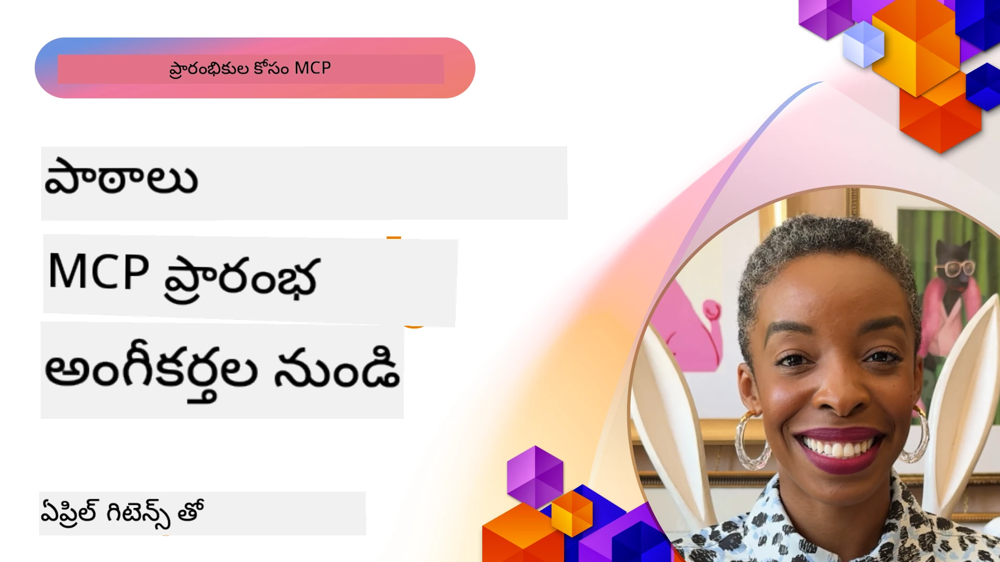

# 🌟 ప్రారంభ స్వీకారकर्ताओं నుండి పాఠాలు

[](https://youtu.be/jds7dSmNptE)

_(ఈ పాఠానికి సంబంధించిన వీడియోని వీక్షించడానికి పై చిత్రాన్ని క్లిక్ చేయండి)_

## 🎯 ఈ మాడ్యూల్ ఏమి కవర్ చేస్తుంది

ఈ మాడ్యూల్ వాస్తవ సంస్థలు మరియు డెవలపర్లు మోడల్ కాంటెక్స్ట్ ప్రోటోకాల్ (MCP) ను ఎలా ఉపయోగించి ససలైన సవాళ్ళను పరిష్కరించి, కొత్త ఆవిష్కరణలకు దారితీస్తున్నారో పరిశీలిస్తుంది. వివరమైన సందర్భ అధ్యయనాలు, ప్రాక్టికల్ ప్రాజెక్టులు మరియు ఉదాహరణల ద్వారా, మీరు MCP ద్వారా భద్రమైన, స్కేలబుల్ AI అనుసంధానం ఎలా సాధ్యమవుతుందో తెలుసుకుంటారు, ఇది భాషా నమూనాలు, ఉపకరణాలు మరియు ఎంటర్‌ప్రైజ్ డేటాను కనెక్ట్ చేస్తుంది.

### 📚 సమర్థవంతంగా MCP ను చూడండి

మీరు ఈ సూత్రాలు ప్రొడక్షన్ కి సిద్ధమైన టూల్స్ లో ఎలా వర్తిస్తాయో చూడాలనుకుంటున్నారా? మా [**10 Microsoft MCP సర్వర్లు, డెవలపర్ ఉత్పాదకతను మార్చేస్తున్నవి**](microsoft-mcp-servers.md) చూడండి, ఇవి మీరు ఈ రోజే ఉపయోగించగల నిజమైన Microsoft MCP సర్వర్లను చూపిస్తాయి.

## అవలోకనం

ఈ పాఠం ప్రారంభ స్వీకారకులు మోడల్ కాంటెక్స్ట్ ప్రోటోకాల్ (MCP) ను వాస్తవిక ప్రపంచ సవాళ్ళను పరిష్కరించడానికి, పరిశ్రమల ద్వారా ఆవిష్కరణను నడిపేందుకు ఎలా ఉపయోగించుకున్నారో పరిశీలిస్తుంది. విస్తృత సందర్భ అధ్యయనాలు మరియు చేతితో ప్రాజెక్టుల ద్వారా, మీరు MCP ఎలా ప్రమాణీకృతమైన, భద్రమైన మరియు స్కేలబుల్ AI అనుసంధానాన్ని సక్రమం చేస్తుందో చూడగలుగుతారు – పెద్ద భాషా నమూనాలు, టూల్స్ మరియు ఎంటర్‌ప్రైజ్ డేటాను సమగ్ర ఫ్రేమ్‌వర్క్‌లో కవర్ చేస్తుంది. మీరు MCP-ఆధారిత పరిష్కారాలను రూపకల్పన చేయడం మరియు నిర్మించడం లో ప్రత్యక్ష అనుభవం పొందతారు, పరిగణన చేసిన అమలు నమూనాలు నేర్చుకుంటారు, అలాగే ప్రొడక్షన్ వాతావరణాల్లో MCP ని అమలు చేసే ఉత్తమ పద్ధతులు తెలుసుకుంటారు. ఈ పాఠం MCP సాంకేతికత మరియు దాని వైవిధ్యవంతమైన ఎకోసిస్టమ్ యొక్క నిలిచిపోతున్న ధోరణులు, భవిష్యత్తు దిక్కులను మరియు ఓపెన్ సోర్స్ వనరులను కూడా ప్రతిపాదిస్తుంది.

## నేర్చుకునే లక్ష్యాలు

- వేర్వేరు పరిశ్రమలలో వాస్తవ MCP అమలలను విశ్లేషించండి
- పూర్తి MCP-ఆధారిత యాప్లికేషన్లను రూపకల్పన చేసి నిర్మించండి
- MCP సాంకేతికంలో ఎదుగుతున్న ధోరణులు మరియు భవిష్యత్తు దిశలను అన్వేషించండి
- వాస్తవ అభివృద్ధి పరిస్థితుల్లో ఉత్తమ పద్ధతులు అమలు చేయండి

## వాస్తవ MCP అమలలు

### సందర్భ అధ్యయనం 1: ఎంటర్‌ప్రైజ్ కస్టమర్ సపోర్ట్ ఆటోమేషన్

ఒక బహుజాతీయ సంస్థ MCP-ఆధారిత పరిష్కారాన్ని అమలు చేసి తమ కస్టమర్ సపోర్ట్ సిస్టమ్‌లలో AI పరస్పర చర్యలను ప్రమాణీకరించింది. దీనివల్ల వారు సాధించగలిగింది:

- బహుళ LLM ప్రొవైడర్లు కోసం ఏకీకృత ఇంటర్‌ఫేస్ సృష్టించండి
- విభాగాలందరి అంతటా స్థిరమైన ప్రాంప్ట్ నిర్వహణను నిర్వహించండి
- బలమైన భద్రత మరియు అనుగుణత నియంత్రణలను అమలు చేయండి
- నిర్దిష్ట అవసరాలపై ఆధారపడి వేర్వేరు AI నమూనాల మధ్య సులభంగా మార్పిడి చేయగలుగుతూ ఉండండి

**సాంకేతిక అమలు:**

```python
# కస్టమర్ సపోర్ట్ కోసం Python MCP సర్వర్ అమలు
import logging
import asyncio
from modelcontextprotocol import create_server, ServerConfig
from modelcontextprotocol.server import MCPServer
from modelcontextprotocol.transports import create_http_transport
from modelcontextprotocol.resources import ResourceDefinition
from modelcontextprotocol.prompts import PromptDefinition
from modelcontextprotocol.tool import ToolDefinition

# లాగింగ్‌ను కాన్ఫిగర్ చేయండి
logging.basicConfig(level=logging.INFO)

async def main():
    # సర్వర్ కాన్ఫిగరేషన్ సృష్టించండి
    config = ServerConfig(
        name="Enterprise Customer Support Server",
        version="1.0.0",
        description="MCP server for handling customer support inquiries"
    )
    
    # MCP సర్వర్‌ను ప్రారంభించండి
    server = create_server(config)
    
    # జ్ఞాన బేస్ వనరులను దరఖాస్తు చేయండి
    server.resources.register(
        ResourceDefinition(
            name="customer_kb",
            description="Customer knowledge base documentation"
        ),
        lambda params: get_customer_documentation(params)
    )
    
    # ప్రాంప్ట్ టెంప్లేట్లను నమోదు చేయండి
    server.prompts.register(
        PromptDefinition(
            name="support_template",
            description="Templates for customer support responses"
        ),
        lambda params: get_support_templates(params)
    )
    
    # సపోర్ట్ టూల్స్‌ను నమోదు చేయండి
    server.tools.register(
        ToolDefinition(
            name="ticketing",
            description="Create and update support tickets"
        ),
        handle_ticketing_operations
    )
    
    # HTTP ట్రాన్స్‌పోర్ట్‌తో సర్వర్‌ను ప్రారంభించండి
    transport = create_http_transport(port=8080)
    await server.run(transport)

if __name__ == "__main__":
    asyncio.run(main())
```

**ఫలితాలు:** నమూనా ఖర్చుల్లో 30% తగ్గింపు, ప్రతిస్పందన స్థిరత్వంలో 45% మెరుగుదల, మరియు గ్లోబల్ ఆపరేషన్లలో అనుగుణతలో సాంకేతిక అభివృద్ధి.

### సందర్భ అధ్యయనం 2: హెల్త్‌కేర్ డయాగ్నోస్టిక్ అసిస్టెంట్

ఒక హెల్త్‌కేర్ ప్రొవైడర్ MCP మౌలిక సదుపాయాన్ని అభివృద్ధి చేసి, బహుళ ప్రత్యేక వైద్య AI నమూనాలను అనుసంధానించి, సున్నితమైన రోగి డేటాను రక్షణలో ఉంచింది:

- సాధారణ మరియు ప్రత్యేక వైద్య నమూనాల మధ్య సాఫీ మార్పిడి
- కఠినమైన ప్రైవసీ నియంత్రణలు మరియు ఆడిట్ ట్రైళ్లు
- గడిచిన ఎలక్ట్రానిక్ హెల్త్ రికార్డు (EHR) సిస్టమ్‌లతో అనుసంధానం
- వైద్య పదజాలం కోసం స్థిరమైన ప్రాంప్ట్ ఇంజనీరింగ్

**సాంకేతిక అమలు:**

```csharp
// C# MCP host application implementation in healthcare application
using Microsoft.Extensions.DependencyInjection;
using ModelContextProtocol.SDK.Client;
using ModelContextProtocol.SDK.Security;
using ModelContextProtocol.SDK.Resources;

public class DiagnosticAssistant
{
    private readonly MCPHostClient _mcpClient;
    private readonly PatientContext _patientContext;
    
    public DiagnosticAssistant(PatientContext patientContext)
    {
        _patientContext = patientContext;
        
        // Configure MCP client with healthcare-specific settings
        var clientOptions = new ClientOptions
        {
            Name = "Healthcare Diagnostic Assistant",
            Version = "1.0.0",
            Security = new SecurityOptions
            {
                Encryption = EncryptionLevel.Medical,
                AuditEnabled = true
            }
        };
        
        _mcpClient = new MCPHostClientBuilder()
            .WithOptions(clientOptions)
            .WithTransport(new HttpTransport("https://healthcare-mcp.example.org"))
            .WithAuthentication(new HIPAACompliantAuthProvider())
            .Build();
    }
    
    public async Task<DiagnosticSuggestion> GetDiagnosticAssistance(
        string symptoms, string patientHistory)
    {
        // Create request with appropriate resources and tool access
        var resourceRequest = new ResourceRequest
        {
            Name = "patient_records",
            Parameters = new Dictionary<string, object>
            {
                ["patientId"] = _patientContext.PatientId,
                ["requestingProvider"] = _patientContext.ProviderId
            }
        };
        
        // Request diagnostic assistance using appropriate prompt
        var response = await _mcpClient.SendPromptRequestAsync(
            promptName: "diagnostic_assistance",
            parameters: new Dictionary<string, object>
            {
                ["symptoms"] = symptoms,
                patientHistory = patientHistory,
                relevantGuidelines = _patientContext.GetRelevantGuidelines()
            });
            
        return DiagnosticSuggestion.FromMCPResponse(response);
    }
}
```

**ఫలితాలు:** డాక్టర్లకు మెరుగైన డయాగ్నోస్టిక్ సూచనలతోపాటు పూర్ణ HIPAA అనుగుణత, మరియు సిస్టమ్‌ల మధ్య సందర్భ మార్పిడిలో గణనీయమైన తగ్గింపు.

### సందర్భ అధ్యయనం 3: ఫైనాన్షియల్ సర్వీసెస్ రిస్క్ అనాలిసిస్

ఒక ఫైనాన్షియల్ సంస్థ MCP ను అమలు చేసి వారి రిస్క్ విశ్లేషణా ప్రక్రియలను వేర్వేరు విభాగాలు అంతటా ప్రమాణీకరించింది:

- క్రెడిట్ రిస్క్, మోసం గుర్తింపు, మరియు పెట్టుబడి రిస్క్ నమూనాల కోసం ఏకీకృత ఇంటర్‌ఫేస్ సృష్టించడం
- కఠినమైన యాక్సెస్ నియంత్రణలు మరియు నమూనా వెర్షనింగ్ అమలు
- అన్ని AI సూచనల ఆడిట్ చేయగలగడం నిర్ధారించడం
- విభిన్న సిస్టమ్‌లలో స్థిరమైన డేటా ఫార్మాటింగ్ నిర్వహణ

**సాంకేతిక అమలు:**

```java
// ఆర్థిక ప్రమాద మూల్యాంకనానికి జావా MCP సర్వర్
import org.mcp.server.*;
import org.mcp.security.*;

public class FinancialRiskMCPServer {
    public static void main(String[] args) {
        // ఆర్థిక అనుగుణత లక్షణాలతో MCP సర్వర్ సృష్టించండి
        MCPServer server = new MCPServerBuilder()
            .withModelProviders(
                new ModelProvider("risk-assessment-primary", new AzureOpenAIProvider()),
                new ModelProvider("risk-assessment-audit", new LocalLlamaProvider())
            )
            .withPromptTemplateDirectory("./compliance/templates")
            .withAccessControls(new SOCCompliantAccessControl())
            .withDataEncryption(EncryptionStandard.FINANCIAL_GRADE)
            .withVersionControl(true)
            .withAuditLogging(new DatabaseAuditLogger())
            .build();
            
        server.addRequestValidator(new FinancialDataValidator());
        server.addResponseFilter(new PII_RedactionFilter());
        
        server.start(9000);
        
        System.out.println("Financial Risk MCP Server running on port 9000");
    }
}
```

**ఫలితాలు:** నియంత్రణ అనుగుణతలో మెరుగుదల, 40% వేగవంతమైన నమూనా మోసము చక్రాలు, విభాగాలలో రిస్క్ అంచనాలో మెరుగైన స్థిరత్వం.

### సందర్భ అధ్యయనం 4: Microsoft Playwright MCP సర్వర్ బ్రౌజర్ ఆటోమేషన్ కోసం

Microsoft మోడల్ కాంటెక్స్ట్ ప్రోటోకాల్ ద్వారా భద్రమైన, ప్రమాణీకృత బ్రౌజర్ ఆటోమేషన్ అనుమతించడానికి [Playwright MCP సర్వర్](https://github.com/microsoft/playwright-mcp) ను అభివృద్ధి చేసింది. ఈ ప్రొడక్షన్-సిద్ధం సర్వర్ AI ఏజెంట్లు మరియు LLM లను నియంత్రించబడిన, ఆడిట్ చేయగల, విస్తరించగల విధంగా వెబ్ బ్రౌజర్లతో పరస్పర చర్య చేయడానికి అనుమతిస్తుంది – ఆటోమేటెడ్ వెబ్ పరీక్షల, డేటా ఎగుమతి, మరియు చివర నుండి చివరి పనితీరుల వంటి వినియోగ కేసులకు అనుకూలంగా ఉంటుంది.

> **🎯 ప్రొడక్షన్ సిద్ధమైన టూల్**
> 
> ఈ సందర్భ అధ్యయనం మీరు ఈ రోజు ఉపయోగించగల నిజమైన MCP సర్వర్‌ను ప్రదర్శిస్తుంది! Playwright MCP సర్వర్ మరియు ఇతర 9 ప్రొడక్షన్-సిద్ధమైన Microsoft MCP సర్వర్ల గురించి మరింత తెలుసుకోండి మా [**Microsoft MCP Servers Guide**](microsoft-mcp-servers.md#8--playwright-mcp-server) లో.

**ప్రధాన లక్షణాలు:**
- బ్రౌజర్ ఆటోమేషన్ సామర్థ్యాలను MCP టూల్స్ గా విడుదల చేస్తుంది (నావిగేషన్, ఫారం పూరణ, స్క్రీన్‌షాట్ తిరిగి పొందుట వంటి)
- అనధికార చర్యలను నివారించేందుకు కఠిన యాక్సెస్ నియంత్రణలు మరియు సాండ్‌బాక్సింగ్ అమలు
- అన్ని బ్రౌజర్ పరస్పర చర్యలకు వివరమైన ఆడిట్ లాగ్‌లు అందిస్తుంది
- ఏజెంట్-డ్రైవన్ ఆటోమేషన్ కోసం Azure OpenAI మరియు ఇతర LLM ప్రొవైడర్లతో అనుసంధానాన్ని మద్దతు ఇస్తుంది
- GitHub Copilot యొక్క కోడింగ్ ఏజెంట్‌ని వెబ్ బ్రౌజింగ్ సామర్థ్యాలతో శక్తివంతం చేస్తుంది

**సాంకేతిక అమలు:**

```typescript
// TypeScript: MCP సర్వర్‌లో Playwright బ్రౌజర్ ఆటోమేషన్ టూల్స్‌ను నమోదు చేయడం
import { createServer, ToolDefinition } from 'modelcontextprotocol';
import { launch } from 'playwright';

const server = createServer({
  name: 'Playwright MCP Server',
  version: '1.0.0',
  description: 'MCP server for browser automation using Playwright'
});

// URLకి నావిగేట్ చేయడానికి మరియు స్క్రీన్‌షాట్‌ను క్యాప్చర్ చేయడానికి ఒక టూల్‌ను నమోదు చేయండి
server.tools.register(
  new ToolDefinition({
    name: 'navigate_and_screenshot',
    description: 'Navigate to a URL and capture a screenshot',
    parameters: {
      url: { type: 'string', description: 'The URL to visit' }
    }
  }),
  async ({ url }) => {
    const browser = await launch();
    const page = await browser.newPage();
    await page.goto(url);
    const screenshot = await page.screenshot();
    await browser.close();
    return { screenshot };
  }
);

// MCP సర్వర్‌ను ప్రారంభించండి
server.listen(8080);
```

**ఫలితాలు:**

- AI ఏజెంట్లు మరియు LLM ల కోసం భద్రమైన, ప్రోగ్రామేటిక్ బ్రౌజర్ ఆటోమేషన్ సాధ్యం
- మాన్యువల్ పరీక్షల శ్రమ తగ్గింపు మరియు వెబ్ అప్లికేషన్లకు మెరుగైన పరీక్ష కవరేజీ
- ఎంటర్‌ప్రైజ్ వాతావరణాలలో బ్రౌజర్ ఆధారిత టూల్ అనుసంధానానికి తిరిగి ఉపయోగించదగిన, విస్తరించదగిన ఫ్రేమ్‌వర్క్ అందించటం
- GitHub Copilot యొక్క వెబ్ బ్రౌజింగ్ సామర్థ్యాలను శక్తివంతం చేస్తుంది

**సూచనలు:**

- [Playwright MCP Server GitHub Repository](https://github.com/microsoft/playwright-mcp)
- [Microsoft AI and Automation Solutions](https://azure.microsoft.com/en-us/products/ai-services/)

### సందర్భ అధ్యయనం 5: Azure MCP – సర్వీస్‌గా ఎంటర్‌ప్రైజ్-గ్రేడ్ మోడల్ కాంటెక్స్ట్ ప్రోటోకాల్

Azure MCP సర్వర్ ([https://aka.ms/azmcp](https://aka.ms/azmcp)) Microsoft యొక్క పాలించబడే, ఎంటర్‌ప్రైజ్-గ్రేడ్ మోడల్ కాంటెక్స్ట్ ప్రోటోకాల్ అమలు, స్కేలబుల్, భద్రమైన, అనుగుణమైన MCP సర్వర్ సామర్థ్యాలను క్లౌడ్ సర్వీస్‌గా అందిస్తుంది. Azure MCP సంస్థలకు వీలుగా MCP సర్వర్లను వేగంగా ఆభ్యాసించి, నిర్వహించి, Azure AI, డేటా మరియు భద్రతా సేవలతో అనుసంధానించవచ్చు, కార్యకలాప భారం తగ్గించి AI ఆమోదాన్ని వేగవంతం చేస్తుంది.

> **🎯 ప్రొడక్షన్ సిద్ధమైన టూల్**
> 
> ఇది మీరు ఈ రోజు ఉపయోగించగల నిజమైన MCP సర్వర్! Microsoft Foundry MCP సర్వర్ గురించి మరింత తెలుసుకోండి మా [**Microsoft MCP Servers Guide**](microsoft-mcp-servers.md) లో.


- పూర్తి మేనేజ్ చేసిన MCP సర్వర్ హోస్టింగ్, స్కేలింగ్, మానిటరింగ్ మరియు భద్రతతో
- Azure OpenAI, Azure AI Search మరియు ఇతర Azure సేవలతో సహజ అనుసంధానం
- Microsoft Entra ID ద్వారా ఎంటర్‌ప్రైజ్ గుర్తింపు మరియు అనుమతుల నిర్వహణ
- కస్టమ్ టూల్స్, ప్రాంప్ట్ టెంప్లేట్లు, మరియు రిసోర్స్ కనెక్టర్‌లకు మద్దతు
- ఎంటర్‌ప్రైజ్ భద్రతా, నియంత్రణ అవసరాలకు అనుగుణంగా

**సాంకేతిక అమలు:**

```yaml
# Example: Azure MCP server deployment configuration (YAML)
apiVersion: mcp.microsoft.com/v1
kind: McpServer
metadata:
  name: enterprise-mcp-server
spec:
  modelProviders:
    - name: azure-openai
      type: AzureOpenAI
      endpoint: https://<your-openai-resource>.openai.azure.com/
      apiKeySecret: <your-azure-keyvault-secret>
  tools:
    - name: document_search
      type: AzureAISearch
      endpoint: https://<your-search-resource>.search.windows.net/
      apiKeySecret: <your-azure-keyvault-secret>
  authentication:
    type: EntraID
    tenantId: <your-tenant-id>
  monitoring:
    enabled: true
    logAnalyticsWorkspace: <your-log-analytics-id>
```

**ఫలితాలు:**  
- ప్రొజెక్ట్లకు తక్షణ ప్రామాణిక MCP సర్వర్ వేదిక ద్వారా ఎంటర్‌ప్రైజ్ AI ప్రాజెక్టుల విలువ సమయాన్ని తగ్గించింది
- LLMలు, టూల్స్ మరియు ఎంటర్‌ప్రైజ్ డేటా వనరుల సులభ అనుసంధానం
- MCP వర్క్‌లోల్డ్స్ కోసం మెరుగైన భద్రత, ఆబ్జర్వబిలిటీ మరియు ఆపరేషనల్ సమర్థత
- Azure SDK ఉత్తమ పద్ధతులు మరియు ప్రస్తుత గుర్తింపు నమూనాలతో మెరుగైన కోడ్ నాణ్యత

**సూచనలు:**  
- [Azure MCP Documentation](https://aka.ms/azmcp)
- [Azure MCP Server GitHub Repository](https://github.com/Azure/azure-mcp)
- [Azure AI Services](https://azure.microsoft.com/en-us/products/ai-services/)
- [Microsoft MCP Center](https://mcp.azure.com)

## సందర్భ అధ్యయనం 6: NLWeb 
MCP (మోడల్ కాంటెక్స్ట్ ప్రోటోకాల్) చాట్‌బాట్‌లు మరియు AI సహకారులకి టూల్స్‌తో పరస్పర చర్య కోసం ఎదుగుతున్న ప్రోటోకాల్. ప్రతి NLWeb ఉదాహరణ కూడా ఒక MCP సర్వర్, ఇది ఒక కోర్ పద్ధతిని మద్దతు ఇస్తుంది, అంటే ask, దీని ద్వారా ఒక వెబ్‌సైట్లో సహజ భాషలో ప్రశ్న అడగడం సాధ్యమవుతుంది. తిరిగి వచ్చిన సమాధానం schema.org ను ఉపయోగిస్తుంది, ఇది వెబ్ డేటాను వివరిస్తున్న విస్తృతంగా ఉపయోగించే పదజాలం. సాదాసీదాగా చెప్పాలంటే, MCP అనేది NLWeb కు Http లాగా, అది HTML కి సమానం. NLWeb ప్రోటోకాల్‌లు, Schema.org ఫార్మాట్లు మరియు నమూనా కోడ్‌లను కలిపి సైట్లకు వీటిని వేగంగా సృష్టించేందుకు సహాయం చేస్తుంది, మానవులను సంభాషణా ఇంటర్‌ఫేస్‌ల ద్వారా మరియు యంత్రాలను సహజ ఏజెంట్-టు-ఏజెంట్ పరస్పర చర్య ద్వారా ఉపయోగపడుతుంది.

NLWeb కి రెండు ప్రత్యేక భాగాలున్నాయి.
- ఒక ప్రోటోకాల్, మొదట చాలా సులభంగా మొదలవుతుంది, సహజ భాషలో సైట్‌తో ఇంటర్‌ఫేస్ చేయటానికి, మరియు సమాధానంగా json మరియు schema.orgని ఉపయోగించే ఫార్మాట్. మరిన్ని వివరాలకు REST API డాక్యుమెంటేషన్ చూడండి.
- (1) యొక్క సులభతర అమలు, ఇప్పటికే ఉన్న మార్కప్‌ను ఉపయోగిస్తుంది, ఇది ఉత్పత్తులు, రెసిపీలు, ఆకర్షణలు, రివ్యూలు వంటి అంశాల జాబితాలా సైట్లకు అనుకూలంగా ఉంటుంది. యూజర్ ఇంటర్‌ఫేస్ విడ్జెట్లు కలిగి సైట్లు సులభంగా తమ కంటెంట్‌కు సంభాషణా ఇంటర్‌ఫేస్‌లు అందించగలవు. ఇది ఎలా పని చేస్తుందో మరింత తెలుసుకోవడానికి Life of a chat query డాక్యుమెంటేషన్ చూడండి.
 
**సూచనలు:**  
- [Azure MCP Documentation](https://aka.ms/azmcp)
- [NLWeb](https://github.com/microsoft/NlWeb)

### సందర్భ అధ్యయనం 7: Microsoft Foundry MCP సర్వర్ – ఎంటర్‌ప్రైజ్ AI ఏజెంట్ అనుసంధానం

Microsoft Foundry MCP సర్వర్లు ఎంటర్‌ప్రైజ్ వాతావరణాలలో AI ఏజెంట్లు మరియు వర్క్‌ఫ్లోలను MCP ద్వారా ఎలా నిర్వహించగలుగుతాయో చూపిస్తాయి. MCP ని Microsoft Foundry తో అనుసంధానించి, సంస్థలు ఏజెంట్ పరస్పర చర్యలను ప్రమాణీకరించవచ్చు, Foundry యొక్క వర్క్‌ఫ్లో నిర్వహణను ఉపయోగించవచ్చు మరియు భద్రమైన, స్కేలబుల్ మోపును నిర్ధారించవచ్చు.

> **🎯 ప్రొడక్షన్ సిద్ధమైన టూల్**
> 
> ఇది మీరు ఈ రోజు ఉపయోగించగల నిజమైన MCP సర్వర్! Microsoft Foundry MCP సర్వర్ గురించి మరింత తెలుసుకోండి మా [**Microsoft MCP Servers Guide**](microsoft-mcp-servers.md#9--microsoft-foundry-mcp-server) లో.

**ప్రధాన లక్షణాలు:**
- Azure యొక్క AI ఎకోసిస్టమ్‌కు సమగ్ర యాక్సెస్, మోడల్ క్యాటలాగ్లు మరియు మోపు నిర్వహణ తో సహా
- RAG అనువర్తనాలకు Azure AI Search తో అవగాహన సూచికం
- AI మోడల్ పనితీరు మరియు నాణ్యత నిర్ధారణ కోసం మూల్యాంకన టూల్స్
- Microsoft Foundry క్యాటలాగ్ మరియు లాబ్స్ తో పరిశోధన మోడళ్ల అనుసంధానం
- ప్రొడక్షన్ పరిస్థితుల కోసం ఏజెంట్ నిర్వహణ మరియు మూల్యాంకన సామర్ధ్యాలు

**ఫలితాలు:**
- AI ఏజెంట్ వర్క్‌ఫ్లోల వేగవంతమైన ప్రోటోటైపింగ్ మరియు మన్నికైన మానిటరింగ్
- అధునాతన సన్నివేశాలకు Azure AI సేవలతో సాఫీ అనుసంధానం
- ఏజెంట్ పైప్లైన్‌లను నిర్మించడం, మోపు అమలు, మరియు పర్యవేక్షణకు ఏకైక ఇంటర్‌ఫేస్
- ఎంటర్‌ప్రైజ్ భద్రత, అనుగుణ్యత మరియు ఆపరేషనల్ సమర్థత మెరుగుదల
- సంక్లిష్ట ఏజెంట్ నడిపే ప్రక్రియలపై నియంత్రణతో AI ఆమోదాన్ని వేగవంతం చేస్తుంది

**సూచనలు:**
- [Microsoft Foundry MCP Server GitHub Repository](https://github.com/azure-ai-foundry/mcp-foundry)
- [అజ్యూర్ AI ఏజెంట్లను MCP తో ఇంటిగ్రేట్ చేయడం (Microsoft Foundry బ్లాగ్)](https://devblogs.microsoft.com/foundry/integrating-azure-ai-agents-mcp/)

### సందర్భ అధ్యయనం 8: Foundry MCP ప్లేగ్రౌండ్ – ప్రయోగాలు మరియు ప్రోటోటైపింగ్

Foundry MCP ప్లేగ్రౌండ్ MCP సర్వర్లు మరియు Microsoft Foundry అనుసంధానాలతో ప్రయోగం చేయడానికి సిద్ధమైన వాతావరణం అందిస్తుంది. డెవలపర్లు త్వరితంగా ప్రోటోటైపు చేయగలుగుతూ, AI మోడళ్లు మరియు ఏజెంట్ వర్క్‌ఫ్లోలను పరీక్షించి మూల్యాంకనం చేయవచ్చు Microsoft Foundry క్యాటలాగ్ మరియు లాబ్స్ వనరులు ఉపయోగించి. ఈ ప్లేగ్రౌండ్ సెట్ అప్ సులభతరం చేస్తుంది, నమూనా ప్రాజెక్టులు అందిస్తుంది, మరియు సహకార అభివృద్ధికి మద్దతు ఇస్తుంది, కనీస వ్యయం తో ఉత్తమ పద్ధతులు మరియు కొత్త సందర్భాలను అన్వేషించడానికి అనుకూలంగా ఉంటుంది. ఇది విశ్వసనీయ మౌలిక సదుపాయాల అవసరం లేకుండా ఆలోచనలను ధృవీకరించడానికి, ప్రయోగాలను పంచుకోవడానికి, మరియు నేర్చుకోవడాన్ని వేగవంతం చేయడానికి జట్లు ఉపయోగపడుతుంది. MCP మరియు Microsoft Foundry ఎకోసిస్టమ్‌లో నూతన ఆవిష్కరణ మరియు సమాజం వాటాలను ప్రोत्सహిస్తుంది.

**సూచనలు:**

- [Foundry MCP ప్లేగ్రౌండ్ GitHub Repository](https://github.com/azure-ai-foundry/foundry-mcp-playground)

### సందర్భ అధ్యయనం 9: Microsoft Learn Docs MCP సర్వర్ – AI ఆధారిత డాక్యుమెంటేషన్ ప్రాప్తి

Microsoft Learn Docs MCP సర్వర్ ఒక క్లౌడ్-హోస్ట్ చేసిన సేవ, ఇది AI సహాయకులకు Model Context Protocol ద్వారా MS అధికారిక డాక్యుమెంటేషన్‌కు రియల్-టైం ప్రాప్తిని అందిస్తుంది. ఈ ప్రొడక్షన్-సిద్ధం సర్వర్ Microsoft Learn ఎకోసిస్టమ్‌కు కనెక్ట్ అయి అన్ని అధికారిక Microsoft వనరులపై సేమాంటిక్ సెర్చ్ ని ప్రేరేపిస్తుంది.

> **🎯 ప్రొడక్షన్ సిద్ధమైన టూల్**
> 
> ఇది మీరు ఈ రోజు ఉపయోగించగల నిజమైన MCP సర్వర్! Microsoft Learn Docs MCP సర్వర్ గురించి మరింత తెలుసుకోండి మా [**Microsoft MCP Servers Guide**](microsoft-mcp-servers.md#1--microsoft-learn-docs-mcp-server) లో.

**ప్రధాన లక్షణాలు:**
- అధికారిక Microsoft డాక్యుమెంటేషన్, Azure డాక్స్, మరియు Microsoft 365 డాక్యుమెంటేషన్‌కు రియల్-టైం ప్రాప్తి
- సందర్భం మరియు ఉద్దేశాన్ని అర్థం చేసుకునే అధునాతన సేమాంటిక్ సెర్చ్ సామర్థ్యాలు
- Microsoft Learn కంటెంట్ విడుదలైన వెంటనే ఎప్పుడూ తాజాదైన సమాచారాన్ని అందిస్తుంది
- Microsoft Learn, Azure డాక్యుమెంటేషన్, Microsoft 365 వనరులపై సమగ్ర కవరేజీ
- ఆర్టికల్ శీర్షికలు మరియు URLs‌తో 10 అధిక నాణ్యత కంటెంట్ చంకులను అందిస్తుంది

**ముఖ్యమైంది ఎందుకంటే:**
- Microsoft సాంకేతికతలకు సంబంధించిన "పాతవైన AI జ్ఞానం" సమస్యను పరిష్కరిస్తుంది
- AI సహాయకులకు తాజా .NET, C#, Azure మరియు Microsoft 365 ఫీచర్ల ప్రాప్తిని నిర్ధారిస్తుంది
- సరిగ్గా కోడ్ జనరేషన్ కోసం అధికారిక, ప్రథమ-పక్ష సమాచారం అందిస్తుంది
- వేగంగా అభివృద్ధి చెందుతున్న Microsoft సాంకేతికతలపై పని చేసే డెవలపర్లకి అవసరం

**ఫలితాలు:**
- Microsoft సాంకేతికతలకు AI-ఏజనరేట్ చేసిన కోడ్ ఖచ్చితత్వము గణనీయంగా మెరుగైంది
- ప్రస్తుత డాక్యుమెంటేషన్ మరియు ఉత్తమ పద్ధతుల కోసం వెతకడంలో ఖచ్చిత సమయం తగ్గింది
- సందర్భ అవగాహనతో డాక్యుమెంటేషన్ రిట్రీవల్ ద్వారా డెవలపర్ ఉత్పాదకత మెరుగుదల
- IDE విడిచి వెళ్లకుండా అభివృద్ధి పనితీరులలో సాఫీ అనుసంధానం

**సూచనలు:**
- [Microsoft Learn Docs MCP Server GitHub Repository](https://github.com/MicrosoftDocs/mcp)
- [Microsoft Learn Documentation](https://learn.microsoft.com/)

## చేతితో ప్రాజెక్టులు

### ప్రాజెక్ట్ 1: బహు-ప్రొవైడర్ MCP సర్వర్ నిర్మించడం

**లక్ష్యం:** నిర్దిష్ట ప్రమాణాల ఆధారంగా పలు AI మోడల్ ప్రొవైడర్లకు అభ్యర్థనలను రూట్ చేయగల MCP సర్వర్ సృష్టించడం.

**అవసరాలు:**

- కనీసం మూడు వేర్వేరు మోడల్ ప్రొవైడర్లను మద్దతు ఇవ్వండి (ఉదా: OpenAI, Anthropic, స్థానిక మోడల్స్)
- అభ్యర్థన మ్యాటాడేటా ఆధారంగా రూటింగ్ మెకానిజమ్ అమలు చేయండి
- ప్రొవైడర్ సర్టిఫికెట్ల నిర్వహణ కోసం కాన్ఫిగరేషన్ వ్యవస్థ సృష్టించండి
- పనితీరు మరియు ఖర్చులను మెరుగుపరచడానికి క్యాచింగ్ జోడించండి
- వినియోగాన్ని మానిటర్ చేయుటకు సరళ డాష్‌బోర్డు నిర్మించండి

**అమలులో దశలు:**

1. ప్రాథమిక MCP సర్వర్ మౌలిక సదుపాయాన్ని ఏర్పాటు చేయండి
2. ప్రతి AI మోడల్ సర్వీస్ కోసం ప్రొవైడర్ అడాప్టర్లను అమలు చేయండి
3. అభ్యర్థన లక్షణాల ఆధారంగా రూటింగ్ లాజిక్ సృష్టించండి
4. తరచూ వచ్చే అభ్యర్థనల కోసం క్యాచింగ్ మెకానిజంలను జోడించండి
5. మానిటరింగ్ డాష్‌బోర్డును అభివృద్ధి చేయండి
6. వివిధ అభ్యర్థన మాదిరులతో పరీక్షించండి

**సాంకేతిక పరిజ్ఞానాలు:** మీ ఇష్టానికి అనుగుణంగా Python (.NET/Java/Python), Redis క్యాచింగ్ కోసం, సాధారమైన వెబ్ ఫ్రేమ్‌వర్క్ డాష్‌బోర్డుకు.

### ప్రాజెక్ట్ 2: ఎంటర్‌ప్రైజ్ ప్రాంప్ట్ నిర్వహణ వ్యవస్థ

**లక్ష్యం:** సంస్థ అంతటా ప్రాంప్ట్ టెంప్లేట్లను నిర్వహించడానికి, వెర్షనింగ్ చేయడానికి మరియు అమలు చేయడానికి MCP-ఆధారిత వ్యవస్థ అభివృద్ధి చేయండి.

**అవసరాలు:**


- ప్రాంప్ట్ టెంప్లేట్ల కోసం ఒక కేంద్రీకృత రిపాజిటరీ సృష్టించండి
- వెర్షనింగ్ మరియు ఆమోదం వర్క్‌ఫ్లోలను అమలు చేయండి
- నమూనా ఇన్‌పుట్‌లతో టెంప్లేట్ పరీక్ష సామర్థ్యాలను రూపొందించండి
- రోల్ ఆధారిత యాక్సెస్ నియంత్రణలను అభివృద్ధి చేయండి
- టెంప్లెట్ అవసరానికి మరియు అమலుకు API సృష్టించండి

**అమలుకorauss 񢿀వంటి దశలు:**

1. టెంప్లేట్ నిల్వకు డేటాబేస్ స్కీమాను రూపకల్పన చేయండి
2. టెంప్లేట్ CRUD కార్యకలాపాలకు కోర్ APIని సృష్టించండి
3. వెర్షనింగ్ సిస్టంను అమలు చేయండి
4. ఆమోద వర్క్‌ఫ్లోను నిర్మించండి
5. పరీక్షా ఫ్రేమ్‌వర్క్‌ను అభివృద్ధి చేయండి
6. నిర్వహణ కోసం సులభమైన వెబ్ ఇంటర్‌ఫేస్‌ని సృష్టించండి
7. MCP సర్వర్‌తో సంయోజనం చేయండి

**సాంకేతికతలు:** మేనేజ్మెంట్ ఇంటర్‌ఫేస్ కోసం మీకు ఇష్టమైన బ్యాక్‌ఎండ్ ఫ్రేమ్‌వర్క్, SQL లేదా NoSQL డేటాబేస్, మరియు ఫ్రంట్‌ఎండ్ ఫ్రేమ్‌వర్క్.

### ప్రాజెక్ట్ 3: MCP-ఆధారిత కంటెంట్ జనరేషన్ ప్లాట్‌ఫారం

**లక్ష్యం:** MCPని ఉపయోగించి విభిన్న కంటెంట్ రకాలపై నిరంతర ఫలితాలను అందించే కంటెంట్ జనరేషన్ ప్లాట్‌ఫారమ్‌ను నిర్మించండి.

**అవసరాలు:**

- బ్లాగ్ పోస్టులు, సోషల్ మీడియా, మార్కెటింగ్ కాపీ వంటి బహుముఖ కంటెంట్ ఫార్మాట్‌లకు మద్దతు ఇవ్వండి
- అనుకూలీకరణ ఎంపికలతో టెంప్లేట్-ఆధారిత జనరేషన్‌ను అమలు చేయండి
- కంటెంట్ సమీక్ష మరియు అభిప్రాయ విధానాన్ని సృష్టించండి
- కంటెంట్ పనితీరును కొలవడానికి ట్రాకింగ్ సిస్టమ్‌ను అభివృద్ధి చేయండి
- కంటెంట్ వెర్షనింగ్ మరియు పునరావృతాలకు మద్దతు ఇవ్వండి

**అమలు దశలు:**

1. MCP క్లయింట్ ఇన్‌ఫ్రాస్ట్రక్చర్‌ను సెటప్ చేయండి
2. వివిధ కంటెంట్ రకాల కోసం టెంప్లేట్లను సృష్టించండి
3. కంటెంట్ జనరేషన్ పైప్‌లైన్‌ను నిర్మించండి
4. సమీక్షా వ్యవస్థను అమలు చేయండి
5. మెట్రిక్స్ ట్రాకింగ్ సిస్టమ్ అభివృద్ధి చేయండి
6. టెంప్లేట్ నిర్వహణ మరియు కంటెంట్ జనరేషన్ కోసం యూజర్ ఇంటర్‌ఫేస్‌ను సృష్టించండి

**సాంకేతికతలు:** మీ ఇష్టమైన ప్రోగ్రామింగ్ భాష, వెబ్ ఫ్రేమ్‌వర్క్, మరియు డేటాబేస్ సిస్టమ్.

## MCP సాంకేతికత కోసం భవిష్యత్ దిశలు

### ఎదుగుతున్న ధోరణులు

1. **మల్టీ-మోడల్ MCP**
   - చిత్రాలు, ఆడియో, మరియు వీడియో నమూనాలతో సంభాషణలు సాధారణపరిచే MCP యొక్క విస్తరణ
   - క్రాస్-మోడల్ తర్కం సామర్ధ్యాల అభివృద్ధి
   - వివిధ మోడాలిటీల కోసం ప్రమాణీకృత ప్రాంప్ట్ ఫార్మాట్‌లు

2. **ఫెడరేటెడ్ MCP ఇన్‌ఫ్రాస్ట్రక్చర్**
   - సంస్థల మధ్య వనరులు పంచుకునే పంపిణీ MCP నెట్‌వర్క్‌లు
   - సురక్షిత మోడల్ పంచుకోటానికి ప్రమాణీకృత ప్రోటోకాల్‌లు
   - గోప్యతను పరిరక్షించే గణన పద్ధతులు

3. **MCP మార్కెట్ప్లేస్‌లు**
   - MCP టెంప్లేట్లు మరియు ప్లగిన్‌లను పంచుకోవడం మరియు ఆదాయ సమకూర్చే పరిసరాలు
   - నాణ్యత ధృవీకరణ మరియు సర్టిఫికేషన్ ప్రక్రియలు
   - మోడల్ మార్కెట్ప్లేస్‌లతో సమగ్రత

4. **ఎడ్జ్ కంప్యూటింగ్ కోసం MCP**
   - వనరుల పరిమితాలున్న ఎడ్జ్ పరికరాల కోసం MCP ప్రమాణాల అనుకూలీకరణ
   - తక్కువ బ్యాండ్‌విడ్త్ వాతావరణాలకి నియంత్రిత ప్రోటోకాల్‌లు
   - ఐఓటీ పరిసరాల కోసం ప్రత్యేక MCP అమలులు

5. **నియంత్రణ ఫ్రేమ్‌వర్క్‌లు**
   - నియంత్రణ అనుగుణత కోసం MCP విస్తరణల అభివృద్ధి
   - ప్రమాణీకృత ఆడిట్ ట్రైల్స్ మరియు వివరణాత్మక ఇంటర్‌ఫేస్‌లు
   - వృద్ధి చెందుతున్న AI పాలన ఫ్రేమ్‌వర్క్‌లతో సమగ్రత

### Microsoft నుండి MCP పరిష్కారాలు

మైక్రోసాఫ్ట్ మరియు ఆజూర్ వివిధ పరిస్థితుల్లో MCPని అమలు చేయడంలో డెవలపర్లకు సహాయపడడానికి అనేక ఓపెన్-సోర్స్ రిపాజిటరీలను అభివృద్ధి చేసింది:

#### Microsoft ఆర్గనైజేషన్

1. [playwright-mcp](https://github.com/microsoft/playwright-mcp) - బ్రౌజర్ ఆటోమేషన్ మరియు పరీక్ష కోసం ప్లే రైట్ MCP సర్వర్
2. [files-mcp-server](https://github.com/microsoft/files-mcp-server) - స్థానిక పరీక్ష మరియు కమ్యూనిటీ సహకారానికి OneDrive MCP సర్వర్ అమలు
3. [NLWeb](https://github.com/microsoft/NlWeb) - NLWeb అనేది ఓపెన్ ప్రోటోకాల్‌ల మరియు అనుబంధ ఓపెన్ సోర్స్ టూల్స్ సేకరణ. దీని ప్రధాన లక్ష్యం AI వెబ్ కోసం ఫౌండేషనల్ లేయర్‌ని ఏర్పరచడం

#### Azure-Samples ఆర్గనైజేషన్

1. [mcp](https://github.com/Azure-Samples/mcp) - బహుభాషల ఉపయోగంతో Azureలో MCP సర్వర్‌లను నిర్మించడం మరియు సమీకరించడం కోసం సెంపిళ్లు, టూల్స్ మరియు వనరులకి లింకులు
2. [mcp-auth-servers](https://github.com/Azure-Samples/mcp-auth-servers) - ప్రస్తుత మోడల్ కాన్టెక్ట్ ప్రోటోకాల్ స్పెసిఫికేషన్‌తో ధృవీకరణను చూపించే MCP సర్వర్‌లు
3. [remote-mcp-functions](https://github.com/Azure-Samples/remote-mcp-functions) - Azure ఫంక్షన్స్‌లో రిమోట్ MCP సర్వర్ అమలులకు ల్యాండింగ్ పేజీ, భాషా-విశిష్ట రిపోలకు లింకులతో
4. [remote-mcp-functions-python](https://github.com/Azure-Samples/remote-mcp-functions-python) - Azure ఫంక్షన్స్‌తో Python ఉపయోగించి కస్టమ్ రిమోట్ MCP సర్వర్‌లను నిర్మించి desplear చేయడానికి క్విక్స్టార్ట్ టెంప్లేట్
5. [remote-mcp-functions-dotnet](https://github.com/Azure-Samples/remote-mcp-functions-dotnet) - .NET/C# తో Azure ఫంక్షన్స్ ఉపయోగించి కస్టమ్ రిమోట్ MCP సర్వర్‌లను నిర్మించి desplear చేయడానికి క్విక్స్టార్ట్ టెంప్లేట్
6. [remote-mcp-functions-typescript](https://github.com/Azure-Samples/remote-mcp-functions-typescript) - TypeScript తో Azure ఫంక్షన్స్ ఉపయోగించి కస్టమ్ రిమోట్ MCP సర్వర్‌లను నిర్మించి desplear చేయడానికి క్విక్స్టార్ట్ టెంప్లేట్
7. [remote-mcp-apim-functions-python](https://github.com/Azure-Samples/remote-mcp-apim-functions-python) - Python ఉపయోగించి రిమోట్ MCP సర్వర్‌లకు Azure API మేనేజ్‌మెంట్ AI గేట్వేపైగా
8. [AI-Gateway](https://github.com/Azure-Samples/AI-Gateway) - APIM ❤️ AI ప్రయోగాలు, MCP సామర్థ్యాలు కలిగి Azure OpenAI మరియు AI Foundryతో సమగ్రత

ఈ రిపోజిటరీలు వివిధ ప్రోగ్రామింగ్ భాషలు మరియు Azure సేవలతో మోడల్ కాన్టెక్ట్ ప్రోటోకాల్‌తో పని చేయడానికి వివిధ అమలులు, టెంప్లేట్లు మరియు వనరులను అందిస్తాయి. అవి ప్రాథమిక సర్వర్ అమలు నుంచి ధృవీకరణ, క్లౌడ్ వినియోగం మరియు ఎంటర్ప్రైజ్ సమగ్రత వరకు విస్తృత ఉపయోగ కేసులను కవర్ చేస్తాయి.

#### MCP వనరుల డైరెక్టరీ

అధికారిక Microsoft MCP రిపాజిటరీలోని [MCP వనరుల డైరెక్టరీ](https://github.com/microsoft/mcp/tree/main/Resources) మోడల్ కాన్టెక్ట్ ప్రోటోకాల్ సర్వర్‌ల కోసం నమూనా వనరులు, ప్రాంప్ట్ టెంప్లేట్లు, మరియు టూల్ నిర్వచనాలను సంకలనం చేసి అందిస్తుంది. ఈ డైరెక్టరీ డెవలపర్లకు MCPతో త్వరగా ప్రారంభం కావడానికి పునర్వినియోగించదగిన నిర్మాణ బలాక్స్ మరియు ఉత్తమ ఆచరణల ఉదాహరణలను అందిస్తుంది:

- **ప్రాంప్ట్ టెంప్లేట్లు:** సాధారణ AI పనులకి మరియు పరిస్థితులకి సిద్ధంగా ఉండే ప్రాంప్ట్ టెంప్లేట్లు, అధిక స్పష్టత కోసం మీ స్వంత MCP సర్వర్ అమలుకు అనుకూలీకరించవచ్చు.
- **టూల్ నిర్వచనలు:** వివిధ MCP సర్వర్‌లలో టూల్ సమగ్రత మరియు పిలుపుని ప్రమాణీకృతం చేయడానికి ఉదాహరణ టూల్ స్కీమాలు మరియు మెటాడేటా.
- **వనరు నమూనాలు:** MCP ఫ్రేమ్‌వర్క్‌లో డేటా మూలాలు, APIలు మరియు బాహ్య సేవలతో కనెక్ట్ కావడానికి ఉదాహరణ వనరు నిర్వచనాలు.
- **ఉదాహరణ అమలులు:** వాస్తవ ప్రపంచ MCP ప్రాజెక్టుల్లో వనరులు, ప్రాంప్ట్‌లు, మరియు టూల్‌లను ఎలా నిర్మించాలి మరియు సక్రమంగా నిర్వహించాలి అనే ప్రదర్శన.

ఈ వనరులు అభివృద్ధిని వేగవంతం చేస్తాయి, ప్రమాణీకరణను ప్రోత్సహిస్తాయి, మరియు MCP-ఆధారిత పరిష్కారాలను నిర్మించడంలో ఉత్తమ ఆచరణలను నిర్ధారించడంలో సహాయపడతాయి.

#### MCP వనరుల డైరెక్టరీ

- [MCP వనరులు (నమూనా ప్రాంప్ట్‌లు, టూల్‌లు, మరియు వనరు నిర్వచనాలు)](https://github.com/microsoft/mcp/tree/main/Resources)

### పరిశోధనా అవకాశాలు

- MCP ఫ్రేమ్‌వర్క్‌లలో సమర్థవంతమైన ప్రాంప్ట్ ఆప్టిమైజేషన్ సాంకేతికతలు
- బహుళ-భోగ MCP అమలుపై భద్రతా నమూనాలు
- వివిధ MCP అమలులలో ప్రదర్శన త్వరణం
- MCP సర్వర్‌ల కోసం ఫార్మల్ ధృవీకరణ పద్ధతులు

## ముగింపు

మోడల్ కాన్టెక్ట్ ప్రోటోకాల్ (MCP) వేగంగా పరిశ్రమల వారీగా ప్రమాణీకృత, సురక్షిత, మరియు ఇంటర్‌ఓపరేబుల్ AI సమగ్రత యొక్క భవిష్యత్తును రూపొందిస్తోంది. ఈ పాఠంలో కేస్ స్టడీలు మరియు హ్యాండ్స్-ఆన్ ప్రాజెక్ట్స్ ద్వారా, మీకు మొదటి దశ ఆహ్వానకులు—మైక్రోసాఫ్ట్ మరియు ఆజూర్ సహా—MCPని వాస్తవ ప్రపంచ సమస్యలను పరిష్కరించడానికి, AI స్వీకరణను వేగవంతం చేయడానికి మరియు అనుగుణత, భద్రత, మరియు వ్యాప్తిని నిర్ధారించడానికి ఎలా ఉపయోగిస్తున్నారో చూపించబడింది. MCP యొక్క మాడ్యులర్ దృష్టికోణం సంస్థలకు పెద్ద భాష మోడల్స్, టూల్‌లు, మరియు ఎంటర్ప్రైజ్ డేటాను ఒక ఏకీకృత, ఆడిటబుల్ ఫ్రేమ్‌వర్క్‌లో కనెక్ట్ చేయడానికి సౌకర్యం కల్పిస్తుంది. MCP అభివృద్ధి చెందుతూ ఉండగా, సమూహంతో సంభంధంలో ఉండడం, ఓపెన్-సోర్స్ వనరులను అన్వేషించడం, మరియు ఉత్తమ ఆచరణలను వర్తించడం బలమైన, భవిష్యత్తుకు తగిన AI పరిష్కారాలను నిర్మించడానికి ముఖ్యమైనవి.

## అదనపు వనరులు

- [MCP Foundry GitHub రిపాజిటరీ](https://github.com/azure-ai-foundry/mcp-foundry)
- [Foundry MCP ప్లేగ్రౌండ్](https://github.com/azure-ai-foundry/foundry-mcp-playground)
- [MCPతో Azure AI ఏజెంట్స్ సమీకరణ (Microsoft Foundry బ్లాగ్)](https://devblogs.microsoft.com/foundry/integrating-azure-ai-agents-mcp/)
- [MCP GitHub రిపాజిటరీ (Microsoft)](https://github.com/microsoft/mcp)
- [MCP వనరుల డైరెక్టరీ (నమూనా ప్రాంప్ట్‌లు, టూల్‌లు, మరియు వనరు నిర్వచనాలు)](https://github.com/microsoft/mcp/tree/main/Resources)
- [MCP సమూహం & డాక్యుమెంటేషన్](https://modelcontextprotocol.io/introduction)
- [MCP స్పెసిఫికేషన్ (2026-07-28)](https://modelcontextprotocol.io/specification/2026-07-28/)
- [Azure MCP డాక్యుమెంటేషన్](https://aka.ms/azmcp)
- [OWASP MCP టాప్ 10](https://microsoft.github.io/mcp-azure-security-guide/mcp/) - భద్రత ఉత్తమ ఆచరణలు
- [Playwright MCP సర్వర్ GitHub రిపాజిటరీ](https://github.com/microsoft/playwright-mcp)
- [Files MCP సర్వర్ (OneDrive)](https://github.com/microsoft/files-mcp-server)
- [Azure-Samples MCP](https://github.com/Azure-Samples/mcp)
- [MCP ధృవీకరణ సర్వర్లు (Azure-Samples)](https://github.com/Azure-Samples/mcp-auth-servers)
- [రిమోట్ MCP ఫంక్షన్స్ (Azure-Samples)](https://github.com/Azure-Samples/remote-mcp-functions)
- [రిమోట్ MCP ఫంక్షన్స్ Python (Azure-Samples)](https://github.com/Azure-Samples/remote-mcp-functions-python)
- [రిమోట్ MCP ఫంక్షన్స్ .NET (Azure-Samples)](https://github.com/Azure-Samples/remote-mcp-functions-dotnet)
- [రిమోట్ MCP ఫంక్షన్స్ TypeScript (Azure-Samples)](https://github.com/Azure-Samples/remote-mcp-functions-typescript)
- [రిమోట్ MCP APIM ఫంక్షన్స్ Python (Azure-Samples)](https://github.com/Azure-Samples/remote-mcp-apim-functions-python)
- [AI-గేట్వే (Azure-Samples)](https://github.com/Azure-Samples/AI-Gateway)
- [Microsoft AI మరియు ఆటోమేషన్ పరిష్కారాలు](https://azure.microsoft.com/en-us/products/ai-services/)

## వ్యాయామాలు

1. ఒక కేస్ స్టడీని విశ్లేషించి ప్రత్యామ్నాయ అమలు దృక్పథాన్ని ప్రతిపాదించండి.
2. ఒక ప్రాజెక్ట్ 아이డియాకు ఎన్నుకుని విపులమైన సాంకేతిక స్పెసిఫికేషన్ తయారు చేయండి.
3. కేస్ స్టడీలలో కవర్ చేయబడని ఒక పరిశ్రమను పరిశోధించండి మరియు దాని ప్రత్యేక సమస్యలకు MCP ఎలా పరిష్కారం అందించగలదో వివరించండి.
4. భవిష్యత్ దిశలలో ఒకదానిని అన్వేషించి దానికి ఒక కొత్త MCP విస్తరణ యొక్క ఆలోచనను రూపొందించండి.

## తదుపరి ఏమి చేయాలి

మరింత తెలుసుకోండి: [Microsoft MCP సర్వర్లు](./microsoft-mcp-servers.md)

కొనసాగించండి: [Module 8: ఉత్తమ ఆచరణలు](../08-BestPractices/README.md)

---

<!-- CO-OP TRANSLATOR DISCLAIMER START -->
**అస్వీకరణ**:
ఈ పత్రం AI అనువాద సేవ [Co-op Translator](https://github.com/Azure/co-op-translator) ఉపయోగించి అనువదించబడింది. మేము ఖచ్చితత్వానికి ప్రయత్నిస్తున్నప్పటికీ, ఆటోమేటెడ్ అనువాదాలు తప్పులు లేదా అసమగ్రతలను కలిగి ఉండవచ్చు. దాని స్వదేశ భాషలో ఉన్న అసలు పత్రాన్ని అధికారం కలిగిన మూలంగా పరిగణించాలి. కీలకమైన సమాచారం కోసం, ప్రొఫెషనల్ మానవ అనువాదాన్ని సిఫారసు చేస్తాము. ఈ అనువాదం ఉపయోగం వల్ల కలిగే ఏవైనా అపార్థాలు లేదా తప్పుదారులు కోసం మేము బాధ్యత వహించము.
<!-- CO-OP TRANSLATOR DISCLAIMER END -->