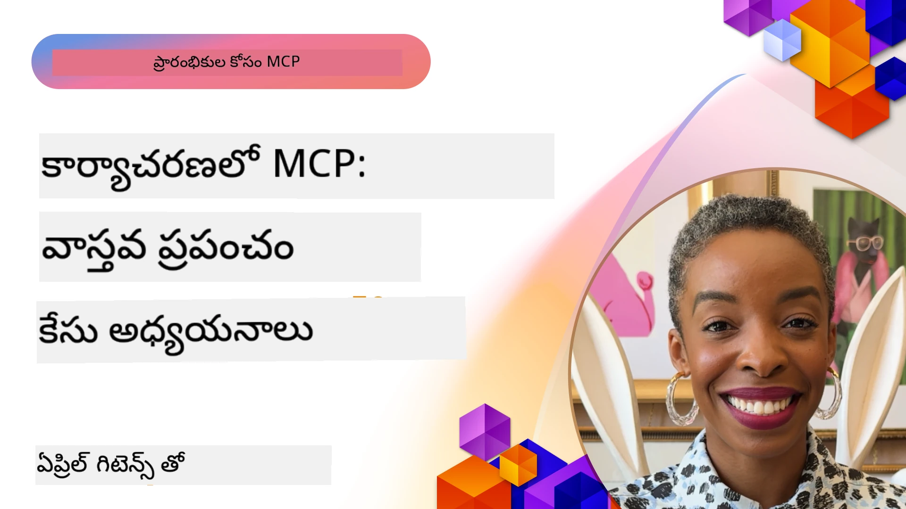

# మోడల్ కాంటెక్స్ట్ ప్రోటోకాల్ (MCP) అనుభవం: వాస్తవ ప్రపంచంలో కేసు అధ్యయనాలు

_(ఈ పాఠం వీడియోను వీక్షించడానికి పై చిత్రాన్ని క్లిక్ చేయండి)_

మోడల్ కాంటెక్స్ట్ ప్రోటోకాల్ (MCP) ఆర్టిఫిషియల్ ఇంటెలిజెన్స్ (AI) అప్లికేషన్లు డేటా, టూల్స్ మరియు సేవలతో ఎలా పరస్పరం కలిసిపోతాయో మారుస్తోంది. ఈ విభాగం వివిధ సంస్థా సందర్భాలలో MCP యొక్క ఆచరణాత్మక ఉపయోగాలను చూపించే వాస్తవ ప్రపంచ కేసు అధ్యయనాలను అందిస్తుంది.

## అవలోకనం

ఈ విభాగం MCP అమలు యొక్క స్పష్టమైన ఉదాహరణలను చూపిస్తుంది, ఏ విధంగా సంస్థలు ఈ ప్రొటోకాల్‌ను సంక్లిష్ట వ్యాపార సవాళ్లను పరిష్కరించడానికి ఉపయోగిస్తున్నాయో హైలైట్ చేస్తుంది. ఈ కేసు అధ్యయనాలను విశ్లేషించడం ద్వారా, మీరు వాస్తవ ప్రపంచ పరిస్థితుల్లో MCP యొక్క నవీకరణ సామర్థ్యం, విస్తరణ సామర్ధ్యం మరియు ఆచరణాత్మక లాభాలు గురించి అవగాహన పొందుతారు.

## ప్రధాన అభ్యాస లక్ష్యాలు

ఈ కేసు అధ్యయనాలను పరిశీలించడం ద్వారా, మీరు:

- MCP ప్రత్యేక వ్యాపార సమస్యలను ఎలా పరిష్కరించగలదో అర్థం చేసుకోగలుగుతారు
- వివిధ సమ్మిళన నమూనాలు మరియు ఆర్కిటెక్చర్ పద్ధతుల గురించి తెలుసుకోగలుగుతారు
- సంస్థా పరిసరాలలో MCP అమలు చేయడంలో ఉత్తమ పద్ధతులను గుర్తించగలుగుతారు
- వాస్తవ ప్రపంచంలో అమలులో ఎదురైన సవాళ్లు మరియు పరిష్కారాలపై వివరణలు పొందగలుగుతారు
- మీ స్వంత ప్రాజెక్టులో అంతరాల నమూనాలు వాడడానికి అవకాశాలను కనుగొనగలుగుతారు

## ముఖ్య కేసు అధ్యయనాలు

### 1. [Azure AI ట్రావెల్ ఏజెంట్లు – రిఫరెన్స్ ఇంప్లిమెంటేషన్](./travelagentsample.md)

ఈ కేసు అధ్యయనంలో మైక్రోసాఫ్ట్ యొక్క స్వల్పమైన ఉదాహరణ పరిష్కారాన్ని పరిశీలిస్తుంది, ఇది MCP, Azure OpenAI, Azure AI Search ఉపయోగించి బహు-ఏజెంట్, AI ఆధారిత ట్రావెల్ ప్లానింగ్ అప్లికేషన్ నిర్మించే విధానాన్ని సూచిస్తుంది. ప్రాజెక్టు చూపిస్తుంది:

- MCP ద్వారా బహుఏజెంట్ సమన్వయం
- Azure AI Searchతో సంస్థా డేటా సమ్మిళనం
- Azure సేవలతో భద్రత, స్కేలబుల్ ఆర్కిటెక్చర్
- పునర్వినియోగయోగ్య MCP భాగాలతో విస్తరించదగిన టూలింగ్
- Azure OpenAI ఆధారిత సంభాషణాత్మక వినియోగదారు అనుభవం

ఆర్కిటెక్చర్ మరియు అమలు వివరాలు MCPని సమన్వయ పొరగా ఉపయోగించి సంక్లిష్ట, బహుఏజెంట్ వ్యవస్థలను నిర్మించడంలో విలువైన అవగాహనలను అందిస్తాయి.

### 2. [YouTube డేటా నుండి Azure DevOps అంశాలను నవీకరించడం](./UpdateADOItemsFromYT.md)

ఈ కేసు అధ్యయనం MCPను వర్క్‌ఫ్లో ప్రాసెస్‌లు ఆటోమేషన్ చేయడానికి ప్రయోగాత్మకంగా ఉపయోగించడాన్ని చూపిస్తుంది. ఇది MCP టూల్స్ ఉపయోగించి చేయగల క్రియలను తెలియజేస్తుంది:

- ఆన్‌లైన్ ప్లాట్‌ఫామ్ల నుండి డేటాను ఎత్తివేయడం (YouTube)
- Azure DevOps వ్యవస్థలలో వర్క్ అంశాలను నవీకరించడం
- పునరావృత ఆటోమేషన్ వర్క్‌ఫ్లోలను సృష్టించడం
- విభిన్న వ్యవస్థల మధ్య డేటాను సమ్మిళితం చేయడం

ఈ ఉదాహరణ సాదారణ MCP అమిళాలు కూడా రొటీన్ పనులను ఆటోమేట్ చేయడం మరియు వ్యవస్థల మధ్య డేటా అంతరాస్యతను మెరుగుపరచడం ద్వారా గణనీయమైన సమర్థత లాభాలను ఇవ్వగలవని చూపిస్తుంది.

### 3. [MCP తో రియల్-టైం డాక్యుమెంటేషన్ రిట్రీవల్](./docs-mcp/README.md)

ఈ కేసు అధ్యయనం మోడల్ కాంటెక్స్ట్ ప్రోటోకాల్ (MCP) సర్వర్‌కు ఒక Python కన్సోల్ క్లయింట్‌ను కనెక్ట్ చేసి Microsoft డాక్యుమెంటేషన్‌ను రియల్-టైం కాంటెక్స్ట్-అవేర్ రీతిలో తీసుకొని లాగ్ చేయడం ఎలా చేయాలో చూపిస్తుంది. మీరు నేర్చుకుంటారు:

- అధికారిక MCP SDK ఉపయోగించి Python క్లయింట్‌తో MCP సర్వర్‌కు కనెక్ట్ కావడం
- సమర్థవంతమైన, రియల్-టైం డేటా పొందడానికి స్ట్రీమింగ్ HTTP క్లయింట్లను ఉపయోగించడం
- సర్వర్‌పై డాక్యుమెంటేషన్ సాధనాలను పిలిచి ప్రత్యక్షంగా కన్సోల్‌లో ప్రతిస్పందనలను లాగ్ చేయడం
- టెర్మినల్ వదిలి వెళ్లకుండా మీ వర్క్‌ఫ్లోలో తాజా Microsoft డాక్యుమెంటేషన్‌ను ఏకత్రముచేయడం

ఈ అధ్యాయం ఒక హ్యాండ్స్-ఆన్ అసైంమెంట్, కనీస పని కోడ్ నమూనా, ఇంకా లోతైన అభ్యాసానికి అదనపు వనరులను కలిగి ఉంది. MCP డాక్యుమెంటేషన్ యాక్సెస్ మరియు కన్సోల్ ప్రాతిపదికన అభివృద్ధిదారుల ఉత్పాదకతలో ఎలా విప్లవాత్మక మార్పులు తీసుకురావచ్చు అనేది పూర్తి పాఠం మరియు కోడ్ లింక్‌లో చూడండి.

### 4. [MCP తో ఇంటరాక్టివ్ స్టడీ ప్లాన్ జనరేటర్ వెబ్ యాప్](./docs-mcp/README.md)

ఈ కేసు అధ్యయనం Chainlit మరియు మోడల్ కాంటెక్స్ట్ ప్రోటోకాల్ (MCP) ఉపయోగించి ఏదైనా విషయం కోసం వ్యక్తిగతీకరించిన అధ్యయన ప్రణాళికలను సృష్టించడానికి ఇంటరాక్టివ్ వెబ్ అప్లికేషన్ నిర్మించడాన్ని చూపిస్తుంది. వినియోగదారు ఒక విషయం (ఉదా: "AI-900 సర్టిఫికేషన్") మరియు అధ్యయన వ్యవధిని (ఉదా: 8 వారాలు) సూచిస్తారు, అప్పటి నుండి యాప్ వారానికి వారీగా సిఫార్సుచేసే కంటెంట్‌ను అందిస్తుంది. Chainlit సంభాషణాత్మక చాట్ ఇంటర్ఫేస్‌ను అందిస్తుంది, దీని వల్ల అనుభవం ఆసక్తికరం మరియు అనుకూలంగా ఉంటుంది.

- Chainlit ఆధారిత సంభాషణాత్మక వెబ్ యాప్
- విషయం మరియు వ్యవధి కోసం వినియోగదారు ప్రేరణలు
- MCP ఉపయోగించి వారానికి వారీగా కంటెంట్ సిఫార్సులు
- చాట్ ఇంటర్ఫేస్‌లో రియల్-టైం, అనుకూల ప్రతిస్పందనలు

ఈ ప్రాజెక్టు సంభాషణాత్మక AI మరియు MCP కలిపి ఆధునిక వెబ్ పరిసరాలలో డైనమిక్, వినియోగదారుని ఆధారపడి ఉన్న విద్యా సాధనాలను సృష్టించడాన్ని చూపిస్తుంది.

### 5. [VS కోడ్‌లో MCP సర్వర్‌తో ఇన్-ఎడిటర్ డాక్స్](./docs-mcp/README.md)

ఈ కేసు అధ్యయనం MCP సర్వర్ ఉపయోగించి Microsoft Learn డాక్స్‌ను నేరుగా VS కోడ్ వాతావరణంలోకి తీసుకు రావడం ఎలా చేయాలో చూపిస్తుంది — ఇక బ్రౌజర్ ట్యాబ్లు మారుస్తూ ఉండాల్సిన అవసరం లేదు! మీరు నేర్చుకుంటారు:

- MCP ప్యానెల్ లేదా కమాండ్ పాలెట్ ఉపయోగించి VS కోడ్‌లో డాక్స్‌ను తక్షణమే వెతకడం మరియు చదవడం
- సూచించు డాక్యుమెంటేషన్ మరియు README లేదా కోర్సు మార్క్డౌన్ ఫైళ్లలో నేరుగా లింకులు చేర్చడం
- GitHub Copilot మరియు MCP కలిపి మృదువైన, AI ఆధారిత డాక్యుమెంటేషన్ మరియు కోడ్ వర్క్‌ఫ్లోలను ఉపయోగించడం
- రియల్-టైం ఫీడ్‌బ్యాక్ మరియు Microsoft సోర్స్ ఖచ్చితత్వంతో మీ డాక్యుమెంటేషన్‌ను పరిశీలించటం మరియు మెరుగుపరచడం
- నిరంతర డాక్యుమెంటేషన్ ధ్రువీకరణ కోసం MCPని GitHub వర్క్‌ఫ్లోలతో ఏకరింపచేసుకోవడం

అమలు లో:

- సులభమైన సెటప్ కోసం `.vscode/mcp.json` కాన్ఫిగరేషన్ ఉదాహరణ
- ఇన్-ఎడిటర్ అనుభవం కోసం స్క్రీన్‌షాట్ ఆధారిత వాక్త్రూ
- గరిష్ట ఉత్పాదకత కోసం Copilot మరియు MCP కలయిక టిప్స్

ఈ సన్నివేశం కోర్సు రచయితలు, డాక్యుమెంటేషన్ రచయితలు మరియు తమ ఎడిటర్‌లోనే దృష్టి పెట్టి docs, Copilot మరియు ధ్రువీకరణ సాధనాలతో పనిచేయాలనుకునే అభివృద్ధిదారుల కోసం ఉత్తమం.

### 6. [APIM MCP సర్వర్ సృష్టి](./apimsample.md)

ఈ కేసు అధ్యయనం Azure API Management (APIM) ఉపయోగించి MCP సర్వర్ సృష్టించడం పై దశల వారీ మార్గదర్శకాన్ని అందిస్తుంది. ఇందులో ఉంటాయి:

- Azure API Managementలో MCP సర్వర్ సెటప్
- MCP టూల్స్‌గా API ఆపరేషన్లను ప్రదర్శించడం
- రేట్ లిమిటింగ్ మరియు భద్రత కోసం విధానాలను కాన్ఫిగర్ చేయడం
- Visual Studio Code మరియు GitHub Copilot ఉపయోగించి MCP సర్వర్‌ను పరీక్షించడం

ఈ ఉదాహరణ వివిధ అప్లికేషన్లలో ఉపయోగించడానికి Azure సామర్థ్యాలను ఉపయోగించి బలమైన MCP సర్వర్ సృష్టించడం ఎలా అనేది చూపిస్తుంది, AI వ్యవస్థలను సంస్థ APIsతో సమ్మిళనం మరింత మేల్కొల్పుతుంది.

### 7. [GitHub MCP రిజిస్ట్రి — ఏజెంటిక్ సమ్మిళన వేగవంతం](https://github.com/mcp)

ఈ కేసు అధ్యయనం సెప్టెంబర్ 2025లో ప్రారంభమైన GitHub MCP రిజిస్ట్రి ఎలా AI పరిపాక్తి యొక్క కీలక సవాళును: మోడల్ కాంటెక్స్ట్ ప్రోటోకాల్ (MCP) సర్వర్ల విభాజన మరియు వినియోగంలో భిన్నత సమస్యను పరిష్కరించిందో పరిశీలిస్తుంది.

#### అవలోకనం
**MCP రిజిస్ట్రి** వివిధ రిపాజిటరీలు మరియు రిజిస్టర్‌లలో పడ్డ MCP సర్వర్ల పెరిగిన సమస్యను పరిష్కరిస్తుంది, అవి ముందుగా సమ్మిళనం మెల్లితనం మరియు లోపాలు కారణమవుతుండేవి. ఈ సర్వర్లు AI ఏజెంట్స్‌ను APIs, డేటాబేసులు, డాక్యుమెంటేషన్ మూలాలకు అనుసంధానించడానికి అనుమతిస్తాయి.

#### సమస్య వివరణ
ఏజెంటిక్ వర్క్‌ఫ్లోలు నిర్మించే అభివృద్ధిదారులు కొన్ని సవాళ్లను ఎదుర్కొన్నారు:
- **విభిన్న ప్లాట్‌ఫారమ్‌లలో MCP సర్వర్ల తక్కువ కనుగొనదగినత్వం**
- **ప్రతి వేదికలో పునరావృత సెటప్ ప్రశ్నలు** ఫోరమ్లు మరియు డాక్యుమెంటేషన్ అంతటా
- **తనిఖీ కాని, నమ్మకంగా లేని మూలాల నుండి భద్రతా ప్రమాదాలు**
- **సర్వర్ నాణ్యత మరియు అనుకూలతలో ప్రమాణాల లేమి**

#### పరిష్కార ఆర్కిటెక్చర్
GitHub యొక్క MCP రిజిస్ట్రి ప్రధాన విశేషాలతో నమ్మకమైన MCP సర్వర్లను కేంద్రీకృతం చేస్తుంది:
- **ద్వితీయ క్లిక్ ఇన్‌స్టాల్** స్ట్రీమ్లైన్ చేసిన సెటప్ కోసం VS కోడ్ ద్వారా
- **స్టార్లు, చురుకుదనం, కమ్యూనిటీ ధ్రువీకరణ ద్వారా శబ్దం మీద సిగ్నల్ వర్గీకరణ**
- **GitHub Copilot మరియు ఇతర MCP-అనుకూల సాధనాలతో నేరుగా సమ్మిళనం**
- **సముదాయం మరియు సంస్థ భాగస్వాములు రెండూ దాన్ని వృద్ధి చేయగల ఓపెన్ కాంట్రిబ్యూషన్ మోడల్**

#### వ్యాపార ప్రభావం
రిజిస్ట్రి కొలిచదగిన మెరుగుదలలు అందిస్తుంది:
- **త్వరిత ఆన్‌బోర్డింగ్** Microsoft Learn MCP Server వంటి సాధనాలతో, ఇది అధికారిక డాక్యుమెంటేషన్‌ను ఏజెంట్స్‌కు నేరుగా ప్రసారం చేస్తుంది
- **తగ్గిన సమయం మరియు ప్రయోజనాలు** `github-mcp-server` వంటి ప్రత్యేక సర్వర్ల ద్వారా, సహజ భాష GitHub ఆటోమేషన్ (PR సృష్టి, CI మళ్లీ నిర్వహణ, కోడ్ స్కానింగ్) సాధ్యమవుతుంది
- **విశ్వాసభరిత పర్యావరణ విశ్వాసం** పర్యవేక్షిత జాబితాలు మరియు పారదర్శక కాన్ఫిగరేషన్ ప్రమాణాల ద్వారా

#### వ్యూహాత్మక విలువ
ఏజెంట్ జీవనచక్ర నిర్వహణ మరియు పునర్ ఉత్పత్తి అయ్యే వర్క్‌ఫ్లోల్లో నిపుణుల కోసం, MCP రిజిస్ట్రి అందిస్తుంది:
- **మాడ్యులర్ ఏజెంట్ నియామకం** ప్రమాణీకృత భాగాలతో
- **కొత్తతర శిఖరణా పద్దతులు** ఏకరీకృత పరీక్ష మరియు ధ్రువీకరణకు
- **వేర్వేరు AI ప్లాట్‌ఫారమ్‌ల మధ్య సజావుగా ఇంటర్‌ఒపరేబిలిటీ**

ఈ కేసు అధ్యయనం MCP రిజిస్ట్రి కేవలం ఒక డైరెక్టరీ కాకుండా— ఇది స్కేలబుల్, వాస్తవ ప్రపంచ మోడల్ ఇంటిగ్రేషన్ మరియు ఏజెంటిక్ సిస్టమ్ అమలుకు ఒక పరిపాటిగా పనిచేస్తుందని చూపిస్తుంది.

### 8. [ఏజెంట్ నుండి సోషల్ నెట్‌వర్క్స్‌కు ప్రచురణ](./publora-social-publishing.md)

ఈ కేసు అధ్యయనం **వ్రాసే-సమర్థ MCP సర్వర్** గురించి వివరిస్తుంది — ఏ టూల్స్ వినియోగదారుని తరపున తిరుగు మార్గం లేకుండా చర్యలు తీసుకుంటాయి — సామాజిక ప్రచురణ ఉదాహరణగా. ఏజెంట్ పోస్ట్ డ్రాఫ్ట్ చేస్తుంది, మనిషి ఆమోదిస్తాడు, సర్వర్ నెట్‌వర్క్స్ ద్వారా షెడ్యూల్ చేస్తుంది.

ఆసక్తికరమైన భాగం ప్రచురణ విధానాల రూపకల్పన పరిమితులు, ఇవి పఠించడానికి కాకుండా వ్రాయడానికి చేసే ఎటువంటి సర్వర్‌పై వర్తిస్తాయి:

- **ఓపెన్ డిస్కవరీ, గుర్తింపు పొందిన క్రియాత్మకత** — `tools/list` అనుగుణంగా శకం లేకుండా సandukaritake, రిజిస్ట్రీలూ మరియు క్లయింట్లూ పరిశీలించవచ్చు, కానీ ప్రతి `tools/call` కీ అవసరం మరియు లేకపోతే `401` మరియు `WWW-Authenticate` హెడ్డర్ వింటుంది
- **ఫ్లెక్స్‌ఫుల్ OAuth రిజిస్ట్రేషన్** — బహిరంగ దశకు అవసరం లేకుండా డైనమిక్ క్లయింట్ రిజిస్ట్రేషన్, `2026-07-28` స్పెసిఫికేషన్ చూపుతున్న Client ID మెటాడేటా డాక్యుమెంట్ల దిశలో
- **టూల్ సూచనలు** (`readOnlyHint`, `destructiveHint`, `idempotentHint`) క్లయింట్లు నిర్ణయించుకునేందుకు ఉపయుక్తాలు — నిర్బంధాలు కాదు, కనెక్టర్ డైరెక్టరీలు ఇప్పుడు సమీక్షలో ఇవన్ని ఆశిస్తాయి
- **అనామక గుర్తింపులు** — తయారుచేసిన విలువ తప్పుగా ఎక్కడైనా వాడదగినదే కాదు కాబట్టి తప్పులు గట్టిగా తెలుస్తాయి
- **పోస్ట్ సృష్టించే టూల్స్‌పై ఐడంపొటెన్సీ కీలు** — ఏజెంట్ రన్‌టైమ్ రీట్రయ్ డుప్లికేట్ ప్రచురణ కాకుండా ఉంటుంది
- **టూల్ స్కీమ్‌లో వివరణాత్మక నో-ఆప్ లక్ష్యం** — పూర్తిగా వ్రాసే మార్గాన్ని పరీక్షిస్తుంది కానీ ఏదూ ప్రచురించదు, సమీక్షకులు మరియు నిరంతర ఇంటిగ్రేషన్ కోసం

అధ్యాయం మీరు నిర్మిస్తున్న సర్వర్‌కు వర్తింపజేయగలనిది మధ్యమంగా ఒక చిన్న చెక్‌లిస్ట్‌తో ముగుస్తుంది.

## ముగింపు

ఈ ఎనిమిది సమగ్ర కేసు అధ్యయనాలు మోడల్ కాంటెక్స్ట్ ప్రోటోకాల్ వివిధ వాస్తవ ప్రపంచ సందర్భాల్లో విశేషమైన అనుకూలత మరియు ఆచరణాత్మక ఉపయోగాలను చూపిస్తాయి. సంక్లిష్ట బహుఏజెంట్ ట్రావెల్ ప్లానింగ్ వ్యవస్థలు, సంస్థా API నిర్వహణ, సరళమైన డాక్యుమెంటేషన్ వర్క్‌ఫ్లోలు మరియు విప్లవాత్మక GitHub MCP రిజిస్ట్రితో ఈ ఉదాహరణలు MCP ఎలా AI వ్యవస్థలను అవసరమైన టూల్స్, డేటా, సేవలతో సుసంపన్నంగా అనుసంధానించడానికి ప్రమాణీకృత, విస్తరించదగిన మార్గాన్ని అందిస్తుందో చూపిస్తాయి.

కేసు అధ్యయనాలు MCP అమలు వివిధ ప‌రిమాణాల‌ను కవర్ చేస్తాయి:
- **సంస్థా సమ్మేళనం**: Azure API Management మరియు Azure DevOps ఆటోమేషన్
- **బహుఏజెంట్ సమన్వయం**: సమన్వయ AI ఏజెంట్లతో ట్రావెల్ ప్లానింగ్
- **అభివృద్ధిదార్ ఉత్పాదకత**: VS కోడ్ సమ్మిళనం మరియు రియల్-టైం డాక్యుమెంటేషన్ యాక్సెస్
- **పర్యావరణ అభివృద్ధి**: ప్రధాన వేదికగా GitHub MCP రిజిస్ట్రి
- **విద్యാഭ്യാസ అనువర్తనాలు**: ఇంటరాక్టివ్ స్టడీ ప్లాన్ జనరేటర్లు మరియు సంభాషణాత్మక ఇంటర్ఫేస్లు

ఈ అమిళాల ద్వారా మీరు తెలుస్తుందీ:
- **వివిధ స్కేల్స్ మరియు ఉపయోగ కేసుల ఆర్కిటెక్చరల్ నమూనాలు**
- **నిర్వహణతో కార్యదక్షతల సమతుల్యం కాపాడే అమలుచేసే వ్యూహాలు**
- **ఉత్పత్తి వాతావరణాల భద్రత మరియు విస్తరణ సామర్థ్యం**
- **MCP సర్వర్ అభివృద్ధి మరియు క్లయింట్ సమ్మిళనలో ఉత్తమ పద్ధతులు**
- **ఇంటర్‌లింకెడ్ AI-ఆధారిత పరిష్కారాల నిర్మాణానికి పర్యావరణ వైఖరి**

ఈ ఉదాహరణలు ఒక సిద్దాంతాత్మక ఫ్రేమ్‌వర్క్ మాత్రమే కాకుండా సంక్లిష్ట వ్యాపార సవాళ్లకు ఆచరణాత్మక పరిష్కారాలను ఇవ్వగల మేచినెడ్, ఉత్పత్తి-సిద్ధమైన ప్రోటోకాల్ MCP అని చూపిస్తాయి. మీరు సరళమైన ఆటోమేషన్ టూల్స్ లేదా అభివృద్ధవంతమైన బహుఏజెంట్ వ్యవస్థలు నిర్మిస్తున్నా, ఇక్కడ చూపించిన నమూనాలు మరియు పద్ధతులు మీ MCP ప్రాజెక్టులకై బలమైన పునాది అందిస్తాయి.

## అదనపు వనరులు

- [Azure AI ట్రావెల్ ఏజెంట్లు GitHub నిలువు](https://github.com/Azure-Samples/azure-ai-travel-agents)
- [Azure DevOps MCP టూల్](https://github.com/microsoft/azure-devops-mcp)
- [Playwright MCP టూల్](https://github.com/microsoft/playwright-mcp)
- [Microsoft Docs MCP సర్వర్](https://github.com/MicrosoftDocs/mcp)
- [GitHub MCP రిజిస్ట్రి — ఏజెంటిక్ సమ్మిళనం వేగవంతం](https://github.com/mcp)
- [MCP కమ్యూనిటీ ఉదాహరణలు](https://github.com/microsoft/mcp)

## వచ్చే దశలు

- పూర్వపు: [మోడ్యూల్ 8: ఉత్తమ పద్ధతులు](../08-BestPractices/README.md)
- తదుపరి: [మోడ్యూల్ 10: AI వర్క్‌ఫ్లోలను సులభతరం చేయడం: AI టూల్కిట్ తో MCP సర్వర్ నిర్మాణం](../10-StreamliningAIWorkflowsBuildingAnMCPServerWithAIToolkit/README.md)

---

<!-- CO-OP TRANSLATOR DISCLAIMER START -->
**అస్వీకరణ**:
ఈ పత్రం AI అనువాద సేవ [Co-op Translator](https://github.com/Azure/co-op-translator) ఉపయోగించి అనువదించబడింది. మేము ఖచ్చితత్వానికి ప్రయత్నిస్తున్నప్పటికీ, ఆటోమేటెడ్ అనువాదాలు తప్పులు లేదా అసమగ్రతలను కలిగి ఉండవచ్చు. దాని స్వదేశ భాషలో ఉన్న అసలు పత్రాన్ని అధికారం కలిగిన మూలంగా పరిగణించాలి. కీలకమైన సమాచారం కోసం, ప్రొఫెషనల్ మానవ అనువాదాన్ని సిఫారసు చేస్తాము. ఈ అనువాదం ఉపయోగం వల్ల కలిగే ఏవైనా అపార్థాలు లేదా తప్పుదారులు కోసం మేము బాధ్యత వహించము.
<!-- CO-OP TRANSLATOR DISCLAIMER END -->