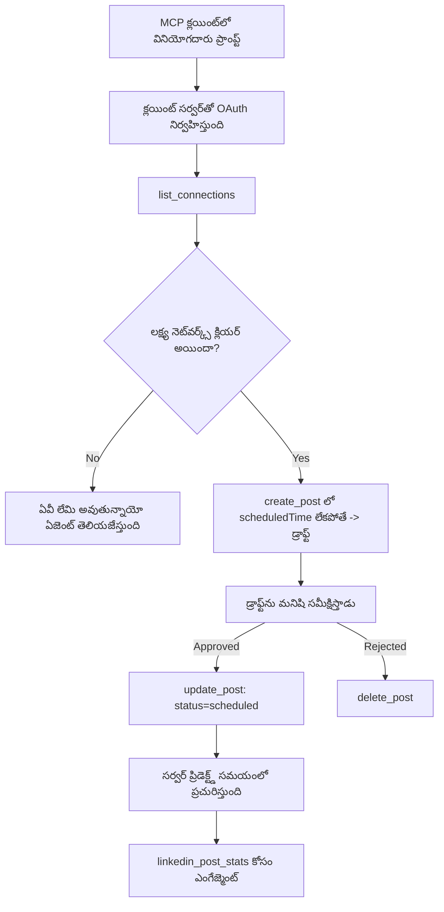

# కేసు అధ్యయనం: రిమోట్ MCP సర్వర్ ఉపయోగించి ఏజెంట్ నుండి సోషల్ నెట్‌వర్క్స్‌లో ప్రచురణ

> **తప్పుదిద్దింపు:** చాలా సేవలు మరియు ఓపెన్-సోర్స్ ప్రాజెక్టులు సోషల్ నెట్‌వర్క్స్‌కి ప్రచురించగలవు, మరియు ఒక టీమ్ ప్రతి నెట్‌వర్క్ యొక్క API నేరుగా అనుసంధానం చేయవచ్చు. దిగువ సన్నివేశం **రాయగల రిమోట్ MCP సర్వర్** ఎలా రూపకల్పన చేసి ఉపయోగించవచ్చో చూపించే ఒక పని చేసిన ఉదాహరణగా అందించబడింది. Publora ఒక వాణిజ్య సేవ, ఇది ఉచిత స్థాయిని కలిగి ఉంది; ఇక్కడ వర్ణించబడిన నమూనాలు వినియోగదారుని తరపున తిరగని చర్యలను చేయగల ఏదైనా MCP సర్వర్‌కు వర్తిస్తాయి.

## అవలోకనం

ఏజెంట్లు కంటెంట్ తయారీలో బాగుంటారు కాని అందించడంలో తక్కువగా ఉంటారు. ఒక మోడల్ సెకన్లలో విడుదల ప్రకటనను రాయగలదు, ఆ తరువాత పని ఆగిపోతుంది: ప్రచురించడం అంటే ప్రతి నెట్‌వర్క్‌కు ఒక API, ప్రతి నెట్‌వర్క్‌కు ఒక OAuth యాప్, మరియు ప్రతి కొరకు వేర్వేరు మీడియా నియమాలు. ఎక్కువ భాగం టీములు ఈ సమస్యను చేతితో బ్రౌజర్‌లో పాఠ్యాన్ని కాపీ చేయటం ద్వారా పరిష్కరిస్తాయి.

ఈ కేసు అధ్యయనం ఆ తుది దశను ఒకే రిమోట్ MCP సర్వర్ తో ఎలా మూసివేస్తుందో చూసేలా ఉంటుంది, మరియు — ఒకటి నిర్మించడం లో ఎవరికైనా ఎక్కువ ఉపయోగకరంగా — ఒక **రాయగల** సర్వర్ సరిగా ఎటువంటి డిజైన్ నిర్ణయాలు తీసుకోవాలి అనేదైనా. డేటా చదవడం తగినంత సరళమైనది. ప్రచురణ కాదు: తప్పు సాధనం పిలుపు ఆడియెన్స్‌కు కనిపిస్తుంది మరియు తిరిగి తీసుకోవడం సాధ్యం కాదు.

## సన్నివేశం

ఒక చిన్న డెవలపర్-సంబంధాల టీమ్ ఏజెంట్ (Claude, VS Code, Cursor — క్లయింట్ ఏదైనా యాక్ట్ చేయదు) లో పోస్ట్‌లను డ్రాఫ్ట్ చేస్తుంది. వారు ఏజెంట్ క్రింది వంటివి చేయాలని కోరుతున్నారు:

- టీమ్ కలిగిన సోషల్ ఖాతాల‌ను చూడటం,
- ఒక పోస్ట్‌ను డ్రాఫ్ట్ చేయటం మరియు మానవుని ఆమోదానికి ఉంచుట,
- ఒక చిత్రం జత చేయడం,
- ఎంచుకున్న సమయంలో అనేక నెట్‌వర్క్స్‌కు షెడ్యూల్ చేయడం,
- మరియు తరువాత దాని ప్రదర్శన ఎలా ఉన్నదో నివేదిక ఇవ్వడం.

ముఖ్యంగా, వారు ఏజెంట్ స్పందిస్తుండగా ఉద్దేశపూర్వకంగా ప్రచురించకపోవాలని కోరుకుంటున్నారు.

## ఉపయోగించిన సాధనాలు

- [Publora MCP Server](https://github.com/publora/mcp-server) — ప్రచురణ, షెడ్యూలింగ్, మీడియా మరియు LinkedIn విశ్లేషణ సాధనాలను అందించే రిమోట్ MCP సర్వర్ (`streamable-http`). ఇది అధికారిక MCP రిజిస్ట్రీలో `com.publora/mcp-server`గా నమోదు చేయబడింది.

## దశల వారీ కార్యప్రవాహం

1. **సర్వర్‌కి కనెక్ట్ అవ్వండి.** OAuth మాట్లాడే క్లయింట్లు సర్వర్ యొక్క స్వీయ అనుమతి స్క్రీన్‌పై PKCE తో authorization-code ఫ్లో పూర్తి చేస్తాయి; మాదిరిగా హెడ్లెస్ CLI లాంటి క్లయింట్లు హెడర్‌లో Publora API కీ ఉపయోగిస్తారు. రెండు మార్గాలు మద్దతు చేయబడుతున్నాయి, దాన్ని ఎవరైతే పొందుతారో అది క్లయింట్‌పై ఆధారపడి ఉంటుంది, సర్వర్ పైన కాదు.
2. **కనెక్షన్లు జాబితా చేయండి.** ఏజెంట్ `list_connections` పిలిచి కనెక్ట్ అయిన ఖాతాలు మరియు వాటి గుర్తింపులను పొందుతుంది.
3. **డ్రాఫ్ట్ రూపకల్పన.** ఏజెంట్ షెడ్యూల్ కాలం లేకుండా `create_post` పిలుస్తుంది. పోస్ట్ డ్రాఫ్ట్‌గా నిల్వ ఉంటుంది — ఎలాంటి ప్రచురణ ఫలితం లేదు.
4. **మీడియాను జత చేయండి.** పబ్లిక్ చిత్రం URLs అదే పిలుపులో పంపబడతాయి; సర్వర్ వాటిని డౌన్లోడ్ చేసి వెలిడేట్ చేస్తుంది.
5. **షెడ్యూల్ చేయండి.** మానవుని ఆమోదం తరువాత, `update_post` పోస్టును షెడ్యూల్డ్ స్థితిగా ISO 8601 సమయం తో సెట్ చేస్తుంది.
6. **పరిమాణం కొలవండి.** LinkedIn కొరకు, పోస్టు లైవ్ అయిన తర్వాత `linkedin_post_stats` ఎంగేజ్‌మెంట్‌ను తిరిగి ఇస్తుంది.

## ఉదాహరణ ప్రాంప్ట్

```text
Which social accounts do I have connected?
Draft a post announcing our new changelog page, attach the screenshot at
https://example.com/changelog.png, and keep it as a draft — do not publish it.
Once I approve, schedule it to LinkedIn and Bluesky for tomorrow at 09:00 UTC.
```

## మెర్మెయిడ్ ఫ్లోచార్ట్



## సాంకేతిక అమలు

క్రింది పాఠాలు ఈ కేసు అధ్యయనంలోని సహకార భాగాలు.

### ఓపెన్ డిస్కవరీ, అధికృత అమలు

`tools/list` క్రెడెన్షియల్స్ లేకుండానే అందుబాటులో ఉంటుంది; ప్రతి `tools/call` టోకెన్ అవసరం, లేకపోతే ఇది `401` మరియు `WWW-Authenticate` హెడ్డర్ తో తిరిగి రాదు, ఇది రక్షించబడిన వనరు మెటాడేటాను సూచిస్తుంది. (సర్వర్ ఒక అనధికారిత `initialize`కి కూడా స్పందిస్తుంది, ఇది కేవలం `2026-07-28`కి ముందు నిష్పత్తి వేరియంట్ క్లయింట్ల కోసం మాత్రమే ప్రాథమికమైనది; ఆ సమీక్షా తేదీ హ్యాండ్‌షేక్‌ను పూర్తిగా తొలగించింది.)

ఈ విభజన పనిలో ముఖ్యమైనది. రిజిస్ట్రీలు, క్యాటలాగ్లు మరియు క్లయింట్లు ఒక సీక్రెట్ లేకుండా సాధనం ఉపరితలాన్ని — పేర్లు, స్కీమాలు, వ్యాఖ్యానాలు — పరిశీలించవచ్చు, కానీ ఏదేనా *అనామకంగా* అమలు చేయలేరు. `initialize` కోసం టోకెన్ డిమాండ్ చేసే సర్వర్ టూలింగ్‌కు దృశ్యరహితం, కానీ అనామక `tools/call` అనుమతించే సర్వర్ ప్రమాదకరం.

### రెజిస్ట్రేషన్: డైనమిక్ క్లయింట్ రెజిస్ట్రేషన్, మరియు దాని పునర్వినియోగం

సర్వర్ `/.well-known/oauth-protected-resource` మరియు `/.well-known/oauth-authorization-server` ను ప్రకటన చేస్తుంది, మరియు PKCE (`S256`) తో authorization-code ఫ్లో, రిఫ్రెష్ టోకెన్లు మరియు **డైనమిక్ క్లయింట్ రెజిస్ట్రేషన్** మద్దతు ఇస్తుంది.

డైనమిక్ రెజిస్ట్రేషన్ చేత మానవీయ దశ తొలగుతోంది: దాని లేకుండా ప్రతి క్లయింట్‌కు ముందుగానే జారీ చేయబడిన `client_id` కావాలి, అంటే ప్రతి కొత్త క్లయింట్ కోసం విక్రేత వద్ద నుండి బయట-బ్యాండ్ అభ్యర్థన అవసరం.

దీన్ని కాపీ కోసం డిజైన్ అడుగు కాకుండా అనుసరణ ఆచరణగా పరిగణించండి. `2026-07-28` స్పెసిఫికేషన్ సమీక్ష డైనమిక్ క్లయింట్ రెజిస్ట్రేషన్‌ను Client ID మెటాడేటా డాక్యుమెంట్స్ (CIMD) మెరుగైన ప్రత్యామ్నాయంగా నిలబడింది, ఇందులో క్లయింట్ ఒక స్థిర HTTPS URL వద్ద మెటాడేటా డాక్యుమెంట్‌ను హోస్ట్ చేస్తుంది మరియు ఆ URL `client_id`. DCR ఇంతవరకు పనిచేస్తోంది, కానీ నేటి కొత్త సర్వర్ CIMD కొరకు ప్రణాళిక వేయాలి మరియు పాత క్లయింట్ల కొరకు మాత్రమే DCR ఉంచాలి.

### సాధన వ్యాఖ్యానాలు అలంకారం కాదు

ప్రతి సాధనం `title` మరియు వర్తించే సూచనలను కలిగి ఉంటుంది: `readOnlyHint`, `destructiveHint`, `idempotentHint`, `openWorldHint`.

వాటి పై రెండు కారణాలు పెట్టాలి. మొదట, క్లయింట్లు వాటి ఆధారంగా ఏది యూజర్‌తో నిర్ధారించాలి అనేదాన్ని నిర్ణయిస్తాయి — ఒక క్లయింట్ చదవడం మాత్రమే లక్ష్యంగా ఒక లుకప్ ఆటో రన్ చేసి డిలీట్ ముందు అనుమతి కోసం ఆగొకచ్చు. స్పెసిఫికేషన్ స్పష్టంగా సూచనలు విశ్వసనీయమైనవి కానని పేర్కొంటుంది: అవి క్లయింట్ ఏ పని చేయాలనుకుంటుందో రూపం ఇస్తాయి, కాని సర్వర్‌పై ఏదీ ఆపవు, సర్వర్ తన స్వంత నియమాలను తప్పకుండా అమలు చేయాలి. రెండవది, ప్రధాన కనెక్టర్ డైరెక్టరీలు ఇప్పుడు సమీక్ష కొరకు వాటిని *అవసరమైనవి*గా పరిగణిస్తాయి; శీర్షికలు మరియు సూచనలు లేకుండా సాధనాలు కలిగిన సర్వర్ ఎలాంటి పనితీరు ఉన్నా తిరిగి పంపబడుతుంది.

### గుర్తింపులను ఊహించలేని విధంగా చేయండి

ప్లాట్‌ఫాం గుర్తింపులు `list_connections` యందు తిరిగి ఇచ్చే అర్థం తెలియని స్ట్రింగులు, స్కీమా వివరణ స్పష్టంగా వాటిని నేరుగా కాపీ చేసి అంచనా వేయకూడదని చెప్తుంది. సర్వర్ ఇంకేదీ అంగీకరించదు.

మోడల్స్ అంచనా వేయడంలో ప్రావీణ్యం కలవు. ఏ రాయగల సర్వర్ కూడా గుర్తింపు చివరకు ఊహించబడుతుందని భావించి, అది తప్పుబట్టే విధంగా వ్యవహరించాలి, లేదా సంభావ్య విలువ పై చర్య తీసుకోవద్దు.

### ప్రచురించే ముందు తప్పు చెయ్యండి, చర్యలు అనుసరించే సందేశంతో

కొన్ని నెట్‌వర్క్స్ టెక్స్ట్‌ మాత్రమే పోస్ట్‌లు తిరస్కరిస్తాయి మరియు చిత్రం లేదా వీడియో అవసరం. ఇది పోస్ట్ షెడ్యూలు సమయంలో ధృవీకరించబడుతుంది, తప్పిదం ప్లాట్‌ఫాం మరియు మిస్సింగ్ అవసరాన్ని సూచిస్తుంది.

ఏజెంట్ "Instagramకి మీడియా అవసరం - చిత్రం లేదా వీడియో జత చేయండి" నుండి ఇంకో రౌండ్ ట్రిప్ లేకుండా కోలుకోగలదు. సాధారణ `400` నుండి కాదు.

### పునరుద్యోగాలు సురక్షితంగా చేయండి

కంటెంట్ సృష్టించే రెండు సాధనాలు, `create_post` మరియు `update_post`, ఐడంపోటెన్సి కీని అంగీకరిస్తాయి: ఒకే కీతో ఒకే అభ్యర్థనను పునఃవినియోగించడం మొదటి ప్రతిస్పందనను మళ్ళీ ప్లే చేస్తుంది మరియు రెండవ పోస్టును సృష్టించదు. Agent runtime లు టైమౌట్లపై పునరుద్యోగం చేస్తాయి; ఐడంపోటెన్సి లేకపోతే, స్లో ప్రతిస్పందన డూప్లికేట్ ప్రచురణ అవుతుంది. ఇతర రాయడం సాధనాలు — తొరచీలు, మీడియా దశలు, LinkedIn స్పందనలు మరియు వ్యాఖ్యలు — ఇవి తీసుకోవు, అందుకే అక్కడ పునరుద్యోగం తక్షణమే సురక్షితం కాదు. మీ స్వంత మార్పులను తెలిసుకోవడం మంచిది ఏవీ రక్షించబడినవి మరియు ఏవీ కాకపోవు.

### ఏమి ప్రచురించదగ్గదో పరీక్షించేందుకు మార్గం ఇవ్వండి

సర్వర్ రిజర్వ్ చేసిన గమ్యస్థానం `publora-playground` ని అందుకుంటుంది, అది వాస్తవ గమ్యస్థానం లాగా ధృవీకరించబడుతుంది మరియు అంగీకరించబడుతుంది — కానీ ఏమీ లైవ్ ఖాతాకు చేరదు. ఇది సాధన స్కీమాలోనే వివరించబడింది, ఏ క్లయింట్ క్రెడెన్షియల్స్ లేకుండా చదవగలదు: `create_post` యొక్క `platforms` ఫీల్డ్ దీన్ని "వాస్తవ కనెక్షన్ అవసరం లేని కనెక్షన్-టెస్ట్ గమ్యస్థానం — పోస్ట్ అంగీకరించబడుతుంది మరియు తొలగించబడుతుంది, ఏమి ప్రచురించబడదు" అని పేర్కొంటుంది. దాన్ని మాత్రమే ఎంట్రీగా పంపి పిలవాలి: `platforms: ["publora-playground"]`.

ఇది మొత్తం ఉపరితలంలో అత్యంత ఉపయోగకరమైన వివరాలలో ఒకటిగా నిరూపించబడింది. కనెక్టర్ డైరెక్టరీ సమీక్షకులు, సహకారదారులు మరియు నిరంతర సమీకరణ (CI) నిజమైన ఆడియెన్స్‌కు ఎటువంటి ప్రమాదం లేకుండా పూర్తి రాయగల మార్గాన్ని పూర్తి చేసుకొని పరీక్షించవచ్చు. తిరగలేని చర్యలు చేసే ఏ MCP సర్వర్ కి డాక్యుమెంటెడ్ నో-ఆప్ గమ్యస్థానం నుంచి లాభం ఉంటుంది.

## ఫలితాలు మరియు ప్రభావం

- ప్రచురణ దశ బ్రౌజర్ నుండి కంటెంట్ రాసే సంభాషణకు మార్చబడింది, మరియు డ్రాఫ్ట్-ఫస్ట్ అలవాటు మానవుని ప్రతిస్పందనలో ఉంచుతుంది. అదే విషయంపై ఖచ్చితంగా ఉండండి: డ్రాఫ్ట్ ఒక తత్వం, సరిహద్దు కాదు. అదే గుర్తింపు షెడ్యూల్ లేదా ప్రచురించవచ్చు, కాబట్టి నిజమైన ఆమోద ద్వారం అవసరమైతే దాన్ని సాధన ఉపరితలం వెలుపల అమలు చేయాలి — వేరే గుర్తింపులు లేదా సర్వర్ ముందు పాలసీ లేయర్.
- ప్రతి నెట్‌వర్క్ వ్యత్యాసాలు — మీడియా అవసరాలు, థ్రెడింగ్, స్పందన నియంత్రణలు — ఒక్కసారి సర్వర్ లో నిర్వహిస్తారు, ప్రతి ఏజెంట్ లో కాదు.
- అదే సర్వర్ అనేక MCP క్లయింట్లకు క్లయింట్-ప్రత్యేక పనిలేకుండా బ్యాక్ చేస్తుంది, ఎందుకంటే డిస్కవరీ ఓపెన్ మరియు రిజిస్ట్రేషన్ డైనమిక్.
- పై డిజైన్ పరిమితులు కనెక్టర్-డైరెక్టరీ సమీక్షల్లో మరియు వినియోగదారుల ద్వారా రూపొందించబడ్డాయి: వ్యాఖ్యానాలు, OAuth మరియు ఒక సురక్షిత పరీక్ష గమ్యస్థానం కనీసం ఒకరిద్దరిద్వారా తప్పనిసరి అయ్యాయి.

## సూత్రాలు

- [Publora MCP Server (మూలం)](https://github.com/publora/mcp-server)
- [Publora API మరియు MCP డాక్యుమెంటేషన్](https://docs.publora.com)
- [MCP రిజిస్ట్రీ ఎంట్రీ: `com.publora/mcp-server`](https://registry.modelcontextprotocol.io/v0/servers?search=com.publora/mcp-server)
- [MCP స్పెసిఫికేషన్ — అధికారం](https://modelcontextprotocol.io/specification/draft/basic/authorization)
- [MCP స్పెసిఫికేషన్ — సాధన వ్యాఖ్యానాలు](https://modelcontextprotocol.io/docs/concepts/tools)

## తదుపరి ఏమిటి

- మీరు నిర్మిస్తున్న ఏ MCP సర్వర్ తీసుకుని ఇక్కడగా మూడు తక్కువ ఖర్చు గల విజేతలను తనిఖీ చేయండి: ప్రతి సాధనపై వ్యాఖ్యానాలు, ప్రతి రాయడంపై ఐడంపోటెన్సి కీ, మరియు గుర్తించబడిన నో-ఆప్ గమ్యస్థానం.
- ఓపెన్-డిస్కవరీ విభజనను ప్రయత్నించండి: క్రెడెన్షియల్స్ లేకుండా పబ్లిక్ రిమోట్ సర్వర్ పై `tools/list` పిలవండి, ఆపై `401` ఛాలెంజ్ని పరిశీలించడానికి సాధనం పిలవండి.
- మీ డొమైన్ కోసం "తిరిగి తీసుకోవడం" అంటే ఏమిటీ అనేది పరిగణించండి. ప్రచురణకు డ్రాఫ్టులు మరియు తొలగింపు ఉంటాయి; మీ చర్యలకు సమానం లేకుంటే, నిర్ధారణ సాధన డిజైన్ లో ఉండాలి, ప్రాంప్ట్‌లో కాదు.

---

<!-- CO-OP TRANSLATOR DISCLAIMER START -->
**అస్వీకరణ**:
ఈ పత్రం AI అనువాద సేవ [Co-op Translator](https://github.com/Azure/co-op-translator) ఉపయోగించి అనువదించబడింది. మేము ఖచ్చితత్వానికి ప్రయత్నిస్తున్నప్పటికీ, ఆటోమేటెడ్ అనువాదాలు తప్పులు లేదా అసమగ్రతలను కలిగి ఉండవచ్చు. దాని స్వదేశ భాషలో ఉన్న అసలు పత్రాన్ని అధికారం కలిగిన మూలంగా పరిగణించాలి. కీలకమైన సమాచారం కోసం, ప్రొఫెషనల్ మానవ అనువాదాన్ని సిఫారసు చేస్తాము. ఈ అనువాదం ఉపయోగం వల్ల కలిగే ఏవైనా అపార్థాలు లేదా తప్పుదారులు కోసం మేము బాధ్యత వహించము.
<!-- CO-OP TRANSLATOR DISCLAIMER END -->