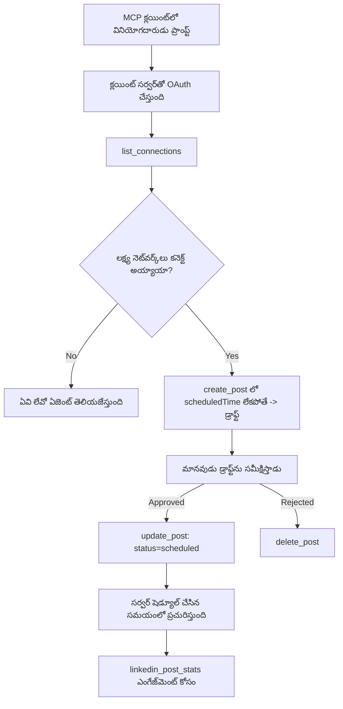

# కేసు అధ్యయనం: రిమోట్ MCP సర్వర్ తో కూడిన ఏజెంట్ నుండి సోషల్ నెట్‌వర్క్‌లపై ప్రచురణ

> **అస్పష్టత:** అనేక సేవలు మరియు ఓపెన్-సోర్స్ ప్రాజెక్టులు సోషల్ నెట్‌వర్క్‌లపై ప్రచురించగలవు, మరియు ఒక టీమ్ ప్రతి నెట్‌వర్క్ యొక్క API ను నేరుగా ఇంటిగ్రేట్ చేయవచ్చు. క్రింద ఉన్న సన్నివేశం ఒక **రాతిఒప్పందం తీసుకునే రిమోట్ MCP సర్వర్** ఎలా డిజైన్ చేసి వినియోగించవచ్చో ఒక పనితీరు ఉదాహరణగా ప్రసాదించబడింది. Publora ఒక వాణిజ్య సేవ, దీనికి ఉచిత స్థాయి ఉంది; ఇక్కడ వర్ణించబడిన నమూనాలు ఉపయోగించేవారు యూజర్ తరఫున అయనివ్వలేనిది చర్యలు చేసే ఏదైనా MCP సర్వర్ కు వర్తిస్తాయి.

## అవలోకనం

ఏజెంట్లు కంటెంట్ తయారీలో మంచివారు కానీ అందించడంలో బలహీనులు. ఒక మోడల్ విడుదల ప్రకటనను సెకన్లలో రాయవచ్చు, ఆ పని ఆగిపోతుంది: ప్రచురణ అంటే ప్రతి నెట్‌వర్క్ కోసం API, ప్రతి నెట్‌వర్క్ కోసం OAuth యాప్, మరియు ఒక్కొక్కటికి భిన్నమైన మీడియా నియమాలు. ఎక్కువ టీములు ఈ సమస్యను టెక్స్ట్‌ను చేతితో బ్రౌజర్‌లో కాపీ చేయడం ద్వారా పరిష్కరిస్తాయి.

ఈ కేసు అధ్యయనం ఆ చివరి దశను ఒకే రిమోట్ MCP సర్వర్ తో ఎలా ముగుస్తుందో చూస్తుంది, మరియు — ఎవరైనా అట్లాగే ఒక సర్వర్ తయారుచేసుకునే వారికి ఉపయోగకరంగా — **రాతిఒప్పందం తీసుకునే** సర్వర్ సరైన నిర్ణయాలు ఎలా తీసుకోవాలో చూపిస్తుంది. డేటాను చదవడం క్షమించదగినది. ప్రచురించడం కాదు: తప్పు టూల్ పిలుపు ప్రేక్షకులు గమనించగలరు మరియు తిరిగి మార్చలేము.

## సన్నివేశం

ఒక చిన్న డెవలపర్-రిలేషన్ టీమ్ ఏజెంట్ (Claude, VS Code, Cursor — క్లయింట్ ముఖ్యం కాదు) లో పోస్టులు డ్రాఫ్ట్ చేస్తుంది. వారు ఏజెంట్ చేయాలనుకుంటున్నారు:

- టీమ్ కనెక్ట్ చేసిన సోషల్ అకౌంట్లు చూడటం,
- ఒక పోస్ట్‌ను డ్రాఫ్ట్ చేయడం మరియు మానవులు ఆమోదించడానికి డ్రాఫ్ట్ గా ఉంచడం,
- ఒక చిత్రం జోడించడం,
- ఎన్నుకున్న సమయానికి పలు నెట్‌వర్క్‌లకు షెడ్యూల్ చేయడం,
- తరువాత ఇది ఎలా ప్రదర్శించింది అన్నది నివేదించడం.

ముఖ్యంగా, వారు ఏజెంట్ ప్రయోగ సమయంలో అకస్మాత్ ప్రచురించగలిగేలా *అనుమతించకూడదని* కోరుకుంటున్నారు.

## ఉపయోగించిన సాధనాలు

- [Publora MCP Server](https://github.com/publora/mcp-server) — ప్రచురణ, షెడ్యూలింగ్, మీడియా మరియు LinkedIn విశ్లేషణా సాధనాలను అందించే రిమోట్ MCP సర్వర్ (`streamable-http`). అధికార MCP రెజిస్ట్రిల్లో `com.publora/mcp-server` గా నమోదైంది.

## దశల వారీ వర్క్‌ఫ్లో

1. **సర్వర్‌ను కనెక్ట్ చేయండి.** OAuth మాట్లాడే క్లయింట్లు సర్వర్ యొక్క అనుమతి తెరపై PKCE తో authorization-code ఫ్లో పూర్తి చేస్తాయి; హెడ్లెస్ CLI లాంటి క్లయింట్లు హెడర్లో Publora API కీని వాడతాయి. ఇద్దరు మార్గాలు మద్దతు ఇస్తాయి, ఏది మీరు పొందతారో క్లయింట్ పై ఆధారపడి ఉంటుంది, సర్వర్ పై కాదు.
2. **కనెక్షన్ల జాబితా.** ఏజెంట్ `list_connections` పిలుస్తుంది మరియు కనెక్ట్ అయిన అకౌంట్లను వారి గుర్తింపులతో స్వీకరిస్తుంది.
3. **డ్రాఫ్ట్ రూపొందించడం.** ఏజెంట్ షెడ్యూల్ సమయం లేకుండా `create_post` పిలుస్తుంది. పోస్ట్‌ను డ్రాఫ్ట్ లాగా నిల్వ చేస్తుంది — ఏదీనీ ప్రచురణ చేయబడదు.
4. **మీడియా జోడించడం.** పబ్లిక్ ఇమేజ్ URL లను అదే పిలుపులో ఇస్తారు; సర్వర్ వాటిని డౌన్లోడ్ చేసి చెక్ చేస్తుంది.
5. **షెడ్యూల్ చేయండి.** మానవులు ఆమోదించిన తర్వాత, `update_post` స్టేటస్‌ను షెడ్యూల్ చేసిన ISO 8601 సమయంతో సెట్ చేస్తుంది.
6. **నిష్పత్తి కొలవండి.** LinkedIn కోసం, `linkedin_post_stats` పోస్టు సజీవంగా ఉండగానే ఎంగేజిమెంట్‌ను తిరిగివస్తుంది.

## ఉదాహరణ ప్రాంప్ట్

```text
Which social accounts do I have connected?
Draft a post announcing our new changelog page, attach the screenshot at
https://example.com/changelog.png, and keep it as a draft — do not publish it.
Once I approve, schedule it to LinkedIn and Bluesky for tomorrow at 09:00 UTC.
```

## మెర్మెయిడ్ ఫ్లోచార్ట్



## సాంకేతిక అమలు

క్రిందున్న పాఠాలు ఈ కేసు అధ్యయనం నుండి బదిలీ చేయదగిన అంశాలు.

### ఓపెన్ డిస్కవరీ, ధృవీకృత ఎగ్జిక్యూషన్

`tools/list` ఎలాంటి ధృవీకరణలేని సేవ చేయబడుతుంది; ప్రతి `tools/call` టోకెన్‌ను అవసరం
పడుతుంది, లేదంటే ఇది `401` తో `WWW-Authenticate` హెడర్‌ను తిరిగి ఇచ్చి
రక్షిత-వనరు మెటాడేటాను చూపిస్తుంది. సర్వర్ యొక్క పాత ఎండ్పాయింట్ కూడా ఒక
ధృవీకరించని `initialize` కు ప్రోటోకాల్ వెర్షన్ల ముందు
`2026-07-28`; ప్రస్తుత క్లయింట్లు ఆ హ్యాండ్‌షేక్ ఉపయోగించరు.

ఈ సర్వర్-స్పెసిఫిక్ విభజన రిజిస్ట్రీలు, క్యాటలాగ్లు మరియు క్లయింట్లు
టూల్ పేర్లు, స్కీమాలు మరియు వ్యాఖ్యానాలను రహస్యముంటే పరిశీలించగలుగుతాయి, అదే సమయంలో
అనామక ఎగ్జిక్యూషన్ నిరోధిస్తుంది. ఓపెన్ డిస్కవరీ ఒక డిప్లాయ్‌మెంట్ ఎంపిక, MCP అవసరం కాదు; రక్షిత డిప్లాయ్‌మెంట్‌కు `tools/list` కు అనుమతులు అవసరం కావచ్చు.


ప్రతి క్లయింట్‌కి విక్రేత నుండి ముందుగా ఇచ్చిన `client_id` అవసరం.


### గుర్తింపులు ఆవిష్కరించలేని విధంగా ఉండాలి

ప్లాట్‌ఫామ్ గుర్తింపులు `list_connections` ద్వారా ఇచ్చే అపారదర్శక స్ట్రింగ్‌లు; స్కీమా వివరణ స్పష్టంగా చెప్తుంది వాటిని మాట కలుపకుండా, ఎప్పుడూ ఊహించరాదు. సర్వర్ ఇతర ఏదైనా అంగీకరించదు.

మోడల్స్ కల్పనా చేయడంలో నైపుణ్యం గలవారు. ఏ రాతికి సన్నద్ధమయిన సర్వర్ ఒక గుర్తింపు చివరికి ఊహించబడవచ్చనే భావన కలిగించాలి మరియు ఆ మార్గం స్పష్టంగా, తొందరగా విఫలమవ్వాలి, తప్ప ఒక సాధారణ భావించిన విలువపై పని చేయకూడదు.

### ప్రచురించే ముందు విఫలమవ్వండి, అమలుచేసే సందేశంతో

కొన్నిసర్వీసులు టెక్స్ట్ మాత్రమే పోస్టులు తిరస్కరిస్తాయి, చిత్రం లేదా వీడియోను తప్పనిసరిగా కోరుతాయి. ఇది షెడ్యూల్ చేసే సమయంలో ప్రమాణీకరించబడుతుంది, తప్పిదం ప్లాట్‌ఫామ్ మరియు కోల్పోయిన అవసరం పేరు చూపిస్తుంది.

ఏజెంట్ "Instagram మీడియా అవసరం – చిత్రం లేదా వీడియో జోడించండి" నుండి మరో ప్రయాణం లేకుండా స్తితి తిరిగి సురక్షితంగా చేసుకోగలదు. సాధారణ `400` నుండి తిరిగి రాకపోవచ్చు.

### రీట్రైలను సురక్షితంగా చేయండి

కంటెంట్ సృష్టించే రెండు సాధనాలు, `create_post` మరియు `update_post` ఐడెంపోటెన్సీ కీ స్వీకరిస్తాయి: అదే అభ్యర్థనతో దాన్ని మళ్లీ వాడినప్పుడు అసలు ప్రతిస్పందన తిరిగి వస్తుంది, రెండవ పోస్టుతో కాకుండా. ఏజెంట్ రంటైమ్‌లు టైమ్-అవుట్‌ల పై రీట్రై చేస్తాయి; ఐడెంపోటెన్సీ లేకుంటే, మందగించిన ప్రతిస్పందన డుప్లికేట్ ప్రచురణ అవుతుంది. మరో వ్రాయడం సాధ‌నాలు — తొలగింపులు, మీడియా దశలు, LinkedIn చర్యలు మరియు వ్యాఖ్యలు — ఇలాంటి కీ తీసుకోవు, కాబట్టి అటువంటి రీట్రై సురక్షితంగా ఉండదు. మీ స్వంత మ్యూటేషన్లలో ఏవి రక్షితమో, ఏవి కాదు అర్ధం చేసుకోవడం మంచిది.

### ఏదీ ప్రచురించకుండా పరీక్షించడానికి మార్గం ఇవ్వండి

సర్వర్ ఒక ది RESERVED లక్ష్యం, `publora-playground` ను అంగీకరిస్తుంది, ఇది నిజమైన గమ్యస్థానం లాగా శాసనీయంగా ధృవీకరించబడతుందని, అప్పుడు నిరాంకురంగా తొలగించబడుతుంది — ఏదీ ప్రత్యక్ష అకౌంట్ వరకు చేరదు. ఇది టూల్ స్కీమాలోనే వర్ణించబడింది, దీన్ని ఏదైనా క్లయింట్ ధృవీకరణల చెలామణీ లేకుండా చదవగలదు: `create_post` లో `platforms` ఫీల్డ్ "నిజమైన కనెక్షన్ అవసరం లేని కనెక్షన్-టెస్ట్ లక్ష్యం - పోస్ట్ అంగీకరించబడతది మరియు తొలగించబడుతుంది, ఏదీ ప్రచురించబడదు" అని వివరిస్తుంది. దీన్ని ఒకదానికి మాత్రమే ప్రవేశ పెట్టటం ద్వారా పిలవవచ్చు: `platforms: ["publora-playground"]`.

ఇది మొత్తం ఉపరితలంపై అత్యంత ఉపయోగకరమైన వివరాల్లో ఒకటిగా తుడిచేసింది. కనెక్టర్ డైరెక్టరీ సమీక్షకులు, సహకారదారులు మరియు CI వృత్తులు పూర్తిగా వ్రాయడం మార్గాన్ని ఎలాంటి ప్రమాదం లేకుండా పూర్తిచేయగలరు. తిరిగి మార్చలేనిది చర్యలు చేసే ఏ MCP సర్వర్ కు డాక్యుమెంట్ చేయబడిన నో-ఆప్ లక్ష్యం అవసరం.

## ఫలితాలు మరియు ప్రభావం

- ప్రచురణ దశ బ్రౌజర్ నుండి కంటెంట్ రాయబడిన అదే సంభాషణకు మార్చబడింది, మరియు మానవుడి చక్రంలో ఉండే డ్రాఫ్ట్-ఫస్ట్ అలవాటు ఉంది. దానికి కచ్చితంగా ఏంటి అనేదాన్ని స్పష్టంగా ఉందించండి: డ్రాఫ్ట్ అనేది సంప్రదాయం, సరిహద్దు కాదు. అదే స్రవంతి షెడ్యూల్ చేయడం లేదా ప్రచురించగలదు, కాబట్టి నిజమైన ఆమోద గేట్ కావాలంటే ఆ సాధన ఉపరితలానికి బయటే అమలు చేయాలి — విభిన్న గుర్తింపులు, లేదా సర్వర్ ముందు విధాన పొర.
- ప్రతి నెట్‌వర్క్ తేడాలు — మీడియా అవసరాలు, థ్రెడింగ్, స్పందన నియంత్రణలు — సర్వర్ లో ఒకసారి నిర్వహించబడతాయి, అన్ని ఏజెంట్లలో కాదు.
- ఒకే సర్వర్ పలు MCP క్లయింట్లకు ముందస్తు గుర్తింపులు లేకుండా మద్దతు ఇస్తుంది.
    ప్రస్తుత క్లయింట్లు Client ID మెటాడేటా డాక్యుమెంట్లను వాడగలవు; DCR పాత క్లయింట్లకు ద్రోప్ఫెల్‌గా ఉంటుంది

- పై డిజైన్ పరిమితులను కనెక్టర్-డైరెక్టరీ సమీక్షలు మరియు వినియోగదారులు సమ్మేళనం చేశారు: వ్యాఖ్యానాలు, OAuth మరియు సురక్షిత టెస్ట్ లక్ష్యం అవసరమయ్యాయి.

## సూచనలు

- [Publora MCP Server (మూలం)](https://github.com/publora/mcp-server)
- [Publora API మరియు MCP డాక్యుమెంటేషన్](https://docs.publora.com)
- [MCP రెజిస్ట్రీ ఎంట్రీ: `com.publora/mcp-server`](https://registry.modelcontextprotocol.io/v0/servers?search=com.publora/mcp-server)
- [MCP స్పెసిఫికేషన్ — అనుమతి](https://modelcontextprotocol.io/specification/2026-07-28/basic/authorization)
- [MCP స్పెసిఫికేషన్ — టూల్ వ్యాఖ్యానాలు](https://modelcontextprotocol.io/docs/concepts/tools)

## తరువాత ఏం

- మీరు నిర్మిస్తున్న MCP సర్వర్ ను తీసుకుని ఇక్కడి మూడు సాధ్యమైన విజయం అంశాలను పరిశీలించండి: ప్రతి టూల్ పై వ్యాఖ్యానాలు, ప్రతి వ్రాతపై ఐడెంపోటెన్సీ కీ, మరియు డాక్యుమెంటేషన్ తో నో-ఆప్ లక్ష్యం.
- ఓపెన్-డిస్కవరీ విభజనను ప్రయత్నించండి: పబ్లిక్ రిమోట్ సర్వర్ ను నష్టపరిచే ధృవీకరణలేకుండా `tools/list` పిలవండి, ఆపై టూల్ పిలువండి మరియు `401` ఛాలెంజ్ ను పరిశీలించండి.
- మీ డొమైన్లో "తిరిగి తీసుకోవడం" అంటే ఏమిటి అనేది పరిశీలించండి. ప్రచురణకు డ్రాఫ్ట్‌లు మరియు తొలగింపులు ఉంటాయి; మీ చర్యలకు ఏమీ సమానంగా లేకపోతే, ధృవీకరణ టూల్ డిజైన్ లో ఉండాలి, పుంజుకో ప్రాంప్ట్ లో కాకుండా.

---

<!-- CO-OP TRANSLATOR DISCLAIMER START -->
**అస్వీకరణ**:
ఈ పత్రం AI అనువాద సేవ [Co-op Translator](https://github.com/Azure/co-op-translator) ఉపయోగించి అనువదించబడింది. మేము ఖచ్చితత్వానికి ప్రయత్నిస్తున్నప్పటికీ, ఆటోమేటెడ్ అనువాదాలు తప్పులు లేదా అసమగ్రతలను కలిగి ఉండవచ్చు. దాని స్వదేశ భాషలో ఉన్న అసలు పత్రాన్ని అధికారం కలిగిన మూలంగా పరిగణించాలి. కీలకమైన సమాచారం కోసం, ప్రొఫెషనల్ మానవ అనువాదాన్ని సిఫారసు చేస్తాము. ఈ అనువాదం ఉపయోగం వల్ల కలిగే ఏవైనా అపార్థాలు లేదా తప్పుదారులు కోసం మేము బాధ్యత వహించము.
<!-- CO-OP TRANSLATOR DISCLAIMER END -->