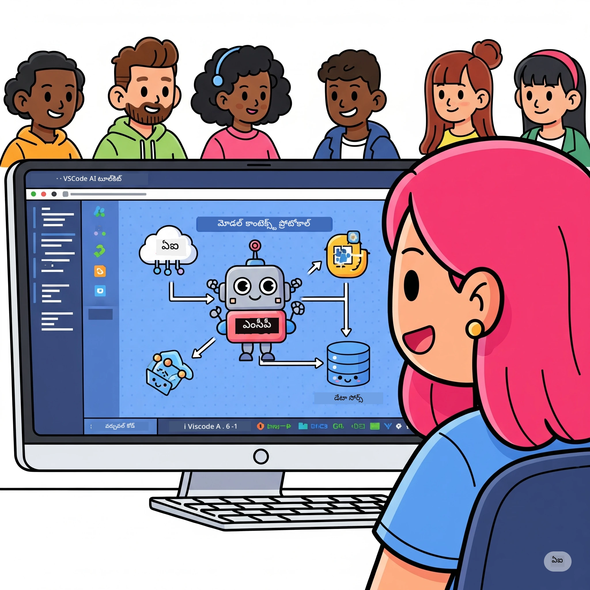
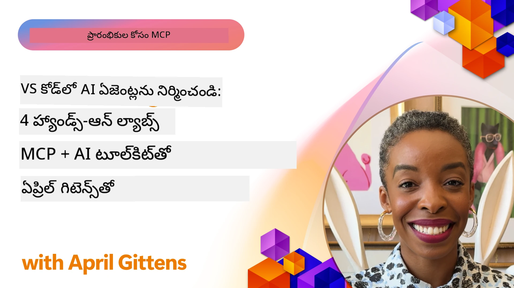

# AI పని ప్రవర్తనలను సులభతరం చేయడం: Microsoft Foundry Toolkit తో MCP సర్వర్ నిర్మాణం

## 🎯 అవలోకనం

_(ఈ పాఠం వీడియోను చూడడానికి పై చిత్రం క్లిక్ చేయండి)_

మీకు స్వాగతం **మోడెల్ కాంటెక్స్ట్ ప్రోటోకాల్ (MCP) వర్క్‌షాప్**! ఈ సమగ్ర ప్రయోగాత్మక వర్క్‌షాప్ రెండు ఆధునిక సాంకేతికతలను కలిపి AI అప్లికేషన్ అభివృద్ధిలో విప్లవాత్మకం చేస్తుంది:

> **అనుకూలత గమనిక:** వర్క్‌షాప్ కోడ్ MCP
> `2025-11-25` తో నిర్మించబడింది మరియు పరీక్షించబడింది, పై బ్యాడ్జ్ ద్వారా చూపబడింది. క్రింది
> [ప్రస్తుత `2026-07-28` స్పెసిఫికేషన్](https://modelcontextprotocol.io/specification/2026-07-28/)
> తో కొత్త ప్రోటోకాల్ అమలు కోసం మరియు ల్యాబ్స్ మార్చే ముందు SDK విడుదల గమనికలను సమీక్షించండి.
> 

- **🔗 మోడల్ కాంటెక్స్ట్ ప్రోటోకాల్ (MCP)**: సులభమైన AI-టూల్ అనుసంధానానికి ఓపెన్ స్టాండర్డు
- **🛠️ మైక్రోసాఫ్ట్ ఫౌండ్రీ టూల్‌కిట్ ఎక్స్‌టెన్షన్ ఫర్ VS కోడ్**: Microsoft's శక్తివంతమైన AI అభివృద్ధి ఎక్స్‌టెన్షన్

### 🎓 మీరు నేర్చుకునేది

ఈ వర్క్‌షాప్ చివరికి, మీరు AI మోడల్స్‌ను వాస్తవ ప్రపంచ టూల్‌లు మరియు సేవలతో అనుసంధానించే తెలివైన అప్లికేషన్లు నిర్మించడంలో నైపుణ్యాన్ని ఆర్జించుకుంటారు. ఆటోమేటెడ్ టెస్టింగ్ నుండి ప్రత్యేక API ఇంటిగ్రేషన్లు వరకు, మీరు క్లిష్ట వ్యాపార సవాళ్లను పరిష్కరించడానికి ప్రాక్టికల్ నైపుణ్యాలు పొందుతారు.

## 🏗️ సాంకేతిక స్టాక్

### 🔌 మోడల్ కాంటెక్స్ట్ ప్రోటోకాల్ (MCP)

MCP అనేది **"AI కోసం USB-C"** - బాహ్య సాధనాలు మరియు డేటా వనరులకు AI మోడల్స్‌ను కనెక్ట్ చేసే ఒక విస్తృత స్టాండర్డు.

**✨ ప్రధాన లక్షణాలు:**

- 🔄 **ప్రామాణీకృత అనుసంధానం**: AI-టూల్ కనెక్షన్లకు ఏకముఖ ఇంటర్ఫేస్
- 🏛️ **అనువైన معماري**: stdio/SSE ట్రాన్స్‌పోర్ట్ ద్వారా స్థానిక & రిమోట్ సర్వర్స్
- 🧰 **సంపన్నమైన ఎకోసిస్టమ్**: టూల్స్, ప్రాంప్ట్స్ మరియు వనరులు ఒకే ప్రోటోకాల్‌లో
- 🔒 **ఎంటర్‌ప్రైజ్ సిద్ధంగా ఉంది**: బలమైన భద్రత మరియు విశ్వసనీయత

**🎯 MCP ఎందుకు ముఖ్యము:**
USB-C కేబుల్ గందరగోళాన్ని తొలగించినట్టు MCP AI అనుసంధానాలు క్లిష్టతను తొలగిస్తుంది. ఒక ప్రోటోకాల్, అనంత అవకాశాలు.

### 🤖 మైక్రోసాఫ్ట్ ఫౌండ్రీ టూల్‌కిట్ ఎక్స్‌టెన్షన్ ఫర్ VS కోడ్

Microsoft యొక్క కీలక AI అభివృద్ధి ఎక్స్‌టెన్షన్, ఇది VS Code ను AI శక్తివంతమైన కేంద్రంగా మార్చుతుంది.

**🚀 ప్రాథమిక సామర్ధ్యాలు:**

- 📦 **మోడల్ క్యాటలాగ్**: Azure AI, GitHub, Hugging Face, Ollama నుండి మోడల్స్ ప్రాప్తి
- ⚡ **స్థానిక ఇన్ఫెరెన్స్**: ONNX-ఆప్టిమైజ్డ్ CPU/GPU/NPU లలో అమలు
- 🏗️ **ఏజెంట్ బిల్డర్**: MCP అనుసంధానం తో విజువల్ AI ఏజెంట్ అభివృద్ధి
- 🎭 **బహుళ-మోడ్**: పాఠ్యం, విజన్, మరియు నిర్మిత అవుట్‌పుట్ మద్దతు

**💡 అభివృద్ధి లాభాలు:**

- జీరో-కాన్ఫిగర్ మోడల్ డిప్లాయ్‌మెంట్
- దృశ్య ప్రాంప్ట్ ఇంజనీరింగ్
- రియల్-టైమ్ టెస్టింగ్ ప్లేగ్రౌండ్
- స్oదలైన MCP సర్వర్ ఇంటిగ్రేషన్

## 📚 నేర్చుకునే ప్రయాణం

### [🚀 మాడ్యూల్ 1: Microsoft Foundry Toolkit మూలతत्त्वాలు](./lab1/README.md)

**కాల వ్యవధి**: 15 నిమిషాలు

- 🛠️ VS కోడ్ కోసం Microsoft Foundry Toolkit ఇన్స్టాల్ చేసి కాన్ఫిగర్ చేయండి
- 🗂️ మోడల్ క్యాటలాగ్ అన్వేషించండి (GitHub, ONNX, OpenAI, Anthropic, Google నుండి 100+ మోడల్స్)
- 🎮 రియల్-టైమ్ మోడల్ పరీక్ష కోసం ఇంటర్‌ఐక్టివ్ ప్లేగ్రౌండ్‌లో అనుభవాన్ని సాధించండి
- 🤖 Agent Builder తో మీ మొదటి AI ఏజెంట్‌ను నిర్మించండి
- 📊 అంతర్భ్రమించబడిన మెట్రిక్స్ (F1, ప్రాధాన్యత, సాదృశ్యం, సమగ్రత) తో మోడల్ పనితీరు మూల్యాంకనం చేయండి
- ⚡ బ్యాచ్ ప్రాసెసింగ్ మరియు మల్టీ-మోడల్ మద్దతు సామర్థ్యాలు నేర్చుకోండి

**🎯 నేర్చుకునే ఫలితం**: Microsoft Foundry Toolkit సామర్థ్యాలను పూర్తి అవగాహనతో ఒక કાર્યనిర్వాహక AI ఏజెంట్‌ని సృష్టించండి

### [🌐 మాడ్యూల్ 2: MCP మరియు Microsoft Foundry Toolkit మూలతత్వాలు](./lab2/README.md)

**కాల వ్యవధి**: 20 నిమిషాలు

- 🧠 మోడల్ కాంటైక్స్ ప్రోటోకాల్ (MCP) నిర్మాణం మరియు భావనలను నేర్చుకోండి
- 🌐 Microsoft యొక్క MCP సర్వర్ ఎకోసిస్టమ్‌ను అన్వేషించండి
- 🤖 Playwright MCP సర్వర్ ఉపయోగించి బ్రౌజర్ ఆటోమేషన్ ఏజెంట్‌ను తయారు చేయండి
- 🔧 MCP సర్వర్‌లను Microsoft Foundry Toolkit Agent Builder తో సమగ్రపరచండి
- 📊 మీ ఏజెంట్‌లలో MCP టూల్స్‌ను కాన్ఫిగర్ చేసి పరీక్షించండి
- 🚀 ఉత్పత్తి వాడుకకు MCP-శక్తిచెందిన ఏజెంట్‌లను ఎగుమతి చేసి డిప్లాయ్ చేయండి

**🎯 నేర్చుకునే ఫలితం**: MCP ద్వారా బాహ్య టూల్స్‌తో శక్తివంతమైన AI ఏజెంట్‌ను డిప్లాయ్ చేయండి

### [🔧 మాడ్యూల్ 3: Microsoft Foundry Toolkit తో ఆధునిక MCP అభివృద్ధి](./lab3/README.md)

**కాల వ్యవధి**: 20 నిమిషాలు

- 💻 Microsoft Foundry Toolkit ఉపయోగించి కస్టమ్ MCP సర్వర్‌లను సృష్టించండి
- 🐍 తాజా MCP Python SDK (v1.9.3)‌ని కాన్ఫిగర్ చేసి ఉపయోగించండి
- 🔍 డీబగ్గింగ్ కోసం MCP ఇన్స్పెక్టర్‌ను సెటప్ చేసి ఉపయోగించండి
- 🛠️ ప్రొఫెషనల్ డీబగ్గింగ్ వర్క్‌ఫ్లోలతో వాతావరణ MCP సర్వర్‌ని నిర్మించండి
- 🧪 Agent Builder మరియు ఇన్స్పెక్టర్ పరిసరాల్లో MCP సర్వర్‌లను డీబగ్గ్ చేయండి

**🎯 నేర్చుకునే ఫలితం**: ఆధునిక టూలింగ్‌తో కస్టమ్ MCP సర్వర్‌లను అభివృద్ధి చేసి డీబగ్గింగ్ చేయండి

### [🐙 మాడ్యూల్ 4: ప్రాక్టికల్ MCP అభివృద్ధి - కస్టమ్ GitHub క్లోన్ సర్వర్](./lab4/README.md)

**కాల వ్యవధి**: 30 నిమిషాలు

- 🏗️ నిజమైన అభివృద్ధి వర్క్‌ఫ్లోల కోసం GitHub క్లోన్ MCP సర్వర్‌ను తయారు చేయండి
- 🔄 ధృవీకరణ మరియు లోపాలు నిర్వహణతో స్మార్ట్ రిపాజిటరీ క్లోనింగ్‌ని అమలు చేయండి
- 📁 బుద్ధిమంతమైన డైరెక్టరీ నిర్వహణ మరియు VS కోడ్ ఇంటిగ్రేషన్‌ని సృష్టించండి
- 🤖 కస్టమ్ MCP టూల్స్‌తో GitHub Copilot Agent Mode ఉపయోగించండి
- 🛡️ ఉత్పత్తి-తయారు నమ్మదగినత మరియు క్రాస్-ప్లాట్‌ఫామ్ అనుకూలతను వర్తింపజేయండి

**🎯 నేర్చుకునే ఫలితం**: నిజమైన అభివృద్ధి వర్క్‌ఫ్లోలను సులభతరం చేసే ఉత్పత్తి-తయారు MCP సర్వర్‌ను డిప్లాయ్ చేయండి

## 💡 నిజజీవిత అనువర్తనాలు & ప్రభావం

### 🏢 సంస్థల ఉపయోగం సందర్భాలు

#### 🔄 DevOps ఆటోమేషన్

తెలివైన ఆటోమేషన్‌తో మీ అభివృద్ధి వర్క్‌ఫ్లోని మార్చండి:

- **స్మార్ట్ రిపాజిటరీ నిర్వహణ**: AI ఆధారిత కోడ్ సమీక్ష మరియు విలీనం నిర్ణయాలు
- **బుద్ధిమంతమైన CI/CD**: కోడ్ మార్పుల ఆధారంగా ఆటోమేటెడ్ పైప్లైన్ ఆప్టిమైజేషన్
- **ఇష్యూ ట్రైయేజ్**: ఆటోమేటెడ్ బగ్ వర్గీకరణ మరియు నియామకం

#### 🧪 నాణ్యత హామీ విప్లవం

AI-శక్తిగల ఆటోమేషన్‌తో పరీక్షా ప్రమాణాలను పెంచండి:

- **బుద్ధిమంతమైన పరీక్షా తియారీ**: సవిస్తృత పరీక్షా సూట్‌లను ఆటోమేటెడ్‌గా సృష్టించండి
- **దృశ్య రిగ్రెషన్ పరీక్ష**: AI ఆధారిత UI మార్పుల గుర్తింపు
- **పనితీరు పర్యవేక్షణ**: ముందస్తుగా సమస్యలను గుర్తించి పరిష్కరించటం

#### 📊 డేటా పైప్లైన్ ఇంటెలిజెన్స్

చైతన్యవంతమైన డేటా ప్రాసెసింగ్ వర్క్‌ఫ్లోలను నిర్మించండి:

- **అనుకూల ETL ప్రక్రియలు**: స్వీయ-ఆప్టిమైజ్ అయ్యే డేటా మార్పులు
- **వినియోగదారు నిర్ధారణ**: రియల్-టైమ్ డేటా నాణ్యత పర్యవేక్షణ
- **బుద్ధిమత్తైన రూటింగ్**: సమర్థవంతమైన డేటా ప్రవాహ నిర్వహణ

#### 🎧 వినియోగదారుల అనుభవం మెరుగుదల

అసాధారణ వినియోగదారు సంభాషణలు సృష్టించండి:

- **సందర్భం తెలుసుకునే మద్దతు**: వినియోగదారుల చరిత్రకు యాక్సెస్ కలిగిన AI ఏజెంట్లు
- **ప్రోఎక్టివ్ సమస్య పరిష్కారం**: ఊహించగలిగే వినియోగదారా సేవ
- **బహు-చానల్ సమగ్రత**: ప్లాట్‌ఫారమ్‌లలో ఐక్య AI అనుభవం

## 🛠️ ముందస్తు అవసరాలు & సెట్టప్

### 💻 సిస్టమ్ అవసరాలు

| భాగం | అవసరం | గమనికలు |
|-----------|-------------|-------|
| **ఆపరేటింగ్ సిస్టమ్** | Windows 10+, macOS 10.15+, Linux | ఏ ఆధునిక OS |
| **విజువల్ స్టూడియో కోడ్** | తాజా స్థిరమైన సంచిక | Microsoft Foundry Toolkit కోసం అవసరం |
| **Node.js** | v18.0+ మరియు npm | MCP సర్వర్ అభివృద్ధికి |
| **Python** | 3.10+ | Python MCP సర్వర్‌లకు ఐచ్ఛికం |
| **మెమరీ** | కనీసం 8GB RAM | స్థానిక మోడళ్ల కోసం 16GB సిఫార్సు |

### 🔧 అభివృద్ధి వాతావరణం

#### సిఫార్సు చేసిన VS కోడ్ ఎక్స్టెన్షన్లు

- **Microsoft Foundry Toolkit** (ms-windows-ai-studio.windows-ai-studio)
- **Python** (ms-python.python)
- **Python డీబగర్** (ms-python.debugpy)
- **GitHub Copilot** (GitHub.copilot) - ఐచ్ఛికం కానీ సహాయకం

#### ఐచ్ఛిక టూల్స్

- **uv**: ఆధునిక Python ప్యాకేజి మేనేజర్
- **MCP ఇన్స్పెక్టర్**: MCP సర్వర్‌ల కోసం విజువల్ డీబగింగ్ సాధనం
- **Playwright**: వెబ్ ఆటోమేషన్ ఉదాహరణలకి

## 🎖️ నేర్చుకున్న ఫలితాలు & సర్టిఫికేషన్ మార్గం

### 🏆 నైపుణ్య మాస్టరీ చెక్లిస్ట్

ఈ వర్క్‌షాప్ పూర్తి చేసిన తర్వాత, మీరు ఈ నైపుణ్యాల్లో మాస్టరీ పొందుతారు:

#### 🎯 ముఖ్య నైపుణ్యాలు

- [ ] **MCP ప్రోటోకాల్ మాస్టరీ**: నిర్మాణం మరియు అమలు నమూనాలను లోతుగా అర్థం చేసుకోవడం
- [ ] **Microsoft Foundry Toolkit ప్రావీణ్యం**: త్వరిత అభివృద్ధికి Microsoft Foundry Toolkit నిపుణులుగా ఉపయోగించడం
- [ ] **కస్టమ్ సర్వర్ అభివృద్ధి**: MCP ప్రొడక్షన్ సర్వర్‌లను నిర్మించి, అమలు చేసి, నిర్వహించడం
- [ ] **టూల్ సమగ్రత నైపుణ్యం**: AIని ఉన్న అభివృద్ధి వర్క్‌ఫ్లోలతో సజావుగా కనెక్ట్ చేయడం
- [ ] **సమస్య పరిష్కార అన్వయము**: నేర్చుకున్న నైపుణ్యాలను వాస్తవ వ్యాపార సవాళ్లపై వర్తించడం

#### 🔧 సాంకేతిక నైపుణ్యాలు

- [ ] VS కోడ్‌లో Microsoft Foundry Toolkit సెటప్ చేసి కస్టమైజ్ చేయడం
- [ ] కస్టమ్ MCP సర్వర్‌లను రూపకల్పన చేసి అమలు చేయడం
- [ ] GitHub మోడళ్లను MCP నిర్మాణంతో సమగ్రత చేయడం
- [ ] Playwrightతో ఆటోమేటెడ్ టెస్టింగ్ వర్క్‌ఫ్లోలను నిర్మించడం
- [ ] ప్రొడక్షన్ వినియోగానికి AI ఏజెంట్లను అమחלించడం
- [ ] MCP సర్వర్ పనితీరును డీబగ్ చేసి ఆప్టిమైజ్ చేయడం

#### 🚀 అభివృద్ధి యోగ్యతలు

- [ ] ఎంటర్‌ప్రైజ్-స్థాయి AI సమగ్రతలని రూపకల్పన చేయడం
- [ ] AI అనువర్తనాలకు భద్రత ఉత్తమ అభ్యాసాలను అమలు చేయడం
- [ ] స్కేలబుల్ MCP సర్వర్ నిర్మాణాలను రూపకల్పన చేయడం
- [ ] నిర్ధిష్ట రంగాలకు కస్టమ్ టూల్ చైన్లను సృష్టించడం
- [ ] ఇతరులను AI-మూల అభివృద్ధిలో మార్గదర్శనం చేయడం

## 📖 అదనపు వనరులు

- [MCP స్పెసిఫికేషన్ (2026-07-28)](https://modelcontextprotocol.io/specification/2026-07-28/)
- [Microsoft Foundry Toolkit GitHub రిపోజిటరీ](https://github.com/microsoft/vscode-ai-toolkit)
- [నమూనా MCP సర్వర్‌ల సేకరణ](https://github.com/modelcontextprotocol/servers)
- [ఉత్తమ ఆచార దశలు గైడ్](https://modelcontextprotocol.io/docs/best-practices)
- [OWASP MCP టాప్ 10](https://microsoft.github.io/mcp-azure-security-guide/mcp/) - భద్రత ఉత్తమ ఆచారాలు

---

**🚀 మీ AI అభివృద్ధి వర్క్‌ఫ్లోని విప్లవాత్మకంగా మార్చడానికి సిద్దమా?**

MCP మరియు Microsoft Foundry Toolkit తో కలిసి తెలివైన అనువర్తనాల భవిష్యత్తును నిర్మిద్దాం!

## తదుపరి ఏమిటి

కొనసాగండి: [మోడ్యూల్ 11: MCP సర్వర్ హ్యాండ్స్-ఆన్ ల్యాబ్స్](../11-MCPServerHandsOnLabs/README.md)

---

<!-- CO-OP TRANSLATOR DISCLAIMER START -->
**అస్వీకరణ**:
ఈ పత్రం AI అనువాద సేవ [Co-op Translator](https://github.com/Azure/co-op-translator) ఉపయోగించి అనువదించబడింది. మేము ఖచ్చితత్వానికి ప్రయత్నిస్తున్నప్పటికీ, ఆటోమేటెడ్ అనువాదాలు తప్పులు లేదా అసమగ్రతలను కలిగి ఉండవచ్చు. దాని స్వదేశ భాషలో ఉన్న అసలు పత్రాన్ని అధికారం కలిగిన మూలంగా పరిగణించాలి. కీలకమైన సమాచారం కోసం, ప్రొఫెషనల్ మానవ అనువాదాన్ని సిఫారసు చేస్తాము. ఈ అనువాదం ఉపయోగం వల్ల కలిగే ఏవైనా అపార్థాలు లేదా తప్పుదారులు కోసం మేము బాధ్యత వహించము.
<!-- CO-OP TRANSLATOR DISCLAIMER END -->