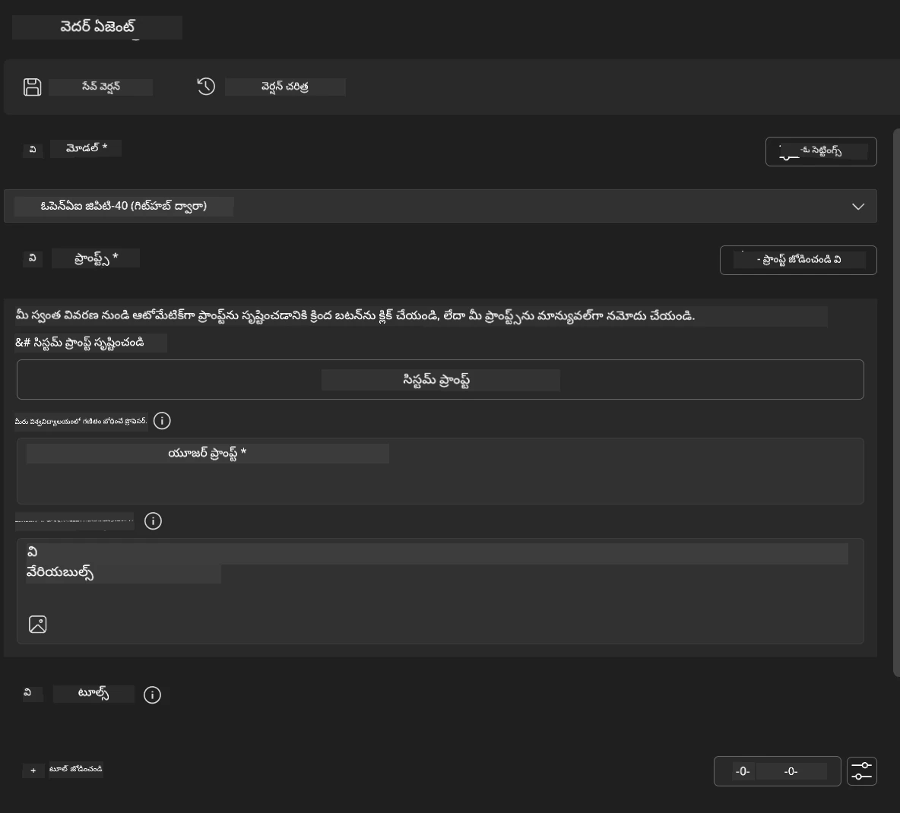
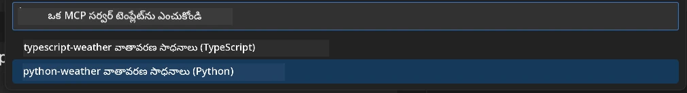
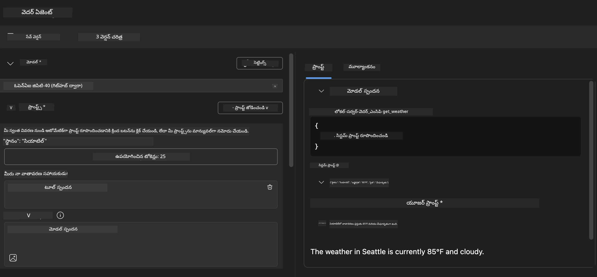
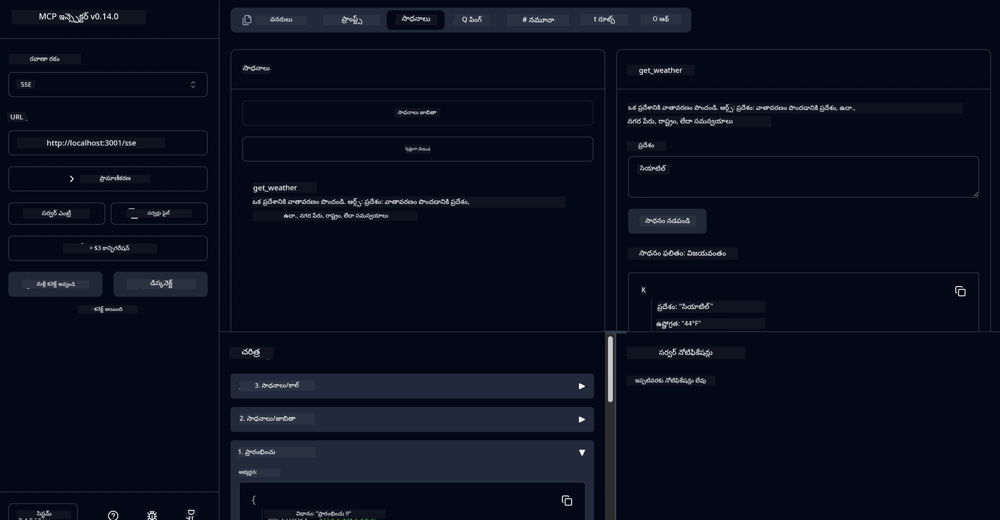

# 🔧 మాడ్యూల్ 3: Microsoft Foundry Toolkit తో అధునాతన MCP అభివృద్ధి

> [!NOTE]
> ఈ ప్రయోగశాలలో Inspector URLలు పాత `/sse` ఎండ్‌పాయింట్‌ను ఉపయోగిస్తాయి మరియు
> MCP SDK `1.9.3` మరియు Inspector `0.14.0` డిపెండెన్సీలను లక్ష్యం స్వరూపం చేస్తాయి. ఇవి
> ప్రస్తుత `2026-07-28` Streamable HTTP నమూనాలు కావు.


## 🎯 నేర్చుకునే లక్ష్యాలు

ఈ ప్రయోగశాల చివరికి, మీరు చేయగలుగుతారు:

- ✅ Microsoft Foundry Toolkit ఉపయోగించి కస్టమ్ MCP సర్వర్స్ సృష్టించడం
- ✅ తాజా MCP Python SDK (v1.9.3) కాన్ఫిగర్ చేసి ఉపయోగించడం
- ✅ డీబగ్గింగ్ కోసం MCP Inspector సెటప్ చేసి ఉపయోగించుకోవడం
- ✅ Agent Builder మరియు Inspector వాతావరణాల్లో MCP సర్వర్స్ డీబగ్ చేయడం
- ✅ అధునాతన MCP సర్వర్ అభివృద్ధి వర్క్‌ఫ్లోలను అర్థం చేసుకోవడం

## 📋 ముందస్తు అవసరాలు

- ల్యాబ్ 2 (MCP ఫండమెంటల్స్) పూర్తి చేయడం
- Microsoft Foundry Toolkit విస్తరణ ఉందని VS కోడ్
- Python 3.10+ వాతావరణం
- Inspector సెటప్ కోసం Node.js మరియు npm

## 🏗️ మీరు రూపొందించేది

ఈ ప్రయోగంలో మీరు సృష్టించేది **వెదర్ MCP సర్వర్** ఇది చూపిస్తుంది:
- కస్టమ్ MCP సర్వర్ అమలుకరణ
- Microsoft Foundry Toolkit Agent Builder తో అనుసంధానం
- ప్రొఫెషనల్ డీబగ్గింగ్ వర్క్‌ఫ్లోలు
- ఆధునిక MCP SDK ఉపయోగ సూచనలు

---

## 🔧 ముఖ్య భాగాల అవగాహన

### 🐍 MCP Python SDK
మోడల్ కాంటెక్స్ట్ ప్రోటోకాల్ పైథాన్ SDK, కస్టమ్ MCP సర్వర్స్ నిర్మాణానికి పునాది ఉంచుతుంది. మీరు 1.9.3 సంస్కరణను అధునాతన డీబగ్గింగ్ సౌకర్యాలతో ఉపయోగిస్తారు.

### 🔍 MCP ఇన్స్‌పెక్టర్
శక్తివంతమైన డీబగ్గింగ్ సాధనం, ఇది అందిస్తుంది:
- రియల్- టైమ్ సర్వర్ మానిటరింగ్
- టూల్ నిర్వహణ విజువలైజేషన్
- నెట్‌వర్క్ అభ్యర్థన/స్పందన తనిఖీ
- అంతర్రాష్ట్ర పరీక్ష వాతావరణం

---

## 📖 దశల వారీ అమలు

### దశ 1: Agent Builderలో WeatherAgent సృష్టించండి

1. **VS కోడ్ లో Agent Builder ని ప్రారంభించండి** Microsoft Foundry Toolkit విస్తరణ ద్వారా
2. **క్రింది కాన్ఫిగరేషన్ తో ఒక కొత్త ఏజెంట్ సృష్టించండి**:
   - ఏజెంట్ పేరు: `WeatherAgent`



### దశ 2: MCP సర్వర్ ప్రాజెక్ట్‌ను ప్రారంభించండి

1. **Agent Builder లో Tools → Add Tool కి వెళ్లండి**
2. **లభ్యమయ్యే ఎంపికల నుండి "MCP Server" ఎంచుకోండి**
3. **"Create A new MCP Server" ఎంచుకోండి**
4. **`python-weather` టెంప్లేట్ ఎంచుకోండి**
5. **మీ సర్వర్ పేరు పెట్టండి:** `weather_mcp`



### దశ 3: ప్రాజెక్ట్‌ను తెరిచి పరిశీలించండి

1. **సృష్టించిన ప్రాజెక్ట్ ని VS కోడ్ లో తెరవండి**
2. **ప్రాజెక్ట్ నిర్మాణాన్ని సమీక్షించండి:**
   ```
   weather_mcp/
   ├── src/
   │   ├── __init__.py
   │   └── server.py
   ├── inspector/
   │   ├── package.json
   │   └── package-lock.json
   ├── .vscode/
   │   ├── launch.json
   │   └── tasks.json
   ├── pyproject.toml
   └── README.md
   ```

### దశ 4: తాజా MCP SDKకి అప్‌గ్రేడ్ చేయండి

> **🔍 ఎందుకు అప్‌గ్రేడ్?** అధునాతన లక్షణాలు మరియు మెరుగైన డీబగ్గింగ్ సామర్థ్యాల కోసం తాజా MCP SDK (v1.9.3) మరియు ఇన్స్‌పెక్టర్ సర్వీస్ (0.14.0) ఉపయోగించాలి.

#### 4a. పైథాన్ డిపెండెన్సీలను నవీకరించండి

**`pyproject.toml` ను సవరించండి:** [./code/weather_mcp/pyproject.toml](../../../../10-StreamliningAIWorkflowsBuildingAnMCPServerWithAIToolkit/lab3/code/weather_mcp/pyproject.toml) ని నవీకరించండి


#### 4b. ఇన్స్‌పెక్టర్ కాన్ఫిగరేషన్ నవీకరణ

**`inspector/package.json` ను సవరించండి:** [./code/weather_mcp/inspector/package.json](../../../../10-StreamliningAIWorkflowsBuildingAnMCPServerWithAIToolkit/lab3/code/weather_mcp/inspector/package.json) ని నవీకరించండి

#### 4c. ఇన్స్‌పెక్టర్ డిపెండెన్సీలు నవీకరించండి

**`inspector/package-lock.json` ను సవరించండి:** [./code/weather_mcp/inspector/package-lock.json](../../../../10-StreamliningAIWorkflowsBuildingAnMCPServerWithAIToolkit/lab3/code/weather_mcp/inspector/package-lock.json) ని నవీకరించండి

> **📝 గమనిక:** ఈ ఫైల్ విస్తృతమైన డిపెండెన్సీ నిర్వచనాలను కలిగి ఉంది. కింద ఇవ్వబడింది అవసరమైన నిర్మాణం - పూర్తి విషయం సరైన డిపెండెన్సీ పరిష్కారానికి అవసరం.


> **⚡ పూర్తి ప్యాకేజీ లాక్:** పూర్తి package-lock.json ~3000 లైన్ల డిపెండెన్సీ నిర్వచనాలను కలిగి ఉంటుంది. పైది ప్రధాన నిర్మాణాన్ని చూపిస్తుంది - పూర్తి డిపెండెన్సీ పరిష్కారం కోసం ఇచ్చిన ఫైల్ ఉపయోగించండి.

### దశ 5: VS కోడ్ డీబగ్గింగ్ కాన్ఫిగరేషన్ చేయండి

*గమనిక: ఇవ్వబడిన మార్గంలోని ఫైల్‌ను ప్రతిస్థాపించడానికి కాపీ చేయండి*

#### 5a. లాంచ్ కాన్ఫిగరేషన్ నవీకరణ

**`.vscode/launch.json` ను సవరించండి:**

```json
{
  "version": "0.2.0",
  "configurations": [
    {
      "name": "Attach to Local MCP",
      "type": "debugpy",
      "request": "attach",
      "connect": {
        "host": "localhost",
        "port": 5678
      },
      "presentation": {
        "hidden": true
      },
      "internalConsoleOptions": "neverOpen",
      "postDebugTask": "Terminate All Tasks"
    },
    {
      "name": "Launch Inspector (Edge)",
      "type": "msedge",
      "request": "launch",
      "url": "http://localhost:6274?timeout=60000&serverUrl=http://localhost:3001/sse#tools",
      "cascadeTerminateToConfigurations": [
        "Attach to Local MCP"
      ],
      "presentation": {
        "hidden": true
      },
      "internalConsoleOptions": "neverOpen"
    },
    {
      "name": "Launch Inspector (Chrome)",
      "type": "chrome",
      "request": "launch",
      "url": "http://localhost:6274?timeout=60000&serverUrl=http://localhost:3001/sse#tools",
      "cascadeTerminateToConfigurations": [
        "Attach to Local MCP"
      ],
      "presentation": {
        "hidden": true
      },
      "internalConsoleOptions": "neverOpen"
    }
  ],
  "compounds": [
    {
      "name": "Debug in Agent Builder",
      "configurations": [
        "Attach to Local MCP"
      ],
      "preLaunchTask": "Open Agent Builder",
    },
    {
      "name": "Debug in Inspector (Edge)",
      "configurations": [
        "Launch Inspector (Edge)",
        "Attach to Local MCP"
      ],
      "preLaunchTask": "Start MCP Inspector",
      "stopAll": true
    },
    {
      "name": "Debug in Inspector (Chrome)",
      "configurations": [
        "Launch Inspector (Chrome)",
        "Attach to Local MCP"
      ],
      "preLaunchTask": "Start MCP Inspector",
      "stopAll": true
    }
  ]
}
```

**`.vscode/tasks.json` ను సవరించండి:**

```
{
  "version": "2.0.0",
  "tasks": [
    {
      "label": "Start MCP Server",
      "type": "shell",
      "command": "python -m debugpy --listen 127.0.0.1:5678 src/__init__.py sse",
      "isBackground": true,
      "options": {
        "cwd": "${workspaceFolder}",
        "env": {
          "PORT": "3001"
        }
      },
      "problemMatcher": {
        "pattern": [
          {
            "regexp": "^.*$",
            "file": 0,
            "location": 1,
            "message": 2
          }
        ],
        "background": {
          "activeOnStart": true,
          "beginsPattern": ".*",
          "endsPattern": "Application startup complete|running"
        }
      }
    },
    {
      "label": "Start MCP Inspector",
      "type": "shell",
      "command": "npm run dev:inspector",
      "isBackground": true,
      "options": {
        "cwd": "${workspaceFolder}/inspector",
        "env": {
          "CLIENT_PORT": "6274",
          "SERVER_PORT": "6277",
        }
      },
      "problemMatcher": {
        "pattern": [
          {
            "regexp": "^.*$",
            "file": 0,
            "location": 1,
            "message": 2
          }
        ],
        "background": {
          "activeOnStart": true,
          "beginsPattern": "Starting MCP inspector",
          "endsPattern": "Proxy server listening on port"
        }
      },
      "dependsOn": [
        "Start MCP Server"
      ]
    },
    {
      "label": "Open Agent Builder",
      "type": "shell",
      "command": "echo ${input:openAgentBuilder}",
      "presentation": {
        "reveal": "never"
      },
      "dependsOn": [
        "Start MCP Server"
      ],
    },
    {
      "label": "Terminate All Tasks",
      "command": "echo ${input:terminate}",
      "type": "shell",
      "problemMatcher": []
    }
  ],
  "inputs": [
    {
      "id": "openAgentBuilder",
      "type": "command",
      "command": "ai-mlstudio.agentBuilder",
      "args": {
        "initialMCPs": [ "local-server-weather_mcp" ],
        "triggeredFrom": "vsc-tasks"
      }
    },
    {
      "id": "terminate",
      "type": "command",
      "command": "workbench.action.tasks.terminate",
      "args": "terminateAll"
    }
  ]
}
```


---

## 🚀 మీ MCP సర్వర్ నడిపించండి మరియు పరీక్షించండి

### దశ 6: డిపెండెన్సీలు ఇన్‌స్టాల్ చేయండి

కాన్ఫిగరేషన్ మార్పులు చేసిన తర్వాత, ఈ కింద ఇచ్చిన ఆదేశాలు అమలుచేయండి:

**పైథాన్ డిపెండెన్సీలు ఇన్‌స్టాల్ చేయండి:**
```bash
uv sync
```

**ఇన్స్‌పెక్టర్ డిపెండెన్సీలు ఇన్‌స్టాల్ చేయండి:**
```bash
cd inspector
npm install
```

### దశ 7: Agent Builder తో డీబగ్ చేయండి

1. **F5 నొక్కండి** లేదా **"Debug in Agent Builder"** కాన్ఫిగరేషన్ ఉపయోగించండి
2. డీబగ్ ప్యానెల్ నుండి కాంపౌండ్ కాన్ఫిగరేషన్ ఎంచుకోండి
3. **సర్వర్ ప్రారంభం కావాలంటే వేచి ఉండండి** మరియు Agent Builder తెరువుతుంది
4. సహజ భాషా ప్రశ్నలతో మీ వెదర్ MCP సర్వర్ ను పరీక్షించండి

ఇన్పుట్ ప్రాంప్ట్ ఇలాగే ఉండాలి

SYSTEM_PROMPT

```
You are my weather assistant
```

USER_PROMPT

```
How's the weather like in Seattle
```



### దశ 8: MCP ఇన్స్‌పెక్టర్ తో డీబగ్ చేయండి

1. **"Debug in Inspector"** కాన్ఫిగరేషన్ ఉపయోగించండి (ఎడ్జ్ లేదా క్రోమ్)
2. `http://localhost:6274` వద్ద ఇન્સ‌పెక్టర్ ఇంటర్‌ఫేస్ తెరవండి
3. అంతర్రాష్ట్ర పరీక్ష వాతావరణం అన్వేషించండి:
   - అందుబాటులో ఉన్న టూల్స్ చూసుకోండి
   - టూల్ ఎగ్జిక్యూషన్ పరీక్షించండి
   - నెట్‌వర్క్ అభ్యర్థనలు మానిటరింగ్ చేయండి
   - సర్వర్ స్పందనలను డీబగ్ చేయండి



---

## 🎯 ముఖ్యమైన నేర్చుకున్న ఫలితాలు

ఈ ప్రయోగశాలను పూర్తి చేయడం ద్వారా, మీరు:

- [x] **Microsoft Foundry Toolkit టెంప్లేట్‌లను ఉపయోగించి కస్టమ్ MCP సర్వర్ సృష్టించారు**
- [x] **తాజా MCP SDK (v1.9.3) కి అప్‌గ్రేడ్ చేసి పెర్ఫార్మెన్స్ పెంపొందించారు**
- [x] **Agent Builder మరియు ఇన్స్‌పెక్టర్ కోసం ప్రొఫెషనల్ డీబగ్గింగ్ వర్క్‌ఫ్లోలను కాన్ఫిగర్ చేసారు**
- [x] **డీబగ్గింగ్ పరీక్షల కోసం MCP ఇన్స్‌పెక్టర్ సెటప్ చేసారు**
- [x] **MCP అభివృద్ధి కోసం VS కోడ్ డీబగ్గింగ్ కాన్ఫిగరేషన్లను నేర్చుకున్నారు**

## 🔧 పరిశీలించిన అధునాతన ఫీచర్లు

| ఫీచర్ | వివరణ | ఉపయోగం |
|---------|-------------|----------|
| **MCP Python SDK v1.9.3** | తాజా ప్రోటోకాల్ అమలు | ఆధునిక సర్వర్ అభివృద్ధి |
| **MCP Inspector 0.14.0** | అంతర్రాష్ట్ర డీబగ్గింగ్ సాధనం | రియల్-టైమ్ సర్వర్ పరీక్ష |
| **VS కోడ్ డీబగ్గింగ్** | సమగ్ర అభివృద్ధి వాతావరణం | ప్రొఫెషనల్ డీబగ్గింగ్ వర్క్‌ఫ్లో |
| **Agent Builder అనుసంధానం** | నేరుగా Microsoft Foundry Toolkit కనెక్షన్ | ఎండ్-టు-ఎండ్ ఏజెంట్ పరీక్ష |

## 📚 అదనపు వనరులు

- [MCP Python SDK డాక్యుమెంటేషన్](https://modelcontextprotocol.io/docs/sdk/python)
- [Microsoft Foundry Toolkit విస్తరణ మార్గదర్శకం](https://code.visualstudio.com/docs/ai/ai-toolkit)
- [VS కోడ్ డీబగ్గింగ్ డాక్యుమెంటేషన్](https://code.visualstudio.com/docs/editor/debugging)
- [మోడల్ కాంటెక్స్ట్ ప్రోటోకాల్ స్పెసిఫికేషన్](https://modelcontextprotocol.io/docs/concepts/architecture)

---

**🎉 అభినందనలు!** మీరు ల్యాబ్ 3 విజయవంతంగా పూర్తి చేశారు మరియు ప్రొఫెషనల్ అభివృద్ధి వర్క్‌ఫ్లోలను ఉపయోగించి కస్టమ్ MCP సర్వర్స్ సృష్టించడం, డీబగ్ చేయడం మరియు నిష్పత్తి చేయడం నేర్చుకున్నారు.

### 🔜 తదుపరి మాడ్యూల్‌కు కొనసాగండి

మీ MCP నైపుణ్యాలను వాస్తవ ప్రపంచ అభివృద్ధి వర్క్‌ఫ్లోకు వర్తింపజేయడానికి సిద్ధంగా ఉన్నారా? **[మాడ్యూల్ 4: ప్రాక్టికల్ MCP అభివృద్ధి - కస్టమ్ GitHub క్లోన్ సర్వర్](../lab4/README.md)** కు కొనసాగండి, ఇక్కడ మీరు:
- ప్రొడక్షన్-తయారు MCP సర్వర్‌ని సృష్టించి GitHub రిపోజిటరీ ఆపరేషన్లను ఆటోమేట్గా నిర్వహిస్తారు
- MCP ద్వారా GitHub రిపోజిటరీ క్లోనింగ్ పనితీరు అమలు చేయడం
- VS కోడ్ మరియు GitHub Copilot ఏజెంట్ మోడ్‌తో కస్టమ్ MCP సర్వర్‌లను అనుసంధానం చేయడం
- ప్రొడక్షన్ వాతావరణాల్లో కస్టమ్ MCP సర్వర్లను పరీక్షించి నిష్పత్తి చేయడం
- డెవలపర్ల కోసం ప్రాక్టికల్ వర్క్‌ఫ్లో ఆటోమేషన్ నేర్చుకోవడం

---

<!-- CO-OP TRANSLATOR DISCLAIMER START -->
**అస్వీకరణ**:
ఈ పత్రం AI అనువాద సేవ [Co-op Translator](https://github.com/Azure/co-op-translator) ఉపయోగించి అనువదించబడింది. మేము ఖచ్చితత్వానికి ప్రయత్నిస్తున్నప్పటికీ, ఆటోమేటెడ్ అనువాదాలు తప్పులు లేదా అసమగ్రతలను కలిగి ఉండవచ్చు. దాని స్వదేశ భాషలో ఉన్న అసలు పత్రాన్ని అధికారం కలిగిన మూలంగా పరిగణించాలి. కీలకమైన సమాచారం కోసం, ప్రొఫెషనల్ మానవ అనువాదాన్ని సిఫారసు చేస్తాము. ఈ అనువాదం ఉపయోగం వల్ల కలిగే ఏవైనా అపార్థాలు లేదా తప్పుదారులు కోసం మేము బాధ్యత వహించము.
<!-- CO-OP TRANSLATOR DISCLAIMER END -->