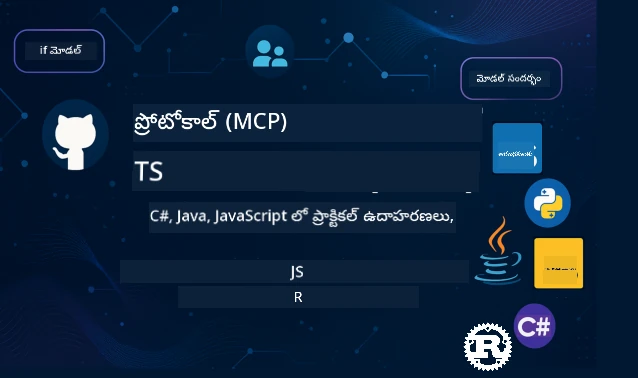

 

[](https://GitHub.com/microsoft/mcp-for-beginners/graphs/contributors)
[](https://GitHub.com/microsoft/mcp-for-beginners/issues)
[](https://GitHub.com/microsoft/mcp-for-beginners/pulls)
[](http://makeapullrequest.com)

[](https://GitHub.com/microsoft/mcp-for-beginners/watchers)
[](https://GitHub.com/microsoft/mcp-for-beginners/fork)
[](https://GitHub.com/microsoft/mcp-for-beginners/stargazers)


[](https://discord.gg/nTYy5BXMWG)

ఈ వనరులను ఉపయోగించడం ప్రారంభించడానికి ఈ దశలను అనుసరించండి:
1. **రిపాజిటరీని ఫోర్క్ చేయండి**: క్లిక్ చేయండి [](https://GitHub.com/microsoft/mcp-for-beginners/fork)
2. **రిపాజిటరీని క్లోన్ చేయండి**:   `git clone https://github.com/microsoft/mcp-for-beginners.git`
3. **జాయిన్ అవ్వండి** [](https://discord.gg/nTYy5BXMWG)


### 🌐 బహుభాషా మద్దతు

#### GitHub యాక్షన్ ద్వారా మద్దతు (ఆటోమేటెడ్ & ఎల్లప్పుడూ నవీకరించబడుతుంది)

<!-- CO-OP TRANSLATOR LANGUAGES TABLE START -->
[Arabic](../ar/README.md) | [Bengali](../bn/README.md) | [Bulgarian](../bg/README.md) | [Burmese (Myanmar)](../my/README.md) | [Chinese (Simplified)](../zh-CN/README.md) | [Chinese (Traditional, Hong Kong)](../zh-HK/README.md) | [Chinese (Traditional, Macau)](../zh-MO/README.md) | [Chinese (Traditional, Taiwan)](../zh-TW/README.md) | [Croatian](../hr/README.md) | [Czech](../cs/README.md) | [Danish](../da/README.md) | [Dutch](../nl/README.md) | [Estonian](../et/README.md) | [Finnish](../fi/README.md) | [French](../fr/README.md) | [German](../de/README.md) | [Greek](../el/README.md) | [Hebrew](../he/README.md) | [Hindi](../hi/README.md) | [Hungarian](../hu/README.md) | [Indonesian](../id/README.md) | [Italian](../it/README.md) | [Japanese](../ja/README.md) | [Kannada](../kn/README.md) | [Korean](../ko/README.md) | [Lithuanian](../lt/README.md) | [Malay](../ms/README.md) | [Malayalam](../ml/README.md) | [Marathi](../mr/README.md) | [Nepali](../ne/README.md) | [Nigerian Pidgin](../pcm/README.md) | [Norwegian](../no/README.md) | [Persian (Farsi)](../fa/README.md) | [Polish](../pl/README.md) | [Portuguese (Brazil)](../pt-BR/README.md) | [Portuguese (Portugal)](../pt-PT/README.md) | [Punjabi (Gurmukhi)](../pa/README.md) | [Romanian](../ro/README.md) | [Russian](../ru/README.md) | [Serbian (Cyrillic)](../sr/README.md) | [Slovak](../sk/README.md) | [Slovenian](../sl/README.md) | [Spanish](../es/README.md) | [Swahili](../sw/README.md) | [Swedish](../sv/README.md) | [Tagalog (Filipino)](../tl/README.md) | [Tamil](../ta/README.md) | [Telugu](./README.md) | [Thai](../th/README.md) | [Turkish](../tr/README.md) | [Ukrainian](../uk/README.md) | [Urdu](../ur/README.md) | [Vietnamese](../vi/README.md)

> **స్ధానికంగా క్లోన్ చేయమని ఇష్టపడుతున్నారా?**

> ఈ రిపాజిటరీలో 50+ భాషా అనువాదాలు ఉన్నాయి, ఇది డౌన్లోడ్ పరిమాణాన్ని గణనీయంగా పెంచుతుంది. అనువాదాలు లేకుండా క్లోన్ చేసుకోవడానికి, స్పార్స్ చెకౌట్ ఉపయోగించండి:
> ```bash
> git clone --filter=blob:none --sparse https://github.com/microsoft/mcp-for-beginners.git
> cd mcp-for-beginners
> git sparse-checkout set --no-cone '/*' '!translations' '!translated_images'
> ```
> ఇది మీరు కోర్సు పూర్తి చేసుకోవడానికి అవసరమైన ప్రతీదీ గణనీయంగా త్వరితమైన డౌన్లోడుతో ఇస్తుంది.
<!-- CO-OP TRANSLATOR LANGUAGES TABLE END -->

# 🚀 మోడల్ కాన్టెక్స్ట్ ప్రోటోకాల్ (MCP) ప్రారంభకుల కోసం కోర్సు

## **C#, Java, JavaScript, Rust, Python, మరియు TypeScript లో MCPని హ్యాండ్స్-ఆన్ కోడ్ ఉదాహరణలతో నేర్చుకోండి**

## 🧠 మోడల్ కాన్టెక్స్ట్ ప్రోటోకాల్ కోర్సు అవలోకనం
మోడల్ కాన్టెక్స్ట్ ప్రోటోకాల్ పథయాత్రకి స్వాగతం! మీరు ఎప్పుడైనా ఆలోచించి ఉంటే, AI అనువర్తనాలు వివిధ టూల్స్ మరియు సేవలతో ఎలా కమ్యూనికేట్ చేయగలవో, ఇప్పుడు మీరు ఆ అందంగా డిజైన్ అయిన పరిష్కారాన్ని కనుగొనబోతున్నారు, ఇది డెవలపర్లు ఇంటెలిజెంట్ సిస్టమ్స్ ఎలా నిర్మిస్తారో మార్చేస్తోంది.

MCP ని AI అనువర్తనాల కోసం యూనివర్సల్ ట్రాన్స్‌లెటర్‌గా పరిగణించండి - USB పోర్టులు మీ కంప్యూటర్‌కు ఏ యంత్రాన్నైనా కనెక్ట్ చేసుకోవడానికి ఇస్తున్నట్లు, MCP AI మోడల్స్ ని ఏ టూల్ లేదా సేవకో ఒక స్టాండర్డైజ్డ్ మార్గంలో కనెక్ట్ చేయడానికి అనుమతిస్తుంది. మీరు మొదటి చాట్‌బాట్ తయారుచేస్తుండండి లేదా క్లిష్ట AI వర్క్‌ఫ్లోలపై పని చెయ్యండి, MCPని అర్థం చేసుకోవడం మీకు మరింత సామర్థ్యవంతమైన మరియు ఫ్లెక్సిబుల్ అప్లికేషన్లు సృష్టించడానికి శక్తిని ఇస్తుంది.

ఈ కోర్సు మీ అభ్యాస పయనాన్ని ధైర్యంగా మరియు జాగ్రత్తగా రూపొందించబడింది. మీరు ఇప్పటికే అర్థం చేసుకున్న సులభమైన కాన్సెప్ట్‌లతో ప్రారంభించి, మీ ఇష్టమైన ప్రోగ్రామింగ్ భాషలో హ్యాండ్స్-ఆన్ ప్రాక్టీస్ ద్వారా క్రమంగా మీ నైపుణ్యాలను నిర్మిస్తాం. ప్రతి దశలో స్పష్టమైన వివరణలు, ప్రాక్టికల్ ఉదాహరణలు మరియు చాలా ప్రోత్సాహం ఉంటాయి.

ఈ పయనాన్ని పూర్తి చేసినప్పుడు, మీరు మీ సొంత MCP సర్వర్‌లను బిల్డ్ చేయడానికి ధైర్యం కలిగేరు, వాటిని ప్రాచుర్యం పొందిన AI ప్లాట్‌ఫారమ్‌లతో ఇంటిగ్రేట్ చేయడంలో నైపుణ్యం సంపాదిస్తారు మరియు ఈ టెక్నాలజీ AI అభివృద్ధి యొక్క భవిష్యత్తును ఎలా మలచుతున్నదానిని అర్థం చేసుకుంటారు. ఈ ఉత్సాహకరమైన సాహసయాత్రను ఆశించి ప్రారంభిద్దాం!

### అధికారిక డాక్యుమెంటేషన్ మరియు స్పెసిఫికేషన్లు

ఈ వనరులు మీ అర్థం పెరిగేకొద్దీ మరింత విలువైనవిగా మారతాయి, కానీ వాటన్నీ ఒకేసారి చదవాలని ఒత్తిడి పడకండి. మీకు అత్యంత ఆసక్తి ఉన్న ప్రాంతాల నుంచి ప్రారంభించండి!
- 📘 [MCP డాక్యుమెంటేషన్](https://modelcontextprotocol.io/) – ఇది మీకోసం స్టెప్-బై-స్టెప్ ట్యుటోరియల్స్ మరియు యూజర్ గైడ్స్ అందించే వనరు. డాక్యుమెంటేషన్ ప్రారంభకులను దృష్టిలో పెట్టుకొని రాసబడింది, మీరు మీ వేగంతో అనుసరించే సులభమైన ఉదాహరణలతో.
- 📜 [MCP స్పెసిఫికేషన్](https://modelcontextprotocol.io/docs/) – దీన్ని మీరు సమగ్ర సూచన పుస్తకం లాగా భావించండి. కోర్సు ముందుకు సాగుతుండగా, మీరు నిర్దిష్ట వివరాలు చూడటానికి ఇక్కడికి తిరిగి రావడం జరుగుతుంది మరియు అడ్వాన్స్‌డ్ ఫీచర్లను అన్వేషిస్తారు.
- 📜 [మూల MCP స్పెసిఫికేషన్](https://modelcontextprotocol.io/specification/versioning) – ఇది అడ్వాన్స్‌డ్ ఇంప్లిమెంటేషన్లు కోసం సహాయకరమైన అదనపు సాంకేతిక వివరాలు కలిగి ఉంటుంది. మీరు కావాలంటే మీకు సిద్ధంగా ఉంటుంది, కానీ ప్రారంభంలో దీంటిపై ఆందోళన పడకండి.
- 🧑‍💻 [MCP GitHub రిపాజిటరీ](https://github.com/modelcontextprotocol) – ఇక్కడ మీకు SDKలు, టూల్స్ మరియు బహుభాషా ప్రోగ్రామింగ్ కోడ్ నమూనాలు లభిస్తాయి. ఇది ప్రాక్టికల్ ఉదాహరణలు మరియు రెడీ-టు-యూజ్ భాగాల నిధి లాంటిది.
- 🌐 [MCP కమ్యూనిటీ](https://github.com/orgs/modelcontextprotocol/discussions) – MCP గురించి fellow learners మరియు అనుభవజ్ఞులైన డెవలపర్లతో చర్చల్లో చేరండి. ఇది ప్రశ్నలు స్వాగతించబడే మరియు జ్ఞానం స్వేచ్ఛగా పంచుకునే ఒక సపోర్టివ్ కమ్యూనిటీ.

## అభ్యాస లక్ష్యాలు

ఈ కోర్సు చివరికి, మీరు కొత్త నైపుణ్యాలపై ధైర్యంగా మరియు ఉత్సాహంగా భావిస్తారు. మీరు సాధించబోయే వాటివి ఇవి:

• **MCP ప్రాథమికాలు అర్థం చేసుకోండి**: మోడల్ కాన్టెక్స్ట్ ప్రోటోకాల్ ఏమిటి, అది AI అనువర్తనాలు ఎలా కలిసి పనిచేస్తున్నాయి అనేదానిని సులభమైన ఉపమా మరియు ఉదాహరణలతో అర్థం చేసుకుంటారు.

• **మీ మొదటి MCP సర్వర్‌ను బిల్డ్ చేయండి**: మీ ఇష్టమైన ప్రోగ్రామింగ్ భాషలో సులభమైన ఉదాహరణలతో మొదలుపెట్టి, దశలవారీగా నైపుణ్యాలను పెంచుకుని పనిచేసే MCP సర్వర్ సృష్టిస్తారు.

• **AI మోడల్స్‌ను వాస్తవ టూల్స్‌తో కనెక్ట్ చేయండి**: AI మోడల్స్ మరియు నిజమైన సేవల మధ్య దూరాన్ని పొంతన చేసి, మీ అనువర్తనాలకు శక్తివంతమైన నూతన సామర్థ్యాలు ఇవ్వడం నేర్చుకుంటారు.

• **సెక్యూరిటీ ఉత్తమపద్ధతుల్ని అమలు చేయండి**: MCP ఇంప్లిమెంటేషన్‌లను భద్రంగా ఉంచడం ఎలా చేయాలో, మీ అప్లికేషన్లు మరియు వినియోగదారులను రక్షించడంలో ఉత్తమ పద్ధతులను అర్థం చేసుకుంటారు.

• **డిప్లాయ్‌మెంట్‌ను నమ్మకంతో చేయండి**: అభివృద్ధి నుండి ప్రొడక్షన్ వరకు MCP ప్రాజెక్టులను ఎలా తీసుకెళ్లాలో, వాస్తవ ప్రపంచంలో పనిచేసే ప్రాక్టికల్ డిప్లాయ్‌మెంట్ వ్యూహాలు తెలుసుకుంటారు.

• **MCP కమ్యూనిటీలో చేరండి**: AI అప్లికేషన్ అభివృద్ధి భవిష్యత్తును రూపోందిస్తున్న అభివృద్ధికర్తల విస్తరించుకుంటున్న కమ్యూనిటీలో మీరు సభ్యులవుతారు.

## ముఖ్యమైన ముందస్తు అవగాహన

MCP స్పెసిఫిక్స్‌లోకి డైవ్ చేసేముందు, కొన్ని ప్రాథమిక కాన్సెప్ట్‌లలో మీరు సౌకర్యంగా ఉంటారని నిర్ధారిద్దాం. ఈ విషయాల్లో నిపుణులు కాకపోయినా మీదటమా, మనం అవసరమైన ప్రతిదీ నెమ్మదిగా వివరిస్తాము!

### ప్రోటోకాల్‌లు అర్థం చేసుకోవడం (మూలం)

ప్రోటోకాల్‌ను సంభాషణ కోసం చట్టాల్లాగా భావించండి. మీరు మీ స్నేహితుడిని కాల్ చేసినప్పుడు, మాట్లాడటం మొదలుపెట్టేముందు "హలో" అంటారు, మాట్లాడే వరుసలు తీసుకుంటారు, మరియు పూర్తయినప్పుడు "గుడ్ బై" అంటారు. కంప్యూటర్ ప్రోగ్రామ్‌లు సమర్థవంతంగా కమ్యూనికేట్ అయ్యేందుకు సమానమైన నియమాలు అవసరం.

MCP ఒక ప్రోటోకాల్ - AI మోడల్స్ మరియు అప్లికేషన్లు టూల్స్ మరియు సేవలతో ఫలవంతమైన "సంభాషణ" చేయడానికి ఒప్పుకున్న నియమాల సమాహారం. మానవుల సంభాషణ సౌమ్యంగా ఉండేందుకు సంభాషణ నియమాల ఉనికి అవసరమవుతుంది, అలాగే MCP కారణంగా AI అప్లికేషన్ కమ్యూనికేషన్ బలంగా, నమ్మదగినదిగా మారుతుంది.

### క్లయింట్-సర్వర్ సంబంధాలు (ప్రోగ్రామ్లు ఎలా కలిసి పనిచేస్తాయి)

మీరు రోజూ క్లయింట్-సర్వర్ సంబంధాలను ఉపయోగిస్తున్నారు! మీరు వెబ్ బ్రౌజర్ (క్లయింట్) ఉపయోగించి ఒక వెబ్‌సైట్‌ను సందర్శించినప్పుడు, మీరు ఒక వెబ్ సర్వర్‌కు కనెక్ట్ అవుతున్నారు, ఇది పేజీ కంటెంట్‌ను పంపుతుంది. బ్రౌజర్ డేటాను అడగడం ఎలా అంటే తెలుసుకోవడమే కాకుండా, సర్వర్ ఎలా స్పందించాలో కూడా తెలుసుకుంటుంది.

MCPలో, ఇలాంటి సంబంధం ఉంటుంది: AI మోడల్స్ క్లయింట్లుగా పని చేస్తారు, అవి సమాచారం లేదా చర్యలు కోరతాయి, MCP సర్వర్‌లు ఆ సామర్థ్యాలను అందిస్తాయి. ఇది ఒక సహాయకుడి (సర్వర్) లాగా ఉంటుంది, AI ఆ సహాయకుడిని ప్రత్యేక పనులు చేయమని అడగవచ్చు.

### స్టాండర్డైజేషన్ ఎందుకు అవసరం? (ఎందుకు ఒకే విధంగా చేయాలి)

ప్రతి కార్ల తయారీదారు వేర్వేరు వక్రమైన గ్యాస్ పంఫులను ఉపయోగిస్తే ఎలా ఉంటుందో ఆలోచించండి - ప్రతి కారుకు వేర్వేరు అడాప్టర్ అవసరం అవుతుంది! స్టాండర్డైజేషన్ అంటే ఒకటే విధంగా పనిచేసే పద్ధతులు ఏకీకృతంగా అనుమతించడం.

MCP AI అనువర్తనాల కొరకు ఇదే స్టాండర్డైజేషన్ అందిస్తుంది. ప్రతి AI మోడల్ ప్రతి టూల్ కి కస్టమ్ కోడ్ అవసర పడకుండా MCP ఒక సర్వత్ర ఉపాయాన్ని సృష్టిస్తుంది. దీని వల్ల డెవలపర్లు ఒకసారి టూల్స్ నిర్మించి అనేక AI సిస్టమ్స్‌తో పని చేయగలుగుతారు.

## 🧭 మీ అభ్యాస మార్గం అవలోకనం

మీ MCP పయనం మీ నమ్మకాన్ని, నైపుణ్యాలను క్రమం వారీగా నిర్మించడానికి జాగ్రత్తగా నిర్మించబడింది. ప్రతి దశ కొత్త కాన్సెప్ట్‌లను పరిచయం చేస్తూ మీరు ఇప్పటికే నేర్చుకున్న వాటిని మరింత బలోపేతం చేస్తుంది.

### 🌱 ఫౌండేషన్ దశ: ప్రాథమికాలు అర్థం చేసుకోవడం (మాడ్యూల్స్ 0-2)

ఇక్కడ మీ సాహసం ప్రారంభమవుతుంది! మేము MCP కాన్సెప్ట్‌లను మీరు బాగా తెలియని ఉపమా మరియు సులభమైన ఉదాహరణలతో పరిచయం చేస్తాము. మీరు MCP అంటే ఏమిటి, దాని ప్రాధాన్యం ఏమిటి, ఇది AI అభివృద్ధి ప్రపంచంలో ఎలా సరిపోయింది అనేదాన్ని అర్థం చేసుకుంటారు.

• **మాడ్యూల్ 0 - MCPకి పరిచయం**: MCP ఏమిటి మరియు ఆధునిక AI అనువర్తనాలకు ఇది ఎందుకు ముఖ్యమో వివరించడంను మొదలుపెడతాము. మాతృకల ద్వారా MCP ఎలా పని చేస్తుందో చూడండి మరియు డెవలపర్లు ఎదుర్కొనే సాధారణ సమస్యలను MCP ఎలా పరిష్కరిస్తుందో అర్థం చేసుకోండి.

• **మాడ్యూల్ 1 - ప్రధాన కాన్సెప్ట్‌లు వివరణ**: ఇక్కడ MCP ముఖ్యమైన నిర్మాణ భాగాలను నేర్చుకుంటారు. విస్తృత ఉపమాలు మరియు విజువల్ ఉదాహరణలతో ఈ కాన్సెప్ట్‌లు సహజంగా అర్థమవుతాయి.

• **మాడ్యూల్ 2 - MCPలో భద్రత**: భద్రత ఎప్పుడూ కాస్త భయంకరం అనిపించవచ్చు, కానీ MCPలో బిల్ట్-ఇన్ భద్రతా లక్షణాలు ఎలా ఉంటాయో మరియు మీ అనువర్తనాలను ప్రారంభం నుండే రక్షించు ఉత్తమ పద్ధతులను మేము చూపిస్తాము.

### 🔨 నిర్మాణ దశ: మీ మొదటి ఇంప్లిమెంటేషన్‌లు సృష్టించడం (మాడ్యూల్ 3)

ఇప్పుడు నిజమైన సరదా మొదలవుతుంది! మీరు వాస్తవ MCP సర్వర్‌లు మరియు క్లయింట్లను నిర్మించడంలో ప్రత్యక్ష అనుభవం పొందుతారు. భయపడొద్దు – మేము సులభంగా ప్రారంభించి, ప్రతి దశలో మీకు మార్గనిర్దేశనం చేస్తాము.

ఈ మాడ్యూల్ మీ ఇష్టమైన ప్రోగ్రామింగ్ భాషలో అభ్యాసం చేయడానికి అనేక హ్యాండ్స్-ఆన్ గైడ్లను కలిగి ఉంటుంది. మీరు మీ మొదటి సర్వర్‌ను సృష్టిస్తారు, దానికి కనెక్ట్ కావడానికి క్లయింట్‌ను బిల్డ్ చేస్తారు, ఇంతే కాకుండా VS Code వంటి ప్రాచుర్యం పొందిన అభివృద్ధి టూల్స్‌తో కూడా ఇంటిగ్రేట్ చేయగలుగుతారు.
ప్రతి గైడ్‌లో పూర్తైన కోడ్ ఉదాహరణలు, సమస్య పరిష్కరణ సూచనలు, మరియు మనం ప్రత్యేక డిజైన్లను ఎందుకు ఎంచుకున్నామో వివరణలు ఉంటాయి. ఈ దశ ముగింపులో, మీరు గర్వపడేలా పనిచేసే MCP అమలు చేయగలుగుతారు!

### 🚀 అభివృద్ధి దశ: అభినవ సిధ్ధాంతాలు మరియు వాస్తవ అనుప్రయోగం (మాడ్యూల్స్ 4-5)

బేసిక్స్ నేర్చుకొని, మీరు మరింత సన్నద్ధమయిన MCP ఫీచర్లను అన్వేషించడానికి సిద్ధం. మేము ప్రాక్టికల్ అమలు పద్ధతులు, డీబగ్గింగ్ సాంకేతికతలు, మరియు బహుముఖ AI ఇంటిగ్రేషన్ వంటి అభినవ విషయాలని కవర్ చేస్తాము.

మీరూ మీ MCP అమలు ప్రొడక్షన్ ఉపయోగానికి ఎలా స్కేలవ్వాలో, Azure లాంటి క్లౌడ్ ప్లాట్‌ఫారమ్‌లతో ఎలా ఇంటిగ్రేట్ చేసుకోవాలో కూడా నేర్చుకుంటారు. ఈ మాడ్యూల్స్ వాస్తవ అవసరాలను ఎదుర్కోగల MCP పరిష్కారాలను నిర్మించేందుకు సిద్ధం చేస్తాయి.

### 🌟 నిష్ణాత దశ: కమ్యూనిటీ మరియు స్పెషలైజేషన్ (మాడ్యూల్స్ 6-11)

చివరి దశ MCP కమ్యూనిటీతో చేరడం మరియు మీకు ఆసక్తిచెందిన రంగాల్లో నిష్ణాతత్వం సాధించడం పై దృష్టి. మీరు ఓపెన్-సోర్స్ MCP ప్రాజెక్టులకు ఎలా సహకరించాలో, అభినవ గుర్తింపు పద్ధతులు ఎలా అమలు చేయాలో, మరియు పూర్తి బ్యాకెండ్ డేటాబేస్ ఇంటిగ్రేటెడ్ పరిష్కారాలను ఎలా నిర్మించాలో నేర్చుకుంటారు.

మాడ్యూల్ 11 ప్రత్యేకంగా చెప్పదగ్గది - ఇది 13 ల్యాబ్‌ల సమగ్రమైన హ్యాండ్స్-ఆన్ లెర్నింగ్ పాఠం, ఇది PostgreSQL ఇంటిగ్రేషన్ తో ప్రొడక్షన్-సిద్ధ MCP సర్వర్లను నిర్మించడాన్ని బోధిస్తుంది. ఇది మీరు నేర్చుకున్న ప్రతిదీ ఒకటిగా చేర్చి తయారు చేసే కాప్టోన్ ప్రాజెక్ట్ లాంటిది!

### 📚 పూర్తి పాఠ్యक्रम నిర్మాణం

| మాడ్యూల్ | విషయం | వివరణ | లింక్ |
|--------|-------|-------------|------|
| **మాడ్యూల్ 1-3: ప్రాథమికాలు** | | | |
| 00 | MCP పరిచయం | మోడల్ కాంటెక్స్ట్ ప్రోటోకాల్ అవలోకనం మరియు AI పైప్‌లైన్లలో దాని ప్రాముఖ్యత | [Read more](./00-Introduction/README.md) |
| 01 | కోర్ కాన్సెప్ట్‌లు వివరించారు | MCP మౌలిక సిధ్ధాంతాల లోతైన విశ్లేషణ | [Read more](./01-CoreConcepts/README.md) |
| 02 | MCP లో భద్రత | భద్రతా ప్రమాదాలు మరియు ఉత్తమ ఆచరణలు | [Read more](./02-Security/README.md) |
| 03 | MCP ప్రారంభించడం | వాతావరణ సెటప్, సోపానం సర్వర్లు/క్లయింట్ల, ఇంటిగ్రేషన్ | [Read more](./03-GettingStarted/README.md) |
| **మాడ్యూల్ 3: మీ తొలి సర్వర్ & క్లయింట్ నిర్మాణం** | | | |
| 3.1 | మొదటి సర్వర్ | మీ తొలి MCP సర్వర్ సృష్టించండి | [Guide](./03-GettingStarted/01-first-server/README.md) |
| 3.2 | మొదటి క్లయింట్ | ప్రాథమిక MCP క్లయింట్ అభివృద్ధి | [Guide](./03-GettingStarted/02-client/README.md) |
| 3.3 | LLMతో క్లయింట్ | పెద్ద భాషా మోడల్స్ ఇంటిగ్రేట్ చేయడం | [Guide](./03-GettingStarted/03-llm-client/README.md) |
| 3.4 | VS కోడ్ ఇంటిగ్రేషన్ | MCP సర్వర్లను VS కోడ్‌లో ఉపయోగించడం | [Guide](./03-GettingStarted/04-vscode/README.md) |
| 3.5 | stdio సర్వర్ | stdio ట్రాన్స్‌పోర్ట్ ఉపయోగించి సర్వర్లు సృష్టించడం | [Guide](./03-GettingStarted/05-stdio-server/README.md) |
| 3.6 | HTTP స్ట్రీమింగ్ | MCPలో HTTP స్ట్రీమింగ్ అమలు | [Guide](./03-GettingStarted/06-http-streaming/README.md) |
| 3.7 | AI టూల్‌కిట్ | MCP తో AI టూల్‌కిట్ ఉపయోగించడం | [Guide](./03-GettingStarted/07-aitk/README.md) |
| 3.8 | పరీక్షలు | మీ MCP సర్వర్ అమలును పరీక్షించండి | [Guide](./03-GettingStarted/08-testing/README.md) |
| 3.9 | డిప్లాయ్‌మెంట్ | MCP సర్వర్లను ప్రొడక్షన్‌కు పంపండి | [Guide](./03-GettingStarted/09-deployment/README.md) |
| 3.10 | అధునాతన సర్వర్ ఉపయోగం | అభినవ ఫీచర్ ఉపయోగానికి మరియు మెరుగైన నిర్మాణానికి అధునాతన సర్వర్‌లు | [Guide](./03-GettingStarted/10-advanced/README.md) |
| 3.11 | సింపుల్ ఆథ్ | ప్రారంభం నుండి ఆథ్ మరియు RBAC చూపించే అధ్యాయం | [Guide](./03-GettingStarted/11-simple-auth/README.md) |
| **మాడ్యూల్ 4-5: ప్రాక్టికల్ & అధునాతన** | | | |
| 04 | ప్రాక్టికల్ అమలు | SDKs, డీబగ్గింగ్, పరీక్షలు, పునర్వినియోగ ప్రాంప్ట్ టెంప్లేట్లు | [Read more](./04-PracticalImplementation/README.md) |
| 05 | MCPలో అధునాతన విషయాలు | బహుముఖ AI, స్కేలింగ్, ఎంటర్‌ప్రైజ్ ఉపయోగం | [Read more](./05-AdvancedTopics/README.md) |
| 5.1 | Azure ఇంటిగ్రేషన్ | Azure తో MCP ఇంటిగ్రేషన్ | [Guide](./05-AdvancedTopics/mcp-integration/README.md) |
| 5.2 | బహుముఖత్వం | బహు మోడ్‌లతో పని చేయడం | [Guide](./05-AdvancedTopics/mcp-multi-modality/README.md) |
| 5.3 | OAuth2 డెమో | OAuth2 గుర్తింపు అమలు | [Guide](./05-AdvancedTopics/mcp-oauth2-demo/README.md) |
| 5.4 | రూట్ కాంటెక్స్ట్‌లు | రూట్ కాంటెక్స్ట్‌లను అర్థం చేసుకుని అమలు చేయడం | [Guide](./05-AdvancedTopics/mcp-root-contexts/README.md) |
| 5.5 | రౌటింగ్ | MCP రౌటింగ్ వ్యూహాలు | [Guide](./05-AdvancedTopics/mcp-routing/README.md) |
| 5.6 | సాంప్లింగ్ | MCPలో సాంప్లింగ్ సాంకేతికతలు | [Guide](./05-AdvancedTopics/mcp-sampling/README.md) |
| 5.7 | స్కేలింగ్ | MCP అమలులను స్కేలు చేయడం | [Guide](./05-AdvancedTopics/mcp-scaling/README.md) |
| 5.8 | భద్రత | అధునాతన భద్రత పరిగణనలు | [Guide](./05-AdvancedTopics/mcp-security/README.md) |
| 5.9 | వెబ్ శోధన | వెబ్ శోధన సామర్థ్యాలను అమలు చేయండి | [Guide](./05-AdvancedTopics/web-search-mcp/README.md) |
| 5.10 | రియల్టైం స్ట్రీమింగ్ | రియల్టైం స్ట్రీమింగ్ ఫంక్షనాలిటీ నిర్మించడం | [Guide](./05-AdvancedTopics/mcp-realtimestreaming/README.md) |
| 5.11 | రియల్టైం శోధన | రియల్టైం శోధన అమలు | [Guide](./05-AdvancedTopics/mcp-realtimesearch/README.md) |
| 5.12 | ఎంత్రా ID ఆథ్ | Microsoft Entra ID తో గుర్తింపు | [Guide](./05-AdvancedTopics/mcp-security-entra/README.md) |
| 5.13 | ఫౌండ్రీ ఇంటిగ్రేషన్ | Azure AI Foundry తో ఇంటిగ్రేట్ చేయండి | [Guide](./05-AdvancedTopics/mcp-foundry-agent-integration/README.md) |
| 5.14 | కాంటెక్స్ట్ ఇంజనీరింగ్ | సమర్థవంతమైన కాంటెక్స్ట్ ఇంజనీరింగ్ కోసం సాంకేతిక పద్ధతులు | [Guide](./05-AdvancedTopics/mcp-contextengineering/README.md) |
| 5.15 | MCP కస్టమ్ ట్రాన్స్‌పోర్ట్ | కస్టమ్ ట్రాన్స్‌పోర్ట్ అమలులు | [Guide](./05-AdvancedTopics/mcp-transport/README.md) |
| **మాడ్యూల్ 6-10: కమ్యూనిటీ & ఉత్తమ ఆచరణలు** | | | |
| 06 | కమ్యూనిటీ సహకారాలు | MCP ఎకోసిస్టమ్‌కు ఎలా సహకరించాలో | [Guide](./06-CommunityContributions/README.md) |
| 07 | మొదటి ఉపయోగం నుండి洞ిన్సైట్స్ | వాస్తవ ప్రపంచ అమలు కథనాలు | [Guide](./07-LessonsFromEarlyAdoption/README.md) |
| 08 | MCP కోసం ఉత్తమ ఆచరణలు | పనితీరు, వైఫల్యం-మెరుగుదల, ప్రతిఘటన | [Guide](./08-BestPractices/README.md) |
| 09 | MCP కేసు అధ్యయనాలు | ప్రాక్టికల్ అమలు ఉదాహరణలు | [Guide](./09-CaseStudy/README.md) |
| 10 | హ్యాండ్స్-ఆన్ వర్క్‌షాప్ | AI టూల్‌కిట్‌తో MCP సర్వర్ అభివృద్ధి | [Lab](./10-StreamliningAIWorkflowsBuildingAnMCPServerWithAIToolkit/README.md) |
| **మాడ్యూల్ 11: MCP సర్వర్ హ్యాండ్స్-ఆన్ ల్యాబ్** | | | |
| 11 | MCP సర్వర్ డేటాబేస్ ఇంటిగ్రేషన్ | PostgreSQL ఇంటిగ్రేషన్ కోసం సమగ్ర 13-ల్యాబ్ హ్యాండ్స్-ఆన్ లెర్నింగ్ పాఠం | [Labs](./11-MCPServerHandsOnLabs/README.md) |
| 11.1 | పరిచయం | డేటాబేస్ ఇంటిగ్రేషన్ మరియు రిటైల్ అనలిటిక్స్ యూజ్‌కేస్‌తో MCP అవలోకనం | [Lab 00](./11-MCPServerHandsOnLabs/00-Introduction/README.md) |
| 11.2 | కోర్ ఆర్కిటెక్చర్ | MCP సర్వర్ నిర్మాణం, డేటాబేస్ లేయర్లు, భద్రతా నమూనాలు | [Lab 01](./11-MCPServerHandsOnLabs/01-Architecture/README.md) |
| 11.3 | భద్రత & బహుళ-టెన‌న్సీ | రో లెవల్ సెక్యూరిటీ, గుర్తింపు, బహుళ-టెనెంట్ డేటా యాక్సెస్ | [Lab 02](./11-MCPServerHandsOnLabs/02-Security/README.md) |
| 11.4 | పరిసర సెటప్ | డెవలప్‌మెంట్ వాతావరణ సెటప్, డోకర్, Azure రిసోర్సులు | [Lab 03](./11-MCPServerHandsOnLabs/03-Setup/README.md) |
| 11.5 | డేటాబేస్ డిజైన్ | PostgreSQL సెటప్, రిటైల్ స్కీమా డిజైన్, నమూనా డేటా | [Lab 04](./11-MCPServerHandsOnLabs/04-Database/README.md) |
| 11.6 | MCP సర్వర్ అమలు | డేటాబేస్ ఇన్టిగ్రేషన్‌తో ఫాస్ట్ MCP సర్వర్ నిర్మాణం | [Lab 05](./11-MCPServerHandsOnLabs/05-MCP-Server/README.md) |
| 11.7 | టూల్ అభివృద్ధి | డేటాబేస్ క్వరీ టూల్స్ మరియు స్కీమా ఇన్ట్రోస్పెక్షన్ | [Lab 06](./11-MCPServerHandsOnLabs/06-Tools/README.md) |
| 11.8 | సేమాంతిక్ శోధన | Azure OpenAI మరియు pgvector తో వెక్టర్ ఎంబెడ్డింగ్స్ అమలు | [Lab 07](./11-MCPServerHandsOnLabs/07-Semantic-Search/README.md) |
| 11.9 | పరీక్ష & డీబగ్గింగ్ | పరీక్షా వ్యూహాలు, డీబగ్గింగ్ టూల్స్, ధృవీకరణ విధానాలు | [Lab 08](./11-MCPServerHandsOnLabs/08-Testing/README.md) |
| 11.10 | VS కోడ్ ఇంటిగ్రేషన్ | VS కోడ్ MCP ఇంటిగ్రేషన్ మరియు AI చాట్ వినియోగం కాన్ఫిగర్ చేయడం | [Lab 09](./11-MCPServerHandsOnLabs/09-VS-Code/README.md) |
| 11.11 | డిప్లాయ్‌మెంట్ వ్యూహాలు | డోకర్ డిప్లాయ్‌మెంట్, Azure కంటైనర్ యాప్స్, మరియు స్కేలింగ్ పరిగణనలు | [Lab 10](./11-MCPServerHandsOnLabs/10-Deployment/README.md) |
| 11.12 | మానిటరింగ్ | అప్లికేషన్ ఇన్‌సైట్స్, లాగింగ్, పనితీరు పర్యవేక్షణ | [Lab 11](./11-MCPServerHandsOnLabs/11-Monitoring/README.md) |
| 11.13 | ఉత్తమ ఆచరణలు | పనితీరు ఉత్తమీకరణ, భద్రత కఠినత, మరియు ప్రొడక్షన్ సలహాలు | [Lab 12](./11-MCPServerHandsOnLabs/12-Best-Practices/README.md) |

### 💻 నమూనా కోడ్ ప్రాజెక్టులు

MCP నేర్చుకోవడం యొక్క అత్యంత ఆసక్తికర భాగాలలో ఒకటి కోడ్ నైపుణ్యాలు క్రమంగా అభివృద్ధి చెందుతున్నదని చూడటం. మేము కోడ్ ఉదాహరణలను సులభంగా ప్రారంభించి, మీ అవగాహన పెరిగిన కొద్దీ మరింత కృషితో రూపొందించాము. ఇక్కడ ఎలా భావనలను పరిచయం చేస్తున్నాం అంటే - సులభంగా అర్థం చేసుకోవచ్చు కానీ నిజమైన MCP సూత్రాలను తేలికగా చూపే కోడ్, ఇది ఈ కోడ్ ఏం చేస్తుందో మాత్రమే కాకుండా ఇది ఎందుకు అలా నిర్మించబడిందో మరియు పెద్ద MCP అప్లికేషన్స్‌లో ఇది ఎలా సరిపోతుందో మీరు అర్థం చేసుకుంటారు.

#### ప్రాథమిక MCP క్యాలిక్యులేటర్ నమూనాలు

| భాష | వివరణ | లింక్ |
|----------|-------------|------|
| C# | MCP సర్వర్ ఉదాహరణ | [View Code](./03-GettingStarted/samples/csharp/README.md) |
| Java | MCP క్యాలిక్యులేటర్ | [View Code](./03-GettingStarted/samples/java/calculator/README.md) |
| JavaScript | MCP డెమో | [View Code](./03-GettingStarted/samples/javascript/README.md) |
| Python | MCP సర్వర్ | [View Code](../../03-GettingStarted/samples/python/mcp_calculator_server.py) |
| TypeScript | MCP ఉదాహరణ | [View Code](./03-GettingStarted/samples/typescript/README.md) |
| Rust | MCP ఉదాహరణ | [View Code](./03-GettingStarted/samples/rust/README.md) |

#### అభినవ MCP అమలు

| భాష | వివరణ | లింక్ |
|----------|-------------|------|
| C# | అభినవ నమూనా | [View Code](./04-PracticalImplementation/samples/csharp/README.md) |
| Java with Spring | కంటైనర్ యాప్ ఉదాహరణ | [View Code](./04-PracticalImplementation/samples/java/containerapp/README.md) |
| JavaScript | అభినవ నమూనా | [View Code](./04-PracticalImplementation/samples/javascript/README.md) |
| Python | సంక్లిష్ట అమలు | [View Code](../../04-PracticalImplementation/samples/python/READMEmd) |
| TypeScript | కంటైనర్ నమూనా | [View Code](./04-PracticalImplementation/samples/typescript/README.md) |


## 🎯 MCP నేర్చుకోవడానికి అవసరమయ్యే విషయాలు

ఈ పాఠ్యక్రమం నుండి ఎక్కువ ప్రయోజనం పొందడానికి, మీ దగ్గర ఉండాలి:

- కనీసం ఒకటి: C#, Java, JavaScript, Python లేదా TypeScript వంటి ప్రోగ్రామింగ్ భాషలలో ప్రాథమిక పరిజ్ఞానం
- క్లయింట్-సర్వర్ మోడల్ మరియు APIల అర్థం
- REST మరియు HTTP కాన్సెప్ట్స్ పరిచయం
- (ఇచ్చనివ్వదగినది) AI/ML సిద్దాంతాల పూర్వ ఆధారం

- మద్దతు కోసం మా కమ్యూనిటీ చర్చల్లో చేరడం

## 📚 అధ్యయన గైడ్ & వనరులు

ఈ రిపోజిటరీలో మీరు సులభంగా మూలాలను ఉపయోగించి నేర్చుకోవడానికి అనేక వనరులు ఉన్నాయి:

### అధ్యయన గైడ్

సమగ్ర [అధ్యయన గైడ్](./study_guide.md) ఈ రిపోజిటరీలో విధివిధానంగా ప్రయాణించడానికి సహాయం చేస్తుంది. ఈ దృశ్య పాఠ్యక్రమం మ్యాప్ అన్ని అంశాలు ఎలా కలిసిపోతాయో చూపిస్తుంది మరియు నమూనా ప్రాజెక్టులను సులభంగా ఎలా ఉపయోగించాలో మార్గనిర్దేశం ఇస్తుంది. మీరు పెద్ద చిత్రం చూడగల విజువల్ నేర్చుకునేవారైతే ఇది అత్యంత సహాయకారివుంది.

గైడ్ లో ఉన్నాయి:  
- అన్ని విషయాలు చూపించే దృశ్య పాఠ్యక్రమం మ్యాప్  
- ప్రతి రిపోజిటరీ విభాగానికి వివరణాత్మక విభజన  
- నమూనా ప్రాజెక్టులను ఎలా ఉపయోగించాలో మార్గదర్శకాలు  
- వివిధ నైపుణ్య స్థాయిల కోసం సిఫార్సు చేసే నేర్పుకునే మార్గాలు  
- మీ అధ్యయన ప్రయాణాన్ని ప్రభావవంతం చేసే అదనపు వనరులు  

### చేంజ్‌లాగ్

మేము పాఠ్యక్రమపు సాంద్రతలలో జరిగిన ముఖ్యమైన నవీకరణలను ట్రాక్ చేసే [చేంజ్‌లాగ్](./changelog.md) నిర్వహిస్తాము, అందువల్ల మీరు తాజా మెరుగుదలలు మరియు చేర్పులు గురించి తాజా సమాచారం పొందగలుగుతారు.  
- కొత్త కంటెంట్ చేర్పులు  
- నిర్మాణ మార్పులు  
- ఫీచర్ మెరుగుదలలు  
- డాక్యుమెంటేషన్ నవీకరణలు  

## 🛠️ ఈ పాఠ్యక్రమాన్ని సమర్థవంతంగా ఎలా ఉపయోగించాలి

ఈ గైడ్‌లో ప్రతి పాఠం కలిగి ఉంది:
1. MCP భావాల స్పష్టమైన వివరణలు  
2. అనేక భాషలలో ప్రత్యక్ష కోడ్ ఉదాహరణలు  
3. నిజమైన MCP అప్లికేషన్లను రూపొందించడానికి వ్యాయామాలు  
4. అభివృద్ధి చెందిన అభ్యాసకులకు అదనపు వనరులు

## ఆన్ డిమాండ్ కంటెంట్

### [MCP డెవ్ డేస్ జూలై 2025](https://developer.microsoft.com/en-us/reactor/series/S-1563/)
#### [➡️ఆన్ డిమాండ్ చూడండి - MCP డెవ్ డేస్](https://developer.microsoft.com/en-us/reactor/series/S-1563/)
MCP డెవ్ డేస్ వద్ద రెండు రోజుల విస్తృత సాంకేతిక అవగాహన, కమ్యూనిటీ కనెక్షన్ మరియు హ్యాండ్స్-ఆన్ లెర్నింగ్ కోసం సిద్ధంగా ఉండండి, ఇది Model Context Protocol (MCP) కి అంకితం కాని వర్చువల్ ఈవెంట్ — AI మోడల్స్ మరియు వాటి ఆధారపడే టూల్స్ మధ్య సంధానం అవబడే అభివృద్ధి చెందుతున్న ప్రమాణం.  
మీరా MCP డెవ్ డేస్ ని మా ఈవెంట్ పేజీపై నమోదు చేసుకొని చూడవచ్చు: https://aka.ms/mcpdevdays.

#### [రోజు 1: MCP ఉత్పాదకత, డెవ్‌టూల్స్, & కమ్యూనిటీ:](https://developer.microsoft.com/en-us/reactor/series/S-1563/)

అంతా MCP ని అభివృద్ధికర్తల యొక్క డెవలపర్ పని ప్రవాహంలో ఉపయోగించేలా మరింత శక్తివంతం చేసే విషయంలో ఉంటుంది మరియు అద్భుతమైన MCP కమ్యూనిటీని జరుపుకుంటుంది. మేము అర్కేడ్, బ్లాక్, అక్టా మరియు నియాన్ వంటి కమ్యూనిటీ సభ్యులు మరియు భాగస్వాములతో కలుస్తాం, వారు Microsoft తో కలిసి ఓపెన్, విస్తరించదగిన MCP ఎకోసిస్టమ్‌ను ఎలా రూపొందిస్తున్నారో చూడటానికి.  
VS కోడ్, విజువల్ స్టూడియో, GitHub కాప్‌లాట్ మరియు ప్రాచుర్యం పొందిన కమ్యూనిటీ టూల్స్ మీద రియల్ వరల్డ్ డెమోలు  
ప్రయోగాత్మక, సందర్భ ఆధారిత డెవ్ పని ప్రవాహాలు  
కమ్యూనిటీ ఆధారిత సెషన్లు మరియు అవగాహనలు  
మీరు MCP తో నూతనంగా మొదలుపెట్టినా లేదా ఇప్పటికే దానితో నిర్మిస్తున్నారా, రోజు 1 ప్రేరణ మరియు అమలు చేయదగిన కీలక విషయాలతో వేదికను ఏర్పాటు చేస్తుంది.

#### [రోజు 2: ఆత్మవిశ్వాసంతో MCP సర్వర్లు నిర్మించండి](https://developer.microsoft.com/en-us/reactor/series/S-1563/)

MCP సృష్టికర్తల కోసం. MCP సర్వర్లను సృష్టించడం మరియు AI పని ప్రవాహాల్లో MCPని సమిగ్రతిగా చేర్చడం కోసం అమలు వ్యూహాలు మరియు ఉత్తమ అనుభవాలను మేము లోతుగా పరిశీలిస్తాం.

#### పాఠ్యాంశాలు:

- MCP సర్వర్ల నిర్మాణం మరియు వాటిని ఏజెంట్ అనుభవాల్లో సమగ్రత పరచడం  
- ప్రాంప్ట్-ఆధారిత అభివృద్ధి  
- భద్రత ఉత్తమ కార్యాచరణలు  
- ఫంక్షన్స్, ACA, మరియు API మేనేజ్మెంట్ వంటి నిర్మాణ భాగాలను ఉపయోగించడం  
- రిజిస్ట్రీ సరిచేసి ఉపకరణాలు (1P + 3P)

మీరు అభివృద్ధికర్త, టూల్ బిల్డర్ లేదా AI ఉత్పత్తి వ్యూహదర్శకుడైతే, ఈ రోజు మీకు స్కేలబుల్, సురక్షిత, భవిష్యత్తుకు సిద్ధంగా MCP పరిష్కారాలను నిర్మించుకోవడానికి కావాల్సిన అవగాహనలతో నిండి ఉంటుంది.

### MCP బూట్ క్యాంప్ ఆగస్టు 2025  
MCP సర్వర్లను ఎలా సృష్టించాలో, VS కోడ్ తో ఎలా సమీకరించాలో, మరియు Azure మీద ప్రొఫెషనల్ గా ఎలా ప్రయోగిస్తామో ఇన్టెన్సివ్ వీడియో సెషన్ల ద్వారా నేర్చుకోండి, ఇది MCP ఫర్ బిగినర్స్ పాఠ్యాంశాల ఆధారంగా ఉంటుంది. ప్రస్తుతం పెద్ద కంపెనీలు ఉపయోగిస్తున్న సాంకేతికతలో ప్రాయోగిక నైపుణ్యాలను పొందండి.

#### [➡️ఆన్ డిమాండ్ MCP బూట్‌క్యాంప్ | ఇంగ్లీష్](https://developer.microsoft.com/en-us/reactor/series/s-1568/)
#### [➡️ఆన్ డిమాండ్ MCP బూట్‌క్యాంప్ | బ్రెజిల్](https://developer.microsoft.com/en-us/reactor/series/S-1566/)
#### [➡️ఆన్ డిమాండ్ MCP బూట్‌క్యాంప్ | స్పానిష్](https://developer.microsoft.com/en-us/reactor/series/S-1567/)

### C# తో MCP నేర్చుకుందాం - ట్యుటోరియల్ సిరీస్  
Model Context Protocol (MCP) గురించి నేర్చుకుందాం, ఇది AI మోడల్స్ మరియు క్లయింట్ అప్లికేషన్ల మధ్య పరస్పర క్రియలను ప్రమాణీకరించేందుకు రూపొందించబడిన ఆధునిక ఫ్రేమ్‌వర్క్. ఈ సులభమైన ప్రారంభ సెషన్ ద్వారా మేము MCP ని పరిచయం చేసి, మీ మొదటి MCP సర్వర్‌ను సృష్టించడంలో మార్గదర్శనం చేస్తాం.  
#### C#: [https://aka.ms/letslearnmcp-csharp](https://aka.ms/letslearnmcp-csharp)  
#### జావా: [https://aka.ms/letslearnmcp-java](https://aka.ms/letslearnmcp-java)  
#### జావాస్క్రిప్ట్: [https://aka.ms/letslearnmcp-javascript](https://aka.ms/letslearnmcp-javascript)  
#### పైథాన్: [https://aka.ms/letslearnmcp-python](https://aka.ms/letslearnmcp-python)  

## 🎓 మీ MCP యాత్ర ప్రారంభమవుతోంది

అభినందనలు! మీరు ప్రోగ్రామింగ్ సామర్థ్యాలను విస్తరించుకుంటూ AI అభివృద్ధి లో కటింగ్-ఏజ్ కి కనెక్టవుతున్న ఒక ఉల్లాసకరమైన ప్రయాణంలో మొదటి అడుగు వేసారు.

### మీరు ఇప్పటి వరకు సాధించినది

ఈ పరిచయాన్ని చదవడం ద్వారా, మీరు ఇప్పటికే మీ MCP జ్ఞాన ప్రాతిపదికను నిర్మించడం మొదలుపెట్టారు. MCP అంటే ఏమిటి, ఇది ఎందుకు ముఖ్యం మరియు ఈ పాఠ్యాంశం ఎలా మీ అభ్యాస యాత్రను మద్దతు ఇస్తుందో మీరు అర్థం చేసుకున్నారు. ఇది ఒక ముఖ్యమైన విజయము మరియు ఈ కీలక సాంకేతికతలో మీ నైపుణ్యాల ప్రారంభం.

### ముందున్న సాహసం

మాడ్యూల్ లను ఎదురు చూసేప్పుడు, ప్రతి నిపుణుడు ఒకప్పుడు ప్రారంభకుడే అని గుర్తుంచుకోండి. ఇప్పటికీ క్లిష్టంగా అనిపించే భావనలు మీరు సాధన చేసి వర్తిస్తే సహజమే అవుతాయి. ప్రతి చిన్న అడుగు శక్తివంతమైన నైపుణ్యాల వైపు దారితీస్తుంది, ఇవి మీ అభివృద్ధి జీవితకాలం మొత్తం ఉపయోగపడతాయి.

### మీ మద్దతు నెట్‌వర్క్

MCP గురించి ఆసక్తి ఉన్న నేర్చుకుంటున్నవారు మరియు నిపుణుల కమ్యూనిటీ లో మీరు చేరుతున్నారు, వారు ఇతరులను విజయవంతం చేయడంలో ఆసక్తిగా ఉంటారు. మీరు కోడింగ్ సవాల్ లో ఇబ్బంది పడితే గానీ లేదా ఒక విప్లవాన్ని పంచుకోవాలని ఉత్సాహపడితే గానీ, కమ్యూనిటీ మీ యాత్రను మద్దతు ఇస్తుంది.

మీరు ఇబ్బంది పడితే లేదా AI యాప్స్ నిర్మాణం గురించి ఏవైనా ప్రశ్నలు ఉంటే, MCP గురించిన చర్చలకు జాయిన్ అవ్వండి. ఇది ప్రశ్నలు స్వీకరించి జ్ఞానాన్ని స్వేచ్ఛగా పంచుకునే మద్దతునిచ్చే కమ్యూనిటీ.

[](https://discord.gg/nTYy5BXMWG)

మీరు ఉత్పత్తి అభిప్రాయాలు లేదా నిర్మాణ కాలంలో లోపాలను ఉన్నట్లయితే సందర్శించండి:

[](https://aka.ms/foundry/forum)

### ప్రారంభించడానికి సిద్ధంగా ఉన్నారా?

మీ MCP యాత్ర ఇప్పుడు ప్రారంభమవుతుంది! మీ మొదటి హ్యాండ్స్-ఆన్ MCP అనుభవాలకు మాడ్యూల్ 0 తో ప్రారంభించండి, లేదా మీరు ఏమి నిర్మించబోతున్నారో చూడటానికి నమూనా ప్రాజెక్టులను పరిశీలించండి. గుర్తుంచుకోండి - ప్రతి నిపుణుడు మీరు ఉన్న ప్రదేశంలోనే మొదలెట్టారు, మరియు ఓర్పు మరియు సాధనతో మీరు సాధించే విజయాలు ఆశ్చర్యపరుస్తాయి.

Model Context Protocol అభివృద్ధి ప్రపంచంలోకి స్వాగతం. మనం కలిసి ఏదైనా అద్భుతం నిర్మిద్దాం!

## 🤝 అభ్యాస కమ్యూనిటీకి అందించడం

ఈ పాఠ్యాంశం మీలాంటి నేర్చుకునే వారితో కూడిన సహకారం వల్ల మరింత బలపడి ఉంది! మీరు టైపోని సరిచేస్తున్నారా, స్పష్టమైన వివరణ సూచిస్తున్నారా లేదా కొత్త ఉదాహరణను చేర్చుతున్నారా, మీ సహకారాలు ఇతర ప్రారంభకులకు విజయవంతం కావడంలో సహాయపడతాయి.

కోడ్ నమూనాలు అందించిన Microsoft విలువైన ప్రొఫెషనల్ [Shivam Goyal](https://www.linkedin.com/in/shivam2003/) కి ధన్యవాదాలు.

కాంట్రిబ్యూషన్ ప్రక్రియ ఆహ్వానించే మరియు మద్దతిచ్చే విధంగా రూపొందించబడింది. ఎక్కువ కాంట్రిబ్యూషన్‌లకు Contributor License Agreement (CLA) అవసరం ఉంటుంది, కానీ ఆటోమేటెడ్ టూల్స్ మీని సౌకర్యవంతంగా దారితీస్తాయి.

## 📜 ఓపెన్ సోర్స్ అభ్యాసం

ఈ మొత్తం పాఠ్యాంశం MIT [LICENSE](../../LICENSE) కింద అందుబాటులో ఉంది, అంటే మీరు దీన్ని స్వేఛ్ఛగా ఉపయోగించవచ్చు, మార్చవచ్చు మరియు పంచుకోవచ్చు. ఇది MCP జ్ఞానాన్ని అభివృద్ధికర్తలందరికీ అందించాలనే మా లక్ష్యాన్ని మద్దతు ఇస్తుంది.

## 🤝 కాంట్రిబ్యూషన్ మార్గదర్శకాలు

ఈ ప్రాజెక్ట్ సహకారాలు మరియు సూచనలను ఆహ్వానిస్తుంది. ఎక్కువ కాంట్రిబ్యూషన్లు మీరు Contributor License Agreement (CLA) కు అంగీకరించవలసిన అవసరాన్ని కలిగి ఉంటాయి, ఇందులో మీరు మీ కాంట్రిబ్యూషన్ ఉపయోగించుకోవడానికి హక్కులు నిదర్శించండి. వివరాల కోసం అభ్యర్ధన చేయండి: <https://cla.opensource.microsoft.com>.

మీరు పుల్ రిక్వెస్ట్ సమర్పించినప్పుడు, CLA బాట్ మీరు CLA సమర్పించాలా అన్నది స్వయంచాలకంగా నిర్ధరించుకుని పీఆర్‌ను తగినట్లుగా గుర్తిస్తుంది (ఉదా: స్థితి తనిఖీ, వ్యాఖ్య). బాట్ ఇచ్చే సూచనలని అనుసరించండి. ఈ ప్రక్రియ మీరు మా అన్ని రిపోస్ పై కేవలం ఒకసారి చేయాలి.

ఈ ప్రాజెక్ట్ [Microsoft ఓపెన్ సోర్స్ కోడ్ ఆఫ్ కన్డక్ట్](https://opensource.microsoft.com/codeofconduct/) ను స్వీకరించింది. మరిన్ని వివరాలకు చూడండి [కోడ్ ఆఫ్ కన్డక్ట్ FAQ](https://opensource.microsoft.com/codeofconduct/faq/) లేదా ఎటువంటి అదనపు ప్రశ్నలు గానీ కామెంట్స్ గానీ ఉంటే [opencode@microsoft.com](mailto:opencode@microsoft.com) కు సంప్రదించండి.

---

*మీ MCP యాత్ర ప్రారంభించడానికి సిద్ధమా? [Module 00 - MCPకి పరిచయం](./00-Introduction/README.md) తో మొదలెట్టండి మరియు Model Context Protocol అభివృద్ధి ప్రపంచంలో మీ మొదటి అడుగులు వేయండి!*

## 🎒 ఇతర కోర్సులు  
మా జట్టు ఇతర కోర్సులు కూడా తయారుచేస్తోంది! చూడండి:

<!-- CO-OP TRANSLATOR OTHER COURSES START -->
### లాంగ్‌చెయిన్  
[](https://aka.ms/langchain4j-for-beginners)  
[](https://aka.ms/langchainjs-for-beginners?WT.mc_id=m365-94501-dwahlin)

---

### Azure / ఎజ్ / MCP / ఏజెంట్స్  
[](https://github.com/microsoft/AZD-for-beginners?WT.mc_id=academic-105485-koreyst)  
[](https://github.com/microsoft/edgeai-for-beginners?WT.mc_id=academic-105485-koreyst)  
[](https://github.com/microsoft/mcp-for-beginners?WT.mc_id=academic-105485-koreyst)  
[](https://github.com/microsoft/ai-agents-for-beginners?WT.mc_id=academic-105485-koreyst)

---

### జనరేటివ్ AI సిరీస్  
[](https://github.com/microsoft/generative-ai-for-beginners?WT.mc_id=academic-105485-koreyst)  
[-9333EA?style=for-the-badge&labelColor=E5E7EB&color=9333EA)](https://github.com/microsoft/Generative-AI-for-beginners-dotnet?WT.mc_id=academic-105485-koreyst)  
[-C084FC?style=for-the-badge&labelColor=E5E7EB&color=C084FC)](https://github.com/microsoft/generative-ai-for-beginners-java?WT.mc_id=academic-105485-koreyst)  
[-E879F9?style=for-the-badge&labelColor=E5E7EB&color=E879F9)](https://github.com/microsoft/generative-ai-with-javascript?WT.mc_id=academic-105485-koreyst)

---

### కోర్ లెర్నింగ్  
[](https://aka.ms/ml-beginners?WT.mc_id=academic-105485-koreyst)  
[](https://aka.ms/datascience-beginners?WT.mc_id=academic-105485-koreyst)  
[](https://aka.ms/ai-beginners?WT.mc_id=academic-105485-koreyst)  
[](https://github.com/microsoft/Security-101?WT.mc_id=academic-96948-sayoung)
[](https://aka.ms/webdev-beginners?WT.mc_id=academic-105485-koreyst)
[](https://aka.ms/iot-beginners?WT.mc_id=academic-105485-koreyst)
[](https://github.com/microsoft/xr-development-for-beginners?WT.mc_id=academic-105485-koreyst)

---
 
### కాపిలైట్ సిరీస్
[](https://aka.ms/GitHubCopilotAI?WT.mc_id=academic-105485-koreyst)
[](https://github.com/microsoft/mastering-github-copilot-for-dotnet-csharp-developers?WT.mc_id=academic-105485-koreyst)
[](https://github.com/microsoft/CopilotAdventures?WT.mc_id=academic-105485-koreyst)
<!-- CO-OP TRANSLATOR OTHER COURSES END -->

---

<!-- CO-OP TRANSLATOR DISCLAIMER START -->
**వివరణా ప్రకటన**:  
ఈ दस्तावेज़ AI అనువాద సేవ [Co-op Translator](https://github.com/Azure/co-op-translator) ఉపయోగించి అనువదించబడింది. మేము ఖచ్చితత్వానికి ప్రయత్నించერდుగానీ, ఆటోమేటెడ్ అనువాదాలలో లోపాలు లేదా తప్పులు ఉండవచ్చు. అసలు దస్త్రాన్ని దాని స్థానీయ భాషలో అధికారం కలిగిన మూలంగా పరిగణించాలి. ముఖ్యమైన సమాచారం కోసం, ప్రొఫెషనల్ మానవ అనువాదం సిఫార్సు చేయబడుతుంది. ఈ అనువాదాన్ని ఉపయోగించడంవల్ల ఏర్పడే ఏవైనా అపార్థాలు లేదా తప్పు నిర్వచనాలకు మేము బాధ్యులము కాదు.
<!-- CO-OP TRANSLATOR DISCLAIMER END -->