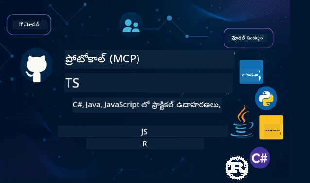

 

[](https://GitHub.com/microsoft/mcp-for-beginners/graphs/contributors)
[](https://GitHub.com/microsoft/mcp-for-beginners/issues)
[](https://GitHub.com/microsoft/mcp-for-beginners/pulls)
[](http://makeapullrequest.com)

[](https://GitHub.com/microsoft/mcp-for-beginners/watchers)
[](https://GitHub.com/microsoft/mcp-for-beginners/fork)
[](https://GitHub.com/microsoft/mcp-for-beginners/stargazers)


[](https://discord.gg/nTYy5BXMWG)

ఈ వనరులను ఉపయోగించడం ప్రారంభించడానికి ఈ దశలను అనుసరించండి:
1. **రెపొసిటరీని ఫోర్క్ చేయండి**: క్లిక్ చేయండి [](https://GitHub.com/microsoft/mcp-for-beginners/fork)
2. **రెపొసిటరీని క్లోన్ చేయండి**:   `git clone https://github.com/microsoft/mcp-for-beginners.git`
3. **లో కలవండి** [](https://discord.gg/nTYy5BXMWG)


### 🌐 బహుభాషా మద్దతు

#### GitHub యాక్షన్ ద్వారా మద్దతు (ఆటోమేటెడ్ & ఎప్పటికప్పుడు నవీకరణ)

<!-- CO-OP TRANSLATOR LANGUAGES TABLE START -->
[Arabic](../ar/README.md) | [Bengali](../bn/README.md) | [Bulgarian](../bg/README.md) | [Burmese (Myanmar)](../my/README.md) | [Chinese (Simplified)](../zh-CN/README.md) | [Chinese (Traditional, Hong Kong)](../zh-HK/README.md) | [Chinese (Traditional, Macau)](../zh-MO/README.md) | [Chinese (Traditional, Taiwan)](../zh-TW/README.md) | [Croatian](../hr/README.md) | [Czech](../cs/README.md) | [Danish](../da/README.md) | [Dutch](../nl/README.md) | [Estonian](../et/README.md) | [Finnish](../fi/README.md) | [French](../fr/README.md) | [German](../de/README.md) | [Greek](../el/README.md) | [Hebrew](../he/README.md) | [Hindi](../hi/README.md) | [Hungarian](../hu/README.md) | [Indonesian](../id/README.md) | [Italian](../it/README.md) | [Japanese](../ja/README.md) | [Kannada](../kn/README.md) | [Korean](../ko/README.md) | [Lithuanian](../lt/README.md) | [Malay](../ms/README.md) | [Malayalam](../ml/README.md) | [Marathi](../mr/README.md) | [Nepali](../ne/README.md) | [Nigerian Pidgin](../pcm/README.md) | [Norwegian](../no/README.md) | [Persian (Farsi)](../fa/README.md) | [Polish](../pl/README.md) | [Portuguese (Brazil)](../pt-BR/README.md) | [Portuguese (Portugal)](../pt-PT/README.md) | [Punjabi (Gurmukhi)](../pa/README.md) | [Romanian](../ro/README.md) | [Russian](../ru/README.md) | [Serbian (Cyrillic)](../sr/README.md) | [Slovak](../sk/README.md) | [Slovenian](../sl/README.md) | [Spanish](../es/README.md) | [Swahili](../sw/README.md) | [Swedish](../sv/README.md) | [Tagalog (Filipino)](../tl/README.md) | [Tamil](../ta/README.md) | [Telugu](./README.md) | [Thai](../th/README.md) | [Turkish](../tr/README.md) | [Ukrainian](../uk/README.md) | [Urdu](../ur/README.md) | [Vietnamese](../vi/README.md)

> **స్థానికంగా క్లోన్ చేయాలనుకుంటున్నారా?**
>
> ఈ రెపొసిటరీ 50+ భాషలు అనువాదాలను కలిగి ఉంటుంది, ఇది డౌన్లోడ్ పరిమాణాన్ని గణనీయంగా పెంచుతుంది. అనువాదాలు లేకుండా క్లోన్ చేయడానికి స్పార్స్ చెకౌట్‌ను ఉపయోగించండి:
>
> **Bash / macOS / Linux:**
> ```bash
> git clone --filter=blob:none --sparse https://github.com/microsoft/mcp-for-beginners.git
> cd mcp-for-beginners
> git sparse-checkout set --no-cone '/*' '!translations' '!translated_images'
> ```
>
> **CMD (Windows):**
> ```cmd
> git clone --filter=blob:none --sparse https://github.com/microsoft/mcp-for-beginners.git
> cd mcp-for-beginners
> git sparse-checkout set --no-cone "/*" "!translations" "!translated_images"
> ```
>
> ఇది కోర్సును పూర్తి చేసేందుకు అవసరమైన అన్ని కంటెంట్‌ను వేగంగా డౌన్లోడ్ చేసుకోవడానికి సహాయం చేస్తుంది.
<!-- CO-OP TRANSLATOR LANGUAGES TABLE END -->

# 🚀 మోడల్ కాంటెక్స్ట్ ప్రోటోకాల్ (MCP) ప్రాథమికులకి చటి అభ్యాసం

## **C#, Java, JavaScript, Rust, Python మరియు TypeScript లో వ్యవహరిం కోడ్ ఉదాహరణలతో MCP నేర్చుకోండి**

## 🧠 మోడల్ కాంటెక్స్ట్ ప్రోటోకాల్ కారిక్యులం అవలోకనం
నాకు మోడల్ కాంటెక్స్ట్ ప్రోటోకాల్ లో మీ ప్రయాణానికి స్వాగతం! మీరు ఎప్పుడైనా AI అనువర్తనాలు వివిధ సాధనాలు మరియు సేవలతో ఎలా సంభాషించుచున్నాయో ఆశ్చర్యపోతే, మీరు ఇప్పుడు అభివృద్ధిపరులు తెలివైన వ్యవస్థలను ఎలా నిర్మిస్తున్నారో మారుస్తున్న అందమైన పరిష్కారాన్ని కనుగొంటారు.

MCP ని AI అనువర్తనాల కోసం విశ్వవ్యాప్త అనువాదకంగా ఆలోచించండి - USB పోర్ట్లు మీ కంప్యూటర్‌కు ఏ ఉపకరణమైచినా కనెక్ట్ చేయడానికీ అవకాశం ఇస్తున్నట్లు, MCP AI మోడల్స్‌ను ఏ సాధన లేదా సేవకు ఒక స్టాండర్డైజ్డ్ విధానంలో కనెక్ట్ అయ్యేలా చేస్తుంది. మీరు మీ మొదటి చాట్‌బాట్‌ను నిర్మిస్తున్నట్లయితే లేదా క్లిష్టమైన AI వర్క్‌ఫ్లోలను రూపొందిస్తున్నట్లయితే, MCPని అర్థం చేసుకోవడం మీరు మరింత సామర్థ్యము గల మరియు అనువర్తనాలను సులభంగా సృష్టించడానికి శక్తిని ఇస్తుంది.

ఈ కారిక్యులం మీ అభ్యాస ప్రయాణానికి సహనం మరియు జాగ్రత్తతో రూపొందించబడి ఉంది. మనం మీరు ఇప్పటికే అర్థం చేసుకునే సులభమైన భావనలనుంచి మొదలుపెడతాము మరియు మీరు ఇష్టపడే ప్రోగ్రామింగ్ భాషలో చేతితో చేయడపు అభ్యాసం ద్వారా మీ నైపుణ్యాన్ని నెమ్మదిగా అభివృద్ధి చేస్తాము. ప్రతి దశలో స్పష్టమైన వివరణలు, ప్రాక్టికల్ ఉదాహరణలు మరియు గొప్ప ప్రోత్సాహం ఉంటాయి.

ఈ ప్రయాణం పూర్తయ్యే సమయానికి, మీరు మీ స్వంత MCP సర్వర్‌లను నిర్మించడానికి, వాటిని ప్రముఖ AI ప్లాట్‌ఫారమ్‌లతో సమీకరించడానికి మరియు ఈ సాంకేతికత AI అభివృద్ధి భవిష్యత్తును ఎలా మార్చేస్తుందో అర్థం చేసుకోవడానికి ధైర్యాన్ని పొందతారు. ఈ ఉత్తేజకరమైన అడ్వెంచర్‌ను కలిసి ప్రారంభిద్దాం!

### అధికారిక డాక్యుమెంటేషన్ మరియు స్పెసిఫికేషన్స్

ఈ కారిక్యులం **MCP స్పెసిఫికేషన్ 2025-11-25** (ఇప్పటి చివరి స్థిర విడుదల)కి అనుగుణంగా రూపొందించబడింది. MCP స్పెసిఫికేషన్ తేదీ ఆధారిత వెర్షనింగ్ (YYYY-MM-DD ఫార్మాట్లో) ఉపయోగించి స్పష్టమైన ప్రోటోకాల్ వెర్షన్ ట్రాకింగ్‌ను కల్పిస్తుంది.

మీ అవగాహన పెరుగుతుండగా ఈ వనరులు మరింత విలువైనవిగా మారతాయి, అయితే మీరు వెంటనే అన్ని విషయాలను చదవాల్సిన అవసరం లేదు. మీరు ఎక్కువగా ఆసక్తిని చూపే ప్రాంతాలతో మొదలుపెట్టండి!
- 📘 [MCP డాక్యుమెంటేషన్](https://modelcontextprotocol.io/) – ఇది దశలవారీ ట్యూటోరియల్స్ మరియు వినియోగదారు గైడ్‌ల కోసం మీ ప్రామాణిక వనరు. డాక్యుమెంటేషన్ ప్రారంభకులకు అనుగుణంగా రాయబడింది, మీరు మీ వేగంతో అనుసరించగల స్పష్టమైన ఉదాహరణలతో ఉంటుంది.
- 📜 [MCP స్పెసిఫికేషన్](https://modelcontextprotocol.io/specification/2025-11-25) – దీన్ని మీరు సమగ్ర సూచన పుస్తకంగా పరిగణించవచ్చు. కారిక్యులం ద్వారా మీరు పనిచేసేటప్పుడు మీరు నిర్దిష్ట వివరాలను చూసేందుకు మరియు అధునాతన ఫీచర్లను అన్వేషించేందుకు ఇక్కడకు తిరిగి వచ్చేవారు.
- 📜 [MCP స్పెసిఫికేషన్ వెర్షనింగ్](https://modelcontextprotocol.io/specification/versioning) – ఇది ప్రోటోకాల్ వెర్షన్ చరిత్ర గురించి మరియు MCP ఎలా తేదీ ఆధారిత వెర్షనింగ్ ఉపయోగిస్తుందో వివరాలు కలిగి ఉంటుంది (YYYY-MM-DD ఫార్మాట్లో).
- 🧑‍💻 [MCP GitHub రెపొసిటరీ](https://github.com/modelcontextprotocol) – మీరు ఇక్కడ SDKలు, టూల్స్ మరియు బహుభాషా ప్రోగ్రామింగ్ భాషలలో కోడ్ నమూనాలు కనుగొంటారు. ఇది ప్రాక్టికల్ ఉదాహరణలు మరియు ఉపయోగానికి సిద్ధమైన భాగాల ధనసంచయంలా ఉంటుంది.
- 🌐 [MCP కమ్యూనిటీ](https://github.com/orgs/modelcontextprotocol/discussions) – MCPపై Fellow Learners మరియు అనుభవజ్ఞులైన డెవలపర్లు చర్చలకు ఇందులో చేరండి. ఇది ప్రశ్నలకు స్వాగతం పలుకుతూ, జ్ఞానం భాగస్వామ్యం చేసే మద్దతుత ఇస్తున్న కమ్యూనిటీ.

## అభ్యాస లక్ష్యాలు

ఈ కారిక్యులం ముగింపు వరకు, మీరు మీ కొత్త నైపుణ్యాల పై ధైర్యంతో మరియు ఉత్సాహంతో ఉండిపోతారు. మీరు సాధించే విషయాలు ఇవి:

• **MCP బేసిక్స్ అర్థం చేసుకోండి**: మోడల్ కాంటెక్స్ట్ ప్రోటోకాల్ అంటే ఏమిటి, ఇది AI అనువర్తనాలు ఎలా కలిసి పనిచేస్తున్నాయో విప్లవాత్మకంగా మార్చుతున్నదని మీరు అర్థం చేసుకుంటారు, ఉదాహరణలతో మరియు తర్కపూర్వక వొదుకులతో.

• **మీ మొదటి MCP సర్వర్ నిర్మించండి**: మీరు ఇష్టపడే ప్రోగ్రామింగ్ భాషలో ఒక MCP సర్వర్‌ను సృష్టించడం నేర్చుకుంటారు, సులభమైన ఉదాహరణలతో మొదలుపెట్టి దశలవారీగా మీ నైపుణ్యాన్ని పెంచుకుంటారు.

• **AI మోడల్స్‌ను వాస్తవ సాధనాలకు కనెక్ట్ చేయండి**: AI మోడల్స్ మరియు వాస్తవ సేవల మధ్య ఉన్న ఖాళీని ఎలా అనుసంధానించడం నేర్చుకుంటారు, మీ అనువర్తనాలకు శక్తివంతమైన కొత్త శక్తులను అందిస్తారు.

• **భద్రత ఉత్తమ అమలులు చేయండి**: మీ MCP అమలు సురక్షితంగా ఉండేందుకు ఎలా పాటించాలో అర్థం చేసుకుంటారు, మీ అనువర్తనాలను మరియు వినియోగదారులను రక్షిస్తారు.

• **ఆత్మవిశ్వాసంతో డిప్లాయ్ చేయండి**: MCP ప్రాజెక్టులను అభివృద్ధి నుండి ఉత్పత్తి దశకు తీసుకువెళ్ళడానికి ప్రాక్టికల్ డిప్లాయ్‌మెంట్ వ్యూహాలను తెలుసుకుంటారు.

• **MCP కమ్యూనిటీలో చేరండి**: AI అనువర్తన అభివృద్ధి భవిష్యత్తును ఆకారీకరಿಸುತ್ತున్న అభివృద్ధి సంఘంలో ఒక భాగమవ్వండి.

## అవసరమైన నేపథ్యం

MCP వివరాలలోకి దిగేముందు, కొన్ని ప్రాథమిక భావనలు మీకు సరిగా అర్థమై ఉండాయని నిర్ధారించుకుందాం. మీరు ఈ అంశాలలో నిపుణులు కాకపోవచ్చు - మనం కావలసిన అన్ని విషయాలను మీకు వివరిస్తాం!

### ప్రోటోకాల్‌లు అర్థం చేసుకోవడం (ఆధారం)

ప్రోటోకాల్ అనేది సంభాషణ కోసం నియమాల సమాహారం అని ఆలోచించండి. మీరు ఎవరితోనైనా కాల్ చేసినప్పుడు, "హలో" అనుకోవడం, మాట్లాడటం మారుమారుగా జరపడం, ముగింపులో "గుడ్బై" అనుకోవడం తెలిసి ఉంటుంది. కంప్యూటర్ ప్రోగ్రామ్‌లు సమర్థవంతంగా సంభాషించేందుకు ఇలాంటి నియమాలు అవసరమవుతాయి.

MCP అనేది ఒక ప్రోటోకాల్ - AI మోడల్స్ మరియు అనువర్తనాలు సాధనాలు మరియు సేవలతో ఫలప్రదమైన "సంభాషణ" జరపడానికి అంగీకరించిన నియమాల సమాహారం. మనుషుల సంభాషణ నియమాలు ఉన్నదనే విధంగా MCP ఉన్నప్పుడు AI అనువర్తనాల కమ్యూనికేషన్ మరింత బలమైనది మరియు విశ్వసనీయమైనది అవుతుంది.

### క్లయింట్-సర్వర్ సంబంధాలు (ప్రోగ్రామ్లు ఎలా కలిసి పనిచేస్తాయో)

మీరు రోజూ క్లయింట్-సర్వర్ సంబంధాలను ఉపయోగిస్తున్నారు! మీరు వెబ్ బ్రౌజర్ (క్లయింట్) ఉపయోగించి ఒక వెబ్‌సైట్ సందర్శించినప్పుడు, మీరు పేజీ విషయాన్ని పంపే వెబ్ సర్వర్‌కు కనెక్ట్ అవుతుంటారు. బ్రౌజర్ సమాచారం కోరడం ఎలా చెప్పాలో తెలుసుకుంటుంది, సర్వర్ స్పందించడం ఎలా చెప్తుంది అర్థం చేసుకుంటుంది.

MCPలో కూడా దీన్ని పోలి ఒక సంబంధం ఉంటుంది: AI మోడల్స్ క్లయింట్లు లాగా సమాచారాన్ని లేదా చర్యలను కోరతారు, MCP సర్వర్‌లు ఆ సామర్థ్యాలను అందిస్తాయి. ఇది ఒక సహాయకుడు (సర్వర్) లాగా ఉంటుంది, AI వారికి నిర్దిష్ట పనులను చేయమని అడగవచ్చు.

### స్టాండర్డైజేషన్ ఎందుకు ముఖ్యం (విషయాలను కలిసి పని చేయించేలా చేయడం)

ప్రతి కారు తయారీదారు వేర్వేరు ఆకారపు ఇంధన పంప్‌లు వాడతే ఎలా ఉంటుంది అనుకుందాం - ప్రతి కారు కోసం వేరు అడాప్టర్ అవసరం! స్టాండర్డైజేషన్ అంటే సాధారణ విధానాలపై అంగీకరించడం, వాటితో కలిపి పని చేయడం సులభం అవుతుంది.

MCP ఇది AI అనువర్తనాల కోసం చేస్తుంది. ప్రతీ AI మోడల్ ప్రతి సాధనంతో పనిచేయడం కోసం కస్టమ్ కోడ్ అవసరం కాకుండా, MCP ఒక విశ్వవ్యాప్త మార్గం ఇస్తుంది. దీని వల్ల డెవలపర్లు ఒక్కసారి టూల్స్ నిర్మించి అనేక AI వ్యవస్థలతో పనిచేయగలుగుతారు.

## 🧭 మీ అభ్యాస మార్గం అవలోకనం

మీ MCP ప్రయాణం జాగ్రత్తగా నిర్మించబడింది, దీని ద్వారా మీరు నెమ్మదిగా ధైర్యం మరియు నైపుణ్యాలను పెంచుకోగలుగుతారు. ప్రతి దశ కొత్త భావనలను పరిచయం చేస్తూ గతంలో నేర్చుకున్న వాటిని పునరుద్ధరిస్తుంది.

### 🌱 ఆధార దశ: ప్రాథమికాలను అర్థం చేసుకోవడం (మాడ్యూల్ 0-2)

ఇక్కడే మీ సాహసం మొదలవుతుంది! మీరు ఇష్టపడిన ఉదాహరణలు మరియు సాధారణ వొదుకుల ద్వారా MCP భావనలను పరిచయం చేస్తాము. MCP ఏది, అది ఎందుకు ఉండేది, AI అభివృద్ది ప్రపంచంలో ఏ విధంగా సరిపోతుంది అని మీరు అర్థం చేసుకుంటారు.

• **మాడ్యూల్ 0 - MCPకి పరిచయం**: మేము MCP అంటే ఏమిటి మరియు ఇది ఆధునిక AI అనువర్తనాలకు ఎందుకు ముఖ్యమని మొదటిసారి పరిశీలిస్తాము. MCP లాంటి పనులను ఎలా సులభతరం చేస్తున్నదో మీరు నిజ ప్రపంచ ఉదాహరణల ద్వారా చూస్తారు.

• **మాడ్యూల్ 1 - ప్రధాన భావనలు వివరణ**: ఇక్కడ MCP యొక్క మూలభూత నిర్మాణాల గురించి నేర్పిస్తాము. ఈ భావనలను సహజంగా అర్థం చేసుకోడానికి చాలానే వొదుకులు మరియు కంటెంట్ ఉపయోగిస్తాము.

• **మాడ్యూల్ 2 - MCPలో భద్రత**: భద్రత కొంచెం భయంకరంగా అనిపించవచ్చు, కాని మేము MCP లో నిర్మిత భద్రతా లక్షణాలను చూపించి, ఆచరణలో రక్షణకి ఉత్తమ పద్ధతులు ఎలా పాటించాలో నేర్పిస్తాము.

### 🔨 నిర్మాణ దశ: మీ మొదటి అమలులు చేయడం (మాడ్యూల్ 3)

ఇప్పుడు నిజమైన సరదా మొదలవుతుంది! మీరు MCP సర్వర్‌లు మరియు క్లయింట్లు నిర్మించడంలో చేతితో చేయడపు అనుభవం పొందుతారు. భయపడకండి - మనం సులభంగా మొదలుపెట్టి ప్రతి దశలో మీకు మార్గనిర్దేశం చేస్తాము.
ఈ మాడ్యూల్‌లో మీరు మీ ఇష్టమైన ప్రోగ్రామింగ్ భాషలో పాటిస్తూ ప్రాక్టీస్ చేయగల మల్టిపుల్ హాండ్స్-ఆన్ గైడ్లు ఉన్నాయి. మీరు మీ మొదటి సర్వర్‌ను సృష్టించవచ్చు, దానికి కనెక్ట్ అవ్వడానికి క్లయింట్‌ను నిర్మించవచ్చు, అలాగే VS కోడ్ వంటి ప్రముఖ డెవలప్‌మెంట్ టూల్స్‌తో ఇంటిగ్రేట్ చేసుకోవచ్చు.

ప్రతి గైడ్ పూర్తి కోడ్ ఉదాహరణలు, సమస్యలు పరిష్కరించే సూచనలు మరియు మేము ప్రత్యేక డిజైన్ ఎంపికలు ఎందుకు చేస్తున్నామో వివరణలతో రూపొందించబడింది. ఈ దశ ముగింపు నాటికి, మీరు గర్వపడదగిన పనిచేసే MCP అమలులను కలిగి ఉండబోతున్నారు!

### 🚀 అభివృద్ధి దశ: ఆగమన స్థాయి కాన్సెప్ట్లు మరియు వాస్తవ ప్రపంచ అన్వయాలు (మాడ్యూల్స్ 4-5)

మూలసూత్రాలు నేర్చుకున్న తర్వాత, మీరు మరింత అభివృద్ధి చెందిన MCP లక్షణాలను అన్వేషించడానికి సిద్ధంగా ఉన్నారు. మేము ప్రాక్టికల్ అమలు వ్యూహాలు, డీబగ్గింగ్ సాంకేతికతలు మరియు మల్టీ-మోడల్ AI ఇంటిగ్రేషన్ల వంటి అధునాతన అంశాలను చర్చిస్తాము.

మీరు ప్రొడక్షన్ ఉపయోగానికి మీ MCP అమలులను స్కేలు చేయడం మరియు Azure వంటి క్లౌడ్ ప్లాట్‌ఫారమ్‌లతో ఇంటిగ్రేట్ కావడం కూడా నేర్చుకుంటారు. ఈ మాడ్యూల్స్ వాస్తవ ప్రపంచ అవసరాలను నిర్వహించగల MCP పరిష్కారాలను నిర్మించడానికి మీకు సహాయపడతాయి.

### 🌟 పరిణత దశ: కమ్యూనిటీ మరియు ప్రత్యేకత (మాడ్యూల్స్ 6-11)

చివరి దశ MCP కమ్యూనిటీకి చేరడం మరియు మీరు ఎక్కువగా ఆసక్తి కలిగిన ప్రాంతాలలో ప్రత్యేకత సాధించడంపై కేంద్రీకృతమైంది. మీరు ఓపెన్ సోర్స్ MCP ప్రాజెక్టులకు ఎలా సహకరించాలో, అధునాతన ధృవీకరణ నమూనాలను ఎలా అమర్చాలో మరియు సమగ్ర డేటాబేస్ ఇంటిగ్రేటెడ్ పరిష్కారాలను ఎలా నిర్మించాలో నేర్చుకుంటారు.

మాడ్యూల్ 11 ప్రత్యేక బహుమతి పొందింది - ఇది పూర్తి 13-ల్యాబ్స్ హాండ్స్-ఆన్ అభ్యాస మార్గం, ఇది PostgreSQL ఇంటిగ్రేషన్‌తో ప్రొడక్షన్-రెడి MCP సర్వర్‌లను ఎలా నిర్మించాలో బోధిస్తుంది. ఇది మీ అభ్యాసాన్ని కలిపి ఒక కాప్‌స్టోన్ ప్రాజెక్ట్ లాగే ఉంటుంది!

### 📚 పూర్తి పాఠ్యాంశ నిర్మాణం

| మాడ్యూల్ | విషయం | వివరణ | లింక్ |
|--------|-------|-------------|------|
| **మాడ్యూల్ 0-3: మూలసూత్రాలు** | | | |
| 00 | MCP పరిచయం | మోడల్ కాంటెక్స్ట్ ప్రోటోకాల్ మరియు అది AI పైప్‌లైన్లు లో ప్రాముఖ్యతకు అవగాహన | [ఇంకా చదవండి](./00-Introduction/README.md) |
| 01 | కోర్ కాన్సెప్ట్స్ వివరాలు | MCP కోర్ కాన్సెప్ట్స్ లో లోతైన అన్వేషణ | [ఇంకా చదవండి](./01-CoreConcepts/README.md) |
| 02 | MCP లో భద్రత | భద్రతా ముప్పులు మరియు ఉత్తమ పద్ధతులు | [ఇంకా చదవండి](./02-Security/README.md) |
| 03 | MCPతో ప్రారంభం | పరిసరాల సెట్ అప్, ప్రాథమిక సర్వర్లు/క్లయింట్లు, ఇంటిగ్రేషన్ | [ఇంకా చదవండి](./03-GettingStarted/README.md) |
| **మాడ్యూల్ 3: మీ మొదటి సర్వర్ & క్లయింట్ నిర్మాణం** | | | |
| 3.1 | మొదటి సర్వర్ | మీ మొదటి MCP సర్వర్ సృష్టించండి | [గైడ్](./03-GettingStarted/01-first-server/README.md) |
| 3.2 | మొదటి క్లయింట్ | ప్రాథమిక MCP క్లయింట్ అభివృద్ధి చేయండి | [గైడ్](./03-GettingStarted/02-client/README.md) |
| 3.3 | LLMతో క్లయింట్ | పెద్ద భాషా మోడల్స్‌తో ఇంటిగ్రేట్ చేయండి | [గైడ్](./03-GettingStarted/03-llm-client/README.md) |
| 3.4 | VS కోడ్ ఇంటిగ్రేషన్ | VS కోడ్‌లో MCP సర్వర్‌లను వినియోగించండి | [గైడ్](./03-GettingStarted/04-vscode/README.md) |
| 3.5 | stdio సర్వర్ | stdio ట్రాన్స్‌పోర్ట్ ఉపయోగించి సర్వర్‌లు సృష్టించండి | [గైడ్](./03-GettingStarted/05-stdio-server/README.md) |
| 3.6 | HTTP స్ట్రీమింగ్ | MCPలో HTTP స్ట్రీమింగ్ అమలు చేయండి | [గైడ్](./03-GettingStarted/06-http-streaming/README.md) |
| 3.7 | AI టూల్‌కిట్ | MCPతో AI టూల్‌కిట్ ఉపయోగించండి | [గైడ్](./03-GettingStarted/07-aitk/README.md) |
| 3.8 | టెస్టింగ్ | మీ MCP సర్వర్ అమలును పరీక్షించండి | [గైడ్](./03-GettingStarted/08-testing/README.md) |
| 3.9 | డిప్లాయ్‌మెంట్ | MCP సర్వర్‌లను ప్రొడక్షన్‌కి డిప్లాయం చేయండి | [గైడ్](./03-GettingStarted/09-deployment/README.md) |
| 3.10 | అభివృద్ధి చేసిన సర్వర్ వినియోగం | అధునాతన ఫీచర్ వినియోగం మరియు మెరుగుపరచబడిన ఆర్కిటెక్చర్ కోసం అభివృద్ధి చేసిన సర్వర్‌లను ఉపయోగించండి | [గైడ్](./03-GettingStarted/10-advanced/README.md) |
| 3.11 | సులభమైన ధృవీకరణ | ప్రారంభ దశ నుండి ధృవీకరణ మరియు RBAC చూపే అధ్యాయం | [గైడ్](./03-GettingStarted/11-simple-auth/README.md) |
| 3.12 | MCP హోస్ట్‌లు | Claude Desktop, Cursor, Cline మరియు ఇతర MCP హోస్ట్‌లను కాన్ఫిగర్ చేయండి | [గైడ్](./03-GettingStarted/12-mcp-hosts/README.md) |
| 3.13 | MCP ఇన్‌స్పెక్టర్ | ఇన్‌స్పెక్టర్ టూల్‌తో MCP సర్వర్‌ల‌ను డీబగ్ చేసి పరీక్షించండి | [గైడ్](./03-GettingStarted/13-mcp-inspector/README.md) |
| 3.14 | శాంప్లింగ్ | క్లయింట్‌తో సహకరించడానికి శాంప్లింగ్ ఉపయోగించండి | [గైడ్](./03-GettingStarted/14-sampling/README.md) |
| 3.15 | MCP యాప్స్ | MCP యాప్స్ రూపొందించండి | [గైడ్](./03-GettingStarted/15-mcp-apps/README.md) |
| **మాడ్యూల్ 4-5: ప్రాక్టికల్ & అధునాతన** | | | |
| 04 | ప్రాక్టికల్ అమలు | SDKలు, డీబగ్గింగ్, టెస్టింగ్, పునర్వినియోగ ప్రాంప్ట్ టెంప్లేట్లు | [ఇంకా చదవండి](./04-PracticalImplementation/README.md) |
| 4.1 | పేజినేషన్ | కర్సర్ ఆధారిత పేజినేషన్‌తో పెద్ద ఫలిత సెట్‌లను నిర్వహించండి | [గైడ్](./04-PracticalImplementation/pagination/README.md) |
| 05 | MCPలో అధునాతన అంశాలు | మల్టీ మోడల్ AI, స్కేలింగ్, ఎంటర్ప్రైజ్ ఉపయోగం | [ఇంకా చదవండి](./05-AdvancedTopics/README.md) |
| 5.1 | Azure ఇంటిగ్రేషన్ | MCP-ని Azureతో ఇంటిగ్రేట్ చేయడం | [గైడ్](./05-AdvancedTopics/mcp-integration/README.md) |
| 5.2 | మల్టీ-మోడాలిటీ | బహుముఖ్య విభాగాలతో పని చేయడం | [గైడ్](./05-AdvancedTopics/mcp-multi-modality/README.md) |
| 5.3 | OAuth2 డెమో | OAuth2 ధృవీకరణను అమలు చేయండి | [గైడ్](./05-AdvancedTopics/mcp-oauth2-demo/README.md) |
| 5.4 | రూట్ కాంటెక్స్ట్ | రూట్ కాంటెక్స్ట్‌లను అర్థం చేసుకోండి మరియు అమలు చేయండి | [గైడ్](./05-AdvancedTopics/mcp-root-contexts/README.md) |
| 5.5 | రూటింగ్ | MCP రూటింగ్ వ్యూహాలు | [గైడ్](./05-AdvancedTopics/mcp-routing/README.md) |
| 5.6 | శాంప్లింగ్ | MCPలో శాంప్లింగ్ సాంకేతికతలు | [గైడ్](./05-AdvancedTopics/mcp-sampling/README.md) |
| 5.7 | స్కేలింగ్ | MCP అమలులను స్కేలు చేయండి | [గైడ్](./05-AdvancedTopics/mcp-scaling/README.md) |
| 5.8 | భద్రత | అధునాతన భద్రతా పరిశీలనలు | [గైడ్](./05-AdvancedTopics/mcp-security/README.md) |
| 5.9 | వెబ్ సెర్చ్ | వెబ్ సెర్చ్ సామర్థ్యాలను అమలు చేయండి | [గైడ్](./05-AdvancedTopics/web-search-mcp/README.md) |
| 5.10 | రియాల్టైమ్ స్ట్రీమింగ్ | రియాల్టైమ్ స్ట్రీమింగ్ ఫంక్షనాలిటీని నిర్మించండి | [గైడ్](./05-AdvancedTopics/mcp-realtimestreaming/README.md) |
| 5.11 | రియాల్టైమ్ సెర్చ్ | రియాల్టైమ్ సెర్చ్‌ను అమలు చేయండి | [గైడ్](./05-AdvancedTopics/mcp-realtimesearch/README.md) |
| 5.12 | ఎంట్రా ID ఆథ్ | Microsoft Entra ID తో ధృవీకరణ | [గైడ్](./05-AdvancedTopics/mcp-security-entra/README.md) |
| 5.13 | ఫౌండ్రి ఇంటిగ్రేషన్ | Azure AI Foundryతో ఇంటిగ్రేట్ చేయండి | [గైడ్](./05-AdvancedTopics/mcp-foundry-agent-integration/README.md) |
| 5.14 | కాంటెక్స్ట్ ఇంజనీరింగ్ | ప్రభావవంతమైన కాంటెక్స్ట్ ఇంజనీరింగ్ సాంకేతికతలు | [గైడ్](./05-AdvancedTopics/mcp-contextengineering/README.md) |
| 5.15 | MCP కస్టమ్ ట్రాన్స్‌పోర్ట్ | కస్టమ్ ట్రాన్స్‌పోర్ట్ అమలులు | [గైడ్](./05-AdvancedTopics/mcp-transport/README.md) |
| 5.16 | ప్రోటోకాల్ ఫీచర్స్ | ప్రోగ్రెస్ నోటిఫికేషన్స్, రద్దు, రిసోర్స్ టెంప్లేట్లు | [గైడ్](./05-AdvancedTopics/mcp-protocol-features/README.md) |
| **మాడ్యూల్ 6-10: కమ్యూనిటీ & ఉత్తమ పద్ధతులు** | | | |
| 06 | కమ్యూనిటీ కాంట్రిబ్యూషన్స్ | MCP ఇకోసिस्टम్లో సహకారం ఎలా ఇవ్వాలో | [గైడ్](./06-CommunityContributions/README.md) |
| 07 | ఆర్జన మొదటి అనుభవాల నుండి అవగాహనలు | వాస్తవ ప్రపంచ అమలు కథనాలు | [గైడ్](./07-LessonsfromEarlyAdoption/README.md) |
| 08 | MCPకు ఉత్తమ పద్ధతులు | పనితీరు, ఫాల్ట్-టాలరెన్స్, రెసిలియన్స్ | [గైడ్](./08-BestPractices/README.md) |
| 09 | MCP కేస్ స్టడీస్ | ప్రాక్టికల్ అమలు ఉదాహరణలు | [గైడ్](./09-CaseStudy/README.md) |
| 10 | హాండ్స్-ఆన్ వర్క్‌షాప్ | AI టూల్‌కిట్‌తో MCP సర్వర్ నిర్మాణం | [ల్యాబ్](./10-StreamliningAIWorkflowsBuildingAnMCPServerWithAIToolkit/README.md) |
| **మాడ్యూల్ 11: MCP సర్వర్ హాండ్స్ ఆన్ ల్యాబ్** | | | |
| 11 | MCP సర్వర్ డేటాబేస్ ఇంటిగ్రేషన్ | PostgreSQL ఇంటిగ్రేషన్ కోసం సమగ్ర 13-ల్యాబ్ హాండ్స్-ఆన్ అభ్యాస మార్గం | [ల్యాబ్స్](./11-MCPServerHandsOnLabs/README.md) |
| 11.1 | పరిచయం | డేటాబేస్ ఇంటిగ్రేషన్ మరియు రిటైల్ అనలిటిక్స్ వినియోగకేసు సహ MCP అవగాహన | [ల్యాబ్ 00](./11-MCPServerHandsOnLabs/00-Introduction/README.md) |
| 11.2 | కోర్ ఆర్కిటెక్చర్ | MCP సర్వర్ ఆర్కిటెక్చర్, డేటాబేస్ లేయర్లు, భద్రతా నమూనాలు అర్థం చేసుకోవడం | [ల్యాబ్ 01](./11-MCPServerHandsOnLabs/01-Architecture/README.md) |
| 11.3 | భద్రత & మల్టీ-టెనన్సీ | రో లెవెల్ భద్రత, ధృవీకరణ, మల్టీ-టెనెంట్ డేటా యాక్సెస్ | [ల్యాబ్ 02](./11-MCPServerHandsOnLabs/02-Security/README.md) |
| 11.4 | పరిసరాల అమరిక | డెవలప్‌మెంట్ పరిసరాల ఏర్పాట్లు, Docker, Azure వనరులు | [ల్యాబ్ 03](./11-MCPServerHandsOnLabs/03-Setup/README.md) |
| 11.5 | డేటాబేస్ డిజైన్ | PostgreSQL సెటప్, రిటైల్ స్కీమా డిజైన్, మరియు నమూనా డేటా | [ల్యాబ్ 04](./11-MCPServerHandsOnLabs/04-Database/README.md) |
| 11.6 | MCP సర్వర్ అమలు | డేటాబేస్ ఇంటిగ్రేషన్‌తో FastMCP సర్వర్ నిర్మాణం | [ల్యాబ్ 05](./11-MCPServerHandsOnLabs/05-MCP-Server/README.md) |
| 11.7 | సాధన అభివృద్ధి | డేటాబేస్ క్వెరీ సాధనాలు మరియు స్కీమా ఇన్‌ట్రోస్పెక్షన్ సృష్టించడం | [ల్యాబ్ 06](./11-MCPServerHandsOnLabs/06-Tools/README.md) |
| 11.8 | సేమాంటిక్ సెర్చ్ | Azure OpenAI మరియు pgvector ఉపయోగించి వెక్టర్ ఎంబెడ్డింగ్స్ అమలు | [ల్యాబ్ 07](./11-MCPServerHandsOnLabs/07-Semantic-Search/README.md) |
| 11.9 | టెస్టింగ్ & డీబగ్గింగ్ | టెస్టింగ్ వ్యూహాలు, డీబగ్గింగ్ సాధనాలు, మరియు నిర్ధారణ విధానాలు | [ల్యాబ్ 08](./11-MCPServerHandsOnLabs/08-Testing/README.md) |
| 11.10 | VS కోడ్ ఇంటిగ్రేషన్ | VS కోడ్ MCP ఇంటిగ్రేషన్ మరియు AI చాట్ వినియోగం కాన్ఫిగర్ చేయడం | [ల్యాబ్ 09](./11-MCPServerHandsOnLabs/09-VS-Code/README.md) |
| 11.11 | డిప్లాయ్‌మెంట్ వ్యూహాలు | Docker డిప్లాయ్‌మెంట్, Azure కంటైనర్ యాప్స్, మరియు స్కేలింగ్ పరిశీలనలు | [ల్యాబ్ 10](./11-MCPServerHandsOnLabs/10-Deployment/README.md) |
| 11.12 | మానిటరింగ్ | అప్లికేషన్ ఇన్సైట్స్, లాగింగ్, పనితీరు మానిటరింగ్ | [ల్యాబ్ 11](./11-MCPServerHandsOnLabs/11-Monitoring/README.md) |
| 11.13 | ఉత్తమ పద్ధతులు | పనితీరు ఆప్టిమైజేషన్, భద్రత హార్డెనింగ్, మరియు ప్రొడక్షన్ సూచనలు | [ల్యాబ్ 12](./11-MCPServerHandsOnLabs/12-Best-Practices/README.md) |

### 💻 నమూనా కోడ్ ప్రాజెక్ట్లు

MCP నేర్చుకోవడంలో ఉత్సాహజనకమైన భాగాలలో ఒకటి మీ కోడ్ నైపుణ్యాలు క్రమంగా అభివృద్ధి చెందుతున్నాయని చూడడం. మేము మా కోడ్ ఉదాహరణలను సులభంగా ప్రారంభించి మీ అవగాహన పెరుగుతున్న కొద్ది మరింత వేగవంతమైనవిగా రూపకల్పన చేశాము. ఇక్కడ మేము కాన్సెప్ట్లను పరిచయం చేస్తున్న విధానం ఉంది - అర్థంకావడం సులభమైన కానీ వాస్తవ MCP తత్త్వాలను ప్రదర్శించే కోడ్‌తో, మీరు ఈ కోడ్ ఏమి చేస్తుందో మాత్రమే కాదు, దీనిని ఇలాక్యా నిర్మించారో మరియు ఇది పెద్ద MCP అనువర్తనాలలో ఎలా సరిపోతుందో కూడా అర్థంమవుతుంది.

#### ప్రాథమిక MCP క్యాల్క్యులేటర్ నమూనాలు

| భాష | వివరణ | లింక్ |
|----------|-------------|------|
| C# | MCP సర్వర్ ఉదాహరణ | [కోడ్ వీక్షించండి](./03-GettingStarted/samples/csharp/README.md) |
| Java | MCP క్యాల్క్యులేటర్ | [కోడ్ వీక్షించండి](./03-GettingStarted/samples/java/calculator/README.md) |
| JavaScript | MCP డెమో | [కోడ్ వీక్షించండి](./03-GettingStarted/samples/javascript/README.md) |
| Python | MCP సర్వర్ | [కోడ్ వీక్షించండి](../../03-GettingStarted/samples/python/mcp_calculator_server.py) |
| TypeScript | MCP ఉదాహరణ | [కోడ్ వీక్షించండి](./03-GettingStarted/samples/typescript/README.md) |
| Rust | MCP ఉదాహరణ | [కోడ్ వీక్షించండి](./03-GettingStarted/samples/rust/README.md) |

#### అధునాతన MCP అమలులు

| భాష | వివరణ | లింక్ |
|----------|-------------|------|
| C# | అధునాతన నమూనా | [కోడ్ వీక్షించండి](./04-PracticalImplementation/samples/csharp/README.md) |
| Java with Spring | కంటైనర్ యాప్ ఉదాహరణ | [కోడ్ వీక్షించండి](./04-PracticalImplementation/samples/java/containerapp/README.md) |
| JavaScript | అధునాతన నమూనా | [కోడ్ వీక్షించండి](./04-PracticalImplementation/samples/javascript/README.md) |
| Python | సంక్లిష్ట అమలు | [కోడ్ వీక్షించండి](./04-PracticalImplementation/samples/python/README.md) |
| TypeScript | కంటైనర్ నమూనా | [కోడ్ వీక్షించండి](./04-PracticalImplementation/samples/typescript/README.md) |


## 🎯 MCP నేర్చుకోవడానికి అగ్రిములు

ఇది ఈ పాఠ్యాంశాన్ని అర్థం చేసుకుని ఉత్తమ ఉపయోగాన్ని పొందడానికి, మీరు కలిగి ఉండేలాంటివి:
- కనీసం ఈ క్రింది భాషలలో ఒకటిలో ప్రోగ్రామింగ్ యొక్క ప్రాథమిక జ్ఞానం: C#, జావా, జావాస్క్రిప్ట్, పైథాన్, లేదా టైప్‌స్క్రిప్ట్  
- క్లయింట్-సెర్వర్ మోడల్ మరియు APIs యొక్క అవగాహన  
- REST మరియు HTTP సూత్రాలతో పరిచయం  
- (ఆప్షనల్) AI/ML సూత్రాలలో నేపథ్యం  

- మద్దతుకు మా కమ్యూనిటీ చర్చల్లో చేరడం  

## 📚 అధ్యయన గైడ్ & వనరులు  

ఈ రిపోజిటరీలో మీరు సులభంగా నావిగేట్ చేసుకునేందుకు మరియు సమర్థవంతంగా నేర్చుకునేందుకు అనేక వనరులు ఉన్నాయి:  

### అధ్యయన గైడ్  

మీకు ఈ రిపోజిటరీని సమర్థవంతంగా నావిగేట్ చేసుకునేందుకు విస్తృతమైన [అధ్యయన గైడ్](./study_guide.md) అందుబాటులో ఉంది. ఈ విజువల్ కారిక్యులం మ్యాప్ అన్ని అంశాలు ఎలా ఒకదానికి ఒకటి అనుసంధానమయ్యాయో చూపిస్తుంది మరియు సాంపిల్ ప్రాజెక్టులను ఎలా ఉపయోగించుకోవాలో మార్గదర్శకాన్ని ఇస్తుంది. మీరు పెద్ద సారాంశాన్ని చూడాలనుకుంటున్న విజువల్ అభ్యాసకుడు అయితే ఇది చాలా సహాయకారిగా ఉంటుంది.  

ఈ గైడ్‌లో ఉన్నాయి:  
- అన్ని కవర్ చేసిన అంశాలను చూపించే విజువల్ కారిక్యులం మ్యాప్  
- ప్రతి రిపోజిటరీ విభాగానికి వివరణాత్మక విభజన  
- సాంపిల్ ప్రాజెక్టులను ఎలా ఉపయోగించుకోవాలో మార్గనిర్దేశం  
- వివిధ నైపుణ్య స్థాయిలకు అనుకూలంగా నేర్చుకునే మార్గాలు  
- మీ అభ్యాస యాత్రను పూర్తిచేసేందుకు అదనపు వనరులు  

### మార్పుల రికార్డు  

మేము వివిధ సిలబస్ మెటీరియల్స్‌లో జరిగిన ముఖ్యమైన నవీకరణలను ట్రాక్ చేసే ఒక వివరణాత్మక [మార్పుల రికార్డు](./changelog.md) నిర్వహిస్తున్నాము, తద్వారా మీరు తాజా మార్పులు మరియు అదనాలను తెలుసుకుని ఉండవచ్చు.  
- కొత్త విషయాలు చేర్పులు  
- నిర్మాణ పరమైన మార్పులు  
- ఫీచర్ మెరుగుదలలు  
- డాక్యుమెంటేషన్ నవీకరణలు  

## 🛠️ ఈ కారిక్యులం సమర్థవంతంగా ఎలా ఉపయోగించుకోవాలి  

ఈ గైడ్‌లో ప్రతి పాఠం కింది అంశాలు ఉంటాయి:  

1. MCP సూత్రాల స్పష్టమైన వివరణలు  
2. బహుళ భాషల్లో ప్రత్యక్ష కోడ్ ఉదాహరణలు  
3. నిజమైన MCP అనువర్తనాలను నిర్మించేందుకు వ్యాయామాలు  
4. ప్రేరణ కోసం అదనపు వనరులు  

### C# తో MCP నేర్చుకుందాం - ట్యుటోరియల్ సిరీస్  
మోడల్ కాంటెక్స్ట్ ప్రోటోకాల్ (MCP) గురించి నేర్చుకోండి, ఇది AI మోడల్స్ మరియు క్లయింట్ అనువర్తనాల మధ్య సంభాషణలను సాందర్భాలుగా నిలబెడుతుంది. ఈ ప్రారంభదశలో, MCP ని పరిచయం చేసి, మీ మొదటి MCP సర్వర్ సృష్టించడానికి దారిచూపుతాము.  
#### C#: [https://aka.ms/letslearnmcp-csharp](https://aka.ms/letslearnmcp-csharp)  
#### Java: [https://aka.ms/letslearnmcp-java](https://aka.ms/letslearnmcp-java)  
#### JavaScript: [https://aka.ms/letslearnmcp-javascript](https://aka.ms/letslearnmcp-javascript)  
#### Python: [https://aka.ms/letslearnmcp-python](https://aka.ms/letslearnmcp-python)  

## 🎓 మీ MCP ప్రయాణం ప్రారంభమవుతుంది  

అభినందనలు! మీరు ప్రోగ్రామింగ్ సామర్ధ్యాలను విస్తరించుకుని, AI అభివృద్ధి యొక్క ఆధునిక కోణంతో కలసి పనిచేసే ఒక ఆసక్తిదాయకమైన ప్రయాణంలో తొలి అడుగు వేయించారు.  

### మీరు ఇప్పటివరకు సాధించిన దాంట్లో  

ఈ పరిచయాన్ని చదవడం ద్వారా మీరు MCP పరిజ్ఞానానికి మౌలిక స్థాపన ఏర్పరిచారు. MCP అంటే ఏమిటి, ఇది ఎందుకు ముఖ్యమైంది, మరియు ఈ కారిక్యులం మీ నేర్చుకునే యాత్రను ఎలా మద్దతిస్తుంది అన్న విషయం మీరు అర్థం చేసుకున్నారు. ఇది ఒక గొప్ప ప్రాప్తి మరియు ఈ ముఖ్య సాంకేతిక పరిజ్ఞానంలో మీ నైపుణ్యాల ప్రారంభం.  

### ముందు ఉన్న సాహసం  

మీరు మాడ్యూల్స్‌ను కొనసాగించేటప్పుడు, ప్రతి నిపుణుడు ఒకప్పుడు మొదటి సారి ప్రారంభించారని గుర్తుంచుకోండి. ఇప్పుడు కఠినంగా కనిపించే భావనలు ప్రాక్టీస్ చేయడం ద్వారా మీకు సహజమవుతాయి. ప్రతి చిన్న అడుగు మీ అభివృద్ధి కెరీర్ మొత్తం ఉపయోగపడే శక్తివంతమైన సామర్ధ్యాలకు దారితీస్తుంది.  

### మీ మద్దతు నెట్‌వర్క్  

మీరు MCP పట్ల అభిరుచిగల అభ్యాసకులు మరియు నిపుణుల సమూహంలో చేరుతున్నారు, వీరు ఇతరులను విజయం సాధించడానికి సహాయం చేయడానికి సిద్ధంగా ఉన్నారు. మీరు కోడింగ్ సవాలులో చిక్కుకున్నా, ఒక సరికొత్త జ్ఞానం పంచుకోవాలని ఉత్సాహం ఉన్నా, సమాజం మీ ప్రయాణంలో మద్దతుగా ఉంటుంది.  

మీరు చిక్కుకున్నా లేదా AI అనువర్తనాలు రూపొందించడంపై ఏవైనా ప్రశ్నలు ఉంటే, MCP పట్ల అభ్యాసకులు మరియు అనుభవజ్ఞులచే జరుగుతున్న చర్చల్లో చేరండి. ఇది ప్రశ్నలకు స్వాగతం పలిచే మరియు జ్ఞానం ఉచితంగా పంచుకునే సహాయక సమాజం.  

[](https://discord.gg/nTYy5BXMWG)  

ఉత్పత్తి అభిప్రాయం లేదా బిల్డ్ లో తప్పులు ఉంటే సందర్శించండి:  

[](https://aka.ms/foundry/forum)  

### ప్రారంభించడానికి సిద్దమయ్యారా?  

మీ MCP సాహసం ఇప్పుడే ప్రారంభమవుతుంది! మొదటి MCP అనుభవాలను డైవ్ చేసేందుకు మాడ్యూల్ 0 తో మొదలు పెట్టండి, లేదా మీరు ఏమి నిర్మించబోతున్నారో చూడటానికి సాంపిల్ ప్రాజెక్టులను అన్వేషించండి. ప్రతి నిపుణుడు మీరు ఉన్న స్థలంలోనే మొదలుపెట్టారని గుర్తుంచుకోండి, మరియు ఓర్పు మరియు ప్రాక్టీస్ తో మీరు ఆశ్చర్యపోతారు.  

మోడల్ కాంటెక్స్ట్ ప్రోటోకాల్ అభివృద్ధి ప్రపంచానికి స్వాగతం. మనం కలిసి కొన్ని అద్భుతమైన విషయాలు రూపొందしましょう!  

## 🤝 అభ్యాస కమ్యూనిటీలో సహకారం  

ఈ కారిక్యులం మీరు వంటి అభ్యాసకుల సహకారంతో మరింత బలపడుతుంది! మీరు తప్పులను సరిచేయటానికైనా, స్పష్టమైన వివరణ ప్రతిపాదించటానికైనా లేదా కొత్త ఉదాహరణలను చేర్చటానికైనా, మీ సహకారం ఇతర ప్రారంభకులకు విజయం సాధించటానికి సహాయపడుతుంది.  

కోడ్ సాంపిల్స్ అందించిన Microsoft విలువైన ప్రొఫెషనల్ [శివం గోయల్](https://www.linkedin.com/in/shivam2003/) కి ధన్యవాదాలు.  

సహకార ప్రక్రియ ఆహ్లాదకరంగా మరియు మద్దతుగా ఉండేలా రూపొందించబడింది. చాలా సహకారాలు Contributor License Agreement (CLA) అవసరమవుతుంది, కాని ఆటోమేటెడ్ టూల్స్ ఈ ప్రక్రియను సులభతరం చేస్తాయి.  

## 📜 ఓపెన్ సోర్స్ అభ్యాసం  

ఈ పూర్తి కారిక్యులం MIT [LICENSE](../../LICENSE) కింద అందుబాటులో ఉంది, అంటే మీరు దీన్ని స్వేచ్ఛగా ఉపయోగించవచ్చు, మార్చవచ్చు మరియు పంచుకోవచ్చు. ఇది MCP పరిజ్ఞానాన్ని అన్ని అభివృద్ధికర్తలపట్ల అందుబాటులో ఉంచేందుకు మా లక్ష్యాన్ని మద్దతు ఇస్తుంది.  
## 🤝 సహకార మార్గదర్శకాలు  

ఈ ప్రాజెక్ట్ సహకారాలు మరియు సూచనలను స్వాగతిస్తుంది. చాలా సహకారాలకు మీరు Contributor License Agreement (CLA) ని అంగీకరించడం అవసరం, ఇది మీరు మీ సహకారాన్ని ఉపయోగించుకోవడానికి, మరియు మాకు అర్థం పెట్టివ్వగలిగిన హక్కులు కలిగి ఉన్నారని ప్రకటిస్తుంది. వివరాలకు <https://cla.opensource.microsoft.com> సందర్శించండి.  

మీరు పుల్ రిక్వెస్ట్ సమర్పించినప్పుడు, CLA బాట్ CLA అవసరమో కాదో స్వయంచాలకంగా నిర్ణయించి PR పై సరిగ్గా చిహ్నాలు (ఉదా: స్థితి తనిఖీ, వ్యాఖ్య) జత చేస్తుంది. బాట్ ఇచ్చే సూచనలను పాటించండి. మీరు మా CLA ఉపయోగించే అన్ని రిపోజిటరీలలో ఇది ఒక్కసారి మాత్రమే చేయాలి.  

ఈ ప్రాజెక్ట్ [Microsoft ఓపెన్ సోర్స్ కోడ్ ఆఫ్ కండక్టు](https://opensource.microsoft.com/codeofconduct/)ని అనుసరిస్తుంది.  
అతిరేకింత సమాచారానికి [Code of Conduct FAQ](https://opensource.microsoft.com/codeofconduct/faq/) చూడండి లేదా [opencode@microsoft.com](mailto:opencode@microsoft.com) కు ఏవైనా ఇతర ప్రశ్నలు లేదా వ్యాఖ్యలతో సంప్రదించండి.  

---

*మీ MCP ప్రయాణాన్ని ప్రారంభించడానికి సిద్ధమా? [Module 00 - MCP పరిచయం](./00-Introduction/README.md) తో ప్రారంభించి, మోడల్ కాంటెక్స్ట్ ప్రోటోకాల్ అభివృద్ధి ప్రపంచంలో మీ తొలి అడుగులు వేయండి!*  


## 🎒 ఇతర కోర్సులు  
మా బృందం ఇతర కోర్సులను తయారుచేస్తోంది! చూడండి:  

<!-- CO-OP TRANSLATOR OTHER COURSES START -->  
### LangChain  
[](https://aka.ms/langchain4j-for-beginners)  
[](https://aka.ms/langchainjs-for-beginners?WT.mc_id=m365-94501-dwahlin)  
[](https://github.com/microsoft/langchain-for-beginners?WT.mc_id=m365-94501-dwahlin)  
---  

### Azure / Edge / MCP / Agents  
[](https://github.com/microsoft/AZD-for-beginners?WT.mc_id=academic-105485-koreyst)  
[](https://github.com/microsoft/edgeai-for-beginners?WT.mc_id=academic-105485-koreyst)  
[](https://github.com/microsoft/mcp-for-beginners?WT.mc_id=academic-105485-koreyst)  
[](https://github.com/microsoft/ai-agents-for-beginners?WT.mc_id=academic-105485-koreyst)  

---  
 
### జనరేటివ్ AI సిరీస్  
[](https://github.com/microsoft/generative-ai-for-beginners?WT.mc_id=academic-105485-koreyst)  
[-9333EA?style=for-the-badge&labelColor=E5E7EB&color=9333EA)](https://github.com/microsoft/Generative-AI-for-beginners-dotnet?WT.mc_id=academic-105485-koreyst)  
[-C084FC?style=for-the-badge&labelColor=E5E7EB&color=C084FC)](https://github.com/microsoft/generative-ai-for-beginners-java?WT.mc_id=academic-105485-koreyst)  
[-E879F9?style=for-the-badge&labelColor=E5E7EB&color=E879F9)](https://github.com/microsoft/generative-ai-with-javascript?WT.mc_id=academic-105485-koreyst)  

---  
 
### ప్రాథమిక అభ్యాసం  
[](https://aka.ms/ml-beginners?WT.mc_id=academic-105485-koreyst)  
[](https://aka.ms/datascience-beginners?WT.mc_id=academic-105485-koreyst)  
[](https://aka.ms/ai-beginners?WT.mc_id=academic-105485-koreyst)  
[](https://github.com/microsoft/Security-101?WT.mc_id=academic-96948-sayoung)  
[](https://aka.ms/webdev-beginners?WT.mc_id=academic-105485-koreyst)  
[](https://aka.ms/iot-beginners?WT.mc_id=academic-105485-koreyst)  
[](https://github.com/microsoft/xr-development-for-beginners?WT.mc_id=academic-105485-koreyst)  

---  
 
### కోపైలట్ సిరీస్  

[](https://aka.ms/GitHubCopilotAI?WT.mc_id=academic-105485-koreyst)
[](https://github.com/microsoft/mastering-github-copilot-for-dotnet-csharp-developers?WT.mc_id=academic-105485-koreyst)
[](https://github.com/microsoft/CopilotAdventures?WT.mc_id=academic-105485-koreyst)
<!-- CO-OP TRANSLATOR OTHER COURSES END -->

---

<!-- CO-OP TRANSLATOR DISCLAIMER START -->
**డిస్క్లెయిమర్**:  
ఈ పత్రాన్ని AI అనువాద సేవ [Co-op Translator](https://github.com/Azure/co-op-translator) ఉపయోగించి అనువదించబడింది. మేము కొంతమేర ఖచ్చితత్వానికి ప్రయత్నిస్తున్నప్పటికీ, ఆటోమేటెడ్ అనువాదాలలో పొరపాట్లు లేదా అసత్యతలు ఉండవచ్చు అని దయచేసి గమనించండి. మాతృభాషలో ఉన్న అసలు పత్రం అధికారిక మూలంగా తీసుకోవాలి. ముఖ్యమైన సమాచారానికి, వృత్తిపరమైన మానవ అనువాదం సూచించబడుతుంది. ఈ అనువాదం వలన ఏవైనా అవగాహన లోపాలు లేదా తప్పు భావాలకు మేము బాధ్యత వహించము.
<!-- CO-OP TRANSLATOR DISCLAIMER END -->