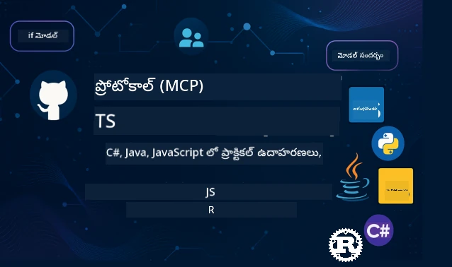

 

[](https://GitHub.com/microsoft/mcp-for-beginners/graphs/contributors)
[](https://GitHub.com/microsoft/mcp-for-beginners/issues)
[](https://GitHub.com/microsoft/mcp-for-beginners/pulls)
[](http://makeapullrequest.com)
[](https://mcptoplist.com/server/mcp.so%2Fmcp-for-beginners%2Fmicrosoft)

[](https://GitHub.com/microsoft/mcp-for-beginners/watchers)
[](https://GitHub.com/microsoft/mcp-for-beginners/fork)
[](https://GitHub.com/microsoft/mcp-for-beginners/stargazers)


[](https://discord.gg/nTYy5BXMWG)

ఈ వనరులను ఉపయోగించడానికి ప్రారంభించేందుకు ఈ దశలను అనుసరించండి:
1. **రిపోజిటరీని ఫోর্ক్ చేయండి**: క్లిక్ చేయండి [](https://GitHub.com/microsoft/mcp-for-beginners/fork)
2. **రిపోజిటరీని క్లోన్ చేయండి**:   `git clone https://github.com/microsoft/mcp-for-beginners.git`
3. **కూడండి** [](https://discord.gg/nTYy5BXMWG)


### 🌐 బహుభాషా మద్దతు

#### గిట్హబ్ యాక్షన్ ద్వారా మద్దతు (ఆటోమేటెడ్ & ఎప్పుడూ నవీకరించబడుతుంది)

<!-- CO-OP TRANSLATOR LANGUAGES TABLE START -->
[Arabic](../ar/README.md) | [Bengali](../bn/README.md) | [Bulgarian](../bg/README.md) | [Burmese (Myanmar)](../my/README.md) | [Chinese (Simplified)](../zh-CN/README.md) | [Chinese (Traditional, Hong Kong)](../zh-HK/README.md) | [Chinese (Traditional, Macau)](../zh-MO/README.md) | [Chinese (Traditional, Taiwan)](../zh-TW/README.md) | [Croatian](../hr/README.md) | [Czech](../cs/README.md) | [Danish](../da/README.md) | [Dutch](../nl/README.md) | [Estonian](../et/README.md) | [Finnish](../fi/README.md) | [French](../fr/README.md) | [German](../de/README.md) | [Greek](../el/README.md) | [Hebrew](../he/README.md) | [Hindi](../hi/README.md) | [Hungarian](../hu/README.md) | [Indonesian](../id/README.md) | [Italian](../it/README.md) | [Japanese](../ja/README.md) | [Kannada](../kn/README.md) | [Khmer](../km/README.md) | [Korean](../ko/README.md) | [Lithuanian](../lt/README.md) | [Malay](../ms/README.md) | [Malayalam](../ml/README.md) | [Marathi](../mr/README.md) | [Nepali](../ne/README.md) | [Nigerian Pidgin](../pcm/README.md) | [Norwegian](../no/README.md) | [Persian (Farsi)](../fa/README.md) | [Polish](../pl/README.md) | [Portuguese (Brazil)](../pt-BR/README.md) | [Portuguese (Portugal)](../pt-PT/README.md) | [Punjabi (Gurmukhi)](../pa/README.md) | [Romanian](../ro/README.md) | [Russian](../ru/README.md) | [Serbian (Cyrillic)](../sr/README.md) | [Slovak](../sk/README.md) | [Slovenian](../sl/README.md) | [Spanish](../es/README.md) | [Swahili](../sw/README.md) | [Swedish](../sv/README.md) | [Tagalog (Filipino)](../tl/README.md) | [Tamil](../ta/README.md) | [Telugu](./README.md) | [Thai](../th/README.md) | [Turkish](../tr/README.md) | [Ukrainian](../uk/README.md) | [Urdu](../ur/README.md) | [Vietnamese](../vi/README.md)

> **స్థానికంగా క్లోన్ చేయడం ఇష్టమా?**
>
> ఈ రిపోజిటరీ 50+ భాషా అనువాదాలను కలిగి ఉంది, ఇది డౌన్లోడ్ పరిమాణాన్ని గణనీయంగా పెంచుతుంది. అనువాదాలు లేకుండా క్లోన్ చేయడానికి, స్పార్స్ చెకౌట్ ఉపయోగించండి:
>
> **బాష్ / macOS / లినక్స్:**
> ```bash
> git clone --filter=blob:none --sparse https://github.com/microsoft/mcp-for-beginners.git
> cd mcp-for-beginners
> git sparse-checkout set --no-cone '/*' '!translations' '!translated_images'
> ```
>
> **CMD (విండోస్):**
> ```cmd
> git clone --filter=blob:none --sparse https://github.com/microsoft/mcp-for-beginners.git
> cd mcp-for-beginners
> git sparse-checkout set --no-cone "/*" "!translations" "!translated_images"
> ```
>
> ఇది మీరు కోర్సును పూర్తిచేయడానికి అవసరమైన అన్ని అంశాలను వేగంగా డౌన్లోడ్ చేసేలా అందిస్తుంది.
<!-- CO-OP TRANSLATOR LANGUAGES TABLE END -->

# 🚀 మోడల్ కాంటెక్స్ట్ ప్రోటోకాల్ (MCP) ప్రారంభికుల కోసం పాఠ్యక్రమం

## **C#, Java, JavaScript, Rust, Python, మరియు TypeScript లో ప్రాక్టికల్ కోడ్ ఉదాహరణలతో MCP నేర్చుకోండి**

## 🧠 మోడల్ కాంటెక్స్ట్ ప్రోటోకాల్ పాఠ్యక్రమం అవలోకనం
మీ Model Context Protocol ప్రయాణానికి స్వాగతం! మీరు ఎప్పుడైనా AI అప్లికేషన్లు వివిధ టూల్స్ మరియు సేవలతో ఎలా కమ్యూనికేట్ చేస్తాయో ఆశ్చర్యపోతే, ఇప్పుడు మీరు డెవలపర్స్ తెలివైన సిస్టమ్స్ ను ఎలా నిర్మిస్తున్నారు అనే అందమైన పరిష్కారాన్ని కనుగొనబోతున్నారు.

MCP ను AI అప్లికేషన్లకు యూనివర్సల్ ట్రాన్స్‌లేటర్ గా భావించండి - USB పోర్టులు మీరు ఏ డివైస్ అయినా మీ కంప్యూటర్‌కి కనెక్ట్ చేసుకునేలా చేస్తాయంటే, MCP కూడా AI మోడల్స్ ను ఏ టూల్ లేదా సేవతో అయినా ఒక ప్రమాణీకృత విధానంలో కనెక్ట్ చేయడానికి అనుమతిస్తుంది. మీరు మీ మొదటి చాట్‌బాట్‌ను నిర్మిస్తున్నారా లేదా సంక్లిష్ట AI వర్క్ఫ్లోలపై పని చేస్తున్నారా, MCP ను అర్థం చేసుకోవడం మీకు మరింత శక్తివంతమైన మరియు అనుకూలమైన అప్లికేషన్లను సృష్టించటానికి అవకాశం ఇస్తుంది.

ఈ పాఠ్యక్రమం మీ శిక్షణ ప్రయాణం కోసం తపనగా, జాగ్రత్తగా రూపొందించబడింది. మీరు దేనిని ఇప్పటికే అర్థం చేసుకున్నారో సరళమైన ఆలోచనలతో ప్రారంభించి, మీ స్వంత ప్రియమైన ప్రోగ్రామింగ్ భాషలో చేతుల డోశ ప్రాక్టీస్ ద్వారా మీ నైపుణ్యాలను మెరుగుపరుస్తాం. ప్రతి దశలో స్పష్టమైన వివరణలు, ప్రాయోగిక ఉదాహరణలు మరియు ప్రోత్సాహకాలు ఉంటాయి.

మీరు ఈ ప్రయాణాన్ని పూర్తిచేసేవరకు, మీరు మీ స్వంత MCP సర్వర్లను నిర్మించడానికి, ప్రముఖ AI ప్లాట్‌ఫారమ్‌లతో వీటిని సమ్మిళితం చేసుకోవడానికి, మరియు ఈ సాంకేతికత AI అభివృద్ధి భవిష్యత్‌ను ఎలా రూపొం‌దిస్తోంది అనేది అర్థం చేసుకునేందుకు విశ్వాసంతో ఉండబోతారు. ఈ ఆసక్తికర యాత్రను మనం కలసి ప్రారంభిద్దాం!

### అధికారిక డాక్యుమెంటేషన్ మరియు స్పెసిఫికేషన్స్

ఈ పాఠ్యక్రమం **MCP స్పెసిఫికేషన్ 2025-11-25** (తాజా స్థిర విడుదల)కు అనుగుణంగా ఉంది. MCP స్పెసిఫికేషన్ తేదీ ఆధారిత వెర్షనింగ్ (YYYY-MM-DD ఫార్మాట్) ఉపయోగిస్తుంది, ఇది ప్రోటోకాల్ వెర్షన్ ట్రాకింగ్‌ను స్పష్టంగా చేయడానికి.

> **అని చూడండి:** తదుపరి స్పెసిఫికేషన్ వెర్షన్ కోసం విడుదల అభ్యర్థి, **2026-07-28**, జూలై 28, 2026కి పంపిణీ చేయాలని ప్లాన్ చేశారు. ఇది ట్రాన్స్‌పోర్ట్ లేయర్ లో ప్రోటోకాల్ ను స్టేట్‌లెస్ చేస్తుంది, ఎక్స్‌టెన్షన్స్ ఫ్రేమ్‌వర్క్ (MCP యాప్‌లు, టాస్కులు)ను పరిపాలిస్తుంది, అధికారి నిర్ధారణను బలోపేత చేస్తుంది, మరియు రూట్స్, సాంప్లింగ్, లాగింగ్ ను డిప్రికేట్ చేస్తుంది. పూర్తి వివరణకు [MCPలో మార్చమవుతున్నవి: 2026-07-28 విడుదల అభ్యర్థి](./01-CoreConcepts/mcp-2026-07-28-release-candidate.md) చూడండి.

ఈ వనరులు మీ అర్థం పెరిగిన కొద్దీ మరింత విలువ కలిగిస్తాయ, కానీ మీరు అన్నింటిని వెంటనే చదవాలని ఒత్తిడి అనుకోవద్దు. మీరు ఎక్కువగా ఆసక్తి ఉన్న ప్రాంతాలతో ప్రారంభించండి!
- 📘 [MCP డాక్యుమెంటేషన్](https://modelcontextprotocol.io/) – ఇది స్టెప్-బై-స్టెప్ ట్యుటోరియల్స్ మరియు యూజర్ గైడ్‌ల కోసం మీ ప్రధాన వనరు. ఈ డాక్యుమెంటేషన్ ప్రారంభికుల కోసం రాసింది, మీరు మీ వేగంతో అనుసరించగల స్పష్టమైన ఉదాహరణలతో.
- 📜 [MCP స్పెసిఫికేషన్](https://modelcontextprotocol.io/specification/2025-11-25) – దీన్ని మీరు సమగ్ర సూచిక మాన్యువల్ గా భావించండి. మీరు పాఠ్యక్రమం ద్వారా పని చేస్తున్నప్పుడు, ప్రత్యేక వివరాలను చూడటానికి మరియు అధునాతన ఫీచర్లను అన్వేషించటానికి ఇక్కడికి తిరిగి వస్తారు.
- 📜 [MCP స్పెసిఫికేషన్ వెర్షనింగ్](https://modelcontextprotocol.io/specification/versioning) – ఇందులో ప్రోటోకాల్ వెర్షన్ చరిత్ర మరియు MCP ఎలా తేదీ ఆధారిత వెర్షనింగ్ (YYYY-MM-DD ఫార్మాట్) ఉపయోగిస్తున్నది అనే విషయాలు ఉన్నాయి.
- 🧑‍💻 [MCP GitHub రిపోజిటరీ](https://github.com/modelcontextprotocol) – ఇక్కడ మీరు SDKలు, టూల్స్, మరియు అనేక ప్రోగ్రామింగ్ భాషల్లో కోడ్ నమూనాలు కనుగొంటారు. ఇది ప్రాక్టికల్ ఉదాహరణలు మరియు రెడీ-టు-యూస్ భాగాల సింధువు లాగే.
- 🌐 [MCP కమ్యూనిటీ](https://github.com/orgs/modelcontextprotocol/discussions) – MCP గురించి చర్చల్లో సహ విద్యార్థులు మరియు పరోనైన డెవలపర్‌లతో కలసి పాల్గొనండి. ఇది ప్రశ్నలు స్వాగతించే మరియు జ్ఞానాన్ని విపరీతంగా పంచుకునే సపోర్టివ్ కమ్యూనిటీ.
  
## నేర్చుకోడానికి లక్ష్యాలు

ఈ పాఠ్యక్రమం చివరికి, మీరు మీ కొత్త నైపుణ్యాల పట్ల మనోధైర్యంతో మరియు ఉత్సాహంతో ఉండరి. మీరు సాధించబోయే వాటివి:

• **MCP יסודותను అర్థం చేసుకోండి**: Model Context Protocol అంటే ఏమిటి, మరియు ఎందుకు ఇది AI అప్లికేషన్లు కలిసి పనిచేసే విధానాన్ని విప్లవాత్మకంగా మార్చుతోందో మీరు తెలుసుకుంటారు, సరళమైన ఉపమాపాలతో.

• **మీ మొదటి MCP సర్వర్‌ని నిర్మించండి**: మీరు మీ ఇష్టమైన ప్రోగ్రామింగ్ భాషలో పని చేసే MCP సర్వర్‌ని సృష్టిస్తారు, సరళ ఉదాహరణలతో ప్రారంభించి మీ నైపుణ్యాలను దశలవారీగా పెంచుకుంటారు.

• **AI మోడల్స్‌ను వాస్తవ టూల్స్‌కు కనెక్ట్ చేయండి**: AI మోడల్స్ మరియు వాస్తవ సేవల మధ్య తేడాను మీరు అందుకు అనుగుణంగా ఎలా జత చేయాలో నేర్చుకుంటారు, తద్వారా మీ అప్లికేషన్లు శక్తివంతమైన కొత్త సామర్థ్యాలు పొందుతాయి.

• **భద్రతా ఉత్తమ ఆచారాలు అమలు చేయండి**: మీ MCP అమలు భద్రంగా మరియు సురక్షితంగా ఉండే విధంగా ఎలా నిర్వహించాలో మీరు అర్థం చేసుకుంటారు, మీ అప్లికేషన్లు మరియు వినియోగదారులను కాపాడుతారు.

• **మన్నికతో నిర్మాణంలో ప్రవేశపెట్టండి**: మీ MCP ప్రాజెక్టు‌లను అభివృద్ధి నుండి ఉత్పత్తికి తీసుకెళ్లే విధానాలను మీరు తెలుసుకుంటారు, ఇది వాస్తవ ప్రపంచంలో పని చేసే అభివృద్ధి పద్ధతులు.

• **MCP కమ్యూనిటీకి జతవ్వండి**: AI అప్లికేషన్ అభివృద్ధి భవిష్యత్ ఆకృతీకరిస్తున్న డెవలపర్‌లు గల పెరుగుతున్న సమాజంలో మీరు భాగమవుతారు.

## అవసరమైన పూర్వాభాసం

MCP సులభంగా అర్థం చేసుకోవడానికి ముందు, కొన్ని ప్రాథమిక భావనలు మీకు సులభతరం కావాలి. మీరు ఈ రంగాలలో నిపుణులు కాకపోయినా సంబంధం లేదు - మేము అవసరమైన ప్రతీదాన్ని స్పష్టంగా చెప్పబోతున్నాం!

### ప్రోటోకాల్‌ల అర్థం (ఆధారం)

ఒక ప్రోటోకాల్ అంటే సంభాషణ కోసం నిబంధనలు లాంటిదే. మీరు ఫ్రెండ్‌ని కాల్ చేస్తే, సమాధానంలో "హలో" అంటారు, మాటల బదులుగా మారినప్పుడు క్రమం పాటిస్తారు, ముగుస్తున్నప్పుడు "గుడ్‌బై" అంటారు. కంప్యూటర్ ప్రోగ్రాములకి కూడా సమర్థవంతంగా కమ్యూనికేట్ చేయడానికి ఇలాంటి నిబంధనలు అవసరం.

MCP అనేది ఒక ప్రోటోకాల్ - AI మోడల్స్ మరియు అప్లికేషన్లు టూల్స్ మరియు సేవలతో తగిన "సంభాషణలు" నిర్వహించేందుకు అంగీకరించిన నిబంధనల సమాహారం. మనుషులు సంభాషణ నిబంధనలతో సులభంగా కమ్యూనికేట్ చేసేలా, MCP ఉండటం వలన AI అప్లికేషన్ కమ్యూనికేషన్ మరింత నమ్మకంగా మరియు శక్తివంతంగా అవుతుంది.

### క్లయింట్-సర్వర్ సంబంధాలు (ప్రోగ్రాములు కలిసి ఎలా పని చేస్తాయో)

మీరు రోజూ క్లయింట్-సర్వర్ సంబంధాలను ఉపయోగిస్తారు! మీరు వెబ్ బ్రౌజర్ (క్లయింట్) ఉపయోగించి వెబ్‌సైట్ సందర్శిస్తే, మీరు వెబ్ సర్వర్‌కి కనెక్ట్ అవుతారు, అది పేజీ కంటెంట్‌ను పంపుతుంది. బ్రౌజర్ ఎలా సమాచారం అడగాలో, సర్వర్ ఎలా స్పందించాలో అర్ధం.

MCPలో అలాంటి సంబంధం ఉంటుంది: AI మోడల్స్ క్లయింట్లుగా పనిచేస్తారు, వారు సమాచారం లేదా చర్యల్ని కోరుతారు; MCP సర్వర్లు ఆ సామర్థ్యాలను అందిస్తాయి. ఇది సహాయకుడి లాంటి సర్వర్ లాంటిది, AI కొన్ని నిర్దిష్ట పనులను చేయమని అడగవచ్చు.

### ప్రమాణీకరణ ఎందుకు ముఖ్యం (వస్తువులను కలిసి పనిచేయింపజేసే దశ)

ప్రతి ఆటోమొబైల్ తయారీదారు వేర్వేరు ఆకారపు గ్యాస్ పంప్‌లు వాడితేనే ఊహించండి - ప్రతి కారు కోసం వేర్వేరు అడాప్‌టర్లు కావాలి! ప్రమాణీకరణ అంటే ఐక్యమైన దృష్టిని అంగీకరించడం, అంశాలు సులభంగా కలిసి పనిచేస్తాయి.

MCP AI అప్లికేషన్ల కోసం ఇలాంటి ప్రమాణీకరణను అందిస్తుంది. ప్రతి AI మోడల్ ప్రతి టూల్‌తో పని చేయాలంటే ప్రత్యేక కోడ్ అవసరం ఉండకుండా, MCP వాటిని కమ్యూనికేట్ చేసుకునే యూనివర్షల్ మార్గం సృష్టిస్తుంది. దీనివల్ల డెవలపర్లు ఒకసారి టూల్స్ అభివృద్ధి చేసి వాటిని అనేక AI సిస్టమ్స్ తో ఉపయోగించుకోవచ్చు.

## 🧭 మీ అభ్యాస మార్గం అవలోకనం

మీ MCP ప్రయాణం జాగ్రత్తగా నిర్మించబడి, మీ మనోధైర్యం మరియు నైపుణ్యాలను స్థిరంగా పెంచుతుంది. ప్రతి దశ కొత్త ఆలోచనలను పరిచయం చేస్తూ, మీరు ఇక మీదట నేర్చుకున్న దాన్నీ బలోపేతం చేస్తుంది.

### 🌱 పునాది దశ: ప్రాథమిక విషయాల అవగాహన (మాడ్యూల్స్ 0-2)

ఇది మీ సాహస యాత్ర ప్రారంభమవుతుంది! MCP సూత్రాలను మీరు ఉన్న పరిచయాలతో సంబంధించి సరళ ఉదాహరణలతో చూపిస్తాము. MCP అంటే ఏమిటి, ఇది ఎందుకు ఉంది, మరియు AI అభివృద్ధి ప్రపంచంలో అది ఎటువంటి ప్రాముఖ్యత కలిగి ఉందో అర్థం చేసుకుంటారు.


• **మాడ్యూల్ 0 - MCP పరిచయం**: మేము మొదట MCP అంటే ఏమిటి మరియు ఇది ఆధునిక AI అనువర్తనాల కోసం ఎందుకు అంత ముఖ్యమైనది అనేది ஆராயելուతో ప్రారంభిస్తాము. మీరు చర్యలో MCP యొక్క వాస్తవ ప్రపంచ ఉదాహరణలను చూస్తారు మరియు ఇది డెవలపర్లకు ఎదురవుతున్న సాధారణ సమస్యలను ఎలా పరిష్కరిస్తుంది అని అర్థం చేసుకుంటారు.

• **మాడ్యూల్ 1 - కోర్ కాన్సెప్ట్‌లు వివరణ**: ఇక్కడ మీరు MCP యొక్క అవసరమైన మౌలిక భాగాలను నేర్చుకుంటారు. ఈ కాన్సెప్ట్‌లు సహజంగా మరియు అర్థం చేసుకునేలా ఉండేలా మేము అనేక ఉదాహరణలు మరియు దృశ్య ఉదాహరణలు ఉపయోగిస్తాము.

• **మాడ్యూల్ 2 - MCPలో భద్రత**: భద్రత భయంకరంగా అనిపించవచ్చు, కానీ MCP లో నిగ్రహిత భద్రతా లక్షణాలు ఎలా ఉంటాయో మేము చూపిస్తాము మరియు మీ అనువర్తనాలను ప్రారంభం నుండే రక్షించే ఉత్తమ ఆచరణలను నేర్పుతాము.

### 🔨 నిర్మాణ దశ: మీ మొదటి అమలుదారులను సృష్టించడం (మాడ్యూల్ 3)

ఇప్పటి నుంచి నిజమైన సంతోషం మొదలవుతుంది! మీరు MCP సర్వర్లు మరియు క్లయింట్లను ప్రాక్టికల్‌గా నిర్మించడంలో అనుభవం పొందుతారు. భయపడకండి - మేము సులభంగా ప్రారంభించి ప్రతి దశలో మీకు మార్గనిర్దేశం చేస్తాము.

ఈ మాడ్యూల్ లో మీరు మీ ఇష్టమైన ప్రోగ్రామింగ్ భాషలో ఉపయోగించడానికి అనేక హ్యాండ్స్-ఆన్ గైడ్‌లు ఉంటాయి. మీరు మీ మొదటి సర్వర్‌ని సృష్టించి, దానితో కనెక్ట్ అయ్యే క్లయింట్‌ని నిర్మించి, విఖ్యాతమైన డెవలప్‌మెంట్ టూల్‌లతో కట్టిపడతారు, ఉదాహరణకు VS కోడ్.

ప్రతి గైడ్ పూర్తి కోడ్ ఉదాహరణలు, సమస్యల పరిష్కార సూచనలు మరియు మేము ప్రత్యేక డిజైన్ ఎంపికల్ని ఎందుకు చేస్తున్నామో వివరణను కలిగి ఉంటుంది. ఈ దశ ముగిసిన తర్వాత, మీరు గర్వపడదగిన పని చేసే MCP అమలులను కలిగి ఉంటారు!

### 🚀 అభివృద్ధి దశ: ఉన్నత కాన్సెప్ట్‌లు మరియు వాస్తవ ప్రపంచ అనువర్తనం (మాడ్యూల్స్ 4-5)

ప్రాథమికాలను బాగా అర్థం చేసుకున్న తర్వాత, మీరు మరింత శ్రేష్ఠమైన MCP లక్షణాలను అన్వేషించడానికి సిద్ధంగా ఉన్నారు. మేము ప్రాక్టికల్ అమలు వ్యూహాలు, డీబగ్ సాంకేతికతలు మరియు మల్టీ-మోడల్ AI ఇంటిగ్రేషన్ వంటి ఉన్నత అంశాలను కవర్ చేస్తాము.

మీరు MCP అమలులను ప్రొడక్షన్ వాడుక కోసం స్కేలు చేయడం మరియు క్లౌడ్ ప్లాట్‌ఫారమ్‌లతో, ఉదాహరణకు Azure తో సమన్వయాలు చేయడం గురించి కూడా నే learn చుకుంటారు. ఈ మాడ్యూల్‌లు వాస్తవ ప్రపంచ డిమాండ్లను ఎదుర్కొనే MCP పరిష్కారాలను తయారుచేయడానికి మీను సిద్ధం చేస్తాయి.

### 🌟 నైపుణ్య దశ: సముదాయం మరియు ప్రత్యేకత (మాడ్యూల్స్ 6-11)

త‌దుపరి దశ MCP సముదాయంలో చేరడానికి మరియు మీరు ఎక్కువగా ఆసక్తి ఉన్న ప్రాంతాలలో నిపుణులుగా మారటంపై గూర్చి ఉంటుంది. మీరు ఓపెన్-సోర్స్ MCP ప్రాజెక్టులకు ఎలా సహకరించాలో, ఉన్నత అయోసమార్థత నమూనాలు చేపట్టడం, మరియు సమగ్ర డేటాబేస్ ఇంటిగ్రేటెడ్ పరిష్కారాలు నిర్మించడం నేర్చుకుంటారు.

మాడ్యూల్ 11 ప్రత్యేకంగా చెప్పుకోవాల్సినది - ఇది ఒక సంప్రదాయ 13-లాబ్ హ్యాండ్స్-ఆన్ నేర్చుకునే మార్గం, ఇది PostgreSQL ఇంటిగ్రేషన్‌తో ప్రొడక్షన్-సిద్ధ MCP సర్వర్‌లను నిర్మించటం నేర్పిస్తుంది. ఇది మీరు నేర్చుకున్న ప్రతిదాన్ని కలిపే క్యాప్స్టోన్ ప్రాజెక్ట్ లాంటిది!

### 📚 పూర్తయిన పాఠ్యక్రమ నిర్మాణం

| మాడ్యూల్ | విషయం | వివరణ | లింక్ |
|--------|-------|-------------|------|
| **మాడ్యూల్స్ 0-3: గ్రుంధాలు** | | | |
| 00 | MCP పరిచయం | మోడల్ కాంటెక్ట్స్ ప్రోటోకాల్ సమీక్ష మరియు AI పైపు లైన్లలో దీని ప్రాముఖ్యత | [మరిన్ని చదవండి](./00-Introduction/README.md) |
| 01 | కోర్ కాన్సెప్ట్‌లు వివరణ | కోర్ MCP కాన్సెప్ట్‌ల లోతైన పరిశీలన | [మరిన్ని చదవండి](./01-CoreConcepts/README.md) |
| 1.1 | MCPలో ఏమి మారుతుంది (2026-07-28 RC) | స్టేట్‌లెస్ ప్రోటోకాల్, ఎక్స్‌టెన్షన్స్ ఫ్రేమ్‌వర్క్, మరియు కొత్త స్పెக் వర్షన్‌లో వస్తున్న ఫీచర్ డిప్రికేషన్లు | [గైడ్](./01-CoreConcepts/mcp-2026-07-28-release-candidate.md) |
| 02 | MCP భద్రతలో | భద్రతా హానికరాలు మరియు ఉత్తమ ఆచరణలు | [మరిన్ని చదవండి](./02-Security/README.md) |
| 03 | MCPతో ప్రారంభం | సర్వర్/క్లయింట్‌ల సందర్భంలో వాతావరణ సెట్ అప్, ఇంటిగ్రేషన్ | [మరిన్ని చదవండి](./03-GettingStarted/README.md) |
| **మాడ్యూల్ 3: మీ మొదటి సర్వర్ & క్లయింట్ ని నిర్మించడం** | | | |
| 3.1 | మొదటి సర్వర్ | మీ మొదటి MCP సర్వర్ సృష్టించండి | [గైడ్](./03-GettingStarted/01-first-server/README.md) |
| 3.2 | మొదటి క్లయింట్ | ఒక ప్రాథమిక MCP క్లయింట్ అభివృద్ధి చేయండి | [గైడ్](./03-GettingStarted/02-client/README.md) |
| 3.3 | LLM తో క్లయింట్ | పెద్ద భాషా మోడళ్లతో ఇంటిగ్రేట్ చేయండి | [గైడ్](./03-GettingStarted/03-llm-client/README.md) |
| 3.4 | VS కోడ్ ఇంటిగ్రేషన్ | MCP సర్వర్‌లను VS కోడ్లో వినియోగించండి | [గైడ్](./03-GettingStarted/04-vscode/README.md) |
| 3.5 | stdio సర్వర్ | stdio ట్రాన్స్‌పోర్ట్ ఉపయోగించి సర్వర్‌లను సృష్టించండి | [గైడ్](./03-GettingStarted/05-stdio-server/README.md) |
| 3.6 | HTTP స్ట్రీమింగ్ | MCPలో HTTP స్ట్రీమింగ్ అమలు చేయండి | [గైడ్](./03-GettingStarted/06-http-streaming/README.md) |
| 3.7 | Microsoft Foundry టూల్‌కిట్ | MCPతో Microsoft Foundry టూల్‌కిట్ ఉపయోగించండి | [గైడ్](./03-GettingStarted/07-aitk/README.md) |
| 3.8 | పరీక్ష | మీ MCP సర్వర్ అమలును పరీక్షించండి | [గైడ్](./03-GettingStarted/08-testing/README.md) |
| 3.9 | ప్రయోగం | MCP సర్వర్‌లను ప్రొడక్షన్‌లో ప్రవేశపెట్టండి | [గైడ్](./03-GettingStarted/09-deployment/README.md) |
| 3.10 | ప్రగతిశీల సర్వర్ వినియోగం | అభివృద్ధి లక్షణాల కోసం అధునాతన సర్వర్‌లు మరియు మెరుగైన వాస్తవికత ఉపయోగించండి | [గైడ్](./03-GettingStarted/10-advanced/README.md) |
| 3.11 | సాదారణ అథిపత్రత | ప్రాథమికంగా అథిపత్రత మరియు RBAC చూపే అధ్యాయం | [గైడ్](./03-GettingStarted/11-simple-auth/README.md) |
| 3.12 | MCP హోస్ట్‌లు | Claude Desktop, Cursor, Cline మరియు ఇతర MCP హోస్ట్‌లను కాన్ఫిగర్ చేయండి | [గైడ్](./03-GettingStarted/12-mcp-hosts/README.md) |
| 3.13 | MCP ఇన్స్పెక్టర్ | ఇన్స్పెక్టర్ టూల్‌తో MCP సర్వర్‌లను డీబగ్ చేయండి మరియు పరీక్షించండి | [గైడ్](./03-GettingStarted/13-mcp-inspector/README.md) |
| 3.14 | శాంప్లింగ్ | క్లయింట్‌తో సహకరించడానికి శాంప్లింగ్ ఉపయోగించండి | [గైడ్](./03-GettingStarted/14-sampling/README.md) |
| 3.15 | MCP అనువర్తనాలు | MCP అనువర్తనాలు నిర్మించండి | [గైడ్](./03-GettingStarted/15-mcp-apps/README.md) |
| **మాడ్యూల్ 4-5: ప్రాక్టికల్ & అడ్వాన్స్డ్** | | | |
| 04 | ప్రాక్టికల్ అమలు | SDKలు, డీబగ్గింగ్, పరీక్షించడం, పునర్వినియోగ ప్రాంప్ట్ టెంప్లేట్లు | [మరిన్ని చదవండి](./04-PracticalImplementation/README.md) |
| 4.1 | పేజినేషన్ | కర్సర్ ఆధారిత పేజినేషన్‌తో పెద్ద ఫలితాలను నిర్వహించండి | [గైడ్](./04-PracticalImplementation/pagination/README.md) |
| 05 | MCP లో ఉన్నత అంశాలు | మల్టీ-మోడల్ AI, స్కేలింగ్, ఎంటర్ప్రైజ్ వాడుక | [మరిన్ని చదవండి](./05-AdvancedTopics/README.md) |
| 5.1 | Azure ఇంటిగ్రేషన్ | MCP ను Azure తో సమన్వయం చేయడం | [గైడ్](./05-AdvancedTopics/mcp-integration/README.md) |
| 5.2 | మల్టీ-మోడాలిటీ | అనేక మోడ్‌లతో పని చేయడం | [గైడ్](./05-AdvancedTopics/mcp-multi-modality/README.md) |
| 5.3 | OAuth2 డెమో | OAuth2 అథిపత్రతను అమలు చేయండి | [గైడ్](./05-AdvancedTopics/mcp-oauth2-demo/README.md) |
| 5.4 | రూట్ కాంటెక్ట్స్ | రూట్ కాంటెక్ట్స్ అర్థం చేసుకోండి మరియు అమలు చేయండి | [గైడ్](./05-AdvancedTopics/mcp-root-contexts/README.md) |
| 5.5 | రౌటింగ్ | MCP రౌటింగ్ వ్యూహాలు | [గైడ్](./05-AdvancedTopics/mcp-routing/README.md) |
| 5.6 | శాంప్లింగ్ | MCPలో శాంప్లింగ్ సాంకేతికతలు | [గైడ్](./05-AdvancedTopics/mcp-sampling/README.md) |
| 5.7 | స్కేలింగ్ | MCP అమ‌లులను స్కేలు చేయండి | [గైడ్](./05-AdvancedTopics/mcp-scaling/README.md) |
| 5.8 | భద్రత | ఉన్నత భద్రతా పరిగణన‌లు | [గైడ్](./05-AdvancedTopics/mcp-security/README.md) |
| 5.9 | వెబ్ శోధన | వెబ్ శోధన సామర్థ్యాలను అమలు చేయండి | [గైడ్](./05-AdvancedTopics/web-search-mcp/README.md) |
| 5.10 | రియల్ టైం స్ట్రీమింగ్ | రియల్‌టైం స్ట్రీమింగ్ ఫంక్షనాలిటీని నిర్మించండి | [గైడ్](./05-AdvancedTopics/mcp-realtimestreaming/README.md) |
| 5.11 | రియల్ టైమ్ శోధన | రియల్‌టైమ్ శోధనను అమలు చేయండి | [గైడ్](./05-AdvancedTopics/mcp-realtimesearch/README.md) |
| 5.12 | ఎంట్రా ID అథిపత్రత | Microsoft Entra ID తో అథిపత్రత | [గైడ్](./05-AdvancedTopics/mcp-security-entra/README.md) |
| 5.13 | Foundry ఇంటిగ్రేషన్ | Microsoft Foundry తో సమన్వయం | [గైడ్](./05-AdvancedTopics/mcp-foundry-agent-integration/README.md) |
| 5.14 | కాంటెక్ట్ ఇంజనీరింగ్ | సమర్థవంతమైన కాంటెక్ట్ ఇంజనీరింగ్ సాంకేతికతలు | [గైడ్](./05-AdvancedTopics/mcp-contextengineering/README.md) |
| 5.15 | MCP కస్టమ్ ట్రాన్స్‌పోర్ట్ | కస్టమ్ ట్రాన్స్‌పోర్ట్ అమల్లు | [గైడ్](./05-AdvancedTopics/mcp-transport/README.md) |
| 5.16 | ప్రోటోకాల్ లక్షణాలు | ప్రగతి సూత్రాలు, రద్దు, వనరుల టెంప్లేట్లు | [గైడ్](./05-AdvancedTopics/mcp-protocol-features/README.md) |
| 5.17 | వ్యతిరేక మల్టీ-ఏజెంట్ తీర్మానం | ఇద్దరు ఏజెంట్లు MCP పరికరాలను ఉపయోగించి వేర్వేరు వాదనలు చేస్తారు, ఒక న్యాయమూర్తి ఏజెంట్ వాటిని మూల్యాంకన చేస్తుంది | [గైడ్](./05-AdvancedTopics/mcp-adversarial-agents/README.md) |
| **మాడ్యూల్స్ 6-10: సముదాయం & ఉత్తమ ఆచరణలు** | | | |
| 06 | సముదాయం సదస్సులు | MCP వ్యవస్థకు ఎలా సహకరించాలో | [గైడ్](./06-CommunityContributions/README.md) |
| 07 | ప్రారంభ ఆమోదం నుండి అవగాహన | వాస్తవ ప్రపంచంలో అమలుచేసిన కథనాలు | [గైడ్](./07-LessonsfromEarlyAdoption/README.md) |
| 08 | MCP కోసం ఉత్తమ ఆచరణలు | పనితీరు, లోప నిస్సరణ, సహనశక్తి | [గైడ్](./08-BestPractices/README.md) |
| 09 | MCP కేస్ స్టడీస్ | ప్రాక్టికల్ అమలు ఉదాహరణలు | [గైడ్](./09-CaseStudy/README.md) |
| 10 | హ్యాండ్స్-ఆన్ వర్క్‌షాప్ | Microsoft Foundry టూల్‌కిట్‌తో MCP సర్వర్ నిర్మాణం | [లాబ్](./10-StreamliningAIWorkflowsBuildingAnMCPServerWithAIToolkit/README.md) |
| **మాడ్యూల్ 11: MCP సర్వర్ హ్యాండ్స్-ఆన్ లాబ్** | | | |
| 11 | MCP సర్వర్ డేటాబేస్ ఇంటిగ్రేషన్ | PostgreSQL ఇంటిగ్రేషన్ కోసం సమగ్ర 13-లాబ్ హ్యాండ్స్-ఆన్ నేర్చుకునే మార్గం | [లాబ్స్](./11-MCPServerHandsOnLabs/README.md) |
| 11.1 | పరిచయం | డేటాబేస్ ఇంటిగ్రేషన్ మరియు రిటైల్ అనలిటిక్స్ ఉపయోగ కేసుతో MCP అవలోకనం | [లాబ్ 00](./11-MCPServerHandsOnLabs/00-Introduction/README.md) |
| 11.2 | కోర్ ఆర్కిటెక్చర్ | MCP సర్వర్ ఆర్కిటెక్చర్, డేటాబేస్ స్థాయిలు, భద్రతా నమూనాలను అర్థం చేసుకోవడం | [లాబ్ 01](./11-MCPServerHandsOnLabs/01-Architecture/README.md) |
| 11.3 | భద్రత & మల్టీ-టీనెన్సీ | రో లెవెల్ సెక్యూరిటీ, అథిపత్రత, మరియు బహుళ-టీనెంట్ డేటా యాక్సెస్ | [లాబ్ 02](./11-MCPServerHandsOnLabs/02-Security/README.md) |
| 11.4 | వాతావరణ సెట్ అప్ | అభివృద్ధి వాతావరణం సెట్ చేయడం, డాకర్, Azure వనరులు | [లాబ్ 03](./11-MCPServerHandsOnLabs/03-Setup/README.md) |
| 11.5 | డేటాబేస్ డిజైన్ | PostgreSQL సెట్ అప్, రిటైల్ స్కీమా డిజైన్, మరియు నమూనా డేటా | [లాబ్ 04](./11-MCPServerHandsOnLabs/04-Database/README.md) |
| 11.6 | MCP సర్వర్ అమలు | డేటాబేస్ ఇంటిగ్రేషన్‌తో FastMCP సర్వర్ నిర్మాణం | [లాబ్ 05](./11-MCPServerHandsOnLabs/05-MCP-Server/README.md) |
| 11.7 | టూల్ అభివృద్ధి | డేటాబేస్ క్వెరీ టూల్‌లు మరియు స్కీమా ఇంట్రోస్పెక్షన్ సృష్టించడం | [లాబ్ 06](./11-MCPServerHandsOnLabs/06-Tools/README.md) |
| 11.8 | సెమాంటిక్ శోధన | Azure OpenAI మరియు pgvector తో వెక్టర్ ఎంబెడింగ్స్ అమలు | [లాబ్ 07](./11-MCPServerHandsOnLabs/07-Semantic-Search/README.md) |
| 11.9 | పరీక్ష & డీబగ్గింగ్ | పరీక్షా వ్యూహాలు, డీబగ్గింగ్ టూల్‌లు, మరియు ధృవీకరణ పద్ధతులు | [లాబ్ 08](./11-MCPServerHandsOnLabs/08-Testing/README.md) |
| 11.10 | VS కోడ్ ఇంటిగ్రేషన్ | VS కోడ్ MCP ఇంటిగ్రేషన్ మరియు AI చాట్ వినియోగం కాన్ఫిగర్ చేయడం | [లాబ్ 09](./11-MCPServerHandsOnLabs/09-VS-Code/README.md) |
| 11.11 | ప్రయోగ వ్యూహాలు | డాకర్ ప్రయోగం, Azure కంటైనర్ అప్స్, మరియు స్కేలింగ్ పరిగణనలు | [లాబ్ 10](./11-MCPServerHandsOnLabs/10-Deployment/README.md) |
| 11.12 | మానిటరింగ్ | అప్లికేషన్ ఇన్సైట్స్, లాగింగ్, పనితీరు పర్యవేక్షణ | [లాబ్ 11](./11-MCPServerHandsOnLabs/11-Monitoring/README.md) |
| 11.13 | ఉత్తమ ఆచరణలు | పనితీరు మెరుగుదల, భద్రతా గట్టి చర్యలు, మరియు ఉత్పత్తి చిట్కాలు | [లాబ్ 12](./11-MCPServerHandsOnLabs/12-Best-Practices/README.md) |
| **మాడ్యూల్ 12: MCP టూలింగ్** | | | |
| 12.1 | టూలింగ్ | కాపిలట్ యాప్‌లో MCP వాడుక | [ గైడ్ ](./12-tooling/README.md) |

### 💻 నమూనా కోడ్ ప్రాజెక్టులు

MCP నేర్చుకునే అత్యంత ఆసక్తికరమైన భాగాలలో ఒకటి మీ కోడ్ నైపుణ్యాలు క్రమంగా అభివృద్ధి చెందడం చూడటం. మేము మా కోడ్ ఉదాహరణలను సులభంగా ప్రారంభించి, మీ అర్థం లోతుగా పెరిగే కొద్ది మరింత అలంకృతంగా అభివృద్ధి చేయబడినట్లుగా రూపొందించాము. ఎలా కాన్సెప్ట్‌లు పరిచయం చేస్తున్నామంటే - అర్థం చేసుకోవడానికి సులభమైన కానీ నిజమైన MCP సూత్రాలను ప్రదర్శించే కోడ్ తో, మీరు ఈ కోడ్ ఏమి చేస్తుంది మాత్రమే కాదు, ఇది ఈ విధంగా నిర్మించబడిందని మరియు పెద్ద MCP అనువర్తనాలలో ఎలా సరిపోతుందో కూడా అర్థం చేసుకుంటారు.

#### ప్రాథమిక MCP కాల్‌క్యులోటర్ నమూనాలు

| భాష | వివరణ | లింక్ |
|----------|-------------|------|

| C# | MCP సర్వర్ ఉదాహరణ | [View Code](./03-GettingStarted/samples/csharp/README.md) |
| Java | MCP కాలిక్యులేటర్ | [View Code](./03-GettingStarted/samples/java/calculator/README.md) |
| JavaScript | MCP డెమో | [View Code](./03-GettingStarted/samples/javascript/README.md) |
| Python | MCP సర్వర్ | [View Code](../../03-GettingStarted/samples/python/mcp_calculator_server.py) |
| TypeScript | MCP ఉదాహరణ | [View Code](./03-GettingStarted/samples/typescript/README.md) |
| Rust | MCP ఉదాహరణ | [View Code](./03-GettingStarted/samples/rust/README.md) |

#### అభివృద్ధి చెందిన MCP అమలు

| భాష | వివరణ | లింక్ |
|----------|-------------|------|
| C# | అభివృద్ధి శాంపిల్ | [View Code](./04-PracticalImplementation/samples/csharp/README.md) |
| Spring మాతో Java | కంటైనర్ యాప్ ఉదాహరణ | [View Code](./04-PracticalImplementation/samples/java/containerapp/README.md) |
| JavaScript | అభివృద్ధి శాంపిల్ | [View Code](./04-PracticalImplementation/samples/javascript/README.md) |
| Python | క్లిష్టమైన అమలు | [View Code](./04-PracticalImplementation/samples/python/README.md) |
| TypeScript | కంటైనర్ శాంపిల్ | [View Code](./04-PracticalImplementation/samples/typescript/README.md) |


## 🎯 MCP నేర్చుకోవడానికి ప్రాథమిక అవసరాలు

ఈ పాఠ్యక్రమం నుండి అత్యంత లాభం పొందేందుకు, మీరు:

- కనీసం ఒక క్రింది భాషలలో ప్రోగ్రామింగ్ ప్రాథమిక జ్ఞానం కలిగి ఉండాలి: C#, Java, JavaScript, Python, లేదా TypeScript
- క్లయింట్-సర్వర్ నమూనా మరియు API లపై అవగాహన కలిగి ఉండాలి
- REST మరియు HTTP సంకల్పాలపై పరిచయం కలిగి ఉండాలి
- (ఐచ్చికం) AI/ML సంకల్పాలపై పటువత

- మద్దతు కోసం మా కమ్యూనిటీ చర్చల్లో చేరడం

## 📚 అధ్యయన మార్గదర్శకం & వనరులు

ఈ రిపొజిటరీలో సమర్థవంతంగా పరిజ్ఞానం పొందడానికి అనేక వనరులు ఉన్నాయి:

### అధ్యయన మార్గదర్శకం

సమగ్రమైన [అధ్యయన మార్గదర్శకం](./study_guide.md) అందుబాటులో ఉంది, ఇది ఈ రిపొజిటరీని సమర్థవంతంగా ప్రయాణించడంలో సహాయపడుతుంది. ఈ దృష్టిగోచర పాఠ్యక్రమ మ్యాప్ అన్ని విషయాలు ఎలా సంబంధించాయో చూపిస్తుంది మరియు శాంపిల్ ప్రాజెక్టులను సమర్థవంతంగా ఉపయోగించడానికి మార్గనిర్దేశం చేస్తుంది. మీరు పెద్ద దృశ్యాన్ని చూడటంలో ఆసక్తిగలవారు అయితే ఇది చాలా ఉపయోగకరం.

మార్గదర్శకంలో:
- అన్ని కవర్ చేసిన అంశాల దృష్టిగోచర పాఠ్యక్రమ మ్యాప్
- ప్రతి రిపొజిటరీ విభాగం యొక్క వివరమైన విభజన
- శాంపిల్ ప్రాజెక్టులను ఎలా ఉపయోగించాలో మార్గనిర్దేశం
- వివిధ నైపుణ్య స్థాయిలకు సిఫార్సు చేసిన শেখన మార్గాలు
- మీ అభ్యాస యాత్రను పూర్తి చేయడానికి అదనపు వనరులు

### చేంజ్‌లాగ్

మేము సవివరమైన [చేంజ్‌లాగ్](./changelog.md) ను నిర్వహిస్తున్నాము, ఇది పాఠ్యక్రమ పరికరాల్లో అన్ని ముఖ్యమైన అప్డేట్‌లను ట్రాక్ చేస్తుంది, కాబట్టి మీరు తాజా మెరుగింపు మరియు జతచేసే అంశాలతో తీసుకొనివెళ్లవచ్చు.
- కొత్త కంటెంట్ జోడింపులు
- నిర్మాణాత్మక మార్పులు
- ఫీచర్ అభివృద్ధులు
- డాక్యుమెంటేషన్ అప్‌డేట్లు

## 🛠️ ఈ పాఠ్యక్రమాన్ని సమర్థవంతంగా ఎలా ఉపయోగించాలి

ఈ మార్గదర్శకంలోని ప్రతి పాఠం অন্তర్గతంగా ఉంది:

1. MCP సంకల్పాల స్పష్టమైన వివరణలు  
2. బహువిధ భాషలలో ప్రత్యక్ష కోడ్ ఉదాహరణలు  
3. నిజమైన MCP అప్లికేషన్లను నిర్మించడానికి వ్యాయామాలు  
4. అభివృద్ధి చెందుతున్న అభ్యాసకుల కోసం అదనపు వనరులు

### C# తో MCP నేర్చుకుందాం - ట్యుటోరియల్ సిరీస్
మోడల్ కోన్టెక్స్ట్ ప్రోటోకాల్ (MCP) గురించి తెలుసుకుందాం, ఇది AI మోడల్స్ మరియు క్లయింట్ అప్లికేషన్ల మధ్య పరస్పర చర్యలను ప్రామాణీకరించడానికి రూపొందించబడిన అగ్రగామి ఫ్రేమ్‌వర్క్. ఈ ప్రారంభ సదస్సు ద్వారా, మేము మీకు MCP పరిచయం చేసుకుని, మీ మొదటి MCP సర్వర్ సృష్టించడంలో మార్గనిర్దేశం చేస్తాము.
#### C#: [https://aka.ms/letslearnmcp-csharp](https://aka.ms/letslearnmcp-csharp)
#### Java: [https://aka.ms/letslearnmcp-java](https://aka.ms/letslearnmcp-java)
#### JavaScript: [https://aka.ms/letslearnmcp-javascript](https://aka.ms/letslearnmcp-javascript)
#### Python: [https://aka.ms/letslearnmcp-python](https://aka.ms/letslearnmcp-python)

## 🎓 మీ MCP ప్రయాణం ప్రారంభమవుతోంది

అభినందనలు! మీరు ప్రోగ్రామింగ్ సామర్థ్యాలను విస్తరించే మరియు AI అభివృద్ధి నేటి అగ్రగామి స్థానానికి మీకు కనెక్ట్ చేసే ఆసక్తికర ప్రయాణం మొదటి దశ తాకారు.

### మీరు ఇప్పటికే సాధించినది

ఈ పరిచయాన్ని చదివి, మీరు ఇప్పటికే మీ MCP జ్ఞాన ఆధారాన్ని నిర్మించడం ప్రారంభించారు. MCP అంటే ఏమిటి, అది ఎందుకు ముఖ్యమైనదీ, ఈ పాఠ్యక్రమం మీ అభ్యాస ప్రయాణాన్ని ఎలా మద్దతు చేస్తుందో మీరు అర్థం చేసుకున్నారు. ఇది ఒక గణనీయమైన సాదన మరియు ఈ ముఖ్యమైన సాంకేతికతలో మీ నిపుణత్వ ప్రారంభం.

### ముందున్న సాహసము

మీరు మాడ్యూల్స్ ద్వారా ముందుకు సాగేటప్పుడు, ప్రతి నిపుణుడు మొదటిది ఓ ప్రారంభస్థాయి అని గుర్తుంచుకోండి. ఇప్పుడు క్లిష్టంగా కనిపించే సంకల్పాలు ప్రాక్టీస్ మరియు వర్తింపజేస్తూ మీరు రెండో స్వభావంగా మారవచ్చు. ప్రతి చిన్న అడుగు శక్తివంతమైన సామర్థ్యాలు అభివృద్ధి చేస్తుంది, ఇవి మీ అభివృద్ధి వృత్తి జీవితాంతం సేవ చేస్తాయి.

### మీ మద్దతు నెట్‌వర్క్

మీరు MCP పట్ల ఆసక్తి కలిగి ఉన్న అభ్యాసకులు మరియు నిపుణుల సమూహానికి చేరుతున్నారు, వారు ఇతరులకు విజయం సాధించడానికి సహాయపడటానికి ఉత్సాహంగా ఉన్నారు. మీరు కోడింగ్ సవాలు ఎదురుకొంటున్నారా లేదా ఒక విజయాన్ని పంచుకోవాలనుకుంటున్నారా, కాపాడి సమాజం మీ ప్రయాణాన్ని మద్దతు చేయడానికి ఇక్కడ ఉంది.

మీరు ఇబ్బంది పడితే లేదా AI అనువర్తనాలు నిర్మించే విషయంలో ఏవైనా ప్రశ్నలు ఉంటే, MCP గురించి చర్చలలో ఇతర అభ్యాసకులు మరియు అనుభవజ్ఞులని చేరండి. ఇది ప్రశ్నలకు స్వాగతం పలుకే, జ్ఞానం స్వేచ్ఛగా పంచుకునే సపోర్టివ్ కమ్యూనిటీ.

[](https://discord.gg/nTYy5BXMWG)

మీరు పదార్థాలపై ప్రతిపాదనలు లేదా లోపాలను కనుగొన్నట్లయితే సందర్శించండి:

[](https://aka.ms/foundry/forum)

### సిద్ధంగా ప్రారంభించమా?

మీ MCP సాహసము ఇప్పుడు ప్రారంభమవుతోంది! మీ మొదటి MCP అనుభవాలలో మునిగేందుకు మాడ్యూల్ 0 తో ప్రారంభించండి, లేదా మీరు తయారు చేయబోయే వాటిని చూడటానికి శాంపిల్ ప్రాజెక్టులను 탐శించండి. జ్ఞాపకంలో ఉంచుకోండి - ప్రతి నిపుణుడు మీరు ఇప్పుడు ఉన్న దానిలోనే మొదలయ్యారు, మరియు విశ్రాంతి మరియు ప్రాక్టీస్‌తో, మీరు సాధించగలిగే వాటిలో ఆశ్చర్యానికి లోనవుతారు.

మోడల్ కోన్టెక్స్ట్ ప్రోటోకాల్ అభివృద్ధి ప్రపంచానికి స్వాగతం. మనం కలిసి ఏదో అద్భుతమైనది నిర్మిద్దాం!

## 🤝 అభ్యాస కమ్యూనిటీకి కృషి

ఈ పాఠ్యక్రమం మీరు వంటి అభ్యాసకుల కృషితో బలపడుతుంది! మీరు తప్పుడు స్పెల్లింగును సరిచేయబోతున్నారా, మరింత స్పష్టమైన వివరణ సూచిస్తున్నారా లేదా కొత్త ఉదాహరణ జోడిస్తున్నారా, మీ కృషి ఇతర ప్రారంభ దశ అభ్యాసకులకు విజయాన్ని అందించేందుకు సహాయపడుతుంది.

మైక్రోసాఫ్ట్ విలువైన నిపుణుడు [Shivam Goyal](https://www.linkedin.com/in/shivam2003/) కి కోడ్ నమూనాలు అందించినందుకు కృతజ్ఞతలు.

కృషి ప్రక్రియ స్వాగతం పలుకుతూ మద్దతు అందించే విధంగా రూపకల్పన చేయబడింది. ఎక్కువ కృషులకు Contributor License Agreement (CLA) అవసరం అవుతుంటాయి, కానీ ఆటోమేటెడ్ టూల్స్ మీకు సులభంగా ఈ ప్రక్రియను గైడ్ చేస్తాయి.

## 📜 ఓపెన్ సోర్స్ అభ్యాసం

ఈ మొత్తం పాఠ్యక్రమం MIT [LICENSE](../../LICENSE) కింద అందుబాటులో ఉంది, అంటే మీరు దీన్ని ఉపయోగించవచ్చు, మార్చవచ్చు, మరియు స్వేచ్ఛగా పంచుకోవచ్చు. ఇది MCP జ్ఞానాన్ని అన్ని అభివృద్ధి దారులకు అందుబాటులోకి తీసుకురావడానికి మా లక్ష్యాన్ని మద్దతు చేస్తుంది.
## 🤝 కృషి మార్గదర్శకాలు

ఈ ప్రాజెక్ట్ కృషి మరియు సూచనలను స్వాగతిస్తుంది. ఎక్కువ కృషులకు మీరు Contributor License Agreement (CLA)కు అంగీకరించాలి అని ప్రకటించాలి,
మీరు మీ కృషి వాడుక హక్కులను మాకు ఇచ్చారని నిజంగా నిర్ధారించాలి. వివరాలకు సందర్శించండి <https://cla.opensource.microsoft.com>.


ఈ ప్రాజెక్ట్ [Microsoft Open Source Code of Conduct](https://opensource.microsoft.com/codeofconduct/) ను అనుసరిస్తుంది.
మరిన్ని సమాచారం కోసం [Code of Conduct FAQ](https://opensource.microsoft.com/codeofconduct/faq/) చూడండి లేదా


---

*మీ MCP ప్రయాణాన్ని ప్రారంభించడానికి సిద్దమా? [Module 00 - MCP పరిచయం](./00-Introduction/README.md) తో ప్రారంభించి మోడల్ కోన్టెక్స్ట్ ప్రోటోకాల్ అభివృద్ధి ప్రపంచంలో మీ మొదటి అడుగులు వేయండి!*


## 🎒 ఇతర కోర్సులు
మా జట్టు ఇతర కోర్సులూ రూపొందిస్తోంది! చూడండి:

<!-- CO-OP TRANSLATOR OTHER COURSES START -->
### LangChain
[](https://aka.ms/langchain4j-for-beginners)
[](https://aka.ms/langchainjs-for-beginners?WT.mc_id=m365-94501-dwahlin)
[](https://github.com/microsoft/langchain-for-beginners?WT.mc_id=m365-94501-dwahlin)
---

### Azure / Edge / MCP / ఏజెంట్లు
[](https://github.com/microsoft/AZD-for-beginners?WT.mc_id=academic-105485-koreyst)
[](https://github.com/microsoft/edgeai-for-beginners?WT.mc_id=academic-105485-koreyst)
[](https://github.com/microsoft/mcp-for-beginners?WT.mc_id=academic-105485-koreyst)
[](https://github.com/microsoft/ai-agents-for-beginners?WT.mc_id=academic-105485-koreyst)

---
 
### జనరేటివ్ AI సిరీస్
[](https://github.com/microsoft/generative-ai-for-beginners?WT.mc_id=academic-105485-koreyst)
[-9333EA?style=for-the-badge&labelColor=E5E7EB&color=9333EA)](https://github.com/microsoft/Generative-AI-for-beginners-dotnet?WT.mc_id=academic-105485-koreyst)
[-C084FC?style=for-the-badge&labelColor=E5E7EB&color=C084FC)](https://github.com/microsoft/generative-ai-for-beginners-java?WT.mc_id=academic-105485-koreyst)
[-E879F9?style=for-the-badge&labelColor=E5E7EB&color=E879F9)](https://github.com/microsoft/generative-ai-with-javascript?WT.mc_id=academic-105485-koreyst)

---
 
### ప్రధాన అభ్యాసం
[](https://aka.ms/ml-beginners?WT.mc_id=academic-105485-koreyst)
[](https://aka.ms/datascience-beginners?WT.mc_id=academic-105485-koreyst)
[](https://aka.ms/ai-beginners?WT.mc_id=academic-105485-koreyst)

[](https://github.com/microsoft/Security-101?WT.mc_id=academic-96948-sayoung)
[](https://aka.ms/webdev-beginners?WT.mc_id=academic-105485-koreyst)
[](https://aka.ms/iot-beginners?WT.mc_id=academic-105485-koreyst)
[](https://github.com/microsoft/xr-development-for-beginners?WT.mc_id=academic-105485-koreyst)

---
 
### కోపైలట్ సిరీస్
[](https://aka.ms/GitHubCopilotAI?WT.mc_id=academic-105485-koreyst)
[](https://github.com/microsoft/mastering-github-copilot-for-dotnet-csharp-developers?WT.mc_id=academic-105485-koreyst)
[](https://github.com/microsoft/CopilotAdventures?WT.mc_id=academic-105485-koreyst)
<!-- CO-OP TRANSLATOR OTHER COURSES END -->

---

<!-- CO-OP TRANSLATOR DISCLAIMER START -->
**అస్వీకరణ**:
ఈ పత్రం AI అనువాద సేవ [Co-op Translator](https://github.com/Azure/co-op-translator) ఉపయోగించి అనువదించబడింది. మేము ఖచ్చితత్వానికి ప్రయత్నిస్తున్నప్పటికీ, ఆటోమేటెడ్ అనువాదాలు తప్పులు లేదా అసమగ్రతలను కలిగి ఉండవచ్చు. దాని స్వదేశ భాషలో ఉన్న అసలు పత్రాన్ని అధికారం కలిగిన మూలంగా పరిగణించాలి. కీలకమైన సమాచారం కోసం, ప్రొఫెషనల్ మానవ అనువాదాన్ని సిఫారసు చేస్తాము. ఈ అనువాదం ఉపయోగం వల్ల కలిగే ఏవైనా అపార్థాలు లేదా తప్పుదారులు కోసం మేము బాధ్యత వహించము.
<!-- CO-OP TRANSLATOR DISCLAIMER END -->