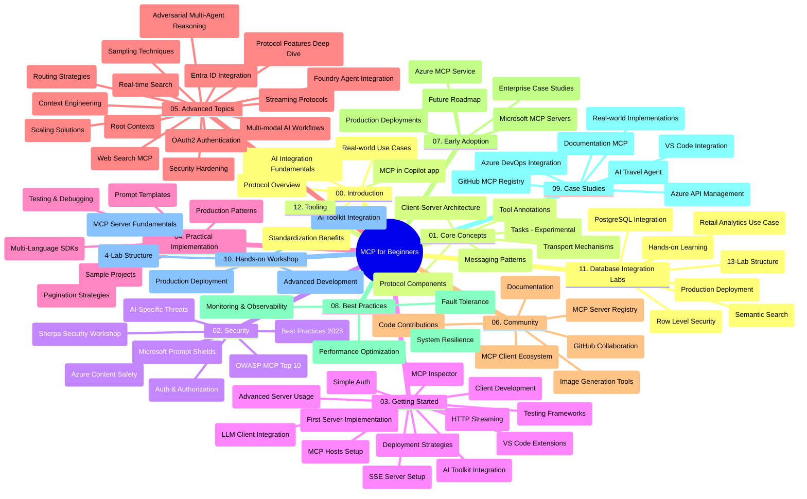

# ప్రారంభికుల కోసం మోడల్ కాంటెక్స్ట్ ప్రోటోకాల్ (MCP) - అధ్యయన గైడ్

ఈ అధ్యయన గైడ్ "ప్రారంభికుల కోసం మోడల్ కాంటెక్స్ట్ ప్రోటోకాల్ (MCP)" పాఠ్యచిత్రం కోసం రిపోజిటరీ నిర్మాణం మరియు కంటెంట్ పై సమీక్షను అందిస్తుంది. ఈ గైడ్‌ను ఉపయోగించి రిపోజిటరీని సమర్థవంతంగా నేవిగేట్ చేసి అందుబాటులో ఉన్న వనరులను అత్యుత్తమంగా వినియోగించుకోండి.

## రిపోజిటరీ అవలోకనం

మోడల్ కాంటెక్స్ట్ ప్రోటోకాల్ (MCP) అనేది AI మోడల్స్ మరియు క్లయింట్ అప్లికేషన్ల మధ్య పరస్పర క్రియల కోసం ఒక ప్రమాణీకృత ఫ్రేమ్‌వర్క్. ప్రారంభంలో Anthropic ద్వారా సృష్టించబడిన MCP ప్రస్తుతం అధికారిక GitHub సంస్థ ద్వారా MCP కమ్యూనిటీ వాయించిన నిర్వహణలో ఉంది. ఈ రిపోజిటరీ AI డెవలపర్లు, సిస్టమ్ ఆర్కిటెక్ట్లు, మరియు సాఫ్ట్‌వేర్ ఇంజనీర్‌ల కోసం C#, Java, JavaScript, Python, మరియు TypeScript భాషలలో హస్తప్రయోగ్య కోడ్ ఉదాహరణలతో సంపూర్ణ పాఠ్యచిత్రాన్ని అందిస్తుంది.

## దృష్టాంత పాఠ్యచిత్రపు మ్యాప్

## రిపోజిటరీ నిర్మాణం

రిపోజిటరీ పదకొండు ప్రధాన విభాగాలుగా విభజించబడింది, ప్రతి ఒక్కటి MCP యొక్క వివిధ అంశాలపై కేంద్రీకృతమైంది:

1. **పరిచయం (00-Introduction/)**
   - మోడల్ కాంటెక్స్ట్ ప్రోటోకాల్‌ అవలోకనం
   - AI పైప్లైన్లలో ప్రమాణీకరణ ఎందుకు ముఖ్యం
   - ప్రయోగిక ఉపయోగాలు మరియు లాభాలు

2. **ప్రధాన భావనలు (01-CoreConcepts/)**
   - క్లయింట్-సర్వర్ ఆర్కిటెక్చర్
   - కీలక ప్రోటోకాల్ భాగాలు
   - MCPలో సందేశ పంపిణీ నమూనాలు
   - ప్రస్తుత నిర్దిష్టత: [MCPలో ఏమి మారింది: 2026-07-28 నిర్దిష్టత](./01-CoreConcepts/mcp-2026-07-28.md) — స్టేట్లెస్ ప్రోటోకాల్ కోర్, ఎక్స్‌టెన్షన్స్ ఫ్రేమ్‌వర్క్, రూట్స్/సాంప్లింగ్/లాగింగ్ నిలిపివేతలు

3. **భద్రత (02-Security/)**
   - MCP ఆధారిత సిస్టములలో భద్రతా ముప్పులు
   - అమలు భద్రత కోసం ఉత్తమ పరిహారాలు
   - గుర్తింపు మరియు అంగీకార విధానాలు
   - హాత్-ఆన్ [CIMD మరియు DCR అంగీకార నమూనా](./02-Security/samples/cimd-dcr-auth/README.md)
   - **సంపూర్ణ భద్రతా డాక్యుమెంటేషన్**:
     - MCP భద్రతా ఉత్తమ పద్ధతులు
     - Azure కంటెంట్ సేఫ్టీ అమలు గైడ్
     - MCP భద్రతా నియంత్రణలు మరియు విధానాలు
     - MCP ఉత్తమ పద్ధతులు తక్షణ సూచిక
   - **కీలక భద్రతా అంశాలు**:
     - ప్రాంప్ట్ ఇంజెక్షన్ మరియు టూల్ పాయిజనింగ్ దాడులు
     - సెషన్ హైజాకింగ్ మరియు కలతపడి వెండితెక్కువ సమస్యలు
     - టోకెన్ పాస్‌తృ ఉండడం లో అలసత్వం
     - అధిక అనుమతులు మరియు యాక్సెస్ నియంత్రణ
     - AI భాగాల సరఫరా గొలుసు భద్రత
     - మైక్రోసాఫ్ట్ ప్రాంప్ట్ షీల్డ్స్ సమీకరణ

4. **ప్రారంభం (03-GettingStarted/)**
   - వాతావరణ ఏర్పాట్లు మరియు కాన్ఫిగరేషన్
   - ప్రాథమిక MCP సర్వర్లు మరియు క్లయింట్ల సృష్టి
   - ఉన్న అప్లికేషన్‌లతో సమన్వయం
   - క్రింది విభాగాలు ఉన్నాయి:
     - మొదటి సర్వర్ అమలు
     - 클యింట్ అభివృద్ధి
     - LLM క్లయింట్ సమీకరణ
     - VS కోడ్ సమీకరణ
     - సర్వర్-సెంటెడ్ ఈవెంట్స్ (SSE) సర్వర్
     - అధునాతన సర్వర్ వాడుక
     - HTTP స్ట్రీమింగ్
     - AI టూల్‌కిట్ సమీకరణ
     - పరీక్షలు నిర్వహణ విధానాలు
     - పంపిణీ మార్గదర్శకాలు

5. **ప్రయోజనాత్మక అమలు (04-PracticalImplementation/)**
   - వివిధ ప్రోగ్రామింగ్ భాషల్లో SDKలు వాడకం
   - డీబగ్గింగ్, పరీక్షలు, మరియు నిర్ధారణ చిట్కాలు
   - పునర్వినియోగ సాద్యమైన ప్రాంప్ట్ టెంప్లేట్లు మరియు పనితీరు వరుసలు రూపొందించడం
   - అమలు ఉదాహరణలతో నమూనా ప్రాజెక్టులు

6. **అధునాతన అంశాలు (05-AdvancedTopics/)**
   - కాంటెక్స్ట్ ఇంజనీరింగ్ విధానాలు
   - ఫౌండ్రి ఏజెంట్ సమీకరణ
   - బహుళ మోడ్ AI పని ప్రవాహాలు
   - OAuth2 గుర్తింపు డెమోలు
   - రియల్-టైమ్ శోధన సామర్థ్యం
   - రియల్-టైమ్ స్ట్రీమింగ్
   - రూట్ కాంటెక్స్ట్ అమలు
   - మార్గదర్శనం విధానాలు
   - నమూనా సేకరణ విధానాలు
   - స్కేలింగ్ పద్ధతులు
   - భద్రతా ఆలోచనలు
   - Entra ID భద్రతా సమీకరణ
   - వెబ్ శోధన సమీకరణ
   - వ్యతిరేక బహుళ ఏజెంట్ తర్కాలు (వాద వాదన నమూనాలు)

7. **కమ్యూనిటీ సహకారాలు (06-CommunityContributions/)**
   - కోడ్ మరియు డాక్యుమెంటేషన్ కు ఎలా సహకరించాలి
   - GitHub ద్వారా సహకారం
   - కమ్యూనిటీ ఆధారిత అభివృద్ధులు మరియు అభిప్రాయాలు
   - వివిధ MCP క్లయింట్‌లు (Claude డెస్క్‌టాప్, Cline, VSCode) వాడటం
   - చిత్ర సృష్టి సహా ప్రముఖ MCP సర్వర్లతో పని చేయడం

8. **ప్రారంభ దశ నుండి పాఠాలు (07-LessonsfromEarlyAdoption/)**
   - యథార్థ జీవితంలో అమలుబడి విజయ కథలు
   - MCP ఆధారిత పరిష్కారాల నిర్మాణం మరియు పంపిణీ
   - ధోరణులు మరియు భవిష్యత్తు మార్గదర్శకం
   - **Microsoft MCP సర్వర్లు గైడ్**: 10 ఉత్పత్తి-సిద్ధమైన Microsoft MCP సర్వర్లకు సంపూర్ణ గైడ్, అనగా:
     - Microsoft Learn Docs MCP సర్వర్
     - Azure MCP సర్వర్ (15+ ప్రత్యేక కనెక్టర్లతో)
     - GitHub MCP సర్వర్
     - Azure DevOps MCP సర్వర్
     - MarkItDown MCP సర్వర్
     - SQL సర్వర్ MCP సర్వర్
     - Playwright MCP సర్‌వర్
     - Dev Box MCP సర్వర్
     - Microsoft Foundry MCP సర్వర్
     - Microsoft 365 ఏజెంట్స్ టూల్‌కిట్ MCP సర్వర్

9. **ఉత్తమ పద్ధతులు (08-BestPractices/)**
   - పనితీరు సర్దుబాటు మరియు ఆప్టిమైజేషన్
   - లోప నిరోధక MCP సిస్టమ్ల రూపకల్పన
   - పరీక్షలు మరియు సహన వ్యూహాలు

10. **కేస్ అధ్యయనాలు (09-CaseStudy/)**
    - MCP యొక్క బహుముఖతను వివిధ సందర్భాల్లో ప్రదర్శించే **ఏడు సంపూర్ణ కేస్ అధ్యయనాలు**:
    - **Azure AI ట్రావెల్ ఏజెంట్స్**: Azure OpenAI మరియు AI శోధనతో బహుళ ఏజెంట్ ఆర్కెస్ట్రేషన్
    - **Azure DevOps సమీకరణ**: ఈయూట్యూబ్ డేటా నవీకరణలతో వర్క్‌ఫ్లో ఆటోమేషన్
    - **రియల్ టైమ్ డాక్యుమెంటేషన్ రిట్రీవల్**: Python కన్సోల్ క్లయింట్‌తో HTTP స్ట్రీమింగ్
    - **ఇంటరాక్టివ్ స్టడీ ప్లాన్ జనరేటర్**: చైన్‌లిట్ వెబ్ యాప్‌తో సంభాషణాత్మక AI
    - **సంపాదక డాక్యుమెంటేషన్**: GitHub Copilot వర్క్‌ఫ్లోలతో VS కోడ్ సమీకరణ
    - **Azure API మేనేజ్‌మెంట్**: ఎంటర్ప్రైజ్ API సమీకరణతో MCP సర్వర్ సృష్టి
    - **GitHub MCP రిజిస్ట్రి**: ఎకోసిస్టమ్ అభివృద్ధి మరియు ఏజెంటిక్ సమీకరణ వేదిక
    - ఎంటర్ప్రైజ్ సమీకరణ, డెవలపర్ ఉత్పాదకత, మరియు ఎకోసిస్టమ్ అభివృద్ధి కోసం అమలు ఉదాహరణలు

11. **హస్తప్రయోగ వర్క్‌షాప్ (10-StreamliningAIWorkflowsBuildingAnMCPServerWithAIToolkit/)**
    - MCPని AI టూల్‌కిట్‌తో కలిపిన సమగ్ర హస్తప్రయోగ వర్క్‌షాప్
    - AI మోడల్స్‌ని వాస్తవ ప్రపంచ సాధనాలతో అనుసంధానించే తెలివైన అప్లికేషన్లు తయారీ
    - మూలాలు, అనుకూల సర్వర్ అభివృద్ధి, మరియు ఉత్పత్తి పంపిణీ వ్యూహాలను కవర్ చేసే ప్రయోగాత్మక మాడ్యూల్లు
    - **ల్యాబ్ నిర్మాణం**:
      - ల్యాబ్ 1: MCP సర్వర్ మూలాలు
      - ల్యాబ్ 2: అధునాతన MCP సర్వర్ అభివృద్ధి
      - ల్యాబ్ 3: AI టూల్‌కిట్ సమీకరణ
      - ల్యాబ్ 4: ఉత్పత్తి పంపిణీ మరియు స్కేలింగ్
    - దశల వారీ సూచనలతో ల్యాబ్ ఆధారిత నేర్చుకోవడం

12. **MCP సర్వర్ డేటాబేస్ సమీకరణ ల్యాబ్‌లు (11-MCPServerHandsOnLabs/)**
    - PostgreSQL సమీకరణతో ఉత్పత్తి-సిద్ధ MCP సర్వర్లను నిర్మించేందుకు **సంపూర్ణ 13-ల్యాబ్‌ నేర్చుకునే మార్గం**
    - **వాస్తవ రీటైల్ అనలిటిక్స్ అమలు** Zava రీటైల్ ఉపయోగ కేసుతో
    - **ఎంటర్ప్రైజ్-గ్రేడ్ నమూనాలు**: రో స్థాయి భద్రత (RLS), సేమాంటిక్ శోధన, మరియు బహుళ-టెనెంట్ డేటా యాక్సెస్
    - **సంపూర్ణ ల్యాబ్ నిర్మాణం**:
      - **ల్యాబ్‌లు 00-03: పునాది** - పరిచయం, ఆర్కిటెక్చర్, భద్రత, వాతావరణ సెటప్
      - **ల్యాబ్‌లు 04-06: MCP సర్వర్ నిర్మాణం** - డేటాబేస్ రూపకల్పన, MCP సర్వర్ అమలు, టూల్ అభివృద్ధి
      - **ల్యాబ్‌లు 07-09: అధునాతన లక్షణాలు** - సేమాంటిక్ శోధన, పరీక్షలు & డీబగ్గింగ్, VS కోడ్ సమీకరణ
      - **ల్యాబ్‌లు 10-12: ఉత్పత్తి & ఉత్తమ పద్ధతులు** - పంపిణీ, పర్యవేక్షణ, ఆప్టిమైజేషన్
    - **తెలుసుకోవాల్సిన సాంకేతికతలు**: FastMCP ఫ్రేమ్‌వర్క్, PostgreSQL, Azure OpenAI, Azure కంటైనర్ యాప్స్, అప్లికేషన్ ఇన్సైట్స్
    - **నగదు అవుట్‌పుట్స్**: ఉత్పత్తి-సిద్ధ MCP సర్వర్లు, డేటాబేస్ సమీకరణ నమూనాలు, AI ఆధారిత అనలిటిక్స్, ఎంటర్ప్రైజ్ భద్రత

13. **సాధనాలు (12-tooling/)**
    - MCPని Copilot యాప్ మరియు ఇతర సాధనాలలో ఎలా ఉపయోగించాలో నేర్చుకోండి

## అదనపు వనరులు

రిపోజిటరీలో సపోర్టింగ్ వనరులు ఉన్నాయి:

- **చిత్రాల ఫోల్డర్**: పాఠ్యచిత్రం అంతటా ఉపయోగించేార్చిన డైవాగ్రాములు మరియు చిత్రాలు
- **అనువాదాలు**: డాక్యుమెంటేషన్ యొక్క బహుళ భాషల మద్దతుతో స్వయంచాలక అనువాదాలు
- **అధికారిక MCP వనరులు**:
  - [MCP డాక్యుమెంటేషన్](https://modelcontextprotocol.io/)
  - [MCP నిర్దిష్టత](https://modelcontextprotocol.io/specification/2026-07-28/)
  - [MCP GitHub రిపోజిటరీ](https://github.com/modelcontextprotocol)

## ఈ రిపోజిటరీ ఎలా ఉపయోగించాలి

1. **క్రమం తప్పకుండా నేర్చుకోవడం**: నిర్మిత పాఠ్య అనుభవానికి (00 నుండి 11 వరకు) అధ్యాయాలను క్రమంగా అనుసరించండి.
2. **భాష-ప్రత్యేక కేంద్రీకరణ**: మీరు ఇష్టపడే ప్రోగ్రామింగ్ భాషలో అమలు కోసం నమూనా డైరెక్టరీలను అన్వేషించండి.
3. **ప్రయోజనాత్మక అమలు**: మీ వాతావరణాన్ని సెట్ చేసుకుని మొదటి MCP సర్వరు మరియు క్లయింట్ సృష్టించడానికి "ప్రారంభం" విభాగంతో ప్రారంభించండి.
4. **అధునాతన అన్వేషణ**: బేసిక్స్‌తో పరిచయమైన తర్వాత, మీ జ్ఞానాన్ని విస్తరించడానికి అధునాతన అంశాల లోకు నెమ్మదిగా ప్రవేశించండి.
5. **కమ్యూనిటీ సదస్సులు**: MCP కమ్యూనిటీతో జట్టు కలసి GitHub చర్చలు మరియు Discord ఛానెల్స్ ద్వారా నిపుణుల మరియు ఇతర డెవలపర్లతో కలసి పనిచేయండి.

## MCP క్లయింట్లు మరియు సాధనాలు

పాఠ్యచిత్రం వివిధ MCP క్లయింట్లు మరియు సాధనాలను కవర్ చేస్తుంది:

1. **అధికారిక క్లయింట్లు**:
   - Visual Studio Code
   - Visual Studio Code లో MCP
   - Claude డెస్క్‌టాప్
   - VSCode లో Claude 
   - Claude API

2. **కమ్యూనిటీ క్లయింట్లు**:
   - Cline (టెర్మినల్ ఆధారిత)
   - Cursor (కోడ్ ఎడిటర్)
   - ChatMCP
   - Windsurf

3. **MCP నిర్వహణ సాధనాలు**:
   - MCP CLI
   - MCP మేనేజర్
   - MCP లింకర్
   - MCP రౌటర్

## ప్రముఖ MCP సర్వర్లు

రిపోజిటరీ వివిధ MCP సర్వర్లను పరిచయం చేస్తుంది, ఇవి:

1. **అధికారిక Microsoft MCP సర్వర్లు**:
   - Microsoft Learn Docs MCP సర్వర్
   - Azure MCP సర్వర్ (15+ ప్రత్యేక కనెక్టర్లు)
   - GitHub MCP సర్వర్
   - Azure DevOps MCP సర్వర్
   - MarkItDown MCP సర్వర్
   - SQL సర్వర్ MCP సర్వర్
   - Playwright MCP సర్వర్
   - Dev Box MCP సర్వర్
   - Microsoft Foundry MCP సర్వర్
   - Microsoft 365 ఏజెంట్స్ టూల్‌కిట్ MCP సర్వర్

2. **అధికారిక సూచిక సర్వర్లు**:
   - ఫైల్‌సిస్టమ్
   - Fetch
   - మెమరీ
   - సీక్వెన్షియల్ థింకింగ్

3. **చిత్ర సృష్టి**:
   - Azure OpenAI DALL-E 3
   - స్టేబుల్ డిఫ్యూషన్ వెబ్ UI
   - రిప్లికేట్

4. **అభివృద్ధి సాధనాలు**:
   - Git MCP
   - టెర్మినల్ కంట్రోల్
   - కోడ్ సహయోగి

5. **ప్రత్యేక సర్వర్లు**:
   - Salesforce
   - Microsoft Teams
   - Jira & Confluence

## సహకారం

ఈ రిపోజిటరీ కమ్యూనిటీ నుంచి సహకారాలను స్వాగతిస్తుంది. MCP ఎకోసిస్టమ్‌కు సమర్థవంతంగా ఎలా సహకరించాలో గైడ్ కోసం కమ్యూనిటీ సహకారాల విభాగాన్ని చూడండి.

----

*ఈ అధ్యయన గైడ్ చివరిసారిగా సెప్టెంబర్ 9, 2026 న నవీకరించబడింది. ఇది MCP
నిర్దిష్టత `2026-07-28` కు సంబంధించి ప్రస్తుత ప్రోటోకాల్ సవరణను ప్రతిబింబిస్తుంది. కొంత హస్తప్రయోగ్య
ఉదాహరణలు స్పష్టంగా `2025-11-25` కు వెర్షనింగ్ చేయబడి ఉన్నప్పటికీ వాటి SDKలు మరియు సాధనాలు
స్టేట్లెస్ ప్రోటోకాల్ APIలను దత్తత తీసుకుంటున్నాయి.*

---

<!-- CO-OP TRANSLATOR DISCLAIMER START -->
**అస్వీకరణ**:
ఈ పత్రం AI అనువాద సేవ [Co-op Translator](https://github.com/Azure/co-op-translator) ఉపయోగించి అనువదించబడింది. మేము ఖచ్చితత్వానికి ప్రయత్నిస్తున్నప్పటికీ, ఆటోమేటెడ్ అనువాదాలు తప్పులు లేదా అసమగ్రతలను కలిగి ఉండవచ్చు. దాని స్వదేశ భాషలో ఉన్న అసలు పత్రాన్ని అధికారం కలిగిన మూలంగా పరిగణించాలి. కీలకమైన సమాచారం కోసం, ప్రొఫెషనల్ మానవ అనువాదాన్ని సిఫారసు చేస్తాము. ఈ అనువాదం ఉపయోగం వల్ల కలిగే ఏవైనా అపార్థాలు లేదా తప్పుదారులు కోసం మేము బాధ్యత వహించము.
<!-- CO-OP TRANSLATOR DISCLAIMER END -->