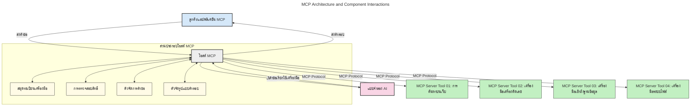
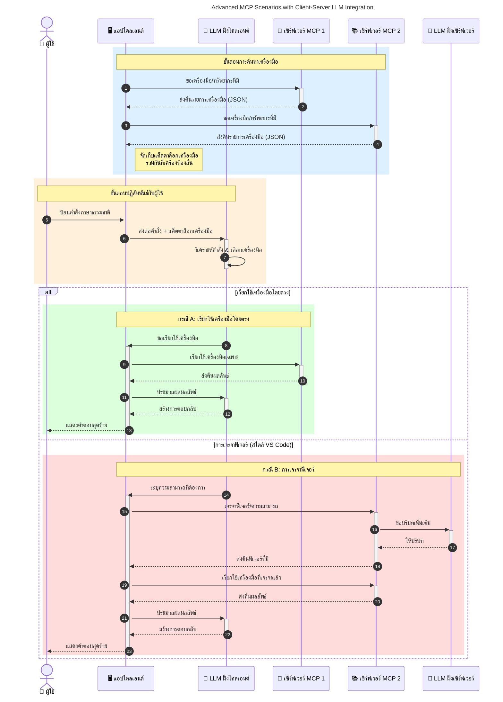

# บทนำสู่โปรโตคอลบริบทโมเดล (MCP): ทำไมจึงสำคัญสำหรับแอปพลิเคชัน AI ที่ปรับขนาดได้

[](https://youtu.be/agBbdiOPLQA)

_(คลิกที่รูปภาพข้างบนเพื่อดูวิดีโอของบทเรียนนี้)_

แอปพลิเคชันปัญญาประดิษฐ์เชิงสร้างสรรค์เป็นก้าวใหญ่ในด้านนี้เนื่องจากช่วยให้ผู้ใช้สามารถโต้ตอบกับแอปโดยใช้ข้อความภาษาธรรมชาติ อย่างไรก็ตามเมื่อมีการลงทุนเพิ่มขึ้นทั้งในด้านเวลาและทรัพยากรสำหรับแอปเหล่านี้ คุณต้องมั่นใจว่าสามารถผสานรวมฟังก์ชันและทรัพยากรได้อย่างง่ายดายในลักษณะที่ขยายตัวได้ แอปของคุณต้องสามารถรองรับโมเดลมากกว่าหนึ่งโมเดลที่ถูกใช้ และจัดการความซับซ้อนของโมเดลต่าง ๆ ได้ กล่าวโดยสั้น ๆ การสร้างแอป AI เชิงสร้างสรรค์เริ่มต้นง่าย แต่เมื่อแอปเติบโตและซับซ้อนมากขึ้น คุณจำเป็นต้องเริ่มกำหนดสถาปัตยกรรมและน่าจะต้องพึ่งพามาตรฐานเพื่อให้แน่ใจว่าแอปของคุณถูกสร้างในรูปแบบที่สม่ำเสมอ ที่นี่เอง MCP จึงเข้ามาช่วยจัดระเบียบและให้มาตรฐาน

---

## **🔍 โปรโตคอลบริบทโมเดล (MCP) คืออะไร?**

**โปรโตคอลบริบทโมเดล (MCP)** คือ **อินเทอร์เฟซเปิดที่เป็นมาตรฐาน** ที่ช่วยให้โมเดลภาษาใหญ่ (LLMs) สามารถเชื่อมต่อและทำงานร่วมกับเครื่องมือภายนอก API และแหล่งข้อมูลต่าง ๆ ได้อย่างราบรื่น มันมอบสถาปัตยกรรมที่สม่ำเสมอเพื่อเพิ่มประสิทธิภาพของโมเดล AI ให้เกินกว่าข้อมูลการฝึกอบรม เปิดโอกาสให้ระบบ AI ฉลาดขึ้น ปรับขนาดได้ และตอบสนองได้ดีขึ้น

---

## **🎯 ทำไมการมีมาตรฐานใน AI จึงสำคัญ**

เมื่อแอปพลิเคชัน AI เชิงสร้างสรรค์ซับซ้อนมากขึ้น การนำมาตรฐานมาใช้จึงเป็นสิ่งจำเป็นเพื่อให้แน่ใจว่า **สามารถปรับขนาดได้, ขยายได้, ดูแลรักษาง่าย** และ **หลีกเลี่ยงการถูกล็อกให้อยู่กับผู้จำหน่ายเพียงรายเดียว** MCP ช่วยตอบโจทย์เหล่านี้โดย:

- รวมการเชื่อมต่อระหว่างโมเดลกับเครื่องมือเป็นหนึ่งเดียว
- ลดการแก้ปัญหาแบบเฉพาะกิจที่เปราะบาง
- อนุญาตให้โมเดลหลายรุ่นจากผู้จำหน่ายต่าง ๆ อยู่ร่วมกันในระบบนิเวศเดียว

**หมายเหตุ:** แม้ MCP จะโปรโมตตัวเองว่าเป็นมาตรฐานเปิด แต่ไม่มีแผนที่จะทำให้ MCP เป็นมาตรฐานผ่านองค์กรมาตรฐานใด ๆ เช่น IEEE, IETF, W3C, ISO หรือองค์กรมาตรฐานอื่นใด

---

## **📚 วัตถุประสงค์การเรียนรู้**

เมื่อคุณอ่านบทความนี้จบ คุณจะสามารถ:

- นิยาม **โปรโตคอลบริบทโมเดล (MCP)** และกรณีการใช้งานของมัน
- เข้าใจว่าการสื่อสารระหว่างโมเดลกับเครื่องมือใน MCP เป็นมาตรฐานอย่างไร
- ระบุส่วนประกอบหลักของสถาปัตยกรรม MCP
- สำรวจตัวอย่างการใช้งานจริงของ MCP ในองค์กรและบริบทการพัฒนา

---

## **💡 ทำไมโปรโตคอลบริบทโมเดล (MCP) จึงเป็นเกมเชนเจอร์**

### **🔗 MCP แก้ปัญหาการแยกส่วนในการโต้ตอบ AI**

ก่อน MCP การรวมโมเดลเข้ากับเครื่องมือต้องใช้:

- โค้ดเฉพาะสำหรับแต่ละคู่มือตัว-โมเดล
- API ที่ไม่เป็นมาตรฐานสำหรับแต่ละผู้จำหน่าย
- ขัดข้องบ่อยเนื่องจากการอัปเดต
- ขยายขนาดได้ไม่ดีเมื่อมีเครื่องมือเพิ่มขึ้น

### **✅ ประโยชน์ของการใช้มาตรฐาน MCP**

| **ประโยชน์**               | **รายละเอียด**                                                               |
|--------------------------|-------------------------------------------------------------------------------|
| ความสามารถทำงานร่วมกัน  | LLM ทำงานร่วมกับเครื่องมือจากผู้จัดจำหน่ายต่างๆ ได้อย่างราบรื่น           |
| ความสม่ำเสมอ              | พฤติกรรมที่เหมือนกันในแพลตฟอร์มและเครื่องมือต่าง ๆ                        |
| การนำกลับมาใช้ใหม่         | เครื่องมือที่สร้างครั้งเดียวสามารถใช้ได้ในหลายโปรเจกต์และระบบ             |
| การพัฒนาที่เร่งเร็วขึ้น    | ลดเวลาพัฒนาโดยใช้อินเทอร์เฟซมาตรฐานที่เสียบใช้งานได้เลย                    |

---

## **🧱 ภาพรวมสถาปัตยกรรม MCP ระดับสูง**

MCP ใช้โมเดล **ไคลเอนต์-เซิร์ฟเวอร์** โดย:

- **MCP Hosts** รันโมเดล AI
- **MCP Clients** เริ่มคำขอ
- **MCP Servers** ให้บริการบริบท เครื่องมือ และความสามารถ

### **ส่วนประกอบหลัก:**

- **ทรัพยากร** – ข้อมูลแบบคงที่หรือแบบไดนามิกสำหรับโมเดล  
- **พรอมต์** – กระบวนการงานที่กำหนดไว้ล่วงหน้าสำหรับการสร้างเนื้อหาที่มีการแนะนำ  
- **เครื่องมือ** – ฟังก์ชันที่ดำเนินการได้ เช่น การค้นหา การคำนวณ  
- **การสุ่มตัวอย่าง** – พฤติกรรมตัวแทนผ่านการโต้ตอบแบบวนซ้ำ (เลิกใช้ใน
    MCP `2026-07-28`; การใช้งานใหม่น่าจะผสานโดยตรงกับผู้ให้บริการ LLM)

- **การขอข้อมูล** – คำขอที่เซิร์ฟเวอร์ริเริ่มให้รับข้อมูลจากผู้ใช้
- **รากฐาน** – ตำแหน่งระบบไฟล์ที่เป็นข้อมูลสำคัญสำหรับเซิร์ฟเวอร์
    (เลิกใช้ใน MCP `2026-07-28`; แนะนำให้ใช้พารามิเตอร์เครื่องมือ, URI ของทรัพยากร หรือ
    การตั้งค่าเซิร์ฟเวอร์แทน)

### **สถาปัตยกรรมโปรโตคอล:**

MCP ใช้สถาปัตยกรรมสองชั้น:
- **เลเยอร์ข้อมูล**: ข้อความ JSON-RPC 2.0, เมตาดาต้าของแต่ละคำขอ, การค้นหา และ
    อุปกรณ์พื้นฐานของโปรโตคอล
- **เลเยอร์ขนส่ง**: stdio สำหรับกระบวนการย่อยในเครื่อง และ Streamable HTTP สำหรับ
    เซิร์ฟเวอร์ระยะไกล Streamable HTTP สามารถใช้การกรอบ SSE สำหรับการตอบสนองแบบสตรีม,
    แต่การขนส่งแบบ HTTP+SSE เก่าถูกเลิกใช้

---

## วิธีการทำงานของ MCP Servers

MCP Servers ทำงานดังนี้:

- **ลำดับคำขอ**:
    1. คำขอถูกเริ่มโดยผู้ใช้ปลายทางหรือซอฟต์แวร์ในนามของผู้ใช้
    2. **MCP Client** ส่งคำขอนั้นไปยัง **MCP Host** ซึ่งจัดการสภาพแวดล้อมรันไทม์ของโมเดล AI
    3. **โมเดล AI** รับพรอมต์จากผู้ใช้และอาจขอเข้าถึงเครื่องมือหรือข้อมูลภายนอกผ่านการเรียกเครื่องมือหนึ่งครั้งขึ้นไป
    4. **MCP Host** ซึ่งไม่ใช่ตัวโมเดลโดยตรง จะสื่อสารกับ **MCP Server(s)** ที่เหมาะสมโดยใช้โปรโตคอลมาตรฐาน
- **ฟังก์ชันของ MCP Host**:
    - **ทะเบียนเครื่องมือ**: เก็บรายการเครื่องมือและความสามารถที่มี
    - **การพิสูจน์ตัวตน**: ตรวจสอบสิทธิ์การเข้าถึงเครื่องมือ
    - **ตัวจัดการคำขอ**: ประมวลผลคำขอเครื่องมือจากโมเดล
    - **ตัวจัดรูปแบบคำตอบ**: จัดโครงสร้างผลลัพธ์ของเครื่องมือให้อยู่ในรูปแบบที่โมเดลเข้าใจได้
- **การทำงานของ MCP Server**:
    - **MCP Host** ส่งคำขอเครื่องมือไปยัง **MCP Servers** หนึ่งหรือมากกว่า ซึ่งแต่ละเซิร์ฟเวอร์ให้ฟังก์ชันพิเศษ เช่น การค้นหา การคำนวณ การสืบค้นฐานข้อมูล
    - **MCP Servers** ดำเนินการและส่งผลลัพธ์กลับไปยัง **MCP Host** ในรูปแบบที่สม่ำเสมอ
    - **MCP Host** จัดรูปแบบและส่งต่อผลลัพธ์เหล่านี้ไปยัง **โมเดล AI**
- **การตอบสนองเสร็จสิ้น**:
    - **โมเดล AI** รวมข้อมูลผลลัพธ์เครื่องมือเข้าเป็นคำตอบสุดท้าย
    - **MCP Host** ส่งคำตอบนี้กลับไปยัง **MCP Client** ซึ่งส่งต่อให้กับผู้ใช้ปลายทางหรือซอฟต์แวร์เรียกใช้
    



## 👨‍💻 วิธีสร้าง MCP Server (พร้อมตัวอย่าง)

MCP Servers ช่วยให้คุณขยายความสามารถของ LLM โดยการให้ข้อมูลและฟังก์ชันการทำงาน

พร้อมลองใช้งานหรือยัง? นี่คือ SDK สำหรับภาษาและ/หรือสแตกต่าง ๆ พร้อมตัวอย่างการสร้าง MCP Servers ง่าย ๆ ในภาษาต่าง ๆ:

- **Python SDK**: https://github.com/modelcontextprotocol/python-sdk

- **TypeScript SDK**: https://github.com/modelcontextprotocol/typescript-sdk

- **Java SDK**: https://github.com/modelcontextprotocol/java-sdk

- **C#/.NET SDK**: https://github.com/modelcontextprotocol/csharp-sdk


## 🌍 กรณีการใช้งานจริงของ MCP

MCP ช่วยให้มีแอปพลิเคชันที่หลากหลายโดยการขยายความสามารถของ AI:

| **แอปพลิเคชัน**            | **รายละเอียด**                                                              |
|------------------------------|----------------------------------------------------------------------------|
| การรวมข้อมูลองค์กร        | เชื่อม LLM กับฐานข้อมูล, CRM หรือเครื่องมือภายในองค์กร                   |
| ระบบ AI แบบตัวแทน         | เปิดใช้งานตัวแทนอัตโนมัติที่มีการเข้าถึงเครื่องมือและกระบวนงานตัดสินใจ  |
| แอปมัลติโหมด              | รวมเครื่องมือข้อความ รูปภาพ และเสียงในแอป AI เดียว                      |
| การรวมข้อมูลแบบเรียลไทม์  | นำข้อมูลสดเข้าสู่การโต้ตอบ AI เพื่อผลลัพธ์ที่แม่นยำและเป็นปัจจุบันกว่า    |


### 🧠 MCP = มาตรฐานสากลสำหรับการโต้ตอบ AI

โปรโตคอลบริบทโมเดล (MCP) ทำหน้าที่เป็นมาตรฐานสากลสำหรับการโต้ตอบใน AI เหมือนกับที่ USB-C เป็นมาตรฐานสำหรับการเชื่อมต่ออุปกรณ์ทางกายภาพ ในโลกของ AI MCP ให้อินเทอร์เฟซที่สม่ำเสมอ ช่วยให้โมเดล (ไคลเอนต์) สามารถผสานรวมอย่างราบรื่นกับเครื่องมือและผู้ให้บริการข้อมูลภายนอก (เซิร์ฟเวอร์) ซึ่งช่วยขจัดความจำเป็นที่ต้องมีโปรโตคอลแบบต่าง ๆ เฉพาะตัวสำหรับแต่ละ API หรือแหล่งข้อมูล

ภายใต้ MCP เครื่องมือที่เข้ากันได้กับ MCP (เรียกว่า MCP server) จะปฏิบัติตามมาตรฐานเดียวกัน เซิร์ฟเวอร์เหล่านี้สามารถแสดงรายการเครื่องมือหรือการกระทำที่ให้บริการและดำเนินการตามคำขอได้เมื่อได้รับคำสั่งจากตัวแทน AI แพลตฟอร์มตัวแทน AI ที่รองรับ MCP สามารถค้นหาเครื่องมือที่มีอยู่จากเซิร์ฟเวอร์และเรียกใช้งานผ่านโปรโตคอลมาตรฐานนี้ได้

### 💡 ช่วยอำนวยความสะดวกในการเข้าถึงความรู้

นอกจากการให้เครื่องมือแล้ว MCP ยังช่วยให้เข้าถึงความรู้ได้อีกด้วย มันช่วยให้แอปพลิเคชันสามารถให้บริบทกับโมเดลภาษาใหญ่ (LLMs) โดยเชื่อมต่อพวกเขากับแหล่งข้อมูลต่าง ๆ เช่น MCP server อาจเป็นตัวแทนของที่เก็บเอกสารของบริษัท ช่วยให้ตัวแทนสามารถดึงข้อมูลที่เกี่ยวข้องตามต้องการ เซิร์ฟเวอร์อีกตัวอาจดูแลการส่งอีเมลหรืออัปเดตข้อมูลจากบันทึก ในมุมมองของตัวแทน พวกมันเป็นแค่เครื่องมือที่ใช้ได้ บางเครื่องมือส่งคืนข้อมูล (บริบทความรู้) ในขณะที่บางเครื่องมือทำหน้าที่ปฏิบัติการ MCP จัดการทั้งสองอย่างได้อย่างมีประสิทธิภาพ

ตัวแทนที่เชื่อมต่อกับ MCP server จะเรียนรู้ความสามารถและข้อมูลที่เข้าถึงได้โดยอัตโนมัติผ่านรูปแบบมาตรฐาน การกำหนดมาตรฐานนี้ช่วยให้เครื่องมือพร้อมใช้งานแบบไดนามิก เช่น การเพิ่ม MCP server ใหม่เข้าระบบของตัวแทนจะทำให้ฟังก์ชันของเซิร์ฟเวอร์นั้นพร้อมใช้งานทันทีโดยไม่ต้องปรับแต่งคำสั่งของตัวแทนเพิ่มเติม

การผสานการทำงานอย่างราบรื่นนี้สอดคล้องกับคำอธิบายในแผนภาพด้านล่าง ที่เซิร์ฟเวอร์จัดหาเครื่องมือและความรู้เพื่อให้ทำงานร่วมกันได้อย่างไร้รอยต่อในระบบต่าง ๆ

### 👉 ตัวอย่าง: โซลูชันตัวแทนที่ปรับขนาดได้

```mermaid
---
title: Scalable Agent Solution with MCP
description: A diagram illustrating how a user interacts with an LLM that connects to multiple MCP servers, with each server providing both knowledge and tools, creating a scalable AI system architecture
---
graph TD
    User -->|คำร้องขอ| LLM
    LLM -->|การตอบกลับ| User
    LLM -->|MCP| ServerA
    LLM -->|MCP| ServerB
    ServerA -->|ตัวเชื่อมต่อสากล| ServerB
    ServerA --> KnowledgeA
    ServerA --> ToolsA
    ServerB --> KnowledgeB
    ServerB --> ToolsB

    subgraph เซิร์ฟเวอร์ A
        KnowledgeA[ความรู้]
        ToolsA[เครื่องมือ]
    end

    subgraph เซิร์ฟเวอร์ B
        KnowledgeB[ความรู้]
        ToolsB[เครื่องมือ]
    end
```
Universal Connector ช่วยให้ MCP servers สื่อสารและแชร์ความสามารถกันเอง ทำให้ ServerA สามารถมอบหมายงานให้ ServerB หรือนำเครื่องมือและข้อมูลมาใช้จาก ServerB ได้ ซึ่งช่วยรวมเครื่องมือและข้อมูลระหว่างเซิร์ฟเวอร์หลายตัว สนับสนุนสถาปัตยกรรมตัวแทนที่ปรับขนาดและแยกส่วนได้ เนื่องจาก MCP มาตรฐานในการเปิดเผยเครื่องมือ ตัวแทนจึงสามารถค้นหาและส่งคำขอระหว่างเซิร์ฟเวอร์ได้แบบไดนามิกโดยไม่ต้องมีการผสานแบบเขียนโค้ดตายตัว


การรวมเครื่องมือและความรู้: เครื่องมือและข้อมูลสามารถเข้าถึงได้ข้ามเซิร์ฟเวอร์ ช่วยสนับสนุนสถาปัตยกรรมตัวแทนแบบปรับขนาดและโมดูลาร์มากขึ้น

### 🔄 สถานการณ์ขั้นสูงของ MCP กับการผสานรวม LLM ฝั่งไคลเอนต์

นอกเหนือจากสถาปัตยกรรม MCP พื้นฐาน ยังมีสถานการณ์ขั้นสูงที่ทั้งไคลเอนต์และเซิร์ฟเวอร์มี LLM ช่วยให้เกิดปฏิสัมพันธ์ที่ซับซ้อนมากขึ้น ในแผนภาพถัดไป **Client App** อาจเป็น IDE ที่มีเครื่องมือ MCP ให้ LLM ใช้งานจำนวนมาก:



## 🔐 ประโยชน์ในทางปฏิบัติของ MCP

นี่คือประโยชน์ในทางปฏิบัติของการใช้ MCP:

- **ความสดใหม่**: โมเดลเข้าถึงข้อมูลที่อัปเดตเกินกว่าข้อมูลการฝึกอบรม
- **การขยายความสามารถ**: โมเดลใช้เครื่องมือเฉพาะทางสำหรับงานที่ไม่ได้ฝึกมาโดยตรง
- **ลดการสร้างเรื่องผิดๆ**: แหล่งข้อมูลภายนอกให้ข้อมูลข้อเท็จจริงที่น่าเชื่อถือ
- **ความเป็นส่วนตัว**: ข้อมูลที่ละเอียดอ่อนสามารถเก็บไว้ในสภาพแวดล้อมที่ปลอดภัยแทนที่จะฝังในพรอมต์

## 📌 สรุปข้อควรรู้

นี่คือข้อควรรู้สำคัญสำหรับการใช้ MCP:

- **MCP** กำหนดมาตรฐานสำหรับการโต้ตอบระหว่างโมเดล AI กับเครื่องมือและข้อมูล
- ส่งเสริม **ความสามารถขยายตัว ความสม่ำเสมอ และการทำงานร่วมกัน**
- MCP ช่วย **ลดเวลาการพัฒนา ปรับปรุงความน่าเชื่อถือ และขยายความสามารถของโมเดล**
- สถาปัตยกรรมไคลเอนต์-เซิร์ฟเวอร์ **ช่วยให้แอป AI ยืดหยุ่นและขยายตัวได้ง่าย**

## 🧠 แบบฝึกหัด

ลองคิดถึงแอป AI ที่คุณสนใจจะสร้าง

- เครื่องมือหรือข้อมูลภายนอกใดที่ช่วยเพิ่มความสามารถได้บ้าง?
- MCP จะช่วยให้การผสานรวมง่ายและเชื่อถือได้มากขึ้นได้อย่างไร?

## แหล่งข้อมูลเพิ่มเติม

- [MCP GitHub Repository](https://github.com/modelcontextprotocol)


## ต่อไป

ต่อไป: [บทที่ 1: แนวคิดหลัก](../01-CoreConcepts/README.md)

---

<!-- CO-OP TRANSLATOR DISCLAIMER START -->
**ปฏิเสธความรับผิดชอบ**:
เอกสารนี้ได้รับการแปลโดยใช้บริการแปลภาษา AI [Co-op Translator](https://github.com/Azure/co-op-translator) ขณะที่เราพยายามให้ความถูกต้อง โปรดทราบว่าการแปลโดยอัตโนมัติอาจมีข้อผิดพลาดหรือความไม่ถูกต้อง เอกสารต้นฉบับในภาษาต้นทางควรถูกพิจารณาเป็นแหล่งข้อมูลที่เชื่อถือได้ สำหรับข้อมูลที่สำคัญ แนะนำให้ใช้การแปลโดยมนุษย์มืออาชีพ เราไม่รับผิดชอบต่อความเข้าใจผิดหรือการตีความที่ผิดพลาดที่เกิดขึ้นจากการใช้การแปลนี้
<!-- CO-OP TRANSLATOR DISCLAIMER END -->