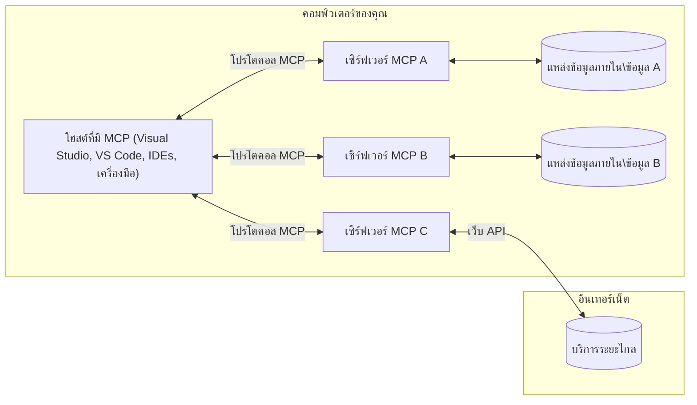

# MCP Core Concepts: การเชี่ยวชาญโปรโตคอลบริบทของโมเดลสำหรับการรวม AI

[](https://youtu.be/earDzWGtE84)

_(คลิกที่ภาพด้านบนเพื่อดูวิดีโอของบทเรียนนี้)_

[Model Context Protocol (MCP)](https://github.com/modelcontextprotocol) คือกรอบงานมาตรฐานที่ทรงพลังซึ่งเพิ่มประสิทธิภาพการสื่อสารระหว่าง Large Language Models (LLMs) กับเครื่องมือ แอปพลิเคชัน และแหล่งข้อมูลภายนอก  
คู่มือนี้จะพาคุณผ่านแนวคิดหลักของ MCP คุณจะได้เรียนรู้เกี่ยวกับสถาปัตยกรรมไคลเอนต์-เซิร์ฟเวอร์ ส่วนประกอบสำคัญ กลไกการสื่อสาร และแนวทางปฏิบัติที่ดีที่สุดในการใช้งาน

- **ความยินยอมของผู้ใช้ที่ชัดเจน**: การเข้าถึงข้อมูลและการดำเนินการทั้งหมดต้องได้รับการอนุมัติจากผู้ใช้อย่างชัดเจนก่อนดำเนินการ ผู้ใช้ต้องเข้าใจอย่างชัดเจนว่าจะเข้าถึงข้อมูลใดและจะดำเนินการอะไร พร้อมการควบคุมสิทธิ์และการอนุญาตอย่างละเอียด

- **การปกป้องความเป็นส่วนตัวของข้อมูล**: ข้อมูลของผู้ใช้จะถูกเปิดเผยเฉพาะเมื่อได้รับความยินยอมอย่างชัดเจนและต้องได้รับการปกป้องด้วยการควบคุมการเข้าถึงที่เข้มงวดตลอดวงจรชีวิตของการโต้ตอบ การใช้งานต้องป้องกันการส่งข้อมูลโดยไม่ได้รับอนุญาตและรักษาขอบเขตความเป็นส่วนตัวอย่างเข้มงวด

- **ความปลอดภัยในการเรียกใช้เครื่องมือ**: การเรียกใช้เครื่องมือแต่ละครั้งต้องได้รับความยินยอมจากผู้ใช้อย่างชัดเจนโดยเข้าใจฟังก์ชันการทำงานของเครื่องมือ พารามิเตอร์ และผลกระทบที่อาจเกิดขึ้น ขอบเขตความปลอดภัยที่เข้มงวดต้องป้องกันการเรียกใช้เครื่องมือที่ไม่ตั้งใจ ไม่ปลอดภัย หรือเป็นอันตราย

- **ความปลอดภัยของชั้นการขนส่ง**: ช่องทางการสื่อสารทั้งหมดควรใช้การเข้ารหัสและกลไกการตรวจสอบสิทธิ์ที่เหมาะสม การเชื่อมต่อระยะไกลควรใช้โปรโตคอลการขนส่งที่ปลอดภัยและการจัดการข้อมูลรับรองที่เหมาะสม

#### แนวทางการใช้งาน:

- **การจัดการสิทธิ์**: ใช้ระบบสิทธิ์ละเอียดที่อนุญาตให้ผู้ใช้ควบคุมเซิร์ฟเวอร์ เครื่องมือ และทรัพยากรที่เข้าถึงได้  
- **การตรวจสอบสิทธิ์และการอนุญาต**: ใช้วิธีการตรวจสอบสิทธิ์ที่ปลอดภัย (OAuth, API keys) พร้อมการจัดการโทเค็นและการหมดอายุอย่างเหมาะสม  
- **การตรวจสอบข้อมูลนำเข้า**: ตรวจสอบพารามิเตอร์และข้อมูลนำเข้าทั้งหมดตามสคีมาที่กำหนดเพื่อป้องกันการโจมตีแบบฉีดข้อมูล  
- **การบันทึกตรวจสอบ**: รักษาบันทึกการดำเนินการทั้งหมดอย่างครบถ้วนเพื่อการตรวจสอบความปลอดภัยและการปฏิบัติตามข้อกำหนด

## ภาพรวม

บทเรียนนี้สำรวจสถาปัตยกรรมพื้นฐานและส่วนประกอบที่ประกอบเป็นระบบนิเวศของ Model Context Protocol (MCP) คุณจะได้เรียนรู้เกี่ยวกับสถาปัตยกรรมไคลเอนต์-เซิร์ฟเวอร์ ส่วนประกอบหลัก และกลไกการสื่อสารที่ขับเคลื่อนการโต้ตอบของ MCP

## วัตถุประสงค์การเรียนรู้หลัก

เมื่อจบบทเรียนนี้ คุณจะ:

- เข้าใจสถาปัตยกรรมไคลเอนต์-เซิร์ฟเวอร์ของ MCP  
- ระบุบทบาทและความรับผิดชอบของ Hosts, Clients และ Servers  
- วิเคราะห์คุณสมบัติหลักที่ทำให้ MCP เป็นชั้นการรวมที่ยืดหยุ่น  
- เรียนรู้การไหลของข้อมูลภายในระบบนิเวศ MCP  
- ได้รับความเข้าใจเชิงปฏิบัติผ่านตัวอย่างโค้ดใน .NET, Java, Python และ JavaScript

## สถาปัตยกรรม MCP: มุมมองเชิงลึก

ระบบนิเวศ MCP สร้างขึ้นบนโมเดลไคลเอนต์-เซิร์ฟเวอร์ โครงสร้างแบบโมดูลนี้ช่วยให้แอปพลิเคชัน AI สามารถโต้ตอบกับเครื่องมือ ฐานข้อมูล API และทรัพยากรบริบทได้อย่างมีประสิทธิภาพ มาดูส่วนประกอบหลักของสถาปัตยกรรมนี้กัน

โดยพื้นฐาน MCP ใช้สถาปัตยกรรมไคลเอนต์-เซิร์ฟเวอร์ที่แอปโฮสต์สามารถเชื่อมต่อกับเซิร์ฟเวอร์หลายตัว:


- **MCP Hosts**: โปรแกรมเช่น VSCode, Claude Desktop, IDEs หรือเครื่องมือ AI ที่ต้องการเข้าถึงข้อมูลผ่าน MCP  
- **MCP Clients**: ไคลเอนต์โปรโตคอลที่รักษาการเชื่อมต่อแบบ 1:1 กับเซิร์ฟเวอร์  
- **MCP Servers**: โปรแกรมน้ำหนักเบาที่เปิดเผยความสามารถเฉพาะผ่านโปรโตคอล Model Context ที่เป็นมาตรฐาน  
- **แหล่งข้อมูลภายในเครื่อง**: ไฟล์ ฐานข้อมูล และบริการในคอมพิวเตอร์ของคุณที่ MCP servers สามารถเข้าถึงได้อย่างปลอดภัย  
- **บริการระยะไกล**: ระบบภายนอกที่เข้าถึงได้ผ่านอินเทอร์เน็ตที่ MCP servers สามารถเชื่อมต่อผ่าน API

โปรโตคอล MCP เป็นมาตรฐานที่พัฒนาอย่างต่อเนื่องโดยใช้การกำหนดเวอร์ชันตามวันที่ (รูปแบบ YYYY-MM-DD) เวอร์ชันโปรโตคอลปัจจุบันคือ **2025-11-25** คุณสามารถดูการอัปเดตล่าสุดได้ที่ [ข้อกำหนดโปรโตคอล](https://modelcontextprotocol.io/specification/2025-11-25/)

### 1. Hosts

ใน Model Context Protocol (MCP), **Hosts** คือแอปพลิเคชัน AI ที่ทำหน้าที่เป็นอินเทอร์เฟซหลักที่ผู้ใช้โต้ตอบกับโปรโตคอล Hosts ประสานงานและจัดการการเชื่อมต่อกับ MCP servers หลายตัวโดยสร้าง MCP clients เฉพาะสำหรับแต่ละการเชื่อมต่อเซิร์ฟเวอร์ ตัวอย่างของ Hosts ได้แก่:

- **แอปพลิเคชัน AI**: Claude Desktop, Visual Studio Code, Claude Code  
- **สภาพแวดล้อมการพัฒนา**: IDEs และตัวแก้ไขโค้ดที่รวม MCP  
- **แอปพลิเคชันที่กำหนดเอง**: ตัวแทน AI และเครื่องมือที่สร้างขึ้นเฉพาะ

**Hosts** คือแอปพลิเคชันที่ประสานงานการโต้ตอบกับโมเดล AI พวกเขา:

- **จัดการโมเดล AI**: เรียกใช้หรือโต้ตอบกับ LLMs เพื่อสร้างคำตอบและประสานงานเวิร์กโฟลว์ AI  
- **จัดการการเชื่อมต่อไคลเอนต์**: สร้างและรักษา MCP client หนึ่งตัวต่อการเชื่อมต่อ MCP server หนึ่งตัว  
- **ควบคุมอินเทอร์เฟซผู้ใช้**: จัดการการไหลของการสนทนา การโต้ตอบของผู้ใช้ และการแสดงผลคำตอบ  
- **บังคับใช้ความปลอดภัย**: ควบคุมสิทธิ์ ข้อจำกัดด้านความปลอดภัย และการตรวจสอบสิทธิ์  
- **จัดการความยินยอมของผู้ใช้**: จัดการการอนุมัติของผู้ใช้สำหรับการแชร์ข้อมูลและการเรียกใช้เครื่องมือ

### 2. Clients

**Clients** เป็นส่วนประกอบสำคัญที่รักษาการเชื่อมต่อแบบหนึ่งต่อหนึ่งระหว่าง Hosts และ MCP servers แต่ละ MCP client ถูกสร้างโดย Host เพื่อเชื่อมต่อกับ MCP server เฉพาะ ทำให้ช่องทางการสื่อสารเป็นระเบียบและปลอดภัย ไคลเอนต์หลายตัวช่วยให้ Hosts เชื่อมต่อกับเซิร์ฟเวอร์หลายตัวพร้อมกันได้

**Clients** คือส่วนประกอบตัวเชื่อมต่อภายในแอปโฮสต์ พวกเขา:

- **สื่อสารโปรโตคอล**: ส่งคำขอ JSON-RPC 2.0 ไปยังเซิร์ฟเวอร์พร้อมคำสั่งและคำแนะนำ  
- **เจรจาความสามารถ**: เจรจาคุณสมบัติและเวอร์ชันโปรโตคอลที่รองรับกับเซิร์ฟเวอร์ในระหว่างการเริ่มต้น  
- **เรียกใช้เครื่องมือ**: จัดการคำขอเรียกใช้เครื่องมือจากโมเดลและประมวลผลคำตอบ  
- **อัปเดตแบบเรียลไทม์**: จัดการการแจ้งเตือนและอัปเดตแบบเรียลไทม์จากเซิร์ฟเวอร์  
- **ประมวลผลคำตอบ**: ประมวลผลและจัดรูปแบบคำตอบจากเซิร์ฟเวอร์เพื่อแสดงผลแก่ผู้ใช้

### 3. Servers

**Servers** คือโปรแกรมที่ให้บริบท เครื่องมือ และความสามารถแก่ MCP clients พวกเขาสามารถทำงานในเครื่อง (บนเครื่องเดียวกับ Host) หรือระยะไกล (บนแพลตฟอร์มภายนอก) และรับผิดชอบในการจัดการคำขอจากไคลเอนต์และให้คำตอบที่มีโครงสร้าง เซิร์ฟเวอร์เปิดเผยฟังก์ชันเฉพาะผ่านโปรโตคอล Model Context ที่เป็นมาตรฐาน

**Servers** คือบริการที่ให้บริบทและความสามารถ พวกเขา:

- **ลงทะเบียนฟีเจอร์**: ลงทะเบียนและเปิดเผย primitives ที่มีให้ (ทรัพยากร, คำสั่ง, เครื่องมือ) แก่ไคลเอนต์  
- **ประมวลผลคำขอ**: รับและดำเนินการเรียกใช้เครื่องมือ คำขอทรัพยากร และคำขอคำสั่งจากไคลเอนต์  
- **จัดหาบริบท**: ให้ข้อมูลบริบทและข้อมูลเพื่อเพิ่มประสิทธิภาพคำตอบของโมเดล  
- **จัดการสถานะ**: รักษาสถานะเซสชันและจัดการการโต้ตอบที่มีสถานะเมื่อจำเป็น  
- **แจ้งเตือนแบบเรียลไทม์**: ส่งการแจ้งเตือนเกี่ยวกับการเปลี่ยนแปลงความสามารถและอัปเดตไปยังไคลเอนต์ที่เชื่อมต่อ

เซิร์ฟเวอร์สามารถพัฒนาโดยใครก็ได้เพื่อขยายความสามารถของโมเดลด้วยฟังก์ชันเฉพาะ และรองรับทั้งการปรับใช้ในเครื่องและระยะไกล

### 4. Server Primitives

เซิร์ฟเวอร์ใน Model Context Protocol (MCP) ให้บริการ **primitives** หลักสามประเภทที่กำหนดบล็อกพื้นฐานสำหรับการโต้ตอบที่หลากหลายระหว่างไคลเอนต์ โฮสต์ และโมเดลภาษา primitives เหล่านี้ระบุประเภทของข้อมูลบริบทและการกระทำที่มีให้ผ่านโปรโตคอล

เซิร์ฟเวอร์ MCP สามารถเปิดเผย primitives หลักสามประเภทต่อไปนี้ในรูปแบบใดก็ได้:

#### Resources

**Resources** คือแหล่งข้อมูลที่ให้ข้อมูลบริบทแก่แอปพลิเคชัน AI พวกเขาเป็นเนื้อหาคงที่หรือไดนามิกที่ช่วยเพิ่มความเข้าใจและการตัดสินใจของโมเดล:

- **ข้อมูลบริบท**: ข้อมูลที่มีโครงสร้างและบริบทสำหรับการใช้งานโมเดล AI  
- **ฐานความรู้**: ที่เก็บเอกสาร บทความ คู่มือ และงานวิจัย  
- **แหล่งข้อมูลภายในเครื่อง**: ไฟล์ ฐานข้อมูล และข้อมูลระบบภายใน  
- **ข้อมูลภายนอก**: การตอบสนอง API, บริการเว็บ และข้อมูลระบบระยะไกล  
- **เนื้อหาไดนามิก**: ข้อมูลเรียลไทม์ที่อัปเดตตามเงื่อนไขภายนอก

Resources ถูกระบุด้วย URI และรองรับการค้นหาผ่าน `resources/list` และการดึงข้อมูลผ่าน `resources/read`:

```text
file://documents/project-spec.md
database://production/users/schema
api://weather/current
```

#### Prompts

**Prompts** คือเทมเพลตที่ใช้ซ้ำได้ซึ่งช่วยจัดโครงสร้างการโต้ตอบกับโมเดลภาษา พวกเขาให้รูปแบบการโต้ตอบมาตรฐานและเวิร์กโฟลว์ที่มีเทมเพลต:

- **การโต้ตอบแบบเทมเพลต**: ข้อความและจุดเริ่มต้นการสนทนาที่จัดโครงสร้างล่วงหน้า  
- **เทมเพลตเวิร์กโฟลว์**: ลำดับมาตรฐานสำหรับงานและการโต้ตอบทั่วไป  
- **ตัวอย่างแบบ few-shot**: เทมเพลตที่ใช้ตัวอย่างสำหรับคำสั่งโมเดล  
- **System Prompts**: คำสั่งพื้นฐานที่กำหนดพฤติกรรมและบริบทของโมเดล  
- **เทมเพลตไดนามิก**: คำสั่งที่มีพารามิเตอร์ซึ่งปรับให้เข้ากับบริบทเฉพาะ

Prompts รองรับการแทนที่ตัวแปรและสามารถค้นหาได้ผ่าน `prompts/list` และดึงข้อมูลผ่าน `prompts/get`:

```markdown
Generate a {{task_type}} for {{product}} targeting {{audience}} with the following requirements: {{requirements}}
```

#### Tools

**Tools** คือฟังก์ชันที่สามารถเรียกใช้ได้ซึ่งโมเดล AI สามารถเรียกใช้เพื่อดำเนินการเฉพาะ พวกเขาเป็น "กริยา" ของระบบนิเวศ MCP ช่วยให้โมเดลโต้ตอบกับระบบภายนอก:

- **ฟังก์ชันที่เรียกใช้ได้**: การดำเนินการแยกส่วนที่โมเดลสามารถเรียกใช้พร้อมพารามิเตอร์เฉพาะ  
- **การรวมระบบภายนอก**: การเรียก API, การสืบค้นฐานข้อมูล, การจัดการไฟล์, การคำนวณ  
- **เอกลักษณ์เฉพาะ**: เครื่องมือแต่ละตัวมีชื่อ คำอธิบาย และสคีมาพารามิเตอร์ที่แตกต่างกัน  
- **อินพุต/เอาต์พุตที่มีโครงสร้าง**: เครื่องมือรับพารามิเตอร์ที่ตรวจสอบแล้วและส่งคืนคำตอบที่มีโครงสร้างและมีชนิดข้อมูล  
- **ความสามารถในการกระทำ**: ช่วยให้โมเดลดำเนินการในโลกจริงและดึงข้อมูลสด

Tools ถูกกำหนดด้วย JSON Schema สำหรับการตรวจสอบพารามิเตอร์และค้นหาผ่าน `tools/list` และเรียกใช้ผ่าน `tools/call`:

```typescript
server.tool(
  "search_products", 
  {
    query: z.string().describe("Search query for products"),
    category: z.string().optional().describe("Product category filter"),
    max_results: z.number().default(10).describe("Maximum results to return")
  }, 
  async (params) => {
    // ดำเนินการค้นหาและส่งคืนผลลัพธ์ที่มีโครงสร้าง
    return await productService.search(params);
  }
);
```

## Client Primitives

ใน Model Context Protocol (MCP), **clients** สามารถเปิดเผย primitives ที่ช่วยให้เซิร์ฟเวอร์ร้องขอความสามารถเพิ่มเติมจากแอปโฮสต์ primitives ฝั่งไคลเอนต์เหล่านี้ช่วยให้การใช้งานเซิร์ฟเวอร์มีความโต้ตอบและเข้มข้นมากขึ้นที่สามารถเข้าถึงความสามารถของโมเดล AI และการโต้ตอบของผู้ใช้

### Sampling

**Sampling** ช่วยให้เซิร์ฟเวอร์ร้องขอการเติมข้อความจากโมเดลภาษาในแอป AI ของไคลเอนต์ primitives นี้ช่วยให้เซิร์ฟเวอร์เข้าถึงความสามารถของ LLM โดยไม่ต้องฝังการพึ่งพาโมเดลของตนเอง:

- **การเข้าถึงอิสระจากโมเดล**: เซิร์ฟเวอร์สามารถร้องขอการเติมข้อความโดยไม่ต้องรวม SDK ของ LLM หรือจัดการการเข้าถึงโมเดล  
- **AI ที่เริ่มต้นโดยเซิร์ฟเวอร์**: ช่วยให้เซิร์ฟเวอร์สร้างเนื้อหาโดยอัตโนมัติด้วยโมเดล AI ของไคลเอนต์  
- **การโต้ตอบ LLM แบบวนซ้ำ**: รองรับสถานการณ์ซับซ้อนที่เซิร์ฟเวอร์ต้องการความช่วยเหลือ AI ในการประมวลผล  
- **การสร้างเนื้อหาไดนามิก**: ช่วยให้เซิร์ฟเวอร์สร้างคำตอบบริบทโดยใช้โมเดลของโฮสต์

Sampling เริ่มต้นผ่านเมธอด `sampling/complete` ซึ่งเซิร์ฟเวอร์ส่งคำขอเติมข้อความไปยังไคลเอนต์

### Elicitation

**Elicitation** ช่วยให้เซิร์ฟเวอร์ร้องขอข้อมูลเพิ่มเติมหรือการยืนยันจากผู้ใช้ผ่านอินเทอร์เฟซของไคลเอนต์:

- **คำขอข้อมูลจากผู้ใช้**: เซิร์ฟเวอร์สามารถขอข้อมูลเพิ่มเติมเมื่อจำเป็นสำหรับการเรียกใช้เครื่องมือ  
- **กล่องโต้ตอบยืนยัน**: ขออนุมัติจากผู้ใช้สำหรับการดำเนินการที่ละเอียดอ่อนหรือมีผลกระทบ  
- **เวิร์กโฟลว์แบบโต้ตอบ**: ช่วยให้เซิร์ฟเวอร์สร้างการโต้ตอบกับผู้ใช้เป็นขั้นตอน  
- **การเก็บพารามิเตอร์แบบไดนามิก**: รวบรวมพารามิเตอร์ที่ขาดหายหรือเป็นทางเลือกในระหว่างการเรียกใช้เครื่องมือ

คำขอ elicitation ทำผ่านเมธอด `elicitation/request` เพื่อรวบรวมข้อมูลจากผู้ใช้ผ่านอินเทอร์เฟซของไคลเอนต์

### Logging

**Logging** ช่วยให้เซิร์ฟเวอร์ส่งข้อความบันทึกที่มีโครงสร้างไปยังไคลเอนต์เพื่อการดีบัก การตรวจสอบ และการมองเห็นการดำเนินงาน:

- **สนับสนุนการดีบัก**: ช่วยให้เซิร์ฟเวอร์ให้บันทึกรายละเอียดการดำเนินงานเพื่อแก้ไขปัญหา  
- **การตรวจสอบการดำเนินงาน**: ส่งสถานะและเมตริกประสิทธิภาพไปยังไคลเอนต์  
- **รายงานข้อผิดพลาด**: ให้บริบทข้อผิดพลาดและข้อมูลวินิจฉัยอย่างละเอียด  
- **เส้นทางตรวจสอบ**: สร้างบันทึกการดำเนินงานและการตัดสินใจของเซิร์ฟเวอร์อย่างครบถ้วน

ข้อความบันทึกถูกส่งไปยังไคลเอนต์เพื่อให้โปร่งใสในการดำเนินงานของเซิร์ฟเวอร์และช่วยในการดีบัก

## การไหลของข้อมูลใน MCP

Model Context Protocol (MCP) กำหนดการไหลของข้อมูลที่มีโครงสร้างระหว่างโฮสต์ ไคลเอนต์ เซิร์ฟเวอร์ และโมเดล การเข้าใจการไหลนี้ช่วยชี้แจงว่าคำขอของผู้ใช้ถูกประมวลผลอย่างไรและเครื่องมือภายนอกกับข้อมูลถูกรวมเข้ากับคำตอบของโมเดลอย่างไร

- **โฮสต์เริ่มต้นการเชื่อมต่อ**  
  แอปโฮสต์ (เช่น IDE หรืออินเทอร์เฟซแชท) สร้างการเชื่อมต่อกับ MCP server โดยปกติผ่าน STDIO, WebSocket หรือช่องทางขนส่งที่รองรับอื่น ๆ

- **การเจรจาความสามารถ**  
  ไคลเอนต์ (ฝังในโฮสต์) และเซิร์ฟเวอร์แลกเปลี่ยนข้อมูลเกี่ยวกับฟีเจอร์ เครื่องมือ ทรัพยากร และเวอร์ชันโปรโตคอลที่รองรับ เพื่อให้ทั้งสองฝ่ายเข้าใจความสามารถที่มีสำหรับเซสชัน

- **คำขอของผู้ใช้**  
  ผู้ใช้โต้ตอบกับโฮสต์ (เช่น ป้อนคำสั่งหรือคำถาม) โฮสต์รวบรวมข้อมูลนี้และส่งต่อไปยังไคลเอนต์เพื่อประมวลผล

- **การใช้ทรัพยากรหรือเครื่องมือ**  
  - ไคลเอนต์อาจร้องขอบริบทหรือทรัพยากรเพิ่มเติมจากเซิร์ฟเวอร์ (เช่น ไฟล์ รายการฐานข้อมูล หรือบทความในฐานความรู้) เพื่อเพิ่มความเข้าใจของโมเดล  
  - หากโมเดลตัดสินใจว่าเครื่องมือจำเป็น (เช่น เพื่อดึงข้อมูล ทำการคำนวณ หรือเรียก API) ไคลเอนต์จะส่งคำขอเรียกใช้เครื่องมือไปยังเซิร์ฟเวอร์โดยระบุชื่อเครื่องมือและพารามิเตอร์

- **การดำเนินการของเซิร์ฟเวอร์**  
  เซิร์ฟเวอร์รับคำขอทรัพยากรหรือเครื่องมือ ดำเนินการที่จำเป็น (เช่น รันฟังก์ชัน สืบค้นฐานข้อมูล หรือดึงไฟล์) และส่งผลลัพธ์กลับไปยังไคลเอนต์ในรูปแบบที่มีโครงสร้าง

- **การสร้างคำตอบ**  
  ไคลเอนต์ผนวกคำตอบจากเซิร์ฟเวอร์ (ข้อมูลทรัพยากร ผลลัพธ์เครื่องมือ ฯลฯ) เข้ากับการโต้ตอบกับโมเดลที่กำลังดำเนินอยู่ โมเดลใช้ข้อมูลนี้เพื่อสร้างคำตอบที่ครอบคลุมและเหมาะสมกับบริบท

- **การแสดงผลลัพธ์**  
  โฮสต์รับผลลัพธ์สุดท้ายจากไคลเอนต์และแสดงให้ผู้ใช้เห็น โดยมักรวมทั้งข้อความที่โมเดลสร้างและผลลัพธ์จากการเรียกใช้เครื่องมือหรือการค้นหาทรัพยากร

การไหลนี้ช่วยให้ MCP รองรับแอปพลิเคชัน AI ที่ก้าวหน้า โต้ตอบได้ และมีความรู้บริบทโดยเชื่อมต่อโมเดลกับเครื่องมือและแหล่งข้อมูลภายนอกอย่างราบรื่น

## สถาปัตยกรรมโปรโตคอล & ชั้นต่าง ๆ

MCP ประกอบด้วยสองชั้นสถาปัตยกรรมที่แตกต่างกันซึ่งทำงานร่วมกันเพื่อให้กรอบการสื่อสารที่สมบูรณ์:

### Data Layer

**Data Layer** ใช้โปรโตคอล MCP หลักโดยใช้ **JSON-RPC 2.0** เป็นฐาน ชั้นนี้กำหนดโครงสร้างข้อความ ความหมาย และรูปแบบการโต้ตอบ:

#### ส่วนประกอบหลัก:

- **โปรโตคอล JSON-RPC 2.0**: การสื่อสารทั้งหมดใช้รูปแบบข้อความ JSON-RPC 2.0 มาตรฐานสำหรับการเรียกเมธอด คำตอบ และการแจ้งเตือน
- **การจัดการวงจรชีวิต**: จัดการการเริ่มต้นการเชื่อมต่อ การเจรจาความสามารถ และการยุติการเชื่อมต่อระหว่างไคลเอนต์และเซิร์ฟเวอร์
- **องค์ประกอบพื้นฐานของเซิร์ฟเวอร์**: ช่วยให้เซิร์ฟเวอร์สามารถให้ฟังก์ชันหลักผ่านเครื่องมือ ทรัพยากร และพรอมต์
- **องค์ประกอบพื้นฐานของไคลเอนต์**: ช่วยให้เซิร์ฟเวอร์สามารถร้องขอตัวอย่างจาก LLMs ดึงข้อมูลจากผู้ใช้ และส่งข้อความบันทึก
- **การแจ้งเตือนแบบเรียลไทม์**: รองรับการแจ้งเตือนแบบอะซิงโครนัสสำหรับการอัปเดตแบบไดนามิกโดยไม่ต้องโพลลิ่ง

#### คุณสมบัติหลัก:

- **การเจรจาเวอร์ชันโปรโตคอล**: ใช้การกำหนดเวอร์ชันตามวันที่ (YYYY-MM-DD) เพื่อให้แน่ใจในความเข้ากันได้
- **การค้นพบความสามารถ**: ไคลเอนต์และเซิร์ฟเวอร์แลกเปลี่ยนข้อมูลฟีเจอร์ที่รองรับในระหว่างการเริ่มต้น
- **เซสชันที่มีสถานะ**: รักษาสถานะการเชื่อมต่อข้ามการโต้ตอบหลายครั้งเพื่อความต่อเนื่องของบริบท

### ชั้นการขนส่ง

**ชั้นการขนส่ง** จัดการช่องทางการสื่อสาร การจัดกรอบข้อความ และการตรวจสอบสิทธิ์ระหว่างผู้เข้าร่วม MCP:

#### กลไกการขนส่งที่รองรับ:

1. **การขนส่ง STDIO**:
   - ใช้สตรีมอินพุต/เอาต์พุตมาตรฐานสำหรับการสื่อสารกระบวนการโดยตรง
   - เหมาะสำหรับกระบวนการในเครื่องเดียวกันโดยไม่มีค่าใช้จ่ายเครือข่าย
   - ใช้กันทั่วไปสำหรับการใช้งานเซิร์ฟเวอร์ MCP ในเครื่อง

2. **การขนส่ง HTTP แบบสตรีมมิ่ง**:
   - ใช้ HTTP POST สำหรับข้อความจากไคลเอนต์ไปยังเซิร์ฟเวอร์  
   - ตัวเลือก Server-Sent Events (SSE) สำหรับการสตรีมจากเซิร์ฟเวอร์ไปยังไคลเอนต์
   - ช่วยให้สื่อสารกับเซิร์ฟเวอร์ระยะไกลผ่านเครือข่าย
   - รองรับการตรวจสอบสิทธิ์ HTTP มาตรฐาน (โทเค็น bearer, คีย์ API, เฮดเดอร์แบบกำหนดเอง)
   - MCP แนะนำให้ใช้ OAuth สำหรับการตรวจสอบสิทธิ์ด้วยโทเค็นที่ปลอดภัย

#### การแยกชั้นการขนส่ง:

ชั้นการขนส่งแยกรายละเอียดการสื่อสารออกจากชั้นข้อมูล ทำให้ใช้รูปแบบข้อความ JSON-RPC 2.0 เดียวกันได้ในทุกกลไกการขนส่ง การแยกนี้ช่วยให้แอปพลิเคชันสามารถสลับระหว่างเซิร์ฟเวอร์ในเครื่องและระยะไกลได้อย่างราบรื่น

### ข้อควรพิจารณาด้านความปลอดภัย

การใช้งาน MCP ต้องปฏิบัติตามหลักการความปลอดภัยที่สำคัญหลายประการเพื่อให้มั่นใจในการโต้ตอบที่ปลอดภัย น่าเชื่อถือ และมั่นคงในทุกการดำเนินการของโปรโตคอล:

- **ความยินยอมและการควบคุมของผู้ใช้**: ผู้ใช้ต้องให้ความยินยอมอย่างชัดเจนก่อนที่จะเข้าถึงข้อมูลหรือดำเนินการใด ๆ พวกเขาควรมีการควบคุมที่ชัดเจนเกี่ยวกับข้อมูลที่แชร์และการอนุญาตการกระทำ พร้อมด้วยอินเทอร์เฟซผู้ใช้ที่เข้าใจง่ายสำหรับการตรวจสอบและอนุมัติการทำงาน

- **ความเป็นส่วนตัวของข้อมูล**: ข้อมูลของผู้ใช้ควรเปิดเผยเฉพาะเมื่อได้รับความยินยอมอย่างชัดเจนและต้องได้รับการปกป้องด้วยการควบคุมการเข้าถึงที่เหมาะสม การใช้งาน MCP ต้องป้องกันการส่งข้อมูลโดยไม่ได้รับอนุญาตและรักษาความเป็นส่วนตัวในทุกการโต้ตอบ

- **ความปลอดภัยของเครื่องมือ**: ก่อนเรียกใช้เครื่องมือใด ๆ ต้องได้รับความยินยอมจากผู้ใช้อย่างชัดเจน ผู้ใช้ควรเข้าใจฟังก์ชันของแต่ละเครื่องมืออย่างชัดเจน และต้องมีการบังคับใช้ขอบเขตความปลอดภัยที่เข้มงวดเพื่อป้องกันการใช้งานเครื่องมือที่ไม่ตั้งใจหรือไม่ปลอดภัย

โดยการปฏิบัติตามหลักการความปลอดภัยเหล่านี้ MCP จะช่วยรักษาความไว้วางใจ ความเป็นส่วนตัว และความปลอดภัยของผู้ใช้ในทุกการโต้ตอบของโปรโตคอล พร้อมทั้งเปิดโอกาสให้มีการผสานรวม AI ที่ทรงพลัง

## ตัวอย่างโค้ด: องค์ประกอบสำคัญ

ด้านล่างเป็นตัวอย่างโค้ดในหลายภาษาโปรแกรมยอดนิยมที่แสดงวิธีการใช้งานองค์ประกอบหลักของเซิร์ฟเวอร์ MCP และเครื่องมือต่าง ๆ

### ตัวอย่าง .NET: การสร้างเซิร์ฟเวอร์ MCP ง่าย ๆ พร้อมเครื่องมือ

นี่คือตัวอย่างโค้ด .NET ที่ใช้งานจริง แสดงวิธีการสร้างเซิร์ฟเวอร์ MCP ง่าย ๆ พร้อมเครื่องมือที่กำหนดเอง ตัวอย่างนี้แสดงวิธีการกำหนดและลงทะเบียนเครื่องมือ จัดการคำขอ และเชื่อมต่อเซิร์ฟเวอร์โดยใช้ Model Context Protocol

```csharp
using System;
using System.Threading.Tasks;
using ModelContextProtocol.Server;
using ModelContextProtocol.Server.Transport;
using ModelContextProtocol.Server.Tools;

public class WeatherServer
{
    public static async Task Main(string[] args)
    {
        // Create an MCP server
        var server = new McpServer(
            name: "Weather MCP Server",
            version: "1.0.0"
        );
        
        // Register our custom weather tool
        server.AddTool<string, WeatherData>("weatherTool", 
            description: "Gets current weather for a location",
            execute: async (location) => {
                // Call weather API (simplified)
                var weatherData = await GetWeatherDataAsync(location);
                return weatherData;
            });
        
        // Connect the server using stdio transport
        var transport = new StdioServerTransport();
        await server.ConnectAsync(transport);
        
        Console.WriteLine("Weather MCP Server started");
        
        // Keep the server running until process is terminated
        await Task.Delay(-1);
    }
    
    private static async Task<WeatherData> GetWeatherDataAsync(string location)
    {
        // This would normally call a weather API
        // Simplified for demonstration
        await Task.Delay(100); // Simulate API call
        return new WeatherData { 
            Temperature = 72.5,
            Conditions = "Sunny",
            Location = location
        };
    }
}

public class WeatherData
{
    public double Temperature { get; set; }
    public string Conditions { get; set; }
    public string Location { get; set; }
}
```

### ตัวอย่าง Java: องค์ประกอบเซิร์ฟเวอร์ MCP

ตัวอย่างนี้แสดงการใช้งานเซิร์ฟเวอร์ MCP และการลงทะเบียนเครื่องมือเหมือนกับตัวอย่าง .NET ข้างต้น แต่เขียนด้วยภาษา Java

```java
import io.modelcontextprotocol.server.McpServer;
import io.modelcontextprotocol.server.McpToolDefinition;
import io.modelcontextprotocol.server.transport.StdioServerTransport;
import io.modelcontextprotocol.server.tool.ToolExecutionContext;
import io.modelcontextprotocol.server.tool.ToolResponse;

public class WeatherMcpServer {
    public static void main(String[] args) throws Exception {
        // สร้างเซิร์ฟเวอร์ MCP
        McpServer server = McpServer.builder()
            .name("Weather MCP Server")
            .version("1.0.0")
            .build();
            
        // ลงทะเบียนเครื่องมือสภาพอากาศ
        server.registerTool(McpToolDefinition.builder("weatherTool")
            .description("Gets current weather for a location")
            .parameter("location", String.class)
            .execute((ToolExecutionContext ctx) -> {
                String location = ctx.getParameter("location", String.class);
                
                // ดึงข้อมูลสภาพอากาศ (แบบง่าย)
                WeatherData data = getWeatherData(location);
                
                // ส่งคืนการตอบกลับที่จัดรูปแบบแล้ว
                return ToolResponse.content(
                    String.format("Temperature: %.1f°F, Conditions: %s, Location: %s", 
                    data.getTemperature(), 
                    data.getConditions(), 
                    data.getLocation())
                );
            })
            .build());
        
        // เชื่อมต่อเซิร์ฟเวอร์โดยใช้การขนส่ง stdio
        try (StdioServerTransport transport = new StdioServerTransport()) {
            server.connect(transport);
            System.out.println("Weather MCP Server started");
            // ให้เซิร์ฟเวอร์ทำงานต่อไปจนกว่ากระบวนการจะสิ้นสุด
            Thread.currentThread().join();
        }
    }
    
    private static WeatherData getWeatherData(String location) {
        // การใช้งานจริงจะเรียก API สภาพอากาศ
        // ทำให้ง่ายขึ้นเพื่อวัตถุประสงค์ของตัวอย่าง
        return new WeatherData(72.5, "Sunny", location);
    }
}

class WeatherData {
    private double temperature;
    private String conditions;
    private String location;
    
    public WeatherData(double temperature, String conditions, String location) {
        this.temperature = temperature;
        this.conditions = conditions;
        this.location = location;
    }
    
    public double getTemperature() {
        return temperature;
    }
    
    public String getConditions() {
        return conditions;
    }
    
    public String getLocation() {
        return location;
    }
}
```

### ตัวอย่าง Python: การสร้างเซิร์ฟเวอร์ MCP

ตัวอย่างนี้ใช้ fastmcp กรุณาติดตั้งก่อนใช้งาน:

```python
pip install fastmcp
```
Code Sample:

```python
#!/usr/bin/env python3
import asyncio
from fastmcp import FastMCP
from fastmcp.transports.stdio import serve_stdio

# สร้างเซิร์ฟเวอร์ FastMCP
mcp = FastMCP(
    name="Weather MCP Server",
    version="1.0.0"
)

@mcp.tool()
def get_weather(location: str) -> dict:
    """Gets current weather for a location."""
    return {
        "temperature": 72.5,
        "conditions": "Sunny",
        "location": location
    }

# วิธีทางเลือกโดยใช้คลาส
class WeatherTools:
    @mcp.tool()
    def forecast(self, location: str, days: int = 1) -> dict:
        """Gets weather forecast for a location for the specified number of days."""
        return {
            "location": location,
            "forecast": [
                {"day": i+1, "temperature": 70 + i, "conditions": "Partly Cloudy"}
                for i in range(days)
            ]
        }

# ลงทะเบียนเครื่องมือของคลาส
weather_tools = WeatherTools()

# เริ่มต้นเซิร์ฟเวอร์
if __name__ == "__main__":
    asyncio.run(serve_stdio(mcp))
```

### ตัวอย่าง JavaScript: การสร้างเซิร์ฟเวอร์ MCP

ตัวอย่างนี้แสดงการสร้างเซิร์ฟเวอร์ MCP ด้วย JavaScript และวิธีการลงทะเบียนเครื่องมือสองตัวที่เกี่ยวข้องกับสภาพอากาศ

```javascript
// ใช้ SDK ของโปรโตคอล Model Context อย่างเป็นทางการ
import { McpServer } from "@modelcontextprotocol/sdk/server/mcp.js";
import { StdioServerTransport } from "@modelcontextprotocol/sdk/server/stdio.js";
import { z } from "zod"; // สำหรับการตรวจสอบพารามิเตอร์

// สร้างเซิร์ฟเวอร์ MCP
const server = new McpServer({
  name: "Weather MCP Server",
  version: "1.0.0"
});

// กำหนดเครื่องมือสภาพอากาศ
server.tool(
  "weatherTool",
  {
    location: z.string().describe("The location to get weather for")
  },
  async ({ location }) => {
    // โดยปกติจะเรียกใช้ API สภาพอากาศ
    // ทำให้ง่ายขึ้นสำหรับการสาธิต
    const weatherData = await getWeatherData(location);
    
    return {
      content: [
        { 
          type: "text", 
          text: `Temperature: ${weatherData.temperature}°F, Conditions: ${weatherData.conditions}, Location: ${weatherData.location}` 
        }
      ]
    };
  }
);

// กำหนดเครื่องมือพยากรณ์
server.tool(
  "forecastTool",
  {
    location: z.string(),
    days: z.number().default(3).describe("Number of days for forecast")
  },
  async ({ location, days }) => {
    // โดยปกติจะเรียกใช้ API สภาพอากาศ
    // ทำให้ง่ายขึ้นสำหรับการสาธิต
    const forecast = await getForecastData(location, days);
    
    return {
      content: [
        { 
          type: "text", 
          text: `${days}-day forecast for ${location}: ${JSON.stringify(forecast)}` 
        }
      ]
    };
  }
);

// ฟังก์ชันช่วยเหลือ
async function getWeatherData(location) {
  // จำลองการเรียก API
  return {
    temperature: 72.5,
    conditions: "Sunny",
    location: location
  };
}

async function getForecastData(location, days) {
  // จำลองการเรียก API
  return Array.from({ length: days }, (_, i) => ({
    day: i + 1,
    temperature: 70 + Math.floor(Math.random() * 10),
    conditions: i % 2 === 0 ? "Sunny" : "Partly Cloudy"
  }));
}

// เชื่อมต่อเซิร์ฟเวอร์โดยใช้การขนส่ง stdio
const transport = new StdioServerTransport();
server.connect(transport).catch(console.error);

console.log("Weather MCP Server started");
```

ตัวอย่าง JavaScript นี้แสดงวิธีสร้างไคลเอนต์ MCP ที่เชื่อมต่อกับเซิร์ฟเวอร์ ส่งพรอมต์ และประมวลผลการตอบกลับรวมถึงการเรียกใช้เครื่องมือที่เกิดขึ้น

## ความปลอดภัยและการอนุญาต

MCP มีแนวคิดและกลไกในตัวหลายอย่างสำหรับการจัดการความปลอดภัยและการอนุญาตตลอดโปรโตคอล:

1. **การควบคุมสิทธิ์เครื่องมือ**:  
  ไคลเอนต์สามารถระบุได้ว่าเครื่องมือใดที่โมเดลได้รับอนุญาตให้ใช้ในระหว่างเซสชัน เพื่อให้แน่ใจว่าเข้าถึงเฉพาะเครื่องมือที่ได้รับอนุญาตอย่างชัดเจน ลดความเสี่ยงจากการดำเนินการที่ไม่ตั้งใจหรือไม่ปลอดภัย สิทธิ์สามารถกำหนดค่าได้แบบไดนามิกตามความชอบของผู้ใช้ นโยบายองค์กร หรือบริบทของการโต้ตอบ

2. **การตรวจสอบสิทธิ์**:  
  เซิร์ฟเวอร์สามารถกำหนดให้ตรวจสอบสิทธิ์ก่อนอนุญาตการเข้าถึงเครื่องมือ ทรัพยากร หรือการดำเนินการที่ละเอียดอ่อน อาจใช้คีย์ API โทเค็น OAuth หรือระบบตรวจสอบสิทธิ์อื่น ๆ การตรวจสอบสิทธิ์ที่เหมาะสมช่วยให้มั่นใจว่าเฉพาะไคลเอนต์และผู้ใช้ที่เชื่อถือได้เท่านั้นที่สามารถเรียกใช้ความสามารถของเซิร์ฟเวอร์ได้

3. **การตรวจสอบความถูกต้อง**:  
  มีการบังคับใช้การตรวจสอบพารามิเตอร์สำหรับการเรียกใช้เครื่องมือทั้งหมด เครื่องมือแต่ละตัวกำหนดประเภท รูปแบบ และข้อจำกัดที่คาดหวังสำหรับพารามิเตอร์ และเซิร์ฟเวอร์จะตรวจสอบคำขอที่เข้ามาตามนั้น เพื่อป้องกันข้อมูลที่ผิดรูปแบบหรือเป็นอันตรายไม่ให้ถึงการใช้งานเครื่องมือ และช่วยรักษาความสมบูรณ์ของการดำเนินการ

4. **การจำกัดอัตรา**:  
  เพื่อป้องกันการใช้งานเกินขอบเขตและรักษาการใช้ทรัพยากรเซิร์ฟเวอร์อย่างเป็นธรรม เซิร์ฟเวอร์ MCP สามารถใช้การจำกัดอัตราสำหรับการเรียกใช้เครื่องมือและการเข้าถึงทรัพยากรได้ ข้อจำกัดอัตราสามารถใช้ต่อผู้ใช้ ต่อเซสชัน หรือทั่วทั้งระบบ และช่วยป้องกันการโจมตีแบบปฏิเสธการให้บริการหรือการใช้ทรัพยากรเกินควร

โดยการผสานกลไกเหล่านี้ MCP จึงมอบพื้นฐานที่ปลอดภัยสำหรับการผสานรวมโมเดลภาษาเข้ากับเครื่องมือและแหล่งข้อมูลภายนอก พร้อมทั้งให้ผู้ใช้และนักพัฒนาควบคุมการเข้าถึงและการใช้งานอย่างละเอียด

## ข้อความโปรโตคอล & การไหลของการสื่อสาร

การสื่อสาร MCP ใช้ข้อความ **JSON-RPC 2.0** ที่มีโครงสร้างเพื่ออำนวยความสะดวกในการโต้ตอบที่ชัดเจนและเชื่อถือได้ระหว่างโฮสต์ ไคลเอนต์ และเซิร์ฟเวอร์ โปรโตคอลกำหนดรูปแบบข้อความเฉพาะสำหรับประเภทการดำเนินการต่าง ๆ:

### ประเภทข้อความหลัก:

#### **ข้อความเริ่มต้น**
- คำขอ **`initialize`**: สร้างการเชื่อมต่อและเจรจาเวอร์ชันโปรโตคอลและความสามารถ
- การตอบกลับ **`initialize`**: ยืนยันฟีเจอร์ที่รองรับและข้อมูลเซิร์ฟเวอร์  
- **`notifications/initialized`**: แจ้งว่าเริ่มต้นเสร็จสมบูรณ์และเซสชันพร้อมใช้งาน

#### **ข้อความค้นพบ**
- คำขอ **`tools/list`**: ค้นหาเครื่องมือที่มีจากเซิร์ฟเวอร์
- คำขอ **`resources/list`**: แสดงรายการทรัพยากร (แหล่งข้อมูล)
- คำขอ **`prompts/list`**: ดึงเทมเพลตพรอมต์ที่มี

#### **ข้อความดำเนินการ**  
- คำขอ **`tools/call`**: เรียกใช้เครื่องมือเฉพาะพร้อมพารามิเตอร์ที่ให้มา
- คำขอ **`resources/read`**: ดึงเนื้อหาจากทรัพยากรเฉพาะ
- คำขอ **`prompts/get`**: ดึงเทมเพลตพรอมต์พร้อมพารามิเตอร์เสริม (ถ้ามี)

#### **ข้อความฝั่งไคลเอนต์**
- คำขอ **`sampling/complete`**: เซิร์ฟเวอร์ร้องขอการเติมข้อความจาก LLM ผ่านไคลเอนต์
- **`elicitation/request`**: เซิร์ฟเวอร์ร้องขอข้อมูลจากผู้ใช้ผ่านอินเทอร์เฟซไคลเอนต์
- ข้อความบันทึก: เซิร์ฟเวอร์ส่งข้อความบันทึกที่มีโครงสร้างไปยังไคลเอนต์

#### **ข้อความแจ้งเตือน**
- **`notifications/tools/list_changed`**: เซิร์ฟเวอร์แจ้งไคลเอนต์ว่ามีการเปลี่ยนแปลงเครื่องมือ
- **`notifications/resources/list_changed`**: เซิร์ฟเวอร์แจ้งไคลเอนต์ว่ามีการเปลี่ยนแปลงทรัพยากร  
- **`notifications/prompts/list_changed`**: เซิร์ฟเวอร์แจ้งไคลเอนต์ว่ามีการเปลี่ยนแปลงพรอมต์

### โครงสร้างข้อความ:

ข้อความ MCP ทั้งหมดเป็นไปตามรูปแบบ JSON-RPC 2.0 โดยมี:
- **ข้อความคำขอ**: รวม `id`, `method` และ `params` (ถ้ามี)
- **ข้อความตอบกลับ**: รวม `id` และ `result` หรือ `error`  
- **ข้อความแจ้งเตือน**: รวม `method` และ `params` (ถ้ามี) โดยไม่มี `id` และไม่คาดหวังการตอบกลับ

การสื่อสารที่มีโครงสร้างนี้ช่วยให้การโต้ตอบมีความน่าเชื่อถือ สามารถติดตาม และขยายได้ รองรับสถานการณ์ขั้นสูง เช่น การอัปเดตแบบเรียลไทม์ การเชื่อมโยงเครื่องมือ และการจัดการข้อผิดพลาดที่แข็งแกร่ง

## ข้อสรุปสำคัญ

- **สถาปัตยกรรม**: MCP ใช้สถาปัตยกรรมไคลเอนต์-เซิร์ฟเวอร์ที่โฮสต์จัดการการเชื่อมต่อไคลเอนต์หลายตัวกับเซิร์ฟเวอร์
- **ผู้เข้าร่วม**: ระบบนิเวศประกอบด้วยโฮสต์ (แอป AI), ไคลเอนต์ (ตัวเชื่อมโปรโตคอล), และเซิร์ฟเวอร์ (ผู้ให้ความสามารถ)
- **กลไกการขนส่ง**: การสื่อสารรองรับ STDIO (ในเครื่อง) และ HTTP แบบสตรีมมิ่งพร้อม SSE (ระยะไกล)
- **องค์ประกอบพื้นฐาน**: เซิร์ฟเวอร์เปิดเผยเครื่องมือ (ฟังก์ชันที่เรียกใช้ได้), ทรัพยากร (แหล่งข้อมูล), และพรอมต์ (เทมเพลต)
- **องค์ประกอบพื้นฐานของไคลเอนต์**: เซิร์ฟเวอร์สามารถร้องขอการเติมข้อความ (LLM), การดึงข้อมูลผู้ใช้ และการบันทึกจากไคลเอนต์
- **พื้นฐานโปรโตคอล**: สร้างบน JSON-RPC 2.0 พร้อมการกำหนดเวอร์ชันตามวันที่ (ปัจจุบัน: 2025-11-25)
- **ความสามารถแบบเรียลไทม์**: รองรับการแจ้งเตือนสำหรับการอัปเดตแบบไดนามิกและการซิงโครไนซ์แบบเรียลไทม์
- **ความปลอดภัยเป็นอันดับแรก**: ความยินยอมของผู้ใช้อย่างชัดเจน การปกป้องความเป็นส่วนตัวของข้อมูล และการขนส่งที่ปลอดภัยเป็นข้อกำหนดหลัก

## แบบฝึกหัด

ออกแบบเครื่องมือ MCP ง่าย ๆ ที่จะเป็นประโยชน์ในโดเมนของคุณ กำหนด:
1. ชื่อของเครื่องมือ
2. พารามิเตอร์ที่เครื่องมือจะรับ
3. ผลลัพธ์ที่เครื่องมือจะส่งกลับ
4. วิธีที่โมเดลอาจใช้เครื่องมือนี้เพื่อแก้ปัญหาของผู้ใช้


---

## ต่อไป

ถัดไป: [บทที่ 2: ความปลอดภัย](../02-Security/README.md)

---

<!-- CO-OP TRANSLATOR DISCLAIMER START -->
**ข้อจำกัดความรับผิดชอบ**:  
เอกสารนี้ได้รับการแปลโดยใช้บริการแปลภาษาอัตโนมัติ [Co-op Translator](https://github.com/Azure/co-op-translator) แม้เราจะพยายามให้ความถูกต้องสูงสุด แต่โปรดทราบว่าการแปลอัตโนมัติอาจมีข้อผิดพลาดหรือความไม่ถูกต้อง เอกสารต้นฉบับในภาษาต้นทางถือเป็นแหล่งข้อมูลที่เชื่อถือได้ สำหรับข้อมูลที่สำคัญ ขอแนะนำให้ใช้บริการแปลโดยผู้เชี่ยวชาญมนุษย์ เราไม่รับผิดชอบต่อความเข้าใจผิดหรือการตีความผิดใด ๆ ที่เกิดจากการใช้การแปลนี้
<!-- CO-OP TRANSLATOR DISCLAIMER END -->