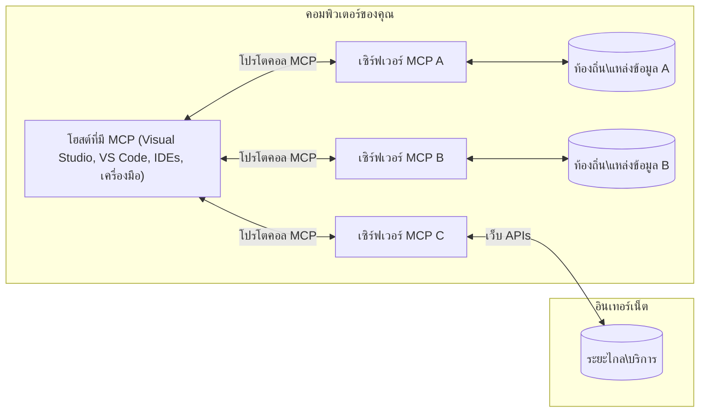

# แนวคิดหลักของ MCP: การเชี่ยวชาญในโปรโตคอลบริบทของโมเดลสำหรับการผสมผสาน AI

[](https://youtu.be/earDzWGtE84)

_(คลิกที่รูปภาพด้านบนเพื่อดูวิดีโอของบทเรียนนี้)_

[Model Context Protocol (MCP)](https://github.com/modelcontextprotocol) คือกรอบงานมาตรฐานที่ทรงพลังซึ่งเพิ่มประสิทธิภาพการสื่อสารระหว่างโมเดลภาษาใหญ่ (LLMs) กับเครื่องมือ แอปพลิเคชัน และแหล่งข้อมูลภายนอก
คู่มือฉบับนี้จะสอนแนวคิดหลักของ MCP คุณจะได้เรียนรู้สถาปัตยกรรมแบบไคลเอนต์-เซิร์ฟเวอร์ ส่วนประกอบสำคัญ กลไกการสื่อสาร และแนวปฏิบัติที่ดีที่สุดในการใช้งาน

- **การควบคุมและความยินยอมของผู้ใช้**: โฮสต์ควรแสดงอย่างชัดเจนว่าเซิร์ฟเวอร์เผยแพร่ข้อมูลและเครื่องมืออะไร ปล่อยให้ผู้ใช้ปฏิเสธการดำเนินการ และขอการยืนยันอย่างชัดเจนสำหรับการกระทำที่ละเอียดอ่อนหรือมีผลกระทบ โดย MCP ไม่จำเป็นต้องมีการยืนยันก่อนทุกการเรียกใช้เครื่องมือ


- **การปกป้องความเป็นส่วนตัวของข้อมูล**: ข้อมูลของผู้ใช้จะถูกเปิดเผยเฉพาะด้วยความยินยอมอย่างชัดเจนและต้องได้รับการปกป้องด้วยการควบคุมการเข้าถึงที่แข็งแกร่งตลอดช่วงเวลาการโต้ตอบทั้งหมด การใช้งานต้องป้องกันการส่งข้อมูลโดยไม่ได้รับอนุญาตและรักษาขอบเขตความเป็นส่วนตัวอย่างเข้มงวด

- **ความปลอดภัยในการดำเนินการของเครื่องมือ**: โฮสต์ควรทำให้การเรียกใช้เครื่องมือเป็นที่เห็นได้และอนุญาตให้มนุษย์ปฏิเสธได้ การดำเนินการที่ละเอียดอ่อนควรแสดงข้อมูลนำเข้าและผลกระทบของเครื่องมือก่อนการดำเนินการ โดยมีขอบเขตความปลอดภัยที่ป้องกันการกระทำโดยไม่ได้ตั้งใจหรือละเมิด


- **ความปลอดภัยของการขนส่ง**: การเชื่อมต่อระยะไกลควรใช้ HTTPS และโมเดลการอนุญาตของ MCP เซิร์ฟเวอร์ stdio ภายในเครื่องต้องอาศัยการแยกกระบวนการ การตั้งค่าที่เชื่อถือได้ และการจัดการข้อมูลรับรองที่ได้มาอย่างปลอดภัย


#### แนวทางการใช้งาน:

- **การจัดการสิทธิ์**: ใช้ระบบสิทธิ์ที่ละเอียดเพื่อให้ผู้ใช้ควบคุมเซิร์ฟเวอร์ เครื่องมือ และทรัพยากรที่เข้าถึงได้
- **การยืนยันตัวตนและการอนุญาต**: ใช้วิธีการยืนยันตัวตนที่ปลอดภัย (OAuth, API keys) พร้อมการจัดการโทเคนและการหมดอายุอย่างเหมาะสม
- **การตรวจสอบข้อมูลนำเข้า**: ตรวจสอบพารามิเตอร์และข้อมูลนำเข้าทั้งหมดตามโครงร่างที่กำหนดไว้เพื่อป้องกันการโจมตีแบบฉีดข้อมูล
- **การบันทึกการตรวจสอบ**: เก็บบันทึกรายละเอียดของการดำเนินงานทั้งหมดเพื่อการตรวจสอบความปลอดภัยและการปฏิบัติตามข้อกำหนด

## ภาพรวม

บทเรียนนี้เจาะลึกสถาปัตยกรรมพื้นฐานและส่วนประกอบที่ประกอบกันเป็นระบบ Model Context Protocol (MCP) คุณจะได้เรียนรู้เกี่ยวกับสถาปัตยกรรมแบบไคลเอนต์-เซิร์ฟเวอร์ ส่วนประกอบหลัก และกลไกการสื่อสารที่ขับเคลื่อนการโต้ตอบของ MCP

## วัตถุประสงค์การเรียนรู้หลัก

ภายในตอนท้ายของบทเรียนนี้ คุณจะ:

- เข้าใจสถาปัตยกรรมแบบไคลเอนต์-เซิร์ฟเวอร์ของ MCP
- ระบุบทบาทและความรับผิดชอบของโฮสต์ ไคลเอนต์ และเซิร์ฟเวอร์
- วิเคราะห์คุณสมบัติหลักที่ทำให้ MCP เป็นชั้นการผสมผสานที่ยืดหยุ่น
- เรียนรู้วิธีที่ข้อมูลไหลในระบบนิเวศ MCP
- รับข้อมูลเชิงลึกจากตัวอย่างโค้ดใน .NET, Java, Python และ JavaScript อย่างเป็นรูปธรรม

## สถาปัตยกรรม MCP: การดูเชิงลึก

ระบบนิเวศของ MCP ถูกสร้างขึ้นบนโมเดลไคลเอนต์-เซิร์ฟเวอร์ โครงสร้างแบบโมดูลาร์นี้ช่วยใหแอปพลิเคชัน AI สามารถโต้ตอบกับเครื่องมือฐานข้อมูล API และทรัพยากรบริบทต่างๆ ได้อย่างมีประสิทธิภาพ เรามาแบ่งส่วนสถาปัตยกรรมนี้ออกเป็นส่วนประกอบหลักกัน

ที่แกนหลัก MCP ปฏิบัติตามสถาปัตยกรรมไคลเอนต์-เซิร์ฟเวอร์ซึ่งแอปโฮสต์สามารถเชื่อมต่อกับเซิร์ฟเวอร์ต่างๆ ได้หลายเครื่อง:


```mermaid
flowchart LR
    subgraph "คอมพิวเตอร์ของคุณ"
        Host["โฮสต์ที่มี MCP (Visual Studio, VS Code, IDEs, เครื่องมือ)"]
        S1["เซิร์ฟเวอร์ MCP A"]
        S2["เซิร์ฟเวอร์ MCP B"]
        S3["เซิร์ฟเวอร์ MCP C"]
        Host <-->|"โปรโตคอล MCP"| S1
        Host <-->|"โปรโตคอล MCP"| S2
        Host <-->|"โปรโตคอล MCP"| S3
        S1 <--> D1[("ท้องถิ่น\แหล่งข้อมูล A")]
        S2 <--> D2[("ท้องถิ่น\แหล่งข้อมูล B")]
    end
    subgraph "อินเทอร์เน็ต"
        S3 <-->|"เว็บ APIs"| D3[("ระยะไกล\บริการ")]
    end
```

- **โฮสต์ MCP**: โปรแกรมเช่น VSCode, Claude Desktop, IDEs หรือเครื่องมือ AI ที่ต้องการเข้าถึงข้อมูลผ่าน MCP
- **ไคลเอนต์ MCP**: ส่วนประกอบโปรโตคอลที่รักษาความสัมพันธ์ตรรกะเดียวกับเซิร์ฟเวอร์; คำขอ MCP `2026-07-28` ไม่พึ่งพาการเชื่อมต่อหรือเซสชันที่ถาวรหนึ่งเดียว


- **เซิร์ฟเวอร์ MCP**: โปรแกรมน้ำหนักเบาที่แต่ละตัวเปิดเผยความสามารถเฉพาะผ่านโปรโตคอล Model Context มาตรฐาน
- **แหล่งข้อมูลภายในเครื่อง**: ไฟล์ ฐานข้อมูล และบริการในคอมพิวเตอร์ของคุณที่เซิร์ฟเวอร์ MCP สามารถเข้าถึงได้อย่างปลอดภัย
- **บริการระยะไกล**: ระบบภายนอกที่สามารถใช้งานผ่านอินเทอร์เน็ตซึ่งเซิร์ฟเวอร์ MCP สามารถเชื่อมต่อผ่าน API ได้

โปรโตคอล MCP เป็นมาตรฐานที่กำลังพัฒนาโดยใช้การจัดเวอร์ชันตามวันที่
(รูปแบบ YYYY-MM-DD) เวอร์ชันโปรโตคอลปัจจุบันคือ **2026-07-28** ดูที่
[ข้อกำหนดโปรโตคอล 2026-07-28](https://modelcontextprotocol.io/specification/2026-07-28/)

> **รุ่นปัจจุบัน:** MCP `2026-07-28` ทำให้โปรโตคอลเป็นแบบไม่มีสถานะที่
> ชั้นการขนส่งโดยการลบการจับมือ `initialize` และ ID เซสชันระดับโปรโตคอล
> นอกจากนี้ยังได้จัดรูปแบบเฟรมเวิร์กเสริมและยกเลิกการใช้
> Roots, Sampling และ Logging เพื่อใช้รูปแบบใหม่ ดูที่
> [มีอะไรเปลี่ยนแปลงใน MCP: ข้อกำหนด 2026-07-28](./mcp-2026-07-28.md)
> สำหรับรายละเอียดและคำแนะนำการย้ายข้อมูล ตัวอย่างที่ระบุเป้าหมาย
> `2025-11-25` ถูกเก็บไว้เป็นบทเรียนความเข้ากันได้ในอดีต

### 1. โฮสต์

ในโปรโตคอล Model Context (MCP) **โฮสต์** คือแอปพลิเคชัน AI ที่ทำหน้าที่เป็นอินเทอร์เฟซหลักที่ผู้ใช้โต้ตอบกับโปรโตคอล โฮสต์ประสานและจัดการการเชื่อมต่อไปยังเซิร์ฟเวอร์ MCP หลายตัวโดยสร้างไคลเอนต์ MCP ที่เฉพาะเจาะจงสำหรับแต่ละการเชื่อมต่อเซิร์ฟเวอร์ ตัวอย่างโฮสต์ ได้แก่:

- **แอปพลิเคชัน AI**: Claude Desktop, Visual Studio Code, Claude Code
- **สภาพแวดล้อมการพัฒนา**: IDE และตัวแก้ไขโค้ดที่มีการรวม MCP  
- **แอปพลิเคชันที่กำหนดเอง**: ตัวแทน AI และเครื่องมือที่สร้างขึ้นเฉพาะ

**โฮสต์** คือแอปพลิเคชันที่ประสานงานการโต้ตอบกับโมเดล AI โดยพวกเขา:

- **จัดการโมเดล AI**: ดำเนินการหรือโต้ตอบกับ LLM เพื่อสร้างคำตอบและประสานงานเวิร์กโฟลว์ AI
- **จัดการความสัมพันธ์กับไคลเอนต์**: สร้างและจัดการไคลเอนต์ MCP หนึ่งตัวสำหรับแต่ละเซิร์ฟเวอร์ MCP
  ที่โฮสต์ใช้งาน
- **ควบคุมส่วนต่อประสานผู้ใช้**: จัดการกระแสการสนทนา โต้ตอบของผู้ใช้ และการแสดงผลคำตอบ  
- **บังคับใช้ความปลอดภัย**: ควบคุมสิทธิ์ ข้อจำกัดความปลอดภัย และการตรวจสอบสิทธิ์
- **จัดการความยินยอมของผู้ใช้**: จัดการการอนุมัติของผู้ใช้สำหรับการแชร์ข้อมูลและการใช้งานเครื่องมือ


### 2. ไคลเอนต์

**ไคลเอนต์** คือส่วนประกอบโปรโตคอลที่สร้างโดยโฮสต์สำหรับเซิร์ฟเวอร์ MCP เฉพาะ นี่คือความสัมพันธ์แบบสมเหตุสมผลหนึ่งต่อหนึ่ง ไม่ใช่ความจำเป็นสำหรับการเชื่อมต่อเครือข่ายถาวร ใน MCP `2026-07-28` คำขอแต่ละรายการประกอบด้วยตนเองและอาจถูกจัดการโดยเครื่องเซิร์ฟเวอร์ใดก็ได้


- **ค้นหาความสามารถ**: ใช้ `server/discover` เพื่อเรียนรู้เวอร์ชันโปรโตคอล ความสามารถ และส่วนขยายที่เซิร์ฟเวอร์สนับสนุน
- **การใช้งานเครื่องมือ**: จัดการคำขอการใช้งานเครื่องมือจากโมเดลและประมวลผลคำตอบ
- **อัปเดตแบบเรียลไทม์**: จัดการแจ้งเตือนและอัปเดตแบบเรียลไทม์จากเซิร์ฟเวอร์
- **การประมวลผลคำตอบ**: ประมวลผลและจัดรูปแบบคำตอบจากเซิร์ฟเวอร์สำหรับแสดงผลให้ผู้ใช้


### 3. เซิร์ฟเวอร์


**เซิร์ฟเวอร์** คือโปรแกรมที่ให้บริบท เครื่องมือ และความสามารถแก่ไคลเอนต์ MCP พวกมันสามารถทำงานได้ในเครื่องเดียวกันกับโฮสต์ หรือจากระยะไกล (บนแพลตฟอร์มภายนอก) และมีหน้าที่จัดการคำขอจากไคลเอนต์และให้คำตอบที่เป็นโครงสร้าง เซิร์ฟเวอร์เปิดเผยฟังก์ชันเฉพาะผ่านโปรโตคอล Model Context ที่ได้มาตรฐาน

**เซิร์ฟเวอร์** คือบริการที่ให้บริบทและความสามารถ พวกมัน:


- **การลงทะเบียนคุณสมบัติ**: ลงทะเบียนและเปิดเผย primitives ที่มีให้ใช้งาน (ทรัพยากร, prompts, เครื่องมือ) ให้กับลูกค้า
- **การประมวลผลคำขอ**: รับและดำเนินการเรียกใช้เครื่องมือ, คำขอทรัพยากร, และคำขอ prompt จากลูกค้า
- **การให้บริบท**: จัดเตรียมข้อมูลและบริบทเพื่อเสริมคำตอบของโมเดล
- **การจัดการสถานะ**: รักษาสถานะของแอปพลิเคชันโดยใช้ handles ที่ระบุชัดเจนซึ่งส่งผ่าน
  ในคำขอเมื่อจำเป็น; MCP `2026-07-28` ไม่มี sessions ระดับโปรโตคอล
- **การแจ้งเตือนเรียลไทม์**: ส่งการแจ้งเตือนเกี่ยวกับการเปลี่ยนแปลงและอัปเดตความสามารถให้กับลูกค้าที่เชื่อมต่อ

เซิร์ฟเวอร์สามารถพัฒนาโดยใครก็ได้เพื่อขยายความสามารถของโมเดลด้วยฟังก์ชันเฉพาะทาง และรองรับทั้งสถานการณ์การปรับใช้แบบท้องถิ่นและระยะไกล

### 4. Server Primitives

เซิร์ฟเวอร์ใน Model Context Protocol (MCP) ให้ primitives หลักสามประเภทซึ่งกำหนดโครงสร้างพื้นฐานสำหรับปฏิสัมพันธ์ที่หลากหลายระหว่างลูกค้า โฮสต์ และโมเดลภาษา primitives เหล่านี้ระบุประเภทของข้อมูลบริบทและการดำเนินการที่มีให้ผ่านโปรโตคอล

เซิร์ฟเวอร์ MCP สามารถเปิดเผย primitives หลักทั้งสามประเภทดังต่อไปนี้ในรูปแบบใดก็ได้:

#### Resources 

**ทรัพยากร** คือแหล่งข้อมูลที่ให้ข้อมูลบริบทแก่แอปพลิเคชัน AI พวกเขาเป็นเนื้อหาคงที่หรือไดนามิกที่ช่วยเสริมความเข้าใจของโมเดลและการตัดสินใจ:

- **ข้อมูลบริบท**: ข้อมูลที่มีโครงสร้างและบริบทสำหรับการใช้ในโมเดล AI
- **ฐานความรู้**: แหล่งเก็บเอกสาร, บทความ, คู่มือ และเอกสารวิจัย
- **แหล่งข้อมูลท้องถิ่น**: ไฟล์, ฐานข้อมูล และข้อมูลระบบท้องถิ่น  
- **ข้อมูลภายนอก**: การตอบสนอง API, บริการเว็บ และข้อมูลระบบระยะไกล
- **เนื้อหาไดนามิก**: ข้อมูลเรียลไทม์ที่อัปเดตตามเงื่อนไขภายนอก

ทรัพยากรถูกระบุด้วย URI และรองรับการค้นหาผ่านวิธีการ `resources/list` และดึงข้อมูลผ่าน `resources/read`:

```text
file://documents/project-spec.md
database://production/users/schema
api://weather/current
```

#### Prompts

**Prompts** คือเทมเพลตที่นำกลับมาใช้ใหม่ได้ซึ่งช่วยจัดโครงสร้างปฏิสัมพันธ์กับโมเดลภาษา พวกเขาจัดเตรียมรูปแบบการปฏิสัมพันธ์มาตรฐานและเวิร์กโฟลว์ที่เป็นเทมเพลต:

- **ปฏิสัมพันธ์แบบเทมเพลต**: ข้อความและการเริ่มการสนทนาที่จัดเตรียมไว้ล่วงหน้า
- **เทมเพลตเวิร์กโฟลว์**: ลำดับขั้นตอนมาตรฐานสำหรับงานและปฏิสัมพันธ์ทั่วไป
- **ตัวอย่าง Few-shot**: เทมเพลตตัวอย่างสำหรับคำสั่งพูดโมเดล
- **System Prompts**: prompts พื้นฐานที่กำหนดพฤติกรรมและบริบทของโมเดล
- **เทมเพลตไดนามิก**: prompts ที่ปรับพารามิเตอร์ตามบริบทเฉพาะ

Prompts รองรับการแทนที่ตัวแปรและสามารถค้นหาได้ผ่าน `prompts/list` และดึงข้อมูลผ่าน `prompts/get`:

```markdown
Generate a {{task_type}} for {{product}} targeting {{audience}} with the following requirements: {{requirements}}
```

#### Tools

**เครื่องมือ** คือฟังก์ชันที่สามารถดำเนินการได้ซึ่งโมเดล AI สามารถเรียกใช้เพื่อทำงานเฉพาะ พวกเขาคือ "กริยา" ของระบบนิเวศ MCP ช่วยให้โมเดลโต้ตอบกับระบบภายนอกได้:

- **ฟังก์ชันที่สามารถดำเนินการได้**: การดำเนินการที่แยกจากกันซึ่งโมเดลสามารถเรียกใช้พร้อมด้วยพารามิเตอร์เฉพาะ
- **การรวมระบบภายนอก**: การเรียก API, การสืบค้นฐานข้อมูล, การจัดการไฟล์, การคำนวณ
- **เอกลักษณ์เฉพาะ**: เครื่องมือแต่ละตัวมีชื่อ, คำอธิบาย และสคีมาพารามิเตอร์ที่แตกต่างกัน
- **การรับส่งข้อมูลที่มีโครงสร้าง**: เครื่องมือรับพารามิเตอร์ที่ตรวจสอบแล้วและส่งคืนผลลัพธ์ที่มีโครงสร้างและมีชนิดข้อมูล
- **ความสามารถในการกระทำ**: ช่วยให้โมเดลดำเนินการจริงในโลกจริงและดึงข้อมูลสด

เครื่องมือถูกกำหนดด้วย JSON Schema สำหรับการตรวจสอบพารามิเตอร์และค้นหาได้ผ่าน `tools/list` และดำเนินการผ่าน `tools/call` เครื่องมือสามารถรวม **ไอคอน** เป็นข้อมูลเมตาเพิ่มเติมเพื่อการนำเสนอ UI ที่ดีขึ้นได้

**คำอธิบายเครื่องมือ**: เครื่องมือรองรับคำอธิบายพฤติกรรม (เช่น `readOnlyHint`, `destructiveHint`) ที่อธิบายว่าเครื่องมือเป็นแบบอ่านอย่างเดียวหรือทำลาย ช่วยให้ลูกค้าตัดสินใจได้อย่างรอบคอบเกี่ยวกับการใช้เครื่องมือ


ตัวอย่างการกำหนดเครื่องมือ:

```typescript
server.tool(
  "search_products", 
  {
    query: z.string().describe("Search query for products"),
    category: z.string().optional().describe("Product category filter"),
    max_results: z.number().default(10).describe("Maximum results to return")
  }, 
  async (params) => {
    // ดำเนินการค้นหาและส่งคืนผลลัพธ์ในรูปแบบโครงสร้าง
    return await productService.search(params);
  }
);
```

## Client Primitives

ใน Model Context Protocol (MCP), **ไคลเอนต์** สามารถเปิดเผย primitives ที่ช่วยให้เซิร์ฟเวอร์ร้องขอความสามารถเพิ่มเติมจากแอปพลิเคชันโฮสต์ได้ Primitives ฝั่งไคลเอนต์เหล่านี้ช่วยให้เกิดการประมวลผลเซิร์ฟเวอร์ที่หลากหลายและมีการโต้ตอบที่ดีขึ้น ซึ่งสามารถเข้าถึงความสามารถของโมเดล AI และการโต้ตอบของผู้ใช้

### การสุ่มตัวอย่าง (Sampling)

> **เลิกใช้ใน MCP `2026-07-28`:** การสุ่มตัวอย่างยังคงใช้งานได้เพื่อ
> ความเข้ากันได้ แต่การนำไปใช้ใหม่ควรเชื่อมต่อโดยตรงกับ API ของผู้ให้บริการ LLM
> และมีโอกาสที่จะถูกลบในการแก้ไขข้อกำหนดครั้งแรก
> ที่เผยแพร่ตั้งแต่วันที่ 28 กรกฎาคม 2027 เป็นต้นไป ดูที่
> [การเปลี่ยนแปลงใน MCP: ข้อกำหนด 2026-07-28](./mcp-2026-07-28.md)

**การสุ่มตัวอย่าง** ช่วยให้เซิร์ฟเวอร์ร้องขอผลลัพธ์จากโมเดลภาษาในแอป AI ของไคลเอนต์ Primitive นี้ให้เซิร์ฟเวอร์เข้าถึงความสามารถของ LLM ได้โดยไม่จำเป็นต้องฝังการพึ่งพาโมเดลของตนเอง:

- **การเข้าถึงอิสระจากโมเดล**: เซิร์ฟเวอร์สามารถร้องขอผลลัพธ์โดยไม่ต้องรวม SDK LLM หรือจัดการการเข้าถึงโมเดล
- **AI ที่เซิร์ฟเวอร์เป็นผู้ริเริ่ม**: ให้เซิร์ฟเวอร์สามารถสร้างเนื้อหาโดยอัตโนมัติด้วยโมเดล AI ของไคลเอนต์
- **การโต้ตอบ LLM แบบวนซ้ำ**: รองรับสถานการณ์ซับซ้อนที่เซิร์ฟเวอร์ต้องการความช่วยเหลือ AI ในการประมวลผล
- **การสร้างเนื้อหาแบบไดนามิก**: ช่วยให้เซิร์ฟเวอร์สร้างคำตอบที่มีบริบทโดยใช้โมเดลของโฮสต์
- **รองรับการเรียกใช้เครื่องมือ**: เซิร์ฟเวอร์สามารถส่งพารามิเตอร์ `tools` และ `toolChoice` เพื่อให้โมเดลของไคลเอนต์เรียกใช้งานเครื่องมือในระหว่างการสุ่มตัวอย่าง

การสุ่มตัวอย่างใช้เมทอด `sampling/createMessage` ซึ่งเซิร์ฟเวอร์ร้องขอ
ผลลัพธ์จากไคลเอนต์

### Roots

> **เลิกใช้ใน MCP `2026-07-28`:** Roots ยังคงสามารถใช้งานได้เพื่อ
> ความเข้ากันได้ แต่การนำไปใช้ใหม่ควรส่งผ่านไดเรกทอรีหรือไฟล์ผ่าน
> พารามิเตอร์เครื่องมือ, URI ทรัพยากร หรือการกำหนดค่าเซิร์ฟเวอร์ Roots มีโอกาส
> จะถูกลบในแก้ไขข้อกำหนดครั้งแรกที่เผยแพร่ตั้งแต่วันที่
> 28 กรกฎาคม 2027 เป็นต้นไป ดูที่
> [การเปลี่ยนแปลงใน MCP: ข้อกำหนด 2026-07-28](./mcp-2026-07-28.md)

**Roots** ให้วิธีการมาตรฐานสำหรับไคลเอนต์ในการระบุสถานที่ในระบบไฟล์
ที่เกี่ยวข้องกับเซิร์ฟเวอร์:

- **คำใบ้ระบบไฟล์**: ระบุไดเรกทอรีและไฟล์ที่เกี่ยวข้องกับคำขอ
- **การอนุญาตแยกต่างหาก**: ไม่อนุญาตการเข้าถึงหรือบังคับใช้ขอบเขตความปลอดภัย
- **ความสามารถต่อคำขอ**: ไคลเอนต์ประกาศการรองรับ Roots ในเมตาดาต้าของคำขอ
- **การระบุโดย URI**: Roots ใช้ `file://` URI เพื่อระบุไดเรกทอรีและไฟล์ที่เข้าถึงได้

ใน MCP `2026-07-28`, เซิร์ฟเวอร์ร้องขอ `roots/list` ผ่าน
`InputRequiredResult` ในขณะที่กำลังประมวลผลคำขอของไคลเอนต์ที่รองรับ เซิร์ฟเวอร์
จะได้รับ roots เมื่อไคลเอนต์ลองส่งคำขอเดิมอีกครั้ง

### การกระตุ้น (Elicitation)  

**การกระตุ้น** ช่วยให้เซิร์ฟเวอร์ร้องขอข้อมูลเพิ่มเติมหรือการยืนยันจากผู้ใช้ผ่านอินเทอร์เฟซของไคลเอนต์:

- **การร้องขอข้อมูลจากผู้ใช้**: เซิร์ฟเวอร์สามารถขอข้อมูลเพิ่มเติมเมื่อต้องใช้สำหรับการดำเนินการเครื่องมือ
- **กล่องโต้ตอบยืนยัน**: ขอการอนุมัติจากผู้ใช้สำหรับการดำเนินการที่ละเอียดอ่อนหรือมีผลกระทบ
- **เวิร์กโฟลว์แบบโต้ตอบ**: ช่วยให้เซิร์ฟเวอร์สร้างการโต้ตอบกับผู้ใช้ทีละขั้นตอน
- **การเก็บพารามิเตอร์แบบไดนามิก**: รวบรวมพารามิเตอร์ที่ขาดหายไปหรือเป็นทางเลือกในระหว่างการดำเนินการเครื่องมือ

การกระตุ้นใช้เมทอด `elicitation/create` ภายใน
`InputRequiredResult` เพื่อรวบรวมข้อมูลจากผู้ใช้ผ่านอินเทอร์เฟซของไคลเอนต์


**การกระตุ้นโหมด URL**: เซิร์ฟเวอร์ยังสามารถร้องขอการมีปฏิสัมพันธ์กับผู้ใช้ที่อิง URL ได้ ทำให้เซิร์ฟเวอร์สามารถนำผู้ใช้ไปยังหน้าเว็บภายนอกเพื่อการยืนยันตัวตน การยืนยัน หรือการกรอกข้อมูล

### การบันทึกข้อมูล

> **เลิกใช้ใน MCP `2026-07-28`:** การบันทึกข้อมูลยังคงใช้งานได้เพื่อความเข้ากันได้ แต่การใช้งานใหม่ควรใช้ `stderr` กับ stdio และ
> OpenTelemetry เพื่อการสังเกตการณ์ที่เป็นโครงสร้าง การบันทึกข้อมูลมีสิทธิ์ถูกลบ
> ในการแก้ไขข้อกำหนดครั้งแรกที่ปล่อยออกมาหลังหรือในวันที่ 28 กรกฎาคม 2027 ดู
> [มีการเปลี่ยนแปลงอะไรใน MCP: ข้อกำหนด 2026-07-28](./mcp-2026-07-28.md)


**การบันทึกข้อมูล** ช่วยให้เซิร์ฟเวอร์ส่งข้อความบันทึกที่เป็นโครงสร้างไปยังไคลเอนต์สำหรับการดีบัก การตรวจสอบ และความโปร่งใสในการดำเนินงาน:

- **การสนับสนุนการดีบัก**: เปิดโอกาสให้เซิร์ฟเวอร์ให้บันทึกรายละเอียดการดำเนินการสำหรับการแก้ไขปัญหา
- **การตรวจสอบการทำงาน**: ส่งการอัปเดตสถานะและตัวชี้วัดประสิทธิภาพไปยังไคลเอนต์
- **รายงานข้อผิดพลาด**: ให้บริบทข้อผิดพลาดโดยละเอียดและข้อมูลวินิจฉัย
- **รอยตรวจสอบ**: สร้างบันทึกที่ครอบคลุมของการดำเนินงานและการตัดสินใจของเซิร์ฟเวอร์

ข้อความบันทึกจะถูกส่งไปยังไคลเอนต์เพื่อให้มีความโปร่งใสในการดำเนินงานของเซิร์ฟเวอร์และช่วยในการดีบัก

## การไหลของข้อมูลใน MCP

โปรโตคอล Model Context Protocol (MCP) กำหนดการไหลของข้อมูลที่เป็นโครงสร้างระหว่างโฮสต์ ไคลเอนต์ เซิร์ฟเวอร์ และโมเดล การเข้าใจการไหลนี้ช่วยชี้แจงวิธีการประมวลผลคำขอของผู้ใช้และวิธีการรวมเครื่องมือและข้อมูลภายนอกเข้าสู่คำตอบของโมเดล

- **โฮสต์เริ่มต้นการเชื่อมต่อ**  
  แอปพลิเคชันโฮสต์ (เช่น IDE หรืออินเทอร์เฟซแชท) สร้างการเชื่อมต่อกับเซิร์ฟเวอร์ MCP โดยทั่วไปผ่าน STDIO, WebSocket หรือช่องทางขนส่งที่รองรับอื่นๆ

- **การเจรจาความสามารถ**  
  ไคลเอนต์ (ฝังอยู่ในโฮสต์) และเซิร์ฟเวอร์แลกเปลี่ยนข้อมูลเกี่ยวกับคุณสมบัติ เครื่องมือ ทรัพยากร และเวอร์ชันโปรโตคอลที่รองรับ เพื่อให้แน่ใจว่าทั้งสองฝ่ายเข้าใจความสามารถที่มีในเซสชัน

- **คำขอของผู้ใช้**  
  ผู้ใช้มีปฏิสัมพันธ์กับโฮสต์ (เช่น ป้อนพรอมต์หรือคำสั่ง) โฮสต์เก็บรวบรวมข้อมูลนี้และส่งต่อไปยังไคลเอนต์เพื่อประมวลผล

- **การใช้ทรัพยากรหรือเครื่องมือ**  
  - ไคลเอนต์อาจร้องขอบริบทเพิ่มเติมหรือทรัพยากรจากเซิร์ฟเวอร์ (เช่น ไฟล์ รายการฐานข้อมูล หรือบทความฐานความรู้) เพื่อเสริมความเข้าใจของโมเดล
  - ถ้าโมเดลกำหนดว่าเครื่องมือใดจำเป็น (เช่น ดึงข้อมูล คำนวณ หรือเรียก API) ไคลเอนต์จะส่งคำขอเรียกใช้เครื่องมือไปยังเซิร์ฟเวอร์ ระบุชื่อเครื่องมือและพารามิเตอร์

- **การดำเนินการของเซิร์ฟเวอร์**  
  เซิร์ฟเวอร์รับคำขอทรัพยากรหรือเครื่องมือ ดำเนินการที่จำเป็น (เช่น รันฟังก์ชัน สืบค้นฐานข้อมูล หรือดึงไฟล์) และส่งผลลัพธ์กลับไปยังไคลเอนต์ในรูปแบบที่เป็นโครงสร้าง

- **การสร้างคำตอบ**  
  ไคลเอนต์ผสานคำตอบจากเซิร์ฟเวอร์ (ข้อมูลทรัพยากร ผลลัพธ์เครื่องมือ ฯลฯ) เข้ากับการโต้ตอบกับโมเดลอย่างต่อเนื่อง โมเดลใช้ข้อมูลนี้เพื่อสร้างคำตอบที่ครอบคลุมและเกี่ยวข้องตามบริบท

- **การนำเสนอผลลัพธ์**  
  โฮสต์รับผลลัพธ์สุดท้ายจากไคลเอนต์และแสดงต่อผู้ใช้ โดยมักรวมทั้งข้อความที่โมเดลสร้างและผลลัพธ์จากการดำเนินการเครื่องมือหรือค้นหาทรัพยากร

การไหลนี้ทำให้ MCP สนับสนุนแอปพลิเคชัน AI ขั้นสูง เชิงโต้ตอบ และตระหนักถึงบริบทด้วยการเชื่อมต่อโมเดลกับเครื่องมือและแหล่งข้อมูลภายนอกได้อย่างราบรื่น

## สถาปัตยกรรมและเลเยอร์ของโปรโตคอล

MCP ประกอบด้วยสองเลเยอร์สถาปัตยกรรมแยกจากกันที่ทำงานร่วมกันเพื่อให้กรอบการสื่อสารครบถ้วน:

### เลเยอร์ข้อมูล

**เลเยอร์ข้อมูล** ใช้โปรโตคอลหลักของ MCP โดยใช้ **JSON-RPC 2.0** เป็นฐาน เลเยอร์นี้กำหนดโครงสร้างข้อความ ความหมาย และรูปแบบการโต้ตอบ:

#### ส่วนประกอบหลัก:

- **โปรโตคอล JSON-RPC 2.0**: การสื่อสารทั้งหมดใช้รูปแบบข้อความ JSON-RPC 2.0 มาตรฐานสำหรับการเรียกเมธอด ตอบกลับ และการแจ้งเตือน
- **การจัดการวงจรชีวิต**: จัดการการเริ่มต้นการเชื่อมต่อ การเจรจาความสามารถ และการสิ้นสุดเซสชันระหว่างไคลเอนต์และเซิร์ฟเวอร์
- **เครื่องมือพื้นฐานของเซิร์ฟเวอร์**: ช่วยให้เซิร์ฟเวอร์ให้ฟังก์ชันหลักผ่านเครื่องมือ ทรัพยากร และคำสั่ง
- **เครื่องมือพื้นฐานของไคลเอนต์**: ช่วยให้เซิร์ฟเวอร์ร้องขอการสุ่มตัวอย่างจาก LLMs กระตุ้นการป้อนข้อมูลของผู้ใช้ และส่งข้อความบันทึก
- **การแจ้งเตือนแบบเรียลไทม์**: รองรับการแจ้งเตือนแบบอะซิงโครนัสสำหรับการอัปเดตแบบไดนามิกโดยไม่ต้องดึงข้อมูลซ้ำ

#### คุณสมบัติสำคัญ:

- **การเจรจาเวอร์ชันโปรโตคอล**: ใช้การเวอร์ชันตามวันที่ (YYYY-MM-DD) เพื่อความเข้ากันได้
- **การค้นหาความสามารถ**: ไคลเอนต์และเซิร์ฟเวอร์แลกเปลี่ยนข้อมูลคุณสมบัติที่รองรับในระหว่างการเริ่มต้น
- **เซสชันที่มีสถานะ**: รักษาสถานะการเชื่อมต่อในหลายการโต้ตอบเพื่อความต่อเนื่องของบริบท

### เลเยอร์การขนส่ง

**เลเยอร์การขนส่ง** จัดการช่องทางการสื่อสาร การกำหนดกรอบข้อความ และการตรวจสอบตัวตนระหว่างผู้เข้าร่วม MCP:

#### กลไกการขนส่งที่สนับสนุน:

1. **การขนส่ง STDIO**:
   - ใช้สตรีมอินพุต/เอาต์พุตมาตรฐานสำหรับการสื่อสารกระบวนการโดยตรง
   - เหมาะสำหรับกระบวนการท้องถิ่นบนเครื่องเดียวกันโดยไม่มีภาระเครือข่าย
   - ใช้บ่อยสำหรับการใช้งานเซิร์ฟเวอร์ MCP ท้องถิ่น

2. **การขนส่ง HTTP ที่สามารถสตรีมได้**:
   - ใช้ HTTP POST สำหรับข้อความจากไคลเอนต์ไปยังเซิร์ฟเวอร์  
   - เลือกใช้ Server-Sent Events (SSE) สำหรับการสตรีมจากเซิร์ฟเวอร์ไปยังไคลเอนต์
   - เปิดใช้งานการสื่อสารเซิร์ฟเวอร์ระยะไกลผ่านเครือข่าย
   - รองรับการตรวจสอบตัวตน HTTP มาตรฐาน (โทเคน bearer, คีย์ API, เฮดเดอร์กำหนดเอง)
   - MCP แนะนำ OAuth สำหรับการตรวจสอบตัวตนด้วยโทเคนที่ปลอดภัย

#### การแอบแฝงการขนส่ง:

เลเยอร์การขนส่งแยกรายละเอียดการสื่อสารออกจากเลเยอร์ข้อมูล ช่วยให้ใช้รูปแบบข้อความ JSON-RPC 2.0 เดียวกันผ่านทุกกลไกการขนส่ง การแอบแฝงนี้ช่วยให้อุปกรณ์เปลี่ยนระหว่างเซิร์ฟเวอร์ท้องถิ่นและระยะไกลได้อย่างราบรื่น

### การพิจารณาด้านความปลอดภัย

การใช้งาน MCP ต้องปฏิบัติตามหลักการความปลอดภัยสำคัญหลายประการเพื่อให้มั่นใจว่าการโต้ตอบผ่านโปรโตคอลทั้งหมดมีความปลอดภัย เชื่อถือได้ และปลอดภัย:

- **ความยินยอมและการควบคุมของผู้ใช้**: ผู้ใช้ต้องให้ความยินยอมอย่างชัดเจนก่อนที่จะเข้าถึงข้อมูลหรือดำเนินการใด ๆ พวกเขาควรมีการควบคุมที่ชัดเจนเกี่ยวกับข้อมูลที่แชร์และการอนุญาตการกระทำ โดยได้รับการสนับสนุนด้วยอินเทอร์เฟซผู้ใช้ที่เข้าใจง่ายสำหรับการตรวจสอบและอนุมัติการทำงาน

- **ความเป็นส่วนตัวของข้อมูล**: ข้อมูลผู้ใช้ควรถูกเปิดเผยเฉพาะเมื่อได้รับความยินยอมอย่างชัดแจ้งและต้องได้รับการปกป้องด้วยการควบคุมการเข้าถึงที่เหมาะสม การใช้งาน MCP ต้องป้องกันการส่งข้อมูลโดยไม่ได้รับอนุญาตและให้มั่นใจว่าความเป็นส่วนตัวได้รับการรักษาตลอดการโต้ตอบทั้งหมด

- **ความปลอดภัยของเครื่องมือ**: ก่อนเรียกใช้เครื่องมือใด ๆ ต้องได้รับความยินยอมจากผู้ใช้อย่างชัดเจน ผู้ใช้ควรเข้าใจชัดเจนเกี่ยวกับฟังก์ชันของแต่ละเครื่องมือ และต้องบังคับใช้ขอบเขตความปลอดภัยที่เข้มงวดเพื่อป้องกันการดำเนินการเครื่องมือที่ไม่ได้ตั้งใจหรือไม่ปลอดภัย

โดยการปฏิบัติตามหลักการความปลอดภัยเหล่านี้ MCP จะช่วยให้มั่นใจในความเชื่อถือ ความเป็นส่วนตัว และความปลอดภัยของผู้ใช้ในทุกการโต้ตอบผ่านโปรโตคอลในขณะที่เปิดใช้งานการผนวกรวม AI ที่ทรงพลัง

## ตัวอย่างโค้ด: ส่วนประกอบสำคัญ

ด้านล่างคือตัวอย่างโค้ดในหลายภาษาโปรแกรมยอดนิยมที่แสดงวิธีการใช้งานส่วนประกอบสำคัญของเซิร์ฟเวอร์ MCP และเครื่องมือ

### ตัวอย่าง .NET: การสร้างเซิร์ฟเวอร์ MCP อย่างง่ายพร้อมเครื่องมือ

นี่คือตัวอย่างโค้ด .NET ที่ปฏิบัติได้จริงซึ่งแสดงวิธีใช้งานเซิร์ฟเวอร์ MCP อย่างง่ายพร้อมเครื่องมือแบบกำหนดเอง ตัวอย่างนี้สาธิตวิธีการกำหนดและลงทะเบียนเครื่องมือ จัดการคำขอ และเชื่อมต่อเซิร์ฟเวอร์โดยใช้ Model Context Protocol

```csharp
using System;
using System.Threading.Tasks;
using ModelContextProtocol.Server;
using ModelContextProtocol.Server.Transport;
using ModelContextProtocol.Server.Tools;

public class WeatherServer
{
    public static async Task Main(string[] args)
    {
        // Create an MCP server
        var server = new McpServer(
            name: "Weather MCP Server",
            version: "1.0.0"
        );
        
        // Register our custom weather tool
        server.AddTool<string, WeatherData>("weatherTool", 
            description: "Gets current weather for a location",
            execute: async (location) => {
                // Call weather API (simplified)
                var weatherData = await GetWeatherDataAsync(location);
                return weatherData;
            });
        
        // Connect the server using stdio transport
        var transport = new StdioServerTransport();
        await server.ConnectAsync(transport);
        
        Console.WriteLine("Weather MCP Server started");
        
        // Keep the server running until process is terminated
        await Task.Delay(-1);
    }
    
    private static async Task<WeatherData> GetWeatherDataAsync(string location)
    {
        // This would normally call a weather API
        // Simplified for demonstration
        await Task.Delay(100); // Simulate API call
        return new WeatherData { 
            Temperature = 72.5,
            Conditions = "Sunny",
            Location = location
        };
    }
}

public class WeatherData
{
    public double Temperature { get; set; }
    public string Conditions { get; set; }
    public string Location { get; set; }
}
```

### ตัวอย่าง Java: ส่วนประกอบเซิร์ฟเวอร์ MCP


ตัวอย่างนี้แสดงให้เห็นการลงทะเบียนเซิร์ฟเวอร์ MCP และเครื่องมือเหมือนกับตัวอย่าง .NET ข้างต้น แต่ดำเนินการในภาษา Java

```java
import io.modelcontextprotocol.server.McpServer;
import io.modelcontextprotocol.server.McpToolDefinition;
import io.modelcontextprotocol.server.transport.StdioServerTransport;
import io.modelcontextprotocol.server.tool.ToolExecutionContext;
import io.modelcontextprotocol.server.tool.ToolResponse;

public class WeatherMcpServer {
    public static void main(String[] args) throws Exception {
        // สร้างเซิร์ฟเวอร์ MCP
        McpServer server = McpServer.builder()
            .name("Weather MCP Server")
            .version("1.0.0")
            .build();
            
        // ลงทะเบียนเครื่องมือพยากรณ์อากาศ
        server.registerTool(McpToolDefinition.builder("weatherTool")
            .description("Gets current weather for a location")
            .parameter("location", String.class)
            .execute((ToolExecutionContext ctx) -> {
                String location = ctx.getParameter("location", String.class);
                
                // ดึงข้อมูลสภาพอากาศ (แบบง่าย)
                WeatherData data = getWeatherData(location);
                
                // ส่งกลับผลลัพธ์ที่จัดรูปแบบแล้ว
                return ToolResponse.content(
                    String.format("Temperature: %.1f°F, Conditions: %s, Location: %s", 
                    data.getTemperature(), 
                    data.getConditions(), 
                    data.getLocation())
                );
            })
            .build());
        
        // เชื่อมต่อเซิร์ฟเวอร์ผ่านการขนส่ง stdio
        try (StdioServerTransport transport = new StdioServerTransport()) {
            server.connect(transport);
            System.out.println("Weather MCP Server started");
            // ให้เซิร์ฟเวอร์ทำงานต่อไปจนกว่ากระบวนการจะสิ้นสุด
            Thread.currentThread().join();
        }
    }
    
    private static WeatherData getWeatherData(String location) {
        // การใช้งานจะเรียก API สภาพอากาศ
        // ทำให้ง่ายเพื่อใช้เป็นตัวอย่าง
        return new WeatherData(72.5, "Sunny", location);
    }
}

class WeatherData {
    private double temperature;
    private String conditions;
    private String location;
    
    public WeatherData(double temperature, String conditions, String location) {
        this.temperature = temperature;
        this.conditions = conditions;
        this.location = location;
    }
    
    public double getTemperature() {
        return temperature;
    }
    
    public String getConditions() {
        return conditions;
    }
    
    public String getLocation() {
        return location;
    }
}
```

### ตัวอย่าง Python: การสร้างเซิร์ฟเวอร์ MCP

ตัวอย่างนี้ใช้ fastmcp ดังนั้นโปรดตรวจสอบให้แน่ใจว่าคุณติดตั้งมันก่อน:

```python
pip install fastmcp
```
Code Sample:

```python
#!/usr/bin/env python3
import asyncio
from fastmcp import FastMCP
from fastmcp.transports.stdio import serve_stdio

# สร้างเซิร์ฟเวอร์ FastMCP
mcp = FastMCP(
    name="Weather MCP Server",
    version="1.0.0"
)

@mcp.tool()
def get_weather(location: str) -> dict:
    """Gets current weather for a location."""
    return {
        "temperature": 72.5,
        "conditions": "Sunny",
        "location": location
    }

# วิธีทางเลือกโดยใช้คลาส
class WeatherTools:
    @mcp.tool()
    def forecast(self, location: str, days: int = 1) -> dict:
        """Gets weather forecast for a location for the specified number of days."""
        return {
            "location": location,
            "forecast": [
                {"day": i+1, "temperature": 70 + i, "conditions": "Partly Cloudy"}
                for i in range(days)
            ]
        }

# ลงทะเบียนเครื่องมือคลาส
weather_tools = WeatherTools()

# เริ่มเซิร์ฟเวอร์
if __name__ == "__main__":
    asyncio.run(serve_stdio(mcp))
```

### ตัวอย่าง JavaScript: การสร้างเซิร์ฟเวอร์ MCP

ตัวอย่างนี้แสดงการสร้างเซิร์ฟเวอร์ MCP ใน JavaScript และวิธีลงทะเบียนเครื่องมือที่เกี่ยวข้องกับสภาพอากาศสองเครื่องมือ

```javascript
// ใช้ SDK ของโปรโตคอล Model Context อย่างเป็นทางการ
import { McpServer } from "@modelcontextprotocol/sdk/server/mcp.js";
import { StdioServerTransport } from "@modelcontextprotocol/sdk/server/stdio.js";
import { z } from "zod"; // สำหรับการตรวจสอบพารามิเตอร์

// สร้างเซิร์ฟเวอร์ MCP
const server = new McpServer({
  name: "Weather MCP Server",
  version: "1.0.0"
});

// กำหนดเครื่องมือพยากรณ์อากาศ
server.tool(
  "weatherTool",
  {
    location: z.string().describe("The location to get weather for")
  },
  async ({ location }) => {
    // โดยปกติจะเรียกใช้ API สภาพอากาศ
    // ทำให้ง่ายขึ้นเพื่อสาธิต
    const weatherData = await getWeatherData(location);
    
    return {
      content: [
        { 
          type: "text", 
          text: `Temperature: ${weatherData.temperature}°F, Conditions: ${weatherData.conditions}, Location: ${weatherData.location}` 
        }
      ]
    };
  }
);

// กำหนดเครื่องมือพยากรณ์
server.tool(
  "forecastTool",
  {
    location: z.string(),
    days: z.number().default(3).describe("Number of days for forecast")
  },
  async ({ location, days }) => {
    // โดยปกติจะเรียกใช้ API สภาพอากาศ
    // ทำให้ง่ายขึ้นเพื่อสาธิต
    const forecast = await getForecastData(location, days);
    
    return {
      content: [
        { 
          type: "text", 
          text: `${days}-day forecast for ${location}: ${JSON.stringify(forecast)}` 
        }
      ]
    };
  }
);

// ฟังก์ชันช่วยเหลือ
async function getWeatherData(location) {
  // จำลองการเรียก API
  return {
    temperature: 72.5,
    conditions: "Sunny",
    location: location
  };
}

async function getForecastData(location, days) {
  // จำลองการเรียก API
  return Array.from({ length: days }, (_, i) => ({
    day: i + 1,
    temperature: 70 + Math.floor(Math.random() * 10),
    conditions: i % 2 === 0 ? "Sunny" : "Partly Cloudy"
  }));
}

// เชื่อมต่อเซิร์ฟเวอร์โดยใช้การขนส่ง stdio
const transport = new StdioServerTransport();
server.connect(transport).catch(console.error);

console.log("Weather MCP Server started");
```

ตัวอย่าง JavaScript นี้แสดงให้เห็นวิธีสร้างเซิร์ฟเวอร์ MCP โดยใช้ Model Context Protocol SDK และวิธีลงทะเบียนเครื่องมือสองตัวชื่อ `weatherTool` และ `forecastTool` รวมทั้งทำให้เครื่องมือเหล่านี้พร้อมให้กับลูกค้า MCP ผ่าน `StdioServerTransport`

## ความปลอดภัยและการอนุญาต

MCP รวมแนวคิดและกลไกในตัวหลายประการสำหรับจัดการความปลอดภัยและการอนุญาตทั่วทั้งโปรโตคอล:

1. **การควบคุมสิทธิ์เครื่องมือ**:  
  ลูกค้าสามารถระบุว่าเครื่องมือใดที่โมเดลสามารถใช้ได้สำหรับแต่ละคำขอหรือเวิร์กโฟลว์
  ซึ่งช่วยให้มั่นใจได้ว่าเครื่องมือที่เข้าถึงได้คือเครื่องมือที่ได้รับอนุญาตอย่างชัดเจนเท่านั้น ลดความเสี่ยง
  ของการดำเนินการที่ไม่ตั้งใจหรือไม่ปลอดภัย

2. **การตรวจสอบสิทธิ์**:  
  เซิร์ฟเวอร์สามารถกำหนดให้มีการตรวจสอบสิทธิ์ก่อนอนุญาตให้เข้าถึงเครื่องมือ ทรัพยากร หรือการดำเนินการที่ละเอียดอ่อนได้ ซึ่งอาจรวมถึงคีย์ API, โทเคน OAuth หรือแผนการตรวจสอบสิทธิ์อื่นๆ การตรวจสอบสิทธิ์ที่เหมาะสมช่วยให้มั่นใจได้ว่ามีเพียงลูกค้าและผู้ใช้ที่เชื่อถือได้เท่านั้นที่สามารถเรียกใช้ความสามารถฝั่งเซิร์ฟเวอร์

3. **การตรวจสอบความถูกต้อง**:  
  มีการบังคับใช้การตรวจสอบความถูกต้องของพารามิเตอร์สำหรับการเรียกใช้เครื่องมือทุกรายการ เครื่องมือแต่ละตัวกำหนดประเภท รูปแบบ และข้อจำกัดที่คาดหวังสำหรับพารามิเตอร์ และเซิร์ฟเวอร์ตรวจสอบคำขอที่เข้ามาตามนั้น ซึ่งช่วยป้องกันข้อมูลป้อนเข้าที่ผิดรูปแบบหรือเป็นอันตรายไม่ให้ถึงการใช้งานเครื่องมือและช่วยรักษาความสมบูรณ์ของการดำเนินงาน

4. **การจำกัดอัตราการใช้งาน**:  
  เพื่อป้องกันการใช้งานในทางที่ผิดและรักษาการใช้งานทรัพยากรเซิร์ฟเวอร์อย่างเป็นธรรม เซิร์ฟเวอร์ MCP สามารถ
  ใช้ข้อจำกัดอัตราการเรียกใช้เครื่องมือและการเข้าถึงทรัพยากร ข้อจำกัดอัตราการใช้งานสามารถ
  กำหนดตามผู้ใช้, สิทธิ์การเข้าถึง, การดำเนินการ หรือทั่วทั้งระบบ

โดยการรวมกลไกเหล่านี้ MCP จึงจัดหาพื้นฐานที่ปลอดภัยสำหรับการรวมโมเดลภาษากับเครื่องมือภายนอกและแหล่งข้อมูล พร้อมทั้งให้ผู้ใช้และนักพัฒนาควบคุมการเข้าถึงและการใช้งานอย่างละเอียด

## ข้อความโปรโตคอลและการไหลของการสื่อสาร

การสื่อสาร MCP ใช้ข้อความ **JSON-RPC 2.0** ที่มีโครงสร้างเพื่ออำนวยความสะดวกในการโต้ตอบที่ชัดเจนและน่าเชื่อถือระหว่างโฮสต์, ลูกค้า และเซิร์ฟเวอร์ โปรโตคอลกำหนดรูปแบบข้อความเฉพาะสำหรับประเภทของการดำเนินการต่างๆ:

### ประเภทข้อความหลัก

#### **ข้อมูลเมตาและการค้นพบคำขอ**

- **ข้อมูลเมตาต่อคำขอ**: ทุกคำขอ `2026-07-28` เป็นรายการข้อมูลในตนเองและ
  มีเวอร์ชันโปรโตคอล, ตัวตนของลูกค้า และความสามารถของลูกค้าใน `_meta`
- **คำขอ `server/discover`**: ดึงเวอร์ชันโปรโตคอลที่รองรับ, ตัวตนเซิร์ฟเวอร์,
  ความสามารถ และส่วนขยายเมื่อลูกค้าต้องการ
- **ส่วนหัว HTTP ที่สามารถสตรีมได้**: คำขอ HTTP มีส่วนหัว `MCP-Protocol-Version` และ
  `Mcp-Method`; วิธีที่ระบุถึงเครื่องมือหรือทรัพยากรที่มีชื่อยังรวมถึง
  `Mcp-Name`

การจับมือ `initialize`/`initialized` และรหัสเซสชันในระดับโปรโตคอลเป็นส่วนหนึ่ง
ของการแก้ไขโปรโตคอลก่อนหน้าและไม่ใช่ส่วนหนึ่งของ MCP `2026-07-28`

#### **ข้อความค้นหา**
- **คำขอ `tools/list`**: ค้นหาเครื่องมือที่พร้อมใช้งานจากเซิร์ฟเวอร์
- **คำขอ `resources/list`**: แสดงรายการทรัพยากรที่พร้อมใช้งาน (แหล่งข้อมูล)
- **คำขอ `prompts/list`**: ดึงชุดแม่แบบพรอมต์ที่พร้อมใช้งาน

#### **ข้อความการดำเนินการ**  

- **คำขอ `tools/call`**: เรียกใช้เครื่องมือเฉพาะพร้อมพารามิเตอร์ที่ระบุ
- **คำขอ `resources/read`**: ดึงเนื้อหาจากแหล่งข้อมูลเฉพาะ
- **คำขอ `prompts/get`**: ดึงแม่แบบคำถามพร้อมพารามิเตอร์เสริม

#### **คำขอรับข้อมูลจากฝั่งลูกข่าย**

- **`elicitation/create`**: เซิร์ฟเวอร์ร้องขอข้อมูลจากผู้ใช้ผ่านอินเทอร์เฟซลูกข่าย
  ในขณะที่ประมวลผลคำขอลูกข่าย
- **`sampling/createMessage`**: คำขอเซิร์ฟเวอร์เลิกใช้สำหรับการรับคำตอบ LLM
- **`roots/list`**: คำขอเซิร์ฟเวอร์เลิกใช้สำหรับรากของระบบไฟล์ลูกข่าย

ภายใต้เวอร์ชัน `2026-07-28` คำขอรับข้อมูลจากเซิร์ฟเวอร์ไปยังลูกข่ายใช้รูปแบบ
`InputRequiredResult` หลายรอบแทนการพึ่งพาเซสชันถาวร

#### **ข้อความแจ้งเตือน**
- **`notifications/tools/list_changed`**: เซิร์ฟเวอร์แจ้งการเปลี่ยนแปลงของเครื่องมือแก่ลูกข่าย
- **`notifications/resources/list_changed`**: เซิร์ฟเวอร์แจ้งการเปลี่ยนแปลงของแหล่งข้อมูลแก่ลูกข่าย  
- **`notifications/prompts/list_changed`**: เซิร์ฟเวอร์แจ้งการเปลี่ยนแปลงของคำถามแก่ลูกข่าย

### โครงสร้างข้อความ:

ข้อความ MCP ทั้งหมดเป็นไปตามรูปแบบ JSON-RPC 2.0 ด้วย:
- **ข้อความคำขอ**: ประกอบด้วย `id`, `method` และ `params` ที่เป็นทางเลือก
- **ข้อความตอบกลับ**: ประกอบด้วย `id` และ `result` หรือ `error`  
- **ข้อความแจ้งเตือน**: ประกอบด้วย `method` และ `params` ที่เป็นทางเลือก (ไม่มี `id` และไม่คาดหวังการตอบกลับ)

การสื่อสารที่มีโครงสร้างนี้รับประกันถึงการโต้ตอบที่เชื่อถือได้ ตรวจสอบย้อนกลับได้ และขยายได้ รองรับสถานการณ์ขั้นสูง เช่น การอัปเดตแบบเรียลไทม์ การเชื่อมโยงเครื่องมือ และการจัดการข้อผิดพลาดที่แข็งแกร่ง

### ส่วนขยายงาน

ใน MCP `2026-07-28` งาน (Tasks) เป็นส่วนขยายอย่างเป็นทางการแทนการเป็นฟีเจอร์หลักแบบทดลอง
ใช้วงจรชีวิต `tasks/get`, `tasks/update` และ
`tasks/cancel` ที่ออกแบบใหม่; และลบ `tasks/list` ออกไป ฟีเจอร์ทดลอง
งาน API `2025-11-25` ไม่เข้ากันกับส่วนขยายนี้ ดูรายละเอียดเพิ่มเติมที่
[การเปลี่ยนแปลงใน MCP: ข้อกำหนด 2026-07-28](./mcp-2026-07-28.md)

**งาน (Tasks)** ให้ตัวห่อหุ้มการดำเนินการที่ใช้ได้นานเพื่อการเรียกคืนผลลัพธ์ที่ล่าช้าและ
การติดตามสถานะ:

- **การดำเนินการระยะยาว**: ติดตามการคำนวณที่ใช้เวลานาน การทำงานอัตโนมัติ และการประมวลผลเป็นชุด
- **ผลลัพธ์ที่ล่าช้า**: ตรวจสอบสถานะงานและเรียกคืนผลลัพธ์เมื่อดำเนินการเสร็จ
- **การติดตามสถานะ**: ตรวจสอบความคืบหน้าของงานผ่านสถานะวงจรชีวิตที่กำหนดไว้
- **การดำเนินการหลายขั้นตอน**: สนับสนุนเวิร์กโฟลว์ซับซ้อนที่ข้ามหลายการโต้ตอบ

งานห่อหุ้มคำขอ MCP มาตรฐานเพื่อเปิดใช้งานรูปแบบการดำเนินการแบบอะซิงโครนัสสำหรับงานที่ไม่สามารถเสร็จสิ้นทันทีได้

## ประเด็นสำคัญ

- **สถาปัตยกรรม**: MCP ใช้สถาปัตยกรรมไคลเอนต์-เซิร์ฟเวอร์ที่เจ้าภาพจัดการการเชื่อมต่อหลายลูกข่ายกับเซิร์ฟเวอร์
- **ผู้เข้าร่วม**: ระบบประกอบด้วยเจ้าภาพ (แอปพลิเคชัน AI), ลูกข่าย (ตัวเชื่อมต่อโปรโตคอล), และเซิร์ฟเวอร์ (ผู้ให้ความสามารถ)
- **กลไกการส่งข้อมูล**: การสื่อสารรองรับ stdio (ในเครื่อง) และ Streamable
  HTTP (ระยะไกล); `2026-07-28` ถอนการใช้งานสตรีมเหตุการณ์ GET แบบแยกเดี่ยว
- **องค์ประกอบหลัก**: เซิร์ฟเวอร์เปิดเผยเครื่องมือ (ฟังก์ชันที่ปฏิบัติได้), แหล่งข้อมูล (แหล่งข้อมูล), และคำถาม (แม่แบบ)
- **องค์ประกอบลูกข่าย**: Elicitation สนับสนุนข้อมูลผู้ใช้ ขณะที่ Sampling และ
  Roots เป็นฟีเจอร์ที่เก็บไว้เพียงเพื่อความเข้ากันได้กับฟีเจอร์ที่เลิกใช้
- **ส่วนขยาย**: ส่วนขยายนาม Tasks อย่างเป็นทางการให้ตัวห่อหุ้มการดำเนินการที่ใช้ได้นาน
  สำหรับการดำเนินงานระยะยาว

- **พื้นฐานโปรโตคอล**: สร้างบน JSON-RPC 2.0 พร้อมการจัดเวอร์ชันตามวันที่
  (ปัจจุบัน: `2026-07-28`)

- **ความสามารถแบบเรียลไทม์**: รองรับการแจ้งเตือนสำหรับการอัปเดตแบบไดนามิกและการซิงโครไนซ์แบบเรียลไทม์
- **ความปลอดภัยมาเป็นอันดับแรก**: ข้อตกลงชัดเจนจากผู้ใช้ การปกป้องความเป็นส่วนตัวของข้อมูล และการส่งข้อมูลอย่างปลอดภัยเป็นข้อกำหนดหลัก

## แบบฝึกหัด

ออกแบบเครื่องมือ MCP ง่ายๆ ที่จะมีประโยชน์ในโดเมนของคุณ กำหนด:
1. ชื่อของเครื่องมือ
2. พารามิเตอร์ที่เครื่องมือจะรับ
3. ผลลัพธ์ที่เครื่องมือจะส่งคืน
4. วิธีที่โมเดลอาจใช้เครื่องมือนี้ในการแก้ปัญหาผู้ใช้


---

## ขั้นตอนต่อไป

ถัดไป: [บทที่ 2: ความปลอดภัย](../02-Security/README.md)

อ่าน [สิ่งที่เปลี่ยนแปลงใน MCP: ข้อกำหนดวันที่ 2026-07-28](./mcp-2026-07-28.md)
สำหรับคำแนะนำเกี่ยวกับการย้ายจาก `2025-11-25`

---

<!-- CO-OP TRANSLATOR DISCLAIMER START -->
**ปฏิเสธความรับผิดชอบ**:
เอกสารนี้ได้รับการแปลโดยใช้บริการแปลภาษา AI [Co-op Translator](https://github.com/Azure/co-op-translator) ขณะที่เราพยายามให้ความถูกต้อง โปรดทราบว่าการแปลโดยอัตโนมัติอาจมีข้อผิดพลาดหรือความไม่ถูกต้อง เอกสารต้นฉบับในภาษาต้นทางควรถูกพิจารณาเป็นแหล่งข้อมูลที่เชื่อถือได้ สำหรับข้อมูลที่สำคัญ แนะนำให้ใช้การแปลโดยมนุษย์มืออาชีพ เราไม่รับผิดชอบต่อความเข้าใจผิดหรือการตีความที่ผิดพลาดที่เกิดขึ้นจากการใช้การแปลนี้
<!-- CO-OP TRANSLATOR DISCLAIMER END -->