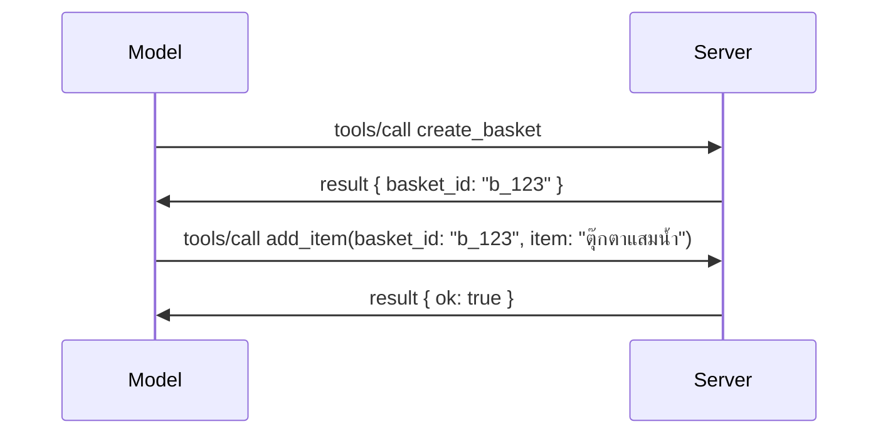

# มีอะไรเปลี่ยนแปลงใน MCP: สเปค 2026-07-28

> **สถานะ:** สุดท้าย MCP Specification `2026-07-28` ส่งในวันที่ 28 กรกฎาคม 2026
> และเป็นการแก้ไขโปรโตคอลในปัจจุบัน บทเรียนนี้อธิบายสเปคสุดท้าย
> ตัวอย่างบางตัวในหลักสูตรยังระบุเวอร์ชันชัดเจนที่
> `2025-11-25` เพราะ SDK ของพวกเขายังไม่ได้ใช้ API แบบ stateless ใหม่;
> ให้ถือว่าตัวอย่างเหล่านั้นเป็นแนวทางความเข้ากันได้แบบเก่า

## ภาพรวม

`2026-07-28` เป็นการแก้ไข MCP ที่ใหญ่ที่สุดตั้งแต่เปิดตัวมา หก
ข้อเสนอการปรับปรุงสเปค (SEPs) เอา session ระดับโปรโตคอลออกและ
ทำให้ MCP ไม่มีสถานะที่ชั้นการขนส่ง ส่วนขยายกลายเป็นกลไกระดับแรก
ที่มีเวอร์ชัน และฟีเจอร์หลายอย่างที่กล่าวถึงก่อนหน้านี้ในหลักสูตรนี้
(Roots, Sampling, Logging) ถูกเลิกใช้ภายใต้นโยบายวงจรชีวิตใหม่ บทเรียนนี้
สรุปสิ่งที่เปลี่ยนแปลง ทำไมมันสำคัญ และมันหมายความว่าอย่างไรสำหรับโค้ด
ที่เขียนตาม `2025-11-25`

แหล่งที่มา: [The 2026-07-28 MCP Specification Release Candidate](https://blog.modelcontextprotocol.io/posts/2026-07-28-release-candidate/) (Model Context Protocol Blog, David Soria Parra and Den Delimarsky).

## วัตถุประสงค์การเรียนรู้

เมื่อเรียนจบบทเรียนนี้ คุณจะสามารถ:

- อธิบายว่าทำไม MCP ถึงเปลี่ยนเป็นโปรโตคอลแบบ stateless และมันแก้ปัญหาอะไรสำหรับการปรับขนาดในแนวนอน
- อธิบายถึงการแทนที่ handshake `initialize`/`initialized` และ header `Mcp-Session-Id`
- ระบุ header ใหม่ `Mcp-Method` และ `Mcp-Name` และ metadata การแคช `ttlMs`/`cacheScope`
- รับรู้ถึงกรอบงาน Extensions และส่วนขยายสองตัวที่มาพร้อมกับรีลีสนี้: MCP Apps และ Tasks
- สรุปการเสริมความแข็งแกร่งในการอนุญาตและการเลิกใช้ Dynamic Client Registration

- ระบุว่าฟีเจอร์หลักใดบ้าง (Roots, Sampling, Logging) ที่ถูกเลิกใช้และความหมายในทางปฏิบัติ
- อธิบายการเปลี่ยนแปลง Full JSON Schema 2020-12 สำหรับ `inputSchema`/`outputSchema` ของเครื่องมือ

## โปรโตคอลแบบ Stateless

การเปลี่ยนแปลงที่สำคัญ: MCP กลายเป็น stateless ที่ชั้นโปรโตคอล

### ก่อนหน้า (2025-11-25): sessions ผูกกับเซิร์ฟเวอร์ตัวใดตัวหนึ่ง

การเรียกเครื่องมือผ่าน Streamable HTTP เริ่มต้นด้วย handshake `initialize` เซิร์ฟเวอร์ตอบด้วย header `Mcp-Session-Id` ที่คำขอถัดไปทุกครั้งต้องมี:

```http
POST /mcp HTTP/1.1
Mcp-Session-Id: 1868a90c-3a3f-4f5b
Content-Type: application/json

{"jsonrpc":"2.0","id":2,"method":"tools/call",
 "params":{"name":"search","arguments":{"q":"otters"}}}
```

เพราะ session ผูกกับเซิร์ฟเวอร์ที่สร้าง session นั้น การปรับขนาดในแนวนอนจึงต้องใช้ **การทำเส้นทางแบบติด** ที่โหลดบาลานเซอร์และ **การแชร์ session store** ระหว่างหลายอินสแตนซ์

### หลังจากนี้ (2026-07-28): ทุกคำขอเป็นอิสระในตัวเอง

```http
POST /mcp HTTP/1.1
MCP-Protocol-Version: 2026-07-28
Mcp-Method: tools/call
Mcp-Name: search
Content-Type: application/json

{"jsonrpc":"2.0","id":1,"method":"tools/call",
 "params":{"name":"search","arguments":{"q":"otters"},
           "_meta":{"io.modelcontextprotocol/protocolVersion":"2026-07-28",
                    "io.modelcontextprotocol/clientInfo":{"name":"my-app","version":"1.0"},
                    "io.modelcontextprotocol/clientCapabilities":{}}}}
```

เซิร์ฟเวอร์อินสแตนซ์ใดก็สามารถจัดการคำขอนี้ได้ การเปลี่ยนแปลงสำคัญ:

- **การ handshake `initialize`/`initialized` ถูกลบออก** ([SEP-2575](https://github.com/modelcontextprotocol/modelcontextprotocol/pull/2575)) เวอร์ชันโปรโตคอล ข้อมูลลูกค้า และความสามารถของลูกค้าย้ายไปอยู่ใน `_meta` ของทุกคำขอ วิธีการใหม่ `server/discover` ให้ลูกค้าเรียกดูความสามารถเซิร์ฟเวอร์ก่อนเมื่อจำเป็น
- **ลบ header `Mcp-Session-Id` และ session ระดับโปรโตคอล** ([SEP-2567](https://github.com/modelcontextprotocol/modelcontextprotocol/pull/2567)) ไม่ต้องมีการทำเส้นทางแบบติดและ session store แบบแชร์ที่ชั้นโปรโตคอลอีกต่อไป

### โปรโตคอล stateless แต่แอปพลิเคชันเก็บสถานะได้

การลบ session ระดับโปรโตคอลไม่ได้หมายความว่าเซิร์ฟเวอร์ของคุณจะไม่สามารถเก็บสถานะได้ รูปแบบที่แนะนำเหมือนกับที่ API HTTP ใช้เสมอ: สร้าง handle เฉพาะ (เช่น `basket_id`, `browser_id`) จากการเรียกเครื่องมือครั้งหนึ่ง แล้วให้โมเดลส่ง handle นั้นกลับมาในฐานะอาร์กิวเมนต์ธรรมดาในการเรียกครั้งต่อไป



สิ่งนี้ทำให้สถานะมองเห็นและเข้าใจได้สำหรับโมเดลแทนที่จะซ่อนอยู่ใน metadata ของการขนส่ง และช่วยให้เซิร์ฟเวอร์อินสแตนซ์ใดก็ได้จัดการการเรียกใดก็ได้

### คำขอจากเซิร์ฟเวอร์ไปยังลูกค้า โครงสร้างใหม่

โปรโตคอลแบบ stateless ยังคงต้องมีวิธีให้เซิร์ฟเวอร์ขอข้อมูลอะไรบางอย่างจากลูกค้าระหว่างการเรียก (เช่น การกระตุ้น elicitation):

- **คำขอที่เซิร์ฟเวอร์เป็นฝ่ายริเริ่มอาจดำเนินการได้เฉพาะขณะที่เซิร์ฟเวอร์กำลังประมวลผลคำขอลูกค้า** ([SEP-2260](https://github.com/modelcontextprotocol/modelcontextprotocol/pull/2260)) — ก่อนหน้านี้เป็นเพียงคำแนะนำ ตอนนี้เป็นข้อบังคับ ผู้ใช้จะไม่ถูกกระตุ้นโดยไม่มีเหตุผล
- **คำขอรอบเดินทางหลายรอบ (Multi Round-Trip Requests)** ([SEP-2322](https://github.com/modelcontextprotocol/modelcontextprotocol/pull/2322)) แทนที่การเปิดสตรีม SSE ค้างไว้ โดยเซิร์ฟเวอร์ตอบกลับด้วย `InputRequiredResult`:

  ```json
  {
    "resultType": "input_required",
    "inputRequests": {
      "confirm": {
        "type": "elicitation",
        "message": "Delete 3 files?",
        "schema": { "type": "boolean" }
      }
    },
    "requestState": "eyJzdGVwIjoxLCJmaWxlcyI6WyJhIiwiYiIsImMiXX0="
  }
  ```

  ลูกค้ารวบรวมคำตอบและส่งคำขอเดิมซ้ำพร้อม `inputResponses` และ `requestState` ที่ส่งกลับมาพร้อมกัน เซิร์ฟเวอร์อินสแตนซ์ใดก็ได้สามารถรับคำขอซ้ำได้เพราะข้อมูลครบถ้วนในเพย์โหลด

### ส่งเส้นทางได้ แคชได้ และสามารถตรวจสอบได้

การเปลี่ยนแปลงเล็กๆ สามอย่างทำให้การจราจรแบบ stateless ง่ายต่อการจัดการ:

- **เพิ่ม header `Mcp-Method` และ `Mcp-Name` บน Streamable HTTP เป็นข้อกำหนด** ([SEP-2243](https://github.com/modelcontextprotocol/modelcontextprotocol/pull/2243)) เพื่อให้โหลดบาลานเซอร์ เกตเวย์ และตัวจำกัดอัตราสามารถสั่งเส้นทางตามคำสั่งได้โดยไม่ต้องดูเนื้อหา JSON เซิร์ฟเวอร์จะปฏิเสธคำขอที่ header กับเนื้อหาไม่ตรงกัน
- **ผลลัพธ์ของ `tools/list` และ resource read มาพร้อม `ttlMs` และ `cacheScope`** ([SEP-2549](https://github.com/modelcontextprotocol/modelcontextprotocol/pull/2549)) ตามแบบ HTTP `Cache-Control` ลูกค้ารู้ว่าผลลัพธ์ลิสต์สดนานแค่ไหนและปลอดภัยที่จะใช้ร่วมกันระหว่างผู้ใช้หรือไม่โดยไม่ต้องพึ่งพาสตรีม SSE ที่ดำเนินไปนานเพื่อเรียนรู้การเปลี่ยนแปลง
- **เอกสารการแพร่กระจาย W3C Trace Context ใน `_meta`** ([SEP-414](https://github.com/modelcontextprotocol/modelcontextprotocol/pull/414)) แก้ไขชื่อคีย์ `traceparent`, `tracestate`, และ `baggage` เพื่อให้การติดตามแบบกระจายสามารถตามการเรียกผ่าน SDK ฝั่งลูกค้า MCP เซิร์ฟเวอร์และระบบปลายทางใน backend ที่สนับสนุน [OpenTelemetry](https://opentelemetry.io/)

## Extensions กลายเป็นสถานะหลัก

Extensions มีอยู่แบบไม่เป็นทางการใน `2025-11-25` [SEP-2133](https://github.com/modelcontextprotocol/modelcontextprotocol/pull/2133) ทำให้เป็นทางการ:

- Extensions ถูกระบุโดย ID แบบ reverse-DNS
- เจรจาผ่านแผนที่ `extensions` บนความสามารถของลูกค้าและเซิร์ฟเวอร์
- อยู่ในที่เก็บ `ext-*` ของตัวเอง มีผู้ดูแลคอยดูแลและเวอร์ชันแยกจากสเปคแกนกลาง
- ติดตาม Extensions ในกระบวนการ SEP ให้เส้นทางจากสถานะทดลองสู่สถานะทางการ

รีลีสนี้มาพร้อมกับส่วนขยายทางการสองตัว

### MCP Apps: อินเทอร์เฟซผู้ใช้ที่เซิร์ฟเวอร์เรนเดอร์

[MCP Apps](https://blog.modelcontextprotocol.io/posts/2026-01-26-mcp-apps/) ([SEP-1865](https://github.com/modelcontextprotocol/modelcontextprotocol/pull/1865)) ให้เซิร์ฟเวอร์ส่งอินเทอร์เฟซ HTML ที่โต้ตอบได้ซึ่งโฮสต์จะเรนเดอร์ใน iframe ที่แยกพื้นที่ เทมเพลต UI ของเครื่องมือประกาศล่วงหน้าเพื่อให้โฮสต์สามารถดึงล่วงหน้า แคช และตรวจสอบความปลอดภัยก่อนรัน คุณได้เรียนรู้พื้นฐานใน [บทเรียน 15: MCP Apps](../03-GettingStarted/15-mcp-apps/README.md) — ภายใต้กรอบ Extensions, MCP Apps ตอนนี้เป็นส่วนขยายอย่างเป็นทางการแทนฟีเจอร์ทดลองในแกนหลัก

### Tasks เป็นส่วนขยายเต็มตัว

Tasks เคยเป็นฟีเจอร์ทดลองใน `2025-11-25` การใช้งานจริงทำให้เกิดการออกแบบใหม่ที่ถูกต้องคือเป็นส่วนขยาย: [Tasks extension](https://github.com/modelcontextprotocol/modelcontextprotocol/pull/2663) ปรับวงจรชีวิตให้เข้ากับโมเดล stateless — เซิร์ฟเวอร์ตอบ `tools/call` ด้วย task handle และลูกค้าขับเคลื่อนมันด้วย `tasks/get`, `tasks/update`, และ `tasks/cancel` การสร้างงานถูกควบคุมโดยเซิร์ฟเวอร์: ลูกค้าโฆษณาส่วนขยายและเซิร์ฟเวอร์ตัดสินใจว่าคำขอใดจะรันเป็นงาน `tasks/list` ถูกลบออกทั้งหมดเพราะไม่สามารถจำกัดขอบเขตอย่างปลอดภัยโดยไม่มี session

> **หมายเหตุการย้าย:** หากคุณใช้งาน API Tasks ทดลอง `2025-11-25` คุณต้องย้ายไปยังวงจรชีวิตส่วนขยายใหม่ — ซึ่งไม่รองรับย้อนหลัง

## การเสริมความแข็งแกร่งการอนุญาต

SEPs หลายข้อเสริมความแข็งแกร่งใน
[สเปคการอนุญาต](https://modelcontextprotocol.io/specification/2026-07-28/basic/authorization)
ให้สอดคล้องกับการใช้งาน OAuth 2.0 / OpenID Connect จริงมากขึ้น:

| SEP | การเปลี่ยนแปลง |
|---|---|
| [SEP-2468](https://github.com/modelcontextprotocol/modelcontextprotocol/pull/2468) | ลูกค้าต้องตรวจสอบพารามิเตอร์ `iss` ในการตอบรับอนุญาตตาม [RFC 9207](https://www.rfc-editor.org/rfc/rfc9207) เพื่อลดปัญหาการสับสนที่พบในรูปแบบ MCP ที่มีลูกค้าเดียวหลายเซิร์ฟเวอร์ เวอร์ชันในอนาคตจะบังคับปฏิเสธการตอบรับที่ไม่มี `iss` |
| [SEP-837](https://github.com/modelcontextprotocol/modelcontextprotocol/pull/837) | ลูกค้า Dynamic Client Registration แบบ compatibility-only ระบุชนิดแอป OpenID Connect `application_type` เพื่อหลีกเลี่ยงค่าเริ่มต้น `"web"` ที่ไม่ถูกต้องสำหรับลูกค้าเดสก์ท็อปและ CLI |
| [SEP-2352](https://github.com/modelcontextprotocol/modelcontextprotocol/pull/2352) | ข้อมูลรับรองที่ลงทะเบียนแบบ compatibility-only ถูกผูกมัดกับ `issuer` ของเซิร์ฟเวอร์อนุญาตที่ออกข้อมูลลูกค้าต้องลงทะเบียนใหม่หากทรัพยากรย้ายที่ |
| [SEP-2207](https://github.com/modelcontextprotocol/modelcontextprotocol/pull/2207) | เอกสารการขอโทเค็นรีเฟรชจากเซิร์ฟเวอร์อนุญาตแบบ OpenID Connect |
| [SEP-2350](https://github.com/modelcontextprotocol/modelcontextprotocol/pull/2350) | ชี้แจงการสะสมขอบเขตระหว่างการอนุญาตแบบสูงขึ้น |
| [SEP-2351](https://github.com/modelcontextprotocol/modelcontextprotocol/pull/2351) | ชี้แจงส่วนขยาย `.well-known` สำหรับการค้นหา |

หากคุณกำลังสร้างเซิร์ฟเวอร์อนุญาตสำหรับ MCP ให้ส่ง `iss` ใน
การตอบรับอนุญาตและทำตามสเปคการอนุญาตขั้นสุดท้าย ดู
[02-Security](../02-Security/README.md) สำหรับแนวทางการใช้งาน

Dynamic Client Registration ยังคงใช้ได้เพื่อความเข้ากันได้ แต่ก็ถูก
เลิกใช้ใน `2026-07-28` การติดตั้งใหม่ควรใช้ Client ID Metadata
Documents

## ฟีเจอร์ที่เลิกใช้

ภายใต้นโยบาย
[วงจรชีวิตฟีเจอร์](https://github.com/modelcontextprotocol/modelcontextprotocol/pull/2577),
Roots, Sampling, Logging และ Dynamic Client Registration ถูก **เลิกใช้**:

| ฟีเจอร์ | การทดแทนที่แนะนำ |
|---|---|
| Roots | พารามิเตอร์เครื่องมือ, URI ของทรัพยากร, หรือการตั้งค่าเซิร์ฟเวอร์ |
| Sampling | การรวมโดยตรงกับ API ของผู้ให้บริการ LLM |
| Logging | `stderr` สำหรับการขนส่ง stdio; OpenTelemetry สำหรับการสังเกตการณ์เชิงโครงสร้าง |
| Dynamic Client Registration | Client ID Metadata Documents |

ฟีเจอร์เหล่านี้ยังคงอยู่ใน `2026-07-28` เพื่อความเข้ากันได้ โดยมีสิทธิ์
ถูกลบในสเปคฉบับแรกที่ออกในหรือหลัง 28 กรกฎาคม 2027;
การลบจริงอาจเกิดขึ้นในภายหลัง การติดตั้งใหม่ควรใช้รูปแบบทดแทน
ข้างต้น

## Full JSON Schema 2020-12 สำหรับเครื่องมือ

`inputSchema` และ `outputSchema` ของเครื่องมือถูกยกเป็น [JSON Schema 2020-12](https://json-schema.org/draft/2020-12) เต็มรูปแบบ ([SEP-2106](https://github.com/modelcontextprotocol/modelcontextprotocol/pull/2106)):

- schema ของอินพุตยังคงบังคับ root เป็น `type: "object"` แต่ตอนนี้อนุญาต composition (`oneOf`, `anyOf`, `allOf`), เงื่อนไข และการอ้างอิง (`$ref`, `$defs`)
- schema ของเอาต์พุตไม่มีข้อจำกัด และ `structuredContent` ตอนนี้สามารถเป็นค่า JSON ใดก็ได้ไม่จำกัดแค่เฉพาะวัตถุ
- การใช้งานต้องไม่แก้ไข URI อ้างอิงภายนอก `$ref` อัตโนมัติและควรจำกัดความลึกของ schema กับเวลาการตรวจสอบ (พิจารณาการโจมตีปฏิเสธบริการหากตรวจสอบ schema ฝั่งเซิร์ฟเวอร์)

แยกต่างหาก รหัสข้อผิดพลาดสำหรับทรัพยากรหายไปเปลี่ยนจาก MCP-แบบกำหนดเอง `-32002` เป็น JSON-RPC มาตรฐาน `-32602` (Invalid Params) ([SEP-2164](https://github.com/modelcontextprotocol/modelcontextprotocol/pull/2164)) หากไคลเอนต์ของคุณเช็คค่าตรงตัว `-32002` คุณต้องอัปเดต

## อนาคตของโปรโตคอล

รีลีสนี้มีการเปลี่ยนแปลงแบบทำลาย (breaking changes) ซึ่งผู้ดูแล MCP ไม่ตั้งใจให้เป็นเรื่องปกติในอนาคต SEPs ด้านการควบคุมสามข้อมีเป้าหมายป้องกันไม่ให้เกิดซ้ำ:

- **นโยบายวงจรชีวิตฟีเจอร์** ให้เส้นทาง Active → Deprecated → Removed สำหรับทุกฟีเจอร์ โดยมีช่วงเวลาอย่างน้อยสิบสองเดือนระหว่างการเลิกใช้และการลบที่เป็นไปได้เร็วที่สุด
- **กรอบงาน Extensions** ให้ความสามารถใหม่ออกมาเป็นส่วนขยายแบบเลือกใช้งานได้และเสถียรก่อน (ถ้ามี) ก่อนย้ายเข้าสู่สเปคแกนกลาง
- SEP Track มาตรฐานไม่สามารถถึงสถานะสุดท้ายจนกว่าสถานการณ์ที่ตรงกันจะมีใน [conformance suite](https://github.com/modelcontextprotocol/conformance) ([SEP-2484](https://github.com/modelcontextprotocol/modelcontextprotocol/pull/2484)) — ซึ่งคือชุดเดียวกับที่ระบบระดับ SDK ([SDK tier system](https://github.com/modelcontextprotocol/modelcontextprotocol/pull/1777)) ให้คะแนน SDK อย่างเป็นทางการ

## ไทม์ไลน์การปล่อยและการตรวจสอบ

- ตัว release candidate ถูกล็อกวันที่ 21 พฤษภาคม 2026
- สเปคสุดท้ายส่งในวันที่ 28 กรกฎาคม 2026

- การสนับสนุน SDK อาจล่าช้ากว่าการกำหนดสเปค ตรวจสอบ
  [เอกสาร SDK](https://modelcontextprotocol.io/docs/sdk) และ
  หมายเหตุการออกรุ่นของ SDK ก่อนย้ายตัวอย่าง
- ติดตามการเปลี่ยนแปลงขั้นสุดท้ายใน
  [การกำหนดสเปควันที่ 2026-07-28](https://modelcontextprotocol.io/specification/2026-07-28/)
  และ
  [รายการเปลี่ยนแปลง](https://modelcontextprotocol.io/specification/2026-07-28/changelog)

## หมายความว่าอย่างไรสำหรับหลักสูตรนี้

หลักสูตรกำลังเปลี่ยนจากตัวอย่าง `2025-11-25` ไปสู่การกำหนดสเปค
`2026-07-28` ปัจจุบัน โดยเฉพาะ:

- **เซสชันและการจับมือ `initialize`** ในตัวอย่างที่มุ่งเป้าไปที่
  `2025-11-25` คือพฤติกรรมแบบเก่า โปรโตคอล `2026-07-28`
  แทนที่ด้วยโมเดลคำขอที่ไม่มีสถานะข้างต้น
- **การสุ่มตัวอย่างและ Roots** ยังคงใช้งานได้สำหรับความเข้ากันได้
  แต่ถูกยกเลิกแล้ว การออกแบบใหม่ควรใช้รูปแบบทดแทนที่ระบุไว้ข้างต้น
- **ฟีเจอร์ Tasks แบบทดลอง** หากคุณได้ใช้ จะต้องย้ายไปยังวัฏจักรชีวิตใหม่ของส่วนขยาย Tasks
- **แอป MCP** ([บทเรียน 15](../03-GettingStarted/15-mcp-apps/README.md)) ไม่มีผลกระทบในทางปฏิบัติ; แค่ย้ายไปอยู่ภายใต้กรอบส่วนขยายอย่างเป็นทางการ

## แหล่งข้อมูลเพิ่มเติม

- [การกำหนดสเปค MCP 2026-07-28](https://modelcontextprotocol.io/specification/2026-07-28/)
- [รายการเปลี่ยนแปลง 2026-07-28](https://modelcontextprotocol.io/specification/2026-07-28/changelog)
- [ตัวอย่างปล่อยรุ่น MCP 2026-07-28 (โพสต์บล็อกในอดีต)](https://blog.modelcontextprotocol.io/posts/2026-07-28-release-candidate/)
- [อนาคตของการขนส่ง MCP](https://blog.modelcontextprotocol.io/posts/2025-12-19-mcp-transport-future/)
- [แนวทาง SEP](https://modelcontextprotocol.io/community/sep-guidelines)
- [ระบบระดับ SDK MCP](https://modelcontextprotocol.io/docs/sdk)

## ขั้นตอนต่อไป

กลับไปที่ [แนวคิดหลัก](./README.md) หรือดำเนินการต่อที่
[ความปลอดภัย](../02-Security/README.md) เพื่อใช้คำแนะนำ `2026-07-28` ปัจจุบัน

---

<!-- CO-OP TRANSLATOR DISCLAIMER START -->
**ปฏิเสธความรับผิดชอบ**:
เอกสารนี้ได้รับการแปลโดยใช้บริการแปลภาษา AI [Co-op Translator](https://github.com/Azure/co-op-translator) ขณะที่เราพยายามให้ความถูกต้อง โปรดทราบว่าการแปลโดยอัตโนมัติอาจมีข้อผิดพลาดหรือความไม่ถูกต้อง เอกสารต้นฉบับในภาษาต้นทางควรถูกพิจารณาเป็นแหล่งข้อมูลที่เชื่อถือได้ สำหรับข้อมูลที่สำคัญ แนะนำให้ใช้การแปลโดยมนุษย์มืออาชีพ เราไม่รับผิดชอบต่อความเข้าใจผิดหรือการตีความที่ผิดพลาดที่เกิดขึ้นจากการใช้การแปลนี้
<!-- CO-OP TRANSLATOR DISCLAIMER END -->