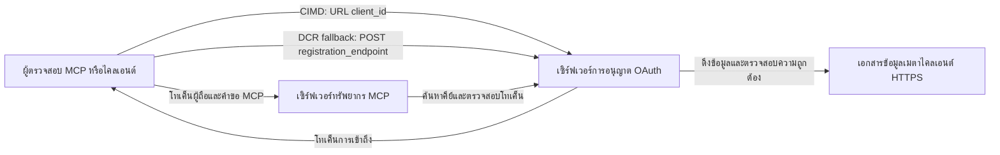

# ตัวอย่างการอนุญาต CIMD และ DCR

ตัวอย่าง TypeScript นี้เปรียบเทียบสองวิธีที่ไคลเอนต์ OAuth สามารถรับตัวตน
ก่อนเข้าถึงเซิร์ฟเวอร์ MCP ที่ป้องกันไว้:

- **เอกสารข้อมูลประจำตัวไคลเอนต์ (CIMD)** ใช้ URL HTTPS ที่เสถียรเป็น
  `client_id` นี่คือกลไกที่แนะนำสำหรับไคลเอนต์และเซิร์ฟเวอร์การอนุญาต
  ที่ไม่มีความสัมพันธ์ล่วงหน้า
- **การลงทะเบียนไคลเอนต์แบบไดนามิก (DCR)** ขอให้เซิร์ฟเวอร์อนุญาตสร้าง
  client ID แบบไม่โปร่งใสในเวลารัน MCP `2026-07-28` ยังรักษา DCR สำหรับ
  ความเข้ากันได้ย้อนหลังเท่านั้น

ตัวอย่างใช้ SDK MCP TypeScript v2 ที่เสถียรและโมเดลคำขอ
MCP `2026-07-28` แบบไม่มีสถานะ ใช้งานร่วมกับเซิร์ฟเวอร์การอนุญาต 
OAuth 2.1/OpenID Connect ภายนอก เช่น Auth0 เซิร์ฟเวอร์ MCP เป็นเซิร์ฟเวอร์
ทรัพยากร: ตรวจสอบโทเค็นการเข้าถึงแต่ไม่ตรวจสอบผู้ใช้หรือออก
โทเค็น

## วัตถุประสงค์การเรียนรู้

โดยทำตัวอย่างนี้ให้เสร็จ คุณจะสามารถ:

- อธิบายว่าทำไม CIMD ถึงได้รับการแนะนำมากกว่า DCR สำหรับไคลเอนต์ MCP ใหม่
- เผยแพร่เอกสาร CIMD ที่ถูกต้องสำหรับไคลเอนต์เนทีฟสาธารณะ
- กำหนดค่าเซิร์ฟเวอร์ทรัพยากร MCP สำหรับการค้นพบ OAuth และการตรวจสอบ JWT
- ฝึกฝน CIMD และ DCR กับเซิร์ฟเวอร์ MCP และเซิร์ฟเวอร์การอนุญาตเดียวกัน
- บังคับใช้ขอบเขต OAuth ภายในเครื่องมือ MCP
- ระบุความรับผิดชอบที่เป็นของไคลเอนต์ เซิร์ฟเวอร์ทรัพยากร และ
  เซิร์ฟเวอร์การอนุญาต

## สถาปัตยกรรม



เซิร์ฟเวอร์การอนุญาตเลือกและตรวจสอบกลไกการลงทะเบียน
เซิร์ฟเวอร์ MCP เห็นเพียงคำกล่าวอ้าง `client_id` ที่ถูกตรวจสอบแล้วเท่านั้น URL HTTPS
พร้อมเส้นทางระบุ CIMD รหัสไม่โปร่งใสไม่เพียงพอที่จะพิสูจน์ DCR เพราะ
ไคลเอนต์ที่ลงทะเบียนล่วงหน้าก็ใช้รหัสไม่โปร่งใสได้เช่นกัน; ตัวเลือก
`DCR_CLIENT_ID_PREFIX` เป็นตัวช่วยแสดงตัวอย่างเฉพาะของผู้ให้บริการ

## ลำดับความสำคัญการลงทะเบียน

ไคลเอนต์ MCP ที่รองรับทุกกลไกควรใช้ลำดับนี้:

1. ใช้ข้อมูลไคลเอนต์ที่ลงทะเบียนล่วงหน้าเมื่อพร้อมใช้งานแล้ว
2. ใช้ CIMD เมื่อเซิร์ฟเวอร์การอนุญาตประกาศ
   `client_id_metadata_document_supported: true`
3. ใช้ DCR เป็นทางเลือกสำรองเมื่อเซิร์ฟเวอร์ประกาศ
   `registration_endpoint`
4. ขอข้อมูลไคลเอนต์ที่ลงทะเบียนล่วงหน้าจากผู้ใช้เมื่อไม่มีสิ่งใดข้างต้น
   พร้อมใช้งาน

## การจัดโครงสร้างโครงการ

```text
src/
  config.ts          Environment validation
  dcr.ts             DCR compatibility request
  mcp.ts             MCP tools and scope checks
  oauth.ts           Authorization metadata and JWT verification
  register-dcr.ts    DCR command-line helper
  registration.ts    CIMD document and mechanism classification
  server.ts          Express, OAuth discovery, and MCP endpoint
test/
  dcr.test.ts
  oauth.test.ts
  registration.test.ts
  server.test.ts
```

## ข้อกำหนดเบื้องต้น

- Node.js 20.6 หรือใหม่กว่า สคริปต์ใช้ `--env-file` และ `--import`
- เซิร์ฟเวอร์การอนุญาต OAuth 2.1/OpenID Connect ที่รองรับ:
  - โฟลว์รหัสอนุญาตพร้อม S256 PKCE
  - เมตาดาต้าทรัพยากร OAuth Protected และ Resource Indicators
  - โทเค็นการเข้าถึง JWT และจุดสิ้นสุด JWKS
  - CIMD รวมถึง DCR หากต้องการเปรียบเทียบวิธีถอยหลัง
- MCP Inspector หรือไคลเอนต์ MCP `2026-07-28` อื่น
- URL HTTPS สาธารณะสำหรับเอกสาร CIMD; อุโมงค์พัฒนาก็เหมาะสำหรับ
  ห้องปฏิบัติการ ใช้โดเมนเสถียรในโปรดักชัน

## ติดตั้งและทดสอบ

```bash
npm install
npm run build
npm test
```

การทดสอบสิบสองครั้งใช้คีย์ในเครื่องและจุดสิ้นสุด HTTP จำลอง ไม่ต้องการ
บัญชีเซิร์ฟเวอร์การอนุญาต ตรวจสอบ:

- รูปแบบเอกสาร CIMD และข้อจำกัด URL
- การจำแนกไคลเอนต์ URL และรหัสไม่โปร่งใสอย่างถูกต้อง
- การจัดการคำขอและการตอบสนอง DCR
- การปฏิเสธจุดสิ้นสุด DCR ที่ไม่ปลอดภัยและไม่ใช่ลูปแบ็ค
- การตรวจสอบลายเซ็น JWT, ผู้ออก, ผู้รับ, วันหมดอายุ, client ID และขอบเขต
- การเรียก MCP `2026-07-28` ในโปรเซสไปยัง `registration-info`

## กำหนดค่าเซิร์ฟเวอร์การอนุญาต

ชื่อการควบคุมที่แน่นอนแตกต่างกันไปตามผู้ให้บริการ กำหนดค่าความสามารถเหล่านี้:

1. สร้าง API หรือเซิร์ฟเวอร์ทรัพยากรที่มีตัวระบุที่ตรงกับ URL MCP ของคุณ
   อย่างแม่นยำ รวม `/mcp` เช่น `http://127.0.0.1:3001/mcp`
2. ใช้โทเค็นการเข้าถึง RS256 และรวมคำกล่าวอ้าง `client_id` หรือ `azp`
3. เพิ่มสิทธิ์หรือขอบเขต `tool:greet`
4. เปิดใช้งานโฟลว์รหัสอนุญาตพร้อม S256 PKCE สำหรับไคลเอนต์เนทีฟสาธารณะ
5. เปิดใช้งานเอกสารข้อมูลประจำตัวไคลเอนต์
6. สำหรับการเปรียบเทียบเท่านั้น เปิดใช้งานการลงทะเบียนไคลเอนต์แบบไดนามิก
7. ตรวจสอบว่าเมตาดาต้าเซิร์ฟเวอร์อนุญาตประกาศ:
   - `issuer`
   - `authorization_endpoint`
   - `token_endpoint`
   - `jwks_uri`
   - `client_id_metadata_document_supported: true`
   - `registration_endpoint` เมื่อต้องการเปิดใช้งาน DCR

### ตัวอย่าง Auth0

สำหรับ Auth0 ให้เปิดใช้งานการลงทะเบียนเอกสารข้อมูลประจำตัวไคลเอนต์,
การลงทะเบียนแอปพลิเคชันไดนามิก OIDC และความเข้ากันได้ของพารามิเตอร์ทรัพยากร 
สร้าง API ที่มีตัวระบุเป็น URL MCP ที่แม่นยำและเพิ่มสิทธิ์ `tool:greet`
อนุญาตให้ผู้ใช้ทดสอบและไคลเอนต์บุคคลที่สามร้องขอสิทธิ์นั้น

แดชบอร์ดผู้ให้บริการและฟีเจอร์เปลี่ยนแปลงตามเวลา ตรวจสอบเอกสาร
ของผู้ให้บริการก่อนใช้การตั้งค่าเหล่านี้นอกห้องปฏิบัติการนี้

## กำหนดค่าตัวอย่าง

สร้าง `.env` จากตัวอย่าง:

```powershell
Copy-Item .env.example .env
```

บนเชลล์ที่รองรับ bash:

```bash
cp .env.example .env
```

กำหนดค่าดังนี้:

```dotenv
MCP_SERVER_URL=http://127.0.0.1:3001/mcp
AUTHORIZATION_SERVER_ISSUER=https://your-tenant.example.com/
AUTHORIZATION_SERVER_METADATA_URL=https://your-tenant.example.com/.well-known/openid-configuration
CLIENT_METADATA_URL=https://your-public-host.example.com/client-metadata.json
OAUTH_REDIRECT_URIS=http://127.0.0.1:6274/oauth/callback
DCR_CLIENT_ID_PREFIX=tpc_
```

รายละเอียดสำคัญ:

- `AUTHORIZATION_SERVER_ISSUER` ต้องตรงกับ `issuer` ในเมตาดาต้าเซิร์ฟเวอร์การอนุญาตที่พบ
  รวมทั้งสแลชท้ายด้วย
- `MCP_SERVER_URL` ต้องตรงกับผู้รับโทเค็นการเข้าถึง
- `CLIENT_METADATA_URL` ต้องใช้ HTTPS มีเส้นทางที่ไม่ใช่รูท และเป็น
  URL สาธารณะที่ให้บริการเส้นทางเมตาดาต้า คิวรีสตริงและส่วนประกอบถูก
  ปฏิเสธเพื่อให้เส้นทางและ `client_id` เหมือนกัน
- `OAUTH_REDIRECT_URIS` เป็นรายการอนุญาตที่คั่นด้วยจุลภาค ค่าเริ่มต้นคือ
  คำตอบลูปแบ็ค MCP Inspector
- `DCR_CLIENT_ID_PREFIX` เป็นตัวเลือกและเฉพาะผู้ให้บริการ ปล่อยว่างไว้เมื่อ
  ผู้ให้บริการไม่มีคำนำหน้า DCR ที่น่าเชื่อถือ

## เผยแพร่เอกสาร CIMD

เริ่มอุโมงค์ที่ส่งต้นทาง HTTPS สาธารณะไปยัง `127.0.0.1:3001`
ตั้งค่า `CLIENT_METADATA_URL` เป็นต้นทางนั้นพร้อม `/client-metadata.json` แล้วเรียกใช้:

```bash
npm run build
npm start
```

ตรวจสอบเอกสารการค้นพบทั้งสอง:

```bash
curl http://127.0.0.1:3001/health
curl http://127.0.0.1:3001/client-metadata.json
curl http://127.0.0.1:3001/.well-known/oauth-protected-resource/mcp
```

`client_id` ที่ส่งกลับโดย URL เมตาดาต้า HTTPS สาธารณะต้องตรงกับ URL นั้น
แบบไบต์ต่อไบต์ เซิร์ฟเวอร์การอนุญาตต้องตรวจสอบเอกสารและ
URI เปลี่ยนเส้นทางก่อนออกโทเค็น

> [!NOTE]
> ตัวอย่างโฮสต์เอกสารไคลเอนต์และเซิร์ฟเวอร์ทรัพยากร MCP ในโปรเซสเดียว
> เพื่อให้ห้องปฏิบัติการมีขนาดเล็ก ในโปรดักชัน ไคลเอนต์ MCP เป็นเจ้าของและโฮสต์
> เอกสาร CIMD ของตนเองแยกจากเซิร์ฟเวอร์ทรัพยากร

## เปรียบเทียบ CIMD และ DCR

เริ่ม MCP Inspector:

```bash
npx @modelcontextprotocol/inspector
```

ใช้ Streamable HTTP และเชื่อมต่อไปยัง `http://127.0.0.1:3001/mcp`

### CIMD (แนะนำ)


1. ป้อน `CLIENT_METADATA_URL` สาธารณะเป็น OAuth Client ID
2. ขอ `tool:greet` รวมทั้งสโคปข้อมูลประจำตัวใด ๆ ที่ผู้ให้บริการของคุณต้องการ
3. ดำเนินการลงชื่อเข้าใช้และยินยอมให้เสร็จสมบูรณ์
4. เรียก `registration-info` จะรายงาน `mechanism: "cimd"`
5. เรียก `greet` เพื่อยืนยันการบังคับใช้สโคป

### DCR (การย้อนกลับความเข้ากันได้)

1. ล้างสถานะ OAuth ที่บันทึกไว้ของ Inspector
2. ปล่อยให้ช่อง OAuth Client ID ว่างเพื่อให้ Inspector ใช้ `registration_endpoint` ที่ประกาศ
   ได้
3. ดำเนินการลงชื่อเข้าใช้และยินยอมให้เสร็จสมบูรณ์
4. เรียก `registration-info`
5. หาก `DCR_CLIENT_ID_PREFIX` ตรงกับ ID ที่ผู้ให้บริการสร้างขึ้น เครื่องมือนี้
   จะรายงาน `mechanism: "dcr"` มิฉะนั้นจะรายงานถูกต้องเป็น
   `opaque-client-id`

คุณสามารถสาธิตคำขอลงทะเบียนโดยตรงได้ด้วย:

```bash
npm run build
npm run register:dcr
```

ตัวช่วยจะแสดง client ID ที่ส่งกลับ แต่จะไม่แสดง client secret ใด ๆ
ถือว่า secret ที่ส่งคืนทุกตัวเป็นข้อมูลลับและจัดเก็บในที่เก็บข้อมูลลับที่เหมาะสม

## เครื่องมือ

| เครื่องมือ | สโคปที่ต้องการ | วัตถุประสงค์ |
| --- | --- | --- |
| `registration-info` | client ที่ผ่านการตรวจสอบ | รายงานประเภท client ID |
| `greet` | `tool:greet` | แสดงการอนุญาตต่อเครื่องมือแต่ละตัว |

## หมายเหตุด้านความปลอดภัย

- ตรวจสอบลายเซ็น JWT ผ่านจุดสิ้นสุด JWKS ของเซิร์ฟเวอร์การอนุญาต
- ต้องการผู้ให้ข้อมูลผู้ใช้งานและกลุ่มเป้าหมายที่ตรงกันอย่างเคร่งครัด
- ต้องการวันหมดอายุและคำเรียกร้อง client ID
- ไม่ยอมรับโทเค็นที่ออกให้กับทรัพยากรที่แตกต่างกัน
- ไม่ส่งต่อโทเค็น MCP ไปยัง API ด้านล่าง
- รักษาข้อมูลรับรอง DCR ให้ผูกติดกับผู้สร้างข้อมูลรับรองเหล่านั้น
- ตรวจสอบ URI การเปลี่ยนเส้นทาง CIMD อย่างแม่นยำ
- ใช้มาตรการควบคุม SSRF เมื่อเซิร์ฟเวอร์การอนุญาตดึงข้อมูล URL CIMD
- ใช้ HTTPS สำหรับจุดสิ้นสุดการอนุญาตและเมตาดาต้าที่อยู่นอกการพัฒนาแบบ loopback

- อย่าสันนิษฐาน DCR จาก opaque client ID เว้นแต่ผู้ให้บริการจะระบุข้อกำหนด
  ของตัวระบุที่น่าเชื่อถือ

## การอ้างอิง

- [MCP authorization specification](https://modelcontextprotocol.io/specification/2026-07-28/basic/authorization)
- [MCP client registration](https://modelcontextprotocol.io/specification/2026-07-28/basic/authorization/client-registration)
- [MCP security best practices](https://modelcontextprotocol.io/specification/2026-07-28/basic/security_best_practices)
- [MCP TypeScript SDK v2 authorization guide](https://ts.sdk.modelcontextprotocol.io/v2/serving/authorization)
- [OAuth Dynamic Client Registration (RFC 7591)](https://datatracker.ietf.org/doc/html/rfc7591)
- [OAuth Client ID Metadata Document draft](https://datatracker.ietf.org/doc/html/draft-ietf-oauth-client-id-metadata-document-00)

## คำขอบคุณ

แนวทางการสอนแบบเคียงข้างกันได้รับแรงบันดาลใจจาก
[Sambego/auth0-xmcp-cimd](https://github.com/Sambego/auth0-xmcp-cimd) ตัวอย่างนี้เป็นการดำเนินการดั้งเดิมที่เป็นกลางต่อผู้ให้บริการ สร้างขึ้นด้วย MCP TypeScript SDK v2 อย่างเป็นทางการสำหรับหลักสูตรนี้
MCP TypeScript SDK v2 สำหรับหลักสูตรนี้


---

<!-- CO-OP TRANSLATOR DISCLAIMER START -->
**ปฏิเสธความรับผิดชอบ**:
เอกสารนี้ได้รับการแปลโดยใช้บริการแปลภาษา AI [Co-op Translator](https://github.com/Azure/co-op-translator) ขณะที่เราพยายามให้ความถูกต้อง โปรดทราบว่าการแปลโดยอัตโนมัติอาจมีข้อผิดพลาดหรือความไม่ถูกต้อง เอกสารต้นฉบับในภาษาต้นทางควรถูกพิจารณาเป็นแหล่งข้อมูลที่เชื่อถือได้ สำหรับข้อมูลที่สำคัญ แนะนำให้ใช้การแปลโดยมนุษย์มืออาชีพ เราไม่รับผิดชอบต่อความเข้าใจผิดหรือการตีความที่ผิดพลาดที่เกิดขึ้นจากการใช้การแปลนี้
<!-- CO-OP TRANSLATOR DISCLAIMER END -->