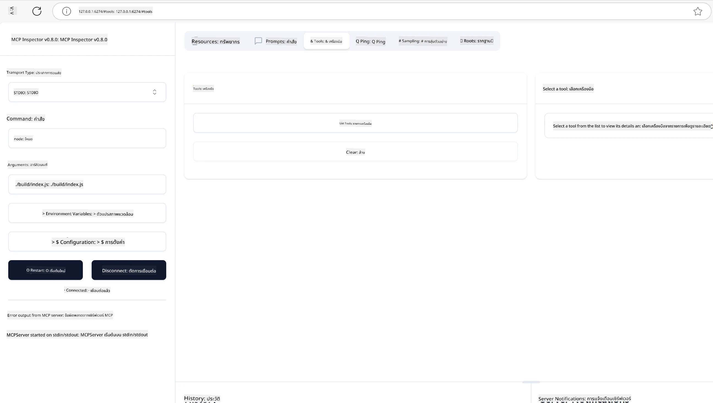
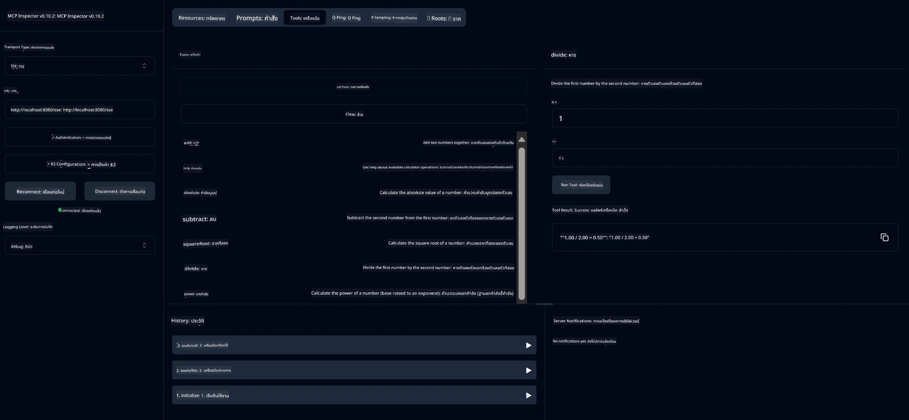
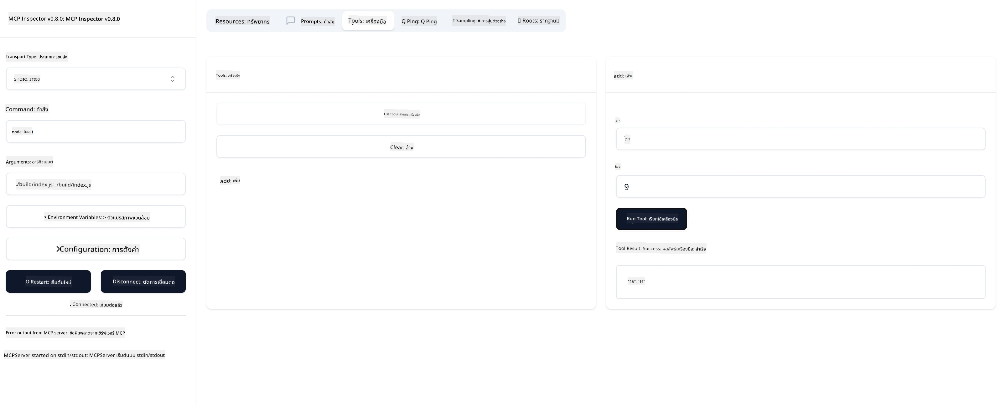

# เริ่มต้นใช้งาน MCP

> [!NOTE]
> ตัวอย่าง Java HTTP ในบทเรียนนี้ใช้การขนส่ง HTTP+SSE แบบเก่าและ
> มีเป้าหมายที่ SDK ที่เข้ากันได้กับ MCP `2025-11-25` สำหรับเซิร์ฟเวอร์ระยะไกลใหม่ ให้ใช้
> การขนส่ง Streamable HTTP `2026-07-28` และตรวจสอบการสนับสนุนใน SDK ของคุณ

ยินดีต้อนรับสู่ก้าวแรกของคุณกับ Model Context Protocol (MCP)! ไม่ว่าคุณจะเป็นมือใหม่กับ MCP หรือกำลังมองหาการทำความเข้าใจให้ลึกซึ้ง คู่มือนี้จะแนะนำคุณผ่านกระบวนการตั้งค่าและพัฒนาที่จำเป็น คุณจะได้เรียนรู้ว่า MCP ช่วยให้เกิดการบูรณาการระหว่างโมเดล AI และแอปพลิเคชันได้อย่างไร และรู้วิธีเตรียมพร้อมสภาพแวดล้อมของคุณอย่างรวดเร็วเพื่อสร้างและทดสอบโซลูชันที่ขับเคลื่อนด้วย MCP

> สรุปย่อ; หากคุณสร้างแอป AI คุณจะทราบว่าสามารถเพิ่มเครื่องมือและทรัพยากรอื่น ๆ ให้กับ LLM (large language model) เพื่อทำให้ LLM มีความรู้มากขึ้น อย่างไรก็ตามถ้าคุณวางเครื่องมือและทรัพยากรเหล่านั้นบนเซิร์ฟเวอร์ ความสามารถของแอปและเซิร์ฟเวอร์สามารถใช้ได้กับไคลเอนต์ใด ๆ โดยมีหรือไม่มี LLM

## ภาพรวม

บทเรียนนี้ให้คำแนะนำเชิงปฏิบัติในการตั้งค่าสภาพแวดล้อม MCP และการสร้างแอปพลิเคชัน MCP แรกของคุณ คุณจะได้เรียนรู้วิธีการตั้งค่าเครื่องมือและกรอบงานที่จำเป็น สร้างเซิร์ฟเวอร์ MCP พื้นฐาน สร้างแอปโฮสต์ และทดสอบการใช้งานของคุณ

Model Context Protocol (MCP) เป็นโปรโตคอลเปิดที่กำหนดมาตรฐานการให้บริบทแก่ LLM ของแอปพลิเคชัน คิดว่า MCP เหมือนกับพอร์ต USB-C สำหรับแอป AI — มันให้วิธีมาตรฐานในการเชื่อมต่อโมเดล AI กับแหล่งข้อมูลและเครื่องมือต่าง ๆ

## วัตถุประสงค์การเรียนรู้

เมื่อจบบทเรียนนี้ คุณจะสามารถ:

- ตั้งค่าสภาพแวดล้อมการพัฒนาสำหรับ MCP ใน C#, Java, Python, TypeScript และ Rust
- สร้างและปรับใช้เซิร์ฟเวอร์ MCP พื้นฐานพร้อมคุณสมบัติที่กำหนดเอง (ทรัพยากร, prompt, และเครื่องมือ)
- สร้างแอปโฮสต์ที่เชื่อมต่อกับเซิร์ฟเวอร์ MCP
- ทดสอบและดีบักการใช้งาน MCP

## การตั้งค่าสภาพแวดล้อม MCP ของคุณ

ก่อนเริ่มทำงานกับ MCP สิ่งสำคัญคือการเตรียมสภาพแวดล้อมการพัฒนาและเข้าใจเวิร์กโฟลว์พื้นฐาน ส่วนนี้จะแนะนำคุณผ่านขั้นตอนการตั้งค่าเริ่มต้นเพื่อให้เริ่มต้นใช้งาน MCP ได้อย่างราบรื่น

### ข้อกำหนดเบื้องต้น

ก่อนที่จะเริ่มพัฒนา MCP ให้แน่ใจว่าคุณมี:

- **สภาพแวดล้อมการพัฒนา**: สำหรับภาษาที่คุณเลือกใช้ (C#, Java, Python, TypeScript หรือ Rust)
- **IDE/Editor**: Visual Studio, Visual Studio Code, IntelliJ, Eclipse, PyCharm หรือโปรแกรมแก้ไขโค้ดสมัยใหม่ใด ๆ
- **ตัวจัดการแพ็กเกจ**: NuGet, Maven/Gradle, pip, npm/yarn หรือ Cargo
- **คีย์ API**: สำหรับบริการ AI ที่คุณวางแผนจะใช้ในแอปโฮสต์ของคุณ

## โครงสร้างเซิร์ฟเวอร์ MCP พื้นฐาน

เซิร์ฟเวอร์ MCP โดยทั่วไปประกอบด้วย:

- **การตั้งค่าเซิร์ฟเวอร์**: ตั้งค่าพอร์ต การตรวจสอบสิทธิ์ และการตั้งค่าอื่น ๆ
- **ทรัพยากร**: ข้อมูลและบริบทที่เปิดให้ LLM เข้าถึง
- **เครื่องมือ**: ฟังก์ชันที่โมเดลสามารถเรียกใช้
- **prompt**: แบบฟอร์มสำหรับสร้างหรือจัดโครงสร้างข้อความ

นี่คือตัวอย่างแบบง่ายใน TypeScript:

```typescript
import { McpServer, ResourceTemplate } from "@modelcontextprotocol/sdk/server/mcp.js";
import { StdioServerTransport } from "@modelcontextprotocol/sdk/server/stdio.js";
import { z } from "zod";

// สร้างเซิร์ฟเวอร์ MCP
const server = new McpServer({
  name: "Demo",
  version: "1.0.0"
});

// เพิ่มเครื่องมือเพิ่มเติม
server.tool("add",
  { a: z.number(), b: z.number() },
  async ({ a, b }) => ({
    content: [{ type: "text", text: String(a + b) }]
  })
);

// เพิ่มทรัพยากรคำทักทายแบบไดนามิก
server.resource(
  "file",
  // พารามิเตอร์ 'list' ควบคุมวิธีที่ทรัพยากรแสดงรายการไฟล์ที่มีอยู่ การตั้งค่าเป็น undefined จะปิดการแสดงรายการสำหรับทรัพยากรนี้
  new ResourceTemplate("file://{path}", { list: undefined }),
  async (uri, { path }) => ({
    contents: [{
      uri: uri.href,
      text: `File, ${path}!`
    }]
  })
);

// เพิ่มทรัพยากรไฟล์ที่อ่านเนื้อหาไฟล์
server.resource(
  "file",
  new ResourceTemplate("file://{path}", { list: undefined }),
  async (uri, { path }) => {
    let text;
    try {
      text = await fs.readFile(path, "utf8");
    } catch (err) {
      text = `Error reading file: ${err.message}`;
    }
    return {
      contents: [{
        uri: uri.href,
        text
      }]
    };
  }
);

server.prompt(
  "review-code",
  { code: z.string() },
  ({ code }) => ({
    messages: [{
      role: "user",
      content: {
        type: "text",
        text: `Please review this code:\n\n${code}`
      }
    }]
  })
);

// เริ่มรับข้อความจาก stdin และส่งข้อความผ่าน stdout
const transport = new StdioServerTransport();
await server.connect(transport);
```

ในโค้ดข้างต้นเรา:

- นำเข้าคลาสที่จำเป็นจาก MCP TypeScript SDK
- สร้างและตั้งค่าอินสแตนซ์เซิร์ฟเวอร์ MCP ใหม่
- ลงทะเบียนเครื่องมือที่กำหนดเอง (`calculator`) พร้อมฟังก์ชันจัดการ
- เริ่มเซิร์ฟเวอร์เพื่อฟังคำขอ MCP ที่เข้ามา

## การทดสอบและดีบัก

ก่อนที่คุณจะเริ่มทดสอบเซิร์ฟเวอร์ MCP ของคุณ สิ่งสำคัญคือการเข้าใจเครื่องมือที่มีอยู่และแนวปฏิบัติที่ดีที่สุดในการดีบัก การทดสอบที่มีประสิทธิภาพช่วยให้เซิร์ฟเวอร์ทำงานตามที่คาดหวังและช่วยให้คุณระบุและแก้ไขปัญหาได้อย่างรวดเร็ว ส่วนต่อไปนี้สรุปวิธีการที่แนะนำสำหรับการยืนยันการใช้งาน MCP ของคุณ

MCP มีเครื่องมือช่วยคุณทดสอบและดีบักเซิร์ฟเวอร์ของคุณ:

- **เครื่องมือตรวจสอบ (Inspector tool)** อินเทอร์เฟซกราฟิกนี้ช่วยให้คุณเชื่อมต่อกับเซิร์ฟเวอร์และทดสอบเครื่องมือ, prompt และทรัพยากรของคุณได้
- **curl** คุณยังสามารถเชื่อมต่อกับเซิร์ฟเวอร์โดยใช้เครื่องมือบรรทัดคำสั่งอย่าง curl หรือไคลเอนต์อื่นที่สร้างและรันคำสั่ง HTTP ได้

### การใช้ MCP Inspector

[MCP Inspector](https://github.com/modelcontextprotocol/inspector) เป็นเครื่องมือทดสอบเชิงภาพที่ช่วยคุณ:

1. **ค้นพบความสามารถของเซิร์ฟเวอร์**: ตรวจจับทรัพยากร เครื่องมือ และ prompt ที่มีโดยอัตโนมัติ
2. **ทดสอบการทำงานของเครื่องมือ**: ลองใช้พารามิเตอร์ต่าง ๆ และดูผลลัพธ์แบบเรียลไทม์
3. **ดูเมตาดาต้าเซิร์ฟเวอร์**: ตรวจสอบข้อมูลเซิร์ฟเวอร์ สคีมา และการตั้งค่า

```bash
# ตัวอย่าง TypeScript, การติดตั้งและการใช้งาน MCP Inspector
npx @modelcontextprotocol/inspector node build/index.js
```

เมื่อคุณรันคำสั่งด้านบน MCP Inspector จะเปิดอินเทอร์เฟซเว็บในเครื่องบนเบราว์เซอร์ของคุณ คุณจะเห็นแดชบอร์ดแสดงเซิร์ฟเวอร์ MCP ที่ลงทะเบียน เครื่องมือ ทรัพยากร และ prompt ที่มี อินเทอร์เฟซนี้ช่วยให้คุณทดสอบการทำงานของเครื่องมือแบบโต้ตอบ ตรวจสอบเมตาดาต้าเซิร์ฟเวอร์ และดูผลลัพธ์แบบเรียลไทม์ ทำให้ง่ายต่อการยืนยันและดีบักการใช้งาน MCP ของคุณ

นี่คือภาพหน้าจอของสิ่งที่อาจดูเหมือน:



## ปัญหาการตั้งค่าที่พบบ่อยและวิธีแก้ไข

| ปัญหา | ทางแก้ไขที่เป็นไปได้ |
|-------|-------------------|
| การเชื่อมต่อล้มเหลว | ตรวจสอบว่าเซิร์ฟเวอร์กำลังทำงานและพอร์ตถูกต้อง |
| ข้อผิดพลาดการทำงานของเครื่องมือ | ตรวจสอบการตรวจสอบพารามิเตอร์และการจัดการข้อผิดพลาด |
| การตรวจสอบสิทธิ์ล้มเหลว | ตรวจสอบคีย์ API และสิทธิ์ |
| ข้อผิดพลาดการตรวจสอบสคีมา | แน่ใจว่าพารามิเตอร์ตรงกับสคีมาที่กำหนด |
| เซิร์ฟเวอร์ไม่เริ่มทำงาน | ตรวจสอบความขัดแย้งของพอร์ตหรือการขาดแคลน dependencies |
| ข้อผิดพลาด CORS | ตั้งค่าหัวข้อ CORS ที่ถูกต้องสำหรับคำขอข้ามแหล่งกำเนิด |
| ปัญหาการตรวจสอบสิทธิ์ | ตรวจสอบความถูกต้องของโทเค็นและสิทธิ์ |

## การพัฒนาท้องถิ่น

สำหรับการพัฒนาและทดสอบในเครื่อง คุณสามารถรันเซิร์ฟเวอร์ MCP ได้โดยตรงบนเครื่องของคุณ:

1. **เริ่มกระบวนการเซิร์ฟเวอร์**: รันแอปเซิร์ฟเวอร์ MCP ของคุณ
2. **ตั้งค่าเครือข่าย**: ให้แน่ใจว่าเซิร์ฟเวอร์เข้าถึงได้ผ่านพอร์ตที่คาดหวัง
3. **เชื่อมต่อไคลเอนต์**: ใช้ URL การเชื่อมต่อภายในเครื่อง เช่น `http://localhost:3000`

```bash
# ตัวอย่าง: การรันเซิร์ฟเวอร์ TypeScript MCP บนเครื่องท้องถิ่น
npm run start
# เซิร์ฟเวอร์กำลังรันที่ http://localhost:3000
```

## การสร้างเซิร์ฟเวอร์ MCP แรกของคุณ

เราได้ครอบคลุม [แนวคิดหลัก](../../01-CoreConcepts/README.md) ในบทเรียนก่อนหน้าแล้ว ตอนนี้ถึงเวลานำความรู้นั้นไปใช้จริง

### สิ่งที่เซิร์ฟเวอร์สามารถทำได้

ก่อนที่เราจะเริ่มเขียนโค้ด ลองเตือนตัวเองว่าเซิร์ฟเวอร์สามารถทำอะไรได้บ้าง:

เซิร์ฟเวอร์ MCP สามารถทำได้ เช่น:

- เข้าถึงไฟล์และฐานข้อมูลในท้องถิ่น
- เชื่อมต่อกับ API ระยะไกล
- ทำการคำนวณ
- รวมเข้ากับเครื่องมือและบริการอื่น ๆ
- ให้ส่วนติดต่อผู้ใช้สำหรับการโต้ตอบ

ดีมาก ตอนนี้ที่รู้ว่าเซิร์ฟเวอร์ทำอะไรได้บ้าง เริ่มต้นเขียนโค้ดกันเถอะ

## แบบฝึกหัด: การสร้างเซิร์ฟเวอร์

ในการสร้างเซิร์ฟเวอร์ คุณต้องทำตามขั้นตอนเหล่านี้:

- ติดตั้ง MCP SDK
- สร้างโปรเจกต์และตั้งค่าโครงสร้างโปรเจกต์
- เขียนโค้ดเซิร์ฟเวอร์
- ทดสอบเซิร์ฟเวอร์

### -1- สร้างโปรเจกต์

#### TypeScript

```sh
# สร้างไดเรกทอรีโปรเจกต์และเริ่มต้นโปรเจกต์ npm
mkdir calculator-server
cd calculator-server
npm init -y
```

#### Python

```sh
# สร้างไดเรกทอรีโปรเจกต์
mkdir calculator-server
cd calculator-server
# เปิดโฟลเดอร์ใน Visual Studio Code - ข้ามขั้นตอนนี้ถ้าคุณกำลังใช้ IDE อื่น
code .
```

#### .NET

```sh
dotnet new console -n McpCalculatorServer
cd McpCalculatorServer
```

#### Java

สำหรับ Java ให้สร้างโปรเจกต์ Spring Boot:

```bash
curl https://start.spring.io/starter.zip \
  -d dependencies=web \
  -d javaVersion=21 \
  -d type=maven-project \
  -d groupId=com.example \
  -d artifactId=calculator-server \
  -d name=McpServer \
  -d packageName=com.microsoft.mcp.sample.server \
  -o calculator-server.zip
```

แตกไฟล์ zip:

```bash
unzip calculator-server.zip -d calculator-server
cd calculator-server
# สามารถลบการทดสอบที่ไม่ได้ใช้งานได้ตามต้องการ
rm -rf src/test/java
```

เพิ่มการตั้งค่าครบถ้วนต่อไปนี้ในไฟล์ *pom.xml* ของคุณ:

```xml
<?xml version="1.0" encoding="UTF-8"?>
<project xmlns="http://maven.apache.org/POM/4.0.0"
    xmlns:xsi="http://www.w3.org/2001/XMLSchema-instance"
    xsi:schemaLocation="http://maven.apache.org/POM/4.0.0 http://maven.apache.org/xsd/maven-4.0.0.xsd">
    <modelVersion>4.0.0</modelVersion>
    
    <!-- Spring Boot parent for dependency management -->
    <parent>
        <groupId>org.springframework.boot</groupId>
        <artifactId>spring-boot-starter-parent</artifactId>
        <version>3.5.0</version>
        <relativePath />
    </parent>

    <!-- Project coordinates -->
    <groupId>com.example</groupId>
    <artifactId>calculator-server</artifactId>
    <version>0.0.1-SNAPSHOT</version>
    <name>Calculator Server</name>
    <description>Basic calculator MCP service for beginners</description>

    <!-- Properties -->
    <properties>
        <java.version>21</java.version>
        <maven.compiler.source>21</maven.compiler.source>
        <maven.compiler.target>21</maven.compiler.target>
    </properties>

    <!-- Spring AI BOM for version management -->
    <dependencyManagement>
        <dependencies>
            <dependency>
                <groupId>org.springframework.ai</groupId>
                <artifactId>spring-ai-bom</artifactId>
                <version>1.0.0-SNAPSHOT</version>
                <type>pom</type>
                <scope>import</scope>
            </dependency>
        </dependencies>
    </dependencyManagement>

    <!-- Dependencies -->
    <dependencies>
        <dependency>
            <groupId>org.springframework.ai</groupId>
            <artifactId>spring-ai-starter-mcp-server-webflux</artifactId>
        </dependency>
        <dependency>
            <groupId>org.springframework.boot</groupId>
            <artifactId>spring-boot-starter-actuator</artifactId>
        </dependency>
        <dependency>
         <groupId>org.springframework.boot</groupId>
         <artifactId>spring-boot-starter-test</artifactId>
         <scope>test</scope>
      </dependency>
    </dependencies>

    <!-- Build configuration -->
    <build>
        <plugins>
            <plugin>
                <groupId>org.springframework.boot</groupId>
                <artifactId>spring-boot-maven-plugin</artifactId>
            </plugin>
            <plugin>
                <groupId>org.apache.maven.plugins</groupId>
                <artifactId>maven-compiler-plugin</artifactId>
                <configuration>
                    <release>21</release>
                </configuration>
            </plugin>
        </plugins>
    </build>

    <!-- Repositories for Spring AI snapshots -->
    <repositories>
        <repository>
            <id>spring-milestones</id>
            <name>Spring Milestones</name>
            <url>https://repo.spring.io/milestone</url>
            <snapshots>
                <enabled>false</enabled>
            </snapshots>
        </repository>
        <repository>
            <id>spring-snapshots</id>
            <name>Spring Snapshots</name>
            <url>https://repo.spring.io/snapshot</url>
            <releases>
                <enabled>false</enabled>
            </releases>
        </repository>
    </repositories>
</project>
```

#### Rust

```sh
mkdir calculator-server
cd calculator-server
cargo init
```

### -2- เพิ่ม dependencies

ตอนนี้คุณสร้างโปรเจกต์แล้ว ให้เพิ่ม dependencies ต่อไปนี้:

#### TypeScript

```sh
# หากยังไม่ได้ติดตั้ง ให้ติดตั้ง TypeScript แบบทั่วโลก
npm install typescript -g

# ติดตั้ง MCP SDK และ Zod สำหรับการตรวจสอบสกีมา
npm install @modelcontextprotocol/sdk zod
npm install -D @types/node typescript
```

#### Python

```sh
# สร้างสภาพแวดล้อมเสมือนและติดตั้งไลบรารีที่จำเป็น
python -m venv venv
venv\Scripts\activate
pip install "mcp[cli]"
```

#### Java

```bash
cd calculator-server
./mvnw clean install -DskipTests
```

#### Rust

```sh
cargo add rmcp --features server,transport-io
cargo add serde
cargo add tokio --features rt-multi-thread
```

### -3- สร้างไฟล์โปรเจกต์

#### TypeScript

เปิดไฟล์ *package.json* และแทนที่เนื้อหาด้วยสิ่งต่อไปนี้เพื่อให้แน่ใจว่าสามารถสร้างและรันเซิร์ฟเวอร์ได้:

```json
{
  "name": "calculator-server",
  "version": "1.0.0",
  "main": "index.js",
  "type": "module",
  "scripts": {
    "build": "tsc",
    "start": "npm run build && node ./build/index.js",
  },
  "keywords": [],
  "author": "",
  "license": "ISC",
  "description": "A simple calculator server using Model Context Protocol",
  "dependencies": {
    "@modelcontextprotocol/sdk": "^1.16.0",
    "zod": "^3.25.76"
  },
  "devDependencies": {
    "@types/node": "^24.0.14",
    "typescript": "^5.8.3"
  }
}
```

สร้าง *tsconfig.json* ด้วยเนื้อหาดังนี้:

```json
{
  "compilerOptions": {
    "target": "ES2022",
    "module": "Node16",
    "moduleResolution": "Node16",
    "outDir": "./build",
    "rootDir": "./src",
    "strict": true,
    "esModuleInterop": true,
    "skipLibCheck": true,
    "forceConsistentCasingInFileNames": true
  },
  "include": ["src/**/*"],
  "exclude": ["node_modules"]
}
```

สร้างไดเรกทอรีสำหรับซอร์สโค้ดของคุณ:

```sh
mkdir src
touch src/index.ts
```

#### Python

สร้างไฟล์ *server.py*

```sh
touch server.py
```

#### .NET

ติดตั้งแพ็กเกจ NuGet ที่จำเป็น:

```sh
dotnet add package ModelContextProtocol --prerelease
dotnet add package Microsoft.Extensions.Hosting
```

#### Java

สำหรับโปรเจกต์ Java Spring Boot โครงสร้างโปรเจกต์จะถูกสร้างโดยอัตโนมัติ

#### Rust

สำหรับ Rust ไฟล์ *src/main.rs* จะถูกสร้างโดยอัตโนมัติเมื่อคุณรัน `cargo init` เปิดไฟล์และลบโค้ดเริ่มต้นออก

### -4- เขียนโค้ดเซิร์ฟเวอร์

#### TypeScript

สร้างไฟล์ *index.ts* และเพิ่มโค้ดต่อไปนี้:

```typescript
import { McpServer, ResourceTemplate } from "@modelcontextprotocol/sdk/server/mcp.js";
import { StdioServerTransport } from "@modelcontextprotocol/sdk/server/stdio.js";
import { z } from "zod";
 
// สร้างเซิร์ฟเวอร์ MCP
const server = new McpServer({
  name: "Calculator MCP Server",
  version: "1.0.0"
});
```

ตอนนี้คุณมีเซิร์ฟเวอร์แต่ยังทำอะไรไม่ได้มาก มาแก้ไขกันเถอะ

#### Python

```python
# server.py
from mcp.server.fastmcp import FastMCP

# สร้างเซิร์ฟเวอร์ MCP
mcp = FastMCP("Demo")
```

#### .NET

```csharp
using Microsoft.Extensions.DependencyInjection;
using Microsoft.Extensions.Hosting;
using Microsoft.Extensions.Logging;
using ModelContextProtocol.Server;
using System.ComponentModel;

var builder = Host.CreateApplicationBuilder(args);
builder.Logging.AddConsole(consoleLogOptions =>
{
    // Configure all logs to go to stderr
    consoleLogOptions.LogToStandardErrorThreshold = LogLevel.Trace;
});

builder.Services
    .AddMcpServer()
    .WithStdioServerTransport()
    .WithToolsFromAssembly();
await builder.Build().RunAsync();

// add features
```

#### Java

สำหรับ Java สร้างคอมโพเนนต์หลักของเซิร์ฟเวอร์ ก่อนอื่น แก้ไขคลาสแอปพลิเคชันหลัก:

*src/main/java/com/microsoft/mcp/sample/server/McpServerApplication.java*:

```java
package com.microsoft.mcp.sample.server;

import org.springframework.ai.tool.ToolCallbackProvider;
import org.springframework.ai.tool.method.MethodToolCallbackProvider;
import org.springframework.boot.SpringApplication;
import org.springframework.boot.autoconfigure.SpringBootApplication;
import org.springframework.context.annotation.Bean;
import com.microsoft.mcp.sample.server.service.CalculatorService;

@SpringBootApplication
public class McpServerApplication {

    public static void main(String[] args) {
        SpringApplication.run(McpServerApplication.class, args);
    }
    
    @Bean
    public ToolCallbackProvider calculatorTools(CalculatorService calculator) {
        return MethodToolCallbackProvider.builder().toolObjects(calculator).build();
    }
}
```

สร้างบริการเครื่องคิดเลข *src/main/java/com/microsoft/mcp/sample/server/service/CalculatorService.java*:

```java
package com.microsoft.mcp.sample.server.service;

import org.springframework.ai.tool.annotation.Tool;
import org.springframework.stereotype.Service;

/**
 * Service for basic calculator operations.
 * This service provides simple calculator functionality through MCP.
 */
@Service
public class CalculatorService {

    /**
     * Add two numbers
     * @param a The first number
     * @param b The second number
     * @return The sum of the two numbers
     */
    @Tool(description = "Add two numbers together")
    public String add(double a, double b) {
        double result = a + b;
        return formatResult(a, "+", b, result);
    }

    /**
     * Subtract one number from another
     * @param a The number to subtract from
     * @param b The number to subtract
     * @return The result of the subtraction
     */
    @Tool(description = "Subtract the second number from the first number")
    public String subtract(double a, double b) {
        double result = a - b;
        return formatResult(a, "-", b, result);
    }

    /**
     * Multiply two numbers
     * @param a The first number
     * @param b The second number
     * @return The product of the two numbers
     */
    @Tool(description = "Multiply two numbers together")
    public String multiply(double a, double b) {
        double result = a * b;
        return formatResult(a, "*", b, result);
    }

    /**
     * Divide one number by another
     * @param a The numerator
     * @param b The denominator
     * @return The result of the division
     */
    @Tool(description = "Divide the first number by the second number")
    public String divide(double a, double b) {
        if (b == 0) {
            return "Error: Cannot divide by zero";
        }
        double result = a / b;
        return formatResult(a, "/", b, result);
    }

    /**
     * Calculate the power of a number
     * @param base The base number
     * @param exponent The exponent
     * @return The result of raising the base to the exponent
     */
    @Tool(description = "Calculate the power of a number (base raised to an exponent)")
    public String power(double base, double exponent) {
        double result = Math.pow(base, exponent);
        return formatResult(base, "^", exponent, result);
    }

    /**
     * Calculate the square root of a number
     * @param number The number to find the square root of
     * @return The square root of the number
     */
    @Tool(description = "Calculate the square root of a number")
    public String squareRoot(double number) {
        if (number < 0) {
            return "Error: Cannot calculate square root of a negative number";
        }
        double result = Math.sqrt(number);
        return String.format("√%.2f = %.2f", number, result);
    }

    /**
     * Calculate the modulus (remainder) of division
     * @param a The dividend
     * @param b The divisor
     * @return The remainder of the division
     */
    @Tool(description = "Calculate the remainder when one number is divided by another")
    public String modulus(double a, double b) {
        if (b == 0) {
            return "Error: Cannot divide by zero";
        }
        double result = a % b;
        return formatResult(a, "%", b, result);
    }

    /**
     * Calculate the absolute value of a number
     * @param number The number to find the absolute value of
     * @return The absolute value of the number
     */
    @Tool(description = "Calculate the absolute value of a number")
    public String absolute(double number) {
        double result = Math.abs(number);
        return String.format("|%.2f| = %.2f", number, result);
    }

    /**
     * Get help about available calculator operations
     * @return Information about available operations
     */
    @Tool(description = "Get help about available calculator operations")
    public String help() {
        return "Basic Calculator MCP Service\n\n" +
               "Available operations:\n" +
               "1. add(a, b) - Adds two numbers\n" +
               "2. subtract(a, b) - Subtracts the second number from the first\n" +
               "3. multiply(a, b) - Multiplies two numbers\n" +
               "4. divide(a, b) - Divides the first number by the second\n" +
               "5. power(base, exponent) - Raises a number to a power\n" +
               "6. squareRoot(number) - Calculates the square root\n" + 
               "7. modulus(a, b) - Calculates the remainder of division\n" +
               "8. absolute(number) - Calculates the absolute value\n\n" +
               "Example usage: add(5, 3) will return 5 + 3 = 8";
    }

    /**
     * Format the result of a calculation
     */
    private String formatResult(double a, String operator, double b, double result) {
        return String.format("%.2f %s %.2f = %.2f", a, operator, b, result);
    }
}
```

**คอมโพเนนต์เสริมสำหรับบริการแบบพร้อมผลิต:**

สร้างการตั้งค่าเริ่มต้น *src/main/java/com/microsoft/mcp/sample/server/config/StartupConfig.java*:

```java
package com.microsoft.mcp.sample.server.config;

import org.springframework.boot.CommandLineRunner;
import org.springframework.context.annotation.Bean;
import org.springframework.context.annotation.Configuration;

@Configuration
public class StartupConfig {
    
    @Bean
    public CommandLineRunner startupInfo() {
        return args -> {
            System.out.println("\n" + "=".repeat(60));
            System.out.println("Calculator MCP Server is starting...");
            System.out.println("SSE endpoint: http://localhost:8080/sse");
            System.out.println("Health check: http://localhost:8080/actuator/health");
            System.out.println("=".repeat(60) + "\n");
        };
    }
}
```

สร้างคอนโทรลเลอร์สุขภาพ *src/main/java/com/microsoft/mcp/sample/server/controller/HealthController.java*:

```java
package com.microsoft.mcp.sample.server.controller;

import org.springframework.http.ResponseEntity;
import org.springframework.web.bind.annotation.GetMapping;
import org.springframework.web.bind.annotation.RestController;
import java.time.LocalDateTime;
import java.util.HashMap;
import java.util.Map;

@RestController
public class HealthController {
    
    @GetMapping("/health")
    public ResponseEntity<Map<String, Object>> healthCheck() {
        Map<String, Object> response = new HashMap<>();
        response.put("status", "UP");
        response.put("timestamp", LocalDateTime.now().toString());
        response.put("service", "Calculator MCP Server");
        return ResponseEntity.ok(response);
    }
}
```

สร้างผู้จัดการข้อยกเว้น *src/main/java/com/microsoft/mcp/sample/server/exception/GlobalExceptionHandler.java*:

```java
package com.microsoft.mcp.sample.server.exception;

import org.springframework.http.HttpStatus;
import org.springframework.http.ResponseEntity;
import org.springframework.web.bind.annotation.ExceptionHandler;
import org.springframework.web.bind.annotation.RestControllerAdvice;

@RestControllerAdvice
public class GlobalExceptionHandler {

    @ExceptionHandler(IllegalArgumentException.class)
    public ResponseEntity<ErrorResponse> handleIllegalArgumentException(IllegalArgumentException ex) {
        ErrorResponse error = new ErrorResponse(
            "Invalid_Input", 
            "Invalid input parameter: " + ex.getMessage());
        return new ResponseEntity<>(error, HttpStatus.BAD_REQUEST);
    }

    public static class ErrorResponse {
        private String code;
        private String message;

        public ErrorResponse(String code, String message) {
            this.code = code;
            this.message = message;
        }

        // ตัวดึงข้อมูล
        public String getCode() { return code; }
        public String getMessage() { return message; }
    }
}
```

สร้างแบนเนอร์ที่กำหนดเอง *src/main/resources/banner.txt*:

```text
_____      _            _       _             
 / ____|    | |          | |     | |            
| |     __ _| | ___ _   _| | __ _| |_ ___  _ __ 
| |    / _` | |/ __| | | | |/ _` | __/ _ \| '__|
| |___| (_| | | (__| |_| | | (_| | || (_) | |   
 \_____\__,_|_|\___|\__,_|_|\__,_|\__\___/|_|   
                                                
Calculator MCP Server v1.0
Spring Boot MCP Application
```

</details>

#### Rust

เพิ่มโค้ดต่อไปนี้ที่ด้านบนของไฟล์ *src/main.rs* ซึ่งนำเข้าห้องสมุดและโมดูลที่จำเป็นสำหรับเซิร์ฟเวอร์ MCP ของคุณ

```rust
use rmcp::{
    handler::server::{router::tool::ToolRouter, tool::Parameters},
    model::{ServerCapabilities, ServerInfo},
    schemars, tool, tool_handler, tool_router,
    transport::stdio,
    ServerHandler, ServiceExt,
};
use std::error::Error;
```

เซิร์ฟเวอร์เครื่องคิดเลขจะเป็นเซิร์ฟเวอร์ง่าย ๆ ที่สามารถบวกเลขสองจำนวนได้ มาสร้าง struct เพื่อแทนคำขอของเครื่องคิดเลขกัน

```rust
#[derive(Debug, serde::Deserialize, schemars::JsonSchema)]
pub struct CalculatorRequest {
    pub a: f64,
    pub b: f64,
}
```

ต่อไป สร้าง struct เพื่อแทนเซิร์ฟเวอร์เครื่องคิดเลข Struct นี้จะเก็บตัวจัดการ routing เครื่องมือที่ใช้สำหรับลงทะเบียนเครื่องมือ

```rust
#[derive(Debug, Clone)]
pub struct Calculator {
    tool_router: ToolRouter<Self>,
}
```

ตอนนี้ เราสามารถใช้งาน struct `Calculator` เพื่อสร้างอินสแตนซ์เซิร์ฟเวอร์ใหม่และใช้งาน handler ของเซิร์ฟเวอร์เพื่อให้ข้อมูลเซิร์ฟเวอร์ได้

```rust
#[tool_router]
impl Calculator {
    pub fn new() -> Self {
        Self {
            tool_router: Self::tool_router(),
        }
    }
}

#[tool_handler]
impl ServerHandler for Calculator {
    fn get_info(&self) -> ServerInfo {
        ServerInfo {
            instructions: Some("A simple calculator tool".into()),
            capabilities: ServerCapabilities::builder().enable_tools().build(),
            ..Default::default()
        }
    }
}
```

สุดท้าย เราต้องสร้างฟังก์ชัน main เพื่อเริ่มเซิร์ฟเวอร์ ฟังก์ชันนี้จะสร้างอินสแตนซ์ของ struct `Calculator` และให้บริการผ่านมาตรฐาน input/output

```rust
#[tokio::main]
async fn main() -> Result<(), Box<dyn Error>> {
    let service = Calculator::new().serve(stdio()).await?;
    service.waiting().await?;
    Ok(())
}
```

เซิร์ฟเวอร์ตอนนี้ถูกตั้งค่าให้ให้ข้อมูลพื้นฐานเกี่ยวกับตัวเอง ต่อไปเราจะเพิ่มเครื่องมือสำหรับทำการบวกเลข

### -5- เพิ่มเครื่องมือและทรัพยากร

เพิ่มเครื่องมือและทรัพยากรโดยเพิ่มโค้ดต่อไปนี้:

#### TypeScript

```typescript
server.tool(
  "add",
  { a: z.number(), b: z.number() },
  async ({ a, b }) => ({
    content: [{ type: "text", text: String(a + b) }]
  })
);

server.resource(
  "greeting",
  new ResourceTemplate("greeting://{name}", { list: undefined }),
  async (uri, { name }) => ({
    contents: [{
      uri: uri.href,
      text: `Hello, ${name}!`
    }]
  })
);
```

เครื่องมือของคุณรับพารามิเตอร์ `a` และ `b` และรันฟังก์ชันที่สร้างการตอบสนองในรูปแบบ:

```typescript
{
  contents: [{
    type: "text", content: "some content"
  }]
}
```

ทรัพยากรของคุณเข้าถึงผ่านสตริง "greeting" และรับพารามิเตอร์ `name` และสร้างการตอบสนองที่คล้ายกับเครื่องมือ:

```typescript
{
  uri: "<href>",
  text: "a text"
}
```

#### Python

```python
# เพิ่มเครื่องมือบวก
@mcp.tool()
def add(a: int, b: int) -> int:
    """Add two numbers"""
    return a + b


# เพิ่มทรัพยากรการทักทายแบบไดนามิก
@mcp.resource("greeting://{name}")
def get_greeting(name: str) -> str:
    """Get a personalized greeting"""
    return f"Hello, {name}!"
```

ในโค้ดก่อนหน้านี้เราได้:

- กำหนดเครื่องมือ `add` ที่รับพารามิเตอร์ `a` และ `b` ซึ่งเป็นจำนวนเต็มทั้งคู่
- สร้างทรัพยากรชื่อ `greeting` ที่รับพารามิเตอร์ `name`

#### .NET

เพิ่มสิ่งนี้ในไฟล์ Program.cs ของคุณ:

```csharp
[McpServerToolType]
public static class CalculatorTool
{
    [McpServerTool, Description("Adds two numbers")]
    public static string Add(int a, int b) => $"Sum {a + b}";
}
```

#### Java

เครื่องมือถูกสร้างแล้วในขั้นตอนก่อนหน้า

#### Rust

เพิ่มเครื่องมือใหม่ในบล็อก `impl Calculator`:

```rust
#[tool(description = "Adds a and b")]
async fn add(
    &self,
    Parameters(CalculatorRequest { a, b }): Parameters<CalculatorRequest>,
) -> String {
    (a + b).to_string()
}
```

### -6- โค้ดสมบูรณ์

ให้เพิ่มโค้ดสุดท้ายที่เราต้องการเพื่อให้เซิร์ฟเวอร์สามารถเริ่มทำงานได้:

#### TypeScript

```typescript
// เริ่มรับข้อความจาก stdin และส่งข้อความบน stdout
const transport = new StdioServerTransport();
await server.connect(transport);
```

นี่คือโค้ดทั้งหมด:

```typescript
// index.ts
import { McpServer, ResourceTemplate } from "@modelcontextprotocol/sdk/server/mcp.js";
import { StdioServerTransport } from "@modelcontextprotocol/sdk/server/stdio.js";
import { z } from "zod";

// สร้างเซิร์ฟเวอร์ MCP
const server = new McpServer({
  name: "Calculator MCP Server",
  version: "1.0.0"
});

// เพิ่มเครื่องมือเพิ่มเลข
server.tool(
  "add",
  { a: z.number(), b: z.number() },
  async ({ a, b }) => ({
    content: [{ type: "text", text: String(a + b) }]
  })
);

// เพิ่มแหล่งทรัพยากรทักทายแบบไดนามิก
server.resource(
  "greeting",
  new ResourceTemplate("greeting://{name}", { list: undefined }),
  async (uri, { name }) => ({
    contents: [{
      uri: uri.href,
      text: `Hello, ${name}!`
    }]
  })
);

// เริ่มรับข้อความจาก stdin และส่งข้อความไปยัง stdout
const transport = new StdioServerTransport();
server.connect(transport);
```

#### Python

```python
# server.py
from mcp.server.fastmcp import FastMCP

# สร้างเซิร์ฟเวอร์ MCP
mcp = FastMCP("Demo")


# เพิ่มเครื่องมือบวก
@mcp.tool()
def add(a: int, b: int) -> int:
    """Add two numbers"""
    return a + b


# เพิ่มแหล่งทรัพยากรคำทักทายแบบไดนามิก
@mcp.resource("greeting://{name}")
def get_greeting(name: str) -> str:
    """Get a personalized greeting"""
    return f"Hello, {name}!"

# บล็อกการดำเนินการหลัก - จำเป็นสำหรับการรันเซิร์ฟเวอร์
if __name__ == "__main__":
    mcp.run()
```

#### .NET

สร้างไฟล์ Program.cs ด้วยเนื้อหาดังนี้:

```csharp
using Microsoft.Extensions.DependencyInjection;
using Microsoft.Extensions.Hosting;
using Microsoft.Extensions.Logging;
using ModelContextProtocol.Server;
using System.ComponentModel;

var builder = Host.CreateApplicationBuilder(args);
builder.Logging.AddConsole(consoleLogOptions =>
{
    // Configure all logs to go to stderr
    consoleLogOptions.LogToStandardErrorThreshold = LogLevel.Trace;
});

builder.Services
    .AddMcpServer()
    .WithStdioServerTransport()
    .WithToolsFromAssembly();
await builder.Build().RunAsync();

[McpServerToolType]
public static class CalculatorTool
{
    [McpServerTool, Description("Adds two numbers")]
    public static string Add(int a, int b) => $"Sum {a + b}";
}
```

#### Java

คลาสแอปพลิเคชันหลักทั้งหมดของคุณควรมีลักษณะดังนี้:

```java
// McpServerApplication.java
package com.microsoft.mcp.sample.server;

import org.springframework.ai.tool.ToolCallbackProvider;
import org.springframework.ai.tool.method.MethodToolCallbackProvider;
import org.springframework.boot.SpringApplication;
import org.springframework.boot.autoconfigure.SpringBootApplication;
import org.springframework.context.annotation.Bean;
import com.microsoft.mcp.sample.server.service.CalculatorService;

@SpringBootApplication
public class McpServerApplication {

    public static void main(String[] args) {
        SpringApplication.run(McpServerApplication.class, args);
    }
    
    @Bean
    public ToolCallbackProvider calculatorTools(CalculatorService calculator) {
        return MethodToolCallbackProvider.builder().toolObjects(calculator).build();
    }
}
```

#### Rust

โค้ดสุดท้ายสำหรับเซิร์ฟเวอร์ Rust ควรมีลักษณะดังนี้:

```rust
use rmcp::{
    ServerHandler, ServiceExt,
    handler::server::{router::tool::ToolRouter, tool::Parameters},
    model::{ServerCapabilities, ServerInfo},
    schemars, tool, tool_handler, tool_router,
    transport::stdio,
};
use std::error::Error;

#[derive(Debug, serde::Deserialize, schemars::JsonSchema)]
pub struct CalculatorRequest {
    pub a: f64,
    pub b: f64,
}

#[derive(Debug, Clone)]
pub struct Calculator {
    tool_router: ToolRouter<Self>,
}

#[tool_router]
impl Calculator {
    pub fn new() -> Self {
        Self {
            tool_router: Self::tool_router(),
        }
    }
    
    #[tool(description = "Adds a and b")]
    async fn add(
        &self,
        Parameters(CalculatorRequest { a, b }): Parameters<CalculatorRequest>,
    ) -> String {
        (a + b).to_string()
    }
}

#[tool_handler]
impl ServerHandler for Calculator {
    fn get_info(&self) -> ServerInfo {
        ServerInfo {
            instructions: Some("A simple calculator tool".into()),
            capabilities: ServerCapabilities::builder().enable_tools().build(),
            ..Default::default()
        }
    }
}

#[tokio::main]
async fn main() -> Result<(), Box<dyn Error>> {
    let service = Calculator::new().serve(stdio()).await?;
    service.waiting().await?;
    Ok(())
}
```

### -7- ทดสอบเซิร์ฟเวอร์

เริ่มเซิร์ฟเวอร์ด้วยคำสั่งต่อไปนี้:

#### TypeScript

```sh
npm run build
```

#### Python

```sh
mcp run server.py
```

> ในการใช้ MCP Inspector ให้ใช้ `mcp dev server.py` ซึ่งจะเปิด Inspector โดยอัตโนมัติและให้โทเค็นเซสชั่นพร็อกซีที่จำเป็น หากใช้ `mcp run server.py` คุณจะต้องเริ่ม Inspector ด้วยตัวเองและตั้งค่าการเชื่อมต่อ

#### .NET

ตรวจสอบให้แน่ใจว่าคุณอยู่ในไดเรกทอรีโปรเจกต์ของคุณ:

```sh
cd McpCalculatorServer
dotnet run
```

#### Java

```bash
./mvnw clean install -DskipTests
java -jar target/calculator-server-0.0.1-SNAPSHOT.jar
```

#### Rust

รันคำสั่งต่อไปนี้เพื่อฟอร์แมตและรันเซิร์ฟเวอร์:

```sh
cargo fmt
cargo run
```

### -8- รันโดยใช้ inspector

inspector เป็นเครื่องมือที่ยอดเยี่ยมที่สามารถเริ่มเซิร์ฟเวอร์ของคุณและช่วยให้คุณโต้ตอบกับมันเพื่อทดสอบว่ามันทำงาน คุณลองเริ่มมันกันเถอะ:

> [!NOTE]
> อาจดูต่างไปในช่อง "command" เพราะมีคำสั่งสำหรับรันเซิร์ฟเวอร์กับ runtime เฉพาะของคุณ/

#### TypeScript

```sh
npx @modelcontextprotocol/inspector node build/index.js
```

หรือเพิ่มลงใน *package.json* ของคุณแบบนี้: `"inspector": "npx @modelcontextprotocol/inspector node build/index.js"` แล้วรัน `npm run inspector`

#### Python

Python ห่อเครื่องมือ Node.js ชื่อ inspector ไว้ เป็นไปได้ที่จะเรียกใช้เครื่องมือนี้แบบนี้:

```sh
mcp dev server.py
```


อย่างไรก็ตาม มันไม่ได้ใช้งานทุกเมธอดที่มีในเครื่องมือ ดังนั้นคุณจึงควรเรียกใช้เครื่องมือ Node.js โดยตรงดังนี้:

```sh
npx @modelcontextprotocol/inspector mcp run server.py
```

หากคุณกำลังใช้เครื่องมือหรือ IDE ที่อนุญาตให้กำหนดคำสั่งและอาร์กิวเมนต์สำหรับการรันสคริปต์,
โปรดตั้งค่า `python` ในฟิลด์ `Command` และ `server.py` เป็น `Arguments` เพื่อให้สคริปต์ทำงานอย่างถูกต้อง

#### .NET

ตรวจสอบให้แน่ใจว่าคุณอยู่ในไดเรกทอรีโปรเจกต์ของคุณ:

```sh
cd McpCalculatorServer
npx @modelcontextprotocol/inspector dotnet run
```

#### Java

ตรวจสอบให้แน่ใจว่าเซิร์ฟเวอร์เครื่องคิดเลขทำงานอยู่
จากนั้นรันเครื่องมือ inspector:

```cmd
npx @modelcontextprotocol/inspector
```

ในอินเทอร์เฟซเว็บของ inspector:

1. เลือก "SSE" เป็นประเภทการเชื่อมต่อ
2. ตั้งค่า URL เป็น: `http://localhost:8080/sse`
3. คลิก "Connect"



**คุณได้เชื่อมต่อกับเซิร์ฟเวอร์แล้ว**
**ตอนนี้ส่วนการทดสอบเซิร์ฟเวอร์ Java เสร็จสมบูรณ์แล้ว**

ส่วนถัดไปเกี่ยวกับการโต้ตอบกับเซิร์ฟเวอร์

คุณควรเห็นอินเทอร์เฟซผู้ใช้ดังต่อไปนี้:


1. เชื่อมต่อกับเซิร์ฟเวอร์โดยการเลือกปุ่ม Connect
  เมื่อเชื่อมต่อกับเซิร์ฟเวอร์แล้ว คุณควรเห็นดังนี้:

  

1. เลือก "Tools" และ "listTools", คุณควรเห็น "Add" ปรากฏขึ้น เลือก "Add" และกรอกค่าพารามิเตอร์

  คุณควรเห็นการตอบสนองดังนี้ นั่นคือผลลัพธ์จากเครื่องมือ "add":

  

ยินดีด้วย คุณได้สร้างและรันเซิร์ฟเวอร์ตัวแรกของคุณสำเร็จแล้ว!

#### Rust

ในการรันเซิร์ฟเวอร์ Rust ด้วย MCP Inspector CLI ให้ใช้คำสั่งต่อไปนี้:

```sh
npx @modelcontextprotocol/inspector cargo run --cli --method tools/call --tool-name add --tool-arg a=1 b=2
```

### SDKs อย่างเป็นทางการ

MCP มี SDKs อย่างเป็นทางการสำหรับหลายภาษา:

- [C# SDK](https://github.com/modelcontextprotocol/csharp-sdk) - ดูแลร่วมกับ Microsoft
- [Java SDK](https://github.com/modelcontextprotocol/java-sdk) - ดูแลร่วมกับ Spring AI
- [TypeScript SDK](https://github.com/modelcontextprotocol/typescript-sdk) - การใช้งาน TypeScript อย่างเป็นทางการ
- [Python SDK](https://github.com/modelcontextprotocol/python-sdk) - การใช้งาน Python อย่างเป็นทางการ
- [Kotlin SDK](https://github.com/modelcontextprotocol/kotlin-sdk) - การใช้งาน Kotlin อย่างเป็นทางการ
- [Swift SDK](https://github.com/modelcontextprotocol/swift-sdk) - ดูแลร่วมกับ Loopwork AI
- [Rust SDK](https://github.com/modelcontextprotocol/rust-sdk) - การใช้งาน Rust อย่างเป็นทางการ

## สรุปประเด็นสำคัญ

- การตั้งค่าสภาพแวดล้อมการพัฒนา MCP ทำได้ง่ายด้วย SDK เฉพาะภาษาที่รองรับ
- การสร้างเซิร์ฟเวอร์ MCP เกี่ยวข้องกับการสร้างและลงทะเบียนเครื่องมือพร้อมโครงสร้างที่ชัดเจน
- การทดสอบและดีบั๊กเป็นสิ่งสำคัญสำหรับการใช้งาน MCP ที่เชื่อถือได้

## ตัวอย่าง

- [Java Calculator](../samples/java/calculator/README.md)
- [.NET Calculator](../../../../03-GettingStarted/samples/csharp)
- [JavaScript Calculator](../samples/javascript/README.md)
- [TypeScript Calculator](../samples/typescript/README.md)
- [Python Calculator](../../../../03-GettingStarted/samples/python)
- [Rust Calculator](../../../../03-GettingStarted/samples/rust)

## งานมอบหมาย

สร้างเซิร์ฟเวอร์ MCP ง่ายๆ พร้อมเครื่องมือที่คุณเลือก:

1. เขียนเครื่องมือด้วยภาษาที่คุณชื่นชอบ (.NET, Java, Python, TypeScript หรือ Rust)
2. กำหนดพารามิเตอร์นำเข้าและค่าผลลัพธ์
3. รันเครื่องมือ inspector เพื่อตรวจสอบว่าเซิร์ฟเวอร์ทำงานถูกต้อง
4. ทดสอบการใช้งานด้วยข้อมูลนำเข้าหลากหลาย

## คำตอบ

[Solution](./solution/README.md)

## แหล่งข้อมูลเพิ่มเติม

- [สร้าง Agents ด้วย Model Context Protocol บน Azure](https://learn.microsoft.com/azure/developer/ai/intro-agents-mcp)
- [MCP ระยะไกลกับ Azure Container Apps (Node.js/TypeScript/JavaScript)](https://learn.microsoft.com/samples/azure-samples/mcp-container-ts/mcp-container-ts/)
- [.NET OpenAI MCP Agent](https://learn.microsoft.com/samples/azure-samples/openai-mcp-agent-dotnet/openai-mcp-agent-dotnet/)

## ต่อไปคืออะไร

ต่อไป: [เริ่มต้นกับลูกค้า MCP](../02-client/README.md)

---

<!-- CO-OP TRANSLATOR DISCLAIMER START -->
**ปฏิเสธความรับผิดชอบ**:
เอกสารนี้ได้รับการแปลโดยใช้บริการแปลภาษา AI [Co-op Translator](https://github.com/Azure/co-op-translator) ขณะที่เราพยายามให้ความถูกต้อง โปรดทราบว่าการแปลโดยอัตโนมัติอาจมีข้อผิดพลาดหรือความไม่ถูกต้อง เอกสารต้นฉบับในภาษาต้นทางควรถูกพิจารณาเป็นแหล่งข้อมูลที่เชื่อถือได้ สำหรับข้อมูลที่สำคัญ แนะนำให้ใช้การแปลโดยมนุษย์มืออาชีพ เราไม่รับผิดชอบต่อความเข้าใจผิดหรือการตีความที่ผิดพลาดที่เกิดขึ้นจากการใช้การแปลนี้
<!-- CO-OP TRANSLATOR DISCLAIMER END -->