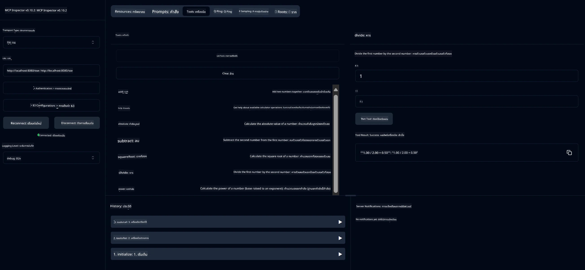

# บริการเครื่องคิดเลขพื้นฐาน MCP

> [!NOTE]
> โซลูชัน Java นี้ใช้การขนส่ง HTTP+SSE แบบเก่าและมุ่งเน้นที่ SDK
> ที่เข้ากันได้กับ MCP `2025-11-25` เก็บไว้เพื่อให้ตรงกับรหัสคอร์ส;
> เซิร์ฟเวอร์ระยะไกลใหม่ควรใช้การสนับสนุน HTTP แบบสตรีม `2026-07-28`

บริการนี้ให้การดำเนินการเครื่องคิดเลขพื้นฐานผ่านโปรโตคอล Model Context (MCP) โดยใช้ Spring Boot กับการขนส่ง WebFlux ออกแบบมาเป็นตัวอย่างง่ายสำหรับผู้เริ่มต้นเรียนรู้เกี่ยวกับการใช้งาน MCP

สำหรับข้อมูลเพิ่มเติม ดูเอกสารอ้างอิง [MCP Server Boot Starter](https://docs.spring.io/spring-ai/reference/api/mcp/mcp-server-boot-starter-docs.html)


## การใช้บริการ

บริการนี้มีการเปิดเผย API endpoints ต่อไปนี้ผ่านโปรโตคอล MCP:

- `add(a, b)`: บวกตัวเลขสองจำนวนเข้าด้วยกัน
- `subtract(a, b)`: ลบจำนวนที่สองออกจากจำนวนแรก
- `multiply(a, b)`: คูณตัวเลขสองจำนวน
- `divide(a, b)`: หารจำนวนแรกด้วยจำนวนที่สอง (ตรวจสอบศูนย์)
- `power(base, exponent)`: คำนวณเลขยกกำลัง
- `squareRoot(number)`: คำนวณรากที่สอง (ตรวจสอบเลขลบ)
- `modulus(a, b)`: คำนวณเศษเหลือจากการหาร
- `absolute(number)`: คำนวณค่าสัมบูรณ์

## การพึ่งพา (Dependencies)

โครงการนี้ต้องการการพึ่งพาหลักดังต่อไปนี้:

```xml
<dependency>
    <groupId>org.springframework.ai</groupId>
    <artifactId>spring-ai-starter-mcp-server-webflux</artifactId>
</dependency>
```

## การสร้างโครงการ

สร้างโครงการโดยใช้ Maven:
```bash
./mvnw clean install -DskipTests
```

## การรันเซิร์ฟเวอร์

### การใช้ Java

```bash
java -jar target/calculator-server-0.0.1-SNAPSHOT.jar
```

### การใช้ MCP Inspector

MCP Inspector เป็นเครื่องมือที่ช่วยในการโต้ตอบกับบริการ MCP เพื่อใช้ร่วมกับบริการเครื่องคิดเลขนี้:

1. **ติดตั้งและรัน MCP Inspector** ในหน้าต่างเทอร์มินัลใหม่:
   ```bash
   npx @modelcontextprotocol/inspector
   ```

2. **เข้าถึงเว็บ UI** โดยคลิกที่ URL ที่แอพแสดง (โดยปกติคือ http://localhost:6274)

3. **กำหนดค่าการเชื่อมต่อ**:
   - ตั้งค่าประเภทการขนส่งเป็น "SSE"
   - ตั้งค่า URL ให้เป็นจุดเชื่อมต่อ SSE ของเซิร์ฟเวอร์ที่กำลังรัน: `http://localhost:8080/sse`
   - คลิก "Connect"

4. **ใช้เครื่องมือ**:
   - คลิก "List Tools" เพื่อดูการดำเนินการเครื่องคิดเลขที่มีอยู่
   - เลือกเครื่องมือแล้วคลิก "Run Tool" เพื่อดำเนินการ



---

<!-- CO-OP TRANSLATOR DISCLAIMER START -->
**ปฏิเสธความรับผิดชอบ**:
เอกสารนี้ได้รับการแปลโดยใช้บริการแปลภาษา AI [Co-op Translator](https://github.com/Azure/co-op-translator) ขณะที่เราพยายามให้ความถูกต้อง โปรดทราบว่าการแปลโดยอัตโนมัติอาจมีข้อผิดพลาดหรือความไม่ถูกต้อง เอกสารต้นฉบับในภาษาต้นทางควรถูกพิจารณาเป็นแหล่งข้อมูลที่เชื่อถือได้ สำหรับข้อมูลที่สำคัญ แนะนำให้ใช้การแปลโดยมนุษย์มืออาชีพ เราไม่รับผิดชอบต่อความเข้าใจผิดหรือการตีความที่ผิดพลาดที่เกิดขึ้นจากการใช้การแปลนี้
<!-- CO-OP TRANSLATOR DISCLAIMER END -->