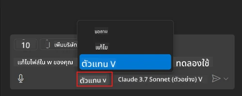
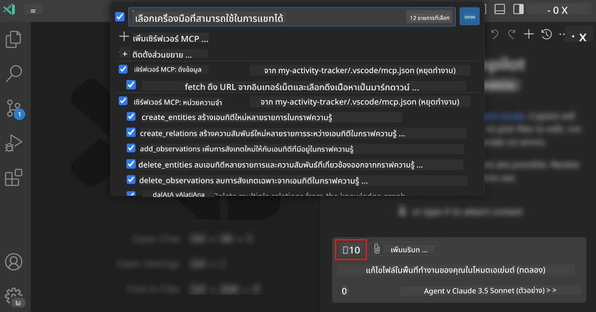
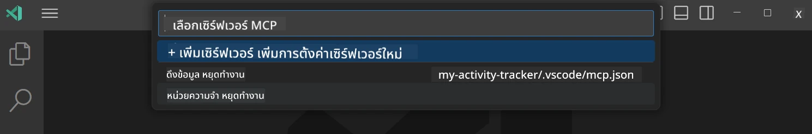
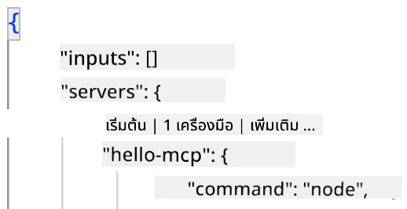
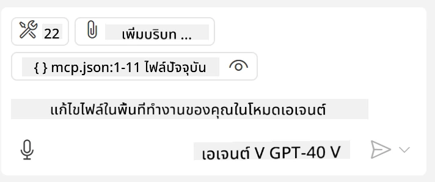
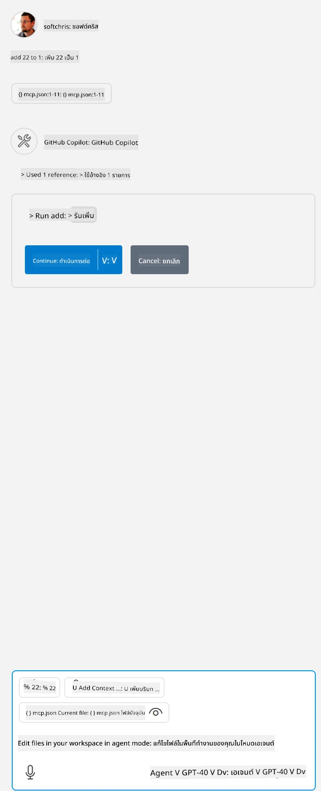

# การใช้เซิร์ฟเวอร์จากโหมด GitHub Copilot Agent

Visual Studio Code และ GitHub Copilot สามารถทำงานเป็นไคลเอนต์และใช้บริการเซิร์ฟเวอร์ MCP ได้ คุณอาจสงสัยว่าทำไมเราถึงอยากทำเช่นนั้น? ดี นั่นหมายความว่าฟีเจอร์ใดๆ ที่เซิร์ฟเวอร์ MCP มีตอนนี้สามารถใช้ได้จากภายใน IDE ของคุณ ลองจินตนาการว่าคุณเพิ่มเซิร์ฟเวอร์ MCP ของ GitHub เช่นนี้จะช่วยให้ควบคุม GitHub ผ่านคำสั่งจากคำพูดแทนการพิมพ์คำสั่งเฉพาะในเทอร์มินัล หรือจินตนาการถึงสิ่งใดก็ตามที่สามารถปรับปรุงประสบการณ์การพัฒนาของคุณทั้งหมดนี้ถูกควบคุมด้วยภาษาธรรมชาติ ตอนนี้คุณเริ่มเห็นประโยชน์ใช่ไหม?

## ภาพรวม

บทเรียนนี้ครอบคลุมวิธีใช้ Visual Studio Code และโหมด Agent ของ GitHub Copilot เป็นไคลเอนต์สำหรับเซิร์ฟเวอร์ MCP ของคุณ

## วัตถุประสงค์การเรียนรู้

สิ้นสุดบทเรียนนี้ คุณจะสามารถ:

- ใช้เซิร์ฟเวอร์ MCP ผ่าน Visual Studio Code
- รันความสามารถต่างๆ เช่นเครื่องมือผ่าน GitHub Copilot
- กำหนดค่า Visual Studio Code เพื่อค้นหาและจัดการเซิร์ฟเวอร์ MCP ของคุณ

## การใช้งาน

คุณสามารถควบคุมเซิร์ฟเวอร์ MCP ของคุณได้สองวิธี:

- อินเทอร์เฟซผู้ใช้ คุณจะเห็นวิธีนี้ในภายหลังในบทนี้
- เทอร์มินัล คุณสามารถควบคุมผ่านเทอร์มินัลด้วยคำสั่ง `code`:

  การเพิ่มเซิร์ฟเวอร์ MCP ลงในโปรไฟล์ผู้ใช้ ให้ใช้ตัวเลือกบรรทัดคำสั่ง --add-mcp และส่งการกำหนดค่าเซิร์ฟเวอร์ในรูปแบบ JSON เป็น {\"name\":\"server-name\",\"command\":...}.

  ```
  code --add-mcp "{\"name\":\"my-server\",\"command\": \"uvx\",\"args\": [\"mcp-server-fetch\"]}"
  ```

### ภาพหน้าจอ





มาคุยกันเพิ่มเติมเกี่ยวกับการใช้อินเทอร์เฟซแบบภาพในส่วนถัดไป

## แนวทาง

นี่คือวิธีที่เราต้องดำเนินการในภาพรวม:

- กำหนดค่าไฟล์เพื่อค้นหาเซิร์ฟเวอร์ MCP ของเรา
- เริ่มต้น/เชื่อมต่อกับเซิร์ฟเวอร์ดังกล่าวเพื่อให้แสดงรายการความสามารถ
- ใช้ความสามารถเหล่านั้นผ่านอินเทอร์เฟซ GitHub Copilot Chat

ดีมาก ตอนนี้ที่เราเข้าใจกระบวนการแล้ว ลองใช้เซิร์ฟเวอร์ MCP ผ่าน Visual Studio Code โดยทำแบบฝึกหัดนี้

## แบบฝึกหัด: การใช้เซิร์ฟเวอร์

ในแบบฝึกหัดนี้เราจะกำหนดค่า Visual Studio Code เพื่อค้นหาเซิร์ฟเวอร์ MCP ของคุณเพื่อให้ใช้ได้จากอินเทอร์เฟซ GitHub Copilot Chat

### -0- ขั้นตอนก่อนหน้า: เปิดใช้งานการค้นหาเซิร์ฟเวอร์ MCP

คุณอาจต้องเปิดใช้งานการค้นหาเซิร์ฟเวอร์ MCP

1. ไปที่ `File -> Preferences -> Settings` ใน Visual Studio Code

1. ค้นหา "MCP" และเปิดใช้งาน `chat.mcp.discovery.enabled` ในไฟล์ settings.json

### -1- สร้างไฟล์กำหนดค่า

เริ่มโดยสร้างไฟล์กำหนดค่าในโฟลเดอร์รากของโปรเจกต์ของคุณ คุณต้องมีไฟล์ชื่อ MCP.json และวางไว้ในโฟลเดอร์ชื่อ .vscode โดยโครงสร้างจะเป็นดังนี้:

```text
.vscode
|-- mcp.json
```

จากนั้นมาดูวิธีเพิ่มรายการเซิร์ฟเวอร์

### -2- กำหนดค่าเซิร์ฟเวอร์

เพิ่มเนื้อหาต่อไปนี้ลงใน *mcp.json*:

```json
{
    "inputs": [],
    "servers": {
       "hello-mcp": {
           "command": "node",
           "args": [
               "build/index.js"
           ]
       }
    }
}
```

นี่คือตัวอย่างง่ายๆ ข้างต้นของการเริ่มเซิร์ฟเวอร์ที่เขียนด้วย Node.js สำหรับ runtime อื่นให้ระบุคำสั่งที่ถูกต้องในการเริ่มเซิร์ฟเวอร์โดยใช้ `command` และ `args`

### -3- เริ่มเซิร์ฟเวอร์

ตอนนี้ที่คุณเพิ่มรายการแล้ว มาลองเริ่มเซิร์ฟเวอร์ดู:

1. หา entry ของคุณใน *mcp.json* และตรวจสอบว่าคุณเจอไอคอน "เล่น (play)":

    

1. คลิกไอคอน "เล่น" คุณควรเห็นไอคอนเครื่องมือใน GitHub Copilot Chat เพิ่มจำนวนเครื่องมือที่ใช้งานได้ หากคุณคลิกไอคอนเครื่องมือนั้น คุณจะเห็นรายการเครื่องมือที่ลงทะเบียน คุณสามารถเลือก/ยกเลิกเลือกเครื่องมือแต่ละตัวได้ขึ้นอยู่กับว่าคุณต้องการให้ GitHub Copilot ใช้มันเป็นบริบทหรือไม่:

  

1. เพื่อรันเครื่องมือ ให้พิมพ์คำสั่งที่คุณรู้ว่าจะตรงกับคำอธิบายของเครื่องมือหนึ่งในเครื่องมือของคุณ เช่น คำสั่งว่า "add 22 to 1":

  

  คุณควรเห็นคำตอบที่บอกว่า 23

## การมอบหมายงาน

ลองเพิ่มรายการเซิร์ฟเวอร์เข้ากับไฟล์ *mcp.json* ของคุณและตรวจสอบให้แน่ใจว่าคุณสามารถเริ่ม/หยุดเซิร์ฟเวอร์ได้ รวมถึงสามารถสื่อสารกับเครื่องมือบนเซิร์ฟเวอร์ผ่านอินเทอร์เฟซ GitHub Copilot Chat

## วิธีแก้ไข

[วิธีแก้ไข](./solution/README.md)

## ข้อคิดสำคัญ

ข้อคิดจากบทนี้คือ:

- Visual Studio Code เป็นไคลเอนต์ที่ยอดเยี่ยมที่ช่วยให้คุณใช้เซิร์ฟเวอร์ MCP หลายตัวและเครื่องมือของพวกมันได้
- อินเทอร์เฟซ GitHub Copilot Chat คือวิธีที่คุณโต้ตอบกับเซิร์ฟเวอร์
- คุณสามารถตั้งคำถามขอข้อมูลจากผู้ใช้เช่นกุญแจ API ที่จะถูกส่งต่อไปยังเซิร์ฟเวอร์ MCP เมื่อกำหนดค่ารายการเซิร์ฟเวอร์ในไฟล์ *mcp.json*

## ตัวอย่าง

- [เครื่องคิดเลข Java](../samples/java/calculator/README.md)
- [เครื่องคิดเลข .Net](../../../../03-GettingStarted/samples/csharp)
- [เครื่องคิดเลข JavaScript](../samples/javascript/README.md)
- [เครื่องคิดเลข TypeScript](../samples/typescript/README.md)
- [เครื่องคิดเลข Python](../../../../03-GettingStarted/samples/python)

## แหล่งข้อมูลเพิ่มเติม

- [เอกสาร Visual Studio](https://code.visualstudio.com/docs/copilot/chat/mcp-servers)

## ต่อไปคืออะไร

- ต่อไป: [การสร้าง stdio Server](../05-stdio-server/README.md)

---

<!-- CO-OP TRANSLATOR DISCLAIMER START -->
**ปฏิเสธความรับผิดชอบ**:
เอกสารนี้ได้รับการแปลโดยใช้บริการแปลภาษา AI [Co-op Translator](https://github.com/Azure/co-op-translator) ขณะที่เราพยายามให้ความถูกต้อง โปรดทราบว่าการแปลโดยอัตโนมัติอาจมีข้อผิดพลาดหรือความไม่ถูกต้อง เอกสารต้นฉบับในภาษาต้นทางควรถูกพิจารณาเป็นแหล่งข้อมูลที่เชื่อถือได้ สำหรับข้อมูลที่สำคัญ แนะนำให้ใช้การแปลโดยมนุษย์มืออาชีพ เราไม่รับผิดชอบต่อความเข้าใจผิดหรือการตีความที่ผิดพลาดที่เกิดขึ้นจากการใช้การแปลนี้
<!-- CO-OP TRANSLATOR DISCLAIMER END -->