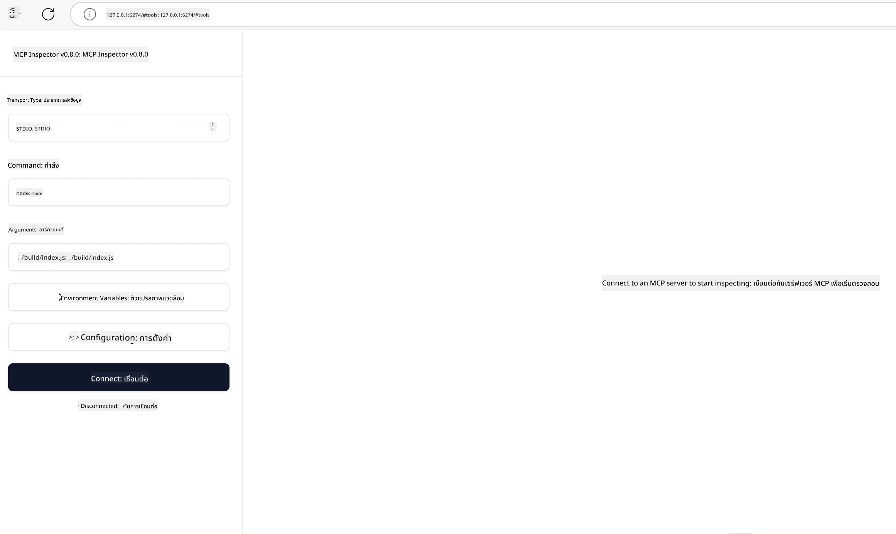

## การทดสอบและการแก้จุดบกพร่อง

ก่อนที่คุณจะเริ่มทดสอบเซิร์ฟเวอร์ MCP ของคุณ สิ่งสำคัญคือการเข้าใจเครื่องมือที่มีและแนวทางปฏิบัติที่ดีที่สุดสำหรับการแก้จุดบกพร่อง การทดสอบที่มีประสิทธิภาพช่วยให้เซิร์ฟเวอร์ของคุณทำงานตามที่คาดไว้และช่วยให้คุณระบุและแก้ไขปัญหาได้อย่างรวดเร็ว ส่วนต่อไปนี้สรุปแนวทางที่แนะนำสำหรับการตรวจสอบความถูกต้องของการใช้งาน MCP ของคุณ

## ภาพรวม

บทเรียนนี้ครอบคลุมถึงวิธีการเลือกแนวทางการทดสอบที่เหมาะสมและเครื่องมือทดสอบที่มีประสิทธิภาพที่สุด

## วัตถุประสงค์การเรียนรู้

เมื่อจบบทเรียนนี้ คุณจะสามารถ:

- อธิบายแนวทางต่าง ๆ สำหรับการทดสอบ
- ใช้เครื่องมือต่าง ๆ เพื่อทดสอบโค้ดของคุณอย่างมีประสิทธิภาพ


## การทดสอบเซิร์ฟเวอร์ MCP

MCP มีเครื่องมือช่วยให้คุณทดสอบและแก้จุดบกพร่องเซิร์ฟเวอร์ของคุณได้:

- **MCP Inspector**: เครื่องมือบรรทัดคำสั่งที่สามารถใช้งานได้ทั้งในโหมด CLI และโหมดแสดงผลแบบกราฟิก
- **การทดสอบด้วยตนเอง**: คุณสามารถใช้เครื่องมืออย่าง curl เพื่อรันคำขอเว็บ แต่เครื่องมือใด ๆ ที่รองรับ HTTP ก็ใช้ได้
- **การทดสอบหน่วย**: เป็นไปได้ที่จะใช้เฟรมเวิร์กทดสอบที่คุณชื่นชอบเพื่อทดสอบฟีเจอร์ของทั้งเซิร์ฟเวอร์และไคลเอนต์

### การใช้ MCP Inspector

เราได้อธิบายการใช้งานเครื่องมือนี้ในบทเรียนก่อนหน้าแล้ว แต่ขอพูดถึงแบบภาพรวมสั้น ๆ มันเป็นเครื่องมือที่สร้างขึ้นใน Node.js และคุณสามารถใช้โดยเรียก `npx` ซึ่งจะดาวน์โหลดและติดตั้งเครื่องมือชั่วคราวและจะลบตัวเองหลังจากรันคำขอของคุณเสร็จ

[MCP Inspector](https://github.com/modelcontextprotocol/inspector) ช่วยคุณ:

- **ค้นพบความสามารถของเซิร์ฟเวอร์**: ตรวจจับทรัพยากร, เครื่องมือ และคำสั่งที่มีโดยอัตโนมัติ
- **ทดสอบการทำงานของเครื่องมือ**: ลองใช้พารามิเตอร์ต่าง ๆ และดูผลตอบกลับแบบเรียลไทม์
- **ดูข้อมูลเมตาของเซิร์ฟเวอร์**: ตรวจสอบข้อมูลเซิร์ฟเวอร์, schemas, และการตั้งค่า

การรันเครื่องมือทั่วไปจะมีลักษณะดังนี้:

```bash
npx @modelcontextprotocol/inspector node build/index.js
```

คำสั่งข้างต้นจะเริ่มใช้งาน MCP และอินเทอร์เฟซกราฟิก และเปิดเว็บอินเทอร์เฟซบนเบราว์เซอร์ของคุณ คุณจะเห็นแดชบอร์ดแสดงรายชื่อ MCP เซิร์ฟเวอร์ที่ลงทะเบียนไว้, เครื่องมือ, ทรัพยากร และคำสั่งที่พร้อมใช้งาน อินเทอร์เฟซนี้ช่วยให้คุณทดสอบการทำงานของเครื่องมือแบบโต้ตอบ, ตรวจสอบข้อมูลเมตาของเซิร์ฟเวอร์, และดูการตอบสนองแบบเรียลไทม์ ทำให้การตรวจสอบและแก้จุดบกพร่องของการใช้งานเซิร์ฟเวอร์ MCP ง่ายขึ้น

นี่คือลักษณะที่คุณจะเห็น: 

คุณยังสามารถรันเครื่องมือนี้ในโหมด CLI ได้โดยเพิ่มแอตทริบิวต์ `--cli` นี่คือตัวอย่างการรันเครื่องมือในโหมด "CLI" ซึ่งจะแสดงรายการเครื่องมือทั้งหมดบนเซิร์ฟเวอร์:

```sh
npx @modelcontextprotocol/inspector --cli node build/index.js --method tools/list
```

### การทดสอบด้วยตนเอง

นอกจากการใช้เครื่องมือ inspector เพื่อตรวจสอบความสามารถของเซิร์ฟเวอร์แล้ว อีกวิธีที่คล้ายกันคือรันไคลเอนต์ที่รองรับ HTTP เช่น curl

ด้วย curl คุณสามารถทดสอบเซิร์ฟเวอร์ MCP โดยตรงผ่านคำขอ HTTP:

```bash
# ตัวอย่าง: ข้อมูลเมตาของเซิร์ฟเวอร์ทดสอบ
curl http://localhost:3000/v1/metadata

# ตัวอย่าง: เรียกใช้เครื่องมือ
curl -X POST http://localhost:3000/v1/tools/execute \
  -H "Content-Type: application/json" \
  -d '{"name": "calculator", "parameters": {"expression": "2+2"}}'
```

ดังที่คุณเห็นจากตัวอย่างการใช้งาน curl ข้างต้น คุณใช้คำขอ POST เพื่อเรียกใช้เครื่องมือโดยมี payload ประกอบด้วยชื่อเครื่องมือและพารามิเตอร์ของมัน ใช้วิธีที่เหมาะกับคุณที่สุด เครื่องมือ CLI ทั่วไปมักรวดเร็วในการใช้งานและเหมาะกับการเขียนสคริปต์ ซึ่งมีประโยชน์ในสภาพแวดล้อม CI/CD

### การทดสอบหน่วย

สร้างการทดสอบหน่วยสำหรับเครื่องมือและทรัพยากรของคุณเพื่อให้แน่ใจว่าทำงานตามที่คาดไว้ นี่คือตัวอย่างโค้ดสำหรับการทดสอบ

```python
import pytest

from mcp.server.fastmcp import FastMCP
from mcp.shared.memory import (
    create_connected_server_and_client_session as create_session,
)

# ทำเครื่องหมายโมดูลทั้งหมดสำหรับการทดสอบแบบอะซิงค์
pytestmark = pytest.mark.anyio


async def test_list_tools_cursor_parameter():
    """Test that the cursor parameter is accepted for list_tools.

    Note: FastMCP doesn't currently implement pagination, so this test
    only verifies that the cursor parameter is accepted by the client.
    """

 server = FastMCP("test")

    # สร้างเครื่องมือทดสอบสองสามอย่าง
    @server.tool(name="test_tool_1")
    async def test_tool_1() -> str:
        """First test tool"""
        return "Result 1"

    @server.tool(name="test_tool_2")
    async def test_tool_2() -> str:
        """Second test tool"""
        return "Result 2"

    async with create_session(server._mcp_server) as client_session:
        # ทดสอบโดยไม่ใช้พารามิเตอร์เคอร์เซอร์ (ถูกละไว้)
        result1 = await client_session.list_tools()
        assert len(result1.tools) == 2

        # ทดสอบโดยใช้ cursor=None
        result2 = await client_session.list_tools(cursor=None)
        assert len(result2.tools) == 2

        # ทดสอบโดยใช้เคอร์เซอร์เป็นสตริง
        result3 = await client_session.list_tools(cursor="some_cursor_value")
        assert len(result3.tools) == 2

        # ทดสอบโดยใช้เคอร์เซอร์เป็นสตริงว่าง
        result4 = await client_session.list_tools(cursor="")
        assert len(result4.tools) == 2
    
```

โค้ดด้านบนทำสิ่งต่อไปนี้:

- ใช้เฟรมเวิร์ก pytest ที่อนุญาตให้คุณสร้างการทดสอบเป็นฟังก์ชันและใช้คำสั่ง assert
- สร้าง MCP Server ที่มีเครื่องมือสองตัวแตกต่างกัน
- ใช้คำสั่ง `assert` เพื่อตรวจสอบว่ามีเงื่อนไขบางอย่างถูกต้องหรือไม่

ดูไฟล์ฉบับเต็มได้ที่ [ไฟล์เต็มที่นี่](https://github.com/modelcontextprotocol/python-sdk/blob/main/tests/client/test_list_methods_cursor.py)

จากไฟล์ข้างต้น คุณสามารถทดสอบเซิร์ฟเวอร์ของคุณเองเพื่อให้แน่ใจว่าความสามารถถูกสร้างขึ้นตามที่ควรจะเป็น

SDK หลักทั้งหมดมีส่วนการทดสอบที่คล้ายกัน ดังนั้นคุณสามารถปรับให้เข้ากับ runtime ที่คุณเลือกใช้

## ตัวอย่าง

- [เครื่องคิดเลข Java](../samples/java/calculator/README.md)
- [เครื่องคิดเลข .Net](../../../../03-GettingStarted/samples/csharp)
- [เครื่องคิดเลข JavaScript](../samples/javascript/README.md)
- [เครื่องคิดเลข TypeScript](../samples/typescript/README.md)
- [เครื่องคิดเลข Python](../../../../03-GettingStarted/samples/python)

## แหล่งข้อมูลเพิ่มเติม

- [Python SDK](https://github.com/modelcontextprotocol/python-sdk)

## สิ่งถัดไป

- ถัดไป: [การปรับใช้](../09-deployment/README.md)

---

<!-- CO-OP TRANSLATOR DISCLAIMER START -->
**ปฏิเสธความรับผิดชอบ**:
เอกสารนี้ได้รับการแปลโดยใช้บริการแปลภาษา AI [Co-op Translator](https://github.com/Azure/co-op-translator) ขณะที่เราพยายามให้ความถูกต้อง โปรดทราบว่าการแปลโดยอัตโนมัติอาจมีข้อผิดพลาดหรือความไม่ถูกต้อง เอกสารต้นฉบับในภาษาต้นทางควรถูกพิจารณาเป็นแหล่งข้อมูลที่เชื่อถือได้ สำหรับข้อมูลที่สำคัญ แนะนำให้ใช้การแปลโดยมนุษย์มืออาชีพ เราไม่รับผิดชอบต่อความเข้าใจผิดหรือการตีความที่ผิดพลาดที่เกิดขึ้นจากการใช้การแปลนี้
<!-- CO-OP TRANSLATOR DISCLAIMER END -->