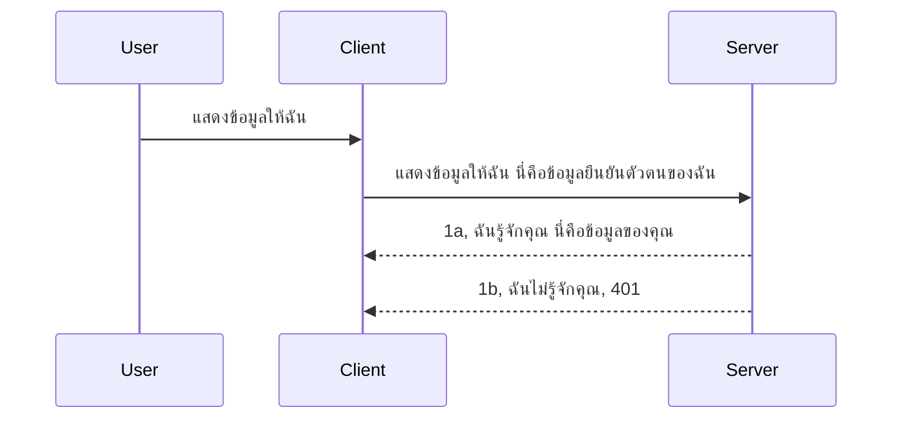

# การยืนยันตัวตนแบบง่าย

SDK MCP รองรับการใช้ OAuth 2.1 ซึ่งเป็นกระบวนการที่ค่อนข้างซับซ้อนเกี่ยวข้องกับแนวคิดต่างๆ เช่น เซิร์ฟเวอร์ยืนยันตัวตน, เซิร์ฟเวอร์ทรัพยากร, การส่งข้อมูลรับรอง, การรับรหัส, การแลกรหัสกับโทเค็นแบบ bearer จนในที่สุดคุณสามารถรับข้อมูลทรัพยากรของคุณได้ หากคุณไม่คุ้นเคยกับ OAuth ซึ่งเป็นสิ่งที่ดีที่จะนำไปใช้ เป็นความคิดที่ดีที่จะเริ่มต้นด้วยระดับการยืนยันตัวตนพื้นฐานบางอย่างและสร้างขึ้นสู่ความปลอดภัยที่ดีขึ้นและดีขึ้น นั่นคือเหตุผลที่บทนี้มีอยู่ เพื่อสร้างพื้นฐานให้คุณไปสู่การยืนยันตัวตนที่ซับซ้อนมากขึ้น

## การยืนยันตัวตน หมายถึงอะไร?

Auth ย่อมาจาก authentication และ authorization แนวคิดคือต้องทำสองสิ่งนี้:

- **Authentication** ซึ่งเป็นกระบวนการตรวจสอบว่าเราจะอนุญาตให้บุคคลเข้าบ้านเราได้หรือไม่ พวกเขามีสิทธิ์ที่จะ "อยู่ที่นี่" หรือมีสิทธิ์เข้าถึงเซิร์ฟเวอร์ทรัพยากรของเราที่มีฟีเจอร์ MCP Server หรือไม่
- **Authorization** คือกระบวนการตรวจสอบว่าผู้ใช้ควรได้รับอนุญาตเข้าถึงทรัพยากรเฉพาะที่พวกเขาขอหรือไม่ เช่น คำสั่งซื้อเหล่านี้หรือผลิตภัณฑ์เหล่านี้ หรือว่าพวกเขาได้รับอนุญาตให้อ่านเนื้อหาแต่ไม่สามารถลบได้ เป็นต้น

## ข้อมูลรับรอง: วิธีที่เราบอกระบบว่าเราเป็นใคร

ส่วนใหญ่นักพัฒนาเว็บมักคิดในแง่ของการให้ข้อมูลรับรองกับเซิร์ฟเวอร์ โดยปกติจะเป็นความลับที่บอกว่าพวกเขาได้รับอนุญาตให้มาอยู่ที่นี่ "การยืนยันตัวตน" ข้อมูลรับรองนี้โดยปกติจะเป็นเวอร์ชัน base64 ของชื่อผู้ใช้และรหัสผ่าน หรือกุญแจ API ที่ระบุผู้ใช้เฉพาะ

ซึ่งจะเกี่ยวข้องกับการส่งผ่านหัวข้อชื่อ "Authorization" ดังนี้:

```json
{ "Authorization": "secret123" }
```

ซึ่งโดยทั่วไปจะเรียกว่า basic authentication วิธีการทำงานโดยรวมเป็นดังนี้:


เมื่อเราเข้าใจว่ามันทำงานอย่างไรในแง่ของ flow แล้ว เราจะนำไปใช้ได้อย่างไร? โดยปกติเซิร์ฟเวอร์เว็บส่วนใหญ่มีแนวคิดที่เรียกว่า middleware ซึ่งเป็นโค้ดส่วนที่ทำงานเป็นส่วนหนึ่งของคำขอที่สามารถตรวจสอบข้อมูลรับรอง และถ้าข้อมูลรับรองถูกต้องก็จะอนุญาตให้คำขอผ่านได้ หากคำขอไม่มีข้อมูลรับรองที่ถูกต้อง คุณจะได้รับข้อผิดพลาดการยืนยันตัวตน มาดูกันว่าคุณสามารถใช้วิธีนี้อย่างไร:

**Python**

```python
class AuthMiddleware(BaseHTTPMiddleware):
    async def dispatch(self, request, call_next):

        has_header = request.headers.get("Authorization")
        if not has_header:
            print("-> Missing Authorization header!")
            return Response(status_code=401, content="Unauthorized")

        if not valid_token(has_header):
            print("-> Invalid token!")
            return Response(status_code=403, content="Forbidden")

        print("Valid token, proceeding...")
       
        response = await call_next(request)
        # เพิ่มส่วนหัวลูกค้าหรือเปลี่ยนแปลงบางอย่างในตอบสนอง
        return response


starlette_app.add_middleware(CustomHeaderMiddleware)
```

ที่นี่เรามี:

- สร้าง middleware ที่ชื่อ `AuthMiddleware` โดยที่เมธอด `dispatch` ของมันถูกเรียกโดยเว็บเซิร์ฟเวอร์
- เพิ่ม middleware ลงในเว็บเซิร์ฟเวอร์:

    ```python
    starlette_app.add_middleware(AuthMiddleware)
    ```

- เขียนตรรกะตรวจสอบที่เช็คว่าหัวข้อ Authorization มีอยู่และความลับที่ส่งมานั้นถูกต้องหรือไม่:

    ```python
    has_header = request.headers.get("Authorization")
    if not has_header:
        print("-> Missing Authorization header!")
        return Response(status_code=401, content="Unauthorized")

    if not valid_token(has_header):
        print("-> Invalid token!")
        return Response(status_code=403, content="Forbidden")
    ```

    ถ้าความลับมีอยู่และถูกต้อง เราก็จะอนุญาตให้คำขอผ่านโดยเรียก `call_next` และคืนค่า response

    ```python
    response = await call_next(request)
    # เพิ่มหัวข้อของลูกค้าใดๆ หรือเปลี่ยนแปลงในการตอบกลับในบางวิธี
    return response
    ```

วิธีการทำงานคือเมื่อมีคำขอเว็บถูกส่งมายังเซิร์ฟเวอร์ middleware จะถูกเรียกใช้งานและด้วยการติดตั้งของมัน มันจะอนุญาตให้คำขอผ่านหรือส่งคืนข้อผิดพลาดที่ระบุว่าไคลเอนต์ไม่มีสิทธิ์ดำเนินการต่อ

**TypeScript**

ที่นี่เราสร้าง middleware ด้วยเฟรมเวิร์กยอดนิยม Express และขัดขวางคำขอก่อนที่มันจะถึง MCP Server นี่คือโค้ดสำหรับสิ่งนั้น:

```typescript
function isValid(secret) {
    return secret === "secret123";
}

app.use((req, res, next) => {
    // 1. มีส่วนหัวการอนุญาตหรือไม่?
    if(!req.headers["Authorization"]) {
        res.status(401).send('Unauthorized');
    }
    
    let token = req.headers["Authorization"];

    // 2. ตรวจสอบความถูกต้อง
    if(!isValid(token)) {
        res.status(403).send('Forbidden');
    }

   
    console.log('Middleware executed');
    // 3. ส่งคำขอต่อไปยังขั้นตอนถัดไปในสายงานคำขอ
    next();
});
```

ในโค้ดนี้:

1. ตรวจสอบว่าหัวข้อ Authorization มีอยู่หรือไม่ ถ้าไม่มีก็ส่งข้อผิดพลาด 401
2. ตรวจสอบว่าข้อมูลรับรอง/โทเค็นถูกต้องหรือไม่ ถ้าไม่ถูกต้องก็ส่งข้อผิดพลาด 403
3. สุดท้ายส่งต่อคำขอใน pipeline ของคำขอและคืนทรัพยากรที่ร้องขอ

## แบบฝึกหัด: การนำการยืนยันตัวตนไปใช้งาน

เรามาลองนำความรู้ไปใช้ดู แผนงานคือ:

เซิร์ฟเวอร์

- สร้างเว็บเซิร์ฟเวอร์และอินสแตนซ์ MCP
- ลงมือทำ middleware สำหรับเซิร์ฟเวอร์

ไคลเอนต์

- ส่งคำขอเว็บพร้อมข้อมูลรับรองผ่านหัวข้อ

### -1- สร้างเว็บเซิร์ฟเวอร์และอินสแตนซ์ MCP

ในขั้นตอนแรก เราต้องสร้างอินสแตนซ์เว็บเซิร์ฟเวอร์และ MCP Server

**Python**

ที่นี่เราสร้างอินสแตนซ์ MCP Server และสร้างแอป starlette เว็บแล้วโฮสต์ด้วย uvicorn

```python
# กำลังสร้างเซิร์ฟเวอร์ MCP

app = FastMCP(
    name="MCP Resource Server",
    instructions="Resource Server that validates tokens via Authorization Server introspection",
    host=settings["host"],
    port=settings["port"],
    debug=True
)

# กำลังสร้างเว็บแอป starlette
starlette_app = app.streamable_http_app()

# ให้บริการแอปผ่าน uvicorn
async def run(starlette_app):
    import uvicorn
    config = uvicorn.Config(
            starlette_app,
            host=app.settings.host,
            port=app.settings.port,
            log_level=app.settings.log_level.lower(),
        )
    server = uvicorn.Server(config)
    await server.serve()

run(starlette_app)
```

ในโค้ดนี้เรา:

- สร้าง MCP Server
- สร้างแอปเว็บ starlette จาก MCP Server โดยใช้ `app.streamable_http_app()`
- โฮสต์และให้บริการแอปเว็บโดยใช้ uvicorn `server.serve()`

**TypeScript**

ที่นี่เราสร้างอินสแตนซ์ MCP Server

```typescript
const server = new McpServer({
      name: "example-server",
      version: "1.0.0"
    });

    // ... ตั้งค่าทรัพยากรเซิร์ฟเวอร์ เครื่องมือ และพร้อมท์ ...
```

การสร้าง MCP Server นี้จะต้องเกิดขึ้นภายในคำจำกัดความเส้นทาง POST /mcp ดังนั้นนำโค้ดด้านบนมาใส่ในลักษณะนี้:

```typescript
import express from "express";
import { randomUUID } from "node:crypto";
import { McpServer } from "@modelcontextprotocol/sdk/server/mcp.js";
import { StreamableHTTPServerTransport } from "@modelcontextprotocol/sdk/server/streamableHttp.js";
import { isInitializeRequest } from "@modelcontextprotocol/sdk/types.js"

const app = express();
app.use(express.json());

// แผนที่เพื่อเก็บการขนส่งตามรหัสเซสชัน
const transports: { [sessionId: string]: StreamableHTTPServerTransport } = {};

// จัดการคำขอ POST สำหรับการสื่อสารระหว่างไคลเอนต์และเซิร์ฟเวอร์
app.post('/mcp', async (req, res) => {
  // ตรวจสอบรหัสเซสชันที่มีอยู่
  const sessionId = req.headers['mcp-session-id'] as string | undefined;
  let transport: StreamableHTTPServerTransport;

  if (sessionId && transports[sessionId]) {
    // ใช้การขนส่งที่มีอยู่ซ้ำ
    transport = transports[sessionId];
  } else if (!sessionId && isInitializeRequest(req.body)) {
    // คำขอเริ่มต้นใหม่
    transport = new StreamableHTTPServerTransport({
      sessionIdGenerator: () => randomUUID(),
      onsessioninitialized: (sessionId) => {
        // เก็บการขนส่งตามรหัสเซสชัน
        transports[sessionId] = transport;
      },
      // การป้องกัน DNS rebinding ถูกปิดโดยค่าเริ่มต้นเพื่อความเข้ากันได้ย้อนหลัง หากคุณกำลังรันเซิร์ฟเวอร์นี้
      // ภายในเครื่อง ตรวจสอบให้แน่ใจว่าได้ตั้งค่า:
      // enableDnsRebindingProtection: true,
      // allowedHosts: ['127.0.0.1'],
    });

    // ทำความสะอาดการขนส่งเมื่อปิด
    transport.onclose = () => {
      if (transport.sessionId) {
        delete transports[transport.sessionId];
      }
    };
    const server = new McpServer({
      name: "example-server",
      version: "1.0.0"
    });

    // ... ตั้งค่าทรัพยากรเซิร์ฟเวอร์ เครื่องมือ และคำสั่ง ...

    // เชื่อมต่อกับเซิร์ฟเวอร์ MCP
    await server.connect(transport);
  } else {
    // คำขอไม่ถูกต้อง
    res.status(400).json({
      jsonrpc: '2.0',
      error: {
        code: -32000,
        message: 'Bad Request: No valid session ID provided',
      },
      id: null,
    });
    return;
  }

  // จัดการคำขอ
  await transport.handleRequest(req, res, req.body);
});

// ตัวจัดการที่สามารถใช้ซ้ำสำหรับคำขอ GET และ DELETE
const handleSessionRequest = async (req: express.Request, res: express.Response) => {
  const sessionId = req.headers['mcp-session-id'] as string | undefined;
  if (!sessionId || !transports[sessionId]) {
    res.status(400).send('Invalid or missing session ID');
    return;
  }
  
  const transport = transports[sessionId];
  await transport.handleRequest(req, res);
};

// จัดการคำขอ GET สำหรับการแจ้งเตือนจากเซิร์ฟเวอร์ไปยังไคลเอนต์ผ่าน SSE
app.get('/mcp', handleSessionRequest);

// จัดการคำขอ DELETE สำหรับการยุติเซสชัน
app.delete('/mcp', handleSessionRequest);

app.listen(3000);
```

ตอนนี้คุณจะเห็นว่าการสร้าง MCP Server ย้ายมาอยู่ภายใน `app.post("/mcp")`

ต่อไปเราจะมาทำขั้นตอนถัดไปคือการสร้าง middleware เพื่อยืนยันข้อมูลรับรองที่เข้ามา

### -2- ลงมือทำ middleware สำหรับเซิร์ฟเวอร์

มาต่อส่วนของ middleware กัน ที่นี่เราจะสร้าง middleware ที่ค้นหาข้อมูลรับรองในหัวข้อ `Authorization` และตรวจสอบความถูกต้อง หากผ่านจะอนุญาตให้คำขอดำเนินการต่อ (เช่น แสดงเครื่องมือ, อ่านทรัพยากร หรือฟีเจอร์ MCP ใดๆ ที่ไคลเอนต์ร้องขอ)

**Python**

ในการสร้าง middleware เราต้องสร้างคลาสที่สืบทอดจาก `BaseHTTPMiddleware` มีสองส่วนที่น่าสนใจ:

- คำขอ `request` ซึ่งเราจะอ่านข้อมูลหัวข้อจากมัน
- `call_next` callback ที่เราต้องเรียกหากไคลเอนต์นำข้อมูลรับรองที่เรายอมรับมา

ก่อนอื่นเราต้องจัดการกรณีที่หัวข้อ `Authorization` หายไป:

```python
has_header = request.headers.get("Authorization")

# ไม่มีส่วนหัว ปฏิเสธด้วย 401 มิฉะนั้นดำเนินการต่อ.
if not has_header:
    print("-> Missing Authorization header!")
    return Response(status_code=401, content="Unauthorized")
```

ที่นี่เราส่งข้อความ 401 unauthorized เนื่องจากไคลเอนต์ล้มเหลวในการยืนยันตัวตน

ต่อมา หากส่งข้อมูลรับรองมา เราต้องตรวจสอบความถูกต้องดังนี้:

```python
 if not valid_token(has_header):
    print("-> Invalid token!")
    return Response(status_code=403, content="Forbidden")
```

สังเกตว่าเราส่งข้อความ 403 forbidden ด้านบน มาดู middleware ฉบับเต็มที่ทำทุกอย่างตามที่พูดไปด้านบน:

```python
class AuthMiddleware(BaseHTTPMiddleware):
    async def dispatch(self, request, call_next):

        has_header = request.headers.get("Authorization")
        if not has_header:
            print("-> Missing Authorization header!")
            return Response(status_code=401, content="Unauthorized")

        if not valid_token(has_header):
            print("-> Invalid token!")
            return Response(status_code=403, content="Forbidden")

        print("Valid token, proceeding...")
        print(f"-> Received {request.method} {request.url}")
        response = await call_next(request)
        response.headers['Custom'] = 'Example'
        return response

```

ดีมาก แต่ฟังก์ชัน `valid_token` ล่ะ? นี่คือตัวอย่างด้านล่าง:

```python
# หลีกเลี่ยงการใช้ในงานผลิตจริง - ควรปรับปรุงให้ดีขึ้น !!
def valid_token(token: str) -> bool:
    # ลบคำขึ้นต้น "Bearer " ออก
    if token.startswith("Bearer "):
        token = token[7:]
        return token == "secret-token"
    return False
```

สิ่งนี้ควรได้รับการปรับปรุงอย่างแน่นอน

สำคัญ: คุณไม่ควรเก็บความลับแบบนี้ในโค้ด คุณควรดึงค่าที่จะนำมาเปรียบเทียบจากแหล่งข้อมูลหรือจาก IDP (ผู้ให้บริการตัวตน) หรือที่ดีไปกว่านั้นให้ IDP เป็นผู้ตรวจสอบความถูกต้อง

**TypeScript**

ในการใช้งานกับ Express เราต้องเรียกเมธอด `use` ที่รับฟังก์ชัน middleware

เราต้อง:

- โต้ตอบกับตัวแปรคำขอเพื่อตรวจสอบข้อมูลรับรองที่ส่งผ่านในคุณสมบัติ `Authorization`
- ตรวจสอบความถูกต้องของข้อมูลรับรอง ถ้าถูกต้องก็ปล่อยให้คำขอต่อไปและให้คำขอ MCP ของไคลเอนต์ทำงานตามที่ต้องการ

ที่นี่ เราตรวจสอบว่าหัวข้อ `Authorization` มีหรือไม่ ถ้าไม่มี เราจะหยุดไม่ให้คำขอผ่าน:

```typescript
if(!req.headers["authorization"]) {
    res.status(401).send('Unauthorized');
    return;
}
```

ถ้าไม่มีหัวข้อนี้จะได้รับรหัส 401

ต่อมา เราตรวจสอบว่าข้อมูลรับรองถูกต้องหรือไม่ ถ้าไม่ถูกต้องเราก็หยุดคำขอเช่นกันแต่ด้วยข้อความที่แตกต่างกันเล็กน้อย:

```typescript
if(!isValid(token)) {
    res.status(403).send('Forbidden');
    return;
} 
```

สังเกตว่าตอนนี้จะได้ข้อผิดพลาด 403

นี่คือโค้ดฉบับเต็ม:

```typescript
app.use((req, res, next) => {
    console.log('Request received:', req.method, req.url, req.headers);
    console.log('Headers:', req.headers["authorization"]);
    if(!req.headers["authorization"]) {
        res.status(401).send('Unauthorized');
        return;
    }
    
    let token = req.headers["authorization"];

    if(!isValid(token)) {
        res.status(403).send('Forbidden');
        return;
    }  

    console.log('Middleware executed');
    next();
});
```

เราได้ติดตั้งเว็บเซิร์ฟเวอร์ให้รับ middleware เพื่อตรวจสอบข้อมูลรับรองที่ไคลเอนต์หวังว่าจะส่งมา แล้วไคลเอนต์เองล่ะ?

### -3- ส่งคำขอเว็บพร้อมข้อมูลรับรองผ่านหัวข้อ

เราต้องแน่ใจว่าไคลเอนต์ส่งข้อมูลรับรองผ่านหัวข้อ เนื่องจากเราจะใช้ไคลเอนต์ MCP เราต้องหาวิธีทำเช่นนั้น

**Python**

สำหรับไคลเอนต์ เราต้องส่งหัวข้อพร้อมข้อมูลรับรองดังนี้:

```python
# อย่าระบุค่าคงที่ไว้ตรงๆ ควรเก็บไว้อย่างน้อยในตัวแปรแวดล้อมหรือที่เก็บข้อมูลที่ปลอดภัยกว่า
token = "secret-token"

async with streamablehttp_client(
        url = f"http://localhost:{port}/mcp",
        headers = {"Authorization": f"Bearer {token}"}
    ) as (
        read_stream,
        write_stream,
        session_callback,
    ):
        async with ClientSession(
            read_stream,
            write_stream
        ) as session:
            await session.initialize()
      
            # TODO, สิ่งที่คุณต้องการให้ทำในไคลเอนต์ เช่น แสดงรายชื่อเครื่องมือ เรียกใช้เครื่องมือ เป็นต้น
```

สังเกตว่าเราเติมคุณสมบัติ `headers` แบบนี้ `headers = {"Authorization": f"Bearer {token}"}`

**TypeScript**

เราสามารถแก้ปัญหานี้ในสองขั้นตอน:

1. เติมอ็อบเจกต์ configuration ด้วยข้อมูลรับรองของเรา
2. ส่งอ็อบเจกต์ configuration ไปยัง transport

```typescript

// อย่าเขียนค่าคงที่ลงไปโดยตรงเหมือนที่แสดงที่นี่ อย่างน้อยควรเก็บไว้ในตัวแปรแวดล้อมและใช้เครื่องมืออย่าง dotenv (ในโหมดพัฒนา)
let token = "secret123"

// กำหนดอ็อบเจ็กต์ตัวเลือกการขนส่งของลูกค้า
let options: StreamableHTTPClientTransportOptions = {
  sessionId: sessionId,
  requestInit: {
    headers: {
      "Authorization": "secret123"
    }
  }
};

// ส่งอ็อบเจ็กต์ตัวเลือกไปยังตัวขนส่ง
async function main() {
   const transport = new StreamableHTTPClientTransport(
      new URL(serverUrl),
      options
   );
```

ที่นี่คุณจะเห็นว่าเราต้องสร้างอ็อบเจกต์ `options` และใส่หัวข้อไว้ภายใต้คุณสมบัติ `requestInit`

สำคัญ: จะปรับปรุงได้อย่างไรต่อจากนี้? การส่งข้อมูลรับรองแบบนี้ค่อนข้างเสี่ยง เว้นแต่คุณจะใช้ HTTPS อย่างน้อย และแม้กระทั่งนั้น ข้อมูลรับรองก็ยังสามารถถูกขโมยได้ ดังนั้นคุณจึงต้องมีระบบที่สามารถเพิกถอนโทเค็นได้ง่าย ๆ และเพิ่มการตรวจสอบ เช่น มาจากที่ใดในโลก การร้องขอบ่อยเกินไปหรือไม่ (พฤติกรรมเหมือนบอท) คร่าวๆ มีข้อกังวลมากมาย

อย่างไรก็ตาม สำหรับ API ที่ง่ายมากที่ไม่ต้องการให้ใครเรียก API โดยไม่ยืนยันตัวตน และสิ่งที่เรามีอยู่ตรงนี้ถือเป็นจุดเริ่มต้นที่ดี

ด้วยเหตุนี้ ลองแข็งแกร่งความปลอดภัยขึ้นเล็กน้อยโดยใช้ฟอร์แมตมาตรฐานอย่าง JSON Web Token หรือที่รู้จักกันในชื่อ JWT หรือ "JOT" tokens

## JSON Web Tokens, JWT

ดังนั้น เรากำลังพยายามปรับปรุงจากการส่งข้อมูลรับรองง่ายๆ สิ่งที่ปรับปรุงทันทีที่ได้จากการใช้ JWT คืออะไร?

- **ปรับปรุงความปลอดภัย** ใน basic auth คุณส่งชื่อผู้ใช้และรหัสผ่านเป็นโทเค็นเข้ารหัส base64 (หรือส่งคีย์ API) ซ้ำๆ ซึ่งเพิ่มความเสี่ยง ด้วย JWT คุณส่งชื่อผู้ใช้และรหัสผ่านแล้วได้โทเค็นกลับมา และโทเค็นยังมีเวลาหมดอายุ JWT ให้คุณใช้การควบคุมการเข้าถึงแบบละเอียดด้วยบทบาท สโคปส์ และสิทธิ์ได้ง่าย
- **ความไม่ขึ้นกับสถานะและการขยายระบบ** JWT เป็นแบบ self-contained มีข้อมูลผู้ใช้ทั้งหมดและไม่ต้องเก็บสถานะ session ที่เซิร์ฟเวอร์ โทเค็นยังสามารถตรวจสอบได้ในเครื่อง
- **ความสามารถทำงานร่วมกันและการฟีดเดอเรชัน** JWT เป็นศูนย์กลางของ Open ID Connect และใช้กับ identity provider ที่รู้จักเช่น Entra ID, Google Identity และ Auth0 ทำให้สามารถใช้ single sign on และอื่นๆ อีกมากมาย ซึ่งทำให้เป็นมาตรฐานที่ใช้ในองค์กร
- **ความยืดหยุ่นและโมดูลาร์** JWT ยังใช้ได้กับ API Gateway เช่น Azure API Management, NGINX เป็นต้น รองรับสถานการณ์การยืนยันตัวตน และการสื่อสารระหว่างเซิร์ฟเวอร์ถึงบริการ รวมถึงสถานการณ์การสวมรอยและการมอบหมายสิทธิ์
- **ประสิทธิภาพและการแคช** JWT สามารถแคชได้หลังการถอดรหัสซึ่งลดความจำเป็นในการแยกวิเคราะห์ ช่วยในแอปที่มีปริมาณการใช้งานสูง เพิ่มความสามารถในการประมวลผลและลดภาระระบบ
- **ฟีเจอร์ขั้นสูง** รองรับ introspection (ตรวจสอบความถูกต้องที่เซิร์ฟเวอร์) และ revocation (ทำให้โทเค็นไม่ถูกต้อง)

ด้วยประโยชน์ทั้งหมดนี้ เรามาดูวิธีนำไปสู่ระดับถัดไปกัน

## การแปลง basic auth เป็น JWT

ดังนั้น สิ่งที่ต้องเปลี่ยนในระดับคร่าวๆ คือ

- **เรียนรู้การสร้างโทเค็น JWT** และเตรียมพร้อมส่งจากไคลเอนต์ไปยังเซิร์ฟเวอร์
- **ตรวจสอบโทเค็น JWT** และถ้าถูกต้อง ให้ไคลเอนต์เข้าถึงทรัพยากรของเรา
- **เก็บโทเค็นอย่างปลอดภัย** วิธีเก็บโทเค็นนี้
- **ปกป้องเส้นทาง** เราต้องปกป้องเส้นทาง ในกรณีของเรา เราต้องปกป้องเส้นทางและฟีเจอร์ MCP เฉพาะ
- **เพิ่มโทเค็นรีเฟรช** ตรวจสอบให้แน่ใจว่าเราสร้างโทเค็นที่มีอายุสั้นและโทเค็นรีเฟรชที่มีอายุยาว ใช้สำหรับดึงโทเค็นใหม่ถ้าโทเค็นหมดอายุ พร้อมกำหนดจุดรีเฟรชและกลยุทธ์การหมุน

### -1- สร้างโทเค็น JWT

ก่อนอื่น โทเค็น JWT มีส่วนต่อไปนี้:

- **header** อัลกอริทึมที่ใช้และประเภทโทเค็น
- **payload** ข้อมูลอ้างสิทธิ์ เช่น sub (ผู้ใช้หรือเอนทิตีที่โทเค็นแทน ในสถานการณ์ auth ปกติคือ user ID), exp (วันหมดอายุ), role (บทบาท)
- **signature** ลายเซ็นด้วยความลับหรือกุญแจส่วนตัว

เราต้องสร้าง header, payload และโทเค็นเข้ารหัส

**Python**

```python

import jwt
import jwt
from jwt.exceptions import ExpiredSignatureError, InvalidTokenError
import datetime

# กุญแจลับที่ใช้ลงลายเซ็น JWT
secret_key = 'your-secret-key'

header = {
    "alg": "HS256",
    "typ": "JWT"
}

# ข้อมูลผู้ใช้และการอ้างสิทธิ์รวมทั้งเวลาหมดอายุ
payload = {
    "sub": "1234567890",               # หัวเรื่อง (รหัสผู้ใช้)
    "name": "User Userson",                # การอ้างสิทธิ์ที่กำหนดเอง
    "admin": True,                     # การอ้างสิทธิ์ที่กำหนดเอง
    "iat": datetime.datetime.utcnow(),# วันที่ออก
    "exp": datetime.datetime.utcnow() + datetime.timedelta(hours=1)  # วันหมดอายุ
}

# เข้ารหัสมัน
encoded_jwt = jwt.encode(payload, secret_key, algorithm="HS256", headers=header)
```

ในโค้ดด้านบนเรา:

- กำหนด header โดยใช้ HS256 เป็นอัลกอริทึม และ type เป็น JWT
- สร้าง payload ที่ประกอบด้วย subject หรือ user id, ชื่อผู้ใช้, บทบาท, เวลาที่ออกและเวลาหมดอายุ เพื่อทำให้โทเค็นมีอายุจำกัดตามที่กล่าวไว้ก่อนหน้า

**TypeScript**

ที่นี่เราจะใช้ dependencies ที่ช่วยเราสร้างโทเค็น JWT

Dependencies

```sh

npm install jsonwebtoken
npm install --save-dev @types/jsonwebtoken
```

เมื่อมีพร้อมแล้ว มาสร้าง header, payload และสร้างโทเค็นแบบเข้ารหัสกัน

```typescript
import jwt from 'jsonwebtoken';

const secretKey = 'your-secret-key'; // ใช้ตัวแปรสภาพแวดล้อมในสภาพแวดล้อมการผลิต

// กำหนด payload
const payload = {
  sub: '1234567890',
  name: 'User usersson',
  admin: true,
  iat: Math.floor(Date.now() / 1000), // ออกให้เมื่อ
  exp: Math.floor(Date.now() / 1000) + 60 * 60 // หมดอายุภายใน 1 ชั่วโมง
};

// กำหนด header (ไม่บังคับ, jsonwebtoken ตั้งค่าเริ่มต้นให้)
const header = {
  alg: 'HS256',
  typ: 'JWT'
};

// สร้างโทเค็น
const token = jwt.sign(payload, secretKey, {
  algorithm: 'HS256',
  header: header
});

console.log('JWT:', token);
```

โทเค็นนี้:

เซ็นด้วย HS256
มีอายุ 1 ชั่วโมง
รวม claims เช่น sub, name, admin, iat, และ exp

### -2- ตรวจสอบโทเค็น

เราต้องตรวจสอบโทเค็น นี่คือสิ่งที่เราควรทำบนเซิร์ฟเวอร์เพื่อให้แน่ใจว่าโทเค็นที่ไคลเอนต์ส่งมาตรงตามเงื่อนไข มีการตรวจสอบหลายอย่างที่ควรทำ ตั้งแต่โครงสร้างไปจนถึงความถูกต้อง คุณยังควรเพิ่มการตรวจสอบอื่นๆ เช่น ดูว่าผู้ใช้อยู่ในระบบของคุณหรือไม่ และอื่นๆ

ในการตรวจสอบโทเค็น เราต้องถอดรหัสเพื่ออ่านและเริ่มตรวจสอบความถูกต้อง

**Python**

```python

# ถอดรหัสและตรวจสอบ JWT
try:
    decoded = jwt.decode(token, secret_key, algorithms=["HS256"])
    print("✅ Token is valid.")
    print("Decoded claims:")
    for key, value in decoded.items():
        print(f"  {key}: {value}")
except ExpiredSignatureError:
    print("❌ Token has expired.")
except InvalidTokenError as e:
    print(f"❌ Invalid token: {e}")

```

ในโค้ดนี้ เราเรียก `jwt.decode` โดยใช้ token, secret key และอัลกอริทึมที่เลือกเป็นพารามิเตอร์ เขียนโครงสร้าง try-catch เพราะการตรวจสอบล้มเหลวจะเกิดข้อผิดพลาด

**TypeScript**

ที่นี่เราต้องเรียก `jwt.verify` เพื่อรับโทเค็นที่ถอดรหัสแล้วเพื่อนำไปวิเคราะห์ต่อ หากเรียกไม่สำเร็จ หมายความว่าโครงสร้างของโทเค็นไม่ถูกต้องหรือไม่ถูกต้องอีกต่อไป

```typescript

try {
  const decoded = jwt.verify(token, secretKey);
  console.log('Decoded Payload:', decoded);
} catch (err) {
  console.error('Token verification failed:', err);
}
```

หมายเหตุ: ตามที่กล่าวไว้ก่อนหน้านี้ เราควรเพิ่มการตรวจสอบเพิ่มเติมเพื่อให้แน่ใจว่าโทเค็นนี้ชี้ไปที่ผู้ใช้ในระบบของเราและตรวจสอบผู้ใช้มีสิทธิ์ตามที่อ้างอิงหรือไม่

ต่อไป เรามาดูการควบคุมการเข้าถึงตามบทบาท หรือที่รู้จักกันในชื่อ RBAC
## การเพิ่มการควบคุมการเข้าถึงตามบทบาท

แนวคิดคือเราต้องการแสดงว่าบทบาทที่แตกต่างกันมีสิทธิ์ที่แตกต่างกัน ตัวอย่างเช่น เราสมมติว่าแอดมินสามารถทำทุกอย่างได้ ในขณะที่ผู้ใช้ทั่วไปสามารถอ่าน/เขียนได้ และแขกสามารถอ่านได้เท่านั้น ดังนั้น นี่คือระดับสิทธิ์ที่เป็นไปได้บางอย่าง:

- Admin.Write
- User.Read
- Guest.Read

มาดูกันว่าทำอย่างไรเราจึงสามารถนำการควบคุมดังกล่าวมาใช้กับ middleware ได้ Middleware สามารถเพิ่มต่อเส้นทางได้ทั้งแบบรายเส้นทางและสำหรับเส้นทางทั้งหมด

**Python**

```python
from starlette.middleware.base import BaseHTTPMiddleware
from starlette.responses import JSONResponse
import jwt

# อย่าเก็บความลับไว้ในโค้ด เช่นนี้เป็นเพียงเพื่อสาธิตเท่านั้น อ่านมันจากที่ปลอดภัย
SECRET_KEY = "your-secret-key" # ใส่สิ่งนี้ในตัวแปร env
REQUIRED_PERMISSION = "User.Read"

class JWTPermissionMiddleware(BaseHTTPMiddleware):
    async def dispatch(self, request, call_next):
        auth_header = request.headers.get("Authorization")
        if not auth_header or not auth_header.startswith("Bearer "):
            return JSONResponse({"error": "Missing or invalid Authorization header"}, status_code=401)

        token = auth_header.split(" ")[1]
        try:
            decoded = jwt.decode(token, SECRET_KEY, algorithms=["HS256"])
        except jwt.ExpiredSignatureError:
            return JSONResponse({"error": "Token expired"}, status_code=401)
        except jwt.InvalidTokenError:
            return JSONResponse({"error": "Invalid token"}, status_code=401)

        permissions = decoded.get("permissions", [])
        if REQUIRED_PERMISSION not in permissions:
            return JSONResponse({"error": "Permission denied"}, status_code=403)

        request.state.user = decoded
        return await call_next(request)


```
  
มีวิธีต่างๆ ในการเพิ่ม middleware ดังนี้:

```python

# ตัวเลือก 1: เพิ่มมิดเดิลแวร์ในขณะที่กำลังสร้างแอป starlette
middleware = [
    Middleware(JWTPermissionMiddleware)
]

app = Starlette(routes=routes, middleware=middleware)

# ตัวเลือก 2: เพิ่มมิดเดิลแวร์หลังจากที่แอป starlette ถูกสร้างขึ้นแล้ว
starlette_app.add_middleware(JWTPermissionMiddleware)

# ตัวเลือก 3: เพิ่มมิดเดิลแวร์ต่อเส้นทาง
routes = [
    Route(
        "/mcp",
        endpoint=..., # ตัวจัดการ
        middleware=[Middleware(JWTPermissionMiddleware)]
    )
]
```
  
**TypeScript**

เราสามารถใช้ `app.use` และ middleware ที่จะทำงานสำหรับคำขอทั้งหมดได้

```typescript
app.use((req, res, next) => {
    console.log('Request received:', req.method, req.url, req.headers);
    console.log('Headers:', req.headers["authorization"]);

    // 1. ตรวจสอบว่ามีการส่งส่วนหัวการอนุญาตหรือไม่

    if(!req.headers["authorization"]) {
        res.status(401).send('Unauthorized');
        return;
    }
    
    let token = req.headers["authorization"];

    // 2. ตรวจสอบว่าโทเค็นถูกต้องหรือไม่
    if(!isValid(token)) {
        res.status(403).send('Forbidden');
        return;
    }  

    // 3. ตรวจสอบว่าผู้ใช้โทเค็นมีอยู่ในระบบของเราหรือไม่
    if(!isExistingUser(token)) {
        res.status(403).send('Forbidden');
        console.log("User does not exist");
        return;
    }
    console.log("User exists");

    // 4. ตรวจสอบว่าโทเค็นมีสิทธิ์ที่ถูกต้องหรือไม่
    if(!hasScopes(token, ["User.Read"])){
        res.status(403).send('Forbidden - insufficient scopes');
    }

    console.log("User has required scopes");

    console.log('Middleware executed');
    next();
});

```
  
มีหลายอย่างที่เราสามารถให้ middleware ของเราทำได้และที่ middleware ของเราควรทำ ได้แก่:

1. ตรวจสอบว่ามี authorization header หรือไม่  
2. ตรวจสอบว่า token ถูกต้องหรือไม่ เราเรียกใช้ `isValid` ซึ่งเป็นเมธอดที่เราเขียนขึ้นเพื่อตรวจสอบความถูกต้องและความสมบูรณ์ของ JWT token  
3. ตรวจสอบว่าผู้ใช้มีอยู่ในระบบของเราหรือไม่ เราควรตรวจสอบ

   ```typescript
    // ผู้ใช้ในฐานข้อมูล
   const users = [
     "user1",
     "User usersson",
   ]

   function isExistingUser(token) {
     let decodedToken = verifyToken(token);

     // ต้องทำ, ตรวจสอบว่าผู้ใช้มีอยู่ในฐานข้อมูลหรือไม่
     return users.includes(decodedToken?.name || "");
   }
   ```
  
ด้านบน เราได้สร้างรายการ `users` แบบง่ายๆ ซึ่งควรจะอยู่ในฐานข้อมูลอย่างชัดเจน

4. นอกจากนี้ เราควรตรวจสอบว่า token มีสิทธิ์ที่ถูกต้องหรือไม่

   ```typescript
   if(!hasScopes(token, ["User.Read"])){
        res.status(403).send('Forbidden - insufficient scopes');
   }
   ```
  
ในโค้ดด้านบนจาก middleware เราตรวจสอบว่า token มีสิทธิ์ User.Read หรือไม่ หากไม่มีเราจะส่งข้อผิดพลาด 403 ด้านล่างคือเมธอดช่วยเหลือ `hasScopes`

   ```typescript
   function hasScopes(scope: string, requiredScopes: string[]) {
     let decodedToken = verifyToken(scope);
    return requiredScopes.every(scope => decodedToken?.scopes.includes(scope));
  }  
   ```

Have a think which additional checks you should be doing, but these are the absolute minimum of checks you should be doing.

Using Express as a web framework is a common choice. There are helpers library when you use JWT so you can write less code.

- `express-jwt`, helper library that provides a middleware that helps decode your token.
- `express-jwt-permissions`, this provides a middleware `guard` that helps check if a certain permission is on the token.

Here's what these libraries can look like when used:

```typescript
const express = require('express');
const jwt = require('express-jwt');
const guard = require('express-jwt-permissions')();

const app = express();
const secretKey = 'your-secret-key'; // put this in env variable

// Decode JWT and attach to req.user
app.use(jwt({ secret: secretKey, algorithms: ['HS256'] }));

// Check for User.Read permission
app.use(guard.check('User.Read'));

// multiple permissions
// app.use(guard.check(['User.Read', 'Admin.Access']));

app.get('/protected', (req, res) => {
  res.json({ message: `Welcome ${req.user.name}` });
});

// Error handler
app.use((err, req, res, next) => {
  if (err.code === 'permission_denied') {
    return res.status(403).send('Forbidden');
  }
  next(err);
});

```
  
ตอนนี้คุณได้เห็นแล้วว่า middleware สามารถใช้ทั้งสำหรับการพิสูจน์ตัวตนและการอนุญาตใช้งาน แล้วสำหรับ MCP ล่ะ มันเปลี่ยนวิธีการทำ auth หรือไม่? มาหาคำตอบในส่วนถัดไปกัน

### -3- เพิ่ม RBAC ให้ MCP

จนถึงตอนนี้คุณเห็นแล้วว่าคุณสามารถเพิ่ม RBAC ผ่าน middleware ได้อย่างไร อย่างไรก็ตาม สำหรับ MCP ไม่มีวิธีง่ายๆ ในการเพิ่ม RBAC ต่อฟีเจอร์ MCP ดังนั้นเราจะทำอย่างไร? เราต้องเพิ่มโค้ดแบบนี้เพื่อตรวจสอบในกรณีนี้ว่าลูกค้ามีสิทธิ์ในการเรียกใช้เครื่องมือเฉพาะหรือไม่:

คุณมีตัวเลือกหลายอย่างในการทำ RBAC ต่อฟีเจอร์ ต่อไปนี้คือตัวอย่าง:

- เพิ่มการตรวจสอบสำหรับแต่ละเครื่องมือ แหล่งข้อมูล หรือ prompt ที่คุณต้องการตรวจสอบระดับสิทธิ์

   **python**

   ```python
   @tool()
   def delete_product(id: int):
      try:
          check_permissions(role="Admin.Write", request)
      catch:
        pass # ลูกค้าล้มเหลวในการตรวจสอบสิทธิ์, ยกข้อผิดพลาดการตรวจสอบสิทธิ์
   ```
  
   **typescript**

   ```typescript
   server.registerTool(
    "delete-product",
    {
      title: Delete a product",
      description: "Deletes a product",
      inputSchema: { id: z.number() }
    },
    async ({ id }) => {
      
      try {
        checkPermissions("Admin.Write", request);
        // ทำ, ส่งไอดีไปยัง productService และ remote entry
      } catch(Exception e) {
        console.log("Authorization error, you're not allowed");  
      }

      return {
        content: [{ type: "text", text: `Deletected product with id ${id}` }]
      };
    }
   );
   ```


- ใช้วิธีการเซิร์ฟเวอร์ขั้นสูงและ request handlers เพื่อลดจำนวนจุดที่ต้องตรวจสอบ

   **Python**

   ```python
   
   tool_permission = {
      "create_product": ["User.Write", "Admin.Write"],
      "delete_product": ["Admin.Write"]
   }

   def has_permission(user_permissions, required_permissions) -> bool:
      # สิทธิ์ของผู้ใช้: รายการสิทธิ์ที่ผู้ใช้มี
      # สิทธิ์ที่ต้องการ: รายการสิทธิ์ที่จำเป็นสำหรับเครื่องมือ
      return any(perm in user_permissions for perm in required_permissions)

   @server.call_tool()
   async def handle_call_tool(
     name: str, arguments: dict[str, str] | None
   ) -> list[types.TextContent]:
    # สมมติว่า request.user.permissions คือรายการสิทธิ์ของผู้ใช้
     user_permissions = request.user.permissions
     required_permissions = tool_permission.get(name, [])
     if not has_permission(user_permissions, required_permissions):
        # ยกข้อผิดพลาด "คุณไม่มีสิทธิ์เรียกใช้งานเครื่องมือ {name}"
        raise Exception(f"You don't have permission to call tool {name}")
     # ดำเนินการและเรียกเครื่องมือ
     # ...
   ```   
   

   **TypeScript**

   ```typescript
   function hasPermission(userPermissions: string[], requiredPermissions: string[]): boolean {
       if (!Array.isArray(userPermissions) || !Array.isArray(requiredPermissions)) return false;
       // คืนค่า true หากผู้ใช้มีสิทธิ์อย่างน้อยหนึ่งรายการที่จำเป็น
       
       return requiredPermissions.some(perm => userPermissions.includes(perm));
   }
  
   server.setRequestHandler(CallToolRequestSchema, async (request) => {
      const { params: { name } } = request;
  
      let permissions = request.user.permissions;
  
      if (!hasPermission(permissions, toolPermissions[name])) {
         return new Error(`You don't have permission to call ${name}`);
      }
  
      // ดำเนินการต่อ..
   });
   ```
  
   หมายเหตุ คุณจะต้องแน่ใจว่า middleware ของคุณได้กำหนด token ที่ถอดรหัสแล้วให้กับ property user ของ request เพื่อให้โค้ดข้างต้นทำงานง่ายขึ้น

### สรุป

ตอนนี้ที่เราได้พูดถึงวิธีการเพิ่มการรองรับ RBAC ทั่วไปและสำหรับ MCP โดยเฉพาะ ก็ถึงเวลาที่จะลองนำไปใช้เพื่อความปลอดภัยด้วยตนเองเพื่อให้แน่ใจว่าคุณเข้าใจแนวคิดที่ได้นำเสนอแล้ว

## การบ้าน 1: สร้างเซิร์ฟเวอร์และไคลเอนต์ mcp โดยใช้การพิสูจน์ตัวตนแบบพื้นฐาน

ที่นี่คุณจะนำสิ่งที่เรียนรู้เกี่ยวกับการส่งข้อมูลรับรองผ่าน headers มาใช้

## แนวทางแก้ไข 1

[Solution 1](./code/basic/README.md)

## การบ้าน 2: อัพเกรดแนวทางแก้ไขจากการบ้าน 1 ให้ใช้ JWT

นำทางแก้ไขแรกมาใช้ แต่ครั้งนี้เราจะพัฒนาต่อ

แทนที่จะใช้ Basic Auth ให้ใช้ JWT แทน

## แนวทางแก้ไข 2

[Solution 2](./solution/jwt-solution/README.md)

## ความท้าทาย

เพิ่ม RBAC ต่อเครื่องมือ ตามที่อธิบายในส่วน "เพิ่ม RBAC ให้ MCP"

## สรุป

หวังว่าคุณจะได้เรียนรู้มากมายในบทนี้ ตั้งแต่ไม่มีความปลอดภัยเลย ไปจนถึงความปลอดภัยพื้นฐาน และ JWT รวมถึงวิธีเพิ่มเข้ากับ MCP

เราได้สร้างรากฐานที่มั่นคงด้วย JWT แบบกำหนดเอง แต่เมื่อเราขยายขนาด เราจะก้าวไปสู่โมเดลอัตลักษณ์ตามมาตรฐาน การใช้ IdP เช่น Entra หรือ Keycloak ช่วยให้เรามอบหมายการออก token, การตรวจสอบ และการจัดการวงจรชีวิตให้กับแพลตฟอร์มที่เชื่อถือได้ ทำให้เรามุ่งเน้นที่ตรรกะของแอปและประสบการณ์ผู้ใช้ได้

สำหรับเรื่องนี้ เรามีบทเรียนที่ [ขั้นสูงเกี่ยวกับ Entra](../../05-AdvancedTopics/mcp-security-entra/README.md)

## ต่อไป

- ถัดไป: [การตั้งค่า MCP Hosts](../12-mcp-hosts/README.md)

---

<!-- CO-OP TRANSLATOR DISCLAIMER START -->
**ข้อจำกัดความรับผิดชอบ**:  
เอกสารนี้ได้รับการแปลโดยใช้บริการแปลภาษาด้วย AI [Co-op Translator](https://github.com/Azure/co-op-translator) แม้เราจะพยายามให้ความถูกต้องสูงสุด โปรดทราบว่าการแปลอัตโนมัติอาจมีข้อผิดพลาดหรือความไม่แม่นยำ เอกสารต้นฉบับในภาษาต้นทางควรถูกพิจารณาเป็นแหล่งข้อมูลที่เชื่อถือได้ สำหรับข้อมูลที่สำคัญ แนะนำให้ใช้การแปลโดยผู้เชี่ยวชาญด้านภาษามนุษย์ เราจะไม่รับผิดชอบต่อความเข้าใจผิดหรือการตีความผิดที่เกิดขึ้นจากการใช้การแปลนี้
<!-- CO-OP TRANSLATOR DISCLAIMER END -->