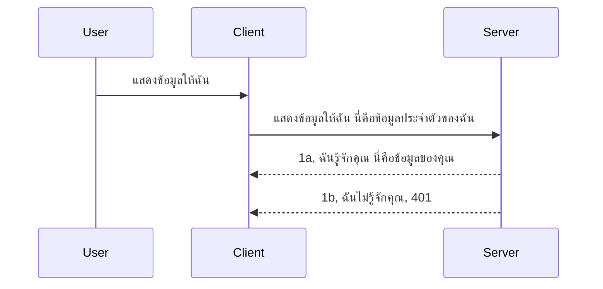

# การยืนยันตัวตนแบบง่าย

MCP SDKs รองรับการใช้ OAuth 2.1 ซึ่งถ้าจะให้ยุติธรรม มันเป็นกระบวนการที่ค่อนข้างซับซ้อนที่เกี่ยวข้องกับแนวคิดต่าง ๆ เช่น เซิร์ฟเวอร์การยืนยันตัวตน เซิร์ฟเวอร์ทรัพยากร การส่งข้อมูลประจำตัว การรับรหัส การแลกรหัสเพื่อรับโทเค็นผู้ถือจนถึงที่คุณสามารถรับข้อมูลทรัพยากรของคุณได้ในที่สุด หากคุณไม่คุ้นเคยกับ OAuth ซึ่งเป็นสิ่งที่ดีมากที่จะนำไปใช้งาน มันเป็นความคิดที่ดีที่จะเริ่มจากการยืนยันตัวตนในระดับพื้นฐานและพัฒนาขึ้นไปให้มีความปลอดภัยมากขึ้น นั่นคือเหตุผลที่บทนี้มีอยู่ เพื่อส่งเสริมคุณไปสู่การยืนยันตัวตนที่ซับซ้อนกว่า

## การยืนยันตัวตน หมายถึงอะไร?

การยืนยันตัวตน เป็นคำย่อของการตรวจสอบและการอนุญาต ความคิดคือเราจำเป็นต้องทำสองสิ่ง:

- **การตรวจสอบตัวตน** ซึ่งเป็นกระบวนการในการตรวจสอบว่าจะแจ้งให้บุคคลเข้ามาในบ้านของเราได้หรือไม่ ว่าพวกเขามีสิทธิที่จะ "อยู่ที่นี่" คือมีการเข้าถึงเซิร์ฟเวอร์ทรัพยากรของเราที่ฟีเจอร์ MCP Server ของเราอยู่นั้นได้
- **การอนุญาต** เป็นกระบวนการในการตรวจสอบว่าผู้ใช้ควรได้รับสิทธิในการเข้าถึงทรัพยากรเฉพาะที่พวกเขาขอ เช่น คำสั่งซื้อเหล่านี้หรือสินค้านี้ หรือว่าพวกเขาได้รับอนุญาตให้อ่านเนื้อหาแต่ไม่สามารถลบได้เป็นตัวอย่างอื่น

## ข้อมูลประจำตัว: วิธีที่เราบอกระบบว่าเราเป็นใคร

โดยปกติ นักพัฒนาเว็บส่วนใหญ่มักจะคิดในแง่ของการให้ข้อมูลประจำตัวแก่เซิร์ฟเวอร์ โดยปกติคือความลับที่บอกว่าพวกเขาได้รับสิทธิที่จะอยู่ที่นี่ "การยืนยันตัวตน" ข้อมูลประจำตัวนี้โดยมากคือรหัสผู้ใช้และรหัสผ่านในรูปแบบเข้ารหัส base64 หรือกุญแจ API (API key) ที่เป็นเอกลักษณ์ซึ่งระบุผู้ใช้เฉพาะ

สิ่งนี้รวมถึงการส่งมันผ่านส่วนหัวที่เรียกว่า "Authorization" เช่นนี้:

```json
{ "Authorization": "secret123" }
```

สิ่งนี้มักถูกเรียกว่าการยืนยันตัวตนแบบพื้นฐาน วิธีการทำงานโดยรวมจะเป็นตามลำดับดังนี้:


```mermaid
sequenceDiagram
   participant User
   participant Client
   participant Server

   User->>Client: แสดงข้อมูลให้ฉัน
   Client->>Server: แสดงข้อมูลให้ฉัน นี่คือข้อมูลประจำตัวของฉัน
   Server-->>Client: 1a, ฉันรู้จักคุณ นี่คือข้อมูลของคุณ
   Server-->>Client: 1b, ฉันไม่รู้จักคุณ, 401 
```

ตอนนี้ที่เราเข้าใจวิธีการทำงานในเชิงลำดับขั้นตอนแล้ว เราจะนำไปใช้อย่างไร? โดยปกติเซิร์ฟเวอร์เว็บส่วนใหญ่มีแนวคิดที่เรียกว่า middleware ซึ่งเป็นส่วนของโค้ดที่ทำงานในส่วนของคำขอที่สามารถตรวจสอบข้อมูลประจำตัวได้ และถ้าข้อมูลประจำตัวนั้นถูกต้อง สามารถให้คำขอผ่านไปได้ ถ้าคำขอไม่มีข้อมูลประจำตัวที่ถูกต้อง คุณก็จะได้รับข้อผิดพลาดเกี่ยวกับการยืนยันตัวตน มาดูวิธีการนำไปใช้กัน:

**Python**

```python
class AuthMiddleware(BaseHTTPMiddleware):
    async def dispatch(self, request, call_next):

        has_header = request.headers.get("Authorization")
        if not has_header:
            print("-> Missing Authorization header!")
            return Response(status_code=401, content="Unauthorized")

        if not valid_token(has_header):
            print("-> Invalid token!")
            return Response(status_code=403, content="Forbidden")

        print("Valid token, proceeding...")
       
        response = await call_next(request)
        # เพิ่มส่วนหัวลูกค้าใด ๆ หรือเปลี่ยนแปลงในการตอบกลับในทางใดทางหนึ่ง
        return response


starlette_app.add_middleware(CustomHeaderMiddleware)
```

ที่นี่เรามี:

- สร้าง middleware ที่ชื่อ `AuthMiddleware` โดยฟังก์ชัน `dispatch` ของมันจะถูกเรียกโดยเซิร์ฟเวอร์เว็บ
- เพิ่ม middleware เข้ากับเซิร์ฟเวอร์เว็บ:

    ```python
    starlette_app.add_middleware(AuthMiddleware)
    ```

- เขียนตรรกะการตรวจสอบที่เช็คว่ามีส่วนหัว Authorization หรือไม่ และถ้าความลับที่ส่งมานั้นถูกต้อง:

    ```python
    has_header = request.headers.get("Authorization")
    if not has_header:
        print("-> Missing Authorization header!")
        return Response(status_code=401, content="Unauthorized")

    if not valid_token(has_header):
        print("-> Invalid token!")
        return Response(status_code=403, content="Forbidden")
    ```

    ถ้าความลับนั้นมีและถูกต้อง เราจะให้คำขอผ่านไปโดยเรียก `call_next` และคืนค่าตอบกลับ

    ```python
    response = await call_next(request)
    # เพิ่มหัวข้อของลูกค้าหรือเปลี่ยนแปลงบางอย่างในคำตอบ
    return response
    ```

วิธีการทำงานคือ เมื่อมีคำขอเว็บมายังเซิร์ฟเวอร์ middleware จะถูกเรียกและตามการทำงานของมัน มันจะให้คำขอผ่านไปหรือส่งกลับข้อผิดพลาดที่แสดงว่าลูกค้าไม่ได้รับอนุญาตให้ดำเนินการต่อ

**TypeScript**

ที่นี่เราสร้าง middleware ด้วยเฟรมเวิร์กยอดนิยม Express และดักคำขอก่อนที่จะถึง MCP Server นี่คือโค้ดสำหรับสิ่งนั้น:

```typescript
function isValid(secret) {
    return secret === "secret123";
}

app.use((req, res, next) => {
    // 1. หัวข้อ Authorization มีอยู่หรือไม่?
    if(!req.headers["Authorization"]) {
        res.status(401).send('Unauthorized');
    }
    
    let token = req.headers["Authorization"];

    // 2. ตรวจสอบความถูกต้อง
    if(!isValid(token)) {
        res.status(403).send('Forbidden');
    }

   
    console.log('Middleware executed');
    // 3. ส่งคำขอต่อไปยังขั้นตอนถัดไปในกระบวนการคำขอ
    next();
});
```

ในโค้ดนี้เรา:

1. ตรวจสอบว่ามีส่วนหัว Authorization หรือไม่ ถ้าไม่มีก็ส่งข้อผิดพลาด 401
2. ตรวจสอบว่าข้อมูลประจำตัว/โทเค็นนั้นถูกต้องหรือไม่ ถ้าไม่ถูกก็ส่งข้อผิดพลาด 403
3. สุดท้าย ให้ผ่านคำขอไปใน pipeline ของคำขอและคืนค่าทรัพยากรที่ถูกถามหา

## แบบฝึกหัด: การใช้งานการยืนยันตัวตน

มาทดลองนำความรู้ของเรามาลองใช้งานกัน นี่คือแผน:

เซิร์ฟเวอร์

- สร้างเว็บเซิร์ฟเวอร์และอินสแตนซ์ MCP
- นำ middleware ไปใช้งานในเซิร์ฟเวอร์

ลูกค้า

- ส่งคำขอเว็บพร้อมกับข้อมูลประจำตัวในส่วนหัว

### -1- สร้างเว็บเซิร์ฟเวอร์และอินสแตนซ์ MCP

> [!WARNING]
> ตัวอย่าง TypeScript ด้านล่างนี้ใช้กับ MCP `2025-11-25` โดยติดตามการขนส่ง
> ด้วย `mcp-session-id` และไม่ใช่ตัวอย่างการขนส่งของ `2026-07-28` ปัจจุบัน MCP
> `2026-07-28` เอาการเชื่อมต่อแบบ `initialize` และ protocol session ID ออก; การใช้งานใหม่
> จะใช้คำขอที่รวมทุกอย่างในตัว ดูได้ที่
> [มีอะไรเปลี่ยนแปลงใน MCP: สเปค 2026-07-28](../../01-CoreConcepts/mcp-2026-07-28.md).

ในขั้นตอนแรก เราจำเป็นต้องสร้างอินสแตนซ์เว็บเซิร์ฟเวอร์และ MCP Server

**Python**

ที่นี่เราสร้างอินสแตนซ์ MCP Server สร้างแอป starlette สำหรับเว็บ และโฮสต์ด้วย uvicorn

```python
# สร้างเซิร์ฟเวอร์ MCP

app = FastMCP(
    name="MCP Resource Server",
    instructions="Resource Server that validates tokens via Authorization Server introspection",
    host=settings["host"],
    port=settings["port"],
    debug=True
)

# สร้างเว็บแอป starlette
starlette_app = app.streamable_http_app()

# ให้บริการแอปผ่าน uvicorn
async def run(starlette_app):
    import uvicorn
    config = uvicorn.Config(
            starlette_app,
            host=app.settings.host,
            port=app.settings.port,
            log_level=app.settings.log_level.lower(),
        )
    server = uvicorn.Server(config)
    await server.serve()

run(starlette_app)
```

ในโค้ดนี้เรา:

- สร้าง MCP Server
- สร้างแอปเว็บ starlette จาก MCP Server ด้วย `app.streamable_http_app()`
- โฮสต์และให้บริการแอปเว็บโดยใช้ uvicorn ด้วย `server.serve()`

**TypeScript**

ที่นี่เราสร้างอินสแตนซ์ MCP Server

```typescript
const server = new McpServer({
      name: "example-server",
      version: "1.0.0"
    });

    // ... ตั้งค่าทรัพยากรเซิร์ฟเวอร์, เครื่องมือ, และพรอมต์ ...
```

การสร้าง MCP Server นี้จะต้องเกิดขึ้นภายในฟังก์ชัน route POST /mcp ดังนั้นเรามาดูโค้ดข้างต้นแล้วย้ายมาแบบนี้:

```typescript
import express from "express";
import { randomUUID } from "node:crypto";
import { McpServer } from "@modelcontextprotocol/sdk/server/mcp.js";
import { StreamableHTTPServerTransport } from "@modelcontextprotocol/sdk/server/streamableHttp.js";
import { isInitializeRequest } from "@modelcontextprotocol/sdk/types.js"

const app = express();
app.use(express.json());

// แผนที่เพื่อเก็บการขนส่งตาม ID เซสชัน
const transports: { [sessionId: string]: StreamableHTTPServerTransport } = {};

// จัดการคำขอ POST สำหรับการสื่อสารระหว่างไคลเอนต์ถึงเซิร์ฟเวอร์
app.post('/mcp', async (req, res) => {
  // ตรวจสอบ ID เซสชันที่มีอยู่
  const sessionId = req.headers['mcp-session-id'] as string | undefined;
  let transport: StreamableHTTPServerTransport;

  if (sessionId && transports[sessionId]) {
    // ใช้การขนส่งที่มีอยู่ซ้ำ
    transport = transports[sessionId];
  } else if (!sessionId && isInitializeRequest(req.body)) {
    // คำขอเริ่มต้นใหม่
    transport = new StreamableHTTPServerTransport({
      sessionIdGenerator: () => randomUUID(),
      onsessioninitialized: (sessionId) => {
        // เก็บการขนส่งตาม ID เซสชัน
        transports[sessionId] = transport;
      },
      // การป้องกัน DNS rebinding ถูกปิดใช้งานโดยค่าเริ่มต้นเพื่อความเข้ากันได้ย้อนหลัง หากคุณกำลังเรียกใช้เซิร์ฟเวอร์นี้
      // ในเครื่อง โปรดตรวจสอบให้แน่ใจว่าได้ตั้งค่า:
      // enableDnsRebindingProtection: true,
      // allowedHosts: ['127.0.0.1'],
    });

    // ทำความสะอาดการขนส่งเมื่อถูกปิด
    transport.onclose = () => {
      if (transport.sessionId) {
        delete transports[transport.sessionId];
      }
    };
    const server = new McpServer({
      name: "example-server",
      version: "1.0.0"
    });

    // ... ตั้งค่าทรัพยากรของเซิร์ฟเวอร์ เครื่องมือ และพรอมต์ ...

    // เชื่อมต่อกับเซิร์ฟเวอร์ MCP
    await server.connect(transport);
  } else {
    // คำขอไม่ถูกต้อง
    res.status(400).json({
      jsonrpc: '2.0',
      error: {
        code: -32000,
        message: 'Bad Request: No valid session ID provided',
      },
      id: null,
    });
    return;
  }

  // จัดการคำขอ
  await transport.handleRequest(req, res, req.body);
});

// ตัวจัดการที่สามารถใช้ซ้ำสำหรับคำขอ GET และ DELETE
const handleSessionRequest = async (req: express.Request, res: express.Response) => {
  const sessionId = req.headers['mcp-session-id'] as string | undefined;
  if (!sessionId || !transports[sessionId]) {
    res.status(400).send('Invalid or missing session ID');
    return;
  }
  
  const transport = transports[sessionId];
  await transport.handleRequest(req, res);
};

// จัดการคำขอ GET สำหรับการแจ้งเตือนจากเซิร์ฟเวอร์ถึงไคลเอนต์ผ่าน SSE
app.get('/mcp', handleSessionRequest);

// จัดการคำขอ DELETE สำหรับการยุติการเซสชัน
app.delete('/mcp', handleSessionRequest);

app.listen(3000);
```

ตอนนี้คุณจะเห็นว่าการสร้าง MCP Server ถูกย้ายเข้าไปใน `app.post("/mcp")` แล้ว

ต่อไปมาดูขั้นตอนต่อไป คือ การสร้าง middleware เพื่อให้เราสามารถตรวจสอบข้อมูลประจำตัวที่เข้ามาได้

### -2- นำ middleware ไปใช้งานในเซิร์ฟเวอร์

ต่อไปมาทำในส่วนของ middleware กัน ที่นี่เราจะสร้าง middleware เพื่อค้นหาข้อมูลประจำตัวในส่วนหัว `Authorization` และตรวจสอบว่าถูกต้องหรือไม่ ถ้าถูกต้อง คำขอจะถูกส่งไปทำงานในสิ่งที่จำเป็น (เช่น แสดงรายการเครื่องมือ อ่านทรัพยากร หรือฟีเจอร์ MCP ใด ๆ ที่ลูกค้าขอมา)

**Python**

ในการสร้าง middleware เราต้องสร้างคลาสที่สืบทอดจาก `BaseHTTPMiddleware` มีสองส่วนที่น่าสนใจ:

- คำขอ `request` ที่เราจะอ่านข้อมูลส่วนหัวจากมัน
- `call_next` คือ callback ที่เราต้องเรียกถ้าลูกค้านำข้อมูลประจำตัวที่เรายอมรับมา

ก่อนอื่น เราต้องจัดการกับกรณีที่ส่วนหัว `Authorization` หายไป:

```python
has_header = request.headers.get("Authorization")

# ไม่มีหัวเรื่อง ปฏิเสธด้วยรหัส 401 หากไม่ใช่ให้ดำเนินการต่อไป.
if not has_header:
    print("-> Missing Authorization header!")
    return Response(status_code=401, content="Unauthorized")
```

ที่นี่เราส่งข้อความ 401 unauthorized เพราะลูกค้าล้มเหลวในการยืนยันตัวตน

ถัดไป ถ้ามีการส่งข้อมูลประจำตัว เราต้องเช็คความถูกต้องดังนี้:

```python
 if not valid_token(has_header):
    print("-> Invalid token!")
    return Response(status_code=403, content="Forbidden")
```

สังเกตว่าที่นี่เราส่งข้อความ 403 forbidden ดู middleware ฉบับเต็มด้านล่างที่รวมทุกอย่างที่กล่าวมา:

```python
class AuthMiddleware(BaseHTTPMiddleware):
    async def dispatch(self, request, call_next):

        has_header = request.headers.get("Authorization")
        if not has_header:
            print("-> Missing Authorization header!")
            return Response(status_code=401, content="Unauthorized")

        if not valid_token(has_header):
            print("-> Invalid token!")
            return Response(status_code=403, content="Forbidden")

        print("Valid token, proceeding...")
        print(f"-> Received {request.method} {request.url}")
        response = await call_next(request)
        response.headers['Custom'] = 'Example'
        return response

```

ดีแล้ว แต่ว่า `valid_token` ฟังก์ชันล่ะ? นี่คือตัวอย่าง:

```python
# อย่าใช้สำหรับการผลิต - ปรับปรุงมัน !!
def valid_token(token: str) -> bool:
    # ลบคำนำหน้า "Bearer "
    if token.startswith("Bearer "):
        token = token[7:]
        return token == "secret-token"
    return False
```

สิ่งนี้ควรได้รับการพัฒนาให้ดีขึ้น

สำคัญ: คุณไม่ควรเก็บข้อมูลลับแบบนี้ไว้ในโค้ด คุณควรจะดึงค่าที่ใช้เปรียบเทียบมาจากแหล่งข้อมูลหรือผู้ให้บริการตัวตน (IDP) หรือถ้าเป็นไปได้ ให้ IDP ดูแลการตรวจสอบแทน

**TypeScript**

ในการใช้งานกับ Express เราต้องเรียกใช้เมธอด `use` ที่รับฟังก์ชัน middleware

เราต้อง:

- ตอบสนองกับตัวแปรคำขอเพื่อเช็คข้อมูลประจำตัวที่ส่งผ่านในคุณสมบัติ `Authorization`
- ตรวจสอบความถูกต้องของข้อมูลประจำตัว และถ้าถูกต้อง ให้คำขอดำเนินต่อและตอบสนอง MCP ที่ลูกค้าเรียกใช้งาน (เช่น แสดงรายการเครื่องมือ อ่านทรัพยากร หรือสิ่งอื่นที่เกี่ยวข้องกับ MCP)

ที่นี่ เราเช็คว่ามีส่วนหัว `Authorization` หรือไม่ ถ้าไม่มี เราจะหยุดคำขอไม่ให้ผ่าน:

```typescript
if(!req.headers["authorization"]) {
    res.status(401).send('Unauthorized');
    return;
}
```

หากส่วนหัวไม่ถูกส่งมาเลย คุณจะได้รับข้อผิดพลาด 401

ต่อไป เราเช็คว่าข้อมูลประจำตัวถูกต้องหรือไม่ หากไม่ถูกต้องเราก็หยุดคำขออีกครั้ง แต่แสดงข้อความแตกต่างกันเล็กน้อย:

```typescript
if(!isValid(token)) {
    res.status(403).send('Forbidden');
    return;
} 
```

สังเกตว่าเดี๋ยวนี้คุณจะได้รับข้อผิดพลาด 403

นี่คือโค้ดเต็ม:

```typescript
app.use((req, res, next) => {
    console.log('Request received:', req.method, req.url, req.headers);
    console.log('Headers:', req.headers["authorization"]);
    if(!req.headers["authorization"]) {
        res.status(401).send('Unauthorized');
        return;
    }
    
    let token = req.headers["authorization"];

    if(!isValid(token)) {
        res.status(403).send('Forbidden');
        return;
    }  

    console.log('Middleware executed');
    next();
});
```

เราได้ตั้งค่าเว็บเซิร์ฟเวอร์ให้รับ middleware เพื่อตรวจสอบข้อมูลประจำตัวที่คาดว่าลูกค้าจะส่งมา แล้วลูกค้าเองล่ะ?

### -3- ส่งคำขอเว็บพร้อมข้อมูลประจำตัวผ่านส่วนหัว

เราต้องมั่นใจว่าลูกค้าส่งข้อมูลประจำตัวผ่านส่วนหัว เพราะเราจะใช้ไคลเอนต์ MCP ทำเช่นนั้น เราต้องหาวิธีทำ

**Python**

สำหรับไคลเอนต์ เราต้องส่งส่วนหัวพร้อมข้อมูลประจำตัวแบบนี้:

```python
# อย่าเขียนค่าคงที่โดยตรง ควรเก็บไว้อย่างน้อยในตัวแปรแวดล้อมหรือที่เก็บข้อมูลที่ปลอดภัยมากขึ้น
token = "secret-token"

async with streamablehttp_client(
        url = f"http://localhost:{port}/mcp",
        headers = {"Authorization": f"Bearer {token}"}
    ) as (
        read_stream,
        write_stream,
        session_callback,
    ):
        async with ClientSession(
            read_stream,
            write_stream
        ) as session:
            await session.initialize()
      
            # TODO สิ่งที่คุณต้องการให้ทำในไคลเอนต์ เช่น แสดงรายการเครื่องมือ เรียกใช้เครื่องมือ เป็นต้น
```

สังเกตว่าเราใส่ข้อมูลในคุณสมบัติ `headers` แบบนี้ ` headers = {"Authorization": f"Bearer {token}"}`.

**TypeScript**

เราสามารถทำได้สองขั้นตอน:

1. เตรียมอ็อบเจ็กต์ configuration ที่ใส่ข้อมูลประจำตัว
2. ส่งอ็อบเจ็กต์ configuration ไปที่ transport

```typescript

// อย่ากำหนดค่าคงที่เช่นนี้โดยตรงอย่างแข็งขัน อย่างน้อยให้ใช้เป็นตัวแปรสภาพแวดล้อมและใช้บางอย่างเช่น dotenv (ในโหมดพัฒนา)
let token = "secret123"

// กำหนดอ็อบเจ็กต์ตัวเลือกการขนส่งของไคลเอนต์
let options: StreamableHTTPClientTransportOptions = {
  sessionId: sessionId,
  requestInit: {
    headers: {
      "Authorization": "secret123"
    }
  }
};

// ส่งอ็อบเจ็กต์ตัวเลือกไปยังการขนส่ง
async function main() {
   const transport = new StreamableHTTPClientTransport(
      new URL(serverUrl),
      options
   );
```

ที่นี่คุณจะเห็นว่าเราต้องสร้างอ็อบเจ็กต์ `options` และใส่ส่วนหัวไว้ในคุณสมบัติ `requestInit`

สำคัญ: แล้วเราจะพัฒนามันให้ดีขึ้นได้อย่างไร? วิธีการปัจจุบันมีข้อเสีย คือ การส่งข้อมูลประจำตัวลักษณะนี้มีความเสี่ยง เว้นแต่ว่าคุณจะมี HTTPS อย่างน้อยที่สุด แม้จะมี HTTPS ข้อมูลประจำตัวยังสามารถถูกขโมยได้ ดังนั้นคุณต้องมีระบบที่ง่ายในการเพิกถอนโทเค็น และเพิ่มการตรวจสอบเพิ่มเติม เช่น มาจากที่ใดในโลกนี้ คำขอเกิดขึ้นบ่อยเกินไปหรือไม่ (พฤติกรรมบ็อต) โดยสรุปมีข้อกังวลหลายอย่าง

อย่างไรก็ตาม สำหรับ API ง่าย ๆ ที่คุณไม่ต้องการให้ใครเรียกใช้ API ของคุณโดยไม่มีการยืนยันตัวตน และสิ่งที่เรามีที่นี่ถือเป็นจุดเริ่มต้นที่ดี

ด้วยเหตุนี้ เราลองเพิ่มความปลอดภัยเล็กน้อยโดยใช้รูปแบบมาตรฐานเช่น JSON Web Token หรือที่เรียกกันว่า JWT หรือโทเค็น "JOT"

## JSON Web Tokens, JWT

ดังนั้น เรากำลังพัฒนาให้ดีขึ้นจากการส่งข้อมูลประจำตัวแบบง่ายมาก การปรับใช้ JWT จะได้อะไรที่ดีขึ้นทันที?

- **การปรับปรุงความปลอดภัย** ในการยืนยันตัวตนแบบพื้นฐาน คุณส่งชื่อผู้ใช้และรหัสผ่านในรูปแบบ base64 encoded (หรือส่ง API key) ซ้ำ ๆ ซึ่งเพิ่มความเสี่ยง ด้วย JWT คุณส่งชื่อผู้ใช้และรหัสผ่านแล้วรับโทเค็นกลับ และโทเค็นนี้มีการหมดอายุ JWT ช่วยให้คุณใช้การควบคุมการเข้าถึงอย่างละเอียดด้วยบทบาท ขอบเขต และสิทธิ์
- **การไม่มีสถานะและการปรับขนาดได้** JWT เป็นแบบรวมทุกอย่างในตัว มันบรรจุข้อมูลผู้ใช้ทั้งหมดและไม่จำเป็นต้องเก็บเซสชันบนเซิร์ฟเวอร์ โทเค็นสามารถตรวจสอบความถูกต้องได้ในเครื่อง
- **ความสามารถในการทำงานร่วมกันและการรวมตัว** JWT คือศูนย์กลางของ Open ID Connect และใช้กับผู้ให้บริการตัวตนที่รู้จัก เช่น Entra ID, Google Identity และ Auth0 นอกจากนี้ยังทำให้สามารถใช้ single sign on และอื่น ๆ อีกมากมาย ทำให้เหมาะสำหรับองค์กร
- **โมดูลและความยืดหยุ่น** JWT สามารถใช้กับ API Gateway เช่น Azure API Management, NGINX และอื่น ๆ ไว้ รองรับการใช้งานยืนยันตัวตนและการสื่อสารระหว่างเซิร์ฟเวอร์รวมถึงกรณีการแสดงตัวแทนและการมอบหมายหน้าที่
- **ประสิทธิภาพและการแคช** JWT สามารถแคชหลังถอดรหัสเพื่อลดความจำเป็นในการแยกวิเคราะห์ ซึ่งมีประโยชน์มากกับแอปที่มีการใช้งานมาก เพราะช่วยเพิ่มอัตราการประมวลผลและลดภาระโครงสร้างพื้นฐานที่เลือกใช้
- **ฟีเจอร์ขั้นสูง** รองรับ introspection (ตรวจสอบความถูกต้องบนเซิร์ฟเวอร์) และ revocation (ทำให้โทเค็นไม่ถูกต้อง)

ด้วยประโยชน์เหล่านี้ ลองดูวิธีพัฒนาโค้ดเราไปสู่ระดับถัดไปกัน

## แปลงการยืนยันตัวตนแบบพื้นฐานเป็น JWT

ดังนั้น การเปลี่ยนแปลงที่เราต้องทำในระดับสูงคือ:

- **เรียนรู้การสร้างโทเค็น JWT** และเตรียมให้พร้อมส่งจากไคลเอนต์ไปยังเซิร์ฟเวอร์
- **ตรวจสอบโทเค็น JWT** และถ้าถูกต้อง ให้ลูกค้าเข้าถึงทรัพยากรของเรา
- **การจัดเก็บโทเค็นอย่างปลอดภัย** วิธีการจัดเก็บโทเค็นนี้
- **ป้องกันเส้นทาง** เราต้องป้องกันเส้นทาง ในกรณีนี้ เราต้องป้องกันเส้นทางและฟีเจอร์ MCP ที่เฉพาะเจาะจง
- **เพิ่มโทเค็นรีเฟรช** สร้างโทเค็นที่มีอายุสั้นแต่มีโทเค็นรีเฟรชที่มีอายุยาว ซึ่งสามารถใช้เพื่อรับโทเค็นใหม่เมื่อโทเค็นเดิมหมดอายุ รวมถึงต้องมี endpoint สำหรับรีเฟรชและกลยุทธ์การสลับโทเค็น

### -1- สร้างโทเค็น JWT

ก่อนอื่น โทเค็น JWT มีส่วนประกอบดังนี้:

- **header** อัลกอริทึมที่ใช้และชนิดโทเค็น
- **payload** ข้อความอ้างสิทธิ์ (claims) เช่น sub (ผู้ใช้หรือเอนทิตีที่โทเค็นแทน ในสถานการณ์การยืนยันตัวตน มักเป็น userid), exp (เวลาหมดอายุ) role (บทบาท)
- **signature** ลายเซ็นต์ที่ลงนามด้วยความลับหรือกุญแจส่วนตัว

สำหรับสิ่งนี้ เราจำเป็นต้องสร้าง header, payload และโทเค็นที่เข้ารหัส

**Python**

```python

import jwt
import jwt
from jwt.exceptions import ExpiredSignatureError, InvalidTokenError
import datetime

# กุญแจลับที่ใช้เซ็น JWT
secret_key = 'your-secret-key'

header = {
    "alg": "HS256",
    "typ": "JWT"
}

# ข้อมูลผู้ใช้และสิทธิ์ของผู้ใช้รวมถึงเวลาหมดอายุ
payload = {
    "sub": "1234567890",               # หัวข้อ (รหัสผู้ใช้)
    "name": "User Userson",                # สิทธิ์ที่กำหนดเอง
    "admin": True,                     # สิทธิ์ที่กำหนดเอง
    "iat": datetime.datetime.utcnow(),# ออกเมื่อ
    "exp": datetime.datetime.utcnow() + datetime.timedelta(hours=1)  # หมดอายุ
}

# เข้ารหัสมัน
encoded_jwt = jwt.encode(payload, secret_key, algorithm="HS256", headers=header)
```

ในโค้ดข้างบนเราได้:

- กำหนด header โดยใช้ HS256 เป็นอัลกอริทึมและ type เป็น JWT
- สร้าง payload ที่มี subject หรือ user id ชื่อผู้ใช้ บทบาท เวลาที่ออก และเวลาที่หมดอายุ โดยนำเวลาที่กำหนดไว้มาใช้เป็นข้อจำกัดเวลา

**TypeScript**

ที่นี่เราจะใช้ dependencies บางตัวที่จะช่วยสร้างโทเค็น JWT

Dependencies

```sh

npm install jsonwebtoken
npm install --save-dev @types/jsonwebtoken
```

ตอนนี้ที่เรามีสิ่งเหล่านั้นแล้ว ลองสร้าง header, payload และโทเค็นที่เข้ารหัสกัน

```typescript
import jwt from 'jsonwebtoken';

const secretKey = 'your-secret-key'; // ใช้ตัวแปรสภาพแวดล้อมในโหมดโปรดักชัน

// กำหนด payload
const payload = {
  sub: '1234567890',
  name: 'User usersson',
  admin: true,
  iat: Math.floor(Date.now() / 1000), // ออกเมื่อ
  exp: Math.floor(Date.now() / 1000) + 60 * 60 // หมดอายุใน 1 ชั่วโมง
};

// กำหนด header (ไม่บังคับ, jsonwebtoken จะตั้งค่าเริ่มต้นให้)
const header = {
  alg: 'HS256',
  typ: 'JWT'
};

// สร้าง token
const token = jwt.sign(payload, secretKey, {
  algorithm: 'HS256',
  header: header
});

console.log('JWT:', token);
```

โทเค็นนี้:

ลงนามโดยใช้ HS256
มีอายุใช้งาน 1 ชั่วโมง
รวม claims เช่น sub, name, admin, iat, และ exp

### -2- ตรวจสอบโทเค็น

เรายังต้องตรวจสอบโทเค็นอีกด้วย ซึ่งควรทำบนเซิร์ฟเวอร์เพื่อให้แน่ใจว่าโทเค็นที่ลูกค้าส่งมานั้นถูกต้อง มีหลายอย่างที่ควรตรวจสอบตั้งแต่โครงสร้างจนถึงความถูกต้อง และแนะนำให้เพิ่มการตรวจสอบอื่น ๆ เช่น ดูว่าผู้ใช้อยู่ในระบบของคุณหรือไม่

ในการตรวจสอบโทเค็น เราต้องถอดรหัสเพื่ออ่านและเริ่มตรวจสอบความถูกต้อง:

**Python**

```python

# ถอดรหัสและตรวจสอบ JWT
try:
    decoded = jwt.decode(token, secret_key, algorithms=["HS256"])
    print("✅ Token is valid.")
    print("Decoded claims:")
    for key, value in decoded.items():
        print(f"  {key}: {value}")
except ExpiredSignatureError:
    print("❌ Token has expired.")
except InvalidTokenError as e:
    print(f"❌ Invalid token: {e}")

```


ในโค้ดนี้ เราเรียกใช้ `jwt.decode` โดยใช้โทเค็น กุญแจลับ และอัลกอริทึมที่เลือกเป็นอินพุต สังเกตว่าเราใช้โครงสร้าง try-catch เพราะการตรวจสอบล้มเหลวจะทำให้เกิดข้อผิดพลาด

**TypeScript**

ที่นี่เราต้องเรียก `jwt.verify` เพื่อรับเวอร์ชันที่ถอดรหัสของโทเค็นที่เราสามารถวิเคราะห์เพิ่มเติมได้ หากการเรียกนี้ล้มเหลว หมายความว่าโครงสร้างของโทเค็นไม่ถูกต้องหรือไม่สามารถใช้งานได้อีกต่อไป

```typescript

try {
  const decoded = jwt.verify(token, secretKey);
  console.log('Decoded Payload:', decoded);
} catch (err) {
  console.error('Token verification failed:', err);
}
```

หมายเหตุ: ตามที่กล่าวไว้ก่อนหน้านี้ เราควรทำการตรวจสอบเพิ่มเติมเพื่อให้แน่ใจว่าโทเค็นนี้ชี้ไปยังผู้ใช้ในระบบของเราและตรวจสอบให้แน่ใจว่าผู้ใช้มีสิทธิ์ตามที่อ้าง

ต่อไป มาดูการควบคุมการเข้าถึงตามบทบาท หรือที่รู้จักในชื่อ RBAC

## เพิ่มการควบคุมการเข้าถึงตามบทบาท

แนวคิดคือเราอยากจะแสดงว่าบทบาทที่แตกต่างกันมีสิทธิ์ที่แตกต่างกัน ตัวอย่างเช่น เราสมมติว่าแอดมินสามารถทำได้ทุกอย่าง ผู้ใช้ปกติสามารถอ่าน/เขียนได้ และผู้เยี่ยมชมสามารถอ่านได้เท่านั้น ดังนั้น นี่คือระดับสิทธิ์บางอย่างที่เป็นไปได้:

- Admin.Write 
- User.Read
- Guest.Read

มาดูวิธีที่เราสามารถใช้งานการควบคุมแบบนี้ด้วยมิดเดิลแวร์ มิดเดิลแวร์สามารถเพิ่มได้ต่อเส้นทางรวมถึงสำหรับเส้นทางทั้งหมด

**Python**

```python
from starlette.middleware.base import BaseHTTPMiddleware
from starlette.responses import JSONResponse
import jwt

# อย่าเก็บความลับไว้ในโค้ดเช่นนี้ นี่เป็นเพียงตัวอย่างการสาธิตเท่านั้น ควรอ่านจากที่ปลอดภัย
SECRET_KEY = "your-secret-key" # ใส่สิ่งนี้ในตัวแปรสภาพแวดล้อม
REQUIRED_PERMISSION = "User.Read"

class JWTPermissionMiddleware(BaseHTTPMiddleware):
    async def dispatch(self, request, call_next):
        auth_header = request.headers.get("Authorization")
        if not auth_header or not auth_header.startswith("Bearer "):
            return JSONResponse({"error": "Missing or invalid Authorization header"}, status_code=401)

        token = auth_header.split(" ")[1]
        try:
            decoded = jwt.decode(token, SECRET_KEY, algorithms=["HS256"])
        except jwt.ExpiredSignatureError:
            return JSONResponse({"error": "Token expired"}, status_code=401)
        except jwt.InvalidTokenError:
            return JSONResponse({"error": "Invalid token"}, status_code=401)

        permissions = decoded.get("permissions", [])
        if REQUIRED_PERMISSION not in permissions:
            return JSONResponse({"error": "Permission denied"}, status_code=403)

        request.state.user = decoded
        return await call_next(request)


```

มีหลายวิธีในการเพิ่มมิดเดิลแวร์ เช่น ด้านล่างนี้:

```python

# ตัวเลือก 1: เพิ่ม middleware ขณะสร้างแอป starlette
middleware = [
    Middleware(JWTPermissionMiddleware)
]

app = Starlette(routes=routes, middleware=middleware)

# ตัวเลือก 2: เพิ่ม middleware หลังจากที่สร้างแอป starlette เสร็จแล้ว
starlette_app.add_middleware(JWTPermissionMiddleware)

# ตัวเลือก 3: เพิ่ม middleware ต่อเส้นทาง
routes = [
    Route(
        "/mcp",
        endpoint=..., # ตัวจัดการ
        middleware=[Middleware(JWTPermissionMiddleware)]
    )
]
```

**TypeScript**

เราสามารถใช้ `app.use` และมิดเดิลแวร์ที่จะทำงานสำหรับคำขอทั้งหมด

```typescript
app.use((req, res, next) => {
    console.log('Request received:', req.method, req.url, req.headers);
    console.log('Headers:', req.headers["authorization"]);

    // 1. ตรวจสอบว่ามีการส่งส่วนหัวการอนุญาตแล้วหรือไม่

    if(!req.headers["authorization"]) {
        res.status(401).send('Unauthorized');
        return;
    }
    
    let token = req.headers["authorization"];

    // 2. ตรวจสอบว่าโทเค็นถูกต้องหรือไม่
    if(!isValid(token)) {
        res.status(403).send('Forbidden');
        return;
    }  

    // 3. ตรวจสอบว่าผู้ใช้โทเค็นมีอยู่ในระบบของเราหรือไม่
    if(!isExistingUser(token)) {
        res.status(403).send('Forbidden');
        console.log("User does not exist");
        return;
    }
    console.log("User exists");

    // 4. ยืนยันว่าโทเค็นมีสิทธิ์ที่ถูกต้อง
    if(!hasScopes(token, ["User.Read"])){
        res.status(403).send('Forbidden - insufficient scopes');
    }

    console.log("User has required scopes");

    console.log('Middleware executed');
    next();
});

```

มีหลายสิ่งที่เราสามารถให้มิดเดิลแวร์ของเราและที่มิดเดิลแวร์ของเราควรทำ ได้แก่:

1. ตรวจสอบว่ามี authorization header หรือไม่
2. ตรวจสอบว่าโทเค็นถูกต้อง เราเรียก `isValid` ซึ่งเป็นเมธอดที่เราเขียนขึ้นเพื่อตรวจสอบความถูกต้องและความสมบูรณ์ของ JWT token
3. ตรวจสอบว่าผู้ใช้มีอยู่ในระบบของเรา เราควรตรวจสอบสิ่งนี้

   ```typescript
    // ผู้ใช้ในฐานข้อมูล
   const users = [
     "user1",
     "User usersson",
   ]

   function isExistingUser(token) {
     let decodedToken = verifyToken(token);

     // TODO, ตรวจสอบว่าผู้ใช้มีอยู่ในฐานข้อมูลหรือไม่
     return users.includes(decodedToken?.name || "");
   }
   ```

   ข้างต้น เราได้สร้างรายการ `users` ง่ายๆ ซึ่งควรจะอยู่ในฐานข้อมูลอย่างชัดเจน

4. นอกจากนี้ เรายังควรตรวจสอบว่าโทเค็นมีสิทธิ์ที่ถูกต้อง

   ```typescript
   if(!hasScopes(token, ["User.Read"])){
        res.status(403).send('Forbidden - insufficient scopes');
   }
   ```

   ในโค้ดด้านบนจากมิดเดิลแวร์ เราตรวจสอบว่าโทเค็นประกอบด้วยสิทธิ์ User.Read หากไม่มีเราจะส่งข้อผิดพลาด 403 ด้านล่างคือเมธอดช่วยเหลือ `hasScopes`

   ```typescript
   function hasScopes(scope: string, requiredScopes: string[]) {
     let decodedToken = verifyToken(scope);
    return requiredScopes.every(scope => decodedToken?.scopes.includes(scope));
  }
   ```

Have a think which additional checks you should be doing, but these are the absolute minimum of checks you should be doing.

Using Express as a web framework is a common choice. There are helpers library when you use JWT so you can write less code.

- `express-jwt`, helper library that provides a middleware that helps decode your token.
- `express-jwt-permissions`, this provides a middleware `guard` that helps check if a certain permission is on the token.

Here's what these libraries can look like when used:

```typescript
const express = require('express');
const jwt = require('express-jwt');
const guard = require('express-jwt-permissions')();

const app = express();
const secretKey = 'your-secret-key'; // put this in env variable

// Decode JWT and attach to req.user
app.use(jwt({ secret: secretKey, algorithms: ['HS256'] }));

// Check for User.Read permission
app.use(guard.check('User.Read'));

// multiple permissions
// app.use(guard.check(['User.Read', 'Admin.Access']));

app.get('/protected', (req, res) => {
  res.json({ message: `Welcome ${req.user.name}` });
});

// Error handler
app.use((err, req, res, next) => {
  if (err.code === 'permission_denied') {
    return res.status(403).send('Forbidden');
  }
  next(err);
});

```

ตอนนี้คุณได้เห็นว่า มิดเดิลแวร์สามารถใช้สำหรับทั้งการตรวจสอบตัวตนและการอนุญาต แล้วสำหรับ MCP ล่ะ มันเปลี่ยนวิธีการตรวจสอบตัวตนของเราหรือไม่? มาหาคำตอบในส่วนถัดไปกัน

### -3- เพิ่ม RBAC ให้กับ MCP

คุณได้เห็นแล้วว่าคุณสามารถเพิ่ม RBAC ผ่านมิดเดิลแวร์ได้อย่างไร อย่างไรก็ตาม สำหรับ MCP ไม่มีวิธีง่ายๆ ในการเพิ่ม RBAC ต่อฟีเจอร์เฉพาะของ MCP ดังนั้นเราจะทำอย่างไร? เราก็แค่เพิ่มโค้ดแบบนี้ที่ตรวจสอบในกรณีนี้ว่าลูกค้ามีสิทธิ์เรียกใช้เครื่องมือเฉพาะหรือไม่:

คุณมีตัวเลือกหลายวิธีในการทำ RBAC ต่อฟีเจอร์ นี่คือตัวอย่างบางส่วน:

- เพิ่มการตรวจสอบสำหรับแต่ละเครื่องมือ แหล่งข้อมูล หรือพรอมต์ที่คุณต้องตรวจสอบระดับสิทธิ์

   **python**

   ```python
   @tool()
   def delete_product(id: int):
      try:
          check_permissions(role="Admin.Write", request)
      catch:
        pass # ลูกค้าไม่ผ่านการตรวจสอบสิทธิ์, ยกข้อผิดพลาดการตรวจสอบสิทธิ์
   ```

   **typescript**

   ```typescript
   server.registerTool(
    "delete-product",
    {
      title: Delete a product",
      description: "Deletes a product",
      inputSchema: { id: z.number() }
    },
    async ({ id }) => {
      
      try {
        checkPermissions("Admin.Write", request);
        // งานที่ต้องทำ, ส่ง id ไปยัง productService และ remote entry
      } catch(Exception e) {
        console.log("Authorization error, you're not allowed");  
      }

      return {
        content: [{ type: "text", text: `Deletected product with id ${id}` }]
      };
    }
   );
   ```


- ใช้วิธีการเซิร์ฟเวอร์ขั้นสูงและตัวจัดการคำขอเพื่อช่วยลดจำนวนจุดที่คุณต้องตรวจสอบ

   **Python**

   ```python
   
   tool_permission = {
      "create_product": ["User.Write", "Admin.Write"],
      "delete_product": ["Admin.Write"]
   }

   def has_permission(user_permissions, required_permissions) -> bool:
      # user_permissions: รายการสิทธิ์ที่ผู้ใช้มี
      # required_permissions: รายการสิทธิ์ที่จำเป็นสำหรับเครื่องมือ
      return any(perm in user_permissions for perm in required_permissions)

   @server.call_tool()
   async def handle_call_tool(
     name: str, arguments: dict[str, str] | None
   ) -> list[types.TextContent]:
    # สมมติว่า request.user.permissions เป็นรายการสิทธิ์ของผู้ใช้
     user_permissions = request.user.permissions
     required_permissions = tool_permission.get(name, [])
     if not has_permission(user_permissions, required_permissions):
        # แจ้งข้อผิดพลาด "คุณไม่มีสิทธิ์เรียกใช้เครื่องมือ {name}"
        raise Exception(f"You don't have permission to call tool {name}")
     # ดำเนินการต่อและเรียกใช้เครื่องมือ
     # ...
   ```   
   

   **TypeScript**

   ```typescript
   function hasPermission(userPermissions: string[], requiredPermissions: string[]): boolean {
       if (!Array.isArray(userPermissions) || !Array.isArray(requiredPermissions)) return false;
       // ส่งคืนค่าจริงถ้าผู้ใช้มีสิทธิ์ที่ต้องการอย่างน้อยหนึ่งรายการ
       
       return requiredPermissions.some(perm => userPermissions.includes(perm));
   }
  
   server.setRequestHandler(CallToolRequestSchema, async (request) => {
      const { params: { name } } = request;
  
      let permissions = request.user.permissions;
  
      if (!hasPermission(permissions, toolPermissions[name])) {
         return new Error(`You don't have permission to call ${name}`);
      }
  
      // ดำเนินการต่อ..
   });
   ```

   หมายเหตุ คุณจะต้องแน่ใจว่ามิดเดิลแวร์ของคุณกำหนดโทเค็นที่ถอดรหัสแล้วไปยังคุณสมบัติ user ของคำขอเพื่อทำให้โค้ดด้านบนง่ายขึ้น

### สรุป

ตอนนี้ที่เราได้พูดคุยเกี่ยวกับวิธีเพิ่มการสนับสนุน RBAC โดยทั่วไปและสำหรับ MCP โดยเฉพาะ ถึงเวลาลองนำไปใช้เองเพื่อให้แน่ใจว่าคุณเข้าใจแนวคิดที่นำเสนอให้คุณ

## การบ้าน 1: สร้างเซิร์ฟเวอร์ MCP และไคลเอนต์ MCP โดยใช้การตรวจสอบตัวตนพื้นฐาน

ที่นี่คุณจะนำสิ่งที่คุณเรียนรู้เกี่ยวกับการส่งข้อมูลรับรองผ่าน header มาใช้

## โซลูชัน 1

[Solution 1](./code/basic/README.md)

## การบ้าน 2: อัพเกรดโซลูชันจากการบ้าน 1 ให้ใช้ JWT

นำโซลูชันแรกมา แต่คราวนี้เรามาปรับปรุงกัน

แทนที่จะใช้ Basic Auth เรามาใช้ JWT กันเถอะ

## โซลูชัน 2

[Solution 2](./solution/jwt-solution/README.md)

## ความท้าทาย

เพิ่ม RBAC ต่อเครื่องมือที่เราอธิบายในส่วน "เพิ่ม RBAC ให้กับ MCP"

## สรุป

หวังว่าคุณได้เรียนรู้อะไรมากมายในบทนี้ ตั้งแต่ไม่มีการรักษาความปลอดภัยเลย ไปจนถึงความปลอดภัยพื้นฐาน JWT และวิธีเพิ่มเข้ากับ MCP

เราได้สร้างพื้นฐานที่มั่นคงด้วย JWT แบบกำหนดเอง แต่เมื่อเราขยายระบบ เรากำลังก้าวไปสู่โมเดลตัวตนที่มีมาตรฐาน การนำ IdP เช่น Entra หรือ Keycloak มาใช้ช่วยให้เราสามารถโอนภาระการออกโทเค็น การตรวจสอบ และการจัดการวงจรชีวิตไปยังแพลตฟอร์มที่เชื่อถือได้ ทำให้เราสามารถมุ่งเน้นที่ตรรกะแอปและประสบการณ์ผู้ใช้

สำหรับเรื่องนี้ เรามี [บทที่ลึกซึ้งขึ้นเกี่ยวกับ Entra](../../05-AdvancedTopics/mcp-security-entra/README.md)

## ต่อไปคืออะไร

- ต่อไป: [การตั้งค่า MCP Hosts](../12-mcp-hosts/README.md)

---

<!-- CO-OP TRANSLATOR DISCLAIMER START -->
**ปฏิเสธความรับผิดชอบ**:
เอกสารนี้ได้รับการแปลโดยใช้บริการแปลภาษา AI [Co-op Translator](https://github.com/Azure/co-op-translator) ขณะที่เราพยายามให้ความถูกต้อง โปรดทราบว่าการแปลโดยอัตโนมัติอาจมีข้อผิดพลาดหรือความไม่ถูกต้อง เอกสารต้นฉบับในภาษาต้นทางควรถูกพิจารณาเป็นแหล่งข้อมูลที่เชื่อถือได้ สำหรับข้อมูลที่สำคัญ แนะนำให้ใช้การแปลโดยมนุษย์มืออาชีพ เราไม่รับผิดชอบต่อความเข้าใจผิดหรือการตีความที่ผิดพลาดที่เกิดขึ้นจากการใช้การแปลนี้
<!-- CO-OP TRANSLATOR DISCLAIMER END -->