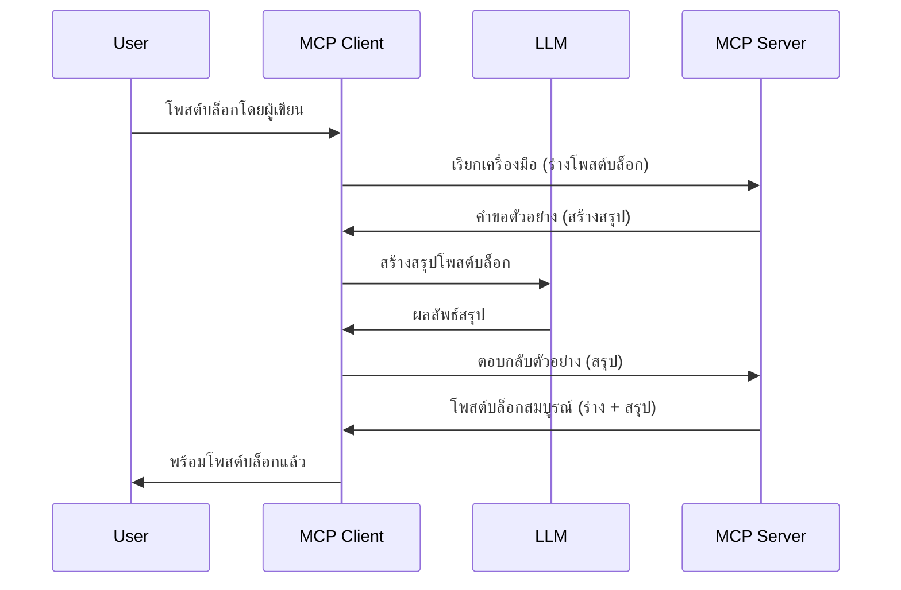

> [!WARNING]
> การสุ่มตัวอย่างถูกเลิกใช้ใน MCP `2026-07-28` บทเรียนนี้ถูกเก็บไว้สำหรับ
> การใช้งานแบบเดิม เซิร์ฟเวอร์ใหม่ควรรวมเข้ากับ API ของผู้ให้บริการ LLM โดยตรง
>

# การสุ่มตัวอย่าง - มอบหมายฟีเจอร์ให้กับไคลเอนต์

> การสุ่มตัวอย่างยังคงอยู่ในข้อกำหนด `2026-07-28` เพื่อความเข้ากันได้และมีสิทธิ์
> ถูกลบในการแก้ไขครั้งแรกที่ออกหลังวันที่ 28 กรกฎาคม 2027 ตัวอย่างในบทเรียนนี้
> อาจใช้ SDK APIs ที่รองรับ `2025-11-25`
> ดู [มีอะไรเปลี่ยนแปลงใน MCP: ข้อกำหนด 2026-07-28](../../01-CoreConcepts/mcp-2026-07-28.md)

ในการใช้งานแบบเดิม การสุ่มตัวอย่างช่วยให้เซิร์ฟเวอร์ MCP ขอความช่วยเหลือจาก LLM
ที่จัดการโดยไคลเอนต์ สำหรับการใช้งานใหม่ ให้เรียกผู้ให้บริการ LLM ที่เลือก
โดยตรงแทน

เรามาสำรวจกรณีการใช้งานและวิธีสร้างโซลูชันที่เกี่ยวข้องกับการสุ่มตัวอย่างกัน

## ภาพรวม

ในบทเรียนนี้ เราจะมุ่งเน้นที่การอธิบายว่าเมื่อใดและที่ไหนควรใช้การสุ่มตัวอย่าง และวิธีตั้งค่าการใช้งาน

## วัตถุประสงค์การเรียนรู้

ในบทนี้ เราจะ:

- อธิบายว่าการสุ่มตัวอย่างคืออะไรและเมื่อใดควรใช้
- แสดงวิธีการตั้งค่าการสุ่มตัวอย่างใน MCP
- ยกตัวอย่างการสุ่มตัวอย่างในการใช้งานจริง

## การสุ่มตัวอย่างคืออะไรและทำไมต้องใช้?

การสุ่มตัวอย่างเป็นฟีเจอร์ขั้นสูงที่ทำงานด้วยวิธีดังนี้:



### คำขอสุ่มตัวอย่าง

โอเค ตอนนี้เรามีภาพรวมของสถานการณ์ที่สมเหตุสมผลแล้ว มาเราพูดถึงคำขอสุ่มตัวอย่างที่เซิร์ฟเวอร์ส่งกลับไปยังไคลเอนต์ นี่คือลักษณะของคำขอในรูปแบบ JSON-RPC:

```json
{
  "jsonrpc": "2.0",
  "id": 1,
  "method": "sampling/createMessage",
  "params": {
    "messages": [
      {
        "role": "user",
        "content": {
          "type": "text",
          "text": "Create a blog post summary of the following blog post: <BLOG POST>"
        }
      }
    ],
    "modelPreferences": {
      "hints": [
        {
          "name": "claude-3-sonnet"
        }
      ],
      "intelligencePriority": 0.8,
      "speedPriority": 0.5
    },
    "systemPrompt": "You are a helpful assistant.",
    "maxTokens": 100
  }
}
```

มีบางอย่างที่ควรพูดถึงที่นี่:

- Prompt ภายใต้ content -> text คือข้อความคำสั่งสำหรับ LLM ให้สรุปเนื้อหาบล็อกโพสต์

- **modelPreferences** ส่วนนี้เป็นเพียงความชอบ แนะนำการตั้งค่าสำหรับ LLM ผู้ใช้สามารถเลือกที่จะใช้คำแนะนำเหล่านี้หรือเปลี่ยนแปลงได้ กรณีนี้มีคำแนะนำเกี่ยวกับโมเดลที่ใช้และลำดับความสำคัญของความเร็วและความฉลาด
- **systemPrompt** นี่คือระบบพรอมต์ปกติของคุณที่ให้บุคลิกภาพกับ LLM และมีคำแนะนำการใช้งาน
- **maxTokens** เป็นคุณสมบัติอีกอย่างที่ระบุจำนวนโทเค็นที่แนะนำให้ใช้สำหรับงานนี้

### การตอบสนองของการสุ่มตัวอย่าง

การตอบสนองนี้คือสิ่งที่ MCP Client ส่งกลับไปยัง MCP Server และเป็นผลลัพธ์จากการเรียก LLM ของไคลเอนต์ รอการตอบและสร้างข้อความนี้ขึ้นมา นี่คือลักษณะของมันใน JSON-RPC:

```json
{
  "jsonrpc": "2.0",
  "id": 1,
  "result": {
    "role": "assistant",
    "content": {
      "type": "text",
      "text": "Here's your abstract <ABSTRACT>"
    },
    "model": "gpt-5",
    "stopReason": "endTurn"
  }
}
```

สังเกตว่าการตอบสนองเป็นเหมือนบทสรุปของบล็อกโพสต์ตามที่เราขอ และสังเกตด้วยว่า `model` ที่ใช้ไม่ใช่ตามที่เราขอแต่เป็น "gpt-5" แทน "claude-3-sonnet" ซึ่งแสดงให้เห็นว่าผู้ใช้สามารถเปลี่ยนใจว่าจะใช้โมเดลใดและคำขอสุ่มตัวอย่างของคุณเป็นเพียงคำแนะนำ

โอเค ตอนนี้เรารู้ลำดับการทำงานหลักและงานที่มีประโยชน์ในการใช้ เช่น "การสร้างบล็อกโพสต์ + บทสรุป" มาดูกันว่าต้องทำอย่างไรให้มันทำงานได้

### ประเภทข้อความ

ข้อความสำหรับการสุ่มตัวอย่างไม่ได้จำกัดแค่ข้อความแต่ยังสามารถส่งภาพและเสียงได้ นี่คือลักษณะ JSON-RPC ที่แตกต่างกัน:

**ข้อความ**

```json
{
  "type": "text",
  "text": "The message content"
}
```

**เนื้อหาภาพ**

```json
{
  "type": "image",
  "data": "base64-encoded-image-data",
  "mimeType": "image/jpeg"
}
```

**เนื้อหาเสียง**

```json
{
  "type": "audio",
  "data": "base64-encoded-audio-data",
  "mimeType": "audio/wav"
}
```

> NOTE: สำหรับสถานะปัจจุบันและคำแนะนำการย้ายข้อมูล ดู
> [เอกสารการสุ่มตัวอย่างที่เลิกใช้](https://modelcontextprotocol.io/specification/2026-07-28/client/sampling)

## วิธีตั้งค่าการสุ่มตัวอย่างในไคลเอนต์

> หมายเหตุ: ถ้าคุณสร้างแค่เซิร์ฟเวอร์ ไม่จำเป็นต้องทำอะไรมากที่นี่

ในไคลเอนต์ คุณต้องระบุฟีเจอร์ดังนี้:

```json
{
  "capabilities": {
    "sampling": {}
  }
}
```

หลังจากนั้นจะถูกเลือกเมื่อไคลเอนต์ที่คุณเลือกเริ่มต้นกับเซิร์ฟเวอร์

## ตัวอย่างการสุ่มตัวอย่างจริง - สร้างบล็อกโพสต์

มาร่วมเขียนโค้ดเซิร์ฟเวอร์สุ่มตัวอย่างกัน เราต้องทำดังนี้:

1. สร้างเครื่องมือบนเซิร์ฟเวอร์
1. เครื่องมือนั้นควรสร้างคำขอสุ่มตัวอย่าง
1. เครื่องมือควรรอคำขอสุ่มตัวอย่างของไคลเอนต์ให้ถูกตอบกลับ
1. จากนั้นควรสร้างผลลัพธ์ของเครื่องมือออกมา

มาดูโค้ดทีละขั้นตอน:

### -1- สร้างเครื่องมือ

**python**

```python
@mcp.tool()
async def create_blog(title: str, content: str, ctx: Context[ServerSession, None]) -> str:
    """Create a blog post and generate a summary"""

```

### -2- สร้างคำขอสุ่มตัวอย่าง

ขยายเครื่องมือของคุณด้วยโค้ดดังนี้:

**python**

```python
post = BlogPost(
        id=len(posts) + 1,
        title=title,
        content=content,
        abstract=""
    )

prompt = f"Create an abstract of the following blog post: title: {title} and draft: {content} "

result = await ctx.session.create_message(
        messages=[
            SamplingMessage(
                role="user",
                content=TextContent(type="text", text=prompt),
            )
        ],
        max_tokens=100,
)

```

### -3- รอการตอบกลับและส่งกลับผลลัพธ์

**python**

```python
post.abstract = result.content.text

posts.append(post)

# ส่งคืนผลิตภัณฑ์ที่สมบูรณ์
return json.dumps({
    "id": post.title,
    "abstract": post.abstract
})
```

### -4- โค้ดทั้งหมด

**python**

```python
from starlette.applications import Starlette
from starlette.routing import Mount, Host

from mcp.server.fastmcp import Context, FastMCP

from mcp.server.session import ServerSession
from mcp.types import SamplingMessage, TextContent

import json


from uuid import uuid4
from typing import List
from pydantic import BaseModel


mcp = FastMCP("Blog post generator")

# app = FastAPI()

posts = []

class BlogPost(BaseModel):
    id: int
    title: str
    content: str
    abstract: str

posts: List[BlogPost] = []

@mcp.tool()
async def create_blog(title: str, content: str, ctx: Context[ServerSession, None]) -> str:
    """Create a blog post and generate a summary"""

    post = BlogPost(
        id=len(posts) + 1,
        title=title,
        content=content,
        abstract=""
    )

    prompt = f"Create an abstract of the following blog post: title: {title} and draft: {content} "

    result = await ctx.session.create_message(
        messages=[
            SamplingMessage(
                role="user",
                content=TextContent(type="text", text=prompt),
            )
        ],
        max_tokens=100,
    )

    post.abstract = result.content.text

    posts.append(post)

    # ส่งคืนโพสต์บล็อกฉบับสมบูรณ์
    return json.dumps({
        "id": post.title,
        "abstract": post.abstract
    })

if __name__ == "__main__":
    print("Starting server...")
    # mcp.run()
    mcp.run(transport="streamable-http")

# รันแอปด้วย: python server.py
```

### -5- ทดลองใน Visual Studio Code

เพื่อทดสอบใน Visual Studio Code ทำดังนี้:

1. เริ่มเซิร์ฟเวอร์ในเทอร์มินัล
1. เพิ่มลงใน *mcp.json* (และตรวจสอบว่าเซิร์ฟเวอร์ถูกเริ่ม) เช่น:

   ```json
   "servers": {
      "blog-server": {
        "type": "http",
        "url": "http://localhost:8000/mcp"
      }
   }
   ```

1. พิมพ์คำสั่ง:

   ```text
   create a blog post named "Where Python comes from", the content is "Python is actually named after Monty Python Flying Circus"
   ```

1. อนุญาตให้เกิดการสุ่มตัวอย่าง ครั้งแรกเมื่อทดสอบนี้ คุณจะเห็นกล่องโต้ตอบเพิ่มเติมที่ต้องยอมรับ จากนั้นจะเห็นกล่องปกติสำหรับขอให้คุณรันเครื่องมือ

1. ตรวจสอบผลลัพธ์ คุณจะเห็นผลลัพธ์แสดงอย่างสวยงามใน GitHub Copilot Chat แต่คุณยังสามารถตรวจสอบการตอบสนอง JSON ดิบได้ด้วย

**โบนัส** Visual Studio Code มีเครื่องมือที่สนับสนุนการสุ่มตัวอย่างอย่างดี คุณสามารถตั้งค่าการเข้าถึงการสุ่มตัวอย่างบนเซิร์ฟเวอร์ที่ติดตั้งโดยไปที่:

1. ไปที่ส่วนส่วนขยาย
1. เลือกไอคอนฟันเฟืองสำหรับเซิร์ฟเวอร์ที่ติดตั้งในส่วน "MCP SERVERS - INSTALLED"
1. เลือก "Configure Model Access" ที่นี่คุณสามารถเลือกโมเดลที่ GitHub Copilot สามารถใช้เมื่อทำการสุ่มตัวอย่างได้ คุณยังสามารถดูคำขอสุ่มตัวอย่างที่เกิดขึ้นล่าสุดได้โดยเลือก "Show Sampling requests"

## แบบฝึกหัด

ในแบบฝึกหัดนี้ คุณจะสร้างการสุ่มตัวอย่างที่แตกต่างเล็กน้อย คือการผสานการสุ่มตัวอย่างที่รองรับการสร้างคำอธิบายสินค้า นี่คือสถานการณ์ของคุณ:

**สถานการณ์**: พนักงานฝ่ายหลังงานที่อีคอมเมิร์ซต้องการความช่วยเหลือ เพราะใช้เวลานานเกินไปในการสร้างคำอธิบายสินค้า ดังนั้นคุณต้องสร้างโซลูชันที่เรียกเครื่องมือ "create_product" ด้วย "title" และ "keywords" เป็นอาร์กิวเมนต์ และเครื่องมือควรสร้างสินค้าครบถ้วนรวมถึงฟิลด์ "description" ที่จะถูกเติมโดย LLM ของไคลเอนต์

เคล็ดลับ: ใช้สิ่งที่คุณเรียนรู้ก่อนหน้าเพื่อสร้างเซิร์ฟเวอร์และเครื่องมือนี้โดยใช้คำขอสุ่มตัวอย่าง

## โซลูชัน

[โซลูชัน](./solution/README.md)

## ข้อสรุปสำคัญ

การสุ่มตัวอย่างเป็นฟีเจอร์ที่ทรงพลังที่อนุญาตให้เซิร์ฟเวอร์มอบหมายงานให้กับไคลเอนต์เมื่อจำเป็นต้องใช้ความช่วยเหลือจาก LLM

## ต่อไป

- [บทที่ 4 - การใช้งานจริง](../../04-PracticalImplementation/README.md)

---

<!-- CO-OP TRANSLATOR DISCLAIMER START -->
**ปฏิเสธความรับผิดชอบ**:
เอกสารนี้ได้รับการแปลโดยใช้บริการแปลภาษา AI [Co-op Translator](https://github.com/Azure/co-op-translator) ขณะที่เราพยายามให้ความถูกต้อง โปรดทราบว่าการแปลโดยอัตโนมัติอาจมีข้อผิดพลาดหรือความไม่ถูกต้อง เอกสารต้นฉบับในภาษาต้นทางควรถูกพิจารณาเป็นแหล่งข้อมูลที่เชื่อถือได้ สำหรับข้อมูลที่สำคัญ แนะนำให้ใช้การแปลโดยมนุษย์มืออาชีพ เราไม่รับผิดชอบต่อความเข้าใจผิดหรือการตีความที่ผิดพลาดที่เกิดขึ้นจากการใช้การแปลนี้
<!-- CO-OP TRANSLATOR DISCLAIMER END -->