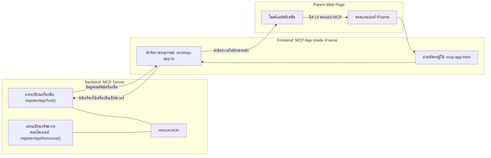
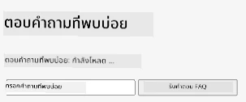
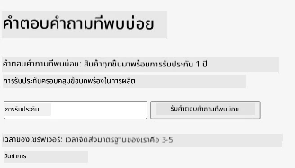
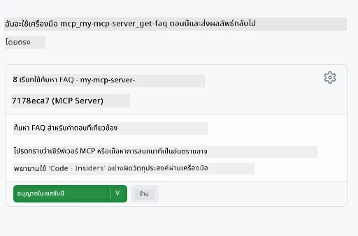
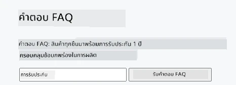

# MCP Apps

MCP Apps คือแนวทางใหม่ใน MCP แนวคิดคือไม่เพียงแต่จะตอบกลับด้วยข้อมูลจากการเรียกใช้เครื่องมือเท่านั้น แต่ยังให้ข้อมูลเกี่ยวกับวิธีที่ควรมีปฏิสัมพันธ์กับข้อมูลนี้ด้วย นั่นหมายความว่าผลลัพธ์จากเครื่องมือสามารถมีข้อมูล UI ได้ด้วย ทำไมเราถึงต้องการแบบนั้น? ลองพิจารณาวิธีที่คุณทำสิ่งต่างๆ ในวันนี้ คุณน่าจะกำลังใช้งานผลลัพธ์ของ MCP Server โดยวางหน้าฟรอนต์เอนด์มาไว้ข้างหน้า นั่นคือโค้ดที่คุณต้องเขียนและบำรุงรักษา บางครั้งนั่นคือสิ่งที่คุณต้องการ แต่บางครั้งมันก็คงดีถ้าคุณสามารถนำข้อมูลชิ้นเล็ก ๆ ที่รวมทุกอย่างตั้งแต่ข้อมูลถึงอินเทอร์เฟซผู้ใช้เข้ามาได้เลย

## ภาพรวม

บทเรียนนี้ให้คำแนะนำเชิงปฏิบัติเกี่ยวกับ MCP Apps วิธีเริ่มต้นใช้งาน และวิธีรวมเข้ากับ Web Apps ที่คุณมีอยู่ MCP Apps เป็นการเพิ่มใหม่ล่าสุดใน MCP Standard

## วัตถุประสงค์การเรียนรู้

เมื่อจบบทเรียนนี้แล้ว คุณจะสามารถ:

- อธิบายว่า MCP Apps คืออะไร
- เมื่อใดควรใช้ MCP Apps
- สร้างและรวม MCP Apps ของคุณเอง

## MCP Apps - ทำงานอย่างไร

แนวคิดของ MCP Apps คือการให้การตอบกลับที่เป็นส่วนประกอบที่สามารถเรนเดอร์ได้ ส่วนประกอบดังกล่าวสามารถมีทั้งส่วนมองเห็นและปฏิสัมพันธ์ เช่น การคลิกปุ่ม การป้อนข้อมูลของผู้ใช้ และอื่นๆ เริ่มต้นจากฝั่งเซิร์ฟเวอร์และ MCP Server ของเรา เพื่อสร้างส่วนประกอบ MCP App คุณต้องสร้างทั้งเครื่องมือและแหล่งข้อมูลแอปพลิเคชัน ส่วนประกอบทั้งสองนี้เชื่อมต่อกันโดย resourceUri

นี่คือตัวอย่าง ลองมาดูให้เห็นภาพรวมว่ามีส่วนใดบ้างที่ทำหน้าที่อะไร:

```text
server.ts -- responsible for registering tools and the component as a UI component
src/
  mcp-app.ts -- wiring up event handlers
mcp-app.html -- the user interface
```

ภาพนี้อธิบายสถาปัตยกรรมสำหรับการสร้างส่วนประกอบและตรรกะของมัน


ลองมาดูความรับผิดชอบของ backend และ frontend ตามลำดับ

### ฝั่ง backend

มีสองสิ่งที่เราต้องทำให้สำเร็จที่นี่:

- ลงทะเบียนเครื่องมือที่เราต้องการใช้งาน
- กำหนดส่วนประกอบ

**ลงทะเบียนเครื่องมือ**

```typescript
registerAppTool(
    server,
    "get-time",
    {
      title: "Get Time",
      description: "Returns the current server time.",
      inputSchema: {},
      _meta: { ui: { resourceUri } }, // เชื่อมโยงเครื่องมือนี้กับแหล่งข้อมูล UI ของมัน
    },
    async () => {
      const time = new Date().toISOString();
      return { content: [{ type: "text", text: time }] };
    },
  );

```

โค้ดตัวอย่างด้านบนแสดงพฤติกรรม โดยเปิดเผยเครื่องมือชื่อ `get-time` เครื่องมือนี้ไม่มีอินพุตแต่แสดงผลเวลาในปัจจุบัน เรามีความสามารถในการกำหนด `inputSchema` สำหรับเครื่องมือที่ต้องรับข้อมูลจากผู้ใช้ได้

**ลงทะเบียนส่วนประกอบ**

ในไฟล์เดียวกัน เราต้องลงทะเบียนส่วนประกอบด้วย:

```typescript
const resourceUri = "ui://get-time/mcp-app.html";

// ลงทะเบียนทรัพยากร ซึ่งจะส่งคืน HTML/JavaScript ที่ถูกบันเดิลสำหรับ UI.
registerAppResource(
  server,
  resourceUri,
  resourceUri,
  { mimeType: RESOURCE_MIME_TYPE },
  async () => {
    const html = await fs.readFile(path.join(DIST_DIR, "mcp-app.html"), "utf-8");

    return {
    contents: [
        { uri: resourceUri, mimeType: RESOURCE_MIME_TYPE, text: html },
    ],
    };
  },
);
```

สังเกตว่าเรากล่าวถึง `resourceUri` เพื่อเชื่อมโยงส่วนประกอบกับเครื่องมือของมัน นอกจากนี้ยังมี callback ที่โหลดไฟล์ UI และส่งกลับส่วนประกอบ

### ส่วนประกอบ frontend

เหมือนกับฝั่ง backend มีสองส่วนที่สำคัญ:

- frontend ที่เขียนด้วย HTML ล้วนๆ
- โค้ดที่จัดการเหตุการณ์และสิ่งที่ต้องทำ เช่น เรียกเครื่องมือ หรือส่งข้อความไปยังหน้าต่างพาเรนต์

**อินเทอร์เฟซผู้ใช้**

มาดู UI กัน

```html
<!-- mcp-app.html -->
<!DOCTYPE html>
<html lang="en">
  <head>
    <meta charset="UTF-8" />
    <title>Get Time App</title>
  </head>
  <body>
    <p>
      <strong>Server Time:</strong> <code id="server-time">Loading...</code>
    </p>
    <button id="get-time-btn">Get Server Time</button>
    <script type="module" src="/src/mcp-app.ts"></script>
  </body>
</html>
```

**การเชื่อมต่อเหตุการณ์**

ส่วนสุดท้ายคือการเชื่อมต่อเหตุการณ์ หมายความว่าเราต้องระบุว่าองค์ประกอบใดใน UI ต้องการตัวจัดการเหตุการณ์และสิ่งที่ต้องทำเมื่อเกิดเหตุการณ์:

```typescript
// mcp-app.ts

import { App } from "@modelcontextprotocol/ext-apps";

// ดึงการอ้างอิงขององค์ประกอบ
const serverTimeEl = document.getElementById("server-time")!;
const getTimeBtn = document.getElementById("get-time-btn")!;

// สร้างอินสแตนซ์แอป
const app = new App({ name: "Get Time App", version: "1.0.0" });

// จัดการผลลัพธ์ของเครื่องมือจากเซิร์ฟเวอร์ ตั้งค่าก่อน `app.connect()` เพื่อหลีกเลี่ยง
// การพลาดผลลัพธ์เครื่องมือเริ่มต้น
app.ontoolresult = (result) => {
  const time = result.content?.find((c) => c.type === "text")?.text;
  serverTimeEl.textContent = time ?? "[ERROR]";
};

// เชื่อมต่อการคลิกปุ่ม
getTimeBtn.addEventListener("click", async () => {
  // `app.callServerTool()` ให้ UI ขอข้อมูลใหม่จากเซิร์ฟเวอร์
  const result = await app.callServerTool({ name: "get-time", arguments: {} });
  const time = result.content?.find((c) => c.type === "text")?.text;
  serverTimeEl.textContent = time ?? "[ERROR]";
});

// เชื่อมต่อกับโฮสต์
app.connect();
```

จากโค้ดข้างต้น นี่คือการเชื่อมต่อองค์ประกอบ DOM กับเหตุการณ์ตามปกติ สิ่งที่ควรสังเกตคือการเรียก `callServerTool` ซึ่งจะเรียกใช้เครื่องมือในฝั่ง backend

## การจัดการกับข้อมูลที่ผู้ใช้ป้อน

จนถึงตอนนี้ เราเห็นส่วนประกอบที่มีปุ่มซึ่งเมื่อคลิกจะเรียกใช้เครื่องมือ ลองเพิ่มองค์ประกอบ UI อย่างฟิลด์ป้อนข้อมูลและลองส่งอาร์กิวเมนต์ไปยังเครื่องมือกัน เราจะสร้างฟังก์ชัน FAQ ดู วิธีทำงานควรเป็นดังนี้:

- มีปุ่มและองค์ประกอบป้อนข้อมูลที่ผู้ใช้พิมพ์คำค้นหา เช่น "Shipping" ซึ่งจะเรียกเครื่องมือในฝั่ง backend ที่ค้นหาข้อมูล FAQ
- เครื่องมือที่รองรับการค้นหา FAQ ที่กล่าวถึง

ก่อนอื่นเพิ่มการรองรับใน backend ดังนี้:

```typescript
const faq: { [key: string]: string } = {
    "shipping": "Our standard shipping time is 3-5 business days.",
    "return policy": "You can return any item within 30 days of purchase.",
    "warranty": "All products come with a 1-year warranty covering manufacturing defects.",
  }

registerAppTool(
    server,
    "get-faq",
    {
      title: "Search FAQ",
      description: "Searches the FAQ for relevant answers.",
      inputSchema: zod.object({
        query: zod.string().default("shipping"),
      }),
      _meta: { ui: { resourceUri: faqResourceUri } }, // เชื่อมโยงเครื่องมือนี้กับแหล่งข้อมูล UI ของมัน
    },
    async ({ query }) => {
      const answer: string = faq[query.toLowerCase()] || "Sorry, I don't have an answer for that.";
      return { content: [{ type: "text", text: answer }] };
    },
  );
```

สิ่งที่เห็นคือวิธีการเพิ่ม `inputSchema` โดยใช้ schema จาก `zod` ดังนี้:

```typescript
inputSchema: zod.object({
  query: zod.string().default("shipping"),
})
```

ใน schema ด้านบนเรากำหนดว่ามีพารามิเตอร์อินพุตชื่อ `query` และเป็นตัวเลือกโดยมีค่าเริ่มต้นเป็น "shipping"

ดีแล้ว ไปดู *mcp-app.html* เพื่อดู UI ที่ต้องสร้างสำหรับสิ่งนี้:

```html
<div class="faq">
    <h1>FAQ response</h1>
    <p>FAQ Response: <code id="faq-response">Loading...</code></p>
    <input type="text" id="faq-query" placeholder="Enter FAQ query" />
    <button id="get-faq-btn">Get FAQ Response</button>
  </div>
```

เยี่ยม ตอนนี้เรามีองค์ประกอบอินพุตและปุ่มแล้ว ต่อไปมาดูใน *mcp-app.ts* เพื่อเชื่อมต่อเหตุการณ์เหล่านี้:

```typescript
const getFaqBtn = document.getElementById("get-faq-btn")!;
const faqQueryInput = document.getElementById("faq-query") as HTMLInputElement;

getFaqBtn.addEventListener("click", async () => {
  const query = faqQueryInput.value;
  const result = await app.callServerTool({ name: "get-faq", arguments: { query } });
  const faq = result.content?.find((c) => c.type === "text")?.text;
  faqResponseEl.textContent = faq ?? "[ERROR]";
});
```

ในโค้ดข้างบน เราได้:

- สร้างการอ้างอิงถึงองค์ประกอบ UI ที่น่าสนใจ
- จัดการการคลิกปุ่มเพื่อดึงค่าในองค์ประกอบป้อนข้อมูล และเรียก `app.callServerTool()` ด้วย `name` และ `arguments` โดยส่งค่า `query` เป็นอาร์กิวเมนต์

สิ่งที่เกิดขึ้นเมื่อเรียก `callServerTool` คือส่งข้อความไปยังหน้าต่างพาเรนต์และหน้าต่างนั้นจะเรียก MCP Server

### ลองใช้งานดู

เมื่อทดสอบจะเห็นสิ่งต่อไปนี้:



และนี่คือตอนที่ลองใช้งานโดยป้อนคำว่า "warranty"



ในการรันโค้ดนี้ไปที่ [Code section](./code/README.md)

## การทดสอบใน Visual Studio Code

Visual Studio Code มีการสนับสนุนที่ดีสำหรับ MVP Apps และน่าจะเป็นวิธีการทดสอบ MCP Apps ที่ง่ายที่สุด ในการใช้ Visual Studio Code ให้เพิ่มเซิร์ฟเวอร์ใน *mcp.json* ดังนี้:

```json
"my-mcp-server-7178eca7": {
    "url": "http://localhost:3001/mcp",
    "type": "http"
  }
```

จากนั้นเริ่มเซิร์ฟเวอร์ คุณจะสามารถสื่อสารกับ MVP App ผ่าน Chat Window ได้โดยต้องติดตั้ง GitHub Copilot ด้วย

โดยเรียกใช้งานผ่านพรอมต์ เช่น "#get-faq":



และเหมือนตอนรันผ่านเว็บเบราว์เซอร์ มันจะแสดงผลเดียวกันดังนี้:



## แบบฝึกหัด

สร้างเกมเป่ายิ้งฉุบ ประกอบด้วย:

UI:

- รายการดรอปดาวน์พร้อมตัวเลือก
- ปุ่มสำหรับส่งตัวเลือก
- ฉลากแสดงว่าใครเลือกอะไรและใครชนะ

เซิร์ฟเวอร์:

- ควรมีเครื่องมือ rock paper scissor ที่รับค่า "choice" เป็นอินพุต และจะสุ่มเลือกคอมพิวเตอร์และตัดสินผู้ชนะ

## วิธีแก้ไข

[Solution](./assignment/README.md)

## สรุป

เราเรียนรู้เกี่ยวกับแนวทางใหม่ MCP Apps ซึ่งช่วยให้ MCP Servers สามารถมีแนวทางแสดงผลได้ไม่เพียงแค่ข้อมูลแต่ยังรวมถึงการนำเสนอข้อมูลเหล่านั้นด้วย

นอกจากนี้ เรายังได้เรียนรู้ว่า MCP Apps ถูกโฮสต์ใน IFrame และต้องสื่อสารกับ MCP Servers ด้วยการส่งข้อความไปยังเว็บแอปพาเรนต์ มีไลบรารีหลายตัวสำหรับทั้ง JavaScript ธรรมดาและ React ที่ช่วยให้การสื่อสารนี้ง่ายขึ้น

## สิ่งสำคัญที่ควรจดจำ

นี่คือสิ่งที่คุณได้เรียนรู้:

- MCP Apps เป็นมาตรฐานใหม่ที่มีประโยชน์เมื่อคุณต้องการส่งทั้งข้อมูลและฟีเจอร์ UI
- แอปประเภทนี้ทำงานใน IFrame เพื่อเหตุผลด้านความปลอดภัย

## ขั้นตอนถัดไป

- [บทที่ 4](../../04-PracticalImplementation/README.md)

---

<!-- CO-OP TRANSLATOR DISCLAIMER START -->
**ข้อจำกัดความรับผิดชอบ**:  
เอกสารนี้ได้รับการแปลโดยใช้บริการแปลภาษาอัตโนมัติ [Co-op Translator](https://github.com/Azure/co-op-translator) แม้เราจะพยายามให้ความถูกต้องสูงสุด แต่โปรดทราบว่าการแปลโดยอัตโนมัติอาจมีข้อผิดพลาดหรือความไม่ถูกต้อง เอกสารต้นฉบับในภาษาต้นทางถือเป็นแหล่งข้อมูลที่เชื่อถือได้ สำหรับข้อมูลที่มีความสำคัญแนะนำให้ใช้บริการแปลโดยผู้เชี่ยวชาญที่เป็นมนุษย์ เราไม่รับผิดชอบต่อความเข้าใจผิดหรือการตีความผิดที่เกิดขึ้นจากการใช้การแปลนี้
<!-- CO-OP TRANSLATOR DISCLAIMER END -->