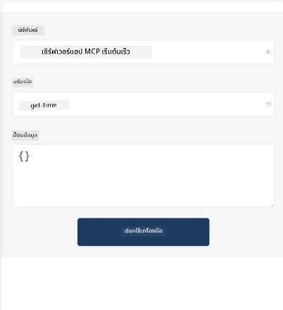
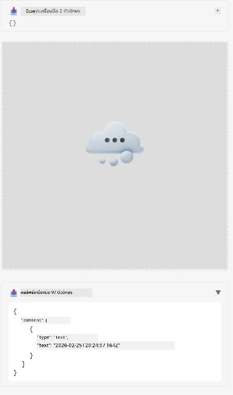

นี่คือตัวอย่างที่สาธิต MCP App

## ติดตั้ง

1. ไปที่โฟลเดอร์ *mcp-app*
1. รัน `npm install` ซึ่งจะติดตั้ง dependencies ของ frontend และ backend

ตรวจสอบว่าการคอมไพล์ backend สำเร็จโดยรันคำสั่ง:

```sh
npx tsc --noEmit
```

จะไม่มีผลลัพธ์ใดๆ ถ้าทุกอย่างเรียบร้อยดี

## รัน backend

> ขั้นตอนนี้ต้องใช้ขั้นตอนเพิ่มขึ้นเล็กน้อยหากคุณใช้เครื่อง Windows เนื่องจากโซลูชัน MCP Apps ใช้ไลบรารี `concurrently` ในการรัน ซึ่งคุณต้องหาทางเลือกแทน นี่คือบรรทัดที่มีปัญหาใน *package.json* ของ MCP App:

    ```json
    "start": "concurrently \"cross-env NODE_ENV=development INPUT=mcp-app.html vite build --watch\" \"tsx watch main.ts\""
    ```

แอปนี้มีสองส่วน คือ ส่วน backend และส่วน host

เริ่ม backend โดยเรียกใช้คำสั่ง:

```sh
npm start
```

ซึ่งจะเริ่ม backend ที่ `http://localhost:3001/mcp` 

> หมายเหตุ ถ้าคุณอยู่ใน Codespace อาจต้องตั้งค่าการมองเห็นพอร์ตให้เป็นสาธารณะ ตรวจสอบว่าคุณเข้าถึง endpoint ได้ผ่านเบราว์เซอร์ที่ https://<ชื่อ Codespace>.app.github.dev/mcp

## ทางเลือก -1 ทดสอบแอปใน Visual Studio Code

เพื่อทดสอบโซลูชันใน Visual Studio Code ให้ทำดังนี้:

- เพิ่มรายการเซิร์ฟเวอร์ในไฟล์ `mcp.json` ดังนี้:

    ```json
    {
        "servers": {
            "my-mcp-server-7178eca7": {
                "url": "http://localhost:3001/mcp",
                "type": "http"
            }
        },
        "inputs": []
    }
    ```

1. คลิกปุ่ม "start" ใน *mcp.json*
1. ตรวจสอบว่าเปิดหน้าต่างแชทไว้แล้วพิมพ์ `get-faq` คุณจะเห็นผลลัพธ์ดังนี้:

    

## ทางเลือก -2- ทดสอบแอปด้วย host

รีโพ <https://github.com/modelcontextprotocol/ext-apps> มีหลายโฮสต์ที่คุณสามารถใช้ทดสอบ MVP Apps ของคุณได้

เราจะนำเสนอทางเลือกสองแบบให้คุณที่นี่:

### เครื่องเครื่องในเครื่อง (Local machine)

- ไปยังโฟลเดอร์ *ext-apps* หลังจากที่คุณโคลนรีโพมาแล้ว

- ติดตั้ง dependencies

   ```sh
   npm install
   ```

- ในหน้าต่างเทอร์มินัลอีกอันหนึ่ง ไปยัง *ext-apps/examples/basic-host*

    > หากคุณใช้ Codespace ให้ไปที่ serve.ts บรรทัดที่ 27 แล้วแทนที่ http://localhost:3001/mcp ด้วย URL Codespace ของคุณสำหรับ backend เช่น https://psychic-xylophone-657rpjgvxpc5g64-3001.app.github.dev/mcp

- รัน host:

    ```sh
    npm start
    ```

    ซึ่งจะเชื่อมต่อ host กับ backend และคุณจะเห็นแอปทำงานแบบนี้:

    

### Codespace

การตั้งค่าสภาพแวดล้อม Codespace ให้ใช้งานได้นั้นต้องทำงานเพิ่มเล็กน้อย เพื่อใช้โฮสต์ผ่าน Codespace: 

- ดูที่ไดเรกทอรี *ext-apps* และไปที่ *examples/basic-host*
- รัน `npm install` เพื่อติดตั้ง dependencies
- รัน `npm start` เพื่อเริ่มโฮสต์

## ทดสอบแอป

ลองใช้แอปดังนี้:

- เลือกปุ่ม "Call Tool" แล้วคุณจะเห็นผลลัพธ์ดังนี้:

    

เยี่ยมเลย ทุกอย่างทำงานได้เรียบร้อย

---

<!-- CO-OP TRANSLATOR DISCLAIMER START -->
**ข้อจำกัดความรับผิดชอบ**:  
เอกสารนี้ได้รับการแปลโดยใช้บริการแปลภาษาอัตโนมัติ [Co-op Translator](https://github.com/Azure/co-op-translator) แม้เราจะพยายามให้ความถูกต้องสูงสุด แต่โปรดทราบว่าการแปลอัตโนมัติอาจมีข้อผิดพลาดหรือความไม่แม่นยำ เอกสารต้นฉบับในภาษาดั้งเดิมควรถูกพิจารณาเป็นแหล่งข้อมูลที่เชื่อถือได้ สำหรับข้อมูลที่สำคัญ ขอแนะนำให้ใช้การแปลโดยมนุษย์มืออาชีพ เราไม่มีความรับผิดชอบใดๆ ต่อความเข้าใจผิดหรือการตีความผิดที่เกิดจากการใช้การแปลนี้
<!-- CO-OP TRANSLATOR DISCLAIMER END -->