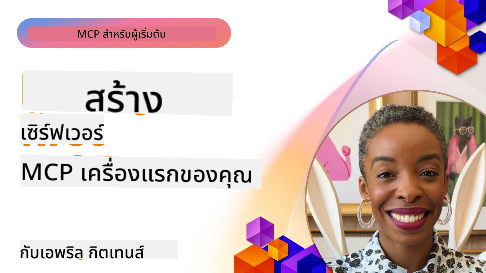

## การเริ่มต้น  

_(คลิกที่รูปภาพด้านบนเพื่อดูวิดีโอบทเรียนนี้)_

ส่วนนี้ประกอบด้วยบทเรียนหลายบท:

- **1 เซิร์ฟเวอร์แรกของคุณ** ในบทเรียนแรกนี้ คุณจะได้เรียนรู้วิธีสร้างเซิร์ฟเวอร์แรกของคุณและตรวจสอบด้วยเครื่องมือ inspector ซึ่งเป็นวิธีที่มีประโยชน์ในการทดสอบและแก้ไขข้อบกพร่องของเซิร์ฟเวอร์ของคุณ [ไปยังบทเรียน](01-first-server/README.md)

- **2 ไคลเอนต์** ในบทเรียนนี้ คุณจะได้เรียนรู้วิธีเขียนไคลเอนต์ที่สามารถเชื่อมต่อกับเซิร์ฟเวอร์ของคุณได้ [ไปยังบทเรียน](02-client/README.md)

- **3 ไคลเอนต์พร้อม LLM** วิธีที่ดียิ่งขึ้นในการเขียนไคลเอนต์คือการเพิ่ม LLM เข้าไปด้วยเพื่อให้สามารถ "เจรจาต่อรอง" กับเซิร์ฟเวอร์ของคุณในสิ่งที่ต้องทำ [ไปยังบทเรียน](03-llm-client/README.md)

- **4 การใช้งานโหมด GitHub Copilot Agent ของเซิร์ฟเวอร์ใน Visual Studio Code** ในบทนี้ เราจะดูการรัน MCP Server ของเราจากภายใน Visual Studio Code [ไปยังบทเรียน](04-vscode/README.md)

- **5 stdio Transport Server** stdio transport เป็นมาตรฐานที่แนะนำสำหรับการสื่อสารระหว่างเซิร์ฟเวอร์ MCP กับไคลเอนต์ในเครื่อง โดยให้การสื่อสารที่ปลอดภัยผ่าน subprocess พร้อมการแยกกระบวนการในตัว [ไปยังบทเรียน](05-stdio-server/README.md)

- **6 HTTP Streaming กับ MCP (Streamable HTTP)** เรียนรู้เกี่ยวกับการส่งข้อมูลแบบสตรีม HTTP สมัยใหม่ (วิธีที่แนะนำสำหรับเซิร์ฟเวอร์ MCP ระยะไกลตาม [MCP Specification 2025-11-25](https://spec.modelcontextprotocol.io/specification/2025-11-25/basic/transports/#streamable-http)) การแจ้งเตือนความคืบหน้า และวิธีการสร้างเซิร์ฟเวอร์และไคลเอนต์ MCP ที่ขยายตัวได้แบบเรียลไทม์ด้วย Streamable HTTP [ไปยังบทเรียน](06-http-streaming/README.md)

- **7 การใช้ AI Toolkit สำหรับ VSCode** เพื่อใช้งานและทดสอบ MCP Clients และ Servers ของคุณ [ไปยังบทเรียน](07-aitk/README.md)

- **8 การทดสอบ** ในบทนี้เราจะเน้นวิธีการทดสอบเซิร์ฟเวอร์และไคลเอนต์ของเราในหลายรูปแบบ [ไปยังบทเรียน](08-testing/README.md)

- **9 การปรับใช้** บทนี้จะดูวิธีต่างๆ ในการปรับใช้โซลูชัน MCP ของคุณ [ไปยังบทเรียน](09-deployment/README.md)

- **10 การใช้งานเซิร์ฟเวอร์ขั้นสูง** บทนี้ครอบคลุมการใช้งานเซิร์ฟเวอร์ขั้นสูง [ไปยังบทเรียน](./10-advanced/README.md)

- **11 การยืนยันตัวตน** บทนี้ครอบคลุมวิธีเพิ่มระบบยืนยันตัวตนอย่างง่าย ตั้งแต่ Basic Auth ถึงการใช้ JWT และ RBAC คุณควรเริ่มจากที่นี่แล้วจึงดูหัวข้อขั้นสูงในบทที่ 5 และทำการเพิ่มความปลอดภัยด้วยคำแนะนำในบทที่ 2 [ไปยังบทเรียน](./11-simple-auth/README.md)

- **12 MCP Hosts** การตั้งค่าและใช้ MCP host clients ยอดนิยมรวมถึง Claude Desktop, Cursor, Cline และ Windsurf เรียนรู้ประเภทการขนส่งและการแก้ไขปัญหา [ไปยังบทเรียน](./12-mcp-hosts/README.md)

- **13 MCP Inspector** การดีบักและทดสอบเซิร์ฟเวอร์ MCP ของคุณอย่างโต้ตอบด้วยเครื่องมือ MCP Inspector เรียนรู้การแก้ไขปัญหาเครื่องมือ แหล่งข้อมูล และข้อความโปรโตคอล [ไปยังบทเรียน](./13-mcp-inspector/README.md)

- **14 Sampling** สร้าง MCP Servers ที่ทำงานร่วมกับ MCP clients ในงานที่เกี่ยวข้องกับ LLM [ไปยังบทเรียน](./14-sampling/README.md)

- **15 MCP Apps** สร้าง MCP Servers ที่ตอบกลับด้วยคำแนะนำ UI ด้วย [ไปยังบทเรียน](./15-mcp-apps/README.md)

Model Context Protocol (MCP) คือโปรโตคอลเปิดที่เป็นมาตรฐานสำหรับการให้อุปกรณ์ต่างๆ ส่งข้อมูลบริบทกับ LLMs คิดว่า MCP เป็นเหมือนพอร์ต USB-C สำหรับแอป AI ที่ให้วิธีมาตรฐานในการเชื่อมต่อโมเดล AI กับแหล่งข้อมูลต่างๆ และเครื่องมือ

## วัตถุประสงค์การเรียนรู้

เมื่อจบบทเรียนนี้ คุณจะสามารถ:

- ตั้งค่าสภาพแวดล้อมการพัฒนาสำหรับ MCP ด้วย C#, Java, Python, TypeScript, และ JavaScript
- สร้างและปรับใช้เซิร์ฟเวอร์ MCP พื้นฐานพร้อมฟีเจอร์ที่ปรับแต่งได้ (ทรัพยากร คำสั่ง และเครื่องมือ)
- สร้างแอปโฮสต์ที่เชื่อมต่อกับเซิร์ฟเวอร์ MCP
- ทดสอบและดีบักการใช้งาน MCP
- เข้าใจความท้าทายทั่วไปในการตั้งค่าและวิธีแก้ไข
- เชื่อมต่อการใช้งาน MCP ของคุณกับบริการ LLM ที่เป็นที่นิยม

## การตั้งค่าสภาพแวดล้อม MCP ของคุณ

ก่อนเริ่มทำงานกับ MCP สิ่งสำคัญคือเตรียมสภาพแวดล้อมการพัฒนาและเข้าใจกระบวนการทำงานพื้นฐาน ส่วนนี้จะแนะนำขั้นตอนเริ่มต้นเพื่อให้คุณเริ่มต้นกับ MCP ได้อย่างราบรื่น

### สิ่งที่ต้องมี

ก่อนเริ่มพัฒนา MCP ให้แน่ใจว่าคุณมี:

- **สภาพแวดล้อมการพัฒนา** สำหรับภาษาที่คุณเลือกใช้ (C#, Java, Python, TypeScript หรือ JavaScript)
- **IDE/Editor**: Visual Studio, Visual Studio Code, IntelliJ, Eclipse, PyCharm หรือโปรแกรมแก้ไขโค้ดสมัยใหม่ใดๆ
- **ตัวจัดการแพ็กเกจ**: NuGet, Maven/Gradle, pip หรือ npm/yarn
- **คีย์ API**: สำหรับบริการ AI ที่คุณวางแผนจะใช้ในแอปโฮสต์ของคุณ

### SDK อย่างเป็นทางการ

ในบทต่อไป คุณจะเห็นโซลูชันที่สร้างด้วย Python, TypeScript, Java และ .NET นี่คือ SDK อย่างเป็นทางการทั้งหมดที่สนับสนุน

MCP มี SDK อย่างเป็นทางการสำหรับหลายภาษา (สอดคล้องกับ [MCP Specification 2025-11-25](https://spec.modelcontextprotocol.io/specification/2025-11-25/)):
- [C# SDK](https://github.com/modelcontextprotocol/csharp-sdk) - ดูแลร่วมกับ Microsoft
- [Java SDK](https://github.com/modelcontextprotocol/java-sdk) - ดูแลร่วมกับ Spring AI
- [TypeScript SDK](https://github.com/modelcontextprotocol/typescript-sdk) - เวอร์ชัน TypeScript อย่างเป็นทางการ
- [Python SDK](https://github.com/modelcontextprotocol/python-sdk) - เวอร์ชัน Python อย่างเป็นทางการ (FastMCP)
- [Kotlin SDK](https://github.com/modelcontextprotocol/kotlin-sdk) - เวอร์ชัน Kotlin อย่างเป็นทางการ
- [Swift SDK](https://github.com/modelcontextprotocol/swift-sdk) - ดูแลร่วมกับ Loopwork AI
- [Rust SDK](https://github.com/modelcontextprotocol/rust-sdk) - เวอร์ชัน Rust อย่างเป็นทางการ
- [Go SDK](https://github.com/modelcontextprotocol/go-sdk) - เวอร์ชัน Go อย่างเป็นทางการ

## ประเด็นสำคัญที่ควรทราบ

- การตั้งค่าสภาพแวดล้อมการพัฒนา MCP เป็นเรื่องง่ายด้วย SDK เฉพาะภาษาต่างๆ
- การสร้างเซิร์ฟเวอร์ MCP เกี่ยวข้องกับการสร้างและลงทะเบียนเครื่องมือที่มีโครงสร้างชัดเจน
- MCP clients เชื่อมต่อกับเซิร์ฟเวอร์และโมเดลเพื่อใช้ความสามารถที่ขยายได้
- การทดสอบและดีบักเป็นสิ่งสำคัญสำหรับการใช้งาน MCP ที่เชื่อถือได้
- ตัวเลือกการปรับใช้มีตั้งแต่การพัฒนาในเครื่องจนถึงโซลูชันบนคลาวด์

## การฝึกปฏิบัติ

เรามีชุดตัวอย่างที่เสริมแบบฝึกหัดที่คุณจะเจอในทุกบทในส่วนนี้ นอกจากนี้แต่ละบทยังมีแบบฝึกหัดและงานมอบหมายของตนเองด้วย

- [เครื่องคิดเลข Java](./samples/java/calculator/README.md)
- [เครื่องคิดเลข .Net](../../../03-GettingStarted/samples/csharp)
- [เครื่องคิดเลข JavaScript](./samples/javascript/README.md)
- [เครื่องคิดเลข TypeScript](./samples/typescript/README.md)
- [เครื่องคิดเลข Python](../../../03-GettingStarted/samples/python)

## แหล่งข้อมูลเพิ่มเติม

- [สร้าง Agents ด้วย Model Context Protocol บน Azure](https://learn.microsoft.com/azure/developer/ai/intro-agents-mcp)
- [MCP ระยะไกลกับ Azure Container Apps (Node.js/TypeScript/JavaScript)](https://learn.microsoft.com/samples/azure-samples/mcp-container-ts/mcp-container-ts/)
- [เอเจนต์ MCP OpenAI .NET](https://learn.microsoft.com/samples/azure-samples/openai-mcp-agent-dotnet/openai-mcp-agent-dotnet/)

## ต่อไป

เริ่มต้นด้วยบทเรียนแรก: [สร้างเซิร์ฟเวอร์ MCP แรกของคุณ](01-first-server/README.md)

เมื่อคุณทำบทนี้เสร็จ ให้ดำเนินการต่อที่: [โมดูล 4: การใช้งานจริง](../04-PracticalImplementation/README.md)

---

<!-- CO-OP TRANSLATOR DISCLAIMER START -->
**ข้อจำกัดความรับผิดชอบ**:
เอกสารนี้ได้รับการแปลโดยใช้บริการแปลภาษา AI [Co-op Translator](https://github.com/Azure/co-op-translator) แม้ว่าเราจะพยายามให้ความถูกต้อง โปรดทราบว่าการแปลอัตโนมัติอาจมีข้อผิดพลาดหรือความไม่ถูกต้อง เอกสารต้นฉบับในภาษาต้นทางควรถูกพิจารณาเป็นแหล่งข้อมูลที่เชื่อถือได้ สำหรับข้อมูลที่สำคัญ ควรใช้บริการแปลโดยมืออาชีพที่เป็นมนุษย์ เราจะไม่รับผิดชอบต่อความเข้าใจผิดหรือการตีความผิดที่เกิดจากการใช้การแปลนี้
<!-- CO-OP TRANSLATOR DISCLAIMER END -->