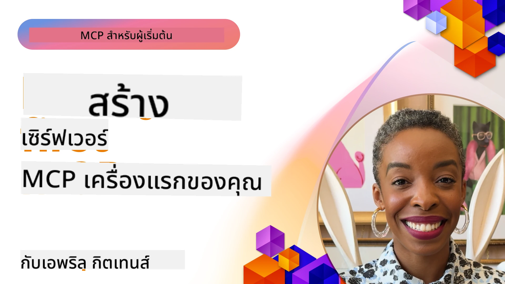

## เริ่มต้น  

_(คลิกที่ภาพด้านบนเพื่อดูวิดีโอของบทเรียนนี้)_

ส่วนนี้ประกอบด้วยบทเรียนหลายบท:

- **1 เซิร์ฟเวอร์แรกของคุณ**, ในบทเรียนแรกนี้ คุณจะได้เรียนรู้วิธีสร้างเซิร์ฟเวอร์แรกของคุณและตรวจสอบมันด้วยเครื่องมือ inspector ซึ่งเป็นวิธีที่มีประโยชน์สำหรับทดสอบและดีบักเซิร์ฟเวอร์ของคุณ, [ไปยังบทเรียน](01-first-server/README.md)

- **2 Client**, ในบทเรียนนี้ คุณจะได้เรียนรู้วิธีเขียนไคลเอนต์ที่สามารถเชื่อมต่อกับเซิร์ฟเวอร์ของคุณ, [ไปยังบทเรียน](02-client/README.md)

- **3 Client พร้อม LLM**, วิธีที่ดีกว่าในการเขียนไคลเอนต์คือการเพิ่ม LLM เข้าไปเพื่อที่มันจะได้ "ต่อรอง" กับเซิร์ฟเวอร์ของคุณว่าจะทำอะไร, [ไปยังบทเรียน](03-llm-client/README.md)

- **4 การใช้เซิร์ฟเวอร์ในโหมด GitHub Copilot Agent กับ Visual Studio Code**. ที่นี่เราจะดูการรัน MCP Server ของเราจากภายใน Visual Studio Code, [ไปยังบทเรียน](04-vscode/README.md)

- **5 เซิร์ฟเวอร์ stdio Transport** stdio transport เป็นมาตรฐานที่แนะนำสำหรับการสื่อสารระหว่าง MCP เซิร์ฟเวอร์และไคลเอนต์ในเครื่อง ซึ่งให้การสื่อสารแบบ subprocess ที่ปลอดภัยพร้อมการแยกแยะกระบวนการในตัว [ไปยังบทเรียน](05-stdio-server/README.md)

- **6 HTTP Streaming กับ MCP (Streamable HTTP)**. เรียนรู้เกี่ยวกับ
	การขนส่งระยะไกลมาตรฐานใน [MCP Specification 2026-07-28](https://modelcontextprotocol.io/specification/2026-07-28/basic/transports/streamable-http),
	พร้อมการใช้งานแบบ session-based เดิมที่ยังคงมีในบทเรียนนี้
	[ไปยังบทเรียน](06-http-streaming/README.md)

- **7 การใช้ AI Toolkit สำหรับ VSCode** เพื่อบริโภคและทดสอบ MCP Clients และ Servers ของคุณ [ไปยังบทเรียน](07-aitk/README.md)

- **8 การทดสอบ**. ที่นี่เราจะมุ่งเน้นโดยเฉพาะอย่างยิ่งในการทดสอบเซิร์ฟเวอร์และไคลเอนต์ของเราในรูปแบบต่างๆ, [ไปยังบทเรียน](08-testing/README.md)

- **9 การปรับใช้งาน**. บทนี้จะดูวิธีการปรับใช้โซลูชัน MCP ของคุณในรูปแบบต่างๆ, [ไปยังบทเรียน](09-deployment/README.md)

- **10 การใช้งานเซิร์ฟเวอร์ขั้นสูง**. บทนี้ครอบคลุมการใช้งานเซิร์ฟเวอร์ขั้นสูง, [ไปยังบทเรียน](./10-advanced/README.md)

- **11 การพิสูจน์ตัวตน**. บทนี้ครอบคลุมวิธีการเพิ่มการพิสูจน์ตัวตนอย่างง่าย ตั้งแต่ Basic Auth ไปจนถึงการใช้ JWT และ RBAC คุณได้รับการสนับสนุนให้เริ่มต้นที่นี่แล้วจึงไปดูหัวข้อขั้นสูงในบทที่ 5 และดำเนินการเสริมความปลอดภัยเพิ่มเติมตามคำแนะนำในบทที่ 2, [ไปยังบทเรียน](./11-simple-auth/README.md)

- **12 โฮสต์ MCP**. การตั้งค่าและใช้งานไคลเอนต์โฮสต์ MCP ที่ได้รับความนิยมรวมถึง Claude Desktop, Cursor, Cline และ Windsurf เรียนรู้ประเภทการขนส่งและวิธีแก้ปัญหา, [ไปยังบทเรียน](./12-mcp-hosts/README.md)

- **13 MCP Inspector**. ดีบักและทดสอบเซิร์ฟเวอร์ MCP ของคุณแบบโต้ตอบโดยใช้เครื่องมือ MCP Inspector เรียนรู้การแก้ปัญหาเครื่องมือ ทรัพยากร และข้อความในโปรโตคอล, [ไปยังบทเรียน](./13-mcp-inspector/README.md)

- **14 Sampling**. เรียนรู้ฟีเจอร์ Sampling แบบเก่าสำหรับ `2025-11-25` และ
	วิธีการย้ายแบบใหม่ไปยังการรวมผู้ให้บริการ LLM โดยตรง Sampling ถูก
	เลิกใช้ใน MCP `2026-07-28`. [ไปยังบทเรียน](./14-sampling/README.md)

- **15 MCP Apps**. สร้างเซิร์ฟเวอร์ MCP ที่ตอบกลับด้วยคำแนะนำ UI ด้วย, [ไปยังบทเรียน](./15-mcp-apps/README.md)

โปรโตคอล Model Context Protocol (MCP) เป็นโปรโตคอลเปิดที่กำหนดมาตรฐานวิธีที่แอปพลิเคชันจัดเตรียมบริบทให้กับ LLM คิดว่า MCP เหมือนพอร์ต USB-C สำหรับแอปพลิเคชัน AI — มันมอบวิธีมาตรฐานในการเชื่อมต่อโมเดล AI กับแหล่งข้อมูลและเครื่องมือต่างๆ

## วัตถุประสงค์การเรียนรู้

เมื่อสิ้นสุดบทเรียนนี้ คุณจะสามารถ:

- ตั้งค่าสภาพแวดล้อมการพัฒนาสำหรับ MCP ในภาษา C#, Java, Python, TypeScript และ JavaScript
- สร้างและปรับใช้เซิร์ฟเวอร์ MCP ขั้นพื้นฐานพร้อมฟีเจอร์กำหนดเอง (ทรัพยากร, prompts, และเครื่องมือ)
- สร้างแอปโฮสต์ที่เชื่อมต่อกับเซิร์ฟเวอร์ MCP
- ทดสอบและดีบักการใช้งาน MCP
- เข้าใจปัญหาทั่วไปในการติดตั้งและวิธีแก้ไข
- เชื่อมต่อการใช้งาน MCP ของคุณกับบริการ LLM ยอดนิยม

## การตั้งค่าสภาพแวดล้อม MCP ของคุณ

ก่อนเริ่มใช้งาน MCP สิ่งสำคัญคือต้องเตรียมสภาพแวดล้อมการพัฒนาและเข้าใจกระบวนการงานพื้นฐาน ส่วนนี้จะนำคุณผ่านขั้นตอนการตั้งค่าเริ่มต้นเพื่อให้เริ่มต้นกับ MCP ได้อย่างราบรื่น

### สิ่งที่จำเป็นต้องมี

ก่อนจะเริ่มการพัฒนา MCP ให้แน่ใจว่าคุณมี:

- **สภาพแวดล้อมการพัฒนา**: สำหรับภาษาที่คุณเลือกใช้ (C#, Java, Python, TypeScript หรือ JavaScript)
- **IDE/Editor**: Visual Studio, Visual Studio Code, IntelliJ, Eclipse, PyCharm หรือโปรแกรมแก้ไขโค้ดสมัยใหม่ใด ๆ
- **ตัวจัดการแพ็กเกจ**: NuGet, Maven/Gradle, pip, หรือ npm/yarn
- **คีย์ API**: สำหรับบริการ AI ใด ๆ ที่คุณวางแผนจะใช้ในแอปโฮสต์ของคุณ

### SDK อย่างเป็นทางการ

ในบทถัดไปคุณจะเห็นโซลูชันที่สร้างโดยใช้ Python, TypeScript,
Java และ .NET นี่คือ SDK อย่างเป็นทางการ

การสนับสนุน SDK สำหรับ MCP `2026-07-28` กำลังออกแบบแยกตามภาษา
ก่อนรันตัวอย่าง ให้ตรวจสอบเวอร์ชันแพ็กเกจและบันทึกการปล่อย SDK
สำหรับการรองรับการแก้ไขโปรโตคอล ดูที่
[รายชื่อ SDK อย่างเป็นทางการ](https://modelcontextprotocol.io/docs/sdk):
- [C# SDK](https://github.com/modelcontextprotocol/csharp-sdk) - ดูแลร่วมกับ Microsoft
- [Java SDK](https://github.com/modelcontextprotocol/java-sdk) - ดูแลร่วมกับ Spring AI
- [TypeScript SDK](https://github.com/modelcontextprotocol/typescript-sdk) - การใช้งานอย่างเป็นทางการของ TypeScript
- [Python SDK](https://github.com/modelcontextprotocol/python-sdk) - การใช้งานอย่างเป็นทางการของ Python (FastMCP)
- [Kotlin SDK](https://github.com/modelcontextprotocol/kotlin-sdk) - การใช้งานอย่างเป็นทางการของ Kotlin
- [Swift SDK](https://github.com/modelcontextprotocol/swift-sdk) - ดูแลร่วมกับ Loopwork AI
- [Rust SDK](https://github.com/modelcontextprotocol/rust-sdk) - การใช้งานอย่างเป็นทางการของ Rust
- [Go SDK](https://github.com/modelcontextprotocol/go-sdk) - การใช้งานอย่างเป็นทางการของ Go

## ประเด็นสำคัญที่ควรจดจำ

- การตั้งค่าสภาพแวดล้อมการพัฒนา MCP ทำได้ง่ายด้วย SDK เฉพาะภาษา
- การสร้างเซิร์ฟเวอร์ MCP ประกอบด้วยการสร้างและลงทะเบียนเครื่องมือพร้อมสคีมาที่ชัดเจน
- ไคลเอนต์ MCP เชื่อมต่อกับเซิร์ฟเวอร์และโมเดลเพื่อใช้ความสามารถที่ขยายเพิ่มเติม
- การทดสอบและดีบักเป็นสิ่งจำเป็นสำหรับการใช้งาน MCP ที่เชื่อถือได้
- ตัวเลือกการปรับใช้งานมีตั้งแต่การพัฒนาในเครื่องจนถึงโซลูชันบนคลาวด์

## การฝึกฝน

เรามีชุดตัวอย่างที่เสริมการฝึกหัดที่คุณจะเห็นในบททั้งหมดในส่วนนี้ นอกจากนี้แต่ละบทยังมีการฝึกหัดและงานมอบหมายของตนเองด้วย

- [เครื่องคิดเลข Java](./samples/java/calculator/README.md)
- [เครื่องคิดเลข .NET](../../../03-GettingStarted/samples/csharp)
- [เครื่องคิดเลข JavaScript](./samples/javascript/README.md)
- [เครื่องคิดเลข TypeScript](./samples/typescript/README.md)
- [เครื่องคิดเลข Python](../../../03-GettingStarted/samples/python)

## แหล่งข้อมูลเพิ่มเติม

- [สร้างเอเย่นต์โดยใช้ Model Context Protocol บน Azure](https://learn.microsoft.com/azure/developer/ai/intro-agents-mcp)
- [Remote MCP กับ Azure Container Apps (Node.js/TypeScript/JavaScript)](https://learn.microsoft.com/samples/azure-samples/mcp-container-ts/mcp-container-ts/)
- [เอเย่นต์ OpenAI MCP .NET](https://learn.microsoft.com/samples/azure-samples/openai-mcp-agent-dotnet/openai-mcp-agent-dotnet/)

## ถัดไปคืออะไร

เริ่มต้นด้วยบทเรียนแรก: [การสร้าง MCP Server แรกของคุณ](01-first-server/README.md)

เมื่อคุณทำโมดูลนี้เสร็จแล้ว ให้ดำเนินการต่อ: [โมดูล 4: การประยุกต์ใช้งานจริง](../04-PracticalImplementation/README.md)

---

<!-- CO-OP TRANSLATOR DISCLAIMER START -->
**ปฏิเสธความรับผิดชอบ**:
เอกสารนี้ได้รับการแปลโดยใช้บริการแปลภาษา AI [Co-op Translator](https://github.com/Azure/co-op-translator) ขณะที่เราพยายามให้ความถูกต้อง โปรดทราบว่าการแปลโดยอัตโนมัติอาจมีข้อผิดพลาดหรือความไม่ถูกต้อง เอกสารต้นฉบับในภาษาต้นทางควรถูกพิจารณาเป็นแหล่งข้อมูลที่เชื่อถือได้ สำหรับข้อมูลที่สำคัญ แนะนำให้ใช้การแปลโดยมนุษย์มืออาชีพ เราไม่รับผิดชอบต่อความเข้าใจผิดหรือการตีความที่ผิดพลาดที่เกิดขึ้นจากการใช้การแปลนี้
<!-- CO-OP TRANSLATOR DISCLAIMER END -->